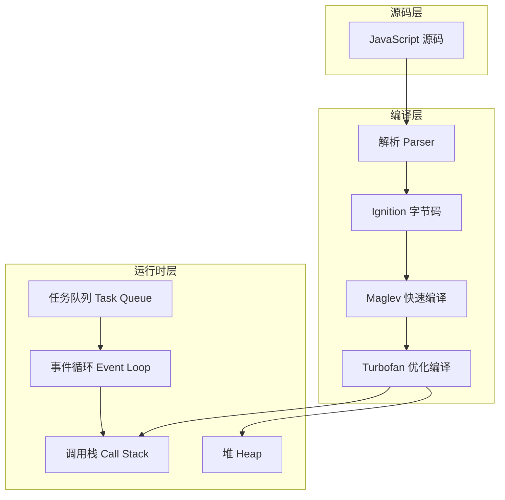
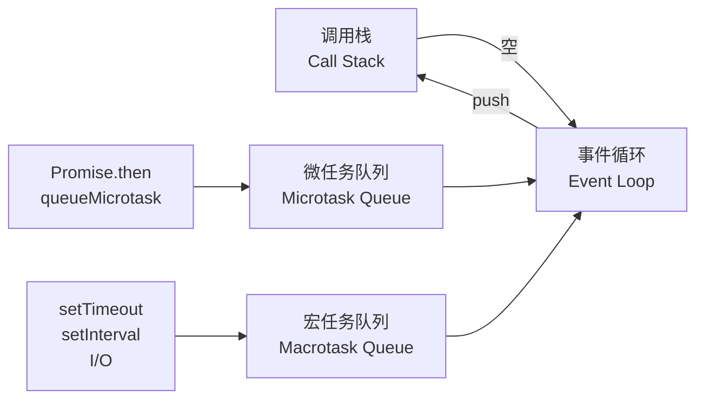
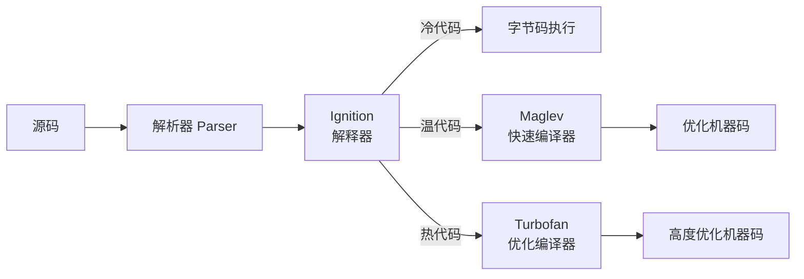
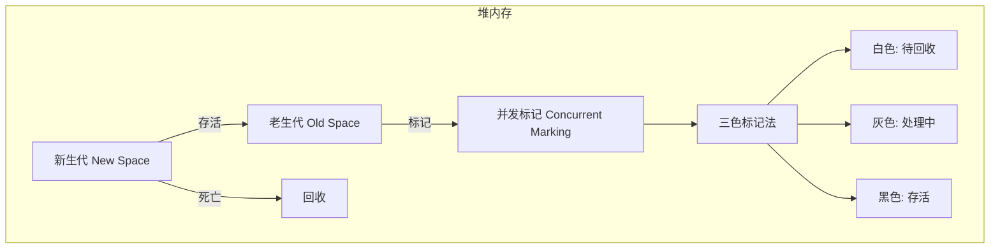

# 执行模型深入解析 (10.3)

> 深入 JavaScript 代码的执行机制，从调用栈、事件循环到 V8 引擎的三层编译模型与垃圾回收策略。

## 执行模型全景



## 调用栈与执行上下文

JavaScript 使用单线程模型，所有同步代码在调用栈上顺序执行：

```mermaid
flowchart TB
    subgraph 调用栈
        A[全局执行上下文] --> B[foo()]
        B --> C[bar()]
        C --> D[baz()]
    end
    subgraph 堆
        E[对象 &#123; x: 1 &#125;]
        F[数组 [1,2,3]]
        G[函数对象]
    end
```

```javascript
function foo() &#123;
  console.log('foo start');
  bar();
  console.log('foo end');
&#125;

function bar() &#123;
  console.log('bar');
  baz();
&#125;

function baz() &#123;
  console.log('baz');
&#125;

foo();
// 输出顺序: foo start → bar → baz → foo end
```

## 事件循环：异步编程的基石



### 执行顺序规则

```javascript
console.log('1');
setTimeout(() => console.log('2'), 0);
Promise.resolve().then(() => console.log('3'));
console.log('4');

// 输出: 1 → 4 → 3 → 2
// 解释: 同步 → 微任务 → 宏任务
```

| 阶段 | 优先级 | 示例 |
|------|--------|------|
| 同步代码 | 最高 | `console.log()`、函数调用 |
| 微任务 (Microtask) | 高 | `Promise.then()`、`queueMicrotask()`、`MutationObserver` |
| 宏任务 (Macrotask) | 低 | `setTimeout()`、`setInterval()`、`I/O`、UI 渲染 |

## V8 编译管线

V8 采用**三层编译模型**，根据代码热度动态选择编译策略：



| 编译器 | 启动延迟 | 峰值性能 | 优化策略 | 适用场景 |
|--------|----------|----------|----------|----------|
| Ignition | 零 | 低 | 无 | 冷代码、一次性代码 |
| Maglev | 低 | 中 | 基本优化 | 温代码、中等频率 |
| Turbofan | 高 | 最高 | 推测性优化、内联缓存 | 热代码、高频循环 |

## 内存管理与垃圾回收

V8 使用**Orinoco**垃圾回收器，基于分代收集理论：



| 区域 | 算法 | 特点 |
|------|------|------|
| 新生代 | Scavenge（复制算法） | 高效、暂停短、频繁执行 |
| 老生代 | Mark-Sweep + Mark-Compact | 并发标记、增量整理 |

### 内存泄漏常见模式

```javascript
// 1. 闭包引用
function createLeak() &#123;
  const hugeArray = new Array(1e6).fill('x');
  return () => hugeArray[0]; // hugeArray 永远不会被释放
&#125;

// 2. 定时器未清理
const intervalId = setInterval(() => &#123; /* ... */ &#125;, 1000);
// 忘记 clearInterval(intervalId)

// 3. DOM 引用（浏览器）
const elements = [];
document.querySelectorAll('.item').forEach(el => &#123;
  elements.push(el); // 即使从 DOM 移除，仍被 JS 引用
&#125;);

// 4. Map / Set 未清理
const cache = new Map();
function getData(key) &#123;
  if (!cache.has(key)) &#123;
    cache.set(key, fetchData(key)); // 持续增长
  &#125;
  return cache.get(key);
&#125;
```

## 核心文档

| 文档 | 主题 | 文件 |
|------|------|------|
| 运行时深度解析 | 执行模型总览 | [查看](../../10-fundamentals/10.3-execution-model/runtime-deep-dive.md) |
| V8 管道详解 | 编译管线完整解析 | [查看](../../10-fundamentals/10.3-execution-model/v8-pipeline/README.md) |
| JIT 状态机 | 即时编译的状态转换 | [查看](../../10-fundamentals/10.3-execution-model/jit-states/README.md) |

## 代码示例

| 示例 | 主题 | 文件 |
|------|------|------|
| 执行流 | 调用栈与执行上下文 | [查看](../../10-fundamentals/10.3-execution-model/code-examples/execution-flow/README.md) |
| 执行模型 | 事件循环与异步机制 | [查看](../../10-fundamentals/10.3-execution-model/code-examples/README.md) |

## 交叉引用

- **[语言语义深入解析](./language-semantics)** — 代码的语法结构如何映射到执行语义
- **[对象模型深入解析](./object-model)** — 对象在内存中的表示与原型链查找
- **[内存模型](/programming-principles/08-memory-models)** — 并发环境下的内存一致性
- **[性能工程专题](/performance-engineering/)** — 基于执行模型的性能优化实践

---

 [← 返回首页](/)
