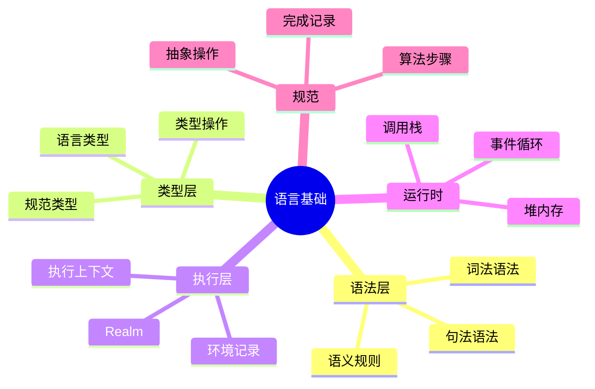

# JavaScript/TypeScript 语言基础

> 从 ECMAScript 规范到工程实践，系统理解 JavaScript/TypeScript 语言的核心机制。

## 导读导航

| 章节 | 主题 | 描述 |
|------|------|------|
| [语言语义 (10.1)](./language-semantics) | 核心特性演进 | ES2020–ES2025 关键特性与语法语义 |
| [类型系统 (10.2)](./type-system) | 类型理论基础 | 结构类型、泛型、条件类型与变型 |
| [执行模型 (10.3)](./execution-model) | 运行时机制 | 调用栈、事件循环、V8 编译管线与 GC |
| [模块系统 (10.4)](./module-system) | 模块化机制 | ESM、CommonJS、循环依赖与互操作 |
| [对象模型 (10.5)](./object-model) | 对象与原型 | 原型链、Proxy/Reflect、私有字段 |
| [ECMAScript 规范 (10.6)](./ecmascript-spec) | 规范阅读指南 | 抽象操作、Completion Records、环境记录 |
| [学术前沿 (10.7)](./academic-frontiers) | 研究前沿 | 守卫域理论、TSGo 原生编译器、形式化验证 |

## 知识结构

## 核心资源

- **10-fundamentals 根目录** — 完整的语言核心文档与代码示例
- **TypeScript 类型系统专题** — 19篇类型系统深度文档
- **编程原则专题** — 类型论、语义学与形式方法

---

 [← 返回首页](/)
