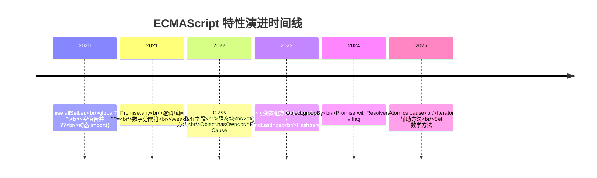

# 语言语义深入解析 (10.1)

> 全面梳理 JavaScript/TypeScript 语言核心特性的演进脉络，从 ES2020 到 ES2025 的关键语法语义与工程实践。

## 语言演进概览



## 特性分类矩阵

| 类别 | ES2020 | ES2021 | ES2022 | ES2023 | ES2024 | ES2025 |
|------|--------|--------|--------|--------|--------|--------|
| **数据类型** | BigInt | — | — | — | — | — |
| **异步编程** | Promise.allSettled | Promise.any | — | — | Promise.withResolvers | — |
| **运算符** | 可选链 / 空值合并 | 逻辑赋值 | — | — | — | — |
| **Class** | 动态 import() | — | 私有字段 / 静态块 | — | — | — |
| **数组/集合** | — | — | at() | 不可变方法 / findLast | groupBy | Iterator 辅助 / Set 运算 |
| **字符串** | — | replaceAll | — | — | isWellFormed | — |
| **正则** | — | — | — | — | v flag | — |
| **并发** | — | WeakRef | — | — | — | Atomics.pause |

## 核心特性速查

### 空值安全访问：`?.` 与 `??`

```typescript
// 可选链 — 避免深层属性访问的 null 检查地狱
const userCity = user?.address?.city ?? 'Unknown';

// 空值合并 — 仅对 null/undefined 生效，不覆盖空字符串和 0
const count = response.data.count ?? 0; // 0 不会被覆盖
const name = response.data.name || 'Guest'; // '' 会被覆盖
```

### BigInt：超越 Number.MAX_SAFE_INTEGER

```typescript
const huge = 9007199254740993n; // 超过 2^53-1 的精确整数
const sum = huge + 1n;

// 注意：BigInt 与 Number 不能直接混合运算
// typeof 1n === 'bigint'
```

### 顶层 await 与动态 import

```typescript
// 模块顶层直接使用 await（ES2022）
const &#123; parse &#125; = await import('./parser.js');

// 条件加载，实现真正的代码分割
const heavyLib = process.env.NODE_ENV === 'production'
  ? await import('./heavy-prod.js')
  : await import('./heavy-dev.js');
```

### Class 私有字段（ES2022）

```typescript
class Counter &#123;
  #count = 0;          // 私有字段，外部不可访问
  static #instances = 0; // 静态私有字段

  increment() &#123;
    this.#count++;
  &#125;

  get #formatted() &#123;  // 私有访问器
    return `Count: $&#123;this.#count&#125;`;
  &#125;
&#125;
```

### 不可变数组方法（ES2023）

```typescript
const arr = [3, 1, 4, 1, 5];

// 原数组不变，返回新数组
const sorted = arr.toSorted((a, b) => a - b);
const reversed = arr.toReversed();
const spliced = arr.toSpliced(1, 2, 9, 9);

// 对应索引替换
const replaced = arr.with(2, 99);
```

## 核心文档

| 文档 | 主题 | 文件 |
|------|------|------|
| README | 语言核心特性全览 | [查看](../../10-fundamentals/10.1-language-semantics/README.md) |
| 类型系统 | 类型与变量系统深度解析 | [查看](../../10-fundamentals/10.1-language-semantics/01-types/README.md) |
| 控制流 | 条件、循环与异常机制 | [查看](../../10-fundamentals/10.1-language-semantics/03-control-flow/README.md) |
| 函数 | 函数定义、调用与闭包 | [查看](../../10-fundamentals/10.1-language-semantics/04-functions/README.md) |
| 对象与类 | 面向对象与原型系统 | [查看](../../10-fundamentals/10.1-language-semantics/05-objects-classes/README.md) |
| 元编程 | Proxy、Reflect 与 Symbol | [查看](../../10-fundamentals/10.1-language-semantics/07-metaprogramming/README.md) |

## 代码示例

| 示例 | 主题 | 文件 |
|------|------|------|
| 01 | 变量系统深度对比 | [查看](../../10-fundamentals/10.1-language-semantics/code-examples/variable-system/README.md) |
| 02 | JS 与 TS 差异全景 | [查看](../../10-fundamentals/10.1-language-semantics/code-examples/js-ts-difference/README.md) |
| 03 | 控制流与执行流 | [查看](../../10-fundamentals/10.1-language-semantics/code-examples/control-flow/README.md) |

## 交叉引用

- **[类型系统深入解析](./type-system)** — TypeScript 类型系统的形式化基础
- **[执行模型深入解析](./execution-model)** — 代码在引擎中的实际运行方式
- **[ECMAScript 规范导读](./ecmascript-spec)** — 如何阅读和理解 ECMA-262 规范
- **[TypeScript 高级模式](/guide/typescript-advanced-patterns)** — 类型驱动的工程实践

---

 [← 返回首页](/)
