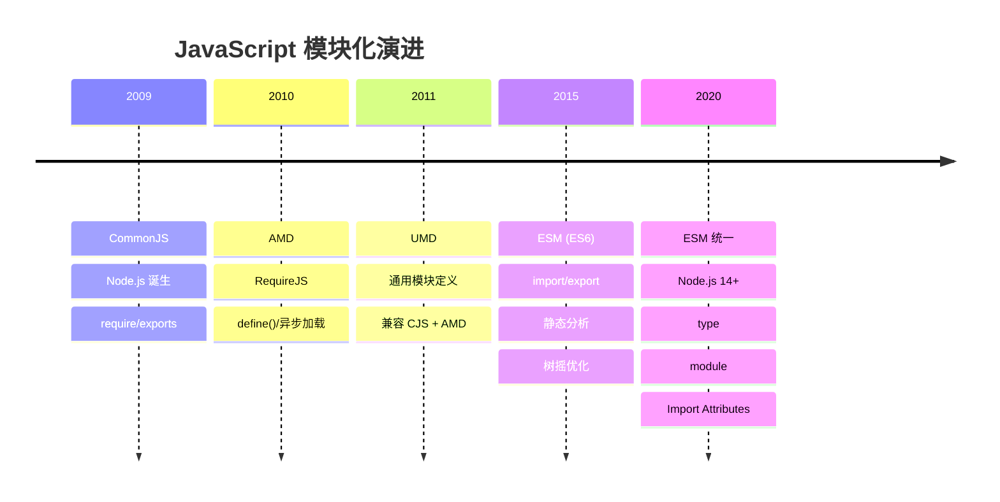
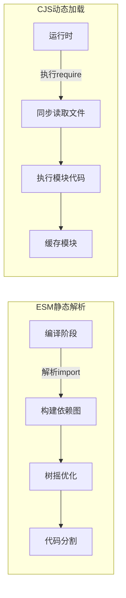
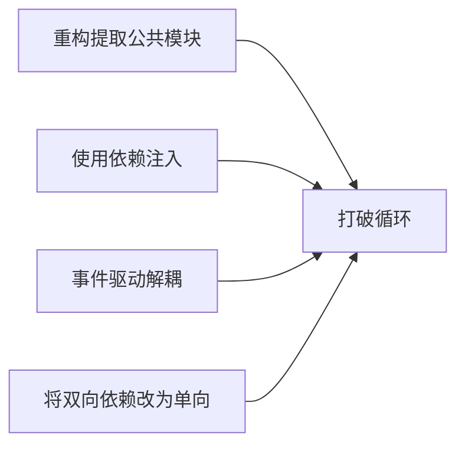

# 模块系统深入解析 (10.4)

> 模块系统是 JavaScript 工程化的基石。从早期的 IIFE 和 AMD，到 Node.js 的 CommonJS，再到 ES2015 的标准化 ESM，JavaScript 的模块化经历了漫长的演进。本导读将系统梳理这一演进脉络，深入解析两种主流模块系统的底层机制，并提供工程实践中的最佳方案。

## 模块系统的演进



## ESM 与 CommonJS 核心差异

| 特性 | ESM (ES Modules) | CommonJS (CJS) |
|------|-----------------|----------------|
| **语法** | `import` / `export` | `require` / `module.exports` |
| **加载时机** | 编译时静态解析 | 运行时动态加载 |
| **同步/异步** | 异步加载 | 同步加载 |
| **树摇优化** | ✅ 支持 | ❌ 不支持 |
| **循环依赖** | 部分支持 | 有限支持 |
| **顶层 await** | ✅ 支持 | ❌ 不支持 |
| **浏览器支持** | 原生支持 | 需打包工具 |

### 静态解析 vs 动态加载



## ESM 核心机制

### 导出模式

```typescript
// 命名导出
export const PI = 3.14159;
export function calculateArea(r: number): number &#123;
  return PI * r * r;
&#125;

// 默认导出
export default class Circle &#123;
  constructor(private radius: number) &#123;&#125;
  area() &#123; return PI * this.radius ** 2; &#125;
&#125;

// 聚合导出（重新导出）
export * from './math-utils';
export &#123; default as Utils &#125; from './utils';
```

### 导入模式

```typescript
// 命名导入
import &#123; PI, calculateArea &#125; from './math';

// 默认导入
import Circle from './circle';

// 命名空间导入
import * as math from './math';

// 动态导入（代码分割）
const heavyModule = await import('./heavy-module');

// 带断言的导入
import json from './data.json' with &#123; type: 'json' &#125;;
```

## CommonJS 核心机制

### 模块包装器

Node.js 在执行 CJS 模块前，会将其包装在一个函数中：

```javascript
(function(exports, require, module, __filename, __dirname) &#123;
  // 模块代码实际在这里执行
  module.exports = &#123; foo: 'bar' &#125;;
&#125;);
```

### require 解析算法

```mermaid
flowchart TD
    A[require'x'] --> B&#123;核心模块?&#125;
    B -->|是| C[加载核心模块]
    B -->|否| D&#123;路径以./或../开头?&#125;
    D -->|是| E[解析为相对路径]
    E --> F[.js / .json / .node]
    D -->|否| G[node_modules查找]
    G --> H[逐层向上查找]
    H --> I[解析package.json main]
    I --> J[加载目标文件]
```

## 循环依赖处理

循环依赖是模块化中最棘手的问题之一。ESM 和 CJS 的处理方式截然不同：

### ESM 的循环依赖

```typescript
// a.ts
import &#123; b &#125; from './b';
console.log('a.ts 执行');
export const a = 'A';

// b.ts
import &#123; a &#125; from './a';
console.log('b.ts 执行');
export const b = 'B';
```

**ESM 的处理方式**：

1. 构建阶段解析所有 `import`，建立依赖图
2. 执行阶段按深度优先顺序执行
3. 遇到循环时，未完成的导出为 TDZ（暂时性死区）
4. 循环依赖的模块只能使用已完成的导出

### CJS 的循环依赖

```javascript
// a.js
const b = require('./b');
console.log('a.js:', b); // 可能得到不完整的对象
module.exports = &#123; name: 'A' &#125;;

// b.js
const a = require('./a');
console.log('b.js:', a); // 得到空对象或部分对象
module.exports = &#123; name: 'B' &#125;;
```

**CJS 的处理方式**：

1. 首次 `require` 时执行模块代码
2. 模块执行前先将空对象放入缓存
3. 循环依赖时返回缓存中的不完整对象
4. 完整对象在模块执行完毕后可用

### 循环依赖最佳实践



## ESM/CJS 互操作

### Node.js 中的互操作

```typescript
// ESM 导入 CJS
import cjsModule from './commonjs-module.js'; // 获取 module.exports
import &#123; namedExport &#125; from './commonjs-module.js'; // 获取 exports.xxx（Node 14+）

// CJS 导入 ESM
// CJS 中不能直接 require ESM，需要动态 import
async function loadEsm() &#123;
  const esmModule = await import('./esm-module.mjs');
  return esmModule.default;
&#125;
```

### package.json 配置

```json
&#123;
  "name": "my-lib",
  "type": "module",
  "main": "./dist/index.cjs",
  "module": "./dist/index.mjs",
  "exports": &#123;
    ".": &#123;
      "import": &#123;
        "types": "./dist/index.d.mts",
        "default": "./dist/index.mjs"
      &#125;,
      "require": &#123;
        "types": "./dist/index.d.cts",
        "default": "./dist/index.cjs"
      &#125;
    &#125;
  &#125;
&#125;
```

## 核心文档

| 文档 | 主题 | 文件 |
|------|------|------|
| README | 模块系统总览 | [查看](../../10-fundamentals/10.4-module-system/README.md) |
| ESM/CJS 互操作 | ESM 与 CommonJS 的互操作机制 | [查看](../../10-fundamentals/10.4-module-system/esm-cjs-interop.md) |
| 循环依赖 | 循环依赖的检测与处理 | [查看](../../10-fundamentals/10.4-module-system/circular-dependency.md) |
| 导入属性与 defer | Import Attributes 与 defer 语义 | [查看](../../10-fundamentals/10.4-module-system/import-attributes-defer.md) |

## 代码示例

| 示例 | 主题 | 文件 |
|------|------|------|
| 01 | 模块系统概览 | [查看](../../10-fundamentals/10.4-module-system/code-examples/01-module-system-overview.md) |
| 02 | ESM 深度解析 | [查看](../../10-fundamentals/10.4-module-system/code-examples/02-esm-deep-dive.md) |
| 03 | CommonJS 机制 | [查看](../../10-fundamentals/10.4-module-system/code-examples/03-commonjs-mechanics.md) |
| 04 | CJS/ESM 互操作 | [查看](../../10-fundamentals/10.4-module-system/code-examples/04-cjs-esm-interop.md) |
| 05 | 模块解析 | [查看](../../10-fundamentals/10.4-module-system/code-examples/05-module-resolution.md) |
| 06 | 循环依赖 | [查看](../../10-fundamentals/10.4-module-system/code-examples/06-cyclic-dependencies.md) |

## 交叉引用

- **[执行模型深入解析](./execution-model)** — 模块加载的底层执行机制
- **[对象模型深入解析](./object-model)** — 模块导出值的内存表示
- **[ECMAScript 规范导读](./ecmascript-spec)** — 模块语义的形式化定义
- **[模块系统专题](/module-system/)** — 完整的模块系统深度专题（8篇文档）

---

 [← 返回首页](/)
