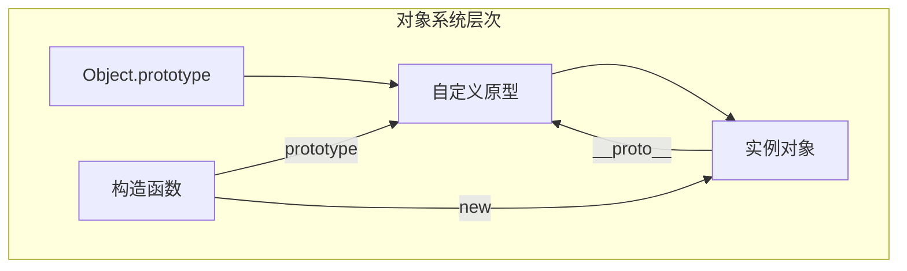
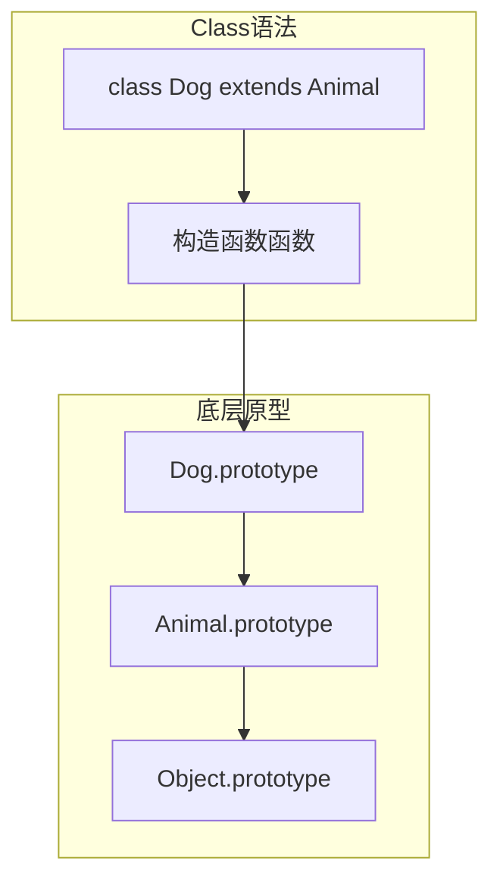

# 对象模型深入解析 (10.5)

> JavaScript 是一门基于原型的面向对象语言。与基于类的语言（Java、C++）不同，JavaScript 的对象系统建立在原型委托之上，通过 `Object.create`、`new` 操作符和 `class` 语法糖提供了灵活的面向对象编程能力。

## 对象模型的核心概念



### 对象的本质

在 JavaScript 中，对象本质上是一个**属性的集合**（Property Collection），每个属性都是一个键值对，带有自己的特征（Property Descriptor）：

```javascript
const obj = &#123; name: 'Alice' &#125;;

// 查看属性的完整描述
const descriptor = Object.getOwnPropertyDescriptor(obj, 'name');
console.log(descriptor);
// &#123;
//   value: 'Alice',
//   writable: true,
//   enumerable: true,
//   configurable: true
// &#125;
```

| 特征 | 说明 | 默认值 |
|------|------|--------|
| `value` | 属性值 | `undefined` |
| `writable` | 是否可写 | `true` |
| `enumerable` | 是否可枚举 | `true` |
| `configurable` | 是否可配置 | `true` |
| `get` | 读取器函数 | `undefined` |
| `set` | 写入器函数 | `undefined` |

## 原型链机制

### 原型链查找流程

```mermaid
flowchart LR
    A[dog.speak()] --> B&#123;dog自身有speak?&#125;
    B -->|否| C[Dog.prototype]
    C -->&#123;有speak?&#125; D[Animal.prototype]
    D -->&#123;有speak?&#125; E[Object.prototype]
    E -->|否| F[undefined]
```

```typescript
class Animal &#123;
  constructor(public name: string) &#123;&#125;
  speak() &#123;
    return `$&#123;this.name&#125; makes a sound`;
  &#125;
&#125;

class Dog extends Animal &#123;
  speak() &#123;
    return `$&#123;this.name&#125; barks`;
  &#125;
&#125;

const dog = new Dog('Rex');

// 原型链验证
console.log(dog.__proto__ === Dog.prototype); // true
console.log(Dog.prototype.__proto__ === Animal.prototype); // true
console.log(Animal.prototype.__proto__ === Object.prototype); // true
```

### 原型链的性能影响

| 操作 | 复杂度 | 说明 |
|------|--------|------|
| 属性读取 | O(k) | k = 原型链深度 |
| 属性写入 | O(1) | 直接写入自身 |
| `hasOwnProperty` | O(1) | 不遍历原型链 |
| `in` 操作符 | O(k) | 遍历原型链 |

**优化建议**：频繁访问的属性应放在对象自身，而非原型上。

## Class 语法与原型

`class` 是 JavaScript 中的语法糖，底层仍然是原型系统：



### 私有字段（ES2022）

```typescript
class BankAccount &#123;
  #balance = 0;  // 私有字段

  deposit(amount: number) &#123;
    this.#balance += amount;
  &#125;

  get #formattedBalance() &#123;  // 私有访问器
    return `$&#123;this.#balance.toFixed(2)&#125;`;
  &#125;

  static #totalAccounts = 0;  // 静态私有字段

  constructor() &#123;
    BankAccount.#totalAccounts++;
  &#125;
&#125;

const account = new BankAccount();
account.deposit(100);
// account.#balance; // SyntaxError: 外部无法访问
```

## Proxy 与 Reflect

### Proxy 拦截器

Proxy 允许你拦截对象上的基本操作：

```typescript
const handler: ProxyHandler&lt;any&gt; = &#123;
  get(target, prop, receiver) &#123;
    console.log(`Getting $&#123;String(prop)&#125;`);
    return Reflect.get(target, prop, receiver);
  &#125;,

  set(target, prop, value, receiver) &#123;
    console.log(`Setting $&#123;String(prop)&#125; = $&#123;value&#125;`);
    return Reflect.set(target, prop, value, receiver);
  &#125;,

  has(target, prop) &#123;
    console.log(`Checking $&#123;String(prop)&#125;`);
    return Reflect.has(target, prop);
  &#125;,
&#125;;

const proxy = new Proxy(&#123; name: 'Alice' &#125;, handler);
proxy.name; // Getting name
proxy.age = 30; // Setting age = 30
'name' in proxy; // Checking name
```

### 常见 Proxy 应用场景

| 场景 | 实现方式 | 示例 |
|------|----------|------|
| 数据验证 | `set` 拦截器 | 校验赋值类型 |
| 懒加载 | `get` 拦截器 | 按需初始化 |
| 响应式系统 | `set` + 依赖收集 | Vue 3 Reactivity |
| 日志记录 | 多个拦截器 | API 调用追踪 |
| 不可变对象 | `set` 返回 false | 只读保护 |

## 核心文档

| 文档 | 主题 | 文件 |
|------|------|------|
| README | 对象模型总览 | [查看](../../10-fundamentals/10.5-object-model/README.md) |
| 原型链 | 原型继承与原型链机制 | [查看](../../10-fundamentals/10.5-object-model/prototype-chain.md) |
| 属性描述符 | 属性描述符与元编程 | [查看](../../10-fundamentals/10.5-object-model/property-descriptors.md) |
| Proxy/Reflect | 代理与反射 API | [查看](../../10-fundamentals/10.5-object-model/proxy-reflect.md) |
| 私有字段 | 类私有字段与弱引用 | [查看](../../10-fundamentals/10.5-object-model/private-fields.md) |

## 代码示例

| 示例 | 主题 | 文件 |
|------|------|------|
| 01 | 对象模型概览 | [查看](../../10-fundamentals/10.5-object-model/code-examples/01-object-model-overview.md) |
| 02 | 原型链 | [查看](../../10-fundamentals/10.5-object-model/code-examples/02-prototype-chain.md) |
| 03 | Proxy 与 Reflect | [查看](../../10-fundamentals/10.5-object-model/code-examples/03-proxy-and-reflect.md) |
| 04 | 私有字段 | [查看](../../10-fundamentals/10.5-object-model/code-examples/04-private-fields.md) |
| 05 | 对象创建模式 | [查看](../../10-fundamentals/10.5-object-model/code-examples/05-object-creation-patterns.md) |

## 交叉引用

- **[语言语义深入解析](./language-semantics)** — 对象的语法定义与语义规则
- **[执行模型深入解析](./execution-model)** — 对象在内存中的表示与生命周期
- **[编程原则 / 内存模型](/programming-principles/08-memory-models)** — 对象引用的内存一致性
- **[对象模型专题](/object-model/)** — 完整的对象模型深度专题（7篇文档）

---

 [← 返回首页](/)
