---
title: '微服务架构完整指南'
---

# 微服务架构完整指南

> 基于 TypeScript + NestJS/Express 的微服务实战指南

---

## 目录

- [微服务架构完整指南](#微服务架构完整指南)
  - [目录](#目录)
  - [1. 微服务架构基础理论](#1-微服务架构基础理论)
    - [1.1 概念解释](#11-概念解释)
    - [1.2 架构图](#12-架构图)
    - [1.3 优缺点对比](#13-优缺点对比)
    - [1.4 代码示例 - NestJS 微服务基础结构](#14-代码示例---nestjs-微服务基础结构)
    - [1.5 工具推荐](#15-工具推荐)
  - [2. 服务拆分策略](#2-服务拆分策略)
    - [2.1 概念解释](#21-概念解释)
    - [2.2 拆分策略对比](#22-拆分策略对比)
    - [2.3 领域驱动设计 DDD 拆分示例](#23-领域驱动设计-ddd-拆分示例)
    - [2.4 防腐层 Anti-Corruption Layer 实现](#24-防腐层-anti-corruption-layer-实现)
    - [2.5 拆分决策矩阵](#25-拆分决策矩阵)
    - [2.6 工具推荐](#26-工具推荐)
  - [3. 服务间通信](#3-服务间通信)
    - [3.1 概念解释](#31-概念解释)
    - [3.2 同步通信架构图](#32-同步通信架构图)
    - [3.3 同步通信 - REST API 实现](#33-同步通信---rest-api-实现)
    - [3.4 同步通信 - gRPC 实现](#34-同步通信---grpc-实现)
    - [3.5 异步通信架构图](#35-异步通信架构图)
    - [3.6 异步通信 - RabbitMQ 实现](#36-异步通信---rabbitmq-实现)
    - [3.7 异步通信 - Kafka 实现](#37-异步通信---kafka-实现)
    - [3.8 通信方式选择指南](#38-通信方式选择指南)
    - [3.9 工具推荐](#39-工具推荐)
  - [4. 服务发现](#4-服务发现)
    - [4.1 概念解释](#41-概念解释)
    - [4.2 架构图](#42-架构图)
    - [4.3 Consul 服务发现实现](#43-consul-服务发现实现)
    - [4.4 etcd 服务发现实现](#44-etcd-服务发现实现)
    - [4.5 Kubernetes DNS 服务发现](#45-kubernetes-dns-服务发现)
    - [4.6 服务发现选择对比](#46-服务发现选择对比)
    - [4.7 工具推荐](#47-工具推荐)
  - [5. API网关模式](#5-api网关模式)
    - [5.1 概念解释](#51-概念解释)
    - [5.2 架构图](#52-架构图)
    - [5.3 NestJS 自定义 API 网关](#53-nestjs-自定义-api-网关)
    - [5.4 GraphQL 网关 - Apollo Federation](#54-graphql-网关---apollo-federation)
    - [5.5 Kong 网关集成](#55-kong-网关集成)
    - [5.6 工具推荐](#56-工具推荐)
  - [6. 熔断限流降级策略](#6-熔断限流降级策略)
    - [6.1 概念解释](#61-概念解释)
    - [6.2 熔断器状态机](#62-熔断器状态机)
    - [6.3 熔断器实现](#63-熔断器实现)
    - [6.4 限流实现](#64-限流实现)
    - [6.5 降级实现](#65-降级实现)
    - [6.6 综合保护模式](#66-综合保护模式)
    - [6.7 工具推荐](#67-工具推荐)
  - [7. 分布式事务](#7-分布式事务)
    - [7.1 概念解释](#71-概念解释)
    - [7.2 事务模式对比](#72-事务模式对比)
    - [7.3 Saga 模式](#73-saga-模式)
    - [7.4 Saga 协调器实现](#74-saga-协调器实现)
    - [7.5 Saga 订单流程示例](#75-saga-订单流程示例)
    - [7.6 TCC 模式](#76-tcc-模式)
    - [7.7 本地消息表](#77-本地消息表)
    - [7.8 工具推荐](#78-工具推荐)
  - [8. 监控和可观测性](#8-监控和可观测性)
    - [8.1 概念解释](#81-概念解释)
    - [8.2 可观测性架构](#82-可观测性架构)
    - [8.3 OpenTelemetry 集成](#83-opentelemetry-集成)
    - [8.4 结构化日志](#84-结构化日志)
    - [8.5 指标收集](#85-指标收集)
    - [8.6 健康检查](#86-健康检查)
    - [8.7 告警配置](#87-告警配置)
    - [8.8 工具推荐](#88-工具推荐)
  - [9. 数据一致性策略](#9-数据一致性策略)
    - [9.1 概念解释](#91-概念解释)
    - [9.2 数据一致性策略架构](#92-数据一致性策略架构)
    - [9.3 事件溯源 (Event Sourcing)](#93-事件溯源-event-sourcing)
    - [9.4 CQRS 模式](#94-cqrs-模式)
    - [9.5 冲突解决策略](#95-冲突解决策略)
    - [9.6 数据同步模式](#96-数据同步模式)
    - [9.7 工具推荐](#97-工具推荐)
  - [10. 部署策略](#10-部署策略)
    - [10.1 概念解释](#101-概念解释)
    - [10.2 部署策略架构图](#102-部署策略架构图)
    - [10.3 Kubernetes 部署配置](#103-kubernetes-部署配置)
    - [10.4 蓝绿部署实现](#104-蓝绿部署实现)
    - [10.5 金丝雀发布实现](#105-金丝雀发布实现)
    - [10.6 CI/CD Pipeline](#106-cicd-pipeline)
    - [10.7 功能开关 (Feature Flags)](#107-功能开关-feature-flags)
    - [10.8 工具推荐](#108-工具推荐)
  - [总结](#总结)

---

## 1. 微服务架构基础理论

### 1.1 概念解释

微服务架构是一种将单一应用程序拆分为一组小型服务的方法，每个服务运行在自己的进程中，服务间通过轻量级机制（通常是HTTP API）进行通信。

**核心特征：**

| 特征 | 说明 |
|------|------|
| 单一职责 | 每个服务只负责一个业务能力 |
| 独立部署 | 服务可以独立构建、部署、扩展 |
| 去中心化 | 技术栈自治，数据独立管理 |
| 容错设计 | 单个服务失败不影响整体 |
| 自动化 | CI/CD、监控、测试自动化 |

### 1.2 架构图

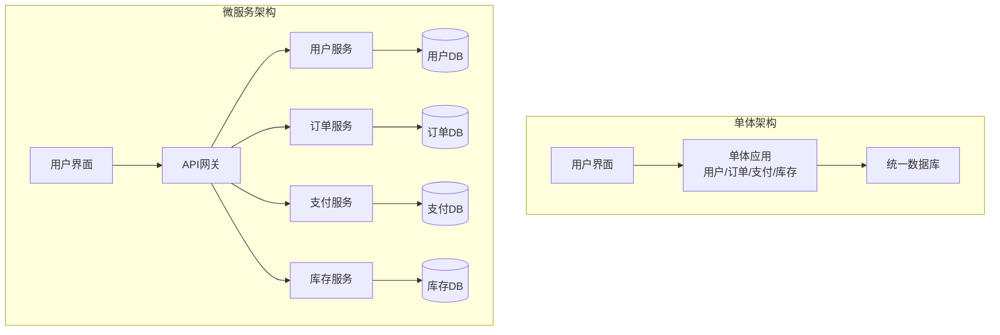

### 1.3 优缺点对比

```
┌─────────────────────────────────────────────────────────────────┐
│                      微服务 vs 单体架构                          │
├──────────────────┬──────────────────┬───────────────────────────┤
│      维度        │     单体架构      │        微服务架构          │
├──────────────────┼──────────────────┼───────────────────────────┤
│ 开发复杂度       │ 低               │ 高（需处理分布式复杂性）    │
│ 部署独立性       │ 低（全量部署）    │ 高（服务独立部署）          │
│ 技术栈灵活性     │ 低               │ 高                         │
│ 扩展性           │ 整体扩展         │ 按需扩展特定服务            │
│ 故障隔离         │ 低               │ 高                         │
│ 数据一致性       │ 容易保证         │ 需要额外机制                │
│ 运维复杂度       │ 低               │ 高                         │
│ 团队规模适配     │ 小型团队         │ 大型团队/多团队             │
└──────────────────┴──────────────────┴───────────────────────────┘
```

### 1.4 代码示例 - NestJS 微服务基础结构

```typescript
// apps/user-service/src/main.ts
import { NestFactory } from '@nestjs/core';
import { Transport, MicroserviceOptions } from '@nestjs/microservices';
import { UserModule } from './user.module';

async function bootstrap() {
  // HTTP 服务（用于外部API调用）
  const httpApp = await NestFactory.create(UserModule);
  await httpApp.listen(3001);

  // TCP 微服务（用于服务间通信）
  const microservice = await NestFactory.createMicroservice<MicroserviceOptions>(
    UserModule,
    {
      transport: Transport.TCP,
      options: {
        host: '0.0.0.0',
        port: 4001,
      },
    },
  );

  await microservice.listen();
  console.log('User Service is running on: HTTP 3001, TCP 4001');
}
bootstrap();
```

```typescript
// apps/user-service/src/user.controller.ts
import { Controller, Get, Post, Body, Param } from '@nestjs/common';
import { MessagePattern, EventPattern } from '@nestjs/microservices';
import { UserService } from './user.service';

@Controller('users')
export class UserController {
  constructor(private readonly userService: UserService) {}

  // HTTP API 接口
  @Get(':id')
  async findOne(@Param('id') id: string) {
    return this.userService.findById(id);
  }

  @Post()
  async create(@Body() createUserDto: CreateUserDto) {
    return this.userService.create(createUserDto);
  }

  // 微服务消息模式接口
  @MessagePattern({ cmd: 'get_user' })
  async getUser(data: { id: string }) {
    return this.userService.findById(data.id);
  }

  @MessagePattern({ cmd: 'validate_user' })
  async validateUser(data: { email: string; password: string }) {
    return this.userService.validateUser(data.email, data.password);
  }

  // 事件订阅模式
  @EventPattern('order_created')
  async handleOrderCreated(data: { userId: string; orderId: string }) {
    await this.userService.incrementOrderCount(data.userId);
  }
}
```

### 1.5 工具推荐

| 类别 | 工具 | 用途 |
|------|------|------|
| 框架 | NestJS | 构建微服务的首选框架 |
| 框架 | Express/Fastify | 轻量级HTTP服务 |
| 包管理 | Nx/Turborepo | 单体仓库管理 |
| 构建 | Docker | 容器化部署 |
| 编排 | Kubernetes | 容器编排平台 |
| 通信 | gRPC | 高性能RPC框架 |
| 通信 | RabbitMQ/Kafka | 消息队列 |

---

## 2. 服务拆分策略

### 2.1 概念解释

服务拆分是微服务架构设计的核心。合理的拆分能够提升开发效率，不合理的拆分则会导致分布式单体。

**拆分原则：**

1. **单一职责原则 (SRP)** - 一个服务只做一件事
2. **高内聚低耦合** - 相关功能聚合，减少服务间依赖
3. **业务边界清晰** - 基于领域驱动设计 (DDD) 的限界上下文
4. **独立演进的粒度** - 小到2周能重写，大到不超过团队规模

### 2.2 拆分策略对比

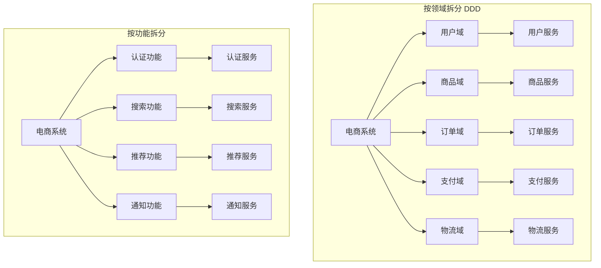

### 2.3 领域驱动设计 DDD 拆分示例

```typescript
// 用户领域 - 限界上下文
// apps/user-service/src/domain/aggregates/user.aggregate.ts

export class User {
  private constructor(
    private readonly id: string,
    private email: string,
    private name: string,
    private password: string,
    private readonly createdAt: Date,
    private orderCount: number = 0,
    private addresses: Address[] = [],
  ) {}

  static create(props: CreateUserProps): User {
    // 领域规则验证
    if (!this.isValidEmail(props.email)) {
      throw new DomainException('Invalid email format');
    }
    if (props.password.length < 8) {
      throw new DomainException('Password must be at least 8 characters');
    }

    return new User(
      generateUUID(),
      props.email,
      props.name,
      hashPassword(props.password),
      new Date(),
    );
  }

  addAddress(address: Address): void {
    if (this.addresses.length >= 10) {
      throw new DomainException('Maximum 10 addresses allowed');
    }
    this.addresses.push(address);
  }

  incrementOrderCount(): void {
    this.orderCount++;
  }

  // 领域事件
  getDomainEvents(): DomainEvent[] {
    return this.events;
  }
}

// 值对象
export class Address {
  constructor(
    public readonly street: string,
    public readonly city: string,
    public readonly country: string,
    public readonly zipCode: string,
  ) {}
}
```

```typescript
// 订单领域 - 独立的限界上下文
// apps/order-service/src/domain/aggregates/order.aggregate.ts

export class Order {
  private constructor(
    private readonly id: string,
    private readonly userId: string,
    private items: OrderItem[],
    private status: OrderStatus,
    private totalAmount: Money,
    private readonly createdAt: Date,
    private events: DomainEvent[] = [],
  ) {}

  static create(props: CreateOrderProps): Order {
    const order = new Order(
      generateUUID(),
      props.userId,
      props.items,
      OrderStatus.PENDING,
      props.items.reduce((sum, item) => sum.add(item.subtotal), Money.zero()),
      new Date(),
    );

    order.addEvent(new OrderCreatedEvent(order.id, order.userId, order.totalAmount));
    return order;
  }

  pay(paymentId: string): void {
    if (this.status !== OrderStatus.PENDING) {
      throw new DomainException('Order can only be paid when pending');
    }
    this.status = OrderStatus.PAID;
    this.addEvent(new OrderPaidEvent(this.id, paymentId));
  }

  ship(trackingNumber: string): void {
    if (this.status !== OrderStatus.PAID) {
      throw new DomainException('Order must be paid before shipping');
    }
    this.status = OrderStatus.SHIPPED;
    this.addEvent(new OrderShippedEvent(this.id, trackingNumber));
  }
}

// 实体关系 - 订单上下文内的聚合
export class OrderItem {
  constructor(
    public readonly productId: string,
    public readonly productName: string,
    public readonly quantity: number,
    public readonly unitPrice: Money,
  ) {}

  get subtotal(): Money {
    return this.unitPrice.multiply(this.quantity);
  }
}
```

### 2.4 防腐层 Anti-Corruption Layer 实现

```typescript
// apps/order-service/src/infrastructure/adapters/user-adapter.service.ts

@Injectable()
export class UserAdapterService implements IUserService {
  constructor(
    @Inject(USER_SERVICE) private readonly userClient: ClientProxy,
  ) {}

  // 防腐层：将外部用户服务的数据转换为订单领域所需格式
  async getUserInfo(userId: string): Promise<UserInfo> {
    try {
      const externalUser = await firstValueFrom(
        this.userClient.send({ cmd: 'get_user' }, { id: userId })
      );

      // 数据转换：外部格式 -> 领域格式
      return {
        id: externalUser.id,
        email: externalUser.email,
        isVip: externalUser.orderCount > 100,
        addresses: externalUser.addresses.map(this.mapAddress),
      };
    } catch (error) {
      throw new UserServiceUnavailableException(userId);
    }
  }

  private mapAddress(externalAddr: any): Address {
    return new Address(
      externalAddr.street,
      externalAddr.city,
      externalAddr.country,
      externalAddr.zip,
    );
  }
}
```

### 2.5 拆分决策矩阵

```
┌──────────────────────────────────────────────────────────────────────┐
│                      服务拆分决策矩阵                                 │
├─────────────────────┬────────────────┬───────────────────────────────┤
│       维度          │    拆分为独立服务 │       保持在一起              │
├─────────────────────┼────────────────┼───────────────────────────────┤
│ 数据耦合度          │ 数据独立        │ 数据高度关联                   │
│ 变更频率            │ 变更频率差异大  │ 总是一起变更                   │
│ 团队结构            │ 不同团队维护    │ 同一团队维护                   │
│ 扩展需求            │ 扩展需求不同    │ 扩展需求相同                   │
│ 技术栈              │ 需要不同技术    │ 统一技术栈                     │
│ 事务边界            │ 可接受最终一致  │ 需要强一致性                   │
└─────────────────────┴────────────────┴───────────────────────────────┘
```

### 2.6 工具推荐

| 工具 | 用途 |
|------|------|
| Event Storming | 领域事件风暴，识别限界上下文 |
| Bounded Context Canvas | 可视化限界上下文 |
| Context Mapper | DDD 建模工具 |
| ArchUnit | 架构规则测试 |

---

## 3. 服务间通信

### 3.1 概念解释

微服务间的通信方式主要分为两大类：

| 通信模式 | 说明 | 适用场景 |
|---------|------|---------|
| **同步通信** | 请求-响应模式，调用方等待响应 | 需要实时结果、查询操作 |
| **异步通信** | 消息模式，发送后不等待响应 | 事件通知、解耦、削峰填谷 |

### 3.2 同步通信架构图

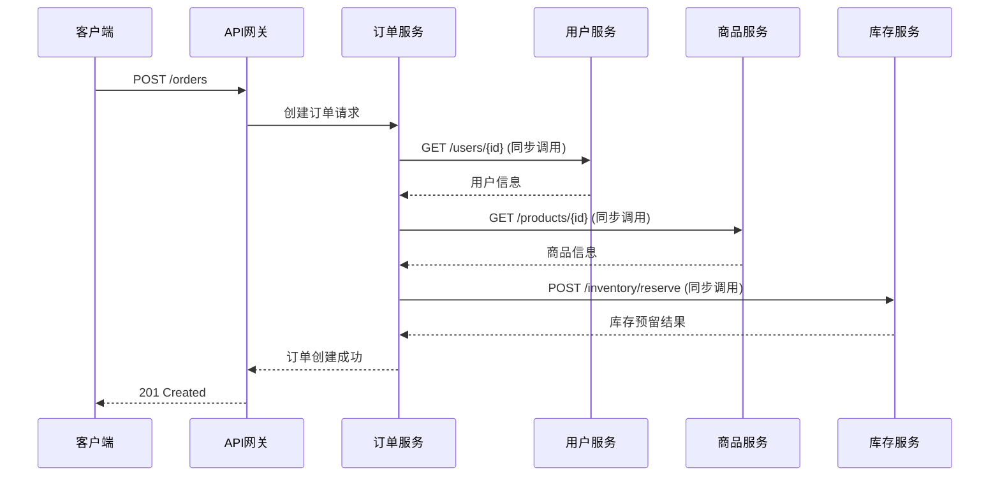

### 3.3 同步通信 - REST API 实现

```typescript
// 使用 Axios 进行 HTTP 服务调用
// libs/shared/src/http/http-client.service.ts

import { Injectable, HttpException } from '@nestjs/common';
import axios, { AxiosInstance, AxiosRequestConfig } from 'axios';
import { CircuitBreaker } from '../circuit-breaker/circuit-breaker';

@Injectable()
export class HttpClientService {
  private readonly clients: Map<string, AxiosInstance> = new Map();
  private readonly breakers: Map<string, CircuitBreaker> = new Map();

  constructor(private readonly config: ServiceDiscoveryConfig) {}

  private getClient(serviceName: string): AxiosInstance {
    if (!this.clients.has(serviceName)) {
      const serviceUrl = this.config.getServiceUrl(serviceName);
      const client = axios.create({
        baseURL: serviceUrl,
        timeout: 5000,
        headers: {
          'Content-Type': 'application/json',
          'X-Request-ID': generateRequestId(),
        },
      });

      // 请求拦截器
      client.interceptors.request.use(
        (config) => {
          // 添加追踪信息
          config.headers['X-B3-TraceId'] = getCurrentTraceId();
          config.headers['X-B3-SpanId'] = generateSpanId();
          return config;
        },
        (error) => Promise.reject(error),
      );

      // 响应拦截器
      client.interceptors.response.use(
        (response) => response,
        (error) => {
          if (error.response?.status >= 500) {
            throw new ServiceUnavailableException(serviceName);
          }
          throw error;
        },
      );

      this.clients.set(serviceName, client);
    }
    return this.clients.get(serviceName)!;
  }

  async get<T>(serviceName: string, path: string, config?: AxiosRequestConfig): Promise<T> {
    const client = this.getClient(serviceName);
    const response = await client.get<T>(path, config);
    return response.data;
  }

  async post<T>(serviceName: string, path: string, data?: any, config?: AxiosRequestConfig): Promise<T> {
    const client = this.getClient(serviceName);
    const response = await client.post<T>(path, data, config);
    return response.data;
  }
}
```

### 3.4 同步通信 - gRPC 实现

```typescript
// 定义 Protocol Buffers
// proto/user.proto
/*
syntax = "proto3";

package user;

service UserService {
  rpc GetUser(GetUserRequest) returns (User);
  rpc ValidateUser(ValidateUserRequest) returns (ValidationResult);
  rpc StreamUsers(StreamUsersRequest) returns (stream User);
}

message GetUserRequest {
  string id = 1;
}

message User {
  string id = 1;
  string email = 2;
  string name = 3;
  int32 order_count = 4;
}

message ValidateUserRequest {
  string email = 1;
  string password = 2;
}

message ValidationResult {
  bool valid = 1;
  string user_id = 2;
}
*/

// gRPC 服务端实现
// apps/user-service/src/grpc/user-grpc.controller.ts

import { Controller } from '@nestjs/common';
import { GrpcMethod, RpcException } from '@nestjs/microservices';
import { UserService } from './user.service';
import { status } from '@grpc/grpc-js';

@Controller()
export class UserGrpcController {
  constructor(private readonly userService: UserService) {}

  @GrpcMethod('UserService', 'GetUser')
  async getUser(data: { id: string }) {
    const user = await this.userService.findById(data.id);
    if (!user) {
      throw new RpcException({
        code: status.NOT_FOUND,
        message: `User ${data.id} not found`,
      });
    }
    return {
      id: user.id,
      email: user.email,
      name: user.name,
      orderCount: user.orderCount,
    };
  }

  @GrpcMethod('UserService', 'ValidateUser')
  async validateUser(data: { email: string; password: string }) {
    const result = await this.userService.validateUser(data.email, data.password);
    return {
      valid: result.valid,
      userId: result.userId,
    };
  }
}
```

```typescript
// gRPC 客户端实现
// apps/order-service/src/clients/user-grpc.client.ts

import { Injectable, OnModuleInit } from '@nestjs/common';
import { ClientGrpc } from '@nestjs/microservices';
import { Inject } from '@nestjs/common';
import { lastValueFrom } from 'rxjs';

interface UserGrpcClient {
  getUser(data: { id: string }): Promise<any>;
  validateUser(data: { email: string; password: string }): Promise<any>;
}

@Injectable()
export class UserGrpcClientService implements OnModuleInit {
  private userClient: UserGrpcClient;

  constructor(
    @Inject('USER_PACKAGE') private readonly client: ClientGrpc,
  ) {}

  onModuleInit() {
    this.userClient = this.client.getService<UserGrpcClient>('UserService');
  }

  async getUser(userId: string) {
    try {
      return await lastValueFrom(
        this.userClient.getUser({ id: userId })
      );
    } catch (error) {
      throw new UserServiceException(`Failed to get user: ${error.message}`);
    }
  }
}

// 模块配置
// apps/order-service/src/order.module.ts

import { Module } from '@nestjs/common';
import { ClientsModule, Transport } from '@nestjs/microservices';
import { join } from 'path';

@Module({
  imports: [
    ClientsModule.register([
      {
        name: 'USER_PACKAGE',
        transport: Transport.GRPC,
        options: {
          url: 'user-service:50051',
          package: 'user',
          protoPath: join(__dirname, '../../proto/user.proto'),
        },
      },
    ]),
  ],
  providers: [UserGrpcClientService],
  exports: [UserGrpcClientService],
})
export class OrderModule {}
```

### 3.5 异步通信架构图

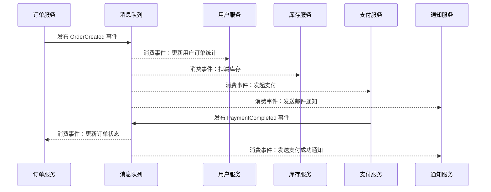

### 3.6 异步通信 - RabbitMQ 实现

```typescript
// RabbitMQ 配置和发布者
// libs/shared/src/messaging/rabbitmq.service.ts

import { Injectable } from '@nestjs/common';
import { AmqpConnection, RabbitSubscribe } from '@golevelup/nestjs-rabbitmq';

@Injectable()
export class RabbitMQService {
  constructor(private readonly amqpConnection: AmqpConnection) {}

  // 发布事件
  async publishEvent<T>(
    exchange: string,
    routingKey: string,
    payload: T,
    options?: { headers?: Record<string, any>; priority?: number },
  ): Promise<void> {
    await this.amqpConnection.publish(exchange, routingKey, {
      eventType: routingKey,
      timestamp: new Date().toISOString(),
      payload,
      traceId: getCurrentTraceId(),
    }, {
      headers: options?.headers,
      priority: options?.priority,
      persistent: true, // 消息持久化
    });
  }

  // 发送命令（RPC模式）
  async sendCommand<T, R>(
    exchange: string,
    routingKey: string,
    payload: T,
    timeout = 5000,
  ): Promise<R> {
    return this.amqpConnection.request<R>({
      exchange,
      routingKey,
      payload: {
        commandType: routingKey,
        timestamp: new Date().toISOString(),
        payload,
        traceId: getCurrentTraceId(),
      },
      timeout,
    });
  }
}
```

```typescript
// 事件发布者 - 订单服务
// apps/order-service/src/events/order-event.publisher.ts

import { Injectable } from '@nestjs/common';
import { RabbitMQService } from '@shared/messaging';
import { OrderCreatedEvent, OrderPaidEvent } from './order.events';

@Injectable()
export class OrderEventPublisher {
  constructor(private readonly rabbitMQ: RabbitMQService) {}

  async publishOrderCreated(order: Order): Promise<void> {
    const event: OrderCreatedEvent = {
      orderId: order.id,
      userId: order.userId,
      items: order.items.map(item => ({
        productId: item.productId,
        quantity: item.quantity,
        price: item.unitPrice.toNumber(),
      })),
      totalAmount: order.totalAmount.toNumber(),
      createdAt: order.createdAt.toISOString(),
    };

    await this.rabbitMQ.publishEvent(
      'order.events',      // exchange
      'order.created',     // routing key
      event,
      { priority: 5 },     // 可选配置
    );
  }

  async publishOrderPaid(order: Order, paymentId: string): Promise<void> {
    const event: OrderPaidEvent = {
      orderId: order.id,
      userId: order.userId,
      paymentId,
      paidAt: new Date().toISOString(),
    };

    await this.rabbitMQ.publishEvent('order.events', 'order.paid', event);
  }
}
```

```typescript
// 事件消费者 - 库存服务
// apps/inventory-service/src/events/inventory-event.consumer.ts

import { Injectable, Logger } from '@nestjs/common';
import { RabbitSubscribe } from '@golevelup/nestjs-rabbitmq';
import { InventoryService } from './inventory.service';

@Injectable()
export class InventoryEventConsumer {
  private readonly logger = new Logger(InventoryEventConsumer.name);

  constructor(private readonly inventoryService: InventoryService) {}

  @RabbitSubscribe({
    exchange: 'order.events',
    routingKey: 'order.created',
    queue: 'inventory.order-created',
    queueOptions: {
      durable: true,           // 队列持久化
      arguments: {
        'x-dead-letter-exchange': 'order.events.dlx',
        'x-dead-letter-routing-key': 'order.created.failed',
      },
    },
    errorHandler: (channel, msg, error) => {
      // 自定义错误处理
      if (error instanceof RetryableError) {
        channel.nack(msg, false, true); // 重新入队
      } else {
        channel.nack(msg, false, false); // 发送到死信队列
      }
    },
  })
  async handleOrderCreated(event: OrderCreatedEvent) {
    this.logger.log(`Processing order created: ${event.orderId}`);

    try {
      // 幂等性检查
      const processed = await this.inventoryService.isEventProcessed(event.orderId);
      if (processed) {
        this.logger.warn(`Event already processed: ${event.orderId}`);
        return;
      }

      // 扣减库存
      await this.inventoryService.reserveInventory(
        event.orderId,
        event.items.map(item => ({
          productId: item.productId,
          quantity: item.quantity,
        })),
      );

      // 标记事件已处理
      await this.inventoryService.markEventAsProcessed(event.orderId);
    } catch (error) {
      this.logger.error(`Failed to process order: ${event.orderId}`, error.stack);
      throw error; // 抛出错误触发重试或死信
    }
  }

  @RabbitSubscribe({
    exchange: 'order.events',
    routingKey: 'order.cancelled',
    queue: 'inventory.order-cancelled',
  })
  async handleOrderCancelled(event: OrderCancelledEvent) {
    await this.inventoryService.releaseReservation(event.orderId);
  }
}
```

### 3.7 异步通信 - Kafka 实现

```typescript
// Kafka 生产者
// libs/shared/src/messaging/kafka.service.ts

import { Injectable } from '@nestjs/common';
import { Kafka, Producer, Consumer, Partitioners } from 'kafkajs';

@Injectable()
export class KafkaService {
  private producer: Producer;
  private consumers: Map<string, Consumer> = new Map();

  constructor(private readonly config: KafkaConfig) {
    const kafka = new Kafka({
      clientId: config.clientId,
      brokers: config.brokers,
    });

    this.producer = kafka.producer({
      createPartitioner: Partitioners.DefaultPartitioner,
    });
  }

  async onModuleInit() {
    await this.producer.connect();
  }

  async onModuleDestroy() {
    await this.producer.disconnect();
    for (const consumer of this.consumers.values()) {
      await consumer.disconnect();
    }
  }

  // 发送消息（支持事务）
  async sendMessage<T>(
    topic: string,
    messages: Array<{ key: string; value: T; headers?: Record<string, string> }>,
    options?: { transaction?: boolean },
  ): Promise<void> {
    const kafkaMessages = messages.map(msg => ({
      key: msg.key,
      value: JSON.stringify(msg.value),
      headers: {
        ...msg.headers,
        'trace-id': getCurrentTraceId(),
        'timestamp': Date.now().toString(),
      },
    }));

    if (options?.transaction) {
      const transaction = await this.producer.transaction();
      try {
        await transaction.send({ topic, messages: kafkaMessages });
        await transaction.commit();
      } catch (error) {
        await transaction.abort();
        throw error;
      }
    } else {
      await this.producer.send({
        topic,
        messages: kafkaMessages,
        acks: -1, // 所有副本确认
      });
    }
  }

  // 消费消息
  async createConsumer(
    groupId: string,
    topics: string[],
    handler: (message: any) => Promise<void>,
  ): Promise<void> {
    const kafka = new Kafka({
      clientId: this.config.clientId,
      brokers: this.config.brokers,
    });

    const consumer = kafka.consumer({
      groupId,
      sessionTimeout: 30000,
      heartbeatInterval: 3000,
    });

    await consumer.connect();
    await consumer.subscribe({ topics, fromBeginning: false });

    await consumer.run({
      autoCommit: false, // 手动提交偏移量
      eachMessage: async ({ topic, partition, message }) => {
        try {
          const data = JSON.parse(message.value?.toString() || '{}');
          setTraceId(message.headers?.['trace-id']?.toString());

          await handler(data);

          // 手动提交偏移量
          await consumer.commitOffsets([
            { topic, partition, offset: (Number(message.offset) + 1).toString() },
          ]);
        } catch (error) {
          // 发送到死信主题
          await this.sendMessage(`${topic}.dlq`, [{
            key: message.key?.toString() || '',
            value: {
              originalMessage: message.value?.toString(),
              error: error.message,
              failedAt: new Date().toISOString(),
            },
          }]);
        }
      },
    });

    this.consumers.set(groupId, consumer);
  }
}
```

### 3.8 通信方式选择指南

```
┌──────────────────────────────────────────────────────────────────────┐
│                      通信方式选择指南                                 │
├────────────────────────────────┬─────────────────────────────────────┤
│         使用同步通信            │           使用异步通信               │
├────────────────────────────────┼─────────────────────────────────────┤
│ 需要立即返回结果               │ 不需要立即响应                       │
│ 强一致性要求                   │ 最终一致性可接受                     │
│ 简单查询操作                   │ 复杂的业务流程                       │
│ 调用链短（<3层）               │ 调用链长或需要广播                   │
│ 用户等待响应                   │ 后台处理任务                         │
│ 数据量小                       │ 大数据量或批处理                     │
└────────────────────────────────┴─────────────────────────────────────┘
```

### 3.9 工具推荐

| 通信类型 | 工具 | 特点 |
|---------|------|------|
| REST | Axios/Node-fetch | 简单易用，生态丰富 |
| GraphQL | Apollo Client/Server | 灵活查询，减少请求次数 |
| gRPC | @grpc/grpc-js | 高性能，强类型，支持流 |
| 消息队列 | RabbitMQ | 成熟稳定，功能丰富 |
| 消息队列 | Apache Kafka | 高吞吐，适合大数据场景 |
| 消息队列 | NATS | 轻量级，高性能 |
| 消息队列 | Redis Pub/Sub | 简单场景，低延迟 |

---

## 4. 服务发现

### 4.1 概念解释

服务发现是微服务架构的核心组件，解决服务位置动态变化的问题。主要分为两种模式：

| 模式 | 说明 | 代表工具 |
|------|------|---------|
| **客户端发现** | 客户端直接查询注册中心获取服务地址 | Eureka, Consul, etcd |
| **服务端发现** | 通过负载均衡器/网关代理请求 | Kubernetes Service, AWS ELB |

**核心功能：**

- 服务注册：服务启动时注册自身信息
- 服务发现：查询可用服务实例
- 健康检查：自动剔除不健康实例
- 负载均衡：在多个实例间分配请求

### 4.2 架构图

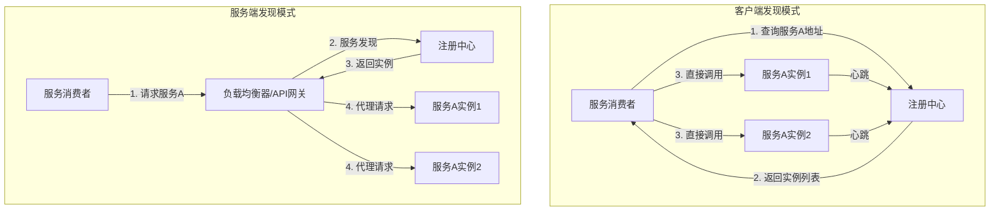

### 4.3 Consul 服务发现实现

```typescript
// libs/shared/src/discovery/consul.service.ts

import { Injectable, OnModuleInit, OnModuleDestroy, Logger } from '@nestjs/common';
import Consul from 'consul';
import { EventEmitter } from 'events';

interface ServiceInstance {
  id: string;
  name: string;
  address: string;
  port: number;
  tags: string[];
  meta: Record<string, string>;
  healthy: boolean;
}

@Injectable()
export class ConsulService implements OnModuleInit, OnModuleDestroy {
  private readonly logger = new Logger(ConsulService.name);
  private consul: Consul;
  private serviceId: string;
  private healthCheckInterval: NodeJS.Timeout;
  private watchers: Map<string, any> = new Map();
  private serviceCache: Map<string, ServiceInstance[]> = new Map();
  private readonly eventEmitter = new EventEmitter();

  constructor(private readonly config: ConsulConfig) {
    this.consul = new Consul({
      host: config.host || 'localhost',
      port: config.port || 8500,
      promisify: true,
    });
  }

  async onModuleInit() {
    await this.registerService();
    this.startHealthChecks();
  }

  async onModuleDestroy() {
    clearInterval(this.healthCheckInterval);
    for (const watcher of this.watchers.values()) {
      watcher.end();
    }
    await this.deregisterService();
  }

  // 注册服务
  private async registerService(): Promise<void> {
    this.serviceId = `${this.config.serviceName}-${generateInstanceId()}`;

    const serviceDefinition = {
      id: this.serviceId,
      name: this.config.serviceName,
      tags: this.config.tags || ['nodejs', 'nestjs'],
      port: this.config.servicePort,
      address: this.config.serviceAddress || getLocalIP(),
      check: {
        http: `http://${this.config.serviceAddress}:${this.config.servicePort}/health`,
        interval: '10s',
        timeout: '5s',
        deregistercriticalserviceafter: '30s',
      },
      meta: {
        version: this.config.version || '1.0.0',
        region: this.config.region || 'default',
        ...this.config.metadata,
      },
    };

    await this.consul.agent.service.register(serviceDefinition);
    this.logger.log(`Service registered: ${this.serviceId}`);
  }

  // 注销服务
  private async deregisterService(): Promise<void> {
    if (this.serviceId) {
      await this.consul.agent.service.deregister(this.serviceId);
      this.logger.log(`Service deregistered: ${this.serviceId}`);
    }
  }

  // 发现服务（带缓存和监听）
  async discoverService(serviceName: string): Promise<ServiceInstance[]> {
    // 检查缓存
    if (this.serviceCache.has(serviceName)) {
      return this.serviceCache.get(serviceName)!;
    }

    // 设置监听
    this.watchService(serviceName);

    // 首次查询
    const instances = await this.queryHealthyInstances(serviceName);
    this.serviceCache.set(serviceName, instances);
    return instances;
  }

  // 监听服务变化
  private watchService(serviceName: string): void {
    if (this.watchers.has(serviceName)) {
      return;
    }

    const watcher = this.consul.watch({
      method: this.consul.health.service,
      options: { service: serviceName, passing: true },
    });

    watcher.on('change', (data: any[]) => {
      const instances = data.map(item => ({
        id: item.Service.ID,
        name: item.Service.Service,
        address: item.Service.Address,
        port: item.Service.Port,
        tags: item.Service.Tags,
        meta: item.Service.Meta,
        healthy: true,
      }));

      const oldInstances = this.serviceCache.get(serviceName) || [];
      this.serviceCache.set(serviceName, instances);

      // 检测变化并通知
      this.detectChanges(serviceName, oldInstances, instances);
    });

    watcher.on('error', (err) => {
      this.logger.error(`Consul watcher error for ${serviceName}:`, err);
    });

    this.watchers.set(serviceName, watcher);
  }

  // 负载均衡获取实例（轮询）
  private instanceIndex: Map<string, number> = new Map();

  async getNextInstance(serviceName: string): Promise<ServiceInstance | null> {
    const instances = await this.discoverService(serviceName);
    if (instances.length === 0) {
      return null;
    }

    const currentIndex = this.instanceIndex.get(serviceName) || 0;
    const instance = instances[currentIndex % instances.length];
    this.instanceIndex.set(serviceName, currentIndex + 1);

    return instance;
  }

  // 健康检查
  private startHealthChecks(): void {
    this.healthCheckInterval = setInterval(async () => {
      try {
        await this.consul.agent.check.pass(`service:${this.serviceId}`);
      } catch (error) {
        this.logger.error('Health check failed:', error);
      }
    }, 10000);
  }

  private async queryHealthyInstances(serviceName: string): Promise<ServiceInstance[]> {
    const result = await this.consul.health.service({
      service: serviceName,
      passing: true,
    });

    return (result as any[]).map(item => ({
      id: item.Service.ID,
      name: item.Service.Service,
      address: item.Service.Address,
      port: item.Service.Port,
      tags: item.Service.Tags,
      meta: item.Service.Meta,
      healthy: true,
    }));
  }

  private detectChanges(
    serviceName: string,
    oldInstances: ServiceInstance[],
    newInstances: ServiceInstance[],
  ): void {
    const oldIds = new Set(oldInstances.map(i => i.id));
    const newIds = new Set(newInstances.map(i => i.id));

    const added = newInstances.filter(i => !oldIds.has(i.id));
    const removed = oldInstances.filter(i => !newIds.has(i.id));

    if (added.length > 0 || removed.length > 0) {
      this.eventEmitter.emit('serviceChange', {
        serviceName,
        added,
        removed,
        current: newInstances,
      });
    }
  }

  onServiceChange(callback: (event: any) => void): void {
    this.eventEmitter.on('serviceChange', callback);
  }
}
```

```typescript
// Consul 服务发现拦截器
// libs/shared/src/discovery/consul-http.interceptor.ts

import {
  Injectable,
  NestInterceptor,
  ExecutionContext,
  CallHandler,
} from '@nestjs/common';
import { Observable } from 'rxjs';
import { ConsulService } from './consul.service';

@Injectable()
export class ServiceDiscoveryInterceptor implements NestInterceptor {
  constructor(private readonly consulService: ConsulService) {}

  async intercept(context: ExecutionContext, next: CallHandler): Promise<Observable<any>> {
    const request = context.switchToHttp().getRequest();

    // 解析服务名（如 /user-service/api/users -> user-service）
    const serviceName = this.extractServiceName(request.url);

    if (serviceName) {
      const instance = await this.consulService.getNextInstance(serviceName);
      if (instance) {
        // 重写请求URL到实际服务地址
        request.url = request.url.replace(`/${serviceName}`, '');
        request.headers['X-Target-Service'] = `${instance.address}:${instance.port}`;
      }
    }

    return next.handle();
  }

  private extractServiceName(url: string): string | null {
    const match = url.match(/^\/([^\/]+)/);
    return match ? match[1] : null;
  }
}
```

### 4.4 etcd 服务发现实现

```typescript
// libs/shared/src/discovery/etcd.service.ts

import { Injectable, OnModuleInit, OnModuleDestroy, Logger } from '@nestjs/common';
import { Etcd3, IKeyValue } from 'etcd3';
import { EventEmitter } from 'events';

@Injectable()
export class EtcdService implements OnModuleInit, OnModuleDestroy {
  private readonly logger = new Logger(EtcdService.name);
  private client: Etcd3;
  private lease: any;
  private watchers: Map<string, any> = new Map();
  private readonly eventEmitter = new EventEmitter();

  constructor(private readonly config: EtcdConfig) {
    this.client = new Etcd3({
      hosts: config.endpoints || ['localhost:2379'],
    });
  }

  async onModuleInit() {
    await this.registerService();
  }

  async onModuleDestroy() {
    for (const watcher of this.watchers.values()) {
      await watcher.cancel();
    }
    if (this.lease) {
      await this.lease.revoke();
    }
    await this.client.close();
  }

  // 注册服务（使用租约实现自动过期）
  private async registerService(): Promise<void> {
    const serviceKey = `/services/${this.config.serviceName}/${this.config.instanceId}`;
    const serviceValue = JSON.stringify({
      id: this.config.instanceId,
      name: this.config.serviceName,
      address: this.config.address,
      port: this.config.port,
      metadata: this.config.metadata,
      registeredAt: new Date().toISOString(),
    });

    // 创建10秒租约，自动续期
    this.lease = this.client.lease(10);

    await this.lease.put(serviceKey).value(serviceValue);

    this.logger.log(`Service registered in etcd: ${serviceKey}`);

    // 监听租约状态
    this.lease.on('lost', async () => {
      this.logger.warn('Lease lost, re-registering...');
      await this.registerService();
    });
  }

  // 发现服务
  async discoverService(serviceName: string): Promise<ServiceInstance[]> {
    const prefix = `/services/${serviceName}/`;
    const response = await this.client.getAll().prefix(prefix);

    const instances: ServiceInstance[] = [];
    for (const [key, value] of Object.entries(response)) {
      try {
        const instance = JSON.parse(value as string);
        instances.push(instance);
      } catch (e) {
        this.logger.error(`Failed to parse service data: ${key}`);
      }
    }

    return instances;
  }

  // 监听服务变化
  async watchService(serviceName: string): Promise<void> {
    if (this.watchers.has(serviceName)) {
      return;
    }

    const prefix = `/services/${serviceName}/`;
    const watcher = this.client.watch().prefix(prefix);

    watcher.on('put', (kv: IKeyValue) => {
      this.logger.log(`Service instance added: ${kv.key.toString()}`);
      this.eventEmitter.emit('serviceChange', {
        type: 'PUT',
        serviceName,
        instance: JSON.parse(kv.value.toString()),
      });
    });

    watcher.on('delete', (kv: IKeyValue) => {
      this.logger.log(`Service instance removed: ${kv.key.toString()}`);
      this.eventEmitter.emit('serviceChange', {
        type: 'DELETE',
        serviceName,
        key: kv.key.toString(),
      });
    });

    this.watchers.set(serviceName, watcher);
  }

  // 服务发现配置中心
  async getConfig(key: string): Promise<string | null> {
    return this.client.get(`/config/${key}`).string();
  }

  async watchConfig(key: string, callback: (value: string) => void): Promise<void> {
    const watcher = this.client.watch().key(`/config/${key}`);
    watcher.on('put', (kv: IKeyValue) => {
      callback(kv.value.toString());
    });
  }

  // 分布式锁
  async withLock(lockName: string, ttl: number, fn: () => Promise<void>): Promise<void> {
    const lock = this.client.lock(lockName);
    await lock.acquire();
    try {
      await fn();
    } finally {
      await lock.release();
    }
  }
}
```

### 4.5 Kubernetes DNS 服务发现

```typescript
// libs/shared/src/discovery/kubernetes-dns.service.ts

import { Injectable } from '@nestjs/common';
import { lookup } from 'dns/promises';

interface K8sServiceEndpoint {
  address: string;
  port: number;
}

@Injectable()
export class KubernetesDNSService {
  private readonly namespace: string;
  private readonly clusterDomain: string;
  private cache: Map<string, { endpoints: K8sServiceEndpoint[]; expiresAt: number }> = new Map();
  private readonly cacheTtl = 5000; // 5秒缓存

  constructor() {
    this.namespace = process.env.K8S_NAMESPACE || 'default';
    this.clusterDomain = process.env.K8S_CLUSTER_DOMAIN || 'cluster.local';
  }

  // 使用 Kubernetes DNS 发现服务
  // 格式: <service-name>.<namespace>.svc.<cluster-domain>
  async resolveService(serviceName: string, port: number = 80): Promise<K8sServiceEndpoint[]> {
    const cacheKey = `${serviceName}:${port}`;

    // 检查缓存
    const cached = this.cache.get(cacheKey);
    if (cached && cached.expiresAt > Date.now()) {
      return cached.endpoints;
    }

    try {
      // 方式1: 使用 Headless Service 获取所有 Pod IP
      const headlessDomain = `${serviceName}.${this.namespace}.svc.${this.clusterDomain}`;
      const addresses = await lookup(headlessDomain, { all: true });

      const endpoints = addresses.map(addr => ({
        address: addr.address,
        port,
      }));

      // 更新缓存
      this.cache.set(cacheKey, {
        endpoints,
        expiresAt: Date.now() + this.cacheTtl,
      });

      return endpoints;
    } catch (error) {
      // 方式2: 使用 ClusterIP（返回单个VIP）
      try {
        const clusterDomain = `${serviceName}.${this.namespace}.svc.${this.clusterDomain}`;
        const result = await lookup(clusterDomain);
        return [{ address: result.address, port }];
      } catch (fallbackError) {
        throw new Error(`Failed to resolve service: ${serviceName}`);
      }
    }
  }

  // 轮询选择端点
  private endpointIndex: Map<string, number> = new Map();

  async getNextEndpoint(serviceName: string, port: number = 80): Promise<K8sServiceEndpoint> {
    const endpoints = await this.resolveService(serviceName, port);
    if (endpoints.length === 0) {
      throw new Error(`No endpoints available for service: ${serviceName}`);
    }

    const key = `${serviceName}:${port}`;
    const currentIndex = this.endpointIndex.get(key) || 0;
    const endpoint = endpoints[currentIndex % endpoints.length];
    this.endpointIndex.set(key, currentIndex + 1);

    return endpoint;
  }
}

// Kubernetes 客户端方式（使用 @kubernetes/client-node）
import * as k8s from '@kubernetes/client-node';

@Injectable()
export class KubernetesClientService {
  private k8sApi: k8s.CoreV1Api;

  constructor() {
    const kc = new k8s.KubeConfig();
    kc.loadFromDefault(); // 或使用 loadFromCluster() 在 Pod 内运行
    this.k8sApi = kc.makeApiClient(k8s.CoreV1Api);
  }

  // 通过 Kubernetes API 获取服务 Endpoints
  async getServiceEndpoints(serviceName: string, namespace?: string): Promise<string[]> {
    const ns = namespace || process.env.K8S_NAMESPACE || 'default';

    try {
      const response = await this.k8sApi.readNamespacedEndpoints(serviceName, ns);
      const endpoints: string[] = [];

      for (const subset of response.body.subsets || []) {
        for (const address of subset.addresses || []) {
          for (const port of subset.ports || []) {
            endpoints.push(`${address.ip}:${port.port}`);
          }
        }
      }

      return endpoints;
    } catch (error) {
      throw new Error(`Failed to get endpoints: ${error.message}`);
    }
  }
}
```

### 4.6 服务发现选择对比

```
┌──────────────────────────────────────────────────────────────────────┐
│                      服务发现工具对比                                 │
├───────────┬────────────┬────────────┬────────────┬───────────────────┤
│   特性    │   Consul   │    etcd    │   Eureka   │  Kubernetes DNS   │
├───────────┼────────────┼────────────┼────────────┼───────────────────┤
│ 一致性协议 │   Raft     │   Raft     │   自我保护  │  基于DNS          │
│ 健康检查  │    丰富    │    租约    │   客户端心跳 │    readiness探针  │
│ 多数据中心 │    支持    │    支持    │    支持    │    不支持         │
│ KV存储    │    支持    │    原生    │    不支持   │    不支持         │
│ 服务网格  │ 集成Envoy  │    无      │    无      │  Istio集成        │
│ 学习曲线  │    中等    │    较高    │    简单    │    低（K8s环境）   │
│ 适用场景  │ 多语言环境 │ 配置中心   │ 纯Java生态 │   K8s原生          │
└───────────┴────────────┴────────────┴────────────┴───────────────────┘
```

### 4.7 工具推荐

| 工具 | 类型 | 特点 |
|------|------|------|
| Consul | 客户端/服务端 | 功能全面，支持健康检查、KV存储、多数据中心 |
| etcd | 客户端 | CoreOS出品，Kubernetes底层存储，强一致性 |
| Eureka | 客户端 | Netflix开源，Java生态友好，自我保护机制 |
| ZooKeeper | 客户端 | Apache出品，成熟稳定，适合大数据生态 |
| Kubernetes DNS | 服务端 | K8s原生，零配置，自动服务发现 |
| Nacos | 客户端/服务端 | 阿里巴巴开源，融合注册中心与配置中心 |
| Istio | 服务端 | 服务网格，透明服务发现与流量管理 |

---

## 5. API网关模式

### 5.1 概念解释

API网关是微服务架构的统一入口，负责处理所有客户端请求并路由到后端服务。它是微服务架构中不可或缺的组件。

**核心职责：**

| 职责 | 说明 |
|------|------|
| 请求路由 | 根据URL、Header等将请求转发到对应服务 |
| 负载均衡 | 在多个服务实例间分配请求 |
| 认证授权 | 统一处理身份验证和权限校验 |
| 限流熔断 | 保护后端服务免受过载 |
| 协议转换 | HTTP ↔ gRPC, REST ↔ GraphQL |
| 缓存 | 响应缓存，减少后端压力 |
| 日志监控 | 统一请求日志和指标收集 |

### 5.2 架构图

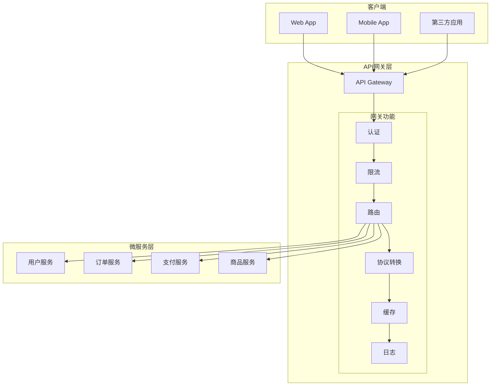

### 5.3 NestJS 自定义 API 网关

```typescript
// apps/gateway/src/main.ts

import { NestFactory } from '@nestjs/core';
import { GatewayModule } from './gateway.module';
import helmet from 'helmet';
import rateLimit from 'express-rate-limit';

async function bootstrap() {
  const app = await NestFactory.create(GatewayModule);

  // 安全中间件
  app.use(helmet({
    contentSecurityPolicy: {
      directives: {
        defaultSrc: ["'self'"],
        styleSrc: ["'self'", "'unsafe-inline'"],
        scriptSrc: ["'self'"],
        imgSrc: ["'self'", 'data:', 'https:'],
      },
    },
  }));

  // 全局限流
  app.use(rateLimit({
    windowMs: 15 * 60 * 1000, // 15分钟
    max: 100, // 每个IP 100次请求
    message: {
      statusCode: 429,
      message: 'Too many requests, please try again later.',
    },
  }));

  // CORS配置
  app.enableCors({
    origin: process.env.ALLOWED_ORIGINS?.split(',') || ['http://localhost:3000'],
    credentials: true,
    methods: ['GET', 'POST', 'PUT', 'DELETE', 'PATCH'],
    allowedHeaders: ['Content-Type', 'Authorization', 'X-Request-ID'],
  });

  await app.listen(3000);
  console.log('API Gateway is running on port 3000');
}
bootstrap();
```

```typescript
// apps/gateway/src/gateway.module.ts

import { Module, MiddlewareConsumer, RequestMethod } from '@nestjs/common';
import { HttpModule } from '@nestjs/axios';
import { GatewayController } from './gateway.controller';
import { GatewayService } from './gateway.service';
import { AuthMiddleware } from './middleware/auth.middleware';
import { LoggingMiddleware } from './middleware/logging.middleware';
import { CircuitBreakerInterceptor } from './interceptors/circuit-breaker.interceptor';
import { CacheInterceptor } from './interceptors/cache.interceptor';
import { RouteConfigService } from './services/route-config.service';

@Module({
  imports: [
    HttpModule.register({
      timeout: 10000,
      maxRedirects: 5,
    }),
  ],
  controllers: [GatewayController],
  providers: [
    GatewayService,
    RouteConfigService,
    {
      provide: 'APP_INTERCEPTOR',
      useClass: CircuitBreakerInterceptor,
    },
    {
      provide: 'APP_INTERCEPTOR',
      useClass: CacheInterceptor,
    },
  ],
})
export class GatewayModule {
  configure(consumer: MiddlewareConsumer) {
    consumer
      .apply(LoggingMiddleware)
      .forRoutes({ path: '*', method: RequestMethod.ALL })
      .apply(AuthMiddleware)
      .exclude(
        { path: 'health', method: RequestMethod.GET },
        { path: 'auth/login', method: RequestMethod.POST },
        { path: 'auth/register', method: RequestMethod.POST },
      )
      .forRoutes({ path: '*', method: RequestMethod.ALL });
  }
}
```

```typescript
// apps/gateway/src/services/gateway.service.ts

import { Injectable, HttpException, HttpStatus } from '@nestjs/common';
import { HttpService } from '@nestjs/axios';
import { firstValueFrom } from 'rxjs';
import { RouteConfigService, RouteConfig } from './route-config.service';

interface ProxyRequest {
  method: string;
  url: string;
  headers: Record<string, string>;
  body?: any;
  query?: Record<string, any>;
}

@Injectable()
export class GatewayService {
  constructor(
    private readonly httpService: HttpService,
    private readonly routeConfig: RouteConfigService,
  ) {}

  async proxyRequest(request: ProxyRequest): Promise<any> {
    const route = this.routeConfig.matchRoute(request.url, request.method);

    if (!route) {
      throw new HttpException('Route not found', HttpStatus.NOT_FOUND);
    }

    // 权限检查
    await this.checkPermission(route, request.headers);

    // 转换请求
    const targetUrl = this.buildTargetUrl(route, request);
    const targetHeaders = this.buildTargetHeaders(route, request.headers);

    try {
      const response = await firstValueFrom(
        this.httpService.request({
          method: request.method,
          url: targetUrl,
          headers: targetHeaders,
          data: request.body,
          params: request.query,
          timeout: route.timeout || 10000,
        })
      );

      // 转换响应
      return this.transformResponse(route, response.data);
    } catch (error) {
      if (error.response) {
        throw new HttpException(
          error.response.data,
          error.response.status,
        );
      }
      throw new HttpException(
        'Service unavailable',
        HttpStatus.SERVICE_UNAVAILABLE,
      );
    }
  }

  private buildTargetUrl(route: RouteConfig, request: ProxyRequest): string {
    const baseUrl = route.target;
    const path = request.url.replace(route.path, route.rewrite || '');
    return `${baseUrl}${path}`;
  }

  private buildTargetHeaders(
    route: RouteConfig,
    originalHeaders: Record<string, string>,
  ): Record<string, string> {
    const headers: Record<string, string> = {};

    // 保留特定Header
    const preserveHeaders = ['content-type', 'authorization', 'x-request-id', 'x-trace-id'];
    for (const key of preserveHeaders) {
      if (originalHeaders[key]) {
        headers[key] = originalHeaders[key];
      }
    }

    // 添加服务间认证
    if (route.addServiceAuth) {
      headers['x-service-auth'] = this.generateServiceToken();
    }

    // 路由特定Header
    if (route.additionalHeaders) {
      Object.assign(headers, route.additionalHeaders);
    }

    return headers;
  }

  private async checkPermission(route: RouteConfig, headers: Record<string, string>): Promise<void> {
    if (!route.requiresAuth) {
      return;
    }

    const token = headers.authorization?.replace('Bearer ', '');
    if (!token) {
      throw new HttpException('Unauthorized', HttpStatus.UNAUTHORIZED);
    }

    // JWT验证逻辑
    // ...
  }

  private transformResponse(route: RouteConfig, data: any): any {
    if (route.responseTransform) {
      return route.responseTransform(data);
    }
    return data;
  }

  private generateServiceToken(): string {
    // 生成服务间调用令牌
    return 'service-token';
  }
}
```

```typescript
// apps/gateway/src/config/routes.config.ts

export interface RouteConfig {
  id: string;
  path: string;           // 匹配路径，如 /api/users/**
  method: string | string[]; // HTTP方法
  target: string;         // 目标服务地址
  rewrite?: string;       // URL重写规则
  timeout?: number;       // 超时时间（毫秒）
  requiresAuth?: boolean; // 是否需要认证
  addServiceAuth?: boolean; // 是否添加服务间认证
  additionalHeaders?: Record<string, string>;
  responseTransform?: (data: any) => any;
  rateLimit?: {
    windowMs: number;
    maxRequests: number;
  };
  cache?: {
    ttl: number;          // 缓存时间（秒）
    keyGenerator?: (req: any) => string;
  };
}

export const routes: RouteConfig[] = [
  {
    id: 'user-service',
    path: '/api/users/**',
    method: ['GET', 'POST', 'PUT', 'DELETE'],
    target: process.env.USER_SERVICE_URL || 'http://user-service:3001',
    requiresAuth: true,
    addServiceAuth: true,
    timeout: 5000,
    rateLimit: {
      windowMs: 60 * 1000,
      maxRequests: 100,
    },
  },
  {
    id: 'order-service',
    path: '/api/orders/**',
    method: ['GET', 'POST', 'PUT'],
    target: process.env.ORDER_SERVICE_URL || 'http://order-service:3002',
    requiresAuth: true,
    addServiceAuth: true,
    timeout: 10000,
    cache: {
      ttl: 60,
      keyGenerator: (req) => `order:${req.params.id}`,
    },
  },
  {
    id: 'product-service-public',
    path: '/api/products/**',
    method: 'GET',
    target: process.env.PRODUCT_SERVICE_URL || 'http://product-service:3003',
    requiresAuth: false,
    cache: {
      ttl: 300, // 5分钟缓存
    },
  },
  {
    id: 'payment-service',
    path: '/api/payments/**',
    method: ['POST'],
    target: process.env.PAYMENT_SERVICE_URL || 'http://payment-service:3004',
    requiresAuth: true,
    addServiceAuth: true,
    timeout: 30000, // 支付操作较长超时
    rateLimit: {
      windowMs: 60 * 1000,
      maxRequests: 10, // 支付接口限流更严格
    },
  },
  // GraphQL 聚合路由
  {
    id: 'graphql-gateway',
    path: '/graphql',
    method: ['GET', 'POST'],
    target: process.env.GRAPHQL_SERVICE_URL || 'http://graphql-service:3005',
    requiresAuth: true,
  },
];
```

### 5.4 GraphQL 网关 - Apollo Federation

```typescript
// apps/graphql-gateway/src/main.ts

import { NestFactory } from '@nestjs/core';
import { GraphQLGatewayModule } from '@nestjs/graphql';
import { ApolloGateway } from '@apollo/gateway';
import { ApolloServerPluginLandingPageLocalDefault } from '@apollo/server/plugin/landingPage/default';

async function bootstrap() {
  const app = await NestFactory.create(GraphQLGatewayModule.forRoot({
    server: {
      cors: true,
      plugins: [
        ApolloServerPluginLandingPageLocalDefault(),
      ],
    },
    gateway: {
      supergraphSdl: new ApolloGateway({
        serviceList: [
          { name: 'users', url: 'http://user-service:3001/graphql' },
          { name: 'orders', url: 'http://order-service:3002/graphql' },
          { name: 'products', url: 'http://product-service:3003/graphql' },
        ],
        // 使用托管模式（生产环境推荐）
        // supergraphSdl: new IntrospectAndCompose({
        //   subgraphs: [...]
        // }),
        buildService({ name, url }) {
          return new RemoteGraphQLDataSource({
            url,
            willSendRequest({ request, context }) {
              // 透传用户认证信息
              request.http.headers.set(
                'authorization',
                context.req?.headers?.authorization || '',
              );
              // 透传追踪ID
              request.http.headers.set(
                'x-trace-id',
                context.req?.headers['x-trace-id'] || generateTraceId(),
              );
            },
          });
        },
      }),
    },
  }));

  await app.listen(4000);
  console.log('GraphQL Gateway is running on http://localhost:4000/graphql');
}
bootstrap();
```

```typescript
// 子服务 GraphQL Schema - 用户服务
// apps/user-service/src/user.graphql

"""
用户服务的 GraphQL Schema
使用 Apollo Federation 的 @key 指令标记实体
"""
type User @key(fields: "id") {
  id: ID!
  email: String!
  name: String!
  orderCount: Int!
  createdAt: String!
  addresses: [Address!]!
}

type Address {
  id: ID!
  street: String!
  city: String!
  country: String!
  isDefault: Boolean!
}

type Query {
  me: User!
  user(id: ID!): User
  users(limit: Int, offset: Int): [User!]!
}

type Mutation {
  updateProfile(input: UpdateProfileInput!): User!
  addAddress(input: AddAddressInput!): Address!
}

input UpdateProfileInput {
  name: String
  email: String
}

input AddAddressInput {
  street: String!
  city: String!
  country: String!
  isDefault: Boolean
}
```

```typescript
// 子服务实现 - 用户服务
// apps/user-service/src/user.resolver.ts

import { Resolver, Query, Mutation, Args, ResolveReference } from '@nestjs/graphql';
import { UserService } from './user.service';

@Resolver('User')
export class UserResolver {
  constructor(private readonly userService: UserService) {}

  @Query('me')
  async me(@Context() context) {
    return this.userService.findById(context.user.id);
  }

  @Query('user')
  async user(@Args('id') id: string) {
    return this.userService.findById(id);
  }

  @Query('users')
  async users(
    @Args('limit') limit: number = 20,
    @Args('offset') offset: number = 0,
  ) {
    return this.userService.findAll({ limit, offset });
  }

  @Mutation('updateProfile')
  async updateProfile(
    @Context() context,
    @Args('input') input: UpdateProfileInput,
  ) {
    return this.userService.updateProfile(context.user.id, input);
  }

  // Federation: 解析其他服务引用的 User 实体
  @ResolveReference()
  async resolveReference(reference: { __typename: string; id: string }) {
    return this.userService.findById(reference.id);
  }
}
```

```typescript
// 订单服务引用用户实体
// apps/order-service/src/order.graphql

type Order {
  id: ID!
  user: User!      # 引用用户服务的 User 实体
  items: [OrderItem!]!
  totalAmount: Float!
  status: OrderStatus!
  createdAt: String!
}

# 扩展用户类型，添加订单关联
type User @key(fields: "id") @extends {
  id: ID! @external
  orders: [Order!]!
}

type Query {
  myOrders: [Order!]!
  order(id: ID!): Order
}
```

### 5.5 Kong 网关集成

```yaml
# kong.yml - Kong 声明式配置
_format_version: "3.0"

services:
  - name: user-service
    url: http://user-service:3001
    routes:
      - name: user-routes
        paths:
          - /api/users
        strip_path: false
        methods:
          - GET
          - POST
          - PUT
          - DELETE
    plugins:
      - name: rate-limiting
        config:
          minute: 100
          policy: redis
          redis_host: redis
      - name: jwt
        config:
          key_claim_name: iss
          secret_is_base64: false
      - name: request-transformer
        config:
          add:
            headers:
              - X-Service-Auth:${USER_SERVICE_TOKEN}

  - name: order-service
    url: http://order-service:3002
    routes:
      - name: order-routes
        paths:
          - /api/orders
    plugins:
      - name: rate-limiting
        config:
          minute: 50
      - name: proxy-cache
        config:
          content_type:
            - application/json
          cache_ttl: 300
          strategy: memory

  - name: payment-service
    url: http://payment-service:3004
    routes:
      - name: payment-routes
        paths:
          - /api/payments
    plugins:
      - name: rate-limiting
        config:
          minute: 10  # 支付接口严格限流
      - name: request-transformer
        config:
          add:
            headers:
              - X-Idempotency-Key:$(request_id)

consumers:
  - username: web-app
    jwt_secrets:
      - key: web-app-key
        algorithm: HS256
        secret: ${JWT_SECRET}
  - username: mobile-app
    jwt_secrets:
      - key: mobile-app-key
        algorithm: HS256
        secret: ${JWT_SECRET}

plugins:
  - name: cors
    config:
      origins:
        - http://localhost:3000
        - https://app.example.com
      methods:
        - GET
        - POST
        - PUT
        - DELETE
      headers:
        - Authorization
        - Content-Type
      credentials: true
  - name: prometheus
    config:
      per_consumer: true
  - name: file-log
    config:
      path: /var/log/kong/access.log
```

```typescript
// Kong Admin API 集成
// libs/shared/src/gateway/kong-admin.service.ts

import { Injectable } from '@nestjs/common';
import axios from 'axios';

@Injectable()
export class KongAdminService {
  private readonly adminUrl: string;

  constructor() {
    this.adminUrl = process.env.KONG_ADMIN_URL || 'http://localhost:8001';
  }

  // 动态注册服务
  async registerService(service: {
    name: string;
    url: string;
    routes: Array<{
      paths: string[];
      methods?: string[];
    }>;
    plugins?: any[];
  }): Promise<void> {
    try {
      // 创建服务
      await axios.post(`${this.adminUrl}/services`, {
        name: service.name,
        url: service.url,
      });

      // 创建路由
      for (const route of service.routes) {
        await axios.post(`${this.adminUrl}/services/${service.name}/routes`, {
          paths: route.paths,
          methods: route.methods || ['GET', 'POST', 'PUT', 'DELETE'],
          strip_path: false,
        });
      }

      // 添加插件
      if (service.plugins) {
        for (const plugin of service.plugins) {
          await axios.post(`${this.adminUrl}/services/${service.name}/plugins`, plugin);
        }
      }
    } catch (error) {
      throw new Error(`Failed to register service in Kong: ${error.message}`);
    }
  }

  // 健康检查
  async getServiceHealth(serviceName: string): Promise<any> {
    const response = await axios.get(`${this.adminUrl}/services/${serviceName}/health`);
    return response.data;
  }

  // 获取指标
  async getMetrics(): Promise<string> {
    const response = await axios.get(`${this.adminUrl.replace('8001', '8000')}/metrics`);
    return response.data;
  }
}
```

### 5.6 工具推荐

| 工具 | 类型 | 特点 |
|------|------|------|
| Kong | 开源/企业级 | 功能丰富，插件生态完善，企业级支持 |
| NGINX | 开源 | 高性能，Lua扩展，成熟稳定 |
| Envoy | 开源 | 云原生，服务网格集成，性能优异 |
| Traefik | 开源 | 云原生，自动服务发现，配置简单 |
| Spring Cloud Gateway | 开源 | Java生态，与Spring集成好 |
| AWS API Gateway | 托管 | 无服务器，与AWS服务集成 |
| Azure API Management | 托管 | 企业级，与Azure生态集成 |
| Apollo Gateway | 开源 | GraphQL专用，Federation支持 |

---

## 6. 熔断限流降级策略

### 6.1 概念解释

在高并发微服务架构中，保护系统稳定性需要三种核心机制：

| 机制 | 说明 | 目的 |
|------|------|------|
| **熔断** (Circuit Breaker) | 当错误率达到阈值时，自动切断对故障服务的调用 | 防止故障扩散，快速失败 |
| **限流** (Rate Limiting) | 限制单位时间内的请求数量 | 保护服务免受过载，公平使用 |
| **降级** (Degradation) | 在资源不足时关闭非核心功能 | 保证核心功能可用 |

### 6.2 熔断器状态机

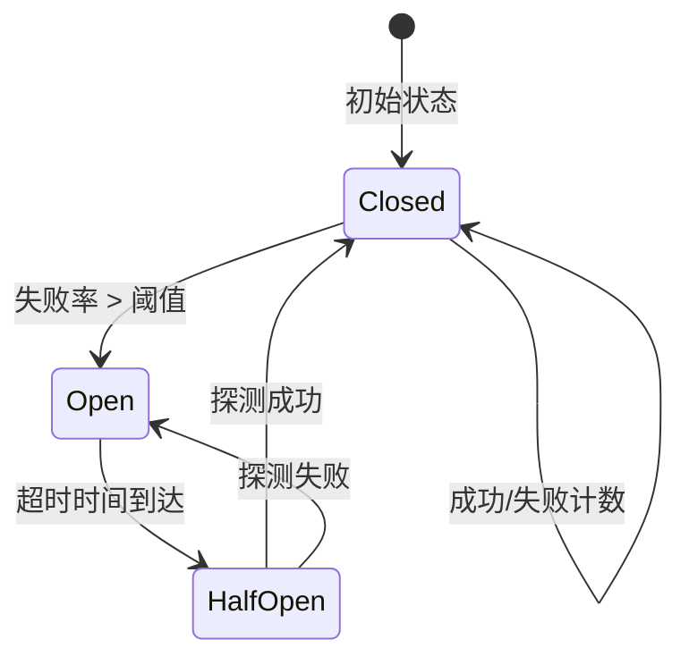

### 6.3 熔断器实现

```typescript
// libs/shared/src/resilience/circuit-breaker.ts

import { Injectable, Logger } from '@nestjs/common';
import { EventEmitter } from 'events';

export enum CircuitState {
  CLOSED = 'CLOSED',       // 正常状态
  OPEN = 'OPEN',           // 熔断状态
  HALF_OPEN = 'HALF_OPEN', // 半开状态
}

export interface CircuitBreakerOptions {
  failureThreshold: number;       // 触发熔断的失败次数阈值
  successThreshold: number;       // 半开状态恢复所需的连续成功次数
  timeout: number;                // 熔断持续时间（毫秒）
  resetTimeout: number;           // 半开探测间隔（毫秒）
  monitoredFunction?: () => Promise<any>;
}

export interface CircuitBreakerMetrics {
  state: CircuitState;
  failures: number;
  successes: number;
  lastFailureTime: number;
  nextAttempt: number;
  totalRequests: number;
  rejectedRequests: number;
}

export class CircuitBreaker extends EventEmitter {
  private readonly logger = new Logger(CircuitBreaker.name);
  private state: CircuitState = CircuitState.CLOSED;
  private failures = 0;
  private successes = 0;
  private lastFailureTime = 0;
  private nextAttempt = Date.now();
  private totalRequests = 0;
  private rejectedRequests = 0;
  private halfOpenAttempts = 0;

  constructor(
    private readonly name: string,
    private readonly options: CircuitBreakerOptions,
  ) {
    super();
    this.options = {
      failureThreshold: 5,
      successThreshold: 3,
      timeout: 60000,
      resetTimeout: 30000,
      ...options,
    };
  }

  // 执行受保护的函数
  async execute<T>(fn: () => Promise<T>): Promise<T> {
    this.totalRequests++;

    if (this.state === CircuitState.OPEN) {
      if (Date.now() < this.nextAttempt) {
        this.rejectedRequests++;
        this.emit('reject', { reason: 'Circuit is OPEN' });
        throw new CircuitBreakerOpenException(
          `Circuit '${this.name}' is OPEN. Try again after ${new Date(this.nextAttempt).toISOString()}`,
        );
      }
      this.state = CircuitState.HALF_OPEN;
      this.halfOpenAttempts = 0;
      this.emit('halfOpen', { name: this.name });
    }

    try {
      const result = await fn();
      await this.onSuccess();
      return result;
    } catch (error) {
      await this.onFailure(error);
      throw error;
    }
  }

  private async onSuccess(): Promise<void> {
    this.failures = 0;

    if (this.state === CircuitState.HALF_OPEN) {
      this.successes++;
      this.halfOpenAttempts++;

      if (this.successes >= this.options.successThreshold) {
        this.close();
      }
    }

    this.emit('success', { name: this.name, state: this.state });
  }

  private async onFailure(error: any): Promise<void> {
    this.failures++;
    this.lastFailureTime = Date.now();

    if (this.state === CircuitState.HALF_OPEN) {
      this.open();
    } else if (this.failures >= this.options.failureThreshold) {
      this.open();
    }

    this.emit('failure', { name: this.name, error, state: this.state });
  }

  private open(): void {
    this.state = CircuitState.OPEN;
    this.nextAttempt = Date.now() + this.options.timeout;
    this.successes = 0;
    this.logger.warn(
      `Circuit '${this.name}' OPENED. Will attempt reset at ${new Date(this.nextAttempt).toISOString()}`,
    );
    this.emit('open', { name: this.name, nextAttempt: this.nextAttempt });
  }

  private close(): void {
    this.state = CircuitState.CLOSED;
    this.failures = 0;
    this.successes = 0;
    this.halfOpenAttempts = 0;
    this.logger.log(`Circuit '${this.name}' CLOSED`);
    this.emit('close', { name: this.name });
  }

  getState(): CircuitState {
    return this.state;
  }

  getMetrics(): CircuitBreakerMetrics {
    return {
      state: this.state,
      failures: this.failures,
      successes: this.successes,
      lastFailureTime: this.lastFailureTime,
      nextAttempt: this.nextAttempt,
      totalRequests: this.totalRequests,
      rejectedRequests: this.rejectedRequests,
    };
  }

  // 强制熔断（用于人工干预）
  forceOpen(): void {
    this.open();
  }

  // 强制恢复（用于人工干预）
  forceClose(): void {
    this.close();
  }
}

// 熔断器异常
export class CircuitBreakerOpenException extends Error {
  constructor(message: string) {
    super(message);
    this.name = 'CircuitBreakerOpenException';
  }
}
```

```typescript
// 熔断器 NestJS 装饰器
// libs/shared/src/resilience/circuit-breaker.decorator.ts

import { Injectable } from '@nestjs/common';
import { CircuitBreaker, CircuitBreakerOptions } from './circuit-breaker';

const breakers = new Map<string, CircuitBreaker>();

export function UseCircuitBreaker(options?: Partial<CircuitBreakerOptions>) {
  return function (target: any, propertyKey: string, descriptor: PropertyDescriptor) {
    const originalMethod = descriptor.value;
    const breakerName = `${target.constructor.name}.${propertyKey}`;

    if (!breakers.has(breakerName)) {
      breakers.set(breakerName, new CircuitBreaker(breakerName, {
        failureThreshold: 5,
        successThreshold: 3,
        timeout: 60000,
        ...options,
      }));
    }

    const breaker = breakers.get(breakerName)!;

    descriptor.value = async function (...args: any[]) {
      return breaker.execute(() => originalMethod.apply(this, args));
    };

    // 附加获取状态的方法
    descriptor.value.getCircuitState = () => breaker.getState();
    descriptor.value.getMetrics = () => breaker.getMetrics();

    return descriptor;
  };
}

// 熔断器管理器
@Injectable()
export class CircuitBreakerManager {
  getAllMetrics(): Record<string, any> {
    const metrics: Record<string, any> = {};
    for (const [name, breaker] of breakers) {
      metrics[name] = breaker.getMetrics();
    }
    return metrics;
  }

  forceOpen(name: string): void {
    breakers.get(name)?.forceOpen();
  }

  forceClose(name: string): void {
    breakers.get(name)?.forceClose();
  }
}
```

```typescript
// 使用示例
// apps/order-service/src/clients/payment.client.ts

import { Injectable } from '@nestjs/common';
import { HttpService } from '@nestjs/axios';
import { UseCircuitBreaker } from '@shared/resilience';
import { firstValueFrom } from 'rxjs';

@Injectable()
export class PaymentClient {
  constructor(private readonly httpService: HttpService) {}

  @UseCircuitBreaker({
    failureThreshold: 3,
    successThreshold: 2,
    timeout: 30000,
  })
  async processPayment(paymentData: PaymentRequest): Promise<PaymentResult> {
    const response = await firstValueFrom(
      this.httpService.post('http://payment-service/payments', paymentData),
    );
    return response.data;
  }

  @UseCircuitBreaker({
    failureThreshold: 5,
    timeout: 60000,
  })
  async getPaymentStatus(paymentId: string): Promise<PaymentStatus> {
    const response = await firstValueFrom(
      this.httpService.get(`http://payment-service/payments/${paymentId}/status`),
    );
    return response.data;
  }
}
```

### 6.4 限流实现

```typescript
// libs/shared/src/resilience/rate-limiter.ts

import { Injectable } from '@nestjs/common';
import Redis from 'ioredis';

export enum RateLimitStrategy {
  TOKEN_BUCKET = 'TOKEN_BUCKET',       // 令牌桶算法
  SLIDING_WINDOW = 'SLIDING_WINDOW',   // 滑动窗口算法
  FIXED_WINDOW = 'FIXED_WINDOW',       // 固定窗口算法
}

export interface RateLimitOptions {
  strategy: RateLimitStrategy;
  limit: number;           // 限制次数
  windowMs: number;        // 时间窗口（毫秒）
  keyPrefix?: string;      // Redis键前缀
}

export interface RateLimitResult {
  allowed: boolean;
  limit: number;
  remaining: number;
  resetTime: number;
  retryAfter?: number;
}

@Injectable()
export class RateLimiter {
  constructor(private readonly redis: Redis) {}

  async checkLimit(key: string, options: RateLimitOptions): Promise<RateLimitResult> {
    switch (options.strategy) {
      case RateLimitStrategy.TOKEN_BUCKET:
        return this.tokenBucket(key, options);
      case RateLimitStrategy.SLIDING_WINDOW:
        return this.slidingWindow(key, options);
      case RateLimitStrategy.FIXED_WINDOW:
      default:
        return this.fixedWindow(key, options);
    }
  }

  // 令牌桶算法
  private async tokenBucket(key: string, options: RateLimitOptions): Promise<RateLimitResult> {
    const bucketKey = `${options.keyPrefix || 'ratelimit'}:bucket:${key}`;
    const now = Date.now();
    const refillRate = options.limit / (options.windowMs / 1000); // 每秒填充令牌数

    const luaScript = `
      local key = KEYS[1]
      local capacity = tonumber(ARGV[1])
      local refillRate = tonumber(ARGV[2])
      local now = tonumber(ARGV[3])
      local windowMs = tonumber(ARGV[4])

      local bucket = redis.call('HMGET', key, 'tokens', 'lastRefill')
      local tokens = tonumber(bucket[1]) or capacity
      local lastRefill = tonumber(bucket[2]) or now

      -- 计算需要填充的令牌
      local delta = (now - lastRefill) / 1000 * refillRate
      tokens = math.min(capacity, tokens + delta)

      -- 尝试消耗令牌
      if tokens >= 1 then
        tokens = tokens - 1
        redis.call('HMSET', key, 'tokens', tokens, 'lastRefill', now)
        redis.call('PEXPIRE', key, windowMs)
        return {1, math.floor(tokens), now + windowMs}
      else
        redis.call('HMSET', key, 'tokens', tokens, 'lastRefill', now)
        redis.call('PEXPIRE', key, windowMs)
        return {0, math.floor(tokens), now + windowMs}
      end
    `;

    const result = await this.redis.eval(
      luaScript,
      1,
      bucketKey,
      options.limit,
      refillRate,
      now,
      options.windowMs,
    ) as [number, number, number];

    const [allowed, remaining, resetTime] = result;

    return {
      allowed: allowed === 1,
      limit: options.limit,
      remaining,
      resetTime,
      retryAfter: allowed ? undefined : Math.ceil((1 - remaining) / refillRate * 1000),
    };
  }

  // 滑动窗口算法
  private async slidingWindow(key: string, options: RateLimitOptions): Promise<RateLimitResult> {
    const windowKey = `${options.keyPrefix || 'ratelimit'}:sliding:${key}`;
    const now = Date.now();
    const windowStart = now - options.windowMs;

    const luaScript = `
      local key = KEYS[1]
      local windowStart = tonumber(ARGV[1])
      local now = tonumber(ARGV[2])
      local limit = tonumber(ARGV[3])
      local windowMs = tonumber(ARGV[4])

      -- 移除窗口外的请求记录
      redis.call('ZREMRANGEBYSCORE', key, 0, windowStart)

      -- 获取当前窗口内的请求数
      local current = redis.call('ZCARD', key)

      if current < limit then
        -- 允许请求，记录当前请求
        redis.call('ZADD', key, now, now .. ':' .. redis.call('INCR', key .. ':seq'))
        redis.call('PEXPIRE', key, windowMs)
        return {1, limit - current - 1, now + windowMs}
      else
        -- 拒绝请求
        local oldest = redis.call('ZRANGE', key, 0, 0, 'WITHSCORES')
        local resetTime = tonumber(oldest[2]) + windowMs
        return {0, 0, resetTime}
      end
    `;

    const result = await this.redis.eval(
      luaScript,
      1,
      windowKey,
      windowStart,
      now,
      options.limit,
      options.windowMs,
    ) as [number, number, number];

    const [allowed, remaining, resetTime] = result;

    return {
      allowed: allowed === 1,
      limit: options.limit,
      remaining: Math.max(0, remaining),
      resetTime,
    };
  }

  // 固定窗口算法
  private async fixedWindow(key: string, options: RateLimitOptions): Promise<RateLimitResult> {
    const now = Date.now();
    const windowId = Math.floor(now / options.windowMs);
    const windowKey = `${options.keyPrefix || 'ratelimit'}:fixed:${key}:${windowId}`;

    const luaScript = `
      local key = KEYS[1]
      local limit = tonumber(ARGV[1])
      local windowMs = tonumber(ARGV[2])

      local current = tonumber(redis.call('GET', key) or 0)

      if current < limit then
        redis.call('INCR', key)
        redis.call('PEXPIRE', key, windowMs)
        return {1, limit - current - 1}
      else
        local ttl = redis.call('PTTL', key)
        return {0, 0, ttl}
      end
    `;

    const result = await this.redis.eval(
      luaScript,
      1,
      windowKey,
      options.limit,
      options.windowMs,
    ) as [number, number, number];

    const [allowed, remaining, ttl] = result;
    const resetTime = windowId * options.windowMs + options.windowMs;

    return {
      allowed: allowed === 1,
      limit: options.limit,
      remaining: Math.max(0, remaining),
      resetTime,
      retryAfter: allowed ? undefined : ttl,
    };
  }
}
```

```typescript
// NestJS 限流守卫
// libs/shared/src/resilience/rate-limit.guard.ts

import { Injectable, CanActivate, ExecutionContext, HttpException, HttpStatus } from '@nestjs/common';
import { Reflector } from '@nestjs/core';
import { RateLimiter, RateLimitOptions, RateLimitStrategy } from './rate-limiter';

export const RATE_LIMIT_KEY = 'rate_limit';

export interface RateLimitMetadata extends Partial<RateLimitOptions> {
  keyGenerator?: (request: any) => string;
}

export function RateLimit(options: RateLimitMetadata) {
  return function (target: any, propertyKey?: string, descriptor?: PropertyDescriptor) {
    if (descriptor) {
      Reflect.defineMetadata(RATE_LIMIT_KEY, options, descriptor.value);
    } else {
      Reflect.defineMetadata(RATE_LIMIT_KEY, options, target);
    }
  };
}

@Injectable()
export class RateLimitGuard implements CanActivate {
  constructor(
    private readonly reflector: Reflector,
    private readonly rateLimiter: RateLimiter,
  ) {}

  async canActivate(context: ExecutionContext): Promise<boolean> {
    const options = this.getRateLimitOptions(context);
    if (!options) {
      return true;
    }

    const request = context.switchToHttp().getRequest();
    const key = options.keyGenerator
      ? options.keyGenerator(request)
      : this.generateKey(request);

    const result = await this.rateLimiter.checkLimit(key, {
      strategy: options.strategy || RateLimitStrategy.SLIDING_WINDOW,
      limit: options.limit || 100,
      windowMs: options.windowMs || 60000,
      keyPrefix: options.keyPrefix,
    });

    // 设置响应头
    const response = context.switchToHttp().getResponse();
    response.setHeader('X-RateLimit-Limit', result.limit);
    response.setHeader('X-RateLimit-Remaining', result.remaining);
    response.setHeader('X-RateLimit-Reset', Math.ceil(result.resetTime / 1000));

    if (!result.allowed) {
      if (result.retryAfter) {
        response.setHeader('Retry-After', Math.ceil(result.retryAfter / 1000));
      }
      throw new HttpException('Too Many Requests', HttpStatus.TOO_MANY_REQUESTS);
    }

    return true;
  }

  private getRateLimitOptions(context: ExecutionContext): RateLimitMetadata | undefined {
    return (
      this.reflector.getAllAndOverride<RateLimitMetadata>(RATE_LIMIT_KEY, [
        context.getHandler(),
        context.getClass(),
      ])
    );
  }

  private generateKey(request: any): string {
    // 优先使用用户ID，其次使用IP
    const userId = request.user?.id;
    const clientIp = request.ip || request.connection?.remoteAddress;
    return userId || clientIp || 'anonymous';
  }
}
```

### 6.5 降级实现

```typescript
// libs/shared/src/resilience/fallback.service.ts

import { Injectable, Logger } from '@nestjs/common';

export interface FallbackStrategy<T> {
  shouldFallback(error: any): boolean;
  getFallbackValue(originalArgs: any[]): T | Promise<T>;
}

export class CacheFallbackStrategy<T> implements FallbackStrategy<T> {
  constructor(
    private readonly cache: Map<string, T>,
    private readonly keyGenerator: (...args: any[]) => string,
  ) {}

  shouldFallback(error: any): boolean {
    return true; // 任何错误都尝试降级
  }

  async getFallbackValue(originalArgs: any[]): Promise<T> {
    const key = this.keyGenerator(...originalArgs);
    const cached = this.cache.get(key);
    if (cached) {
      return cached;
    }
    throw new Error('No cached value available');
  }
}

export class StaticFallbackStrategy<T> implements FallbackStrategy<T> {
  constructor(private readonly fallbackValue: T) {}

  shouldFallback(error: any): boolean {
    return true;
  }

  async getFallbackValue(): Promise<T> {
    return this.fallbackValue;
  }
}

@Injectable()
export class FallbackService {
  private readonly logger = new Logger(FallbackService.name);

  async executeWithFallback<T>(
    fn: () => Promise<T>,
    strategy: FallbackStrategy<T>,
    originalArgs: any[] = [],
  ): Promise<T> {
    try {
      return await fn();
    } catch (error) {
      if (strategy.shouldFallback(error)) {
        this.logger.warn('Executing fallback strategy', error.message);
        return strategy.getFallbackValue(originalArgs);
      }
      throw error;
    }
  }
}

// 降级装饰器
export function WithFallback<T>(strategy: FallbackStrategy<T>) {
  return function (target: any, propertyKey: string, descriptor: PropertyDescriptor) {
    const originalMethod = descriptor.value;

    descriptor.value = async function (...args: any[]) {
      try {
        return await originalMethod.apply(this, args);
      } catch (error) {
        if (strategy.shouldFallback(error)) {
          return strategy.getFallbackValue(args);
        }
        throw error;
      }
    };

    return descriptor;
  };
}
```

```typescript
// 降级使用示例
// apps/order-service/src/services/order.service.ts

import { Injectable } from '@nestjs/common';
import { WithFallback, CacheFallbackStrategy, StaticFallbackStrategy } from '@shared/resilience';
import { UseCircuitBreaker } from '@shared/resilience';

@Injectable()
export class OrderService {
  private productCache = new Map<string, Product>();

  // 使用熔断 + 缓存降级
  @UseCircuitBreaker({ failureThreshold: 5, timeout: 30000 })
  @WithFallback(new CacheFallbackStrategy(
    this.productCache,
    (productId) => `product:${productId}`,
  ))
  async getProductDetails(productId: string): Promise<Product> {
    const product = await this.productClient.getProduct(productId);
    // 更新缓存
    this.productCache.set(`product:${productId}`, product);
    return product;
  }

  // 使用静态降级值
  @WithFallback(new StaticFallbackStrategy({ recommendations: [] }))
  async getRecommendations(userId: string): Promise<RecommendationList> {
    return this.recommendationService.getForUser(userId);
  }

  // 部分降级 - 简化响应
  async getOrderDetails(orderId: string): Promise<OrderDetails> {
    try {
      const [order, user, payment] = await Promise.all([
        this.getOrder(orderId),
        this.userClient.getUser(order.userId),
        this.paymentClient.getPayment(order.paymentId),
      ]);

      return { order, user, payment, fullData: true };
    } catch (error) {
      // 降级：只返回订单基本信息
      this.logger.warn('Returning degraded order details');
      const order = await this.getOrder(orderId);
      return {
        order,
        user: { id: order.userId, name: 'User' }, // 简化用户信息
        payment: { status: 'unknown' }, // 简化支付信息
        fullData: false,
      };
    }
  }
}
```

### 6.6 综合保护模式

```typescript
// libs/shared/src/resilience/resilience.decorator.ts

import { UseCircuitBreaker } from './circuit-breaker.decorator';
import { WithFallback } from './fallback.service';
import { RateLimit } from './rate-limit.guard';
import { Retry } from './retry.decorator';

export interface ResilienceOptions {
  circuitBreaker?: {
    failureThreshold?: number;
    successThreshold?: number;
    timeout?: number;
  };
  retry?: {
    maxAttempts?: number;
    backoff?: 'fixed' | 'exponential';
    delay?: number;
  };
  fallback?: {
    value?: any;
    cacheKey?: string;
  };
  rateLimit?: {
    limit: number;
    windowMs: number;
  };
}

export function Resilient(options: ResilienceOptions) {
  return function (target: any, propertyKey: string, descriptor: PropertyDescriptor) {
    // 应用重试（最内层）
    if (options.retry) {
      Retry(options.retry)(target, propertyKey, descriptor);
    }

    // 应用熔断
    if (options.circuitBreaker) {
      UseCircuitBreaker(options.circuitBreaker)(target, propertyKey, descriptor);
    }

    // 应用降级（最外层）
    if (options.fallback) {
      const strategy = options.fallback.cacheKey
        ? new CacheFallbackStrategy(/* cache */, () => options.fallback!.cacheKey!)
        : new StaticFallbackStrategy(options.fallback.value);
      WithFallback(strategy)(target, propertyKey, descriptor);
    }

    return descriptor;
  };
}
```

```typescript
// 完整使用示例
// apps/order-service/src/clients/inventory.client.ts

import { Injectable } from '@nestjs/common';
import { HttpService } from '@nestjs/axios';
import { Resilient } from '@shared/resilience';

@Injectable()
export class InventoryClient {
  constructor(private readonly httpService: HttpService) {}

  @Resilient({
    circuitBreaker: {
      failureThreshold: 5,
      successThreshold: 2,
      timeout: 30000,
    },
    retry: {
      maxAttempts: 3,
      backoff: 'exponential',
      delay: 100,
    },
    fallback: {
      value: { available: false, reserved: false },
    },
  })
  async checkAvailability(productId: string, quantity: number): Promise<AvailabilityResult> {
    const response = await this.httpService.get(
      `/inventory/${productId}/check`,
      { params: { quantity } },
    ).toPromise();
    return response!.data;
  }

  @Resilient({
    circuitBreaker: { failureThreshold: 3, timeout: 60000 },
    retry: { maxAttempts: 2, delay: 500 },
    fallback: { value: { reserved: false } },
  })
  async reserveInventory(orderId: string, items: OrderItem[]): Promise<ReservationResult> {
    const response = await this.httpService.post('/inventory/reserve', {
      orderId,
      items,
    }).toPromise();
    return response!.data;
  }
}
```

### 6.7 工具推荐

| 工具 | 用途 | 特点 |
|------|------|------|
| Opossum | 熔断器 | Node.js专用，功能完善 |
| Bottleneck | 限流 | 轻量级，多种算法支持 |
| rate-limiter-flexible | 限流 | 支持Redis/内存，集群友好 |
| ioredis | Redis客户端 | 配合Lua脚本实现原子限流 |
| Polly.js | 重试/降级 | 微软出品，策略丰富 |
| Resilience4j | 熔断/限流 | Java生态，可借鉴设计 |

---

## 7. 分布式事务

### 7.1 概念解释

分布式事务指跨多个服务/数据库的事务操作。由于CAP理论约束，微服务中通常采用**最终一致性**方案而非强一致性。

**核心挑战：**

- 网络不可靠：服务间调用可能失败
- 数据一致性：多个服务的数据需要保持一致
- 故障恢复：部分操作失败时的回滚机制

### 7.2 事务模式对比

```
┌──────────────────────────────────────────────────────────────────────┐
│                      分布式事务方案对比                               │
├──────────────┬──────────────┬──────────────┬─────────────────────────┤
│     方案      │   一致性      │   性能       │        适用场景         │
├──────────────┼──────────────┼──────────────┼─────────────────────────┤
│ 2PC/3PC      │    强一致      │     差       │ 传统单体拆分时保留      │
│ TCC          │   最终一致     │     好       │ 金融支付等高一致性要求  │
│ Saga         │   最终一致     │     好       │ 业务流程长、需要回滚    │
│ 本地消息表   │   最终一致     │     好       │ 异步场景、容忍延迟      │
│ MQ事务消息   │   最终一致     │     好       │ RocketMQ等支持的事务消息│
└──────────────┴──────────────┴──────────────┴─────────────────────────┘
```

### 7.3 Saga 模式

**概念：** Saga将长事务拆分为多个本地事务，每个本地事务完成后发送事件触发下一个事务。如果某个步骤失败，执行补偿操作回滚。

**两种实现方式：**

1. **编排式 (Choreography)**：服务间通过事件总线松耦合通信
2. **协调式 (Orchestration)**：由中央协调器统一调度各服务

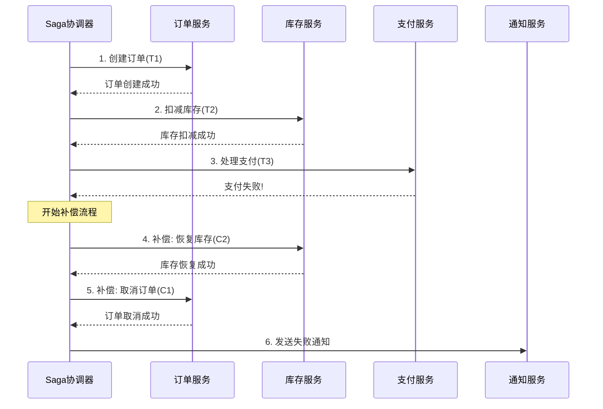

### 7.4 Saga 协调器实现

```typescript
// libs/shared/src/saga/saga-orchestrator.ts

import { Injectable, Logger } from '@nestjs/common';
import { EventEmitter2 } from '@nestjs/event-emitter';

export enum SagaStepStatus {
  PENDING = 'PENDING',
  SUCCESS = 'SUCCESS',
  FAILED = 'FAILED',
  COMPENSATING = 'COMPENSATING',
  COMPENSATED = 'COMPENSATED',
}

export interface SagaStep {
  name: string;
  execute: () => Promise<any>;
  compensate?: () => Promise<any>;
  compensateOnlyIf?: (result: any) => boolean;
}

export interface SagaInstance {
  id: string;
  name: string;
  status: SagaStepStatus;
  steps: Array<{
    name: string;
    status: SagaStepStatus;
    result?: any;
    error?: any;
    startedAt?: Date;
    completedAt?: Date;
  }>;
  context: Record<string, any>;
  createdAt: Date;
  updatedAt: Date;
}

@Injectable()
export class SagaOrchestrator {
  private readonly logger = new Logger(SagaOrchestrator.name);
  private sagaInstances = new Map<string, SagaInstance>();

  constructor(private readonly eventEmitter: EventEmitter2) {}

  // 启动Saga事务
  async startSaga(
    sagaName: string,
    steps: SagaStep[],
    context: Record<string, any> = {},
  ): Promise<SagaInstance> {
    const sagaId = generateSagaId();
    const instance: SagaInstance = {
      id: sagaId,
      name: sagaName,
      status: SagaStepStatus.PENDING,
      steps: steps.map(s => ({
        name: s.name,
        status: SagaStepStatus.PENDING,
      })),
      context,
      createdAt: new Date(),
      updatedAt: new Date(),
    };

    this.sagaInstances.set(sagaId, instance);
    this.logger.log(`Saga started: ${sagaName} (${sagaId})`);

    // 异步执行Saga步骤
    this.executeSaga(sagaId, steps).catch(error => {
      this.logger.error(`Saga execution failed: ${sagaId}`, error);
    });

    return instance;
  }

  private async executeSaga(sagaId: string, steps: SagaStep[]): Promise<void> {
    const instance = this.sagaInstances.get(sagaId)!;
    const completedSteps: number[] = [];

    try {
      for (let i = 0; i < steps.length; i++) {
        const step = steps[i];
        const stepRecord = instance.steps[i];

        stepRecord.status = SagaStepStatus.PENDING;
        stepRecord.startedAt = new Date();
        instance.updatedAt = new Date();

        this.eventEmitter.emit('saga.step.started', {
          sagaId,
          stepName: step.name,
          index: i,
        });

        try {
          const result = await step.execute();
          stepRecord.status = SagaStepStatus.SUCCESS;
          stepRecord.result = result;
          stepRecord.completedAt = new Date();
          completedSteps.push(i);

          // 存储结果到上下文供后续步骤使用
          instance.context[`${step.name}Result`] = result;

          this.eventEmitter.emit('saga.step.completed', {
            sagaId,
            stepName: step.name,
            result,
          });
        } catch (error) {
          stepRecord.status = SagaStepStatus.FAILED;
          stepRecord.error = error.message;
          stepRecord.completedAt = new Date();
          instance.updatedAt = new Date();

          this.logger.error(`Saga step failed: ${step.name}`, error);

          this.eventEmitter.emit('saga.step.failed', {
            sagaId,
            stepName: step.name,
            error,
          });

          // 执行补偿
          await this.compensate(sagaId, steps, completedSteps);
          instance.status = SagaStepStatus.FAILED;
          return;
        }
      }

      instance.status = SagaStepStatus.SUCCESS;
      instance.updatedAt = new Date();

      this.eventEmitter.emit('saga.completed', {
        sagaId,
        sagaName: instance.name,
      });

    } catch (error) {
      instance.status = SagaStepStatus.FAILED;
      this.logger.error(`Unexpected saga error: ${sagaId}`, error);
    }
  }

  private async compensate(
    sagaId: string,
    steps: SagaStep[],
    completedSteps: number[],
  ): Promise<void> {
    const instance = this.sagaInstances.get(sagaId)!;

    // 逆向执行补偿
    for (let i = completedSteps.length - 1; i >= 0; i--) {
      const stepIndex = completedSteps[i];
      const step = steps[stepIndex];
      const stepRecord = instance.steps[stepIndex];

      if (!step.compensate) {
        continue;
      }

      // 检查是否需要补偿
      if (step.compensateOnlyIf && !step.compensateOnlyIf(stepRecord.result)) {
        continue;
      }

      stepRecord.status = SagaStepStatus.COMPENSATING;
      instance.updatedAt = new Date();

      this.eventEmitter.emit('saga.compensating', {
        sagaId,
        stepName: step.name,
      });

      try {
        await step.compensate();
        stepRecord.status = SagaStepStatus.COMPENSATED;

        this.eventEmitter.emit('saga.compensated', {
          sagaId,
          stepName: step.name,
        });
      } catch (error) {
        this.logger.error(`Compensation failed: ${step.name}`, error);
        stepRecord.error = `Compensation failed: ${error.message}`;

        this.eventEmitter.emit('saga.compensation.failed', {
          sagaId,
          stepName: step.name,
          error,
        });

        // 补偿失败需要人工介入或重试队列
        await this.handleCompensationFailure(sagaId, step.name, error);
      }
    }
  }

  private async handleCompensationFailure(
    sagaId: string,
    stepName: string,
    error: any,
  ): Promise<void> {
    // 发送到死信队列或告警系统
    this.logger.error(`CRITICAL: Compensation failed for saga ${sagaId}, step ${stepName}`);
    // TODO: 发送告警、记录到数据库等待人工处理
  }

  getSagaInstance(sagaId: string): SagaInstance | undefined {
    return this.sagaInstances.get(sagaId);
  }

  getAllSagas(): SagaInstance[] {
    return Array.from(this.sagaInstances.values());
  }
}
```

### 7.5 Saga 订单流程示例

```typescript
// apps/order-service/src/sagas/create-order.saga.ts

import { Injectable } from '@nestjs/common';
import { SagaOrchestrator, SagaStep } from '@shared/saga';
import { OrderService } from '../order.service';
import { InventoryClient } from '../clients/inventory.client';
import { PaymentClient } from '../clients/payment.client';
import { NotificationClient } from '../clients/notification.client';

@Injectable()
export class CreateOrderSaga {
  constructor(
    private readonly sagaOrchestrator: SagaOrchestrator,
    private readonly orderService: OrderService,
    private readonly inventoryClient: InventoryClient,
    private readonly paymentClient: PaymentClient,
    private readonly notificationClient: NotificationClient,
  ) {}

  async start(createOrderDto: CreateOrderDto): Promise<{ sagaId: string }> {
    const steps: SagaStep[] = [
      {
        name: 'createOrder',
        execute: async () => {
          const order = await this.orderService.create({
            userId: createOrderDto.userId,
            items: createOrderDto.items,
            status: 'PENDING',
          });
          return { orderId: order.id, totalAmount: order.totalAmount };
        },
        compensate: async () => {
          // 获取上下文中的orderId
          const { createOrderResult } = this.getContext();
          await this.orderService.cancel(createOrderResult.orderId);
        },
      },
      {
        name: 'reserveInventory',
        execute: async () => {
          const { createOrderResult } = this.getContext();
          const result = await this.inventoryClient.reserve({
            orderId: createOrderResult.orderId,
            items: createOrderDto.items,
          });
          return { reservationId: result.reservationId };
        },
        compensate: async () => {
          const { reserveInventoryResult } = this.getContext();
          await this.inventoryClient.releaseReservation(
            reserveInventoryResult.reservationId,
          );
        },
      },
      {
        name: 'processPayment',
        execute: async () => {
          const { createOrderResult } = this.getContext();
          const result = await this.paymentClient.charge({
            orderId: createOrderResult.orderId,
            amount: createOrderResult.totalAmount,
            paymentMethod: createOrderDto.paymentMethod,
          });
          return { paymentId: result.paymentId, transactionId: result.transactionId };
        },
        compensate: async () => {
          const { processPaymentResult } = this.getContext();
          await this.paymentClient.refund(processPaymentResult.paymentId);
        },
      },
      {
        name: 'confirmOrder',
        execute: async () => {
          const { createOrderResult, processPaymentResult } = this.getContext();
          await this.orderService.confirm(createOrderResult.orderId, {
            paymentId: processPaymentResult.paymentId,
          });
          return { confirmed: true };
        },
        // 确认订单不需要补偿，或发送取消通知
      },
      {
        name: 'sendNotification',
        execute: async () => {
          const { createOrderResult } = this.getContext();
          await this.notificationClient.send({
            userId: createOrderDto.userId,
            type: 'ORDER_CONFIRMED',
            data: { orderId: createOrderResult.orderId },
          });
          return { sent: true };
        },
        // 通知失败不影响主流程，无需补偿
        compensateOnlyIf: () => false,
      },
    ];

    const instance = await this.sagaOrchestrator.startSaga(
      'createOrder',
      steps,
      { createOrderDto },
    );

    return { sagaId: instance.id };
  }

  private getContext(): any {
    // 实际实现中从 saga instance 获取上下文
    return {};
  }
}
```

### 7.6 TCC 模式

**概念：** Try-Confirm-Cancel，每个操作提供三个接口：

- **Try**：预留资源，执行业务检查
- **Confirm**：真正执行业务（使用Try预留的资源）
- **Cancel**：释放Try预留的资源

```typescript
// libs/shared/src/tcc/tcc-coordinator.ts

import { Injectable, Logger } from '@nestjs/common';

export interface TccParticipant {
  name: string;
  try: () => Promise<any>;
  confirm: (tryResult: any) => Promise<void>;
  cancel: (tryResult: any) => Promise<void>;
}

export interface TccTransaction {
  id: string;
  status: 'TRYING' | 'CONFIRMED' | 'CANCELLED';
  participants: Array<{
    name: string;
    tryResult?: any;
    status: 'TRYING' | 'TRIED' | 'CONFIRMED' | 'CANCELLED' | 'FAILED';
  }>;
}

@Injectable()
export class TccCoordinator {
  private readonly logger = new Logger(TccCoordinator.name);
  private transactions = new Map<string, TccTransaction>();

  async executeTransaction(
    transactionId: string,
    participants: TccParticipant[],
  ): Promise<void> {
    const transaction: TccTransaction = {
      id: transactionId,
      status: 'TRYING',
      participants: participants.map(p => ({
        name: p.name,
        status: 'TRYING',
      })),
    };

    this.transactions.set(transactionId, transaction);

    const tryResults: Array<{ participant: string; result: any }> = [];

    // Phase 1: Try
    try {
      for (let i = 0; i < participants.length; i++) {
        const participant = participants[i];
        this.logger.log(`TCC Try: ${participant.name}`);

        const result = await participant.try();
        tryResults.push({ participant: participant.name, result });
        transaction.participants[i].tryResult = result;
        transaction.participants[i].status = 'TRIED';
      }
    } catch (error) {
      this.logger.error(`TCC Try failed: ${error.message}`);
      // Try失败，执行Cancel
      await this.cancelTransaction(transactionId, participants, tryResults);
      throw error;
    }

    // Phase 2: Confirm
    try {
      for (let i = 0; i < participants.length; i++) {
        const participant = participants[i];
        const tryResult = transaction.participants[i].tryResult;

        this.logger.log(`TCC Confirm: ${participant.name}`);
        await participant.confirm(tryResult);
        transaction.participants[i].status = 'CONFIRMED';
      }
      transaction.status = 'CONFIRMED';
    } catch (error) {
      this.logger.error(`TCC Confirm failed: ${error.message}`);
      // Confirm失败需要记录，等待人工处理或重试
      await this.handleConfirmFailure(transactionId, error);
      throw error;
    }
  }

  private async cancelTransaction(
    transactionId: string,
    participants: TccParticipant[],
    tryResults: Array<{ participant: string; result: any }>,
  ): Promise<void> {
    const transaction = this.transactions.get(transactionId)!;

    for (let i = tryResults.length - 1; i >= 0; i--) {
      const { participant: name, result } = tryResults[i];
      const participant = participants.find(p => p.name === name)!;
      const participantRecord = transaction.participants.find(p => p.name === name)!;

      try {
        this.logger.log(`TCC Cancel: ${name}`);
        await participant.cancel(result);
        participantRecord.status = 'CANCELLED';
      } catch (error) {
        this.logger.error(`TCC Cancel failed: ${name}`, error);
        participantRecord.status = 'FAILED';
        await this.handleCancelFailure(transactionId, name, error);
      }
    }

    transaction.status = 'CANCELLED';
  }

  private async handleConfirmFailure(transactionId: string, error: any): Promise<void> {
    // Confirm失败需要重试机制或人工介入
    this.logger.error(`CRITICAL: TCC Confirm failed for ${transactionId}`, error);
  }

  private async handleCancelFailure(
    transactionId: string,
    participantName: string,
    error: any,
  ): Promise<void> {
    this.logger.error(
      `CRITICAL: TCC Cancel failed for ${transactionId}, participant ${participantName}`,
      error,
    );
  }
}
```

```typescript
// TCC 账户转账示例
// apps/payment-service/src/tcc/transfer.tcc.ts

import { Injectable } from '@nestjs/common';
import { TccCoordinator, TccParticipant } from '@shared/tcc';

@Injectable()
export class TransferTccService {
  constructor(
    private readonly tccCoordinator: TccCoordinator,
    private readonly accountRepository: AccountRepository,
    private readonly freezeRepository: FreezeRepository,
  ) {}

  async transfer(fromAccount: string, toAccount: string, amount: number): Promise<void> {
    const transactionId = generateTransactionId();

    const participants: TccParticipant[] = [
      {
        name: 'debitFromAccount',
        try: async () => {
          // 检查余额
          const account = await this.accountRepository.findById(fromAccount);
          if (account.balance < amount) {
            throw new Error('Insufficient balance');
          }

          // 冻结金额
          const freezeRecord = await this.freezeRepository.create({
            accountId: fromAccount,
            amount,
            transactionId,
            status: 'FROZEN',
          });

          // 扣减可用余额
          await this.accountRepository.decreaseBalance(fromAccount, amount);

          return { freezeId: freezeRecord.id, accountId: fromAccount, amount };
        },
        confirm: async (tryResult) => {
          // 确认：将冻结转为实际支出
          await this.freezeRepository.update(tryResult.freezeId, {
            status: 'CONFIRMED',
            confirmedAt: new Date(),
          });
        },
        cancel: async (tryResult) => {
          // 取消：恢复余额，删除冻结记录
          await this.accountRepository.increaseBalance(tryResult.accountId, tryResult.amount);
          await this.freezeRepository.delete(tryResult.freezeId);
        },
      },
      {
        name: 'creditToAccount',
        try: async () => {
          // 预增加余额（使用冻结表记录）
          const freezeRecord = await this.freezeRepository.create({
            accountId: toAccount,
            amount,
            transactionId,
            status: 'PENDING_CREDIT',
          });

          return { freezeId: freezeRecord.id, accountId: toAccount, amount };
        },
        confirm: async (tryResult) => {
          // 确认：增加实际余额
          await this.accountRepository.increaseBalance(tryResult.accountId, tryResult.amount);
          await this.freezeRepository.update(tryResult.freezeId, {
            status: 'CONFIRMED',
            confirmedAt: new Date(),
          });
        },
        cancel: async (tryResult) => {
          // 取消：删除预增加记录
          await this.freezeRepository.delete(tryResult.freezeId);
        },
      },
    ];

    await this.tccCoordinator.executeTransaction(transactionId, participants);
  }
}
```

### 7.7 本地消息表

```typescript
// libs/shared/src/outbox/outbox.service.ts

import { Injectable, Logger, OnModuleInit } from '@nestjs/common';
import { InjectRepository } from '@nestjs/typeorm';
import { Repository, LessThan } from 'typeorm';
import { EventEmitter2 } from '@nestjs/event-emitter';

export interface OutboxMessage {
  id: string;
  aggregateType: string;
  aggregateId: string;
  eventType: string;
  payload: string;
  headers: string;
  status: 'PENDING' | 'PUBLISHED' | 'FAILED';
  retryCount: number;
  createdAt: Date;
  publishedAt?: Date;
}

@Injectable()
export class OutboxService implements OnModuleInit {
  private readonly logger = new Logger(OutboxService.name);
  private readonly maxRetries = 3;
  private readonly retryInterval = 5000;

  constructor(
    @InjectRepository(OutboxMessage)
    private readonly outboxRepository: Repository<OutboxMessage>,
    private readonly eventEmitter: EventEmitter2,
  ) {}

  onModuleInit() {
    // 启动后台轮询任务
    this.startPoller();
  }

  // 在业务事务中保存事件到Outbox表
  async saveEvent(event: {
    aggregateType: string;
    aggregateId: string;
    eventType: string;
    payload: any;
    headers?: Record<string, string>;
  }): Promise<void> {
    const message = this.outboxRepository.create({
      id: generateUUID(),
      aggregateType: event.aggregateType,
      aggregateId: event.aggregateId,
      eventType: event.eventType,
      payload: JSON.stringify(event.payload),
      headers: JSON.stringify(event.headers || {}),
      status: 'PENDING',
      retryCount: 0,
      createdAt: new Date(),
    });

    await this.outboxRepository.save(message);
    this.logger.log(`Event saved to outbox: ${event.eventType}`);
  }

  private startPoller(): void {
    setInterval(async () => {
      await this.processPendingMessages();
    }, this.retryInterval);
  }

  private async processPendingMessages(): Promise<void> {
    const pendingMessages = await this.outboxRepository.find({
      where: {
        status: 'PENDING',
        retryCount: LessThan(this.maxRetries),
      },
      take: 100, // 批量处理
      order: { createdAt: 'ASC' },
    });

    for (const message of pendingMessages) {
      try {
        await this.publishMessage(message);
      } catch (error) {
        await this.handlePublishFailure(message, error);
      }
    }
  }

  private async publishMessage(message: OutboxMessage): Promise<void> {
    const event = {
      id: message.id,
      aggregateType: message.aggregateType,
      aggregateId: message.aggregateId,
      eventType: message.eventType,
      payload: JSON.parse(message.payload),
      headers: JSON.parse(message.headers),
      occurredAt: message.createdAt,
    };

    // 发布到消息总线
    await this.eventEmitter.emitAsync(message.eventType, event);

    // 标记为已发布
    await this.outboxRepository.update(message.id, {
      status: 'PUBLISHED',
      publishedAt: new Date(),
    });

    this.logger.log(`Message published: ${message.eventType} (${message.id})`);
  }

  private async handlePublishFailure(message: OutboxMessage, error: any): Promise<void> {
    const newRetryCount = message.retryCount + 1;

    if (newRetryCount >= this.maxRetries) {
      await this.outboxRepository.update(message.id, {
        status: 'FAILED',
        retryCount: newRetryCount,
      });
      this.logger.error(`Message failed after ${this.maxRetries} retries: ${message.id}`, error);
      // 发送告警
    } else {
      await this.outboxRepository.update(message.id, {
        retryCount: newRetryCount,
      });
      this.logger.warn(`Message publish failed, will retry: ${message.id}`, error.message);
    }
  }
}
```

### 7.8 工具推荐

| 工具 | 类型 | 特点 |
|------|------|------|
| Seata | 2PC/TCC/Saga | 阿里巴巴开源，Java生态，功能全面 |
| Axon Framework | Saga | Java事件溯源框架 |
| Eventuate | Saga | 支持多种数据库和消息代理 |
| Camunda | Saga | 流程引擎，可视化编排 |
| Temporal | Saga | 强大的工作流引擎，支持多种语言 |
| Outbox Pattern | 本地消息表 | 通用模式，自行实现或使用框架 |
| Debezium | CDC | 数据库变更捕获，配合Outbox使用 |

---

## 8. 监控和可观测性

### 8.1 概念解释

可观测性（Observability）是通过系统的外部输出了解其内部状态的能力。微服务架构中，三大支柱是：

| 支柱 | 说明 | 代表工具 |
|------|------|---------|
| **日志 (Logs)** | 离散的事件记录 | ELK Stack, Loki |
| **指标 (Metrics)** | 可聚合的数值数据 | Prometheus, InfluxDB |
| **追踪 (Traces)** | 请求在分布式系统中的完整路径 | Jaeger, Zipkin |

### 8.2 可观测性架构

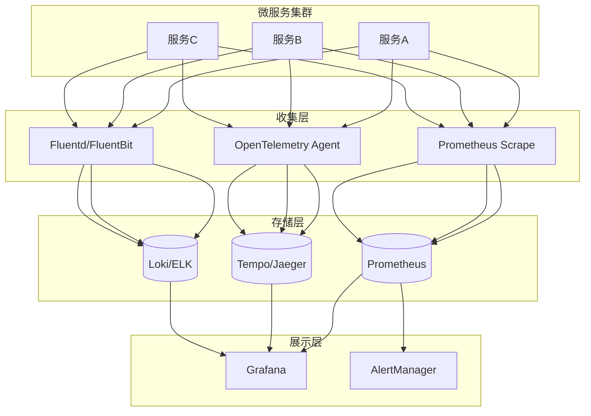

### 8.3 OpenTelemetry 集成

```typescript
// libs/shared/src/observability/tracing.ts

import { NodeSDK } from '@opentelemetry/sdk-node';
import { getNodeAutoInstrumentations } from '@opentelemetry/auto-instrumentations-node';
import { JaegerExporter } from '@opentelemetry/exporter-jaeger';
import { PrometheusExporter } from '@opentelemetry/exporter-prometheus';
import { OTLPTraceExporter } from '@opentelemetry/exporter-trace-otlp-http';
import { Resource } from '@opentelemetry/resources';
import { SemanticResourceAttributes } from '@opentelemetry/semantic-conventions';
import { SimpleSpanProcessor, BatchSpanProcessor } from '@opentelemetry/sdk-trace-node';
import { MeterProvider, PeriodicExportingMetricReader } from '@opentelemetry/sdk-metrics';
import { diag, DiagConsoleLogger, DiagLogLevel } from '@opentelemetry/api';

// 启用诊断日志
diag.setLogger(new DiagConsoleLogger(), DiagLogLevel.INFO);

export function initializeTracing(serviceName: string, serviceVersion: string) {
  const resource = new Resource({
    [SemanticResourceAttributes.SERVICE_NAME]: serviceName,
    [SemanticResourceAttributes.SERVICE_VERSION]: serviceVersion,
    [SemanticResourceAttributes.DEPLOYMENT_ENVIRONMENT]: process.env.NODE_ENV || 'development',
  });

  // 追踪导出器
  const traceExporter = process.env.JAEGER_ENDPOINT
    ? new JaegerExporter({
        endpoint: process.env.JAEGER_ENDPOINT,
      })
    : new OTLPTraceExporter({
        url: process.env.OTEL_EXPORTER_OTLP_ENDPOINT || 'http://localhost:4318/v1/traces',
      });

  // 指标导出器
  const prometheusExporter = new PrometheusExporter({
    port: 9464,
    endpoint: '/metrics',
  });

  const sdk = new NodeSDK({
    resource,
    traceExporter,
    metricReader: prometheusExporter,
    instrumentations: [
      getNodeAutoInstrumentations({
        '@opentelemetry/instrumentation-http': {
          enabled: true,
          applyCustomAttributesOnSpan: (span, request, response) => {
            span.setAttribute('http.request.body.size', request.headers['content-length'] || 0);
          },
        },
        '@opentelemetry/instrumentation-express': { enabled: true },
        '@opentelemetry/instrumentation-nestjs-core': { enabled: true },
        '@opentelemetry/instrumentation-ioredis': { enabled: true },
        '@opentelemetry/instrumentation-amqplib': { enabled: true },
        '@opentelemetry/instrumentation-grpc': { enabled: true },
      }),
    ],
    spanProcessor: new BatchSpanProcessor(traceExporter, {
      maxQueueSize: 2048,
      maxExportBatchSize: 512,
      scheduledDelayMillis: 5000,
    }),
  });

  sdk.start();

  // 优雅关闭
  process.on('SIGTERM', () => {
    sdk.shutdown()
      .then(() => console.log('Tracing terminated'))
      .catch((error) => console.log('Error terminating tracing', error))
      .finally(() => process.exit(0));
  });

  return sdk;
}
```

```typescript
// NestJS 追踪拦截器
// libs/shared/src/observability/tracing.interceptor.ts

import {
  Injectable,
  NestInterceptor,
  ExecutionContext,
  CallHandler,
} from '@nestjs/common';
import { Observable } from 'rxjs';
import { tap, catchError } from 'rxjs/operators';
import { trace, context, SpanStatusCode, SpanKind } from '@opentelemetry/api';

@Injectable()
export class TracingInterceptor implements NestInterceptor {
  private readonly tracer = trace.getTracer('nestjs-tracer');

  intercept(executionContext: ExecutionContext, next: CallHandler): Observable<any> {
    const request = executionContext.switchToHttp().getRequest();
    const handlerName = executionContext.getHandler().name;
    const controllerName = executionContext.getClass().name;
    const spanName = `${controllerName}.${handlerName}`;

    const span = this.tracer.startSpan(spanName, {
      kind: SpanKind.SERVER,
      attributes: {
        'http.method': request.method,
        'http.url': request.url,
        'http.route': request.route?.path,
        'http.host': request.headers.host,
        'http.user_agent': request.headers['user-agent'],
        'http.request.id': request.headers['x-request-id'],
        'nestjs.controller': controllerName,
        'nestjs.handler': handlerName,
      },
    });

    // 将span设置到当前上下文
    const ctx = trace.setSpan(context.active(), span);

    return context.with(ctx, () => {
      const startTime = Date.now();

      return next.handle().pipe(
        tap((data) => {
          const duration = Date.now() - startTime;
          span.setAttributes({
            'http.status_code': 200,
            'http.response.body.size': JSON.stringify(data).length,
            'duration_ms': duration,
          });
          span.setStatus({ code: SpanStatusCode.OK });
          span.end();
        }),
        catchError((error) => {
          const duration = Date.now() - startTime;
          span.setAttributes({
            'http.status_code': error.status || 500,
            'error.type': error.name,
            'error.message': error.message,
            'error.stack': error.stack,
            'duration_ms': duration,
          });
          span.setStatus({
            code: SpanStatusCode.ERROR,
            message: error.message,
          });
          span.recordException(error);
          span.end();
          throw error;
        }),
      );
    });
  }
}
```

```typescript
// 自定义追踪装饰器
// libs/shared/src/observability/trace.decorator.ts

import { trace, context, SpanStatusCode, SpanKind } from '@opentelemetry/api';

export function Trace(spanName?: string, attributes?: Record<string, any>) {
  return function (target: any, propertyKey: string, descriptor: PropertyDescriptor) {
    const originalMethod = descriptor.value;
    const methodName = spanName || `${target.constructor.name}.${propertyKey}`;

    descriptor.value = async function (...args: any[]) {
      const tracer = trace.getTracer('application');

      const span = tracer.startSpan(methodName, {
        kind: SpanKind.INTERNAL,
        attributes: {
          'code.function': propertyKey,
          'code.namespace': target.constructor.name,
          ...attributes,
        },
      });

      const ctx = trace.setSpan(context.active(), span);

      try {
        const result = await context.with(ctx, () => originalMethod.apply(this, args));
        span.setStatus({ code: SpanStatusCode.OK });
        return result;
      } catch (error) {
        span.setStatus({
          code: SpanStatusCode.ERROR,
          message: error.message,
        });
        span.recordException(error);
        throw error;
      } finally {
        span.end();
      }
    };

    return descriptor;
  };
}

// 使用示例
@Injectable()
export class OrderService {
  @Trace('OrderService.createOrder', { 'business.operation': 'create_order' })
  async createOrder(dto: CreateOrderDto): Promise<Order> {
    // 业务逻辑
  }

  @Trace('OrderService.processPayment')
  async processPayment(orderId: string): Promise<void> {
    // 业务逻辑
  }
}
```

### 8.4 结构化日志

```typescript
// libs/shared/src/observability/logger.service.ts

import { Injectable, LoggerService, LogLevel } from '@nestjs/common';
import winston from 'winston';
import { trace, context } from '@opentelemetry/api';

interface LogContext {
  traceId?: string;
  spanId?: string;
  userId?: string;
  requestId?: string;
  [key: string]: any;
}

@Injectable()
export class StructuredLogger implements LoggerService {
  private readonly logger: winston.Logger;

  constructor() {
    this.logger = winston.createLogger({
      level: process.env.LOG_LEVEL || 'info',
      defaultMeta: {
        service: process.env.SERVICE_NAME,
        version: process.env.SERVICE_VERSION,
        environment: process.env.NODE_ENV,
        host: require('os').hostname(),
      },
      format: winston.format.combine(
        winston.format.timestamp(),
        winston.format.errors({ stack: true }),
        winston.format.json(),
      ),
      transports: [
        new winston.transports.Console(),
        // 生产环境可添加文件或远程传输
        // new winston.transports.File({ filename: 'app.log' }),
      ],
    });
  }

  log(message: string, context?: LogContext) {
    this.logger.info(message, this.enrichContext(context));
  }

  error(message: string, trace?: string, context?: LogContext) {
    this.logger.error(message, { ...this.enrichContext(context), stack: trace });
  }

  warn(message: string, context?: LogContext) {
    this.logger.warn(message, this.enrichContext(context));
  }

  debug(message: string, context?: LogContext) {
    this.logger.debug(message, this.enrichContext(context));
  }

  verbose(message: string, context?: LogContext) {
    this.logger.verbose(message, this.enrichContext(context));
  }

  // 业务审计日志
  audit(action: string, resource: string, details: any, context?: LogContext) {
    this.logger.info('AUDIT_LOG', {
      ...this.enrichContext(context),
      audit: true,
      action,
      resource,
      details,
    });
  }

  // 性能日志
  performance(operation: string, durationMs: number, context?: LogContext) {
    this.logger.info('PERFORMANCE', {
      ...this.enrichContext(context),
      performance: true,
      operation,
      durationMs,
    });
  }

  private enrichContext(ctx?: LogContext): LogContext {
    const span = trace.getSpan(context.active());
    const spanContext = span?.spanContext();

    return {
      ...ctx,
      traceId: spanContext?.traceId || ctx?.traceId,
      spanId: spanContext?.spanId || ctx?.spanId,
      timestamp: new Date().toISOString(),
    };
  }
}
```

### 8.5 指标收集

```typescript
// libs/shared/src/observability/metrics.service.ts

import { Injectable } from '@nestjs/common';
import { metrics, Counter, Histogram, UpDownCounter, ObservableGauge } from '@opentelemetry/api';

@Injectable()
export class MetricsService {
  private readonly meter = metrics.getMeter('application-metrics');

  // 业务指标
  private readonly orderCounter: Counter;
  private readonly orderValueHistogram: Histogram;
  private readonly activeUsers: UpDownCounter;
  private readonly paymentLatency: Histogram;

  constructor() {
    // 订单计数器
    this.orderCounter = this.meter.createCounter('orders.total', {
      description: 'Total number of orders',
      unit: '1',
    });

    // 订单金额分布
    this.orderValueHistogram = this.meter.createHistogram('orders.value', {
      description: 'Order value distribution',
      unit: 'USD',
      advice: {
        explicitBucketBoundaries: [10, 50, 100, 500, 1000, 5000],
      },
    });

    // 活跃用户数
    this.activeUsers = this.meter.createUpDownCounter('users.active', {
      description: 'Number of active users',
      unit: '1',
    });

    // 支付延迟
    this.paymentLatency = this.meter.createHistogram('payment.latency', {
      description: 'Payment processing latency',
      unit: 'ms',
    });
  }

  // 记录订单创建
  recordOrderCreated(orderValue: number, status: string, userType: string): void {
    this.orderCounter.add(1, {
      status,
      user_type: userType,
    });

    this.orderValueHistogram.record(orderValue, {
      status,
      user_type: userType,
    });
  }

  // 记录支付延迟
  recordPaymentLatency(durationMs: number, paymentMethod: string, status: string): void {
    this.paymentLatency.record(durationMs, {
      payment_method: paymentMethod,
      status,
    });
  }

  // 用户上下线
  userLoggedIn(): void {
    this.activeUsers.add(1);
  }

  userLoggedOut(): void {
    this.activeUsers.add(-1);
  }
}
```

### 8.6 健康检查

```typescript
// libs/shared/src/health/health.controller.ts

import { Controller, Get } from '@nestjs/common';
import {
  HealthCheck,
  HealthCheckService,
  HttpHealthIndicator,
  TypeOrmHealthIndicator,
  MemoryHealthIndicator,
  DiskHealthIndicator,
} from '@nestjs/terminus';
import { RedisHealthIndicator } from './redis.health';
import { RabbitMQHealthIndicator } from './rabbitmq.health';

@Controller('health')
export class HealthController {
  constructor(
    private readonly health: HealthCheckService,
    private readonly http: HttpHealthIndicator,
    private readonly db: TypeOrmHealthIndicator,
    private readonly memory: MemoryHealthIndicator,
    private readonly disk: DiskHealthIndicator,
    private readonly redis: RedisHealthIndicator,
    private readonly rabbitmq: RabbitMQHealthIndicator,
  ) {}

  @Get()
  @HealthCheck()
  check() {
    return this.health.check([
      // 数据库检查
      () => this.db.pingCheck('database', { timeout: 3000 }),

      // Redis检查
      () => this.redis.isHealthy('redis'),

      // 内存检查（< 150MB）
      () => this.memory.checkHeap('memory_heap', 150 * 1024 * 1024),

      // 磁盘检查（> 250MB可用）
      () => this.disk.checkStorage('disk', { thresholdPercent: 0.9, path: '/' }),
    ]);
  }

  @Get('ready')
  @HealthCheck()
  readiness() {
    return this.health.check([
      () => this.db.pingCheck('database'),
      () => this.redis.isHealthy('redis'),
    ]);
  }

  @Get('live')
  @HealthCheck()
  liveness() {
    return this.health.check([
      () => this.memory.checkHeap('memory_heap', 300 * 1024 * 1024),
    ]);
  }

  @Get('dependencies')
  @HealthCheck()
  dependencies() {
    return this.health.check([
      // 检查外部依赖服务
      () => this.http.pingCheck('user-service', 'http://user-service/health'),
      () => this.http.pingCheck('payment-service', 'http://payment-service/health'),
      () => this.rabbitmq.isHealthy('message-queue'),
    ]);
  }
}
```

### 8.7 告警配置

```yaml
# prometheus-alert-rules.yml
groups:
  - name: microservices-alerts
    rules:
      # 高错误率告警
      - alert: HighErrorRate
        expr: |
          (
            sum(rate(http_requests_total{status=~"5.."}[5m]))
            /
            sum(rate(http_requests_total[5m]))
          ) > 0.05
        for: 2m
        labels:
          severity: critical
        annotations:
          summary: "High error rate detected"
          description: "Error rate is {{ $value | humanizePercentage }} for the last 5 minutes"

      # 高延迟告警
      - alert: HighLatency
        expr: |
          histogram_quantile(0.95,
            sum(rate(http_request_duration_seconds_bucket[5m])) by (le, service)
          ) > 0.5
        for: 5m
        labels:
          severity: warning
        annotations:
          summary: "High latency detected"
          description: "95th percentile latency is {{ $value }}s for service {{ $labels.service }}"

      # 服务不可用
      - alert: ServiceDown
        expr: up == 0
        for: 1m
        labels:
          severity: critical
        annotations:
          summary: "Service {{ $labels.job }} is down"
          description: "Service {{ $labels.job }} has been down for more than 1 minute"

      # 熔断器打开
      - alert: CircuitBreakerOpen
        expr: circuit_breaker_state{state="OPEN"} == 1
        for: 0m
        labels:
          severity: warning
        annotations:
          summary: "Circuit breaker is open"
          description: "Circuit breaker {{ $labels.name }} is in OPEN state"

      # 内存使用过高
      - alert: HighMemoryUsage
        expr: |
          (
            node_memory_MemTotal_bytes - node_memory_MemAvailable_bytes
          ) / node_memory_MemTotal_bytes > 0.85
        for: 5m
        labels:
          severity: warning
        annotations:
          summary: "High memory usage"
          description: "Memory usage is {{ $value | humanizePercentage }}"
```

### 8.8 工具推荐

| 类别 | 工具 | 用途 |
|------|------|------|
| 追踪 | Jaeger | 开源分布式追踪系统 |
| 追踪 | Zipkin | Twitter开源，轻量级 |
| 追踪 | Tempo | Grafana出品，与Loki集成 |
| 追踪 | AWS X-Ray | 云托管追踪服务 |
| 指标 | Prometheus | 事实标准时序数据库 |
| 指标 | InfluxDB | 高性能时序数据库 |
| 指标 | VictoriaMetrics | 高性能Prometheus兼容存储 |
| 日志 | ELK Stack | Elasticsearch + Logstash + Kibana |
| 日志 | Loki | Grafana出品，轻量级 |
| 日志 | Fluentd/Fluent Bit | 日志收集器 |
| 展示 | Grafana | 可视化平台，支持多数据源 |
| SDK | OpenTelemetry | 统一的可观测性标准 |

---

## 9. 数据一致性策略

### 9.1 概念解释

微服务架构中，每个服务拥有独立的数据库，需要解决数据一致性问题。

**一致性模型：**

| 模型 | 说明 | 适用场景 |
|------|------|---------|
| **强一致性** | 所有节点同时看到相同数据 | 金融交易、库存扣减 |
| **最终一致性** | 数据在一段时间后达到一致 | 大多数业务场景 |
| **因果一致性** | 有因果关系的事件保持顺序 | 用户操作序列 |
| **会话一致性** | 同一会话内读取自己写入 | 用户个人数据 |

### 9.2 数据一致性策略架构

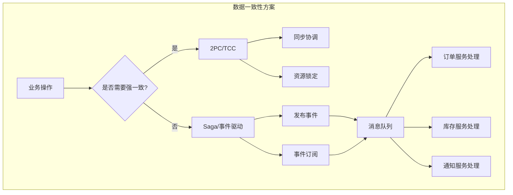

### 9.3 事件溯源 (Event Sourcing)

```typescript
// libs/shared/src/event-sourcing/event-store.ts

import { Injectable } from '@nestjs/common';
import { InjectRepository } from '@nestjs/typeorm';
import { Repository } from 'typeorm';

export interface DomainEvent {
  id: string;
  aggregateId: string;
  aggregateType: string;
  eventType: string;
  eventVersion: number;
  payload: any;
  metadata: {
    timestamp: string;
    correlationId: string;
    causationId?: string;
    userId?: string;
  };
  sequenceNumber: number;
}

export interface EventStoreEntity {
  id: string;
  aggregateId: string;
  aggregateType: string;
  eventType: string;
  eventVersion: number;
  payload: string;
  metadata: string;
  sequenceNumber: number;
  createdAt: Date;
}

@Injectable()
export class EventStore {
  constructor(
    @InjectRepository(EventStoreEntity)
    private readonly eventRepository: Repository<EventStoreEntity>,
  ) {}

  // 保存事件
  async appendEvents(events: DomainEvent[]): Promise<void> {
    const entities = events.map(event => this.toEntity(event));
    await this.eventRepository.save(entities);
  }

  // 读取聚合的所有事件
  async getEvents(
    aggregateId: string,
    options?: { afterSequence?: number; limit?: number },
  ): Promise<DomainEvent[]> {
    const query = this.eventRepository
      .createQueryBuilder('event')
      .where('event.aggregateId = :aggregateId', { aggregateId })
      .orderBy('event.sequenceNumber', 'ASC');

    if (options?.afterSequence) {
      query.andWhere('event.sequenceNumber > :afterSequence', {
        afterSequence: options.afterSequence,
      });
    }

    if (options?.limit) {
      query.take(options.limit);
    }

    const entities = await query.getMany();
    return entities.map(e => this.toDomain(e));
  }

  // 获取聚合当前版本
  async getCurrentVersion(aggregateId: string): Promise<number> {
    const result = await this.eventRepository
      .createQueryBuilder('event')
      .select('MAX(event.sequenceNumber)', 'max')
      .where('event.aggregateId = :aggregateId', { aggregateId })
      .getRawOne();

    return result?.max || 0;
  }

  // 按事件类型查询
  async getEventsByType(
    eventType: string,
    options?: { afterPosition?: number; limit?: number },
  ): Promise<DomainEvent[]> {
    const query = this.eventRepository
      .createQueryBuilder('event')
      .where('event.eventType = :eventType', { eventType })
      .orderBy('event.createdAt', 'ASC');

    if (options?.limit) {
      query.take(options.limit);
    }

    const entities = await query.getMany();
    return entities.map(e => this.toDomain(e));
  }

  private toEntity(event: DomainEvent): EventStoreEntity {
    return {
      id: event.id,
      aggregateId: event.aggregateId,
      aggregateType: event.aggregateType,
      eventType: event.eventType,
      eventVersion: event.eventVersion,
      payload: JSON.stringify(event.payload),
      metadata: JSON.stringify(event.metadata),
      sequenceNumber: event.sequenceNumber,
      createdAt: new Date(event.metadata.timestamp),
    };
  }

  private toDomain(entity: EventStoreEntity): DomainEvent {
    return {
      id: entity.id,
      aggregateId: entity.aggregateId,
      aggregateType: entity.aggregateType,
      eventType: entity.eventType,
      eventVersion: entity.eventVersion,
      payload: JSON.parse(entity.payload),
      metadata: JSON.parse(entity.metadata),
      sequenceNumber: entity.sequenceNumber,
    };
  }
}
```

```typescript
// 事件溯源聚合根
// apps/order-service/src/domain/order.aggregate.ts

import { AggregateRoot } from '@nestjs/cqrs';
import { OrderCreatedEvent, OrderPaidEvent, OrderShippedEvent } from './order.events';

export class OrderAggregate extends AggregateRoot {
  private id: string;
  private userId: string;
  private items: OrderItem[] = [];
  private status: OrderStatus = OrderStatus.PENDING;
  private totalAmount: number = 0;
  private version: number = 0;

  // 从事件流重建聚合
  loadFromHistory(events: any[]): void {
    for (const event of events) {
      this.apply(event, false);
      this.version++;
    }
  }

  // 创建订单
  static create(props: CreateOrderProps): OrderAggregate {
    const order = new OrderAggregate();
    order.apply(
      new OrderCreatedEvent(
        generateUUID(),
        props.userId,
        props.items,
        props.items.reduce((sum, item) => sum + item.price * item.quantity, 0),
      ),
    );
    return order;
  }

  // 支付订单
  pay(paymentId: string): void {
    if (this.status !== OrderStatus.PENDING) {
      throw new Error('Order can only be paid when pending');
    }

    this.apply(new OrderPaidEvent(this.id, paymentId, new Date()));
  }

  // 发货
  ship(trackingNumber: string): void {
    if (this.status !== OrderStatus.PAID) {
      throw new Error('Order must be paid before shipping');
    }

    this.apply(new OrderShippedEvent(this.id, trackingNumber, new Date()));
  }

  // 事件处理器
  onOrderCreatedEvent(event: OrderCreatedEvent): void {
    this.id = event.aggregateId;
    this.userId = event.userId;
    this.items = event.items;
    this.totalAmount = event.totalAmount;
    this.status = OrderStatus.PENDING;
  }

  onOrderPaidEvent(event: OrderPaidEvent): void {
    this.status = OrderStatus.PAID;
  }

  onOrderShippedEvent(event: OrderShippedEvent): void {
    this.status = OrderStatus.SHIPPED;
  }

  getId(): string {
    return this.id;
  }

  getVersion(): number {
    return this.version;
  }
}
```

```typescript
// 仓储实现
// apps/order-service/src/infrastructure/order.repository.ts

import { Injectable } from '@nestjs/common';
import { EventStore } from '@shared/event-sourcing';
import { OrderAggregate } from '../domain/order.aggregate';
import { EventBus } from '@nestjs/cqrs';

@Injectable()
export class OrderRepository {
  constructor(
    private readonly eventStore: EventStore,
    private readonly eventBus: EventBus,
  ) {}

  async findById(id: string): Promise<OrderAggregate | null> {
    const events = await this.eventStore.getEvents(id);
    if (events.length === 0) {
      return null;
    }

    const order = new OrderAggregate();
    order.loadFromHistory(events);
    return order;
  }

  async save(order: OrderAggregate): Promise<void> {
    const events = order.getUncommittedEvents();
    const currentVersion = await this.eventStore.getCurrentVersion(order.getId());

    // 乐观并发控制
    if (currentVersion !== order.getVersion()) {
      throw new ConcurrencyException(
        `Expected version ${order.getVersion()} but found ${currentVersion}`,
      );
    }

    // 分配序列号
    const eventsWithSequence = events.map((event, index) => ({
      ...event,
      sequenceNumber: currentVersion + index + 1,
    }));

    // 保存到事件存储
    await this.eventStore.appendEvents(eventsWithSequence);

    // 发布事件到总线
    for (const event of eventsWithSequence) {
      this.eventBus.publish(event);
    }

    order.commit();
  }
}
```

### 9.4 CQRS 模式

```typescript
// libs/shared/src/cqrs/cqrs.module.ts

import { Module } from '@nestjs/common';
import { CqrsModule as NestCqrsModule } from '@nestjs/cqrs';
import { ProjectionService } from './projection.service';

@Module({
  imports: [NestCqrsModule],
  providers: [ProjectionService],
  exports: [NestCqrsModule, ProjectionService],
})
export class CqrsModule {}
```

```typescript
// 命令端
// apps/order-service/src/commands/create-order.command.ts

export class CreateOrderCommand {
  constructor(
    public readonly userId: string,
    public readonly items: OrderItem[],
    public readonly shippingAddress: Address,
  ) {}
}

@CommandHandler(CreateOrderCommand)
export class CreateOrderHandler implements ICommandHandler<CreateOrderCommand> {
  constructor(
    private readonly orderRepository: OrderRepository,
    private readonly eventBus: EventBus,
  ) {}

  async execute(command: CreateOrderCommand): Promise<string> {
    const order = OrderAggregate.create({
      userId: command.userId,
      items: command.items,
      shippingAddress: command.shippingAddress,
    });

    await this.orderRepository.save(order);

    return order.getId();
  }
}
```

```typescript
// 查询端 - 物化视图
// apps/order-service/src/queries/order-list.query.ts

export class GetOrderListQuery {
  constructor(
    public readonly userId?: string,
    public readonly status?: OrderStatus,
    public readonly page: number = 1,
    public readonly pageSize: number = 20,
  ) {}
}

@QueryHandler(GetOrderListQuery)
export class GetOrderListHandler implements IQueryHandler<GetOrderListQuery> {
  constructor(
    @InjectRepository(OrderReadModel)
    private readonly orderReadRepository: Repository<OrderReadModel>,
  ) {}

  async execute(query: GetOrderListQuery): Promise<PaginatedResult<OrderListDto>> {
    const qb = this.orderReadRepository.createQueryBuilder('order');

    if (query.userId) {
      qb.andWhere('order.userId = :userId', { userId: query.userId });
    }

    if (query.status) {
      qb.andWhere('order.status = :status', { status: query.status });
    }

    const [orders, total] = await qb
      .orderBy('order.createdAt', 'DESC')
      .skip((query.page - 1) * query.pageSize)
      .take(query.pageSize)
      .getManyAndCount();

    return {
      data: orders.map(this.toDto),
      total,
      page: query.page,
      pageSize: query.pageSize,
    };
  }

  private toDto(order: OrderReadModel): OrderListDto {
    return {
      id: order.id,
      userId: order.userId,
      status: order.status,
      totalAmount: order.totalAmount,
      itemCount: order.itemCount,
      createdAt: order.createdAt,
    };
  }
}
```

```typescript
// 投影处理器 - 同步读写模型
// apps/order-service/src/projections/order.projection.ts

@EventsHandler(OrderCreatedEvent)
export class OrderCreatedProjection implements IEventHandler<OrderCreatedEvent> {
  constructor(
    @InjectRepository(OrderReadModel)
    private readonly readRepository: Repository<OrderReadModel>,
    @InjectRepository(OrderItemReadModel)
    private readonly itemReadRepository: Repository<OrderItemReadModel>,
  ) {}

  async handle(event: OrderCreatedEvent): Promise<void> {
    // 保存订单概要
    const order = this.readRepository.create({
      id: event.aggregateId,
      userId: event.userId,
      status: OrderStatus.PENDING,
      totalAmount: event.totalAmount,
      itemCount: event.items.length,
      createdAt: new Date(event.metadata.timestamp),
    });

    await this.readRepository.save(order);

    // 保存订单项
    const items = event.items.map((item, index) =>
      this.itemReadRepository.create({
        id: `${event.aggregateId}-${index}`,
        orderId: event.aggregateId,
        productId: item.productId,
        productName: item.productName,
        quantity: item.quantity,
        unitPrice: item.price,
      }),
    );

    await this.itemReadRepository.save(items);
  }
}

@EventsHandler(OrderPaidEvent)
export class OrderPaidProjection implements IEventHandler<OrderPaidEvent> {
  constructor(
    @InjectRepository(OrderReadModel)
    private readonly readRepository: Repository<OrderReadModel>,
  ) {}

  async handle(event: OrderPaidEvent): Promise<void> {
    await this.readRepository.update(event.aggregateId, {
      status: OrderStatus.PAID,
      paidAt: new Date(event.metadata.timestamp),
      paymentId: event.paymentId,
    });
  }
}
```

### 9.5 冲突解决策略

```typescript
// libs/shared/src/consistency/conflict-resolver.ts

export enum ConflictResolutionStrategy {
  LAST_WRITE_WINS = 'LAST_WRITE_WINS',
  FIRST_WRITE_WINS = 'FIRST_WRITE_WINS',
  MERGE = 'MERGE',
  CUSTOM = 'CUSTOM',
}

export interface ConflictContext {
  aggregateId: string;
  expectedVersion: number;
  actualVersion: number;
  localEvents: DomainEvent[];
  remoteEvents: DomainEvent[];
}

export interface ConflictResolver {
  resolve(context: ConflictContext): DomainEvent[];
}

// 最后写入获胜
export class LastWriteWinsResolver implements ConflictResolver {
  resolve(context: ConflictContext): DomainEvent[] {
    // 直接接受本地事件，覆盖远程
    return context.localEvents;
  }
}

// 合并冲突
export class MergeResolver implements ConflictResolver {
  resolve(context: ConflictContext): DomainEvent[] {
    const merged: DomainEvent[] = [];
    const localByType = this.groupByType(context.localEvents);
    const remoteByType = this.groupByType(context.remoteEvents);

    // 对所有事件类型进行合并
    const allTypes = new Set([
      ...Object.keys(localByType),
      ...Object.keys(remoteByType),
    ]);

    for (const type of allTypes) {
      const locals = localByType[type] || [];
      const remotes = remoteByType[type] || [];

      // 简单合并：按时间戳排序
      const mergedOfType = [...locals, ...remotes].sort(
        (a, b) =>
          new Date(a.metadata.timestamp).getTime() -
          new Date(b.metadata.timestamp).getTime(),
      );

      merged.push(...mergedOfType);
    }

    return merged;
  }

  private groupByType(events: DomainEvent[]): Record<string, DomainEvent[]> {
    return events.reduce((acc, event) => {
      if (!acc[event.eventType]) {
        acc[event.eventType] = [];
      }
      acc[event.eventType].push(event);
      return acc;
    }, {} as Record<string, DomainEvent[]>);
  }
}

// 乐观并发异常处理
export class OptimisticConcurrencyHandler {
  constructor(private readonly resolver: ConflictResolver) {}

  async handleConflict(
    context: ConflictContext,
    retry: (events: DomainEvent[]) => Promise<void>,
  ): Promise<void> {
    const resolvedEvents = this.resolver.resolve(context);

    // 重新加载聚合
    const aggregate = await this.reloadAggregate(context.aggregateId);

    // 应用解决后的事件
    for (const event of resolvedEvents) {
      aggregate.apply(event);
    }

    // 重试保存
    await retry(aggregate.getUncommittedEvents());
  }

  private async reloadAggregate(aggregateId: string): Promise<AggregateRoot> {
    // 重新加载聚合
    return {} as AggregateRoot;
  }
}
```

### 9.6 数据同步模式

```typescript
// 变更数据捕获 (CDC) 同步
// libs/shared/src/sync/cdc-sync.service.ts

import { Injectable } from '@nestjs/common';
import { DebeziumConnector } from './debezium.connector';

export interface ChangeEvent {
  op: 'c' | 'u' | 'd' | 'r'; // create, update, delete, read
  source: {
    table: string;
    ts_ms: number;
  };
  before: any;
  after: any;
}

@Injectable()
export class CdcSyncService {
  constructor(private readonly debezium: DebeziumConnector) {}

  async startSync(sourceTable: string, targetHandler: (event: ChangeEvent) => Promise<void>): Promise<void> {
    await this.debezium.subscribe({
      database: 'source_db',
      tables: [sourceTable],
      onChange: async (event: ChangeEvent) => {
        try {
          await targetHandler(event);
        } catch (error) {
          // 发送到死信队列
          await this.sendToDlq(event, error);
        }
      },
    });
  }

  private async sendToDlq(event: ChangeEvent, error: Error): Promise<void> {
    // 保存失败事件供人工处理
  }
}
```

```typescript
// 双写一致性保证
// libs/shared/src/sync/dual-write.service.ts

import { Injectable } from '@nestjs/common';
import { DataSource } from 'typeorm';
import { OutboxService } from '../outbox/outbox.service';

@Injectable()
export class DualWriteService {
  constructor(
    private readonly dataSource: DataSource,
    private readonly outboxService: OutboxService,
  ) {}

  async executeWithOutbox<T>(
    businessLogic: (entityManager: EntityManager) => Promise<T>,
    event: {
      aggregateType: string;
      aggregateId: string;
      eventType: string;
      payload: any;
    },
  ): Promise<T> {
    return await this.dataSource.transaction(async (entityManager) => {
      // 执行业务逻辑
      const result = await businessLogic(entityManager);

      // 同一事务中保存事件到Outbox
      await this.outboxService.saveEventWithEntityManager(entityManager, event);

      return result;
    });
    // 事务提交后，事件会由Poller发送到消息队列
  }
}
```

### 9.7 工具推荐

| 工具 | 用途 | 特点 |
|------|------|------|
| Event Store | 事件存储 | 专用事件数据库，支持投影 |
| Axon Framework | 事件溯源 | Java生态，功能完善 |
| Debezium | CDC | 实时数据变更捕获 |
| Kafka Connect | 数据同步 | 连接各种数据源 |
| TypeORM | ORM | TypeScript友好，支持事务 |
| Prisma | ORM | 现代化，类型安全 |
| Redis | 缓存 | 高性能，支持发布订阅 |

---

## 10. 部署策略

### 10.1 概念解释

微服务的部署策略决定了新版本如何安全地发布到生产环境。

| 策略 | 说明 | 适用场景 | 风险等级 |
|------|------|---------|---------|
| **滚动更新** | 逐步替换旧版本实例 | 常规发布 | 低 |
| **蓝绿部署** | 两套环境并行，一键切换 | 需要快速回滚 | 中 |
| **金丝雀发布** | 先发布给少量用户验证 | 高风险变更 | 低 |
| **A/B测试** | 不同版本给不同用户群体 | 功能验证 | 低 |

### 10.2 部署策略架构图

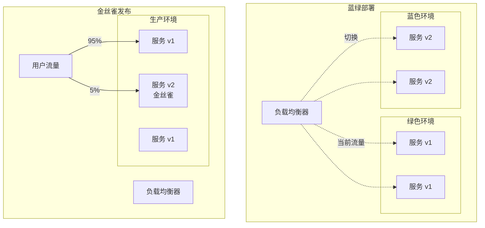

### 10.3 Kubernetes 部署配置

```yaml
# k8s/base/deployment.yaml - 滚动更新
apiVersion: apps/v1
kind: Deployment
metadata:
  name: user-service
  labels:
    app: user-service
spec:
  replicas: 3
  strategy:
    type: RollingUpdate
    rollingUpdate:
      maxSurge: 1          # 最多可多启动的Pod数
      maxUnavailable: 0    # 升级期间最少可用Pod数
  selector:
    matchLabels:
      app: user-service
  template:
    metadata:
      labels:
        app: user-service
        version: v1
    spec:
      containers:
        - name: user-service
          image: registry/user-service:v1.0.0
          ports:
            - containerPort: 3001
          resources:
            requests:
              memory: "256Mi"
              cpu: "250m"
            limits:
              memory: "512Mi"
              cpu: "500m"
          readinessProbe:    # 就绪探针
            httpGet:
              path: /health/ready
              port: 3001
            initialDelaySeconds: 5
            periodSeconds: 5
          livenessProbe:     # 存活探针
            httpGet:
              path: /health/live
              port: 3001
            initialDelaySeconds: 10
            periodSeconds: 10
          startupProbe:      # 启动探针
            httpGet:
              path: /health/ready
              port: 3001
            failureThreshold: 30
            periodSeconds: 10
```

```yaml
# k8s/base/service.yaml
apiVersion: v1
kind: Service
metadata:
  name: user-service
  labels:
    app: user-service
spec:
  type: ClusterIP
  selector:
    app: user-service
  ports:
    - port: 80
      targetPort: 3001
      protocol: TCP
      name: http
```

```yaml
# k8s/base/hpa.yaml - 自动扩缩容
apiVersion: autoscaling/v2
kind: HorizontalPodAutoscaler
metadata:
  name: user-service
spec:
  scaleTargetRef:
    apiVersion: apps/v1
    kind: Deployment
    name: user-service
  minReplicas: 3
  maxReplicas: 10
  metrics:
    - type: Resource
      resource:
        name: cpu
        target:
          type: Utilization
          averageUtilization: 70
    - type: Resource
      resource:
        name: memory
        target:
          type: Utilization
          averageUtilization: 80
  behavior:
    scaleUp:
      stabilizationWindowSeconds: 60
      policies:
        - type: Percent
          value: 100
          periodSeconds: 15
    scaleDown:
      stabilizationWindowSeconds: 300
      policies:
        - type: Percent
          value: 10
          periodSeconds: 60
```

### 10.4 蓝绿部署实现

```yaml
# k8s/overlays/blue-green/service-blue.yaml
apiVersion: v1
kind: Service
metadata:
  name: user-service
  labels:
    app: user-service
    color: blue
spec:
  selector:
    app: user-service
    color: blue
  ports:
    - port: 80
      targetPort: 3001

---
# k8s/overlays/blue-green/deployment-blue.yaml
apiVersion: apps/v1
kind: Deployment
metadata:
  name: user-service-blue
spec:
  replicas: 3
  selector:
    matchLabels:
      app: user-service
      color: blue
  template:
    metadata:
      labels:
        app: user-service
        color: blue
        version: v2
    spec:
      containers:
        - name: user-service
          image: registry/user-service:v2.0.0
          ports:
            - containerPort: 3001
```

```typescript
// 蓝绿部署切换脚本
// scripts/blue-green-deploy.ts

import { KubeConfig, CoreV1Api, AppsV1Api } from '@kubernetes/client-node';

interface DeployOptions {
  serviceName: string;
  namespace: string;
  newVersion: string;
  image: string;
}

export class BlueGreenDeployer {
  private k8sApi: CoreV1Api;
  private appsApi: AppsV1Api;

  constructor() {
    const kc = new KubeConfig();
    kc.loadFromDefault();
    this.k8sApi = kc.makeApiClient(CoreV1Api);
    this.appsApi = kc.makeApiClient(AppsV1Api);
  }

  async deploy(options: DeployOptions): Promise<void> {
    const { serviceName, namespace, newVersion, image } = options;

    // 1. 获取当前活跃的颜色
    const activeColor = await this.getActiveColor(serviceName, namespace);
    const inactiveColor = activeColor === 'blue' ? 'green' : 'blue';

    console.log(`Current active color: ${activeColor}`);
    console.log(`Deploying to ${inactiveColor} environment...`);

    // 2. 部署新版本到非活跃环境
    await this.deployToColor(serviceName, namespace, inactiveColor, image, newVersion);

    // 3. 等待部署就绪
    await this.waitForReady(serviceName, namespace, inactiveColor);

    // 4. 健康检查
    const healthy = await this.healthCheck(serviceName, namespace, inactiveColor);
    if (!healthy) {
      throw new Error('Health check failed for new deployment');
    }

    // 5. 切换流量
    console.log('Switching traffic...');
    await this.switchTraffic(serviceName, namespace, inactiveColor);

    // 6. 保留旧版本一段时间（便于回滚）
    console.log(`Deployment complete. ${inactiveColor} is now active.`);
    console.log(`Previous ${activeColor} environment retained for rollback.`);
  }

  async rollback(serviceName: string, namespace: string): Promise<void> {
    const activeColor = await this.getActiveColor(serviceName, namespace);
    const previousColor = activeColor === 'blue' ? 'green' : 'blue';

    console.log(`Rolling back from ${activeColor} to ${previousColor}...`);
    await this.switchTraffic(serviceName, namespace, previousColor);
    console.log('Rollback complete.');
  }

  private async getActiveColor(serviceName: string, namespace: string): Promise<string> {
    const { body: service } = await this.k8sApi.readNamespacedService(serviceName, namespace);
    return service.metadata?.labels?.color || 'blue';
  }

  private async deployToColor(
    serviceName: string,
    namespace: string,
    color: string,
    image: string,
    version: string,
  ): Promise<void> {
    const deploymentName = `${serviceName}-${color}`;

    // 更新镜像
    await this.appsApi.patchNamespacedDeployment(
      deploymentName,
      namespace,
      {
        spec: {
          template: {
            spec: {
              containers: [
                {
                  name: serviceName,
                  image: `${image}:${version}`,
                },
              ],
            },
          },
        },
      },
      undefined,
      undefined,
      undefined,
      undefined,
      undefined,
      { headers: { 'Content-Type': 'application/strategic-merge-patch+json' } },
    );
  }

  private async waitForReady(
    serviceName: string,
    namespace: string,
    color: string,
  ): Promise<void> {
    const deploymentName = `${serviceName}-${color}`;

    for (let i = 0; i < 30; i++) {
      const { body: deployment } = await this.appsApi.readNamespacedDeployment(
        deploymentName,
        namespace,
      );

      const ready = deployment.status?.readyReplicas || 0;
      const desired = deployment.spec?.replicas || 0;

      if (ready >= desired) {
        console.log(`Deployment ${deploymentName} is ready.`);
        return;
      }

      console.log(`Waiting... ${ready}/${desired} ready`);
      await sleep(10000);
    }

    throw new Error('Deployment timeout');
  }

  private async healthCheck(
    serviceName: string,
    namespace: string,
    color: string,
  ): Promise<boolean> {
    // 通过Service内部端点检查健康
    try {
      const response = await fetch(
        `http://${serviceName}-${color}.${namespace}.svc.cluster.local/health`,
      );
      return response.ok;
    } catch (error) {
      return false;
    }
  }

  private async switchTraffic(
    serviceName: string,
    namespace: string,
    color: string,
  ): Promise<void> {
    await this.k8sApi.patchNamespacedService(
      serviceName,
      namespace,
      {
        metadata: {
          labels: {
            color,
          },
        },
        spec: {
          selector: {
            app: serviceName,
            color,
          },
        },
      },
      undefined,
      undefined,
      undefined,
      undefined,
      undefined,
      { headers: { 'Content-Type': 'application/strategic-merge-patch+json' } },
    );
  }
}
```

### 10.5 金丝雀发布实现

```yaml
# k8s/overlays/canary/virtual-service.yaml
apiVersion: networking.istio.io/v1beta1
kind: VirtualService
metadata:
  name: user-service
spec:
  hosts:
    - user-service
  http:
    - match:
        - headers:
            x-canary:
              exact: "true"      # 带特定Header的流量走金丝雀
      route:
        - destination:
            host: user-service
            subset: canary
          weight: 100
    - route:
        - destination:
            host: user-service
            subset: stable      # 稳定版本 95%
          weight: 95
        - destination:
            host: user-service
            subset: canary      # 金丝雀版本 5%
          weight: 5
```

```yaml
# k8s/overlays/canary/destination-rule.yaml
apiVersion: networking.istio.io/v1beta1
kind: DestinationRule
metadata:
  name: user-service
spec:
  host: user-service
  subsets:
    - name: stable
      labels:
        version: stable
    - name: canary
      labels:
        version: canary
  trafficPolicy:
    connectionPool:
      tcp:
        maxConnections: 100
      http:
        http1MaxPendingRequests: 50
        maxRequestsPerConnection: 10
    outlierDetection:
      consecutiveErrors: 5
      interval: 30s
      baseEjectionTime: 30s
```

```typescript
// 金丝雀发布自动化脚本
// scripts/canary-deploy.ts

import { KubeConfig, CustomObjectsApi } from '@kubernetes/client-node';

interface CanaryConfig {
  serviceName: string;
  namespace: string;
  image: string;
  version: string;
  steps: number[];      // 各阶段流量百分比: [5, 25, 50, 100]
  stepDuration: number; // 每阶段持续时间（分钟）
  errorThreshold: number; // 错误率阈值
  latencyThreshold: number; // 延迟阈值（ms）
}

export class CanaryDeployer {
  private customApi: CustomObjectsApi;

  constructor() {
    const kc = new KubeConfig();
    kc.loadFromDefault();
    this.customApi = kc.makeApiClient(CustomObjectsApi);
  }

  async deploy(config: CanaryConfig): Promise<void> {
    const { serviceName, namespace, image, version, steps, stepDuration } = config;

    // 1. 部署金丝雀版本
    console.log('Deploying canary version...');
    await this.deployCanary(serviceName, namespace, image, version);

    // 2. 逐步增加流量
    for (const weight of steps) {
      console.log(`\n=== Promoting canary to ${weight}% ===`);
      await this.setCanaryWeight(serviceName, namespace, weight);

      // 3. 等待并观察
      console.log(`Waiting ${stepDuration} minutes for observation...`);
      await sleep(stepDuration * 60 * 1000);

      // 4. 检查指标
      const metrics = await this.getCanaryMetrics(serviceName, namespace);
      console.log('Canary metrics:', metrics);

      if (this.shouldRollback(metrics, config)) {
        console.error('Metrics exceeded threshold, rolling back...');
        await this.rollback(serviceName, namespace);
        throw new Error('Canary deployment failed');
      }
    }

    // 5. 提升为稳定版本
    console.log('Promoting canary to stable...');
    await this.promoteToStable(serviceName, namespace);

    console.log('Canary deployment completed successfully!');
  }

  private async deployCanary(
    serviceName: string,
    namespace: string,
    image: string,
    version: string,
  ): Promise<void> {
    // 部署金丝雀Deployment
  }

  private async setCanaryWeight(
    serviceName: string,
    namespace: string,
    weight: number,
  ): Promise<void> {
    const virtualService = {
      apiVersion: 'networking.istio.io/v1beta1',
      kind: 'VirtualService',
      metadata: { name: serviceName, namespace },
      spec: {
        hosts: [serviceName],
        http: [{
          route: [
            { destination: { host: serviceName, subset: 'stable' }, weight: 100 - weight },
            { destination: { host: serviceName, subset: 'canary' }, weight },
          ],
        }],
      },
    };

    await this.customApi.patchNamespacedCustomObject(
      'networking.istio.io',
      'v1beta1',
      namespace,
      'virtualservices',
      serviceName,
      virtualService,
      undefined,
      undefined,
      undefined,
      { headers: { 'Content-Type': 'application/merge-patch+json' } },
    );
  }

  private async getCanaryMetrics(serviceName: string, namespace: string): Promise<any> {
    // 查询Prometheus获取金丝雀版本的错误率和延迟
    const prometheusUrl = process.env.PROMETHEUS_URL;

    const errorRateQuery = `
      sum(rate(http_requests_total{service="${serviceName}",version="canary",status=~"5.."}[5m]))
      /
      sum(rate(http_requests_total{service="${serviceName}",version="canary"}[5m]))
    `;

    const latencyQuery = `
      histogram_quantile(0.95,
        sum(rate(http_request_duration_seconds_bucket{service="${serviceName}",version="canary"}[5m])) by (le)
      ) * 1000
    `;

    // 执行查询
    return {
      errorRate: await this.queryPrometheus(errorRateQuery),
      p95Latency: await this.queryPrometheus(latencyQuery),
    };
  }

  private shouldRollback(metrics: any, config: CanaryConfig): boolean {
    return (
      metrics.errorRate > config.errorThreshold ||
      metrics.p95Latency > config.latencyThreshold
    );
  }

  private async rollback(serviceName: string, namespace: string): Promise<void> {
    // 将所有流量切回稳定版本
    await this.setCanaryWeight(serviceName, namespace, 0);
    // 删除金丝雀Deployment
    await this.deleteCanary(serviceName, namespace);
  }

  private async promoteToStable(serviceName: string, namespace: string): Promise<void> {
    // 将金丝雀版本更新为稳定版本
    // 删除旧的稳定版本
    // 重置VirtualService
  }

  private async queryPrometheus(query: string): Promise<number> {
    // 执行Prometheus查询
    return 0;
  }
}

function sleep(ms: number): Promise<void> {
  return new Promise(resolve => setTimeout(resolve, ms));
}
```

### 10.6 CI/CD Pipeline

```yaml
# .github/workflows/deploy.yml
name: Microservices CI/CD

on:
  push:
    branches: [main]
    tags: ['v*']

env:
  REGISTRY: ghcr.io
  HELM_VERSION: '3.12.0'

jobs:
  # 1. 代码质量检查
  lint-and-test:
    runs-on: ubuntu-latest
    steps:
      - uses: actions/checkout@v4

      - name: Setup Node.js
        uses: actions/setup-node@v4
        with:
          node-version: '20'
          cache: 'npm'

      - name: Install dependencies
        run: npm ci

      - name: Lint
        run: npm run lint

      - name: Unit Tests
        run: npm run test

      - name: Integration Tests
        run: npm run test:e2e

      - name: Security Audit
        run: npm audit --audit-level=high

  # 2. 构建和推送镜像
  build:
    needs: lint-and-test
    runs-on: ubuntu-latest
    strategy:
      matrix:
        service: [user-service, order-service, payment-service, gateway]
    steps:
      - uses: actions/checkout@v4

      - name: Set up Docker Buildx
        uses: docker/setup-buildx-action@v3

      - name: Login to Registry
        uses: docker/login-action@v3
        with:
          registry: ${{ env.REGISTRY }}
          username: ${{ github.actor }}
          password: ${{ secrets.GITHUB_TOKEN }}

      - name: Extract metadata
        id: meta
        uses: docker/metadata-action@v5
        with:
          images: ${{ env.REGISTRY }}/${{ github.repository }}/${{ matrix.service }}
          tags: |
            type=ref,event=branch
            type=semver,pattern={{version}}
            type=sha,prefix=,suffix=,format=short

      - name: Build and push
        uses: docker/build-push-action@v5
        with:
          context: .
          file: ./apps/${{ matrix.service }}/Dockerfile
          push: true
          tags: ${{ steps.meta.outputs.tags }}
          labels: ${{ steps.meta.outputs.labels }}
          cache-from: type=gha
          cache-to: type=gha,mode=max

  # 3. 部署到开发环境
  deploy-dev:
    needs: build
    runs-on: ubuntu-latest
    environment: development
    steps:
      - uses: actions/checkout@v4

      - name: Setup kubectl
        uses: azure/setup-kubectl@v3

      - name: Setup Helm
        uses: azure/setup-helm@v3
        with:
          version: ${{ env.HELM_VERSION }}

      - name: Configure kubectl
        run: |
          echo "${{ secrets.KUBE_CONFIG_DEV }}" | base64 -d > ~/.kube/config

      - name: Deploy with Helm
        run: |
          helm upgrade --install microservices ./helm/microservices \
            --namespace dev \
            --set global.image.tag=${{ github.sha }} \
            --wait --timeout 10m

  # 4. 部署到生产环境（金丝雀发布）
  deploy-prod:
    needs: deploy-dev
    runs-on: ubuntu-latest
    environment: production
    steps:
      - uses: actions/checkout@v4

      - name: Setup kubectl
        uses: azure/setup-kubectl@v3

      - name: Deploy Canary
        run: |
          echo "${{ secrets.KUBE_CONFIG_PROD }}" | base64 -d > ~/.kube/config

          # 部署金丝雀版本
          kubectl apply -f k8s/overlays/canary/canary-deployment.yaml

          # 等待观察期
          sleep 300

          # 检查金丝雀指标
          CANARY_ERRORS=$(curl -s "${{ secrets.PROMETHEUS_URL }}/api/v1/query?query=...")

          # 根据指标决定是提升还是回滚
          if [ "$CANARY_ERRORS" -lt "5" ]; then
            echo "Canary looks good, promoting..."
            ./scripts/promote-canary.sh
          else
            echo "Canary failed, rolling back..."
            ./scripts/rollback-canary.sh
            exit 1
          fi
```

### 10.7 功能开关 (Feature Flags)

```typescript
// libs/shared/src/feature-flags/feature-flag.service.ts

import { Injectable } from '@nestjs/common';
import { LaunchDarklyService } from './launchdarkly.service';
import { UnleashService } from './unleash.service';

export interface FeatureFlagContext {
  userId?: string;
  email?: string;
  region?: string;
  environment?: string;
}

@Injectable()
export class FeatureFlagService {
  constructor(
    private readonly launchDarkly: LaunchDarklyService,
    private readonly unleash: UnleashService,
  ) {}

  async isEnabled(flagKey: string, context: FeatureFlagContext = {}): Promise<boolean> {
    // 优先从环境变量检查（本地开发）
    const envValue = process.env[`FF_${flagKey.toUpperCase()}`];
    if (envValue !== undefined) {
      return envValue === 'true';
    }

    // 从配置中心获取
    return this.launchDarkly.isEnabled(flagKey, {
      key: context.userId,
      email: context.email,
      custom: {
        region: context.region,
        environment: context.environment,
      },
    });
  }

  async getVariation<T>(flagKey: string, context: FeatureFlagContext, defaultValue: T): Promise<T> {
    return this.launchDarkly.getVariation(flagKey, {
      key: context.userId,
      custom: context,
    }, defaultValue);
  }
}
```

```typescript
// 功能开关使用示例
// apps/order-service/src/order.service.ts

@Injectable()
export class OrderService {
  constructor(
    private readonly featureFlags: FeatureFlagService,
    private readonly legacyPaymentService: LegacyPaymentService,
    private readonly newPaymentService: NewPaymentService,
  ) {}

  async processOrder(orderData: CreateOrderDto, user: User): Promise<Order> {
    // 使用功能开关控制新支付流程的发布
    const useNewPayment = await this.featureFlags.isEnabled('new-payment-flow', {
      userId: user.id,
      email: user.email,
      region: user.region,
    });

    if (useNewPayment) {
      return this.newPaymentService.process(orderData);
    } else {
      return this.legacyPaymentService.process(orderData);
    }
  }
}
```

### 10.8 工具推荐

| 类别 | 工具 | 用途 |
|------|------|------|
| 容器 | Docker | 应用容器化 |
| 编排 | Kubernetes | 容器编排 |
| GitOps | ArgoCD | 声明式持续交付 |
| GitOps | Flux | GitOps工具 |
| Helm | Helm | K8s包管理 |
| Service Mesh | Istio | 流量管理，金丝雀发布 |
| Service Mesh | Linkerd | 轻量级Service Mesh |
| CI/CD | GitHub Actions | CI/CD流水线 |
| CI/CD | GitLab CI | CI/CD流水线 |
| CI/CD | Jenkins | 传统CI/CD |
| 功能开关 | LaunchDarkly | 企业级功能开关 |
| 功能开关 | Unleash | 开源功能开关 |
| 功能开关 | Flagsmith | 开源功能开关 |

---

## 总结

本文档全面覆盖了微服务架构的核心主题：

1. **基础理论** - 理解微服务的核心概念和优缺点
2. **服务拆分** - 使用DDD进行合理的服务边界划分
3. **服务通信** - 同步(REST/gRPC)与异步(消息队列)的选择和实现
4. **服务发现** - Consul/etcd/K8s DNS的服务注册与发现
5. **API网关** - 统一入口、路由、认证、限流的实现
6. **容错机制** - 熔断、限流、降级的综合保护
7. **分布式事务** - Saga、TCC等最终一致性方案
8. **可观测性** - 日志、指标、追踪的完整方案
9. **数据一致性** - 事件溯源、CQRS、CDC等模式
10. **部署策略** - 蓝绿部署、金丝雀发布、功能开关

建议按实际需求渐进式采用这些方案，避免过度设计。从核心服务开始，逐步扩展到整个系统。

---

*文档版本: 1.0*
*最后更新: 2026-04-08*
*适用技术栈: TypeScript, NestJS, Express, Kubernetes*