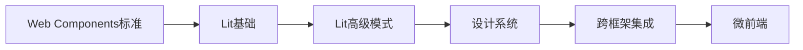
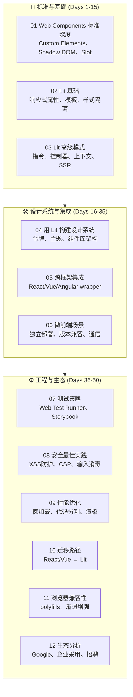

# Lit Web Components —— 跨框架复用设计系统

:::tip 专题定位
本专题是项目首次对 **Lit / Web Components** 进行系统性工程化覆盖，目标是为前端架构师提供构建**跨框架设计系统**的完整指南。

> **核心主张**：Lit 不是又一个前端框架，而是**浏览器原生标准的工程化封装**。基于 Lit 构建的组件是 W3C 标准的 Custom Elements，天然可在 React、Vue、Angular、Svelte 乃至纯 HTML 中复用。这是构建长期维护、框架无关的设计系统的最佳路径。
:::

---

## 全景概览

---

## 50天学习路径

| 阶段 | 天数 | 章节 | 目标 | 预计耗时 |
|------|------|------|------|----------|
| **标准基础期** | Day 1-5 | [01 Web Components 标准深度](./01-web-components-standards.md) | 深入理解 Custom Elements 生命周期、Shadow DOM 封装、Slot 分发、CSS Custom Properties | 8h |
| | Day 6-10 | [02 Lit 基础](./02-lit-fundamentals.md) | 掌握 `@property`、`@state`、`render()`、事件系统、样式隔离 | 8h |
| | Day 11-15 | [03 Lit 高级模式](./03-lit-advanced-patterns.md) | 掌握自定义指令、反应式控制器、`@consume/@provide` 上下文、SSR/Hydration | 8h |
| **设计系统期** | Day 16-22 | [04 用 Lit 构建设计系统](./04-design-system-with-lit.md) | 掌握 Design Tokens、主题系统、组件库架构、文档化（Storybook） | 10h |
| | Day 23-29 | [05 跨框架集成](./05-cross-framework-integration.md) | 掌握 React wrapper、Vue wrapper、Angular wrapper、事件映射、属性同步 | 10h |
| | Day 30-35 | [06 微前端场景](./06-micro-frontends-with-lit.md) | 掌握独立部署、版本兼容策略、跨组件通信、Module Federation 替代方案 | 8h |
| **工程生态期** | Day 36-39 | [07 测试策略](./07-testing-strategies.md) | 掌握 Web Test Runner、Playwright、视觉回归、组件测试 | 6h |
| | Day 40-42 | [08 安全最佳实践](./08-security-best-practices.md) | XSS 防护、CSP 配置、`unsafeHTML` 安全使用、Shadow DOM 事件边界 | 4h |
| | Day 43-45 | [09 性能优化](./09-performance-optimization.md) | 懒加载、代码分割、渲染优化、首次绘制优化 | 4h |
| | Day 46-47 | [10 迁移路径](./10-migration-paths.md) | 从 React/Vue 组件迁移到 Lit 的策略和工具 | 4h |
| | Day 48-49 | [11 浏览器兼容性](./11-browser-compatibility.md) | Polyfills、渐进增强、企业级浏览器支持策略 | 3h |
| | Day 50 | [12 生态分析](./12-ecosystem-analysis.md) | Google 内部使用、企业采用率、招聘趋势、长期维护确定性 | 3h |

---

## 权威资源索引

| 资源 | 链接 | 说明 | 本专题衔接 |
|------|------|------|-----------|
| **Lit 官方文档** | [lit.dev/docs](https://lit.dev/docs/) | Lit 权威参考 | [02 Lit 基础](./02-lit-fundamentals.md) |
| **Lit Playground** | [lit.dev/playground](https://lit.dev/playground/) | 在线体验 | 全专题 |
| **MDN Web Components** | [MDN](https://developer.mozilla.org/en-US/docs/Web/Web_Components) | 标准参考 | [01 Web Components 标准](./01-web-components-standards.md) |
| **WebComponents.org** | [webcomponents.org](https://www.webcomponents.org/) | 组件生态 | [04 设计系统](./04-design-system-with-lit.md) |

---

## 前置知识

本专题假设你已掌握：

- ES6+（Class、Template Literal、Destructuring）
- CSS（Flexbox、Grid、Custom Properties）
- 现代前端开发基础（npm、构建工具概念）

**不需要掌握任何前端框架**（React/Vue/Angular），这正是 Web Components 的核心优势。

---

## 与现有模块的关联

| 本专题章节 | 关联的现有模块 | 关联方式 |
|-----------|--------------|---------|
| 01 Web Components | `website/categories/frontend-frameworks.md`（6.4节） | 从章节介绍扩展到独立专题 |
| 01 标准深度 | `website/framework-models/01-component-model-theory.md` | 形式化理论 → 工程实践 |
| 06 微前端 | `website/categories/micro-frontends.md` | 补充 Lit 作为微前端方案 |

## 相关专题

| 专题 | 关联点 |
|------|--------|
| [React + Next.js App Router](../react-nextjs-app-router/) | 跨框架集成：React 中使用 Lit 组件 |
| [服务器优先前端](../server-first-frontend/) | HTMX + Web Components 协同模式 |
| [AI-Native Development](../ai-native-development/) | AI 组件化：可复用的 LLM 交互组件 |
| [移动端跨平台](../mobile-cross-platform/) | Web Components 跨平台复用：React Native / Capacitor 集成 |
