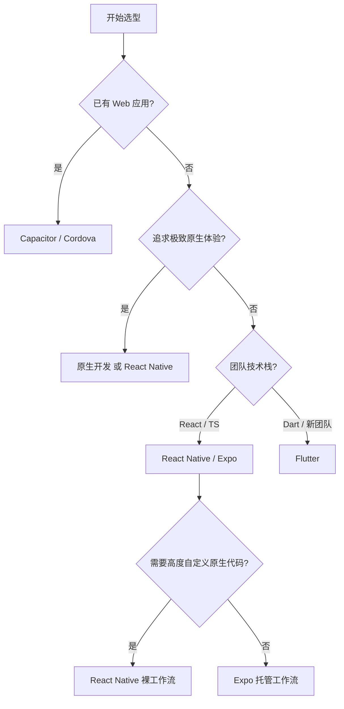

# 01. 跨平台技术全景

> 决策框架：React Native、Expo、Capacitor、Flutter 与原生开发的对比与选型。

---

## 技术矩阵

| 维度 | React Native | Expo | Capacitor | Flutter | 原生 (Swift/Kotlin) |
|------|-------------|------|-----------|---------|---------------------|
| **渲染方式** | 原生组件桥接 | 原生组件桥接 | WebView | Skia 自绘 | 平台原生 |
| **语言** | JavaScript / TypeScript | JavaScript / TypeScript | JavaScript / TypeScript | Dart | Swift / Kotlin |
| **UI 一致性** | 接近原生 | 接近原生 | 依赖 Web UI | 高度一致 | 完全原生 |
| **原生能力** | 中等 | 高 (Expo SDK) | 高 (Plugin 生态) | 高 | 最高 |
| **包体积** | 中等 (~15MB) | 中等 (~20MB) | 较小 (~5MB 基础) | 较大 (~50MB) | 最小 |
| **启动速度** | 中等 | 中等 | 较快 | 快 | 最快 |
| **热更新** | 支持 (OTA) | 支持 (EAS Update) | 支持 (Live Update) | 有限 | 不支持 |
| **团队门槛** | React 经验 | React 经验 | Web 开发经验 | 需学 Dart | 平台专项 |

---

## 决策树

---

## React Native 生态位

Facebook (Meta) 推出的跨平台框架，核心思想：**Learn once, write anywhere**。

- **优势**：庞大的 npm 生态、React 开发者无缝迁移、接近原生的性能
- **劣势**：版本碎片化、原生模块依赖复杂、Android/iOS 差异处理

### 工作流选择

| 工作流 | 适用场景 |
|--------|----------|
| 裸工作流 (Bare) | 需要自定义原生代码、深度集成第三方 SDK |
| Expo 托管 (Managed) | 快速原型、标准应用、无需原生代码 |

---

## Expo 的定位

Expo 是 React Native 的上层抽象与工具链：

- **Expo SDK**：封装常见原生能力（相机、定位、推送、生物识别）
- **Expo Router**：基于文件系统的导航，类似 Next.js App Router
- **EAS (Expo Application Services)**：云端构建、签名、提交、OTA 更新

> 💡 2024 年后，Expo 已成为 React Native 官方推荐的入门路径。

---

## Capacitor 的定位

Ionic 团队推出的现代混合方案：

- 将 Web 应用嵌入原生 WebView
- 通过 Capacitor Plugins 调用原生能力
- **渐进式迁移**：先有 PWA，再包装为 App

适用场景：

- 已有成熟的 Web 应用需要快速上线移动端
- 对包体积和启动速度敏感
- 不需要大量自定义原生 UI

---

## Flutter 的对比

Google 的跨平台框架，使用 Dart 语言和 Skia 自绘引擎：

- **优点**：UI 高度一致、性能优异、Hot Reload 体验好
- **缺点**：包体积大、生态与前端不互通、需学习 Dart

选型建议：当 UI 一致性优先级高于包体积，且团队愿意接受 Dart 时选择 Flutter。

---

## 2026 趋势前瞻

| 趋势 | 影响 |
|------|------|
| React Native 新架构全面默认 | Fabric + TurboModules 降低桥接开销 |
| Expo 成为事实标准 | 新 RN 项目几乎默认使用 Expo |
| WebAssembly 渗透移动端 | 跨语言高性能模块（图像处理、加密） |
| AI 推理本地化 | Core ML / TensorFlow Lite 集成需求增长 |
