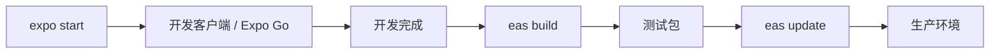

# 03. Expo 生态与 EAS

> 从 Expo SDK 到 Expo Router，再到 EAS 云服务——Expo 已成为 React Native 的全栈解决方案。

---

## Expo SDK 核心模块

无需 `react-native link`，开箱即用的原生能力：

```typescript
import * as Camera from 'expo-camera';
import * as Location from 'expo-location';
import * as Notifications from 'expo-notifications';

// 相机权限 + 扫码
const { status } = await Camera.requestCameraPermissionsAsync();

// 定位
const location = await Location.getCurrentPositionAsync({ accuracy: Location.Accuracy.High });

// 本地推送
await Notifications.scheduleNotificationAsync({
  content: { title: '提醒', body: '该喝水了' },
  trigger: { seconds: 3600 },
});
```

### 常用 SDK 模块速查

| 模块 | 功能 |
|------|------|
| `expo-camera` | 相机、扫码、录像 |
| `expo-location` | GPS、地理编码、反向编码 |
| `expo-notifications` | 本地/远程推送通知 |
| `expo-secure-store` | Keychain/Keystore 加密存储 |
| `expo-file-system` | 文件读写、缓存管理 |
| `expo-updates` | OTA 热更新 |
| `expo-router` | 文件系统路由 |

---

## Expo Router

基于文件系统的导航，心智模型与 Next.js App Router 一致：

```
app/
├── _layout.tsx          # 根布局
├── index.tsx            # /
├── (tabs)/
│   ├── _layout.tsx      # 底部 Tab 配置
│   ├── home.tsx         # /home
│   └── settings.tsx     # /settings
└── [id].tsx             # 动态路由 /:id
```

路由定义即组件：

```tsx
// app/(tabs)/home.tsx
import { View, Text } from 'react-native';

export default function HomeScreen() {
  return (
    <View>
      <Text>首页</Text>
    </View>
  );
}
```

导航 API：

```tsx
import { useRouter } from 'expo-router';

const router = useRouter();
router.push('/settings');           // 跳转
router.replace('/home');            // 替换
router.back();                      // 返回
```

---

## EAS (Expo Application Services)

云端构建与发布平台：

### EAS Build

```bash
# 安装 CLI
npm install -g eas-cli

# 登录
eas login

# 配置项目
eas build:configure

# 构建 iOS / Android
eas build --platform ios
neas build --platform android
```

### EAS Update (OTA)

无需重新提交商店的增量更新：

```bash
# 发布更新
eas update --branch production --message "修复登录 bug"
```

客户端自动检测更新：

```tsx
import * as Updates from 'expo-updates';

async function checkForUpdate() {
  const update = await Updates.checkForUpdateAsync();
  if (update.isAvailable) {
    await Updates.fetchUpdateAsync();
    await Updates.reloadAsync(); // 重启应用
  }
}
```

---

## 开发工作流



---

## 自定义原生代码 (Config Plugins)

即使使用托管工作流，也可通过 `app.json` + Config Plugin 修改原生项目：

```json
{
  "expo": {
    "plugins": [
      [
        "expo-camera",
        {
          "cameraPermission": "允许 $(PRODUCT_NAME) 访问相机以扫描二维码"
        }
      ]
    ]
  }
}
```

对于更复杂的原生修改，可创建自定义 Config Plugin：

```typescript
// plugins/withMyPlugin.ts
import { ConfigPlugin, withInfoPlist } from 'expo/config-plugins';

const withMyPlugin: ConfigPlugin = (config) => {
  return withInfoPlist(config, (config) => {
    config.modResults['NSFaceIDUsageDescription'] = '用于安全登录';
    return config;
  });
};

export default withMyPlugin;
```
