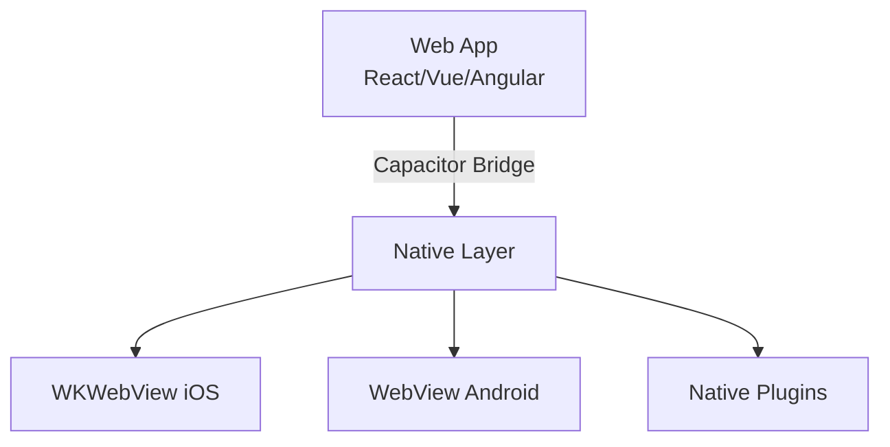

# 04. Capacitor 混合应用

> 将现有 Web 应用包装为原生 App，渐进式解锁原生能力。

---

## Capacitor 架构



核心特点：

- **Native WebView**：iOS 用 `WKWebView`，Android 用 `WebView`
- **JS Bridge**：`Capacitor` 全局对象暴露原生 API
- **零框架依赖**：不绑定任何前端框架

---

## 快速开始

将已有 Web 项目转换为 Capacitor 应用：

```bash
# 1. 安装 Capacitor
npm install @capacitor/core @capacitor/cli

# 2. 初始化
npx cap init MyApp com.example.myapp --web-dir dist

# 3. 添加平台
npx cap add ios
npx cap add android

# 4. 构建 Web 并同步
npm run build
npx cap sync

# 5. 打开原生 IDE
npx cap open ios
npx cap open android
```

---

## 调用原生能力

TypeScript 类型安全的 API：

```typescript
import { Camera, CameraResultType } from '@capacitor/camera';
import { Geolocation } from '@capacitor/geolocation';
import { Share } from '@capacitor/share';

// 拍照
const photo = await Camera.getPhoto({
  resultType: CameraResultType.Uri,
  quality: 90,
});

// 定位
const coords = await Geolocation.getCurrentPosition();

// 系统分享
await Share.share({
  title: '分享标题',
  text: '分享内容',
  url: 'https://example.com',
});
```

---

## Plugin 开发

当官方插件不满足需求时，自定义原生插件：

### iOS Plugin (Swift)

```swift
import Capacitor

@objc(EchoPlugin)
public class EchoPlugin: CAPPlugin {
  @objc func echo(_ call: CAPPluginCall) {
    let value = call.getString("value") ?? ""
    call.resolve(["value": value])
  }
}
```

### Android Plugin (Kotlin)

```kotlin
package com.example.myapp

import com.getcapacitor.Plugin
import com.getcapacitor.PluginCall
import com.getcapacitor.PluginMethod
import com.getcapacitor.annotation.CapacitorPlugin

@CapacitorPlugin(name = "Echo")
class EchoPlugin : Plugin() {
  @PluginMethod
  fun echo(call: PluginCall) {
    val value = call.getString("value", "")
    call.resolve(jsobjectOf("value" to value))
  }
}
```

### TypeScript 声明

```typescript
import { registerPlugin } from '@capacitor/core';

interface EchoPlugin {
  echo(options: { value: string }): Promise<{ value: string }>;
}

const Echo = registerPlugin<EchoPlugin>('Echo');
export default Echo;
```

---

## 渐进式迁移策略

从 PWA 到原生 App 的演进路径：

1. **Phase 1**：完善 PWA（Service Worker、离线缓存、manifest）
2. **Phase 2**：加入 Capacitor，包装为 App，保留 Web 部署能力
3. **Phase 3**：逐步接入原生插件（推送、生物识别、蓝牙）
4. **Phase 4**：如有必要，关键页面替换为原生实现

---

## Capacitor vs Cordova

| 特性 | Cordova | Capacitor |
|------|---------|-----------|
| 维护状态 | 基本停滞 | 活跃开发 (Ionic 团队) |
| WebView | UIWebView / 旧 WebView | WKWebView / 现代 WebView |
| 原生项目 | 编译时生成 | 原生项目作为源码 artefact |
| 插件管理 | 集中式 npm | 原生依赖管理 (CocoaPods/Gradle) |
| 框架绑定 | 无 | 无 |
