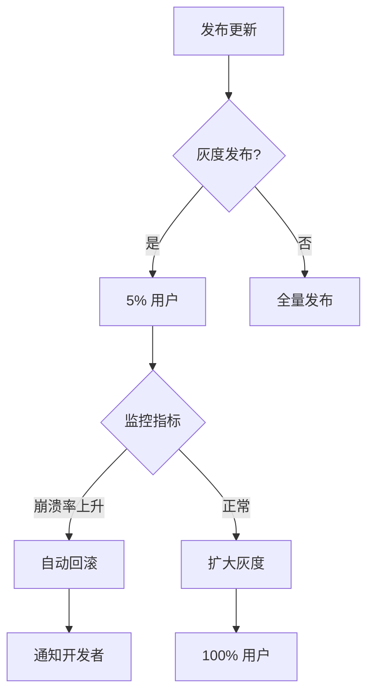

# 07. 热更新与 OTA

> 无需经过商店审核，即时推送修复与功能更新。

---

## 热更新方案对比

| 方案 | 平台 | 原生代码 | 适用范围 | 2026 状态 |
|------|------|----------|----------|-----------|
| **Microsoft CodePush** | RN | 不支持 | JS Bundle | ⚠️ 已停止维护 |
| **Expo Updates** | Expo | 不支持 | JS + Assets | ✅ 推荐 |
| **Capgo** | Capacitor | 不支持 | Web Bundle | ✅ 活跃 |
| **自托管更新** | 通用 | 需自建 | 完全可控 | ✅ 企业首选 |

---

## Expo Updates 实战

### 配置

```json
// app.json
{
  "expo": {
    "updates": {
      "url": "https://u.expo.dev/your-project-id",
      "checkAutomatically": "ON_LOAD"
    },
    "runtimeVersion": {
      "policy": "appVersion"
    }
  }
}
```

### 客户端集成

```tsx
import * as Updates from 'expo-updates';

export default function App() {
  useEffect(() => {
    async function checkUpdate() {
      try {
        const update = await Updates.checkForUpdateAsync();
        if (update.isAvailable) {
          await Updates.fetchUpdateAsync();
          // 可选：立即重启或下次启动生效
          await Updates.reloadAsync();
        }
      } catch (error) {
        console.error('更新检查失败', error);
      }
    }

    checkUpdate();
  }, []);

  return <MainApp />;
}
```

### 发布更新

```bash
# 发布到 production 分支
eas update --branch production --message "修复崩溃问题"

# 指定 runtime version
eas update --branch production --runtime-version "1.2.0"
```

---

## 自托管更新 (通用方案)

适用于裸 React Native 或需要完全控制的企业场景：

### 服务端接口

```typescript
// 更新检查 API
interface UpdateCheckResponse {
  updateAvailable: boolean;
  bundleUrl: string;      // 新 bundle 下载地址
  version: string;
  mandatory: boolean;     // 是否强制更新
  metadata: { changelog: string };
}

// 版本兼容性校验
function isCompatible(nativeVersion: string, bundleVersion: string): boolean {
  const [nMajor] = nativeVersion.split('.');
  const [bMajor] = bundleVersion.split('.');
  return nMajor === bMajor;  // 大版本必须一致
}
```

### 客户端下载与安装

```typescript
import { Platform } from 'react-native';
import RNFS from 'react-native-fs';

async function downloadAndInstallBundle(updateInfo: UpdateCheckResponse) {
  const bundlePath = `${RNFS.DocumentDirectoryPath}/main.jsbundle`;

  // 下载新 bundle
  const download = RNFS.downloadFile({
    fromUrl: updateInfo.bundleUrl,
    toFile: bundlePath,
  });

  await download.promise;

  // 持久化版本信息
  await AsyncStorage.setItem('pendingBundleVersion', updateInfo.version);

  // 重启生效（需要原生代码支持 bundle 路径替换）
  if (updateInfo.mandatory) {
    NativeModules.BundleLoader.reloadWithBundle(bundlePath);
  }
}
```

---

## 安全与回滚



### 回滚策略

```typescript
// 更新质量监控
interface UpdateMetrics {
  version: string;
  installCount: number;
  crashRate: number;      // 崩溃率
  loadTimeMs: number;     // 平均加载时间
}

function shouldRollback(metrics: UpdateMetrics): boolean {
  return metrics.crashRate > 0.05 || metrics.loadTimeMs > 5000;
}
```

---

## 合规性注意

- **iOS App Store**：热更新仅限 JS/脚本资源，不可修改原生二进制
- **Google Play**：允许热更新，但需符合欺骗政策（不得绕过审核）
- **中国监管**：部分行业要求所有更新经过审核，需提前确认合规要求
