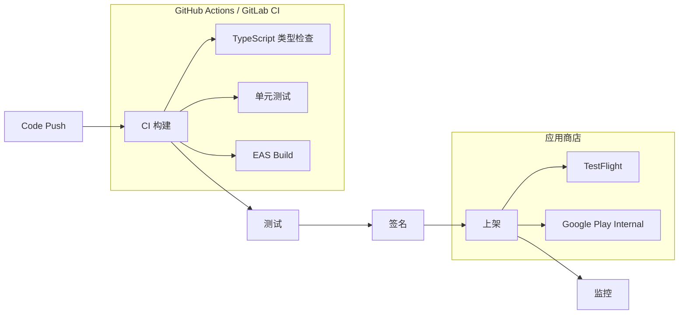

# 08. 发布与 CI/CD

> 从代码提交到应用商店上架的自动化流水线。

---

## 发布流程概览



---

## 签名配置

### iOS (Fastlane match)

```ruby
# fastlane/Matchfile
git_url("git@github.com:your-org/certificates.git")
storage_mode("git")
type("appstore") # 或 "development", "adhoc"

# Fastfile
lane :beta do
  match(type: "appstore")
  build_app(scheme: "MyApp")
  upload_to_testflight
end
```

### Android (Gradle 配置)

```groovy
// android/app/build.gradle
android {
  signingConfigs {
    release {
      storeFile file(MYAPP_UPLOAD_STORE_FILE)
      storePassword MYAPP_UPLOAD_STORE_PASSWORD
      keyAlias MYAPP_UPLOAD_KEY_ALIAS
      keyPassword MYAPP_UPLOAD_KEY_PASSWORD
    }
  }
  buildTypes {
    release {
      signingConfig signingConfigs.release
      minifyEnabled true
      proguardFiles getDefaultProguardFile('proguard-android.txt'), 'proguard-rules.pro'
    }
  }
}
```

---

## EAS 自动化发布

### GitHub Actions 集成

```yaml
# .github/workflows/eas-build.yml
name: EAS Build
on:
  push:
    branches: [main]

jobs:
  build:
    runs-on: ubuntu-latest
    steps:
      - uses: actions/checkout@v4
      - uses: expo/expo-github-action@v8
        with:
          eas-version: latest
          token: ${{ secrets.EXPO_TOKEN }}
      - run: npm ci
      - run: eas build --platform all --non-interactive
```

### 自动提交商店

```bash
# EAS Submit 自动上传
eas submit --platform ios   # 上传至 App Store Connect
eas submit --platform android  # 上传至 Google Play
```

---

## 版本管理策略

| 环境 | 版本格式 | 示例 |
|------|----------|------|
| 开发 | `major.minor.patch-dev+build` | `1.2.3-dev+45` |
| 测试 (TestFlight) | `major.minor.patch-beta+N` | `1.2.3-beta.2` |
| 生产 | `major.minor.patch` | `1.2.3` |

### 版本自动递增

```bash
# package.json script
{
  "scripts": {
    "version:bump": "npm version patch && eas build:version:sync"
  }
}
```

---

## 监控与崩溃报告

```typescript
// Sentry 集成
import * as Sentry from '@sentry/react-native';

Sentry.init({
  dsn: 'https://xxx@o0.ingest.sentry.io/0',
  environment: __DEV__ ? 'development' : 'production',
  beforeSend(event) {
    // 过滤敏感信息
    if (event.exception) {
      event.exception.values?.forEach(v => {
        if (v.stacktrace) {
          v.stacktrace.frames = v.stacktrace.frames.filter(
            f => !f.filename?.includes('password')
          );
        }
      });
    }
    return event;
  },
});
```

### 关键监控指标

| 指标 | 告警阈值 |
|------|----------|
| 崩溃率 | &gt; 1% |
| ANR (Android) | &gt; 0.5% |
| 启动时间 P95 | &gt; 3s |
| 更新成功率 | &lt; 95% |

---

## 回滚预案

```yaml
# .github/workflows/rollback.yml
name: Emergency Rollback
on:
  workflow_dispatch:
    inputs:
      version:
        description: '回滚目标版本'
        required: true

jobs:
  rollback:
    runs-on: ubuntu-latest
    steps:
      - uses: actions/checkout@v4
        with:
          ref: ${{ github.event.inputs.version }}
      - run: eas update --branch production --message "Rollback to ${{ github.event.inputs.version }}"
```
