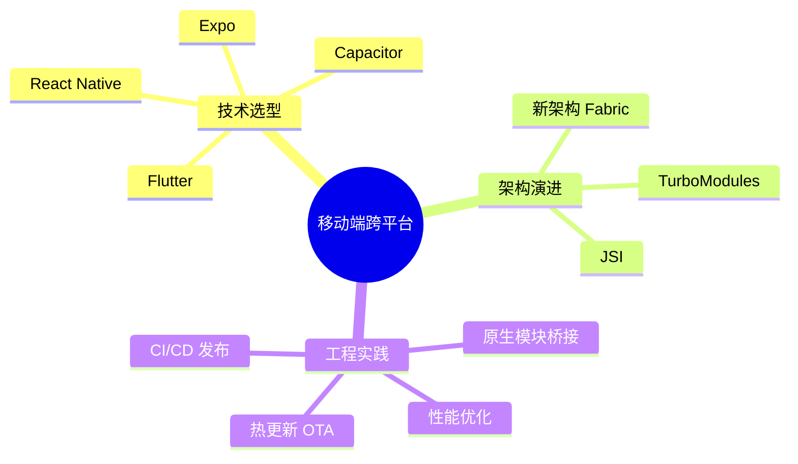

# 📱 移动端跨平台开发

深度专题：React Native、Expo、Capacitor 与原生模块桥接的工程实践。

---

## 专题地图

---

## 章节导航

| # | 章节 | 核心内容 |
|---|------|----------|
| 01 | [跨平台技术全景](./01-cross-platform-landscape) | React Native vs Expo vs Capacitor vs Flutter 对比决策树 |
| 02 | [React Native 新架构](./02-react-native-new-architecture) | Fabric、TurboModules、JSI 与 Hermes 引擎 |
| 03 | [Expo 生态与 EAS](./03-expo-ecosystem) | Expo SDK、Expo Router、EAS Build & Submit |
| 04 | [Capacitor 混合应用](./04-capacitor-hybrid) | Web 到原生的渐进式迁移，Plugin 开发 |
| 05 | [原生模块桥接](./05-native-modules-bridge) | TurboModule、NativeModule、Swift/Kotlin 桥接 |
| 06 | [性能优化与调试](./06-performance-debugging) | 启动时间、FPS、内存、Flipper、Repack |
| 07 | [热更新与 OTA](./07-ota-updates) | CodePush 替代方案、Expo Updates、自托管更新 |
| 08 | [发布与 CI/CD](./08-release-ci-cd) | 签名、App Store / Play Store、自动化流水线 |

---

## 学习目标

完成本专题后，你将能够：

- 根据团队规模与技术栈选择最合适的跨平台方案
- 理解 React Native 新架构的核心原理与迁移路径
- 使用 Expo 快速构建并发布生产级应用
- 开发自定义原生模块扩展应用能力
- 建立热更新与自动化发布的完整工作流

---

## 相关专题

| 专题 | 关联点 |
|------|--------|
| [TypeScript 类型精通](../typescript-type-mastery/) | 原生模块的类型声明与泛型组件设计 |
| [React / Next.js App Router](../react-nextjs-app-router/) | React 组件模型在移动端的延续与差异 |
| [Server-First 前端](../server-first-frontend/) | 跨平台应用中的 SSR / 数据获取模式 |
| [Edge Runtime](../edge-runtime/) | 移动端边缘计算与离线优先架构 |
| [WebAssembly](../webassembly/) | 移动端 WebView 中 Wasm 的集成与性能优化 |
| [测试工程](../testing-engineering/) | React Native / Expo 测试策略与 E2E 自动化 |
| [性能工程](../performance-engineering/) | 移动端启动时间、FPS、内存与包体积优化 |
| [状态管理](../state-management/) | React Native / Expo 中的全局状态方案选型 |
