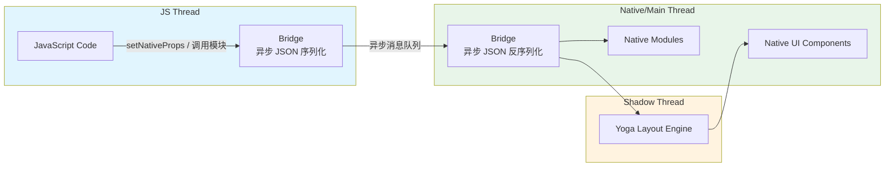
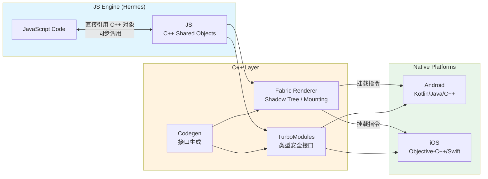
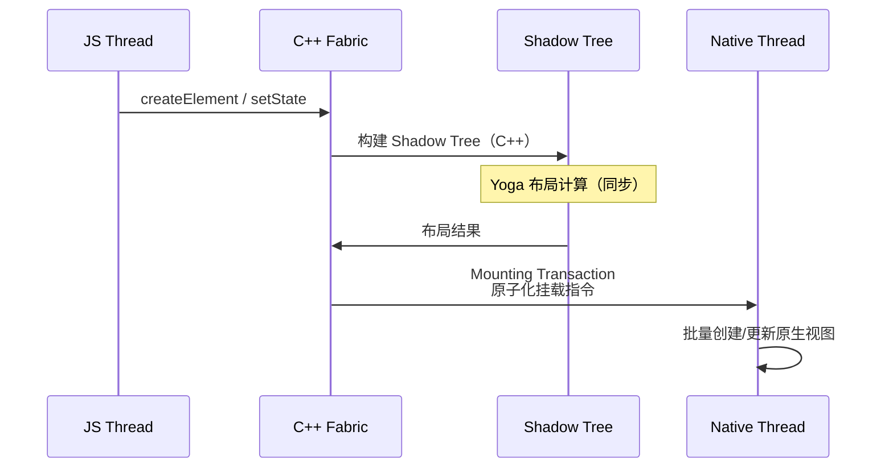
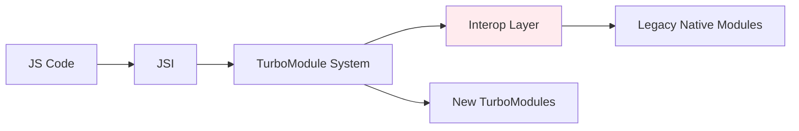

# React Native New Architecture

> React Native 0.68+ 引入的 New Architecture 是对原始桥接（Bridge）模型的根本性重构。它通过 **JSI（JavaScript Interface）** 实现同步直接调用，彻底改变了 JS 与原生层的通信范式。

## 架构演进：旧架构 vs New Architecture

### 旧架构（Legacy Architecture）



**旧架构的核心问题**：

- **异步通信**：所有 JS ↔ 原生调用均通过 Bridge 异步队列，无法同步读取原生状态
- **JSON 序列化开销**：数据需在两端反复序列化/反序列化
- **单线程瓶颈**：JS 计算密集任务会阻塞 UI 响应
- **布局抖动**：Yoga 布局计算在独立线程，存在同步延迟

### New Architecture 核心组件



## JSI（JavaScript Interface）

JSI 是 New Architecture 的基石。它取代了 Bridge，允许 JS 直接持有 C++ 对象的引用，实现同步调用。

### 核心特性

| 特性 | 旧 Bridge | JSI |
|------|----------|-----|
| 调用方式 | 异步消息队列 | 同步直接调用 |
| 数据传递 | JSON 序列化 | 共享内存 / C++ HostObject |
| 类型安全 | 无，运行时错误 | Codegen 编译期检查 |
| 线程模型 | JS 单线程 | 支持多线程共享对象 |
| 内存管理 | Bridge 托管 | C++ 引用计数 |

### JSI HostObject 示例

```cpp
// C++ 端：暴露给 JS 的同步对象
#include <jsi/jsi.h>
using namespace facebook::jsi;

class NativeCalculator : public HostObject {
  Value get(Runtime& rt, const PropNameID& name) override {
    auto prop = name.utf8(rt);
    if (prop == "addSync") {
      return Function::createFromHostFunction(
        rt, PropNameID::forAscii(rt, "addSync"), 2,
        [](Runtime& rt, const Value& thisVal, const Value* args, size_t count) -> Value {
          double a = args[0].asNumber();
          double b = args[1].asNumber();
          return Value(a + b);  // 同步返回结果
        }
      );
    }
    return Value::undefined();
  }
};
```

```typescript
// JS 端：直接同步调用
const calculator = global.__nativeCalculator as {
  addSync: (a: number, b: number) => number;
};

// ✅ 同步调用，无 async/await，无 Bridge 延迟
const result = calculator.addSync(40, 2); // 42
```

## Fabric Renderer

Fabric 是 New Architecture 的 UI 渲染层，替代了旧架构的异步 UI Manager。

### 渲染管线



**Fabric 的关键改进**：

1. **一致性布局**：Shadow Tree 在 C++ 层构建，避免跨线程布局抖动
2. **优先级渲染**：支持同步和异步渲染模式，交互响应可优先处理
3. **Surface 隔离**：多个 Root Surface 可独立渲染（如多窗口、浮层）

### Fabric 项目结构示例

```text
android/app/src/main/jni/
├── CMakeLists.txt
├── OnLoad.cpp                        # JSI 注册入口
├── NativeCalculator.cpp              # C++ TurboModule 实现
├── NativeCalculator.h
└── react-native-auto-linked/         # Codegen 生成代码
    ├── RTNCalculatorSpec.h
    └── RTNCalculatorSpec.cpp
```

## TurboModules

TurboModules 是 New Architecture 的原生模块系统，通过 Codegen 实现类型安全的 JS ↔ 原生绑定。

### 接口规范（Spec）定义

```typescript
// specs/NativeCalculator.ts
import type { TurboModule } from 'react-native/Libraries/TurboModule/RCTExport';
import { TurboModuleRegistry } from 'react-native';

export interface Spec extends TurboModule {
  // 同步方法
  addSync(a: number, b: number): number;

  // 异步 Promise 方法
  multiplyAsync(a: number, b: number): Promise<number>;

  // 事件发射器
  readonly getConstants: () => { PI: number };
}

export default TurboModuleRegistry.get<Spec>('RTNCalculator') as Spec | null;
```

### Codegen 自动生成绑定代码

Codegen 根据 `.spec.js` 文件在编译期生成 C++/Java/Objective-C++ 的绑定代码：

```bash
# 自动生成路径（iOS）
ios/build/generated/ios/
├── RTNCalculatorSpec.h               # C++ 纯虚接口
├── RTNCalculatorSpec-generated.mm    # Objective-C++ 桥接
└── RCTModulesConformingToProtocols.h

# 自动生成路径（Android）
android/build/generated/source/codegen/
├── java/com/rtncalculator/
│   └── NativeCalculatorSpec.java     # Java 抽象类
└── jni/
    ├── RTNCalculatorSpec.h           # C++ 接口
    └── RTNCalculatorSpec.cpp
```

### Android Kotlin 实现示例

```kotlin
// android/app/src/main/java/com/rtncalculator/CalculatorModule.kt
package com.rtncalculator

import com.facebook.react.bridge.ReactApplicationContext
import com.facebook.react.module.annotations.ReactModule

@ReactModule(name = NativeCalculatorModule.NAME)
class NativeCalculatorModule(reactContext: ReactApplicationContext) :
  NativeCalculatorSpec(reactContext) {

  override fun getName() = NAME

  override fun addSync(a: Double, b: Double): Double = a + b

  override fun multiplyAsync(a: Double, b: Double, promise: Promise) {
    promise.resolve(a * b)
  }

  override fun getConstants(): MutableMap<String, Any> =
    mutableMapOf("PI" to Math.PI)

  companion object {
    const val NAME = "RTNCalculator"
  }
}
```

## 迁移路径与兼容性

### 启用 New Architecture

```json
// react-native.config.js
module.exports = {
  project: {
    android: {
      unstable_reactLegacyComponentNames: ['SomeLegacyComponent'],
    },
    ios: {},
  },
};
```

```bash
# Android
export NEW_ARCH_ENABLED=1
cd android && ./gradlew assembleDebug

# iOS
export RCT_NEW_ARCH_ENABLED=1
cd ios && bundle exec pod install
```

### 互操作层（Interop Layer）

React Native 0.72+ 提供互操作层，允许 New Architecture 项目继续使用旧架构模块：



### 迁移检查清单

- [ ] 确认所有第三方库支持 New Architecture（查阅 [react-native-directory](https://reactnative.directory/)）
- [ ] 将自定义 Native Modules 迁移为 TurboModules（编写 `.spec.js`）
- [ ] 检查 Fabric 兼容的自定义 View（需实现 `ViewManager` 新接口）
- [ ] 验证 Hermes 引擎启用（New Architecture 强依赖）
- [ ] 在 CI 中同时测试旧/新架构（过渡期内）

## 性能对比数据

| 指标 | 旧架构 | New Architecture | 提升 |
|------|--------|-----------------|------|
| 原生模块调用延迟 | ~3-5 ms | ~0.1-0.3 ms | **10-50x** |
| 大型列表渲染帧率 | 30-45 fps | 55-60 fps | **~30%** |
| 启动时间（TTR） | 基准 | -15~25% | 显著改善 |
| 内存占用 | 基准 | +5~10% | 略增（C++ 层开销） |

## 实战建议

1. **新项目**：直接使用 0.73+ 版本，默认启用 New Architecture，无需兼容旧模式。
2. **现有项目**：优先迁移自定义 Native Modules（影响面可控），第三方库依赖 [社区迁移进度](https://github.com/reactwg/react-native-new-architecture/discussions)。
3. **同步调用慎用**：JSI 支持同步调用，但阻塞 JS 线程超过 16ms 会导致掉帧，I/O 操作仍应保持异步。
4. **Codegen 故障排查**：若遇到 `Spec` 未找到，检查 `react-native.config.js` 中的 `dependency.platforms.ios.project` 配置及 Podfile 中的 `use_react_native!` 参数。

---

> 🔗 **相关阅读**：
>
> - [Expo 生态系统](./02-expo-ecosystem.md) — Expo 如何简化 New Architecture 配置
> - 性能优化 — New Architecture 下的启动优化策略
