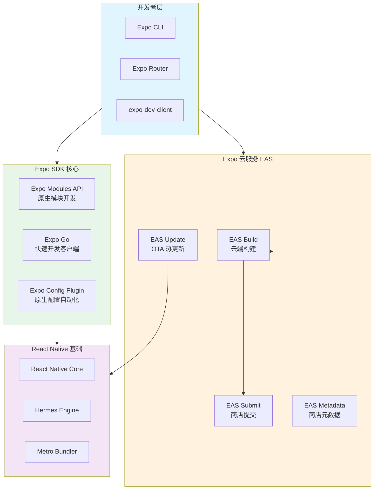
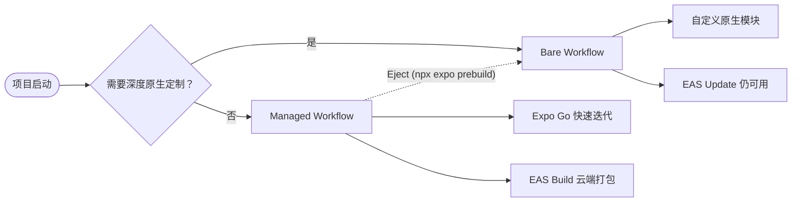
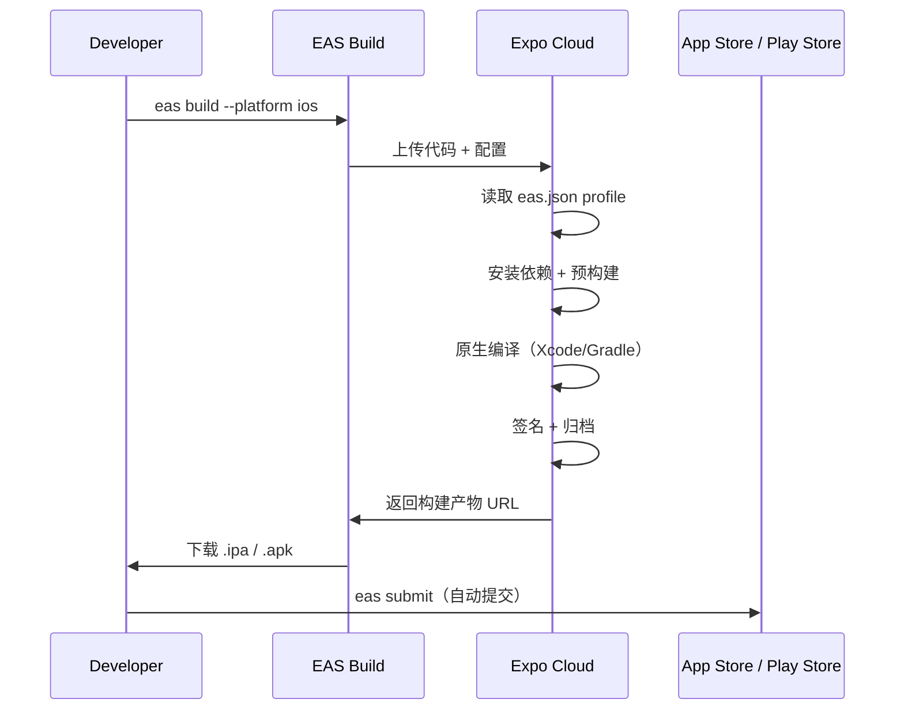
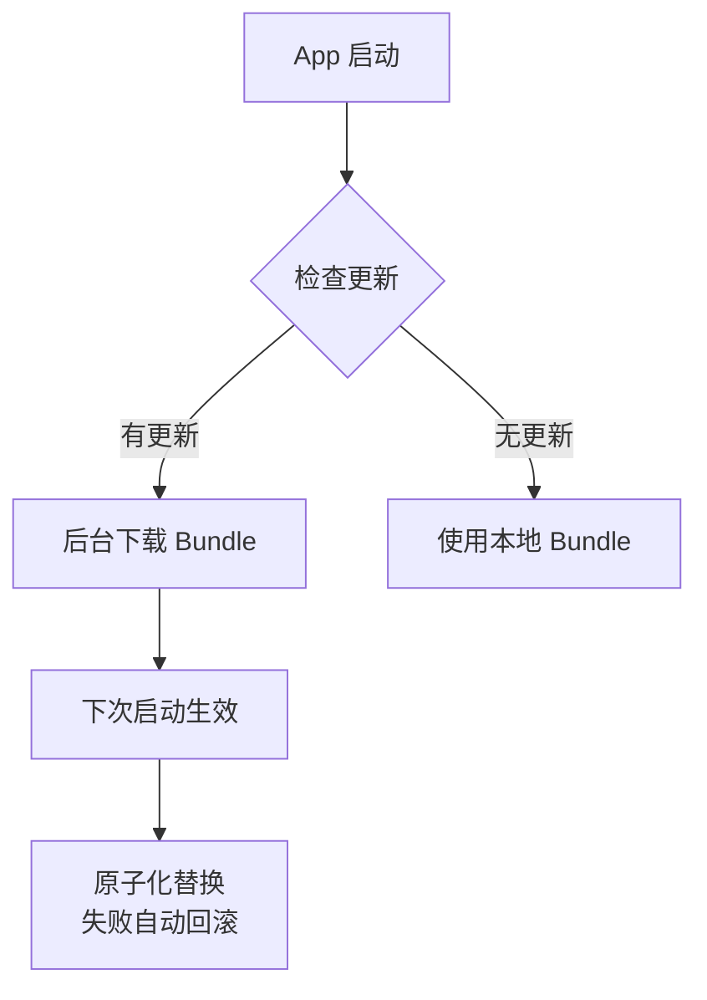

# Expo 生态系统

> Expo 是 React Native 生态中最成熟的开发层（Developer Experience Layer），它抽象了原生工具链的复杂性，使开发者可以专注于 JS/TS 代码。从 Managed Workflow 到 EAS 云服务，Expo 已覆盖移动应用全生命周期。

## Expo 技术栈全景



## Workflow 选型：Managed vs Bare

| 维度 | Managed Workflow | Bare Workflow |
|------|-----------------|---------------|
| **原生代码访问** | 通过 Config Plugin 间接配置 | 完全开放 android/ios 目录 |
| **构建环境** | EAS Build 云端（推荐）或本地 | 本地 Android Studio / Xcode |
| **Expo SDK 使用** | 完整 SDK，无需额外链接 | 需手动 `npx install-expo-modules` |
| **OTA 更新** | EAS Update 开箱即用 | 需额外配置 |
| **适合场景** | 标准 App、快速原型、团队无原生能力 | 深度原生定制、已有原生模块 |
| **退出成本** | 可随时 Eject 到 Bare | 不可逆 |



## Expo Router：文件系统路由

Expo Router 基于 React Navigation 构建，采用类似 Next.js 的文件系统路由约定。

### 路由约定

```text
app/                                    # 根路由目录
├── _layout.tsx                         # 根布局（导航容器）
├── index.tsx                           # / 首页
├── about.tsx                           # /about
├── user/
│   ├── [id].tsx                        # /user/:id 动态路由
│   └── settings.tsx                    # /user/settings
├── (tabs)/                             # 路由分组（无 URL 路径段）
│   ├── _layout.tsx                     # Tab Navigator 配置
│   ├── home.tsx                        # /home（对应 tab）
│   └── profile.tsx                     # /profile（对应 tab）
└── +not-found.tsx                      # 404 页面
```

### 布局与导航示例

```tsx
// app/_layout.tsx — 根布局
import { Stack } from 'expo-router';
import { ThemeProvider } from '@react-navigation/native';

export default function RootLayout() {
  return (
    <ThemeProvider value={DarkTheme}>
      <Stack>
        <Stack.Screen name="(tabs)" options={{ headerShown: false }} />
        <Stack.Screen name="modal" options={{ presentation: 'modal' }} />
      </Stack>
    </ThemeProvider>
  );
}
```

```tsx
// app/(tabs)/_layout.tsx — Tab 导航
import { Tabs } from 'expo-router';
import { Ionicons } from '@expo/vector-icons';

export default function TabLayout() {
  return (
    <Tabs screenOptions={{ tabBarActiveTintColor: '#007AFF' }}>
      <Tabs.Screen
        name="home"
        options={{
          title: '首页',
          tabBarIcon: ({ color }) => <Ionicons name="home" color={color} size={24} />,
        }}
      />
      <Tabs.Screen
        name="profile"
        options={{
          title: '我的',
          tabBarIcon: ({ color }) => <Ionicons name="person" color={color} size={24} />,
        }}
      />
    </Tabs>
  );
}
```

```tsx
// app/user/[id].tsx — 动态路由
import { useLocalSearchParams } from 'expo-router';
import { Text, View } from 'react-native';

export default function UserDetail() {
  const { id } = useLocalSearchParams<{ id: string }>();

  return (
    <View>
      <Text>User ID: {id}</Text>
    </View>
  );
}
```

### 深度链接与路由类型安全

```typescript
// app/navigation.types.ts
export type RootStackParamList = {
  '(tabs)': undefined;
  'user/[id]': { id: string };
  'modal': { title: string };
};

// 配合 TypeScript 声明
// 在 _layout.tsx 中使用 Stack<RootStackParamList>
```

## EAS Build：云端构建系统

EAS Build 消除了本地配置 Android/iOS 构建环境的痛苦，支持自定义构建流程。

### eas.json 配置示例

```json
{
  "cli": {
    "version": ">= 7.0.0"
  },
  "build": {
    "development": {
      "developmentClient": true,
      "distribution": "internal",
      "ios": {
        "simulator": true
      }
    },
    "preview": {
      "distribution": "internal",
      "android": {
        "buildType": "apk"
      }
    },
    "production": {
      "autoIncrement": true,
      "env": {
        "API_URL": "https://api.production.com"
      }
    }
  },
  "submit": {
    "production": {
      "ios": {
        "ascAppId": "1234567890"
      }
    }
  },
  "update": {
    "production": {
      "channel": "production"
    }
  }
}
```

### 构建工作流



### 自定义构建流程（EAS Build Extensibility）

```yaml
# eas-hooks/eas-build-pre-install.sh
#!/bin/bash
# 在安装依赖前执行

echo "Running pre-install hook..."
if [ "$EAS_BUILD_PLATFORM" = "ios" ]; then
  echo "iOS build detected, setting up certificates..."
fi
```

## EAS Update：OTA 热更新

EAS Update 是微软 CodePush 关闭后的主流替代方案，基于 Expo 的更新协议。

### 更新机制



### 配置与发布

```tsx
// App.tsx
import * as Updates from 'expo-updates';

async function checkForUpdate() {
  try {
    const update = await Updates.checkForUpdateAsync();
    if (update.isAvailable) {
      await Updates.fetchUpdateAsync();
      await Updates.reloadAsync(); // 立即生效
    }
  } catch (error) {
    console.error('Update check failed:', error);
  }
}
```

```bash
# 发布更新到指定 channel
eas update --channel production --message "Fix login bug"

# 查看更新历史
eas update:list
```

**EAS Update 关键限制**：

- 不能更新原生代码（Android/iOS 目录变更需重新构建）
- 单次更新包建议 < 10 MB
- iOS 需遵守 Apple 审核指南 2.5.2（不能绕过审核的实质性功能变更）

## Expo Modules API

Expo Modules 是编写原生模块的现代方式，相比传统 React Native 模块，API 更简洁、类型更安全。

### 模块定义（Swift 示例）

```swift
// modules/my-module/ios/MyModule.swift
import ExpoModulesCore

public class MyModule: Module {
  public func definition() -> ModuleDefinition {
    Name("MyModule")

    // 定义常量
    Constants([
      "PI": Double.pi
    ])

    // 定义异步函数
    AsyncFunction("multiply") { (a: Double, b: Double) -> Double in
      return a * b
    }

    // 定义同步函数
    Function("add") { (a: Double, b: Double) -> Double in
      return a + b
    }

    // 定义事件
    Events("onValueChanged")

    // 定义 View
    View(MyCustomView.self) {
      Prop("color") { (view: MyCustomView, color: UIColor) in
        view.backgroundColor = color
      }
    }
  }
}
```

```typescript
// modules/my-module/src/index.ts
import { requireNativeModule } from 'expo-modules-core';

interface MyModuleType {
  PI: number;
  multiply(a: number, b: number): Promise<number>;
  add(a: number, b: number): number;
  addListener(event: 'onValueChanged', listener: (value: number) => void): void;
}

export default requireNativeModule<MyModuleType>('MyModule');
```

### Expo Module 项目结构

```text
modules/
└── my-expo-module/
    ├── android/
    │   ├── build.gradle
    │   └── src/main/java/expo/modules/mymodule/
    │       └── MyModule.kt
    ├── ios/
    │   └── MyModule.swift
    ├── src/
    │   └── index.ts
    ├── expo-module.config.json         # 模块配置
    └── package.json
```

```json
// expo-module.config.json
{
  "platforms": ["ios", "android", "web"],
  "ios": {
    "modules": ["MyModule"]
  },
  "android": {
    "modules": ["expo.modules.mymodule.MyModule"]
  }
}
```

## 实战项目结构

```text
expo-mobile-app/
├── app/                                # Expo Router 路由
│   ├── (auth)/                         # 认证路由组
│   │   ├── login.tsx
│   │   └── register.tsx
│   ├── (tabs)/                         # 主 Tab 路由组
│   │   ├── _layout.tsx
│   │   ├── index.tsx
│   │   └── explore.tsx
│   ├── _layout.tsx
│   └── +html.tsx                       # Web 入口 HTML
├── components/                         # 共享组件
│   ├── ui/
│   └── ThemedText.tsx
├── constants/
│   └── Colors.ts
├── hooks/
│   ├── useColorScheme.ts
│   └── useThemeColor.ts
├── modules/                            # 本地 Expo Modules
│   └── secure-storage/
│       ├── ios/
│       ├── android/
│       └── src/index.ts
├── assets/
│   ├── images/
│   └── fonts/
├── app.json                            # Expo 配置
├── eas.json                            # EAS 构建配置
├── metro.config.js
├── babel.config.js
├── tailwind.config.js                  # NativeWind 样式
├── package.json
└── tsconfig.json
```

## 关键决策建议

| 场景 | 推荐方案 |
|------|---------|
| 从零开始的消费级 App | **Managed + Expo Router + EAS Build** |
| 需要深度蓝牙/AR/ML 集成 | **Bare + Expo Modules + 原生 SDK** |
| 已有 React Native 项目 | **逐步迁移 `expo-modules-core`** |
| 需要 Web + Mobile 同构 | **Expo Router 的 Web 支持 + Metro Web** |
| 高频 OTA 更新需求 | **EAS Update + channel 策略（staging/production）** |

---

> 🔗 **相关阅读**：
>
> - [React Native New Architecture](./01-react-native-new-arch.md) — Expo 如何封装 New Architecture
> - [部署策略](./06-deployment-strategies.md) — EAS Submit 与商店审核自动化
