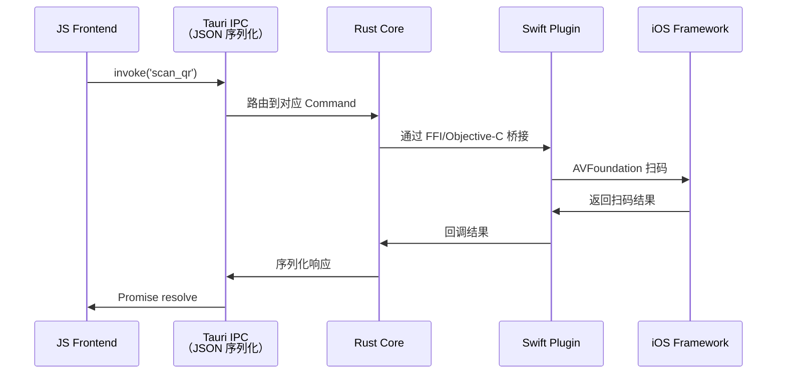
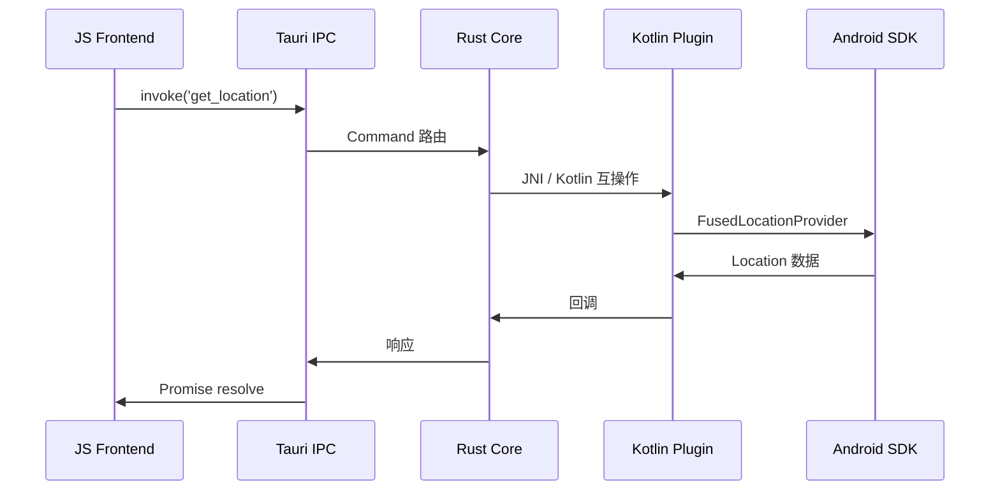

# Tauri v2 移动端支持

> Tauri v2 将 "Rust 后端 + Web 前端" 的架构从桌面端扩展到了 iOS 和 Android。对于已有 Tauri 桌面应用或 Rust 后端服务的团队，这是以最低成本覆盖移动端的最优路径。

## Tauri v2 架构概览

```mermaid
graph TB
    subgraph Frontend["Web Frontend"]
        WebApp[Web App<br/>React / Vue / Svelte]
        TauriAPI[@tauri-apps/api]
    end

    subgraph Core["Tauri Core (Rust)"]
        Runtime[Tauri Runtime]
        Commands[Tauri Commands]
        Plugins[Plugin System]
        Permissions[Capabilities<br/>权限模型 v2]
    end

    subgraph Mobile["Mobile Native"]
        iOS[iOS<br/>WKWebView + Swift]
        Android[Android<br/>WebView + Kotlin]
    end

    subgraph RustLayer["Rust 平台层"]
        MobileBridge[tauri-mobile<br/>平台抽象]
        WRY[WRY<br/>WebView 抽象]
    end

    WebApp --> TauriAPI
    TauriAPI -->|IPC| Commands
    Commands --> Runtime
    Runtime --> Plugins
    Runtime --> Permissions
    Runtime --> MobileBridge
    MobileBridge --> WRY
    WRY --> iOS
    WRY --> Android

    style Frontend fill:#e1f5fe
    style Core fill:#fff3e0
    style Mobile fill:#e8f5e9
    style RustLayer fill:#f3e5f5
```

**Tauri v2 核心设计理念**：

- **WRY（Webview Render Yield）**：统一抽象 macOS/WKWebView、Linux/WebKitGTK、Windows/WebView2、iOS/WKWebView、Android/WebView
- **TAO（Tauri Advanced Options）**：跨平台窗口/应用生命周期管理
- **Capabilities**：声明式权限模型，替代 v1 的 allowlist

## 移动端架构详解

### iOS 集成模型



### Android 集成模型



## 项目结构与初始化

### 初始化移动端项目

```bash
# 安装 Tauri CLI v2
npm install -D @tauri-apps/cli@latest

# 创建项目（同时包含桌面和移动端）
npm create tauri-app@latest mobile-tauri-app
# 选择: 前端 -> React/Vue/Svelte
# 选择: 移动端支持 -> Yes
```

### 移动端项目结构

```text
mobile-tauri-app/
├── src/                                # 前端源码
│   ├── App.tsx
│   ├── main.tsx
│   └── lib/
│       └── tauri.ts                    # Tauri API 封装
├── src-tauri/                          # Rust 后端
│   ├── src/
│   │   ├── lib.rs                      # Tauri Builder 入口
│   │   ├── main.rs                     # 程序入口
│   │   └── commands/                   # 自定义命令
│   │       ├── mod.rs
│   │       └── filesystem.rs
│   ├── capabilities/                   # v2 权限声明
│   │   ├── default.json
│   │   └── mobile.json
│   ├── gen/                            # 生成的移动端脚手架
│   │   ├── android/                    # Android Studio 项目
│   │   └── ios/                        # Xcode 项目
│   ├── Cargo.toml
│   └── tauri.conf.json                 # Tauri 配置
├── index.html
├── vite.config.ts
├── package.json
└── Cargo.lock
```

### tauri.conf.json 移动端配置

```json
{
  "productName": "MobileTauriApp",
  "version": "1.0.0",
  "identifier": "com.example.mobile-tauri-app",
  "build": {
    "frontendDist": "../dist",
    "devUrl": "http://localhost:5173"
  },
  "app": {
    "windows": [],
    "security": {
      "csp": "default-src 'self'; connect-src 'self' https://api.example.com"
    }
  },
  "bundle": {
    "active": true,
    "targets": ["deb", "msi", "dmg", "apk", "aab", "ipa"],
    "icon": ["icons/32x32.png", "icons/icon.icns"]
  },
  "plugins": {}
}
```

## Capabilities：v2 权限模型

Tauri v2 引入了基于能力的权限模型，替代了 v1 的 `allowlist`。

```json
// src-tauri/capabilities/mobile.json
{
  "identifier": "mobile-capability",
  "description": "移动端核心权限",
  "windows": ["main"],
  "permissions": [
    "core:default",
    "fs:allow-read-text-file",
    "fs:allow-write-text-file",
    "fs:scope": ["$APPLOCALDATA/**"],
    "camera:allow-capture",
    "geolocation:allow-get-current-position",
    {
      "identifier": "http:default",
      "allow": [{ "url": "https://api.example.com" }]
    }
  ]
}
```

### 运行时权限请求（Android/iOS）

```typescript
// 前端：请求移动端原生权限
import { checkPermissions, requestPermissions } from '@tauri-apps/plugin-permissions';
import { getCurrentPosition } from '@tauri-apps/plugin-geolocation';

async function getLocation() {
  // 检查并请求权限
  const permission = await checkPermissions('geolocation');
  if (permission !== 'granted') {
    await requestPermissions('geolocation');
  }

  // 调用原生功能
  const position = await getCurrentPosition();
  return position;
}
```

## Tauri Commands 与移动端

### Rust Command 定义

```rust
// src-tauri/src/commands/mod.rs
use tauri::command;
use serde::Serialize;

#[derive(Serialize)]
pub struct DeviceInfo {
    pub platform: String,
    pub version: String,
    pub model: String,
}

#[command]
pub async fn get_device_info(app: tauri::AppHandle) -> Result<DeviceInfo, String> {
    #[cfg(target_os = "ios")]
    {
        Ok(DeviceInfo {
            platform: "iOS".to_string(),
            version: "17.0".to_string(),
            model: "iPhone15,2".to_string(),
        })
    }
    #[cfg(target_os = "android")]
    {
        Ok(DeviceInfo {
            platform: "Android".to_string(),
            version: "14".to_string(),
            model: "Pixel 8".to_string(),
        })
    }
}

#[command]
pub async fn read_app_file(path: String) -> Result<String, String> {
    let app_dirs = tauri::api::path::app_local_data_dir(&tauri::generate_context!().config())
        .ok_or("Failed to get app dir")?;
    let full_path = app_dirs.join(path);
    std::fs::read_to_string(full_path).map_err(|e| e.to_string())
}
```

```rust
// src-tauri/src/lib.rs
use tauri::Builder;

pub fn run() {
    Builder::default()
        .invoke_handler(tauri::generate_handler![
            commands::get_device_info,
            commands::read_app_file,
        ])
        .run(tauri::generate_context!())
        .expect("error while running tauri application");
}
```

### 前端调用封装

```typescript
// src/lib/tauri.ts
import { invoke } from '@tauri-apps/api/core';

interface DeviceInfo {
  platform: string;
  version: string;
  model: string;
}

export const tauriApi = {
  getDeviceInfo: (): Promise<DeviceInfo> =>
    invoke('get_device_info'),

  readAppFile: (path: string): Promise<string> =>
    invoke('read_app_file', { path }),
};
```

## 原生插件开发

Tauri v2 插件系统允许将 Rust 逻辑与平台原生代码（Swift/Kotlin）封装为可复用单元。

### 插件结构

```text
src-tauri/src/
└── plugins/
    └── barcode-scanner/
        ├── Cargo.toml
        ├── src/
        │   ├── lib.rs                  # 插件入口
        │   ├── commands.rs             # Tauri Commands
        │   ├── mobile.rs               # 移动端桥接
        │   └── error.rs                # 错误类型
        └── android/
        │   └── src/main/java/
        │       └── com/example/barcode/
        │           └── BarcodeScannerPlugin.kt
        └── ios/
            └── Sources/
                └── BarcodeScanner.swift
```

### 插件 Rust 入口

```rust
// src-tauri/src/plugins/barcode-scanner/src/lib.rs
use tauri::{
    plugin::{Builder, TauriPlugin},
    Manager, Runtime,
};

pub fn init<R: Runtime>() -> TauriPlugin<R> {
    Builder::new("barcode-scanner")
        .invoke_handler(tauri::generate_handler![scan])
        .setup(|app| {
            #[cfg(mobile)]
            app.handle().plugin_initializer::<mobile::BarcodeScanner>()?;
            Ok(())
        })
        .build()
}

#[tauri::command]
async fn scan<R: Runtime>(app: tauri::AppHandle<R>) -> Result<String, String> {
    #[cfg(mobile)]
    {
        app.state::<mobile::BarcodeScanner>()
            .scan()
            .await
            .map_err(|e| e.to_string())
    }
    #[cfg(desktop)]
    {
        Err("Barcode scanner is only available on mobile".to_string())
    }
}
```

## 移动端构建与调试

### Android 构建

```bash
# 开发模式（连接设备/模拟器）
npm run tauri android dev

# 生产构建（APK）
npm run tauri android build

# 生产构建（AAB - Google Play 必需）
npm run tauri android build -- --aab
```

### iOS 构建

```bash
# 开发模式（需 macOS + Xcode）
npm run tauri ios dev

# 选择模拟器
npm run tauri ios dev -- --target "iPhone 15 Pro"

# 生产构建（.ipa 需签名配置）
npm run tauri ios build
```

### 生成项目结构说明

`src-tauri/gen/android/` 和 `src-tauri/gen/ios/` 是由 `tauri-mobile` 生成的原生项目模板：

```text
src-tauri/gen/android/
├── app/
│   ├── build.gradle.kts
│   ├── src/main/
│   │   ├── AndroidManifest.xml
│   │   ├── java/com/example/mobile_tauri_app/
│   │   │   └── MainActivity.kt       # 继承 TauriActivity
│   │   └── res/
│   └── proguard-rules.pro
├── build.gradle.kts
├── settings.gradle.kts
└── gradle/

src-tauri/gen/ios/
├── MobileTauriApp/
│   ├── Info.plist
│   ├── AppDelegate.swift             # 桥接到 Tauri
│   └── main.swift
├── MobileTauriApp.xcodeproj/
└── assets/
```

**重要**：`gen/` 目录下的文件可安全修改，但 Tauri CLI 升级时可能重新生成，建议将自定义改动控制在最小范围，或通过 `tauri.conf.json` 的 `bundle` 配置驱动。

## 桌面到移动端迁移检查清单

从已有 Tauri v1 桌面应用迁移到 v2 移动端：

- [ ] **升级依赖**：`@tauri-apps/cli` 和 `@tauri-apps/api` 升级到 v2
- [ ] **迁移 allowlist**：将 `tauri.conf.json > tauri > allowlist` 转换为 `capabilities/*.json`
- [ ] **API 适配**：替换 `@tauri-apps/api` 中的旧模块路径（v2 重构了子模块结构）
- [ ] **移动端初始化**：运行 `tauri ios init` / `tauri android init` 生成原生项目
- [ ] **平台条件编译**：在 Rust 代码中使用 `#[cfg(mobile)]` / `#[cfg(desktop)]` 区分平台逻辑
- [ ] **UI 适配**：针对移动端屏幕和触摸交互调整前端布局
- [ ] **权限处理**：Android `AndroidManifest.xml` 和 iOS `Info.plist` 补充原生权限声明
- [ ] **包体积优化**：启用 Rust LTO、前端代码分割，控制 APK/IPA 体积

## 与其他方案的对比

| 维度 | Tauri v2 Mobile | React Native | Capacitor |
|------|----------------|--------------|-----------|
| **前端技术** | Web（任意框架） | React Native 组件 | Web（任意框架） |
| **后端语言** | Rust | C++ / Java / Obj-C | 原生插件 |
| **包体积** | ~3-5 MB（极简） | ~8-12 MB | ~5-8 MB |
| **启动速度** | 快（WebView 预热） | 中等 | 快 |
| **原生 API 访问** | Rust Commands + 插件 | 直接 Native Modules | Capacitor Plugins |
| **桌面复用** | ✅ 完全共享 | ❌ 需独立项目 | ❌ 需独立项目 |
| **Rust 生态** | ✅ 完整访问 | ❌ 需额外桥接 | ❌ 需额外桥接 |
| **Web 生态复用** | ✅ 100% | ❌ 需适配 | ✅ 100% |
| **典型场景** | 桌面+移动统一、Rust 栈 | 纯移动端、原生 UI | Web 应用迁移移动端 |

---

> 🔗 **相关阅读**：
>
> - [Capacitor + Ionic](./04-capacitor-ionic.md) — 另一种 Web-to-Mobile 方案的对比
> - [性能优化](./05-performance-optimization.md) — Tauri 应用的包体积与启动优化
