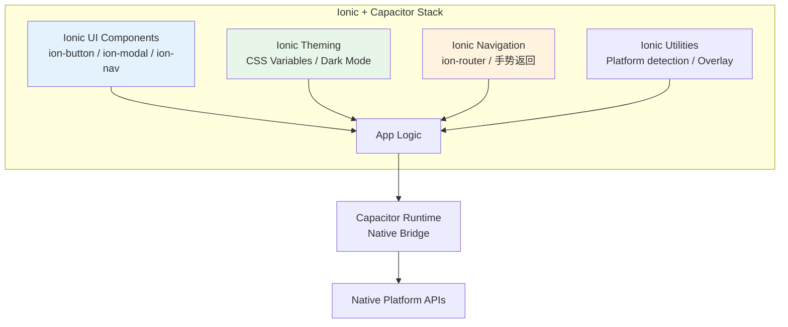
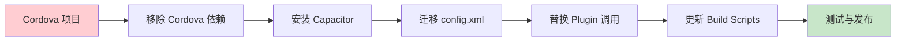
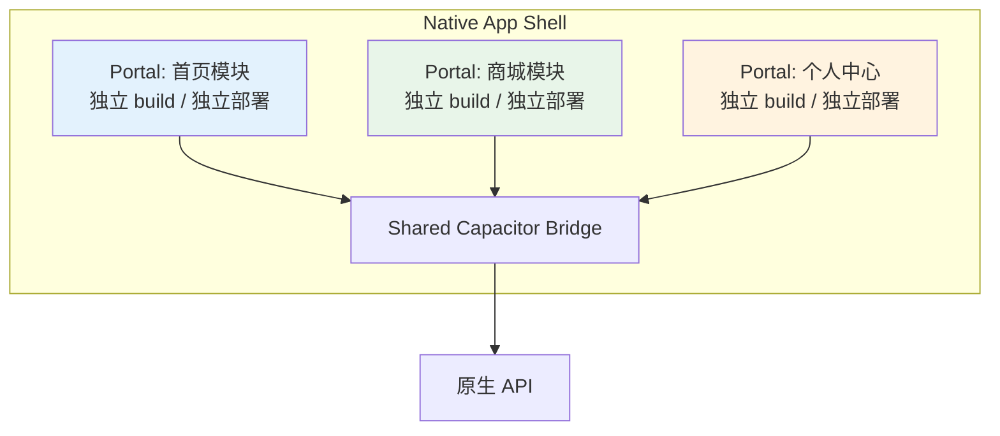

# 第4章：Capacitor + Ionic — 现代 Web-to-Mobile 桥接方案

> **章节定位**：本章聚焦于 **Capacitor** 与 **Ionic** 这一现代 Hybrid Mobile 技术栈的核心机制。从 WebView 桥接原理、插件系统设计，到与 Cordova 的历史性对比，帮助开发者建立完整的 Web-to-Mobile 架构认知。

---

## 4.1 引言：从 Cordova 到 Capacitor 的演进

Hybrid Mobile 开发经历了十余年的发展。早期 **Apache Cordova**（前身为 PhoneGap）开创了使用 Web 技术构建原生应用的先河，但其架构设计在现代化开发 workflow 中逐渐暴露出局限性：

- **CLI 侵入性强**：Cordova CLI 深度控制项目结构，与现代前端 toolchain（Webpack、Vite、esbuild）集成困难
- **构建时修改**：原生项目文件在每次 `cordova prepare` 时被覆盖，难以进行持续的原生层定制
- **插件管理耦合**：插件安装直接修改原生平台代码，版本回滚和依赖管理复杂
- **Native IDE 体验差**：开发者被迫在 CLI 与 Xcode/Android Studio 之间反复切换

**Capacitor**（2018 年由 Ionic Team 开源）采用截然不同的设计理念：将 Web 应用视为「一等公民」，原生平台代码为「宿主环境」。这种 inversion of control 带来了：

| 维度 | Cordova | Capacitor |
|------|---------|-----------|
| 项目结构 | CLI 生成并控制 | 开发者拥有原生项目 |
| 构建集成 | 独立 build pipeline | 复用前端 build artifacts |
| 原生修改 | 运行时覆盖 | 持久化、版本控制友好 |
| Plugin API | 回调驱动 | Promise + async/await |
| WebView | UIWebView / 旧版 WKWebView | 现代 WKWebView / Android WebView |
| 平台管理 | 命令式 | 声明式 (`capacitor.config.ts`) |

---

## 4.2 Web-to-Mobile 桥接原理

### 4.2.1 架构总览

Capacitor 的核心是一个轻量级的 **JavaScript-to-Native Bridge**，连接 WebView 中的 JavaScript 运行时与宿主平台的原生 API。

```mermaid
graph TB
    subgraph AppContainer["📱 Native App Container"]
        subgraph iOS["iOS Platform"]
            WK[WKWebView<br/>JavaScript Runtime]
            BK[CAPBridge<br/>Objective-C/Swift]
            AP[Native Plugins<br/>Camera / Filesystem / Geolocation]
        end

        subgraph Android["Android Platform"]
            AW[WebView<br/>JavaScript Runtime]
            AB[CAPBridge<br/>Kotlin/Java]
            AAP[Native Plugins<br/>Camera / Filesystem / Geolocation]
        end

        subgraph WebLayer["🌐 Web Layer"]
            JS[Capacitor Core JS<br/>@capacitor/core]
            APP[App Bundle<br/>Ionic / React / Vue / Angular]
        end
    end

    JS -->|postMessage| WK
    JS -->|evaluateJavascript| AW
    BK -->|invoke| AP
    AB -->|invoke| AAP
    WK -->|window.webkit.messageHandlers| BK
    AW -->|@JavascriptInterface| AB

    style WebLayer fill:#e1f5fe
    style iOS fill:#fff3e0
    style Android fill:#e8f5e9
```

### 4.2.2 iOS Bridge 实现机制

在 iOS 端，Capacitor 利用 **WKWebView** 的 `WKScriptMessageHandler` 协议实现双向通信：

```swift
// CAPBridgeViewController.swift (简化示意)
import WebKit

class CAPBridgeViewController: UIViewController, WKScriptMessageHandler {
    var webView: WKWebView!
    var bridge: CAPBridge!

    override func viewDidLoad() {
        super.viewDidLoad()

        let config = WKWebViewConfiguration()
        config.userContentController.add(self, name: "capacitor")

        webView = WKWebView(frame: view.bounds, configuration: config)
        view.addSubview(webView)

        bridge = CAPBridge(webView: webView)

        // 加载本地 Web 资源
        let url = Bundle.main.url(forResource: "index", withExtension: "html", subdirectory: "public")!
        webView.loadFileURL(url, allowingReadAccessTo: url.deletingLastPathComponent())
    }

    // 接收来自 JavaScript 的消息
    func userContentController(_ userContentController: WKUserContentController,
                               didReceive message: WKScriptMessage) {
        if message.name == "capacitor" {
            bridge.handleJSCall(message.body as! [String: Any])
        }
    }
}
```

**通信流程解析**：

1. **JS → Native**：JavaScript 通过 `window.webkit.messageHandlers.capacitor.postMessage(payload)` 发送序列化后的 JSON payload
2. **Message Routing**：`CAPBridge` 解析 payload 中的 `pluginId` 与 `methodName`，路由至对应 Plugin 实例
3. **Native Execution**：Plugin 方法在原生线程执行（Camera 调用、文件 IO 等）
4. **Native → JS**：通过 `webView.evaluateJavaScript("window.Capacitor.fromNative(...)")` 回传结果

### 4.2.3 Android Bridge 实现机制

Android 端采用 `@JavascriptInterface` 注解暴露 Java 对象给 WebView：

```kotlin
// CAPBridgeFragment.kt (简化示意)
import android.webkit.WebView
import android.webkit.JavascriptInterface

class CAPBridge(private val webView: WebView) {

    init {
        webView.settings.javaScriptEnabled = true
        webView.addJavascriptInterface(this, "Capacitor")
    }

    @JavascriptInterface
    fun postMessage(jsonData: String) {
        val data = JSONObject(jsonData)
        val pluginId = data.getString("pluginId")
        val methodName = data.getString("methodName")

        // 路由到对应 Plugin
        val plugin = PluginRegistry.get(pluginId)
        plugin?.invoke(methodName, data.getJSONObject("options"))
    }

    // Native → JS
    fun sendResponse(callbackId: String, result: JSObject) {
        val js = "window.Capacitor.fromNative('$callbackId', ${result.toString()})"
        webView.post {
            webView.evaluateJavascript(js, null)
        }
    }
}
```

**关键差异点**：Android WebView 的 `JavascriptInterface` 存在 **同步调用限制**（仅允许 primitive types 返回），因此 Capacitor 在 Android 端强制使用 **异步回调模型**，与 iOS 保持 API 一致性。

### 4.2.4 JavaScript 端的 Bridge 封装

Capacitor 在 JavaScript 层提供统一的 `nativeCallback` 机制，抹平平台差异：

```typescript
// @capacitor/core 简化源码分析
interface CapacitorGlobal {
  nativeCallback(pluginName: string, methodName: string, options?: any, callback?: Function): void;
  nativePromise(pluginName: string, methodName: string, options?: any): Promise<any>;
  Platforms: Record<string, string>;
  isNativePlatform(): boolean;
  getPlatform(): 'ios' | 'android' | 'web';
  convertFileSrc(path: string): string;
}

// 现代 API 封装：Promise-based
declare global {
  interface Window {
    Capacitor: CapacitorGlobal;
  }
}

// 实际调用示例
import { Capacitor } from '@capacitor/core';

console.log(Capacitor.getPlatform()); // "ios" | "android" | "web"
console.log(Capacitor.isNativePlatform()); // true on mobile

// 文件路径转换：将 file:// 路径转为 WebView 可加载的 URL
const converted = Capacitor.convertFileSrc('file:///data/photo.jpg');
// iOS: capacitor://localhost/_capacitor_file_/data/photo.jpg
// Android: http://localhost/_capacitor_file_/data/photo.jpg
```

---

## 4.3 插件系统深度解析

Capacitor 的插件系统采用 **分层架构**：官方 Core Plugins、Community Plugins、Custom Native Plugins。

```mermaid
graph LR
    subgraph PluginEcosystem["Capacitor Plugin Ecosystem"]
        CP[@capacitor/core<br/>官方核心插件<br/>~20个]
        CC[@capacitor-community/*<br/>社区维护插件<br/>100+]
        CUSTOM[自定义插件<br/>Custom Native Plugin]

        CP -->|Camera / Filesystem / Geolocation| App
        CC -->|SQLite / Firebase / Bluetooth| App
        CUSTOM -->|企业级原生 SDK 封装| App
    end

    App[Ionic/Capacitor App]

    style CP fill:#bbdefb
    style CC fill:#c8e6c9
    style CUSTOM fill:#ffe0b2
```

### 4.3.1 官方核心插件

Capacitor 官方维护约 20 个核心插件，覆盖最常见的原生能力：

| 插件名 | 功能范围 | 典型场景 |
|--------|----------|----------|
| `@capacitor/app` | App 状态、返回键、URL 打开 | 生命周期管理、Deep Link |
| `@capacitor/camera` | 相机拍照、相册选取 | 头像上传、扫码 |
| `@capacitor/filesystem` | 文件读写、目录管理 | 离线缓存、日志存储 |
| `@capacitor/geolocation` | GPS 定位、权限管理 | 地图应用、LBS 服务 |
| `@capacitor/preferences` | Key-Value 持久化 | 用户设置、Token 存储 |
| `@capacitor/splash-screen` | 启动屏控制 | 品牌展示、加载优化 |
| `@capacitor/status-bar` | 状态栏样式控制 | 沉浸式体验 |
| `@capacitor/toast` | 原生 Toast 提示 | 轻量反馈 |

**统一调用范式**：

```typescript
import { Camera, CameraResultType, CameraSource } from '@capacitor/camera';
import { Geolocation } from '@capacitor/geolocation';
import { Preferences } from '@capacitor/preferences';
import { Filesystem, Directory, Encoding } from '@capacitor/filesystem';

// 相机调用
async function takePhoto(): Promise<string> {
  const image = await Camera.getPhoto({
    quality: 90,
    allowEditing: true,
    resultType: CameraResultType.Uri,
    source: CameraSource.Prompt, // 让用户选择相机或相册
  });
  return image.webPath!;
}

// 定位调用
async function getCurrentPosition() {
  // 先检查权限
  const permission = await Geolocation.requestPermissions();
  if permission.location !== 'granted' {
    throw new Error('Location permission denied');
  }

  const coordinates = await Geolocation.getCurrentPosition({
    enableHighAccuracy: true,
    timeout: 10000,
  });
  return coordinates;
}

// Key-Value 存储（替代 localStorage）
async function saveAuthToken(token: string) {
  await Preferences.set({
    key: 'auth_token',
    value: token,
  });
}

// 文件系统操作
async function writeLog(content: string) {
  await Filesystem.writeFile({
    path: 'logs/app.log',
    data: content,
    directory: Directory.Documents,
    encoding: Encoding.UTF8,
    recursive: true,
    append: true,
  });
}
```

### 4.3.2 自定义 Native Plugin 开发

当官方/社区插件无法满足需求时（如集成第三方 SDK、调用硬件特定 API），需要开发 **Custom Plugin**。

#### TypeScript 定义层

```typescript
// src/definitions.ts
export interface EchoPlugin {
  echo(options: { value: string }): Promise<{ value: string }>;

  // 支持事件监听
  addListener(
    eventName: 'onBatteryLow',
    listenerFunc: (info: { level: number }) => void
  ): Promise<PluginListenerHandle>;
}

export interface PluginListenerHandle {
  remove: () => Promise<void>;
}
```

#### iOS 原生实现（Swift）

```swift
// ios/Plugin/EchoPlugin.swift
import Capacitor

@objc(EchoPlugin)
public class EchoPlugin: CAPPlugin {

    @objc func echo(_ call: CAPPluginCall) {
        let value = call.getString("value") ?? ""

        // 主线程执行 UI 操作
        DispatchQueue.main.async {
            // 调用原生 SDK 或系统 API
            let result: [String: Any] = [
                "value": value,
                "platform": "iOS",
                "timestamp": Date().timeIntervalSince1970
            ]
            call.resolve(result)
        }
    }

    @objc func checkBattery(_ call: CAPPluginCall) {
        UIDevice.current.isBatteryMonitoringEnabled = true
        let level = UIDevice.current.batteryLevel

        if level < 0.2 {
            notifyListeners("onBatteryLow", data: ["level": level])
        }

        call.resolve(["level": level])
    }
}
```

#### Android 原生实现（Kotlin）

```kotlin
// android/src/main/java/com/example/echo/EchoPlugin.kt
package com.example.echo

import com.getcapacitor.*
import com.getcapacitor.annotation.CapacitorPlugin

@CapacitorPlugin(name = "Echo")
class EchoPlugin : Plugin() {

    @PluginMethod
    fun echo(call: PluginCall) {
        val value = call.getString("value", "")

        val ret = JSObject().apply {
            put("value", value)
            put("platform", "Android")
            put("timestamp", System.currentTimeMillis())
        }

        call.resolve(ret)
    }

    @PluginMethod
    fun checkBattery(call: PluginCall) {
        val batteryIntent = context.registerReceiver(null,
            IntentFilter(Intent.ACTION_BATTERY_CHANGED))
        val level = batteryIntent?.getIntExtra(BatteryManager.EXTRA_LEVEL, -1) ?: -1
        val scale = batteryIntent?.getIntExtra(BatteryManager.EXTRA_SCALE, -1) ?: -1
        val batteryPct = level * 100 / scale.toFloat()

        if (batteryPct < 20) {
            notifyListeners("onBatteryLow", JSObject().apply {
                put("level", batteryPct / 100)
            })
        }

        call.resolve(JSObject().apply {
            put("level", batteryPct / 100)
        })
    }
}
```

#### Web Fallback 实现

```typescript
// src/web.ts
import { WebPlugin } from '@capacitor/core';
import type { EchoPlugin } from './definitions';

export class EchoWeb extends WebPlugin implements EchoPlugin {
  async echo(options: { value: string }): Promise<{ value: string }> {
    console.warn('EchoPlugin: using web fallback');
    return { value: `WEB_${options.value}` };
  }
}
```

#### 注册与使用

```typescript
// src/index.ts
import { registerPlugin } from '@capacitor/core';
import type { EchoPlugin } from './definitions';

const Echo = registerPlugin<EchoPlugin>('Echo', {
  web: () => import('./web').then(m => new m.EchoWeb()),
});

export * from './definitions';
export { Echo };

// 在应用中使用
import { Echo } from 'your-plugin-package';

const result = await Echo.echo({ value: 'Hello Native' });
console.log(result); // { value: 'Hello Native', platform: 'iOS' | 'Android', timestamp: ... }
```

### 4.3.3 插件系统对比：Capacitor vs Cordova

| 特性 | Capacitor Plugin | Cordova Plugin |
|------|-----------------|----------------|
| 编程模型 | Promise / async-await | Callback（success/error） |
| 类型安全 | TypeScript 原生支持 | 需手动维护 `.d.ts` |
| 事件机制 | `addListener` / `remove` | `document.addEventListener` |
| 原生代码位置 | 独立 npm package，可版本控制 | 直接修改 `platforms/` 目录 |
| Web 回退 | 内置 `web` 实现 | 需额外 shim |
| 平台检测 | `Capacitor.getPlatform()` | `device.platform` |
| 包体积 | Tree-shakeable | 全量引入 |

---

## 4.4 项目结构最佳实践

### 4.4.1 标准 Capacitor 项目结构

```
my-hybrid-app/
├── 📁 src/                          # 前端源码
│   ├── components/
│   ├── pages/
│   ├── services/
│   │   └── native-bridge.ts        # 原生能力抽象层
│   ├── utils/
│   └── main.ts
├── 📁 public/                       # 静态资源（复制到原生项目）
├── 📁 android/                      # Android 原生项目（开发者拥有）
│   ├── app/src/main/
│   │   ├── java/com/example/app/
│   │   │   └── MainActivity.kt     # 可安全修改
│   │   └── assets/public/          # Web build 输出目录
│   └── build.gradle
├── 📁 ios/                          # iOS 原生项目（开发者拥有）
│   ├── App/
│   │   ├── AppDelegate.swift       # 可安全修改
│   │   └── public/                 # Web build 输出目录
│   └── App.xcodeproj
├── 📁 capacitor-plugins/            # 自研原生插件（monorepo 模式）
│   └── custom-auth/
├── 📁 scripts/
│   └── sync-native.sh             # 自定义同步脚本
├── capacitor.config.ts              # Capacitor 核心配置
├── ionic.config.json                # Ionic CLI 配置（可选）
├── vite.config.ts                   # 构建配置
├── tsconfig.json
└── package.json
```

### 4.4.2 capacitor.config.ts 配置详解

```typescript
import { CapacitorConfig } from '@capacitor/cli';

const config: CapacitorConfig = {
  // 应用标识
  appId: 'com.example.myapp',
  appName: 'MyHybridApp',

  // Web 资源目录（build 输出）
  webDir: 'dist',

  // 开发服务器配置（live reload）
  server: {
    // 局域网开发时指向本地 dev server
    url: 'http://192.168.1.100:5173',
    cleartext: true, // 允许 HTTP（仅开发）

    // 或使用 Capacitor 内置 server
    // androidScheme: 'https',
    // iosScheme: 'capacitor',
  },

  // 插件全局配置
  plugins: {
    SplashScreen: {
      launchShowDuration: 3000,
      launchAutoHide: true,
      backgroundColor: '#ffffffff',
      androidSplashResourceName: 'splash',
      androidScaleType: 'CENTER_CROP',
      showSpinner: true,
      spinnerColor: '#999999',
    },
    PushNotifications: {
      presentationOptions: ['badge', 'sound', 'alert'],
    },
  },

  // Android 特定配置
  android: {
    buildOptions: {
      keystorePath: 'release.keystore',
      keystoreAlias: 'myalias',
    },
    allowMixedContent: true, // HTTP + HTTPS 混合内容
    captureInput: true, // WebView 输入优化
  },

  // iOS 特定配置
  ios: {
    contentInset: 'always',
    backgroundColor: '#ffffffff',
    scrollEnabled: true,
    allowsLinkPreview: false,
  },
};

export default config;
```

### 4.4.3 原生层定制示例

Capacitor 允许开发者像维护普通原生项目一样修改 `ios/` 和 `android/` 目录，且**不会被后续 sync 覆盖**。

**iOS：自定义 AppDelegate 处理推送**：

```swift
// ios/App/App/AppDelegate.swift
import UIKit
import Capacitor
import FirebaseCore
import FirebaseMessaging

@UIApplicationMain
class AppDelegate: UIApplicationDelegate {
    var window: UIWindow?

    func application(_ application: UIApplication,
                     didFinishLaunchingWithOptions launchOptions: [UIApplication.LaunchOptionsKey: Any]?) -> Bool {
        // 初始化 Firebase（不会被 Capacitor 覆盖）
        FirebaseApp.configure()

        // 注册推送
        UNUserNotificationCenter.current().delegate = self
        application.registerForRemoteNotifications()

        return true
    }

    // 处理 APNS Token
    func application(_ application: UIApplication,
                     didRegisterForRemoteNotificationsWithDeviceToken deviceToken: Data) {
        Messaging.messaging().apnsToken = deviceToken
    }
}

extension AppDelegate: UNUserNotificationCenterDelegate {
    func userNotificationCenter(_ center: UNUserNotificationCenter,
                                willPresent notification: UNNotification) async -> UNNotificationPresentationOptions {
        return [.banner, .sound, .badge]
    }
}
```

**Android：自定义 MainActivity 集成第三方 SDK**：

```kotlin
// android/app/src/main/java/com/example/app/MainActivity.kt
package com.example.app

import android.os.Bundle
import com.getcapacitor.BridgeActivity
import com.razorpay.Checkout

class MainActivity : BridgeActivity() {
    override fun onCreate(savedInstanceState: Bundle?) {
        registerPlugin(EchoPlugin::class.java) // 注册自定义插件
        super.onCreate(savedInstanceState)

        // 预初始化支付 SDK
        Checkout.preload(applicationContext)
    }
}
```

---

## 4.5 Ionic Framework 与 Capacitor 的协同

Ionic Framework 提供了一套 **Mobile-First UI 组件库**，与 Capacitor 形成完整的技术栈。



### 4.5.1 Ionic + Capacitor 开发模式

```typescript
// main.ts
import { createApp } from 'vue';
import { IonicVue } from '@ionic/vue';
import App from './App.vue';
import router from './router';

const app = createApp(App)
  .use(IonicVue, {
    mode: 'ios', // 统一 iOS 风格，或 'md' for Material Design
    animated: true,
    swipeBackEnabled: true,
  })
  .use(router);

router.isReady().then(() => {
  app.mount('#app');
});
```

```vue
<!-- CameraPage.vue -->
<template>
  <ion-page>
    <ion-header>
      <ion-toolbar>
        <ion-title>相机示例</ion-title>
      </ion-toolbar>
    </ion-header>

    <ion-content class="ion-padding">
      <ion-button @click="takePhoto" expand="block">
        <ion-icon slot="start" :icon="camera"></ion-icon>
        拍照
      </ion-button>

      <ion-img v-if="photoUrl" :src="photoUrl" style="margin-top: 16px;"></ion-img>

      <ion-toast
        :is-open="showToast"
        message="照片已保存"
        duration="2000"
        @didDismiss="showToast = false"
      ></ion-toast>
    </ion-content>
  </ion-page>
</template>

<script setup lang="ts">
import { ref } from 'vue';
import { Camera, CameraResultType } from '@capacitor/camera';
import { camera } from 'ionicons/icons';

const photoUrl = ref<string | null>(null);
const showToast = ref(false);

async function takePhoto() {
  try {
    const image = await Camera.getPhoto({
      quality: 90,
      resultType: CameraResultType.Uri,
    });
    photoUrl.value = image.webPath;
    showToast.value = true;
  } catch (e) {
    console.error('Camera error:', e);
  }
}
</script>
```

### 4.5.2 平台自适应 UI

```typescript
// composables/usePlatform.ts
import { isPlatform } from '@ionic/vue';

export function usePlatform() {
  return {
    isIOS: isPlatform('ios'),
    isAndroid: isPlatform('android'),
    isMobile: isPlatform('mobile'),
    isDesktop: isPlatform('desktop'),
    isHybrid: isPlatform('hybrid'), // Capacitor / Cordova

    // 平台特定样式
    platformClass: isPlatform('ios') ? 'platform-ios' : 'platform-android',
  };
}

// 在组件中使用
const { isIOS, isHybrid } = usePlatform();

// 条件渲染原生能力
const canUseBiometrics = isHybrid && isPlatform('mobile');
```

---

## 4.6 迁移指南：从 Cordova 到 Capacitor



### 4.6.1 迁移检查清单

| 步骤 | 操作内容 | 注意事项 |
|------|----------|----------|
| 1 | 备份现有项目 | 包含 `platforms/` 和 `plugins/` |
| 2 | 移除 `cordova` 及 plugin 依赖 | `npm uninstall cordova` |
| 3 | 安装 `@capacitor/core` 和 `@capacitor/cli` | 版本对齐 |
| 4 | 初始化 Capacitor | `npx cap init` |
| 5 | 映射 `config.xml` 到 `capacitor.config.ts` | 插件配置需手动迁移 |
| 6 | 替换 Plugin import | Cordova plugin → Capacitor plugin |
| 7 | 更新 native 项目 | `npx cap add ios/android` |
| 8 | 验证原生代码迁移 | 检查 custom native code |

### 4.6.2 代码迁移示例

**Cordova 风格（旧）**：

```javascript
// Cordova Camera
navigator.camera.getPicture(
  (imageData) => {
    const image = `data:image/jpeg;base64,${imageData}`;
    this.photo = image;
  },
  (message) => {
    alert(`Failed: ${message}`);
  },
  {
    quality: 50,
    destinationType: Camera.DestinationType.DATA_URL,
    sourceType: Camera.PictureSourceType.CAMERA,
  }
);
```

**Capacitor 风格（新）**：

```typescript
import { Camera, CameraResultType, CameraSource } from '@capacitor/camera';

async function takePicture() {
  try {
    const image = await Camera.getPhoto({
      quality: 50,
      resultType: CameraResultType.DataUrl,
      source: CameraSource.Camera,
    });
    return image.dataUrl; // 直接返回 base64
  } catch (error) {
    console.error('Camera failed:', error);
    throw error;
  }
}
```

---

## 4.7 高级主题

### 4.7.1 Portals：微前端架构

对于大型应用，Ionic 提供了 **Portals** 方案，允许多个独立 Web 应用运行在同一个原生容器中：



### 4.7.2 Secure Storage 与 Biometric

```typescript
import { SecureStorage } from '@aparajita/capacitor-secure-storage';
import { NativeBiometric } from 'capacitor-native-biometric';

// 加密存储敏感数据
async function secureSet(key: string, value: string) {
  await SecureStorage.set(key, value, {
    accessGroup: 'com.example.myapp',
    accessibility: 'whenUnlockedThisDeviceOnly',
  });
}

// 生物识别认证
async function authenticateWithBiometrics() {
  const result = await NativeBiometric.verifyIdentity({
    reason: '验证以继续操作',
    title: '生物识别认证',
    subtitle: '请使用 Face ID / 指纹',
    description: '确保是您本人在操作',
    maxAttempts: 3,
  });

  return result.verified;
}
```

### 4.7.3 HTTP 原生请求

避免 CORS 限制和增强性能：

```typescript
import { CapacitorHttp } from '@capacitor/core';

// 替代 fetch/axios，绕过 WebView CORS
const response = await CapacitorHttp.get({
  url: 'https://api.example.com/data',
  headers: {
    'Authorization': `Bearer ${token}`,
    'X-Client-Version': '1.0.0',
  },
  params: { page: '1', limit: '20' },
  connectTimeout: 10000,
  readTimeout: 30000,
});

console.log(response.status);
console.log(response.data);
```

---

## 4.8 本章小结

Capacitor + Ionic 代表了现代 Hybrid Mobile 开发的最佳实践：

1. **Bridge 机制**：基于 WKWebView / Android WebView 的轻量级异步通信，API 设计现代（Promise-based）
2. **插件系统**：分层架构（Core / Community / Custom），支持 TypeScript 类型安全、Web fallback、事件监听
3. **项目所有权**：开发者完全掌控原生项目代码，与现代前端 toolchain 无缝集成
4. **迁移价值**：从 Cordova 迁移可显著提升开发体验、构建性能和长期可维护性
5. **生态协同**：Ionic Framework 提供 Mobile-First UI，Portals 支持微前端，Secure Storage / Biometric 满足企业安全需求

---

## 4.9 参考资源

### 官方文档

- [Capacitor Official Documentation](https://capacitorjs.com/docs)
- [Ionic Framework Docs](https://ionicframework.com/docs)
- [Capacitor Plugin Registry](https://capacitorjs.com/docs/plugins)

### 插件与工具

- [Capacitor Community Plugins](https://github.com/capacitor-community)
- [Awesome Capacitor](https://github.com/riderx/awesome-capacitor)
- [Ionic VS Code Extension](https://ionic.io/docs/vs-code)

### 进阶阅读

- ["Migrating from Cordova to Capacitor" - Ionic Blog](https://ionic.io/blog/migrating-from-cordova-to-capacitor)
- ["Capacitor vs Cordova: The Difference" - Ionic Blog](https://ionic.io/blog/capacitor-vs-cordova-modern-hybrid-app-development)
- [WKWebView Communication Patterns](https://developer.apple.com/documentation/webkit/wkscriptmessagehandler)
- [Android WebView JavaScriptInterface Security](https://developer.android.com/reference/android/webkit/JavascriptInterface)

### 社区与源码

- [Capacitor GitHub](https://github.com/ionic-team/capacitor)
- [Ionic Framework GitHub](https://github.com/ionic-team/ionic-framework)
- [Capacitor Plugins Monorepo](https://github.com/ionic-team/capacitor-plugins)

---

> 📌 **下章预告**：第 5 章将深入探讨移动端性能优化策略，涵盖启动时间、包体积、内存管理、Native Bridge 通信优化及性能监控体系建设。
