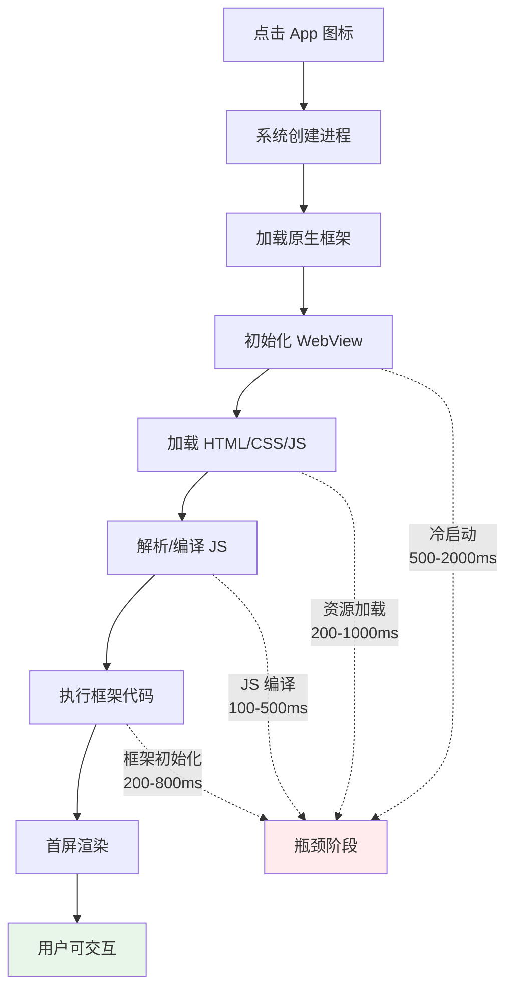
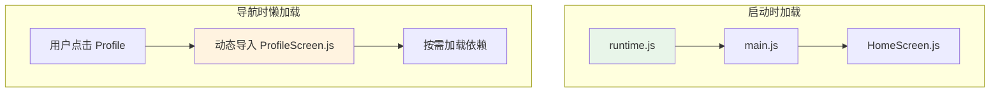
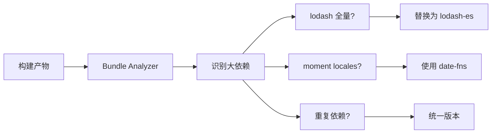
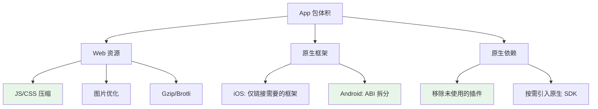
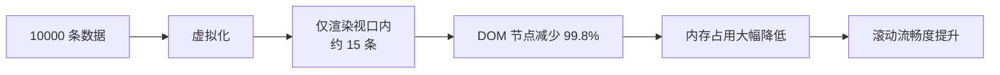
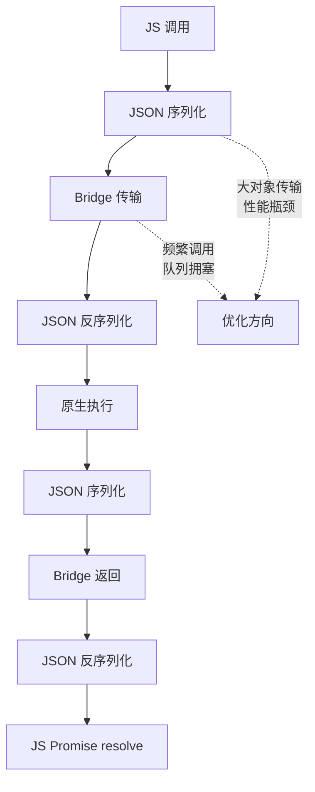
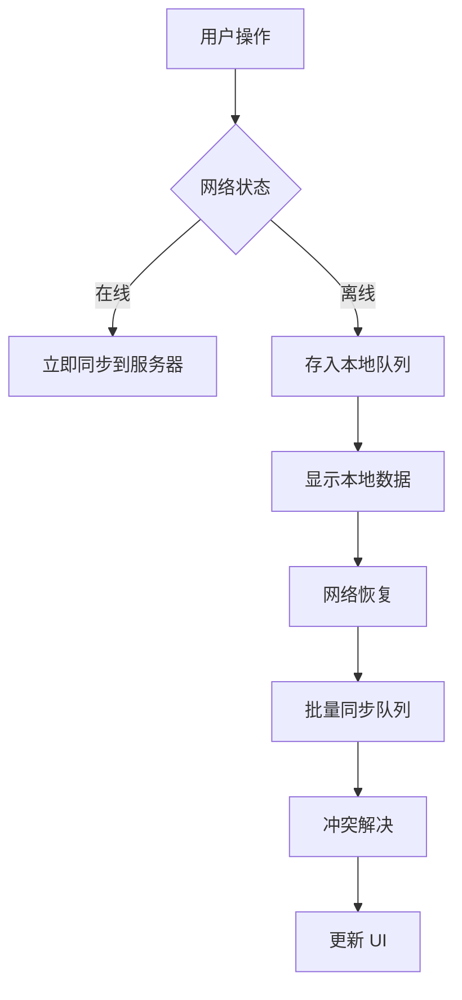

# 05 - 移动端性能优化

> 移动端设备的硬件资源、网络环境和电池续航相比桌面端有着显著差异。Hybrid App 和原生应用都需要在启动速度、内存占用、渲染流畅度等方面进行深度优化。本章从 Web 层和原生层两个维度，系统性地分析移动端性能优化策略。

---

## 1. 启动时间优化

### 1.1 启动流程分析



### 1.2 WebView 启动优化

```swift
// iOS: WKWebView 预加载与池化
class WebViewPool {
    private var pool: [WKWebView] = []
    private let maxSize = 3

    func warmUp() {
        // 提前创建并加载空白页，减少首次创建时间
        let config = WKWebViewConfiguration()
        config.allowsInlineMediaPlayback = true
        config.mediaTypesRequiringUserActionForPlayback = []

        let webView = WKWebView(frame: .zero, configuration: config)
        webView.load(URLRequest(url: URL(string: "about:blank")!))
        pool.append(webView)
    }

    func dequeue() -> WKWebView {
        return pool.popLast() ?? createNewWebView()
    }
}
```

```kotlin
// Android: WebView 预加载与优化设置
class OptimizedWebView @JvmOverloads constructor(
    context: Context,
    attrs: AttributeSet? = null
) : WebView(context, attrs) {

    init {
        settings.apply {
            // 启用硬件加速渲染
            setRenderPriority(WebSettings.RenderPriority.HIGH)

            // 启用缓存
            cacheMode = WebSettings.LOAD_DEFAULT

            // JavaScript 优化
            javaScriptEnabled = true
            domStorageEnabled = true
            databaseEnabled = true

            // 图片懒加载
            loadsImagesAutomatically = true
            blockNetworkImage = false

            // 启用 viewport meta tag
            useWideViewPort = true
            loadWithOverviewMode = true
        }

        // 硬件加速
        setLayerType(View.LAYER_TYPE_HARDWARE, null)
    }
}
```

### 1.3 资源加载优化

```html
<!-- 1. 关键资源内联 -->
<!DOCTYPE html>
<html>
<head>
  <style>
    /* 首屏关键 CSS 内联，避免渲染阻塞 */
    body { margin: 0; font-family: system-ui; }
    .splash { position: fixed; inset: 0; background: #fff; display: flex; align-items: center; justify-content: center; }
    .spinner { width: 40px; height: 40px; border: 3px solid #e0e0e0; border-top-color: #007bff; border-radius: 50%; animation: spin 1s linear infinite; }
    @keyframes spin { to { transform: rotate(360deg); } }
  </style>

  <!-- 2. 延迟非关键 CSS -->
  <link rel="preload" href="/styles/non-critical.css" as="style" onload="this.onload=null;this.rel='stylesheet'">
  <noscript><link rel="stylesheet" href="/styles/non-critical.css"></noscript>

  <!-- 3. 异步加载 JS -->
  <script type="module" src="/app.mjs"></script>
</head>
<body>
  <!-- 4. 骨架屏，提升感知性能 -->
  <div id="splash" class="splash">
    <div class="spinner"></div>
  </div>
  <div id="app" style="display:none"></div>
</body>
</html>
```

```typescript
// app.mts: 应用启动后移除启动屏
import { App } from '@capacitor/app';
import { SplashScreen } from '@capacitor/splash-screen';

async function bootstrap() {
  const startTime = performance.now();

  // 并行初始化
  await Promise.all([
    initializeDatabase(),
    loadUserSession(),
    prefetchRoutes(),
  ]);

  // 渲染应用
  renderApp();

  // 移除启动屏
  const elapsed = performance.now() - startTime;
  const minSplashDuration = 1500;

  if (elapsed < minSplashDuration) {
    await new Promise(r => setTimeout(r, minSplashDuration - elapsed));
  }

  await SplashScreen.hide({ fadeOutDuration: 300 });
  document.getElementById('splash')?.remove();
}
```

### 1.4 代码分割与懒加载

```typescript
// 路由级代码分割
import { lazy, Suspense } from 'react';
import { createNativeStackNavigator } from '@react-navigation/native-stack';

const HomeScreen = lazy(() => import('./screens/Home'));
const ProfileScreen = lazy(() => import('./screens/Profile'));
const SettingsScreen = lazy(() => import('./screens/Settings'));

const Stack = createNativeStackNavigator();

function AppNavigator() {
  return (
    <Suspense fallback={<NativeSpinner />}>
      <Stack.Navigator>
        <Stack.Screen name="Home" component={HomeScreen} />
        <Stack.Screen name="Profile" component={ProfileScreen} />
        <Stack.Screen name="Settings" component={SettingsScreen} />
      </Stack.Navigator>
    </Suspense>
  );
}
```



---

## 2. 包体积优化

### 2.1 分析与监控

```bash
# Webpack Bundle Analyzer
npm install --save-dev webpack-bundle-analyzer

# Rollup Plugin Visualizer
npm install --save-dev rollup-plugin-visualizer

# Vite 集成
npm install --save-dev rollup-plugin-visualizer
```

```typescript
// vite.config.ts
import { visualizer } from 'rollup-plugin-visualizer';

export default defineConfig({
  plugins: [
    visualizer({
      open: true,
      gzipSize: true,
      brotliSize: true,
      filename: 'stats.html',
    }),
  ],
});
```



### 2.2 依赖优化策略

```typescript
// ❌ 问题：全量导入大型库
import _ from 'lodash';
_.debounce(fn, 300);

// ✅ 方案一：按需导入 ESM 版本
import debounce from 'lodash-es/debounce';
import throttle from 'lodash-es/throttle';

// ✅ 方案二：使用更小的替代库
import { debounce } from 'radash';  // 更轻量的工具库
import { format } from 'date-fns';   // 按需导入，无 locale 冗余

// ✅ 方案三：tree-shaking 友好的导入
import { debounce, throttle } from 'es-toolkit';  // tree-shaking 优化的 lodash 替代
```

```json
// package.json
{
  "dependencies": {
    "lodash-es": "^4.17.21",
    "date-fns": "^3.6.0"
  },
  "sideEffects": false
}
```

### 2.3 图片与资源优化

```typescript
// Capacitor 中使用响应式图片
import { Capacitor } from '@capacitor/core';

function getOptimizedImageUrl(originalUrl: string, width: number): string {
  const platform = Capacitor.getPlatform();

  // 根据平台选择图片格式
  const format = platform === 'ios' ? 'heic' : 'webp';

  // 根据设备像素比调整尺寸
  const dpr = window.devicePixelRatio || 1;
  const targetWidth = Math.round(width * dpr);

  return `https://cdn.example.com/image/${originalUrl}?w=${targetWidth}&f=${format}&q=80`;
}
```

```bash
# 构建时图片优化
# 使用 sharp 生成多尺寸图片
npx sharp input.jpg --resize 320 --webp --output img-320.webp
npx sharp input.jpg --resize 640 --webp --output img-640.webp
npx sharp input.jpg --resize 1080 --webp --output img-1080.webp
```

```html
<!-- 响应式图片 -->
<picture>
  <source srcset="img-320.webp 320w, img-640.webp 640w, img-1080.webp 1080w"
          sizes="(max-width: 600px) 100vw, 50vw"
          type="image/webp">
  
</picture>
```

### 2.4 原生层包体积控制



```gradle
// Android: ABI 拆分，减少 APK 体积
android {
    splits {
        abi {
            enable true
            reset()
            include 'arm64-v8a', 'armeabi-v7a'
            universalApk false
        }
    }
}
```

```swift
// iOS: 剥离不需要的架构
// Build Settings > Architectures
// 仅保留 arm64（iOS 11+）
```

---

## 3. 内存管理优化

### 3.1 WebView 内存管理

```typescript
// 及时释放大对象
class ImageCache {
  private cache = new Map<string, string>();
  private maxSize = 50;  // 最多缓存 50 张图片

  set(key: string, value: string) {
    if (this.cache.size >= this.maxSize) {
      // LRU 淘汰策略
      const firstKey = this.cache.keys().next().value;
      this.cache.delete(firstKey);

      // 通知原生层释放对应的 native 图片资源
      this.notifyNativeRelease(firstKey);
    }
    this.cache.set(key, value);
  }

  private notifyNativeRelease(key: string) {
    if (Capacitor.isNativePlatform()) {
      NativeImageCache.release({ key });
    }
  }

  clear() {
    this.cache.clear();
    // 建议调用原生 GC 提示
    if ('gc' in window) {
      (window as any).gc();
    }
  }
}
```

### 3.2 列表虚拟化

```tsx
// React Native FlatList 已经是虚拟化的
// 对于 WebView 中的长列表，使用虚拟滚动
import { Virtuoso } from 'react-virtuoso';

function MessageList({ messages }: { messages: Message[] }) {
  return (
    <Virtuoso
      data={messages}
      itemContent={(index, message) => (
        <MessageItem key={message.id} message={message} />
      )}
      increaseViewportBy={{ top: 200, bottom: 200 }}
      overscan={5}
    />
  );
}
```



### 3.3 事件监听器清理

```typescript
// ❌ 问题：组件卸载时未清理事件
useEffect(() => {
  window.addEventListener('scroll', handleScroll);
  App.addListener('resume', handleResume);
}, []);

// ✅ 正确：清理所有副作用
useEffect(() => {
  const scrollHandler = () => handleScroll();
  window.addEventListener('scroll', scrollHandler);

  let resumeListener: PluginListenerHandle;
  App.addListener('resume', handleResume).then(listener => {
    resumeListener = listener;
  });

  // 清理函数
  return () => {
    window.removeEventListener('scroll', scrollHandler);
    resumeListener?.remove();
  };
}, []);
```

### 3.4 原生层内存优化

```kotlin
// Android: WebView 内存回收
override fun onDestroy() {
    webView?.apply {
        loadUrl("about:blank")
        stopLoading()
        settings.javaScriptEnabled = false
        clearHistory()
        removeAllViews()
        destroy()
    }
    webView = null
    super.onDestroy()
}

// iOS: WKWebView 内存警告处理
override func didReceiveMemoryWarning() {
    super.didReceiveMemoryWarning()
    // 清理缓存
    WKWebsiteDataStore.default().removeData(
        ofTypes: [WKWebsiteDataTypeMemoryCache],
        modifiedSince: Date.distantPast
    ) { }
}
```

---

## 4. 渲染性能优化

### 4.1 避免布局抖动

```typescript
// ❌ 强制同步布局（布局抖动）
function updateLayoutBad() {
  const items = document.querySelectorAll('.item');
  items.forEach(item => {
    const height = item.offsetHeight;  // 读取布局属性
    item.style.height = `${height * 2}px`;  // 写入布局属性
  });
}

// ✅ 批量读取，批量写入
function updateLayoutGood() {
  const items = document.querySelectorAll('.item');

  // 第一步：读取所有布局属性
  const heights = Array.from(items).map(item => ({
    element: item,
    height: item.offsetHeight,
  }));

  // 第二步：使用 requestAnimationFrame 批量写入
  requestAnimationFrame(() => {
    heights.forEach(({ element, height }) => {
      element.style.height = `${height * 2}px`;
    });
  });
}
```

### 4.2 动画性能

```css
/* ✅ 仅触发合成器的属性 */
.animated {
  transform: translate3d(0, 0, 0);  /* GPU 加速 */
  will-change: transform;            /* 提示浏览器优化 */
  transition: transform 0.3s ease;
}

/* ❌ 触发重排的属性（避免动画化） */
.avoid-animating {
  /* width, height, top, left, margin, padding */
  /* 这些属性会触发 Layout → Paint → Composite */
}
```

```typescript
// 使用 requestAnimationFrame 优化滚动监听
function useOptimizedScroll(callback: () => void) {
  useEffect(() => {
    let ticking = false;

    const handleScroll = () => {
      if (!ticking) {
        requestAnimationFrame(() => {
          callback();
          ticking = false;
        });
        ticking = true;
      }
    };

    window.addEventListener('scroll', handleScroll, { passive: true });
    return () => window.removeEventListener('scroll', handleScroll);
  }, [callback]);
}
```

### 4.3 WebView 渲染模式

```kotlin
// Android: 启用硬件加速
webView.setLayerType(View.LAYER_TYPE_HARDWARE, null)

// 或使用 TextureView 模式（某些场景更流畅）
webView.setLayerType(View.LAYER_TYPE_HARDWARE, null)

// iOS: 启用 WKWebView 的异步绘制
let config = WKWebViewConfiguration()
config.preferences.javaScriptEnabled = true
// iOS 15+ 支持异步内容绘制
if #available(iOS 15.0, *) {
    webView.isOpaque = false
}
```

---

## 5. 原生模块通信优化

### 5.1 桥接通信瓶颈



### 5.2 批量通信

```typescript
// ❌ 问题：频繁的单次调用
for (const item of items) {
  await NativeStorage.set({ key: item.id, value: JSON.stringify(item) });
}

// ✅ 方案：批量操作
await NativeStorage.setBulk({
  items: items.map(item => ({
    key: item.id,
    value: JSON.stringify(item),
  })),
});
```

```kotlin
// Android: 批量存储实现
@PluginMethod
fun setBulk(call: PluginCall) {
    val items = call.getArray("items", JSObject())
    val editor = preferences.edit()

    for (i in 0 until items.length()) {
        val item = items.getJSObject(i)
        editor.putString(item.getString("key"), item.getString("value"))
    }

    editor.apply()  // 异步批量提交
    call.resolve()
}
```

### 5.3 大数据传输优化

```typescript
// ❌ 问题：Base64 编码图片传输效率低
const base64Image = await Filesystem.readFile({
  path: 'photo.jpg',
  directory: Directory.Cache,
});
// Base64 体积增加 33%

// ✅ 方案：使用原生 URL/文件路径
const photo = await Camera.getPhoto({
  resultType: CameraResultType.Uri,  // 返回文件 URI，不传输数据
});

// 在 WebView 中直接使用原生路径
displayImage(photo.webPath);  // capacitor://localhost/_capacitor_file_...
```

### 5.4 减少不必要的数据序列化

```typescript
// ❌ 问题：传递大量数据到 JS
const allRecords = await Database.getAllRecords();  // 10000 条记录

// ✅ 方案：分页 + 原生层过滤
interface QueryOptions {
  page: number;
  pageSize: number;
  filters: Record<string, unknown>;
}

async function getRecords(options: QueryOptions) {
  // 原生层执行过滤和分页，只返回需要的数据
  return Database.query({
    ...options,
    // 原生 SQLite 执行 WHERE/LIMIT/OFFSET
  });
}
```

---

## 6. 网络与缓存优化

### 6.1 HTTP 缓存策略

```typescript
// Service Worker 缓存策略
// sw.ts
const CACHE_STRATEGIES = {
  // 静态资源：Cache First
  static: new CacheFirst({
    cacheName: 'static-cache',
    plugins: [
      new ExpirationPlugin({
        maxEntries: 100,
        maxAgeSeconds: 30 * 24 * 60 * 60,  // 30 天
      }),
    ],
  }),

  // API 数据：Network First，离线回退缓存
  api: new NetworkFirst({
    cacheName: 'api-cache',
    plugins: [
      new ExpirationPlugin({
        maxEntries: 200,
        maxAgeSeconds: 7 * 24 * 60 * 60,  // 7 天
      }),
    ],
  }),

  // 图片：Stale While Revalidate
  images: new StaleWhileRevalidate({
    cacheName: 'image-cache',
    plugins: [
      new ExpirationPlugin({
        maxEntries: 500,
        maxAgeSeconds: 90 * 24 * 60 * 60,  // 90 天
      }),
    ],
  }),
};
```

### 6.2 原生 HTTP 客户端

```typescript
// 使用原生 HTTP 客户端替代 WebView fetch（性能更好）
import { CapacitorHttp } from '@capacitor/core';

// CapacitorHttp 绕过 WebView 的网络层
const response = await CapacitorHttp.get({
  url: 'https://api.example.com/data',
  headers: {
    'Authorization': `Bearer ${token}`,
    'Accept': 'application/json',
  },
  // 原生层控制超时和重试
  connectTimeout: 10000,
  readTimeout: 30000,
});
```

### 6.3 离线优先架构



```typescript
// 离线队列管理
class OfflineQueue {
  private db: LocalDatabase;

  async enqueue(operation: Operation) {
    await this.db.operations.add({
      ...operation,
      status: 'pending',
      retryCount: 0,
      createdAt: Date.now(),
    });

    // 尝试立即执行（如果在线）
    this.processQueue();
  }

  private async processQueue() {
    const networkStatus = await Network.getStatus();
    if (!networkStatus.connected) return;

    const pending = await this.db.operations
      .where('status')
      .equals('pending')
      .limit(10)
      .toArray();

    for (const op of pending) {
      try {
        await this.executeOperation(op);
        await this.db.operations.delete(op.id);
      } catch (err) {
        await this.db.operations.update(op.id, {
          retryCount: op.retryCount + 1,
          lastError: err.message,
        });
      }
    }
  }
}
```

---

## 7. 电池与功耗优化

### 7.1 定位服务优化

```typescript
import { Geolocation } from '@capacitor/geolocation';

// ❌ 高功耗：持续高精度定位
Geolocation.watchPosition({ enableHighAccuracy: true }, callback);

// ✅ 优化：按需降低精度
async function getLocation(context: 'navigation' | 'background') {
  const options = {
    navigation: { enableHighAccuracy: true, timeout: 5000 },
    background: { enableHighAccuracy: false, timeout: 30000 },
  };

  return Geolocation.getCurrentPosition(options[context]);
}

// 后台定位最小化更新频率
BackgroundGeolocation.configure({
  distanceFilter: 100,      // 至少移动 100 米才更新
  stopOnStationary: true,   // 静止时停止定位
  desiredAccuracy: 'medium',
});
```

### 7.2 后台任务管理

```typescript
import { App } from '@capacitor/app';

// 应用进入后台时暂停非必要任务
App.addListener('pause', () => {
  // 停止动画
  animationController.stop();

  // 暂停实时数据同步
  syncManager.pause();

  // 释放音频资源
  audioPlayer.release();

  // 降低定时器频率
  timerManager.setInterval('background');
});

App.addListener('resume', () => {
  // 恢复前台操作
  syncManager.resume();
  timerManager.setInterval('foreground');
});
```

---

## 本章小结

移动端性能优化是一个跨层级的系统工程，需要在 Web 层、桥接层和原生层协同优化。

**核心要点**：

1. **启动优化**：骨架屏提升感知性能、关键资源内联、路由懒加载、WebView 预初始化，目标冷启动 < 2s
2. **包体积**：按需导入 ESM 库、图片 WebP/HEIC 格式多尺寸适配、Android ABI 拆分、iOS 仅保留 arm64
3. **内存管理**：长列表必须虚拟化、图片缓存 LRU 淘汰、组件卸载时清理事件监听器和原生回调、WebView 销毁时彻底释放资源
4. **渲染性能**：避免布局抖动（读写分离）、仅动画化 transform/opacity、使用被动事件监听器、启用硬件加速
5. **原生通信**：批量操作减少 Bridge 往返、大数据使用 URI 而非 Base64、原生层执行过滤减少序列化开销
6. **网络缓存**：Service Worker 分层缓存策略、CapacitorHttp 原生网络请求、离线优先的本地队列架构
7. **电池优化**：定位服务按场景调整精度、后台暂停非必要任务、静止时停止位置更新

**性能指标基准**：

| 指标 | 良好 | 优秀 |
|------|------|------|
| 冷启动时间 | < 3s | < 1.5s |
| 首屏渲染 | < 1.5s | < 1s |
| 包体积（iOS）| < 50MB | < 30MB |
| 包体积（Android）| < 30MB | < 20MB |
| 内存峰值 | < 200MB | < 150MB |
| 列表滚动 FPS | > 50 | 60 |

---

## 参考资源

- [Capacitor Performance Best Practices](https://capacitorjs.com/docs/guides/performance)
- [Web Vitals for Mobile](https://web.dev/vitals/)
- [React Native Performance](https://reactnative.dev/docs/performance)
- [Chrome DevTools Performance](https://developer.chrome.com/docs/devtools/performance/)
- [iOS Performance Tips](https://developer.apple.com/documentation/xcode/improving-your-app-s-performance)
- [Android Performance Patterns](https://developer.android.com/topic/performance)
- [WebView Best Practices](https://developer.chrome.com/docs/multidevice/webview/)
- [Service Worker Caching Strategies](https://developer.chrome.com/docs/workbox/caching-strategies-overview/)
- [Lighthouse Performance Scoring](https://developer.chrome.com/docs/lighthouse/performance/performance-scoring/)
- [Radash Documentation](https://radash-docs.vercel.app/)
