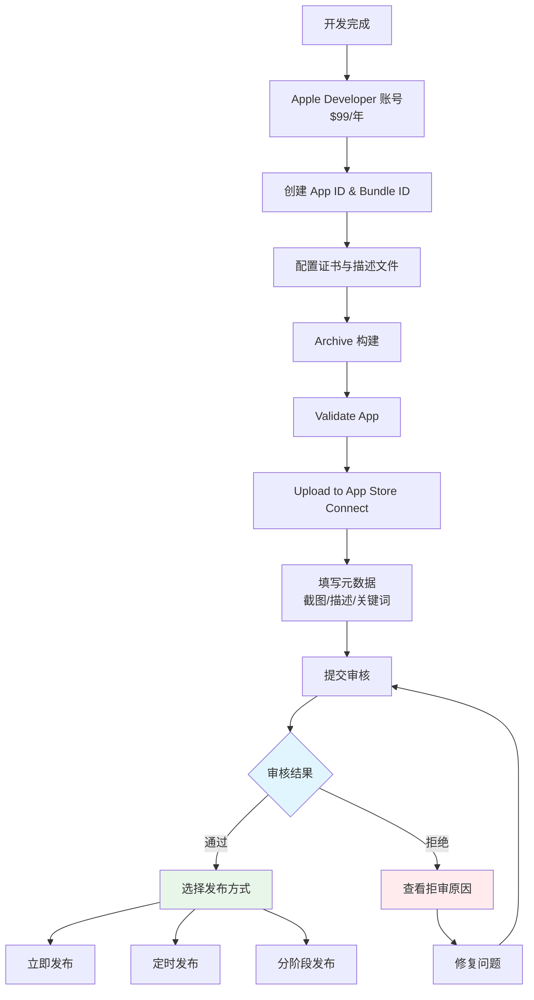
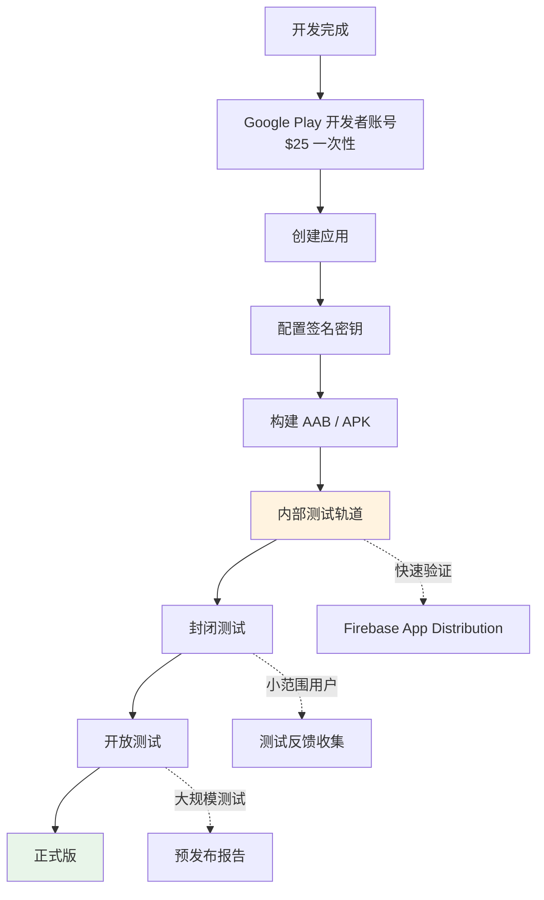
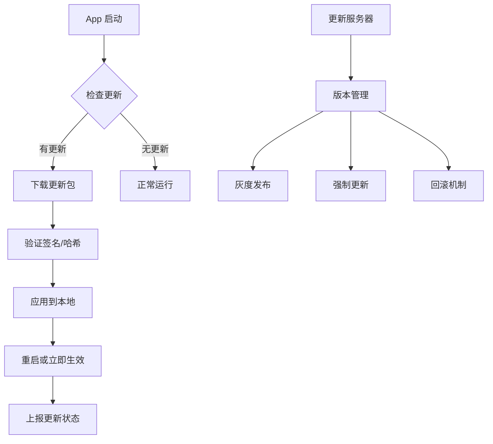
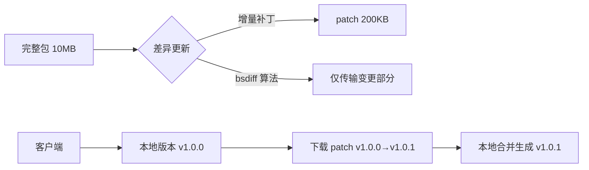
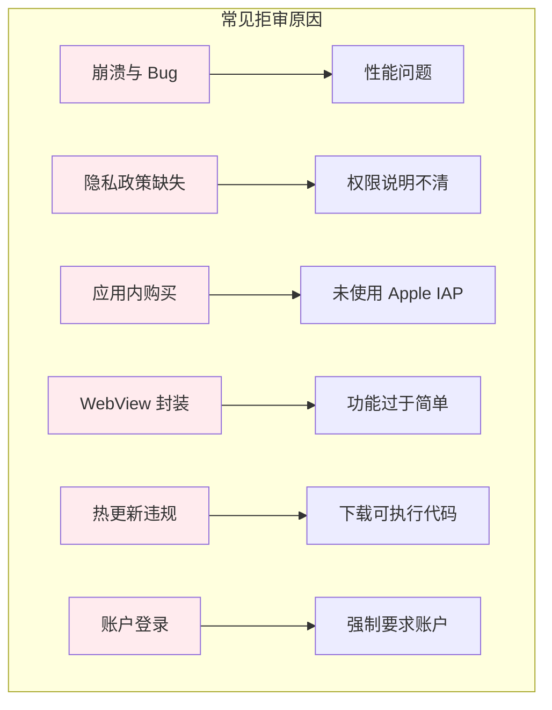
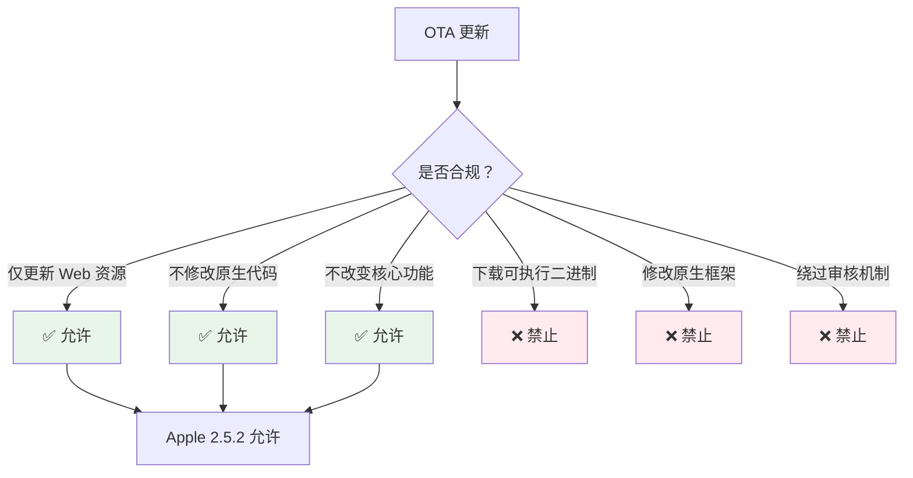
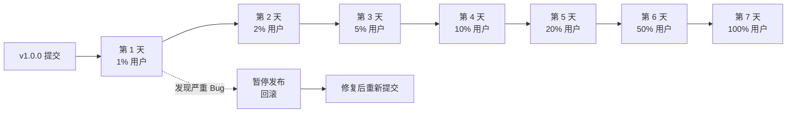

# 06 - 部署策略

> 移动应用的部署远比 Web 应用复杂，涉及应用商店审核、版本管理、热更新合规性、证书配置等多个环节。本章系统梳理 iOS / Android 的发布流程、OTA 更新方案、CodePush 退役后的替代选择，以及商店审核的避坑指南。

---

## 1. 应用商店发布流程

### 1.1 iOS App Store 发布流程



**证书与描述文件配置**：

```mermaid
graph TB
    subgraph "iOS 签名体系"
        A[Apple Developer Account] --> B[Certificate]
        B --> C[Development Cert]
        B --> D[Distribution Cert]
        D --> E[App Store]
        D --> F[Ad Hoc]
        D --> G[Enterprise]

        H[App ID] --> I[Explicit App ID]<br/>com.example.app
        H --> J[Wildcard App ID]<br/>com.example.*

        K[Provisioning Profile] --> L[Development Profile]
        K --> M[Distribution Profile]
        M --> N[App Store Profile]
        M --> O[Ad Hoc Profile]
    end

    C --> L
    E --> N
    F --> O
    I --> K
```

```bash
# 使用 fastlane 自动化发布流程
# Gemfile
gem "fastlane"

# fastlane/Fastfile
platform :ios do
  desc "Build and upload to App Store"
  lane :release do
    # 增加构建号
    increment_build_number(xcodeproj: "App.xcodeproj")

    # 构建 Archive
    build_app(
      scheme: "App",
      export_method: "app-store",
      export_options: {
        provisioningProfiles: {
          "com.example.app" => "App Store Profile"
        }
      }
    )

    # 上传到 App Store Connect
    upload_to_app_store(
      skip_screenshots: true,
      skip_metadata: true,
      submit_for_review: false,
      automatic_release: false,
    )
  end
end
```

### 1.2 Google Play 发布流程



```groovy
// android/app/build.gradle
android {
    // Google Play 要求 AAB 格式
    bundle {
        language {
            enableSplit = true
        }
        density {
            enableSplit = true
        }
        abi {
            enableSplit = true
        }
    }

    signingConfigs {
        release {
            storeFile file("release.keystore")
            storePassword System.getenv("STORE_PASSWORD")
            keyAlias System.getenv("KEY_ALIAS")
            keyPassword System.getenv("KEY_PASSWORD")
        }
    }

    buildTypes {
        release {
            signingConfig signingConfigs.release
            minifyEnabled true
            proguardFiles getDefaultProguardFile('proguard-android.txt'), 'proguard-rules.pro'
        }
    }
}
```

```bash
# fastlane Android 配置
# fastlane/Fastfile
platform :android do
  desc "Build and deploy to Google Play"
  lane :release do
    gradle(task: "bundleRelease")

    upload_to_play_store(
      track: "production",
      release_status: "draft",
      aab: "./app/build/outputs/bundle/release/app-release.aab",
    )
  end

  desc "Deploy to internal testing"
  lane :internal do
    gradle(task: "bundleRelease")
    upload_to_play_store(track: "internal")
  end
end
```

### 1.3 自动化 CI/CD 流水线

```yaml
# .github/workflows/mobile-release.yml
name: Mobile Release

on:
  push:
    tags:
      - 'v*'

jobs:
  build-ios:
    runs-on: macos-latest
    steps:
      - uses: actions/checkout@v4

      - name: Setup Node.js
        uses: actions/setup-node@v4
        with:
          node-version: '20'
          cache: 'npm'

      - name: Install dependencies
        run: |
          npm ci
          npx cap sync ios

      - name: Setup Ruby
        uses: ruby/setup-ruby@v1
        with:
          ruby-version: '3.2'
          bundler-cache: true

      - name: Install CocoaPods
        run: |
          cd ios/App
          pod install

      - name: Build and Upload
        env:
          MATCH_PASSWORD: ${{ secrets.MATCH_PASSWORD }}
          APP_STORE_CONNECT_API_KEY: ${{ secrets.APP_STORE_CONNECT_API_KEY }}
        run: |
          cd ios/App
          fastlane release

  build-android:
    runs-on: ubuntu-latest
    steps:
      - uses: actions/checkout@v4

      - name: Setup Node.js
        uses: actions/setup-node@v4
        with:
          node-version: '20'
          cache: 'npm'

      - name: Install dependencies
        run: |
          npm ci
          npx cap sync android

      - name: Setup JDK
        uses: actions/setup-java@v4
        with:
          java-version: '17'
          distribution: 'temurin'

      - name: Build AAB
        env:
          STORE_PASSWORD: ${{ secrets.STORE_PASSWORD }}
          KEY_PASSWORD: ${{ secrets.KEY_PASSWORD }}
        run: |
          cd android
          ./gradlew bundleRelease

      - name: Upload to Play Store
        run: |
          cd android
          fastlane release
```

---

## 2. OTA 热更新机制

### 2.1 OTA 技术原理



**OTA 的适用场景与限制**：

| 平台 | 允许更新内容 | 禁止更新内容 |
|------|-------------|-------------|
| iOS | Web 资源（HTML/JS/CSS）| 原生代码、Swift/Obj-C |
| Android | Web 资源（HTML/JS/CSS）| 原生代码、Kotlin/Java |
| 合规要求 | 不能显著改变应用功能 | 不能绕过审核机制 |

```typescript
// OTA 更新管理器核心逻辑
interface OTAUpdateManager {
  checkUpdate(): Promise<UpdateInfo | null>;
  downloadUpdate(info: UpdateInfo): Promise<void>;
  applyUpdate(): Promise<void>;
  rollback(): Promise<void>;
}

interface UpdateInfo {
  version: string;
  buildNumber: number;
  downloadUrl: string;
  checksum: string;
  isMandatory: boolean;
  releaseNotes: string;
  minNativeVersion: string;  // 要求最低原生版本
}
```

### 2.2 Capacitor 的 OTA 方案

```typescript
// 使用 @capacitor-community/http 下载更新包
import { Http } from '@capacitor-community/http';
import { Filesystem, Directory, Encoding } from '@capacitor/filesystem';
import { App } from '@capacitor/app';

class CapacitorOTA {
  private readonly UPDATE_SERVER = 'https://updates.example.com';
  private readonly BUNDLE_DIR = 'updates';

  async checkUpdate(): Promise<UpdateInfo | null> {
    const currentVersion = await this.getCurrentVersion();
    const { data } = await Http.get({
      url: `${this.UPDATE_SERVER}/check`,
      params: {
        platform: Capacitor.getPlatform(),
        version: currentVersion,
        appId: 'com.example.app',
      },
    });

    return data.hasUpdate ? data.updateInfo : null;
  }

  async downloadUpdate(info: UpdateInfo): Promise<void> {
    const downloadPath = `${this.BUNDLE_DIR}/update-${info.version}.zip`;

    // 下载更新包
    await Http.downloadFile({
      url: info.downloadUrl,
      filePath: downloadPath,
      fileDirectory: Directory.Data,
    });

    // 验证文件完整性
    const fileData = await Filesystem.readFile({
      path: downloadPath,
      directory: Directory.Data,
    });
    const hash = await this.computeHash(fileData.data as string);

    if (hash !== info.checksum) {
      throw new Error('Update package checksum mismatch');
    }

    // 解压并准备应用
    await this.extractUpdate(downloadPath, info.version);
  }

  async applyUpdate(): Promise<void> {
    // Capacitor 支持设置服务器 URL
    // 将 WebView 的加载路径指向更新后的目录
    await this.setBundlePath(`${this.BUNDLE_DIR}/current`);

    // 重启应用以加载新包
    if (Capacitor.isNativePlatform()) {
      await App.relaunch();
    }
  }

  private async setBundlePath(path: string): Promise<void> {
    // iOS: 设置 CAPBridgeViewController 的 server URL
    // Android: 配置 WebView 加载本地文件路径
    await NativeBridge.setServerBasePath({ path });
  }
}
```

### 2.3 差异更新（Delta Update）



```typescript
// 差异更新实现
import * as diff from 'diff-match-patch';

class DeltaUpdater {
  async applyDelta(baseVersion: string, deltaUrl: string): Promise<void> {
    // 1. 读取本地基础版本文件
    const baseFiles = await this.readBundleFiles(baseVersion);

    // 2. 下载差异包
    const delta = await this.downloadDelta(deltaUrl);

    // 3. 逐个文件应用补丁
    for (const [filePath, patch] of Object.entries(delta.patches)) {
      const baseContent = baseFiles[filePath];
      const patchedContent = this.applyPatch(baseContent, patch);
      await this.writeFile(filePath, patchedContent);
    }

    // 4. 处理新增/删除的文件
    for (const newFile of delta.newFiles) {
      await this.writeFile(newFile.path, newFile.content);
    }
    for (const deletedFile of delta.deletedFiles) {
      await this.deleteFile(deletedFile);
    }
  }

  private applyPatch(original: string, patch: string): string {
    const dmp = new diff.diff_match_patch();
    const patches = dmp.patch_fromText(patch);
    const [result] = dmp.patch_apply(patches, original);
    return result;
  }
}
```

---

## 3. CodePush 替代方案

### 3.1 CodePush 退役背景

Microsoft App Center 的 CodePush 服务已于 2024 年逐步退役。对于依赖 CodePush 的 React Native 和 Cordova 项目，需要迁移到替代方案。

```mermaid
graph LR
    A[CodePush 退役] --> B[自建 OTA 服务]
    A --> C[Capacitor Live Update]
    A --> D[Expo Updates]
    A --> E[第三方商业方案]

    B --> B1[Capacitor]<br/>自定义实现
    C --> C1[Ionic Appflow]<br/>付费服务
    D --> D1[Expo 生态]<br/>EAS Update
    E --> E1[Sparkle]<br/>[AppSpector]
```

### 3.2 Ionic Appflow Live Update

```bash
# 安装 Appflow SDK
npm install @ionic/appflow

# capacitor.config.ts
import { CapacitorConfig } from '@capacitor/cli';

const config: CapacitorConfig = {
  plugins: {
    LiveUpdates: {
      appId: 'your-app-id',
      channel: 'production',
      autoUpdateMethod: 'background',
      maxVersions: 3,
    }
  }
};
```

```typescript
// 手动控制更新
import { LiveUpdate } from '@capacitor/live-updates';

async function checkLiveUpdate() {
  const result = await LiveUpdate.sync();

  if (result.activeApplicationPathChanged) {
    // 新版本已下载，建议用户重启
    showRestartDialog();
  }
}

// 配置通道策略
await LiveUpdate.setConfig({
  channel: 'staging',  // 可按用户分组切换通道
});
```

### 3.3 Expo EAS Update

```bash
# 初始化 Expo 项目
npx create-expo-app my-app

# 配置 EAS
npx eas-cli build:configure

# 发布 OTA 更新
npx eas update --branch production --message "Fix login bug"
```

```typescript
// App.tsx
import * as Updates from 'expo-updates';

function App() {
  useEffect(() => {
    async function checkUpdates() {
      try {
        const update = await Updates.checkForUpdateAsync();
        if (update.isAvailable) {
          await Updates.fetchUpdateAsync();
          // 下次启动时自动应用
          // 或立即重启：
          await Updates.reloadAsync();
        }
      } catch (e) {
        console.error('Update check failed:', e);
      }
    }

    if (!__DEV__) {
      checkUpdates();
    }
  }, []);

  return <MainApp />;
}
```

### 3.4 自建 OTA 服务

```typescript
// server/src/update/update.controller.ts
import { Controller, Get, Query } from '@nestjs/common';

@Controller('api/updates')
export class UpdateController {
  constructor(private updateService: UpdateService) {}

  @Get('check')
  async checkUpdate(
    @Query('platform') platform: 'ios' | 'android',
    @Query('version') version: string,
    @Query('buildNumber') buildNumber: number,
    @Query('channel') channel: string = 'production',
  ) {
    const update = await this.updateService.findApplicableUpdate({
      platform,
      currentVersion: version,
      currentBuildNumber: buildNumber,
      channel,
    });

    if (!update) {
      return { hasUpdate: false };
    }

    return {
      hasUpdate: true,
      updateInfo: {
        version: update.version,
        buildNumber: update.buildNumber,
        downloadUrl: update.getDownloadUrl(),
        checksum: update.checksum,
        isMandatory: update.isMandatory,
        releaseNotes: update.releaseNotes,
        minNativeVersion: update.minNativeVersion,
      },
    };
  }
}
```

```typescript
// server/src/update/update.service.ts
import { Injectable } from '@nestjs/common';
import { InjectRepository } from '@nestjs/typeorm';
import { Repository, LessThan } from 'typeorm';

@Injectable()
export class UpdateService {
  constructor(
    @InjectRepository(AppUpdate)
    private updateRepo: Repository<AppUpdate>,
  ) {}

  async findApplicableUpdate(params: CheckUpdateDto): Promise<AppUpdate | null> {
    // 1. 检查最低原生版本要求
    const minNativeBuild = this.parseMinNativeVersion(params.currentBuildNumber);

    // 2. 查找该渠道下、比当前版本新的更新
    const updates = await this.updateRepo.find({
      where: {
        platform: params.platform,
        channel: params.channel,
        buildNumber: LessThan(params.currentBuildNumber),  // 原生版本兼容
        versionBuild: MoreThan(params.currentBuildNumber),  // Web 版本更新
        isActive: true,
      },
      order: { versionBuild: 'DESC' },
      take: 1,
    });

    return updates[0] || null;
  }

  async createUpdate(dto: CreateUpdateDto): Promise<AppUpdate> {
    const update = this.updateRepo.create({
      ...dto,
      checksum: await this.computeChecksum(dto.bundlePath),
    });

    return this.updateRepo.save(update);
  }

  // 灰度发布：按用户 ID 哈希决定是否命中
  async isUserInRollout(userId: string, rolloutPercentage: number): Promise<boolean> {
    const hash = this.hashUserId(userId);
    return (hash % 100) < rolloutPercentage;
  }
}
```

---

## 4. 商店审核要点

### 4.1 App Store 审核指南关键项



**关键合规要点**：

| 规则 | 说明 | 解决方案 |
|------|------|----------|
| 2.3.1 性能 | 不能崩溃、不能有明显 Bug | 充分测试，使用 TestFlight |
| 2.3.10 内容 | 不能包含占位符内容 | 移除所有 lorem ipsum |
| 3.1.1 内购 | 数字内容必须使用 Apple IAP | 接入 StoreKit |
| 4.0 设计 | 不能是简陋的 WebView 包装 | 提供原生级体验 |
| 4.2 最小功能 | 必须提供有用的功能 | 避免纯网站 wrapper |
| 5.1.1 隐私 | 必须提供隐私政策链接 | 在 App Store Connect 配置 |
| 5.1.2 数据使用 | 必须说明数据用途 | Info.plist 配置描述字符串 |

### 4.2 Google Play 审核要点

```xml
<!-- Android 权限声明最佳实践 -->
<manifest>
    <!-- 运行时权限（需要弹窗申请） -->
    <uses-permission android:name="android.permission.CAMERA" />
    <uses-permission android:name="android.permission.ACCESS_FINE_LOCATION" />

    <!-- 声明硬件特性 -->
    <uses-feature android:name="android.hardware.camera" android:required="false" />

    <!-- 数据安全表单声明 -->
    <!-- Google Play Console > App content > Data safety -->
</manifest>
```

**Google Play 数据安全表单**：

```markdown
## 数据收集声明示例

- **位置数据**：粗略位置、精确位置
  - 用途：提供基于位置的服务
  - 是否共享：否
  - 是否加密传输：是
  - 是否可选：是

- **个人资料**：姓名、邮箱
  - 用途：账户管理
  - 是否共享：否
  - 是否加密传输：是
  - 是否可选：否（核心功能需要）
```

### 4.3 OTA 合规性策略



**Apple Guideline 2.5.2**：
> Apps should be self-contained in their bundles, and may not read or write data outside the container directory, except for data stored in the app's dedicated container or as otherwise permitted.

**合规实践**：

```typescript
// 1. 仅更新 HTML/JS/CSS 资源
// 2. 使用应用内置的解释器执行（JavaScriptCore / WebView）
// 3. 不下载原生二进制或框架
// 4. 提供回滚机制

class CompliantOTA {
  async applyUpdate(): Promise<void> {
    // 更新前备份当前版本
    await this.backupCurrentVersion();

    try {
      await this.applyNewBundle();
    } catch (error) {
      // 失败时自动回滚
      await this.rollback();
      throw error;
    }
  }
}
```

---

## 5. 发布策略与版本管理

### 5.1 分阶段发布（Phased Release）



### 5.2 版本号策略

```typescript
// 语义化版本 + 构建号
interface VersionInfo {
  semanticVersion: string;  // "1.2.3" - 用户可见
  buildNumber: number;      // 12345 - 商店和 OTA 使用
  nativeVersion: string;    // "1.2.0" - 原生层版本
  bundleVersion: string;    // "1.2.3" - Web 层版本
}

// 版本比较
function compareVersions(v1: string, v2: string): number {
  const parts1 = v1.split('.').map(Number);
  const parts2 = v2.split('.').map(Number);

  for (let i = 0; i < Math.max(parts1.length, parts2.length); i++) {
    const a = parts1[i] || 0;
    const b = parts2[i] || 0;
    if (a > b) return 1;
    if (a < b) return -1;
  }
  return 0;
}
```

### 5.3 多环境管理

```yaml
# environments.yml
environments:
  development:
    apiUrl: https://api-dev.example.com
    updateChannel: dev
    analyticsEnabled: false
    crashReportingEnabled: false

  staging:
    apiUrl: https://api-staging.example.com
    updateChannel: staging
    analyticsEnabled: true
    crashReportingEnabled: true

  production:
    apiUrl: https://api.example.com
    updateChannel: production
    analyticsEnabled: true
    crashReportingEnabled: true
```

```bash
# 使用环境变量构建不同版本
ENV=production npm run build
npx cap sync
# 构建生产包

ENV=staging npm run build
npx cap sync
# 构建测试包
```

---

## 6. 监控与回滚

### 6.1 发布监控指标

```typescript
// 关键监控指标
interface ReleaseMetrics {
  //  adoption rate
  adoptionRate: number;        // 24h 内更新到最新版的用户比例

  // 稳定性
  crashRate: number;           // 崩溃率（每千次会话）
  crashFreeUsers: number;      // 无崩溃用户比例

  // 性能
  coldStartTime: number;       // 冷启动平均时间
  jsBundleLoadTime: number;    // JS 包加载时间

  // 业务
  sessionDuration: number;     // 平均会话时长
  retentionRate: number;       // 次日留存率
}
```

### 6.2 自动回滚机制

```typescript
class ReleaseMonitor {
  private readonly CRASH_THRESHOLD = 0.01;  // 1% 崩溃率阈值

  async evaluateRelease(version: string): Promise<void> {
    const metrics = await this.collectMetrics(version, { hours: 2 });

    if (metrics.crashRate > this.CRASH_THRESHOLD) {
      await this.triggerRollback(version);

      // 发送告警
      await this.sendAlert({
        severity: 'critical',
        message: `Release ${version} crash rate ${metrics.crashRate} exceeds threshold`,
      });
    }
  }

  private async triggerRollback(version: string): Promise<void> {
    // 1. 在更新服务器标记该版本为无效
    await updateService.deactivateVersion(version);

    // 2. 通知已更新的用户回滚
    await pushService.send({
      type: 'ROLLBACK',
      targetVersion: await this.getPreviousStableVersion(),
    });
  }
}
```

---

## 本章小结

移动端部署是一个涉及工程、法务、运营的综合性流程，需要在自动化、合规性和用户体验之间取得平衡。

**核心要点**：

1. **商店发布**：iOS 使用 fastlane + Xcode Archive 自动化；Android 使用 AAB 格式 + Play Console 分层测试轨道（Internal → Closed → Open → Production）
2. **OTA 热更新**：iOS/Android 均允许更新 Web 资源（HTML/JS/CSS），但严禁下载可执行原生代码；差异更新（bsdiff）可将更新包压缩到原始大小的 1-5%
3. **CodePush 替代**：Ionic Appflow（Capacitor 生态）、Expo EAS Update（Expo 生态）、自建 OTA 服务（完全可控）
4. **审核合规**：App Store 注意 2.5.2（自包含）、4.2（最小功能）、5.1（隐私）；Google Play 注意数据安全表单、运行时权限声明、目标 API 级别要求
5. **发布策略**：分阶段发布控制风险、语义化版本 + 构建号双轨管理、多环境配置隔离
6. **监控回滚**：关键指标（崩溃率 < 1%、启动时间 < 2s）、自动回滚机制、灰度发布按用户哈希分发

**推荐工具链**：

- CI/CD：GitHub Actions + fastlane
- OTA：自建服务（完全控制）或 Ionic Appflow（快速上线）
- 监控：Firebase Crashlytics + Sentry
- 分发：TestFlight（iOS 测试）、Firebase App Distribution（双平台）

---

## 参考资源

- [Apple App Store Review Guidelines](https://developer.apple.com/app-store/review/guidelines/)
- [Google Play Developer Policy Center](https://support.google.com/googleplay/android-developer/topic/9858052)
- [fastlane Documentation](https://docs.fastlane.tools/)
- [Capacitor Live Updates](https://ionic.io/docs/appflow/deploy)
- [Expo EAS Update](https://docs.expo.dev/eas-update/introduction/)
- [Firebase App Distribution](https://firebase.google.com/docs/app-distribution)
- [TestFlight Overview](https://developer.apple.com/testflight/)
- [Google Play Console Help](https://support.google.com/googleplay/android-developer/?hl=en#topic=9858052)
- [App Store Connect API](https://developer.apple.com/documentation/appstoreconnectapi)
- [Google Play Developer API](https://developers.google.com/android-publisher)
- [Semantic Versioning](https://semver.org/)
