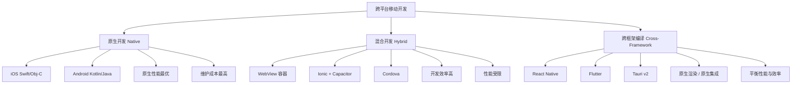
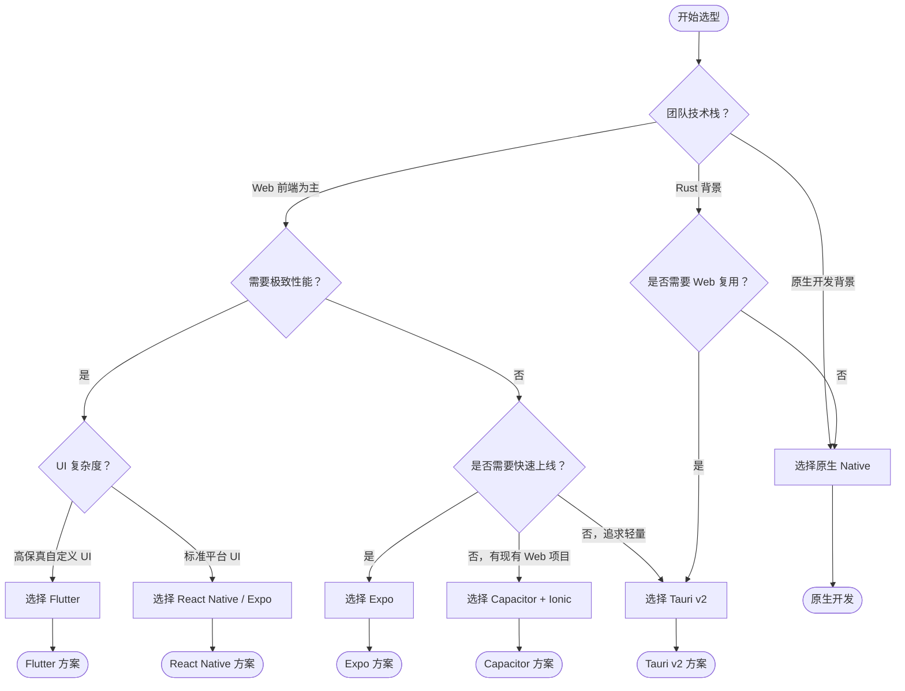

# 跨平台移动开发专题

> 一次编写，多端运行——但每一次选择都有代价。本专题深入剖析现代跨平台移动开发的核心技术、架构演进与工程实践。

## 跨平台方案全景



## 框架选型对比矩阵

| 维度 | React Native | Expo | Tauri v2 | Capacitor + Ionic | Flutter | 原生 Native |
|------|-------------|------|---------|------------------|---------|------------|
| **渲染机制** | 原生组件映射 | 原生组件映射 | WebView + 原生桥接 | WebView + 原生插件 | Skia 自绘 | 完全原生 |
| **开发语言** | JavaScript/TypeScript | JavaScript/TypeScript | Rust + TS/JS | TypeScript + Web | Dart | Swift/Kotlin |
| **热更新/OTA** | CodePush（替代方案） | EAS Update | 自定义机制 | Capacitor Live Updates | 官方不支持 | 无 |
| **包体积（空项目）** | ~8-12 MB | ~10-15 MB | ~3-5 MB | ~5-8 MB | ~4-5 MB | ~1-2 MB |
| **启动时间** | 中等 | 中等 | 较快 | 较快 | 快 | 最快 |
| **原生模块扩展** | TurboModules / 手动桥接 | Expo Modules | Tauri Plugins | Capacitor Plugins | Platform Channels | 原生 SDK |
| **Web 代码复用** | 低 | 中（Expo Web） | 高 | 极高 | 低 | 无 |
| **典型适用场景** | 社交/内容类 App | 快速原型/MVP | 桌面+移动统一 | 企业级 Web 迁移 | 高保真 UI 应用 | 极致性能需求 |
| **生态成熟度** | ⭐⭐⭐⭐⭐ | ⭐⭐⭐⭐⭐ | ⭐⭐⭐ | ⭐⭐⭐⭐ | ⭐⭐⭐⭐⭐ | ⭐⭐⭐⭐⭐ |
| **学习曲线** | 中等 | 低 | 中等（需 Rust） | 低 | 中等 | 高 |

## 选型决策树



## 专题章节导航

| 章节 | 标题 | 核心内容 |
|------|------|---------|
| [01](./01-react-native-new-arch.md) | React Native New Architecture | Fabric、TurboModules、JSI 架构解析 |
| [02](./02-expo-ecosystem.md) | Expo 生态系统 | Expo Router、EAS Build、Expo Modules |
| [03](./03-tauri-v2-mobile.md) | Tauri v2 移动端支持 | Rust 后端、iOS/Android 原生集成 |
| 04 | Capacitor + Ionic | Web-to-Mobile 桥接方案 |
| 05 | 移动端性能优化 | 启动时间、包体积、内存管理 |
| 06 | 部署策略 | App Store、OTA 更新、CodePush 替代方案 |

## 典型项目结构示例

### React Native（New Architecture）项目结构

```text
mobile-rn-app/
├── android/                          # Android 原生工程
│   ├── app/src/main/jni/             # C++ TurboModules
│   └── build.gradle
├── ios/                              # iOS 原生工程
│   ├── Pods/
│   └── AppDelegate.mm
├── src/
│   ├── components/                   # 共享 UI 组件
│   ├── screens/                      # 页面级组件
│   ├── modules/                      # TurboModules JS 接口
│   │   └── NativeCalculator.ts       # codegen 规范文件
│   ├── navigation/                   # 导航配置
│   └── utils/
├── specs/                            # New Architecture 接口规范
│   └── NativeCalculator.spec.js      # TurboModule Spec
├── App.tsx
├── babel.config.js
├── metro.config.js
├── package.json
└── react-native.config.js
```

### Expo 项目结构

```text
mobile-expo-app/
├── app/                              # Expo Router 文件系统路由
│   ├── (tabs)/                       # 路由分组（底部导航）
│   │   ├── _layout.tsx
│   │   ├── index.tsx                 # /tabs 首页
│   │   └── settings.tsx              # /tabs/settings
│   ├── _layout.tsx                   # 根布局
│   └── index.tsx                     # 根路由
├── components/                       # 共享组件
├── constants/
├── hooks/
├── modules/                          # Expo Modules 本地模块
│   └── my-module/
│       ├── android/
│       ├── ios/
│       └── src/index.ts
├── assets/
├── app.json                          # Expo 配置
├── eas.json                          # EAS 构建配置
├── metro.config.js
└── package.json
```

### Tauri v2 移动端项目结构

```text
mobile-tauri-app/
├── src-tauri/                        # Rust 后端
│   ├── src/
│   │   ├── lib.rs                    # Tauri 初始化
│   │   └── commands/                 # 自定义命令
│   ├── capabilities/                 # 权限配置（v2 新特性）
│   ├── gen/                          # 生成的移动端代码
│   ├── Cargo.toml
│   └── tauri.conf.json
├── src/                              # 前端代码（React/Vue/Svelte）
│   ├── App.tsx
│   └── main.tsx
├── index.html
├── vite.config.ts
├── package.json
└── Cargo.lock
```

## 关键趋势与建议

1. **React Native New Architecture** 已逐步成为默认选项（0.73+），旧架构将在未来版本移除，迁移窗口期正在收窄。
2. **Expo** 已成为 React Native 生态的事实标准开发层，EAS 构建服务显著降低了 CI/CD 复杂度。
3. **Tauri v2** 的移动端支持为已有 Web/桌面应用提供了最低成本的移动扩展路径，尤其适合 Rust 技术栈团队。
4. **Capacitor** 是已有 Web 应用（Vue/React/Angular）迁移到移动端的最高效方案，但不适合高性能需求场景。
5. **包体积与启动速度** 仍是跨平台方案的普遍瓶颈，需结合本专题 05 性能优化章节 进行针对性调优。

---

> 📌 **下一步**：根据你的技术栈和性能需求，通过上方决策树确定方向，深入阅读对应章节。
