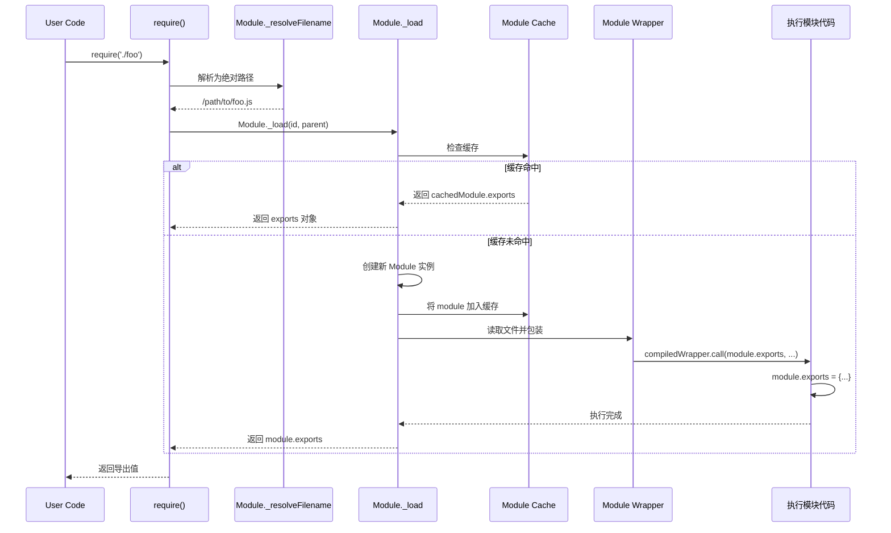
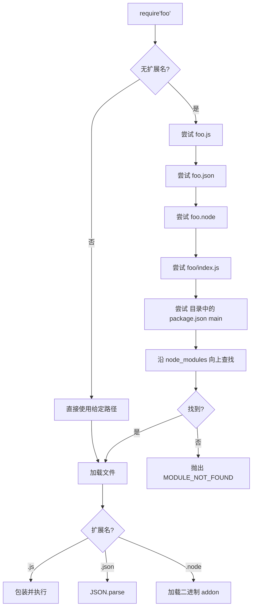

# 02 - CommonJS 内部机制

> CommonJS (CJS) 是 Node.js 的原生模块系统。本章深入解析 `require` 的内部实现、模块包装器、`module` 对象、缓存机制与循环依赖处理。

---

## 1. require 的完整执行流程



### 1.1 伪代码实现

```js
// Node.js Module 系统的简化模型
function require(id) {
  // 1. 解析模块路径
  const filename = Module._resolveFilename(id, this);

  // 2. 检查缓存
  const cachedModule = Module._cache[filename];
  if (cachedModule) {
    return cachedModule.exports;
  }

  // 3. 创建新模块实例
  const module = new Module(filename, this);
  Module._cache[filename] = module;

  // 4. 加载并执行模块
  module.load(filename);

  // 5. 返回导出对象
  return module.exports;
}
```

---

## 2. 模块包装器 (Module Wrapper)

Node.js 在执行模块代码前，会将其包裹在一个函数中。这是 CJS 实现的关键机制。

### 2.1 包装器源码

```js
// Node.js 实际使用的包装器（简化版）
(function(exports, require, module, __filename, __dirname) {
  // ← 用户代码在此处执行
});
```

### 2.2 包装器注入的参数

| 参数 | 说明 | 示例值 |
|------|------|--------|
| `exports` | 指向 `module.exports` 的引用 | 初始为 `{}` |
| `require` | 当前模块的 `require` 函数 | 包含 `.resolve` / `.main` 等属性 |
| `module` | 当前模块实例 | 包含 `id`, `filename`, `loaded` 等 |
| `__filename` | 当前文件的绝对路径 | `/project/src/index.js` |
| `__dirname` | 当前文件所在目录 | `/project/src` |

### 2.3 为什么需要包装器？

```js
// 用户编写的模块代码（foo.js）
const fs = require('fs');
module.exports = { readConfig: () => fs.readFileSync('./config.json') };

// 实际执行的代码（概念上）
(function(exports, require, module, __filename, __dirname) {
  const fs = require('fs');
  module.exports = { readConfig: () => fs.readFileSync('./config.json') };
});
```

包装器实现了以下关键功能：

1. **变量隔离** — 每个模块拥有独立的作用域，不会污染全局
2. **注入工具** — 自动提供 `require`, `module`, `__filename`, `__dirname`
3. **this 绑定** — 模块顶层 `this` 指向 `module.exports`

---

## 3. module 对象详解

### 3.1 module 结构

```js
Module {
  id: '.',                    // 模块标识（主模块为 '.'）
  path: '/project/src',        // 模块所在目录
  exports: {},                 // 导出的对象（核心！）
  filename: '/project/src/index.js',
  loaded: false,               // 是否加载完成
  children: [],                // 子模块列表
  parent: null,                // 父模块引用
  paths: [                     // 模块搜索路径（NODE_PATH）
    '/project/src/node_modules',
    '/project/node_modules',
    '/node_modules'
  ]
}
```

### 3.2 exports 与 module.exports 的关系

```js
// 两者初始指向同一个对象
console.log(module.exports === exports);  // true

// ✅ 方式一：通过 exports 添加属性
exports.foo = 'foo';
exports.bar = function() {};
// 结果：module.exports = { foo: 'foo', bar: [Function] }

// ✅ 方式二：直接替换 module.exports
module.exports = {
  foo: 'foo',
  bar: function() {}
};

// ❌ 常见错误：直接给 exports 赋值会切断引用
exports = { foo: 'foo' };  // 无效！require 返回的是 module.exports
```

```mermaid
flowchart LR
    subgraph 初始状态
        M[module.exports] --- E[exports]
        M --> O1[{}]
        E --> O1
    end

    subgraph exports.foo = 1
        M2[module.exports] --- E2[exports]
        M2 --> O2[{foo: 1}]
        E2 --> O2
    end

    subgraph exports = {} 错误!
        M3[module.exports] --> O3[{foo: 1}]
        E3[exports] --> O4[{}]
    end
```

---

## 4. 模块缓存机制

### 4.1 缓存的行为特征

```js
// counter.js
let count = 0;
module.exports = {
  increment: () => ++count,
  getCount: () => count
};

// main.js
const counter1 = require('./counter.js');
const counter2 = require('./counter.js');

console.log(counter1 === counter2);  // true ✅ 同一个对象

counter1.increment();
console.log(counter2.getCount());  // 1 ✅ 共享状态
```

> **关键特性**：`require` 返回的是**同一个 `module.exports` 对象引用**。多次 `require` 同一模块不会重复执行。

### 4.2 缓存键与路径解析

```js
// 以下三种方式指向同一缓存条目
const a = require('./foo');
const b = require('./foo.js');
const c = require('/absolute/path/to/foo.js');

console.log(a === b && b === c);  // true
```

### 4.3 手动操作缓存

```js
// 删除缓存（热更新、测试隔离）
delete require.cache[require.resolve('./module.js')];

// 清空全部缓存
Object.keys(require.cache).forEach(key => {
  delete require.cache[key];
});

// 查看缓存
console.log(Object.keys(require.cache));
```

### 4.4 缓存的时机问题

```js
// a.js
console.log('a.js 开始执行');
module.exports = { name: 'a' };
console.log('a.js 执行完成');

// b.js
const a = require('./a.js');  // 输出: a.js 开始执行 → a.js 执行完成
console.log(a.name);          // 'a'

// c.js
const a = require('./a.js');  // 无任何输出（直接读缓存）
console.log(a.name);          // 'a'
```

---

## 5. 循环依赖处理

### 5.1 CJS 的循环依赖策略

CommonJS 采用**"执行到 require 时立即返回当前 exports"**的策略处理循环依赖。

```js
// a.js
console.log('a.js: 开始执行');
exports.loaded = false;
const b = require('./b.js');  // ← 进入 b.js 执行
console.log('a.js: b.loaded =', b.loaded);  // true
exports.loaded = true;
console.log('a.js: 执行完成');

// b.js
console.log('b.js: 开始执行');
exports.loaded = false;
const a = require('./a.js');  // ← a.js 已在执行中，返回当前 exports
console.log('b.js: a.loaded =', a.loaded);  // false（a.js 还未执行完）
exports.loaded = true;
console.log('b.js: 执行完成');
```

执行输出：

```
a.js: 开始执行
b.js: 开始执行
b.js: a.loaded = false
b.js: 执行完成
a.js: b.loaded = true
a.js: 执行完成
```

### 5.2 循环依赖的风险模式

```js
// ❌ 危险：依赖未初始化的属性
// a.js
const b = require('./b.js');
module.exports = { value: b.value + 1 };  // NaN，因为 b.value 还未赋值

// b.js
const a = require('./a.js');
module.exports = { value: 10 };  // a.js 执行时，b.exports = {}（空对象）
```

### 5.3 解决方案：延迟访问

```js
// ✅ 安全：通过函数延迟访问
// a.js
const b = require('./b.js');
module.exports = {
  getValue: () => b.value + 1  // 调用时才访问 b.value
};

// b.js
const a = require('./a.js');
module.exports = { value: 10 };

// main.js
const a = require('./a.js');
console.log(a.getValue());  // 11 ✅
```

```js
// ✅ 安全：将初始化逻辑放入函数或类中
// a.js
class ServiceA {
  constructor() {
    this.b = require('./b.js');  // 延迟 require
  }
  doSomething() {
    return this.b.getData();
  }
}
module.exports = { ServiceA };
```

---

## 6. require 的高级特性

### 6.1 require.resolve

```js
// 获取模块的完整路径（不执行模块）
const path = require.resolve('lodash');
console.log(path);  // /project/node_modules/lodash/index.js

// 检查模块是否存在
function moduleExists(name) {
  try {
    require.resolve(name);
    return true;
  } catch {
    return false;
  }
}
```

### 6.2 require.main

```js
// 判断当前模块是否为主模块（直接运行）
if (require.main === module) {
  // 直接运行：node index.js
  main();
} else {
  // 被其他模块引入
  module.exports = { MyClass };
}
```

### 6.3 文件加载规则



---

## 7. CJS 与 ESM 的底层差异对比

| 特性 | CommonJS | ESM |
|------|----------|-----|
| **加载时机** | 运行时同步加载 | 编译时解析，异步加载 |
| **导出机制** | `module.exports` 对象 | 导出绑定 (Live Binding) |
| **导入结果** | 值的拷贝 | 绑定的引用 |
| **模块顶层 this** | `module.exports` | `undefined` |
| **循环依赖** | 返回未完成的 exports 对象 | TDZ（暂时性死区） |
| **动态导入** | 不支持（总是同步） | `import()` 表达式 |
| **浏览器支持** | 需打包转换 | 原生支持 |
| **解析算法** | `node_modules` 递归查找 | URL 解析 + Import Maps |

---

## 参考

- [Node.js Module Source Code](https://github.com/nodejs/node/blob/main/lib/internal/modules/cjs/loader.js)
- [Node.js Modules Documentation](https://nodejs.org/api/modules.html)
- [CommonJS Spec](http://wiki.commonjs.org/wiki/Modules/1.1)
