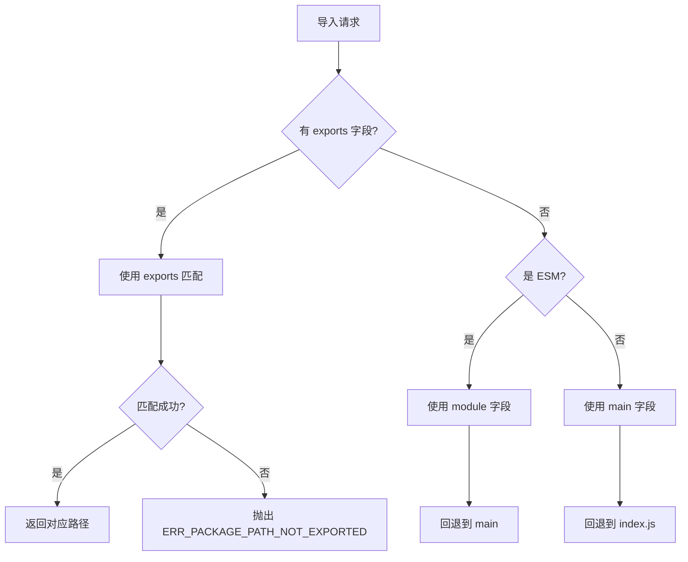
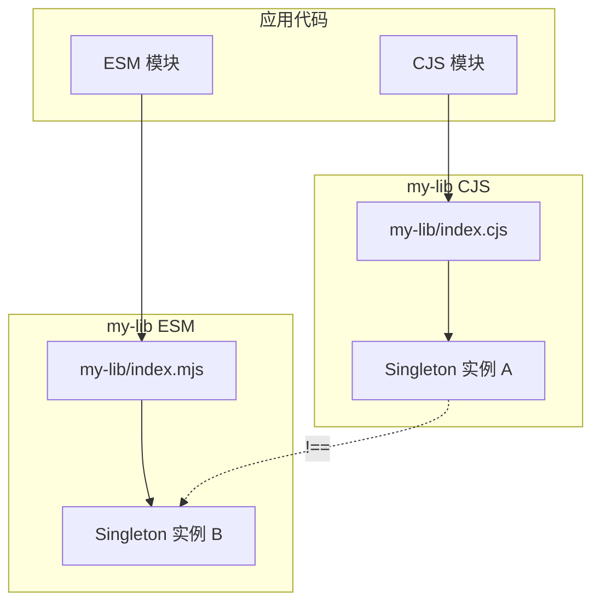

# 03 - ESM/CJS 互操作

> ESM 与 CommonJS 的共存是 JavaScript 生态系统的核心挑战。本章深入解析 `.cjs`/`.mjs` 扩展名、`package.json` 配置、条件导出与 Dual Package Hazard。

---

## 1. 文件扩展名与模块类型

### 1.1 四种扩展名语义

| 扩展名 | 模块类型 | 说明 |
|--------|----------|------|
| `.js` | 由 `package.json` 的 `type` 字段决定 | 默认 CJS |
| `.mjs` | 强制 ESM | 不受 `type` 字段影响 |
| `.cjs` | 强制 CJS | 不受 `type` 字段影响 |
| `.mts` / `.cts` | TypeScript 对应类型 | `.mts` → ESM, `.cts` → CJS |

```
project/
├── package.json      # "type": "module"
├── index.js          # → ESM
├── legacy.js         # → ESM（但可能包含 require）
├── helper.cjs        # → 强制 CJS
└── utils.mjs         # → 强制 ESM
```

### 1.2 跨类型导入规则

```js
// ✅ ESM 可以 import CJS（有限制）
// main.mjs
import cjsModule from './legacy.cjs';
// CJS 的 module.exports 成为 ESM 的 default 导出

// ✅ CJS 可以 require ESM（Node.js 有限支持）
// main.cjs
const esmModule = await import('./utils.mjs');
// 必须使用动态 import()，require() 不支持

// ❌ CJS 不能同步 require ESM
// const esm = require('./utils.mjs');  // Error!
```

---

## 2. package.json 配置详解

### 2.1 完整配置示例

```json
{
  "name": "my-library",
  "version": "2.0.0",
  "description": "Dual-format JavaScript library",

  "type": "module",

  "main": "./dist/index.cjs",
  "module": "./dist/index.mjs",

  "exports": {
    ".": {
      "types": "./dist/index.d.ts",
      "import": "./dist/index.mjs",
      "require": "./dist/index.cjs",
      "default": "./dist/index.mjs"
    },
    "./package.json": "./package.json",
    "./helpers": {
      "types": "./dist/helpers.d.ts",
      "import": "./dist/helpers.mjs",
      "require": "./dist/helpers.cjs"
    }
  },

  "types": "./dist/index.d.ts",
  "typesVersions": {
    "*": {
      "helpers": ["./dist/helpers.d.ts"]
    }
  },

  "sideEffects": false,

  "files": [
    "dist",
    "README.md"
  ]
}
```

### 2.2 字段优先级（Node.js 解析规则）



| 字段 | 优先级 | 适用场景 |
|------|--------|----------|
| `exports` | **最高** | Node.js 12.20+/13.7+，精确控制子路径暴露 |
| `module` | 次高（仅 Bundler） | 告诉打包器 ESM 入口 |
| `main` | 通用回退 | Node.js CJS 与旧版工具 |

---

## 3. 条件导出 (Conditional Exports)

### 3.1 条件匹配优先级

```json
{
  "exports": {
    ".": {
      "types": "./dist/index.d.ts",
      "node": {
        "import": "./dist/index.node.mjs",
        "require": "./dist/index.node.cjs"
      },
      "browser": {
        "import": "./dist/index.browser.mjs",
        "require": "./dist/index.browser.cjs"
      },
      "import": "./dist/index.mjs",
      "require": "./dist/index.cjs",
      "default": "./dist/index.mjs"
    }
  }
}
```

**Node.js 条件匹配顺序**：

1. `"types"` — TypeScript 类型声明（总是优先）
2. `"node"` / `"node-addons"` — Node.js 环境
3. `"import"` / `"require"` — 导入语法
4. `"browser"` / `"worker"` / `"electron"` — 运行时环境
5. `"default"` — 最终回退（必须放在最后）

### 3.2 自定义条件

通过 `--conditions` 标志启用自定义条件：

```bash
node --conditions=custom-env index.js
```

```json
{
  "exports": {
    ".": {
      "custom-env": "./dist/index.custom.mjs",
      "import": "./dist/index.mjs",
      "default": "./dist/index.cjs"
    }
  }
}
```

---

## 4. ESM 导入 CJS 的行为

### 4.1 命名空间导入

```js
// cjs-module.js (CommonJS)
module.exports = {
  foo: 'foo-value',
  bar: function() { return 'bar'; }
};
module.exports.baz = 'baz-value';

// esm-importer.mjs (ESM)
import cjs from './cjs-module.js';
console.log(cjs.foo);     // 'foo-value'
console.log(cjs.bar());   // 'bar'

import * as ns from './cjs-module.js';
console.log(ns.default.foo);  // 'foo-value'
console.log(ns.foo);          // undefined（非严格模式下可能不同）
```

### 4.2 命名导入的局限性

```js
// cjs-named.js
exports.foo = 'foo';
exports.bar = 'bar';

// ❌ Node.js ESM 不支持直接命名导入 CJS
import { foo, bar } from './cjs-named.js';  // SyntaxError

// ✅ 必须使用默认导入或命名空间导入
import cjs from './cjs-named.js';
const { foo, bar } = cjs;

// ✅ 或者使用 Bundler（Webpack/Rollup）时可能支持
```

> **注意**：某些打包器（如 Webpack、Vite）通过静态分析 `exports.xxx` 模式，允许在打包时模拟命名导入，但 Node.js 原生 ESM 不支持。

### 4.3 包装 CJS 以支持命名导出

```js
// wrapper.mjs — 为 CJS 模块提供 ESM 命名导出
export { default } from './cjs-module.cjs';
export const { foo, bar } = (await import('./cjs-module.cjs')).default;

// consumer.mjs
import cjsDefault, { foo, bar } from './wrapper.mjs';
```

---

## 5. CJS 导入 ESM 的行为

### 5.1 必须使用动态 import()

```js
// main.cjs
async function load() {
  // ✅ 动态导入返回 Promise
  const esmModule = await import('./esm-module.mjs');
  console.log(esmModule.default);
  console.log(esmModule.namedExport);
}

load();
```

### 5.2 同步 require 的变通方案

```js
// 如果需要同步加载 ESM，可以创建一个同步包装
const { createRequire } = require('module');
const require = createRequire(import.meta.url);  // ESM 中创建 require

// 但反过来不行：CJS 中无法同步 require ESM
```

---

## 6. Dual Package Hazard（双包风险）

### 6.1 问题描述

当一个库同时提供 ESM 和 CJS 两种格式，且用户代码中**同时混用两种导入方式**时，可能导致同一个包被加载两次，产生两份状态。

```js
// 库 my-lib 提供双格式：index.mjs + index.cjs

// 用户代码中的某个 CJS 模块
const { Singleton } = require('my-lib');
const instance1 = new Singleton();

// 用户代码中的某个 ESM 模块
import { Singleton } from 'my-lib';
const instance2 = new Singleton();

console.log(instance1 === instance2);  // false ❌ 两个不同实例！
```

### 6.2 状态隔离示意图



### 6.3 解决方案

#### 方案一：仅导出纯函数（无状态）

```js
// ✅ 安全：纯函数库
export function add(a, b) {
  return a + b;
}
// 无内部状态，多次加载不影响正确性
```

#### 方案二：使用状态代理

```js
// state.js — 共享状态模块
let state = {};

export function getState() {
  return state;
}

export function setState(key, value) {
  state[key] = value;
}
```

#### 方案三：CJS 入口作为 ESM 的薄包装

```js
// index.cjs — CJS 入口直接 require ESM
module.exports = import('./index.mjs');
```

> ⚠️ 但这种方式会破坏同步 `require` 的语义（返回 Promise）。

#### 方案四：构建时生成真正的双格式（推荐）

使用构建工具生成两个格式，但确保**逻辑完全一致，不依赖模块级别的共享状态**：

```json
{
  "exports": {
    ".": {
      "import": "./dist/index.mjs",
      "require": "./dist/index.cjs"
    }
  }
}
```

---

## 7. 完整项目配置示例

### 7.1 纯 ESM 包

```json
{
  "name": "esm-only-lib",
  "version": "1.0.0",
  "type": "module",
  "exports": {
    ".": {
      "types": "./dist/index.d.ts",
      "default": "./dist/index.js"
    }
  },
  "types": "./dist/index.d.ts",
  "engines": {
    "node": ">=18"
  }
}
```

### 7.2 纯 CJS 包（遗留项目）

```json
{
  "name": "cjs-legacy-lib",
  "version": "1.0.0",
  "main": "./dist/index.js",
  "types": "./dist/index.d.ts"
}
```

### 7.3 双格式包（现代推荐）

```json
{
  "name": "dual-format-lib",
  "version": "2.0.0",
  "type": "module",
  "exports": {
    ".": {
      "types": "./dist/index.d.ts",
      "import": "./dist/index.mjs",
      "require": "./dist/index.cjs",
      "default": "./dist/index.mjs"
    },
    "./submodule": {
      "types": "./dist/submodule.d.ts",
      "import": "./dist/submodule.mjs",
      "require": "./dist/submodule.cjs"
    }
  },
  "types": "./dist/index.d.ts",
  "files": ["dist"],
  "sideEffects": false
}
```

### 7.4 TypeScript 双格式构建配置

```json
// tsconfig.json (ESM)
{
  "compilerOptions": {
    "target": "ES2022",
    "module": "NodeNext",
    "moduleResolution": "NodeNext",
    "declaration": true,
    "outDir": "./dist",
    "strict": true
  },
  "include": ["src/**/*"]
}
```

```bash
# package.json scripts
{
  "scripts": {
    "build:esm": "tsc -p tsconfig.json",
    "build:cjs": "tsc -p tsconfig.cjs.json",
    "build": "npm run build:esm && npm run build:cjs"
  }
}
```

---

## 8. 迁移检查清单

```markdown
## 从 CJS 迁移到 ESM

- [ ] 设置 `"type": "module"` 或使用 `.mjs`
- [ ] 将 `require()` 替换为 `import`
- [ ] 将 `module.exports` 替换为 `export`
- [ ] 将 `__dirname` / `__filename` 替换为 `import.meta.url`
- [ ] 检查依赖的 ESM 兼容性
- [ ] 配置 `exports` 字段支持双格式
- [ ] 更新测试运行器配置 (Jest/Vitest)
- [ ] 更新构建工具配置 (Vite/Webpack)
- [ ] 验证 TypeScript `moduleResolution`
- [ ] 运行完整测试套件
```

---

## 参考

- [Node.js ESM Documentation](https://nodejs.org/api/esm.html)
- [Node.js Packages Documentation](https://nodejs.org/api/packages.html)
- [Dual Package Hazard](https://nodejs.org/api/packages.html#dual-package-hazard)
- [TypeScript Node Next Module Resolution](https://www.typescriptlang.org/docs/handbook/modules/reference.html#node16nodenext)
