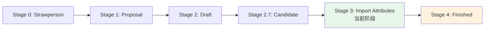
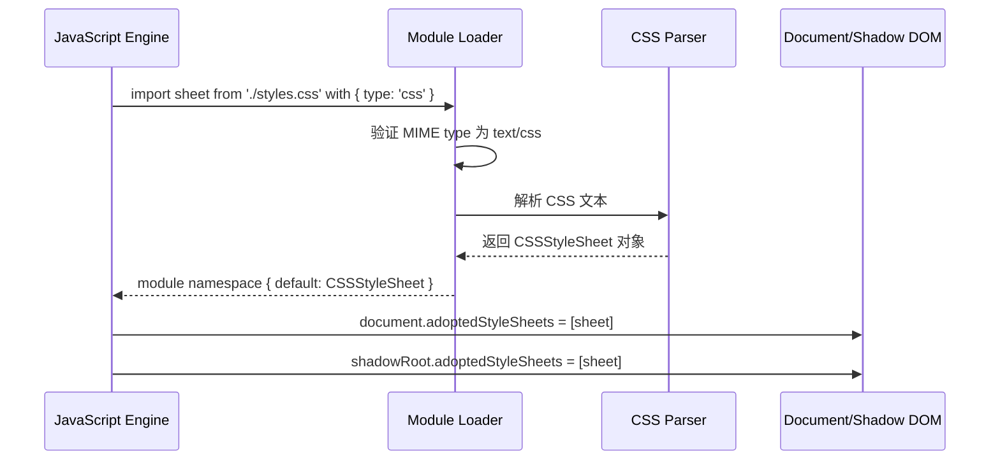
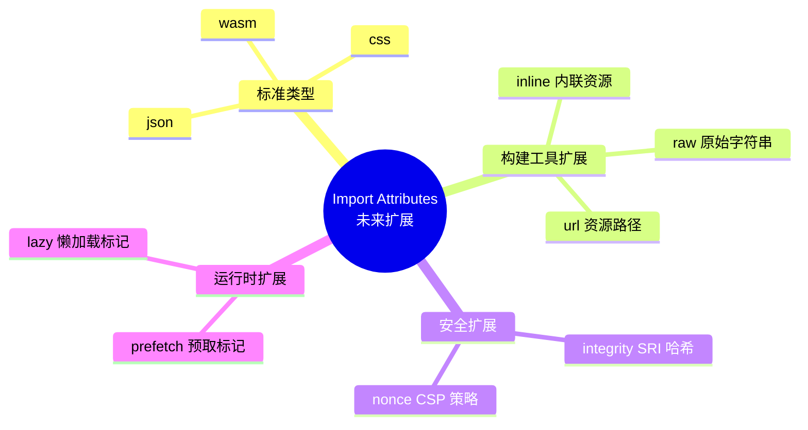

# 04 - Import Attributes/Assertions

> Import Attributes（以前称为 Import Assertions）是 ECMAScript 提案，允许开发者在 `import` 语句中附加元数据，用于指定导入模块的类型（如 JSON、CSS），确保模块加载器以正确的方式解析和处理资源。

---

## 1. 从 Import Assertions 到 Import Attributes

### 1.1 历史演进

| 阶段 | 语法 | 状态 | 说明 |
|------|------|------|------|
| Import Assertions | `assert { type: 'json' }` | 已废弃 | TC39 Stage 3，但被标记为不推荐 |
| Import Attributes | `with { type: 'json' }` | Stage 3 | 使用 `with` 关键字替代 `assert` |

**关键变化**：

- `assert` → `with`：语义从“断言”变为“属性传递”，表示这些属性不仅用于验证，还会传递给模块加载器影响行为
- `with` 块中的属性会在模块加载的整个链路中传递，而 `assert` 仅在验证时使用

```js
// ❌ 旧语法（assert）—— 已废弃，不推荐在新代码中使用
import data from './data.json' assert { type: 'json' };

// ✅ 新语法（with）—— 推荐
import data from './data.json' with { type: 'json' };
```

### 1.2 为什么需要 Import Attributes

在没有 Import Attributes 的时代，JavaScript 无法原生区分不同资源类型的导入方式：

```js
// 问题：引擎如何知道这是一个 JSON 文件而不是 JS 模块？
import unknown from './data.json';

// 安全隐患：如果没有类型约束，攻击者可能利用 MIME type 欺骗
// 让服务器返回 JavaScript 代码，但文件名是 .json
```

Import Attributes 解决了三个核心问题：

1. **安全性**：确保模块按声明的类型解析，防止 MIME type 欺骗
2. **确定性**：明确告知加载器如何处理特定资源
3. **可扩展性**：为未来更多模块类型（CSS、WASM、HTML 等）预留扩展空间

### 1.3 TC39 提案状态



**当前支持状态**（截至 2026）：

- Chrome 123+ / Edge 123+：支持 `with` 语法
- Firefox：实验性支持（flags）
- Safari 17.4+：支持 `with` 语法
- Node.js 20.10+ / 22+：支持 `with` 语法
- TypeScript 5.3+：支持类型推断和语法检查

---

## 2. JSON 模块导入

### 2.1 基本语法

```js
// ✅ 静态导入 JSON 模块
import config from './config.json' with { type: 'json' };
console.log(config.apiBaseUrl);  // 直接访问 JSON 属性

// ✅ 命名空间导入
import * as manifest from './manifest.json' with { type: 'json' };
console.log(manifest.version);

// ✅ 动态导入 JSON 模块
const data = await import('./data.json', { with: { type: 'json' } });
console.log(data.default);
```

### 2.2 JSON 模块的约束与行为

JSON 模块具有特殊的语义约束：

| 特性 | 行为 | 说明 |
|------|------|------|
| Default 导出 | JSON 对象本身 | `import data from './x.json'` 中的 `data` 是整个 JSON |
| 命名导出 | 无 | 不能像 JS 模块那样 `export const` |
| 可变性 | 不可变（Immutable）| 浏览器中 JSON Module 是 frozen 的 |
| 副作用 | 无 | 纯数据，无执行逻辑 |

```js
import config from './config.json' with { type: 'json' };

// ❌ 尝试修改会抛出 TypeError（在严格模式的浏览器中）
config.apiKey = 'hacked';  // TypeError: Cannot assign to read only property

// ✅ 正确做法：深拷贝后使用
const mutableConfig = JSON.parse(JSON.stringify(config));
mutableConfig.apiKey = 'new-key';
```

### 2.3 Node.js 中的 JSON 模块

Node.js 对 JSON 模块有额外的配置要求：

```json
// package.json
{
  "type": "module",
  "imports": {
    "#config": "./config.json"
  }
}
```

```js
// Node.js 支持显式和隐式 JSON 导入
import packageJson from './package.json' with { type: 'json' };

// Node.js 22+ 也支持不带 with 的导入（实验性，依赖 --experimental-json-modules）
// 但生产环境强烈建议使用 with { type: 'json' }

// CommonJS 中的等效写法
const config = require('./config.json');  // CJS 原生支持 JSON
```

**TypeScript 配置**：

```json
// tsconfig.json
{
  "compilerOptions": {
    "module": "NodeNext",
    "moduleResolution": "NodeNext",
    "resolveJsonModule": true  // 传统方式
  }
}
```

```ts
// TypeScript 5.3+ 支持 with 语法并推断类型
type Config = typeof import('./config.json', { with: { type: 'json' } }).default;
// ^ 自动推断为 JSON 的精确类型
```

---

## 3. CSS 模块导入

### 3.1 CSS Module Scripts

CSS 模块导入（CSS Module Scripts）允许将 CSS 文件作为模块导入，生成 `CSSStyleSheet` 对象，可直接用于 Shadow DOM 或 Document：

```js
// ✅ 导入 CSS 为 CSSStyleSheet
import sheet from './styles.css' with { type: 'css' };

// 应用到 Shadow DOM
class MyComponent extends HTMLElement {
  constructor() {
    super();
    const shadow = this.attachShadow({ mode: 'open' });
    shadow.adoptedStyleSheets = [sheet];
    shadow.innerHTML = `<div class="container">Content</div>`;
  }
}
customElements.define('my-component', MyComponent);
```

### 3.2 CSS 模块的工作机制



### 3.3 与 Constructable Stylesheets 的关系

CSS Module Scripts 基于 Constructable Stylesheets API，但提供了声明式的导入方式：

```js
// ❌ 传统方式：手动创建和加载
const sheet = new CSSStyleSheet();
sheet.replaceSync(await fetch('./styles.css').then(r => r.text()));

// ✅ Import Attributes 方式：声明式、缓存友好
import sheet from './styles.css' with { type: 'css' };

// 两者等价，但后者支持模块图谱的静态分析、预加载和去重
```

### 3.4 多样式表组合

```js
// 导入多个 CSS 模块
import baseStyles from './base.css' with { type: 'css' };
import themeStyles from './theme.css' with { type: 'css' };
import componentStyles from './component.css' with { type: 'css' };

class StyledComponent extends HTMLElement {
  constructor() {
    super();
    const shadow = this.attachShadow({ mode: 'open' });
    // 按优先级层叠
    shadow.adoptedStyleSheets = [baseStyles, themeStyles, componentStyles];
  }
}
```

### 3.5 浏览器支持矩阵

| 浏览器 | 支持版本 | 说明 |
|--------|----------|------|
| Chrome | 91+ | 完整支持 |
| Edge | 91+ | 完整支持 |
| Safari | 16.4+ | 完整支持 |
| Firefox | 130+ | 完整支持 |

---

## 4. 自定义 Import Attributes 与扩展

### 4.1 已标准化的 Attribute 类型

```js
// JSON 模块
import data from './data.json' with { type: 'json' };

// CSS 模块
import styles from './styles.css' with { type: 'css' };

// WebAssembly 模块（未来）
import wasmModule from './module.wasm' with { type: 'wasm' };
```

### 4.2 未来可能的扩展



### 4.3 构建工具中的对应概念

虽然原生 Import Attributes 还在标准化过程中，构建工具早已提供了类似功能：

```js
// Vite 中的资源导入
import json from './data.json?json';           // 查询参数方式
import rawText from './file.txt?raw';           // 原始字符串
import inlineSvg from './icon.svg?inline';     // 内联 SVG
import urlPath from './image.png?url';          // 资源 URL

// Webpack 中的资源导入
import css from './styles.css';                // css-loader
import json from './data.json';                // json-loader

// Rollup 中的插件处理
import wasm from './module.wasm';              // @rollup/plugin-wasm
```

**构建工具向原生 Import Attributes 的迁移趋势**：

```mermaid
graph LR
    A[构建工具自定义语法] --> B[标准化 Import Attributes]
    B --> C[浏览器原生支持]
    C --> D[构建工具简化/移除自定义语法]

    A1[Vite ?raw] --> B1[with { type: 'raw' }]
    A2[Webpack loader] --> B2[with { type: 'custom' }]
    A3[Rollup plugin] --> B3[标准属性扩展]

    style B fill:#e8f5e9
```

---

## 5. 动态导入中的 Attributes

### 5.1 import() 的 with 选项

动态导入 `import()` 函数通过第二个参数传递 Import Attributes：

```js
// ✅ 基本语法
const module = await import('./data.json', {
  with: { type: 'json' }
});

// ✅ 条件动态导入
async function loadConfig(env) {
  const configFile = env === 'production'
    ? './config.prod.json'
    : './config.dev.json';

  const config = await import(configFile, {
    with: { type: 'json' }
  });
  return config.default;
}

// ✅ 错误处理
async function safeJsonImport(path) {
  try {
    const data = await import(path, { with: { type: 'json' } });
    return { ok: true, data: data.default };
  } catch (err) {
    if (err.message.includes('Unknown module type')) {
      return { ok: false, error: 'Unsupported module type' };
    }
    return { ok: false, error: err.message };
  }
}
```

### 5.2 动态导入与静态导入的对比

| 特性 | 静态导入 `import x with {}` | 动态导入 `import(x, {with:{}})` |
|------|---------------------------|-------------------------------|
| 语法位置 | 模块顶层 | 任意位置 |
| Tree Shaking | ✅ 支持 | ⚠️ 有限支持 |
| 路径 | 必须是字符串字面量 | 可以是表达式 |
| 预加载 | ✅ 浏览器可预解析 | ❌ 运行时决定 |
| Attributes | `with { type: 'x' }` | `{ with: { type: 'x' } }` |

---

## 6. 类型安全与 TypeScript

### 6.1 TypeScript 5.3+ 的完整支持

```ts
// TypeScript 会自动推断 JSON 导入的类型结构
import config from './config.json' with { type: 'json' };
//    ^? 类型为 { apiBaseUrl: string; apiKey: string; timeout: number }

config.apiBaseUrl;  // ✅ string
config.nonExistent; // ❌ TS 报错：Property 'nonExistent' does not exist
```

### 6.2 声明模块类型

```ts
// types/modules.d.ts
// 为没有类型推断的 JSON 提供显式声明
declare module '*.json' {
  const value: unknown;
  export default value;
}

// 为特定 JSON 文件提供精确类型
declare module '*/package.json' {
  const value: {
    name: string;
    version: string;
    dependencies?: Record<string, string>;
    devDependencies?: Record<string, string>;
  };
  export default value;
}
```

### 6.3 严格 JSON 类型推断

```ts
// 通过辅助类型提取 JSON 结构
type JsonValue = string | number | boolean | null | JsonValue[] | { [key: string]: JsonValue };

// 使用 satisfies 确保导入的 JSON 符合接口
import rawConfig from './config.json' with { type: 'json' };

const config = rawConfig satisfies {
  apiBaseUrl: string;
  retries: number;
  features: string[];
};
```

---

## 7. 与旧版 Import Assertions 的详细对比

### 7.1 语法差异

```js
// ❌ Import Assertions（已废弃）
import json from './data.json' assert { type: 'json' };
const module = await import('./data.json', { assert: { type: 'json' } });

// ✅ Import Attributes（推荐）
import json from './data.json' with { type: 'json' };
const module = await import('./data.json', { with: { type: 'json' } });
```

### 7.2 语义差异

| 维度 | Import Assertions (`assert`) | Import Attributes (`with`) |
|------|---------------------------|--------------------------|
| 核心语义 | **验证**（assertion） | **属性传递**（attribute passing）|
| 失败行为 | 类型不匹配时抛出错误 | 类型不匹配时抛出错误 |
| 属性传递 | 不保证传递给加载器 | 明确传递给模块加载器 |
| 缓存键 | 不考虑 assert | **考虑 with（属性参与缓存键计算）** |
| 未来扩展 | 受限 | 支持更多自定义属性 |

**关键区别：缓存行为**

```mermaid
graph TB
    subgraph Assert["Import Assertions (assert)"]
        A1[import './x' assert { type: 'json' }] --> Cache1[(Module Cache<br/>key = URL)]
        A2[import './x' assert { type: 'css' }] --> Cache1
        note1["相同 URL 共享缓存<br/>即使 assert 不同"]
    end

    subgraph With["Import Attributes (with)"]
        B1[import './x' with { type: 'json' }] --> Cache2[(Module Cache<br/>key = URL + attributes)]
        B2[import './x' with { type: 'css' }] --> Cache3[(Module Cache<br/>key = URL + attributes)]
        note2["不同 with 产生不同缓存条目"]
    end

    style Assert fill:#ffebee
    style With fill:#e8f5e9
```

### 7.3 迁移指南

```bash
# 1. 查找项目中所有 assert 用法
grep -r "assert { type:" src/

# 2. 批量替换（注意测试）
# 静态导入
sed -i 's/assert { type:/with { type:/g' src/**/*.js

# 动态导入
sed -i 's/assert: { type:/with: { type:/g' src/**/*.js
```

```js
// 迁移前
import data from './data.json' assert { type: 'json' };
const mod = await import(url, { assert: { type: 'json' } });

// 迁移后
import data from './data.json' with { type: 'json' };
const mod = await import(url, { with: { type: 'json' } });
```

---

## 8. 构建工具与运行时支持

### 8.1 Vite 支持

```js
// Vite 5+ 支持原生 Import Attributes
import data from './data.json' with { type: 'json' };

// Vite 同时保留了自己的查询参数语法（向后兼容）
import raw from './file.txt?raw';
import url from './image.png?url';
import inline from './component.svg?inline';
```

**Vite 配置**：

```ts
// vite.config.ts
export default {
  build: {
    // 确保 JSON 被正确处理
    assetsInlineLimit: 4096,
  },
  esbuild: {
    // 支持 with 语法
    target: 'es2022',
  }
};
```

### 8.2 Webpack 支持

```js
// webpack.config.js
module.exports = {
  experiments: {
    // 启用 Import Attributes 实验性支持
    importAttributes: true,
    importAttributesPrefix: 'with',  // 或 'assert'
  },
  module: {
    rules: [
      {
        test: /\.json$/,
        type: 'json',
        // 匹配 with { type: 'json' }
        with: { type: 'json' },
      }
    ]
  }
};
```

### 8.3 Rollup 支持

```js
// rollup.config.js
export default {
  // Rollup 4+ 原生支持 import attributes
  // 通过 @rollup/plugin-json 处理 JSON
  plugins: [
    json({
      // 处理 with { type: 'json' }
      assertAttributes: true,
    })
  ]
};
```

### 8.4 Node.js 完整示例

```js
// server.mjs (Node.js 20.10+)
import config from './config.json' with { type: 'json' };
import packageInfo from './package.json' with { type: 'json' };

import { createServer } from 'node:http';

const server = createServer((req, res) => {
  res.writeHead(200, { 'Content-Type': 'application/json' });
  res.end(JSON.stringify({
    app: packageInfo.name,
    version: packageInfo.version,
    env: config.environment,
  }));
});

server.listen(config.port, () => {
  console.log(`Server running on port ${config.port}`);
});
```

---

## 9. 安全最佳实践

### 9.1 防止 MIME Type 欺骗

```mermaid
graph LR
    A[用户请求模块] --> B{Import Attributes}
    B -->|with { type: 'json' }| C[验证 MIME type]
    C -->|text/json 或 application/json| D[安全加载]
    C -->|text/javascript| E[拒绝加载<br/>抛出 TypeError]
    B -->|无 Attributes| F[按扩展名推断]
    F -->|风险较高| G[可能执行恶意代码]

    style E fill:#ffebee
    style D fill:#e8f5e9
```

```js
// ✅ 安全：明确声明类型，防止 MIME 欺骗
import trustedData from '/api/config' with { type: 'json' };

// ⚠️ 风险：依赖服务器返回的 Content-Type
const risky = await fetch('/api/config').then(r => r.json());
```

### 9.2 内容安全策略（CSP）集成

```http
Content-Security-Policy: script-src 'self';
                         require-trusted-types-for 'script';
```

Import Attributes 与 CSP 协同工作：

- `with { type: 'json' }` 确保即使响应被篡改为非 JSON，也不会意外执行
- 与 Trusted Types 结合，防止 DOM XSS

### 9.3 完整性校验（未来 SRI 扩展）

```js
// 提案中：未来可能支持 integrity attribute
import library from './library.js' with {
  type: 'module',
  integrity: 'sha384-abc123...'
};
```

---

## 10. 实际应用场景

### 10.1 配置驱动的应用架构

```js
// config/feature-flags.json
{
  "darkMode": true,
  "betaFeatures": ["ai-assistant", "realtime-collab"],
  "apiEndpoints": {
    "auth": "/api/v2/auth",
    "data": "/api/v2/data"
  }
}
```

```js
// app/bootstrap.js
import featureFlags from './config/feature-flags.json' with { type: 'json' };
import themeStyles from './styles/theme.css' with { type: 'css' };

export function bootstrapApp() {
  // 应用 CSS
  document.adoptedStyleSheets = [themeStyles];

  // 初始化特性开关
  const features = new Map(
    Object.entries(featureFlags).map(([k, v]) => [k, v])
  );

  return { features, styles: themeStyles };
}
```

### 10.2 国际化（i18n）JSON 资源

```js
// 动态加载语言包
async function loadLocale(locale) {
  try {
    const messages = await import(`./locales/${locale}.json`, {
      with: { type: 'json' }
    });
    return messages.default;
  } catch (err) {
    console.warn(`Failed to load locale ${locale}, falling back to en`);
    const fallback = await import('./locales/en.json', {
      with: { type: 'json' }
    });
    return fallback.default;
  }
}
```

### 10.3 设计系统 Token 导入

```js
// design-system/tokens.json
{
  "colors": {
    "primary": "#007bff",
    "secondary": "#6c757d"
  },
  "spacing": {
    "sm": "0.5rem",
    "md": "1rem",
    "lg": "2rem"
  }
}
```

```js
// design-system/styles.js
import tokens from './tokens.json' with { type: 'json' };
import componentCss from './components.css' with { type: 'css' };

export function createThemeSheet(customTokens = {}) {
  const merged = deepMerge(tokens, customTokens);
  const cssText = generateCssVariables(merged);
  const sheet = new CSSStyleSheet();
  sheet.replaceSync(cssText);
  return sheet;
}
```

---

## 本章小结

Import Attributes（`with` 语法）是 JavaScript 模块系统的重要演进，它解决了资源类型安全、模块加载器可扩展性和 MIME type 欺骗防护等核心问题。

**关键要点**：

1. **语法迁移**：使用 `with` 替代已废弃的 `assert`，明确表达属性传递语义
2. **JSON 模块**：原生支持 JSON 导入，TypeScript 可自动推断精确类型，模块内容默认 immutable
3. **CSS 模块**：生成 `CSSStyleSheet` 对象，与 Constructable Stylesheets 和 Shadow DOM 深度集成
4. **缓存语义**：Import Attributes 参与模块缓存键计算，相同 URL 不同属性会产生独立缓存条目
5. **安全价值**：防止 MIME type 欺骗，为 CSP 和未来的 SRI 完整性校验奠定基础
6. **工具链支持**：Chrome/Edge/Safari/Node.js 已支持，TypeScript 5.3+ 完整支持类型推断，Vite/Webpack/Rollup 均有对应支持策略

**何时使用 Import Attributes**：

- 导入 `.json` 配置文件时始终使用 `with { type: 'json' }`
- 导入 `.css` 作为 `CSSStyleSheet` 时使用 `with { type: 'css' }`
- 动态导入需要类型安全时使用 `{ with: { type: '...' } }`
- 构建新项目时避免使用已废弃的 `assert` 语法

---

## 参考资源

- [TC39 Import Attributes Proposal](https://github.com/tc39/proposal-import-attributes)
- [V8 Blog: Import Attributes](https://v8.dev/features/import-attributes)
- [MDN: import](https://developer.mozilla.org/en-US/docs/Web/JavaScript/Reference/Statements/import)
- [Node.js ESM: Import Attributes](https://nodejs.org/api/esm.html#import-attributes)
- [TypeScript 5.3 Release Notes: Import Attributes](https://www.typescriptlang.org/docs/handbook/release-notes/typescript-5-3.html#import-attributes)
- [Chrome Platform Status: Import Attributes](https://chromestatus.com/feature/5315284693852160)
- [WebKit Blog: CSS Module Scripts](https://webkit.org/blog/12445/new-webkit-features-in-safari-16-4/)
- [Can I Use: Import Attributes](https://caniuse.com/mdn-javascript_statements_import_import_attributes)
