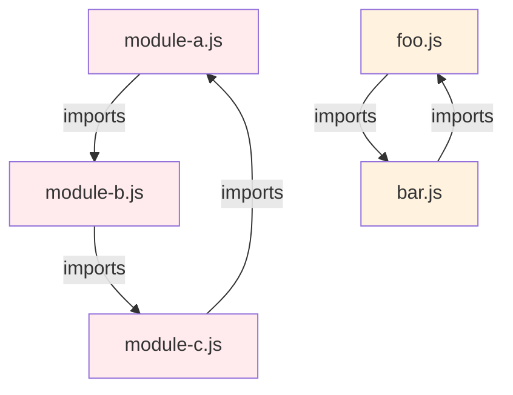
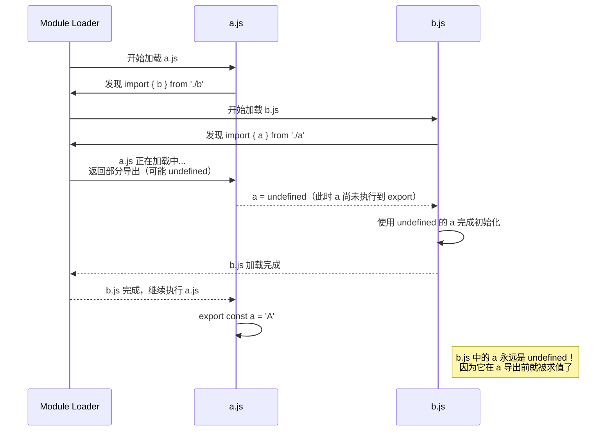
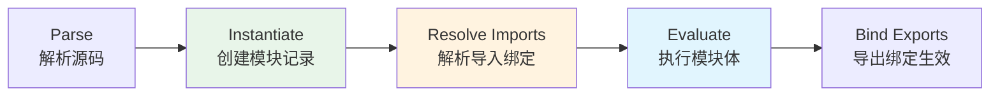
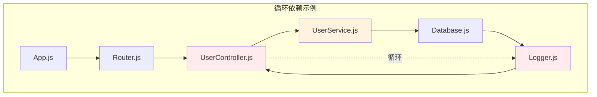
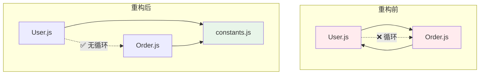
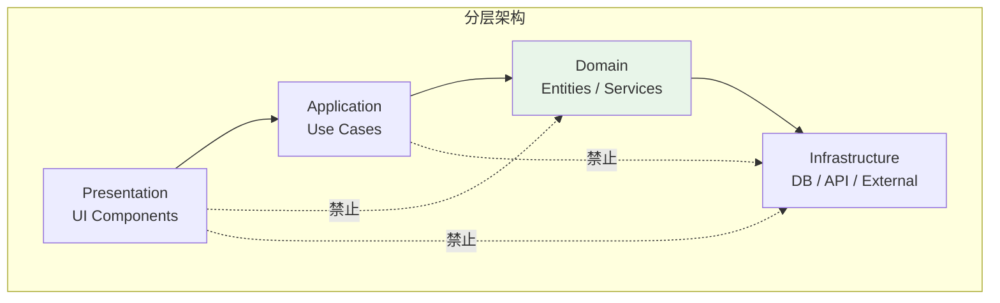
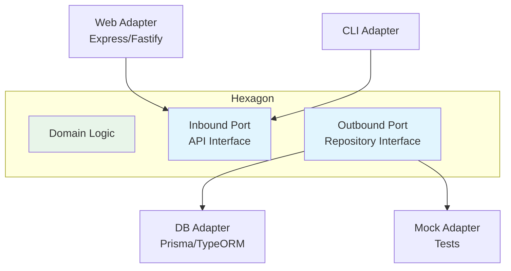

# 05 - 循环依赖

> 循环依赖（Circular Dependencies）是 JavaScript 模块化开发中最隐蔽且最具破坏性的一类问题。本章深入分析循环依赖的形成原因、检测手段、ESM 与 CJS 的处理差异，以及系统性的解决方案和重构策略。

---

## 1. 循环依赖的本质

### 1.1 什么是循环依赖

循环依赖发生在两个或多个模块相互直接或间接依赖对方，形成一个闭环：



**简单循环**（A ↔ B）：

```js
// a.js
import { b } from './b.js';
export const a = 'A';
export function useB() { return b; }

// b.js
import { a } from './a.js';
export const b = 'B';
export function useA() { return a; }
```

**复杂循环**（A → B → C → A）：

```js
// a.js 导入 b，b 导入 c，c 又导入 a
// 形成长度为 3 的依赖环
```

### 1.2 循环依赖为何是问题

循环依赖本身不是错误，但会导致**部分初始化**（Partial Initialization）问题：



---

## 2. ESM 与 CommonJS 的处理差异

### 2.1 CommonJS 的执行模型

CommonJS 的 `require()` 是同步、按序执行的，循环依赖时的行为具有高度可预测性：

```js
// CommonJS: cjs-a.js
const b = require('./cjs-b');
console.log('a.js: b =', b.b);  // 可能是 undefined！

module.exports.a = 'A';
module.exports.useB = () => b.b;
```

```js
// CommonJS: cjs-b.js
const a = require('./cjs-a');
console.log('b.js: a =', a.a);  // undefined！因为 cjs-a 还没执行到 exports

module.exports.b = 'B';
module.exports.useA = () => a.a;  // 闭包捕获 a 对象，后续可以获取到值
```

**CJS 循环依赖的关键行为**：

| 特性 | 行为 |
|------|------|
| 缓存时机 | `require()` 返回时会缓存 `module.exports` 的引用 |
| 部分导出 | 循环中的模块看到的是对方**已执行到当前位置**的 `exports` |
| 后续更新 | 由于返回的是对象引用，后续属性添加对已有引用可见 |
| 安全模式 | 若覆盖整个 `module.exports`，已有引用不会更新 |

```js
// 演示 CJS 的引用更新行为
// cjs-a.js
const b = require('./cjs-b');
setTimeout(() => {
  console.log(b.b);  // ✅ 'B' — 通过引用访问到后续更新的值
}, 0);
module.exports.a = 'A';
```

### 2.2 ESM 的执行模型

ESM 采用不同的执行策略，分为**实例化**（Instantiation）、**求值**（Evaluation）两个阶段：



```js
// ESM: esm-a.js
import { b } from './esm-b.js';
console.log('a.js: b =', b);  // ReferenceError: Cannot access 'b' before initialization

export const a = 'A';
export function useB() { return b; }
```

```js
// ESM: esm-b.js
import { a } from './esm-a.js';
console.log('b.js: a =', a);  // ReferenceError！TDZ 限制

export const b = 'B';
export function useA() { return a; }
```

**ESM 循环依赖的关键行为**：

| 特性 | 行为 |
|------|------|
| TDZ（Temporal Dead Zone） | 循环导入的绑定在对方求值完成前处于 TDZ，访问会抛出 ReferenceError |
| 静态绑定 | import 创建的是到导出变量的**实时绑定**（live binding） |
| 执行顺序 | 深度优先，按依赖图谱拓扑排序后的逆序执行 |
| 部分求值 | 模块在求值中途被阻塞，等待循环依赖完成 |

### 2.3 ESM vs CJS 循环依赖对比

```mermaid
graph TB
    subgraph CJS["CommonJS"]
        C1[require('./b')<br/>同步执行] --> C2[遇到 require('./a')<br/>返回已缓存的 exports 对象]
        C2 --> C3[exports 对象可能为空<br/>或部分填充]
        C3 --> C4[通过对象引用<br/>后续更新可见]
    end

    subgraph ESM["ES Modules"]
        E1[import { b } from './b'<br/>实例化阶段创建绑定] --> E2[求值 a.js 到 import 语句<br/>暂停，开始求值 b.js]
        E2 --> E3[b.js 中 import { a }<br/>a 处于 TDZ]
        E3 --> E4[若提前访问 a → ReferenceError<br/>若通过函数延迟访问 → 安全]
    end

    C4 -.->|两者都允许循环<br/>但行为差异巨大| E4

    style CJS fill:#fff3e0
    style ESM fill:#e8f5e9
```

| 场景 | CommonJS | ESM |
|------|----------|-----|
| 直接访问导入值 | `undefined`（安全但不正确） | `ReferenceError`（严格，提前暴露问题） |
| 延迟访问（函数内） | ✅ 正常工作 | ✅ 正常工作 |
| 重新赋值 exports | ⚠️ 破坏已有引用 | N/A（export 是只读绑定） |
| 诊断难度 | 静默失败，难发现 | 立即报错，易定位 |

---

## 3. 循环依赖的检测方法

### 3.1 静态分析工具

#### Madge

```bash
# 安装
npm install -g madge

# 检测循环依赖
madge --circular src/

# 输出示例：
# ✖ Found 3 circular dependencies!
# 1) src/models/User.js > src/services/AuthService.js > src/models/User.js
# 2) src/utils/helpers.js > src/utils/formatters.js > src/utils/helpers.js
```

```bash
# 生成可视化依赖图
madge src/ --image dependency-graph.svg

# 只显示有循环的文件
madge --circular src/ --json
```

#### ESLint 插件

```js
// eslint.config.js
import importPlugin from 'eslint-plugin-import';

export default [
  {
    plugins: { import: importPlugin },
    rules: {
      // 禁止循环依赖
      'import/no-cycle': ['error', { maxDepth: Infinity }],
      // 禁止自引用
      'import/no-self-import': 'error',
    }
  }
];
```

**`import/no-cycle` 配置详解**：

```js
'import/no-cycle': ['error', {
  maxDepth: 10,        // 检测深度，Infinity 表示不限制
  ignoreExternal: true, // 忽略 node_modules 中的循环
  allowUnsafeDynamicCyclicDependency: false,
}]
```

#### dependency-cruiser

```js
// .dependency-cruiser.js
module.exports = {
  forbidden: [
    {
      name: 'no-circular',
      severity: 'error',
      from: {},
      to: {
        circular: true,
      }
    }
  ],
  options: {
    doNotFollow: {
      path: 'node_modules',
      dependencyTypes: ['npm', 'npm-dev']
    }
  }
};
```

```bash
# 运行检测
dependency-cruise src/ --config .dependency-cruiser.js

# 生成 HTML 报告
dependency-cruise src/ --config .dependency-cruiser.js --output-type html > report.html
```

### 3.2 运行时检测

#### Node.js 调试

```bash
# 使用 --trace-module 查看模块加载顺序（实验性）
node --trace-module-resolution index.js

# 使用 NODE_DEBUG 查看模块加载详情
NODE_DEBUG=module node index.js
```

#### 自定义运行时检测

```js
// utils/detect-cycles.js
const moduleLoadStack = [];
const originalRequire = Module.prototype.require;

Module.prototype.require = function(id) {
  const resolvedPath = Module._resolveFilename(id, this);
  const cycleIndex = moduleLoadStack.indexOf(resolvedPath);

  if (cycleIndex !== -1) {
    const cycle = moduleLoadStack.slice(cycleIndex).concat(resolvedPath);
    console.error('⚠️  Circular dependency detected:');
    console.error('   ' + cycle.join(' →\n   '));
  }

  moduleLoadStack.push(resolvedPath);
  try {
    return originalRequire.apply(this, arguments);
  } finally {
    moduleLoadStack.pop();
  }
};
```

### 3.3 可视化依赖图谱



---

## 4. 循环依赖的解决方案

### 4.1 方案一：延迟求值（函数包装）

将直接使用改为函数延迟访问，这是最简单有效的解决方案：

```js
// ❌ 问题代码：直接访问导致部分初始化
// a.js
import { getB } from './b.js';
export const a = 'A';
export const combined = a + getB;  // b.js 可能还没初始化完成

// ✅ 修正：通过函数延迟求值
// a.js
import { getB } from './b.js';
export const a = 'A';
export function getCombined() {
  return a + getB();  // 调用时才访问 b
}
```

```js
// b.js
import { a } from './a.js';
export const b = 'B';
export function getB() { return b; }
export function getA() { return a; }  // 延迟访问，安全
```

**适用场景**：

- 两个模块需要互相引用对方的常量/配置
- 工具函数之间的交叉引用

### 4.2 方案二：提取公共模块

将循环依赖中的共享逻辑提取到第三个模块：



```js
// ✅ 提取公共常量/类型
// shared/types.js
export const USER_STATUS = {
  ACTIVE: 'active',
  INACTIVE: 'inactive',
};

export const ORDER_STATUS = {
  PENDING: 'pending',
  COMPLETED: 'completed',
};

export interface User {
  id: string;
  status: typeof USER_STATUS[keyof typeof USER_STATUS];
}

export interface Order {
  id: string;
  userId: string;
  status: typeof ORDER_STATUS[keyof typeof ORDER_STATUS];
}
```

```js
// User.js
import { USER_STATUS, ORDER_STATUS } from './shared/types.js';
import { createOrder } from './Order.js';

export class User {
  status = USER_STATUS.ACTIVE;
  createOrder() {
    return createOrder(this.id);
  }
}
```

```js
// Order.js
import { ORDER_STATUS, USER_STATUS } from './shared/types.js';
// ❌ 移除：import { User } from './User.js';

export class Order {
  status = ORDER_STATUS.PENDING;
  // 只存储 userId，不直接依赖 User 类
  constructor(public userId: string) {}
}
```

### 4.3 方案三：依赖注入（DI）

通过外部注入依赖，彻底消除模块间的直接引用：

```js
// ❌ 紧耦合：直接导入
// NotificationService.js
import { EmailService } from './EmailService.js';
import { SMSProvider } from './SMSProvider.js';

export class NotificationService {
  email = new EmailService();
  sms = new SMSProvider();
}

// ✅ 依赖注入
// interfaces.js
export class IEmailService {
  send(to, subject, body) { throw new Error('Abstract'); }
}

export class ISMSProvider {
  send(to, message) { throw new Error('Abstract'); }
}
```

```js
// NotificationService.js
import { IEmailService, ISMSProvider } from './interfaces.js';

export class NotificationService {
  constructor(
    private email: IEmailService,
    private sms: ISMSProvider
  ) {}

  async notify(user, message) {
    await this.email.send(user.email, 'Notification', message);
    await this.sms.send(user.phone, message);
  }
}
```

```js
// main.js（组合根）
import { NotificationService } from './NotificationService.js';
import { EmailService } from './EmailService.js';
import { SMSProvider } from './SMSProvider.js';

const service = new NotificationService(
  new EmailService(),
  new SMSProvider()
);
```

### 4.4 方案四：事件驱动/观察者模式

```js
// event-bus.js
export const eventBus = new EventTarget();

// User.js
import { eventBus } from './event-bus.js';

export class User {
  constructor(public id: string) {}

  deactivate() {
    eventBus.dispatchEvent(new CustomEvent('user:deactivated', {
      detail: { userId: this.id }
    }));
  }
}
```

```js
// Order.js
import { eventBus } from './event-bus.js';

export class OrderManager {
  constructor() {
    eventBus.addEventListener('user:deactivated', (e) => {
      this.cancelPendingOrders(e.detail.userId);
    });
  }

  cancelPendingOrders(userId) {
    // 处理订单取消...
  }
}
```

**优势**：

- User.js 和 Order.js 完全不直接依赖
- 可扩展性强，新增模块只需监听事件
- 天然支持异步解耦

---

## 5. 重构策略

### 5.1 分层架构消除循环



**依赖规则**：上层可以依赖下层，下层不能依赖上层。

```js
// ❌ 违反分层：Domain 层依赖 Application 层
// domain/User.js
import { UserDTO } from '../application/dto.js';  // 错误！

// ✅ 正确方向
// application/dto.js
import { User } from '../domain/User.js';  // Application → Domain ✓

// infrastructure/repository.js
import { User } from '../../domain/User.js';  // Infrastructure → Domain ✓
```

### 5.2 端口与适配器模式（Hexagonal Architecture）



```ts
// domain/ports.ts
export interface IUserRepository {
  findById(id: string): Promise<User | null>;
  save(user: User): Promise<void>;
}

export interface IEmailSender {
  send(to: string, subject: string, body: string): Promise<void>;
}

// domain/UserService.ts
export class UserService {
  constructor(
    private repo: IUserRepository,
    private email: IEmailSender
  ) {}

  async register(email: string) {
    const user = new User(email);
    await this.repo.save(user);
    await this.email.send(email, 'Welcome', '...');
    return user;
  }
}
```

### 5.3 重构检查清单

```markdown
## 循环依赖重构检查清单

### 诊断阶段
- [ ] 使用 madge/dependency-cruiser 识别所有循环依赖
- [ ] 评估每个循环的严重程度（是否导致实际 bug）
- [ ] 绘制依赖图，理解循环路径

### 短期修复
- [ ] 将直接访问改为函数延迟访问
- [ ] 检查是否有重复/冗余的导入可以移除
- [ ] 确保没有自引用（文件导入自身）

### 长期重构
- [ ] 提取共享常量/类型到独立模块
- [ ] 引入依赖注入容器
- [ ] 建立分层架构（Presentation / Application / Domain / Infrastructure）
- [ ] 将隐式耦合转为显式接口
- [ ] 考虑事件驱动架构解耦核心模块

### 验证阶段
- [ ] 运行静态分析工具确认无循环
- [ ] 运行完整测试套件
- [ ] 代码审查：检查新的导入模式
```

---

## 6. 框架与工具中的循环依赖处理

### 6.1 Node.js 中的诊断

```bash
# 查看模块加载的详细过程
NODE_DEBUG=module node app.js 2>&1 | grep -E "(MODULE| circular)"

# 使用 --trace-requires 查看 require 堆栈
node --trace-requires app.js
```

### 6.2 Webpack 中的循环处理

```js
// webpack.config.js
module.exports = {
  optimization: {
    // 识别并移除循环依赖中的死代码
    usedExports: true,
    sideEffects: false,
  },
  stats: {
    // 显示循环依赖警告
    warnings: true,
    optimizationBailout: true,
  }
};
```

**Webpack 循环依赖警告**：

```
WARNING in Circular dependency detected:
src/a.js -> src/b.js -> src/c.js -> src/a.js
```

### 6.3 Vite/Rollup 中的处理

```js
// vite.config.js
export default {
  build: {
    // Rollup 会自动处理 ESM 循环
    // 但可以通过 manualChunks 控制分割
    rollupOptions: {
      output: {
        manualChunks(id) {
          // 将循环依赖的模块打包到一起
          if (id.includes('shared/')) {
            return 'shared';
          }
        }
      }
    }
  }
};
```

---

## 7. 实际案例分析

### 7.1 案例：Express 路由循环

```js
// ❌ 问题：路由文件相互导入
// routes/users.js
import { orderRouter } from './orders.js';
router.use('/:userId/orders', orderRouter);

// routes/orders.js
import { userRouter } from './users.js';
router.use('/:orderId/user', userRouter);
```

```js
// ✅ 解决：统一路由注册
// routes/index.js
import { Router } from 'express';
import userRoutes from './users.js';
import orderRoutes from './orders.js';

export function setupRoutes(app) {
  app.use('/users', userRoutes);
  app.use('/orders', orderRoutes);
}

// routes/users.js
import { Router } from 'express';
const router = Router();

router.get('/:userId', (req, res) => { /* ... */ });
// 不再导入 orderRouter，通过 URL 导航
router.get('/:userId/orders', (req, res) => { /* 调用 OrderService */ });

export default router;
```

### 7.2 案例：React Context 循环

```jsx
// ❌ 问题：Context Provider 相互依赖
// ThemeContext.js
import { UserContext } from './UserContext';
export function ThemeProvider({ children }) {
  const { preferences } = useContext(UserContext);  // 循环！
  return <ThemeContext.Provider value={...}>{children}</ThemeContext.Provider>;
}

// UserContext.js
import { ThemeContext } from './ThemeContext';
export function UserProvider({ children }) {
  const theme = useContext(ThemeContext);  // 循环！
  return <UserContext.Provider value={...}>{children}</UserContext.Provider>;
}
```

```jsx
// ✅ 解决：合并或拆分关注点
// AppContext.js
const AppContext = createContext();

export function AppProvider({ children }) {
  const [user, setUser] = useState(null);
  const [theme, setTheme] = useState('light');

  // 统一的初始化逻辑
  useEffect(() => {
    loadUser().then(u => {
      setUser(u);
      setTheme(u.preferences.theme);
    });
  }, []);

  return (
    <AppContext.Provider value={{ user, theme }}>
      {children}
    </AppContext.Provider>
  );
}
```

---

## 本章小结

循环依赖是 JavaScript 模块系统中不可避免的问题，关键在于理解其形成机制、掌握检测手段，并建立系统性的预防和重构策略。

**核心要点**：

1. **本质理解**：循环依赖本身不会报错，但会导致部分初始化，使模块看到对方未完全就绪的状态
2. **ESM vs CJS**：CJS 返回 `undefined`（静默失败），ESM 抛出 `ReferenceError`（立即暴露），两者通过函数延迟访问都能安全解决
3. **检测优先**：使用 `madge`、`eslint-plugin-import`、`dependency-cruiser` 等工具在 CI 中自动检测循环依赖
4. **解决层次**：
   - 快速修复：函数包装延迟求值
   - 结构优化：提取公共模块、依赖注入
   - 架构重构：分层架构、端口与适配器、事件驱动
5. **预防为主**：建立单向依赖的分层架构，domain 层不依赖上层，通过接口和事件解耦

**何时应该重构循环依赖**：

- 任何引起实际运行时错误的循环
- 长度超过 2 的复杂循环链
- 涉及核心业务逻辑的模块间循环
- 静态分析工具报告的循环（应逐一评估）

---

## 参考资源

- [Node.js Modules: Cycles](https://nodejs.org/api/modules.html#cycles)
- [ES Modules in Node.js: Cycles](https://nodejs.org/api/esm.html#resolver-algorithm-specification)
- [Madge: Circular Dependencies Detector](https://github.com/dephell/madge)
- [eslint-plugin-import: no-cycle](https://github.com/import-js/eslint-plugin-import/blob/main/docs/rules/no-cycle.md)
- [dependency-cruiser](https://github.com/sverweij/dependency-cruiser)
- [Addy Osmani: Writing Modular JavaScript](https://addyosmani.com/writing-modular-js/)
- [Martin Fowler: Dependency Injection](https://martinfowler.com/articles/injection.html)
- [Hexagonal Architecture (Ports & Adapters)](https://alistair.cockburn.us/hexagonal-architecture/)
- [Google JS Style Guide: Circular Dependencies](https://google.github.io/styleguide/jsguide.html#file-dependencies)
