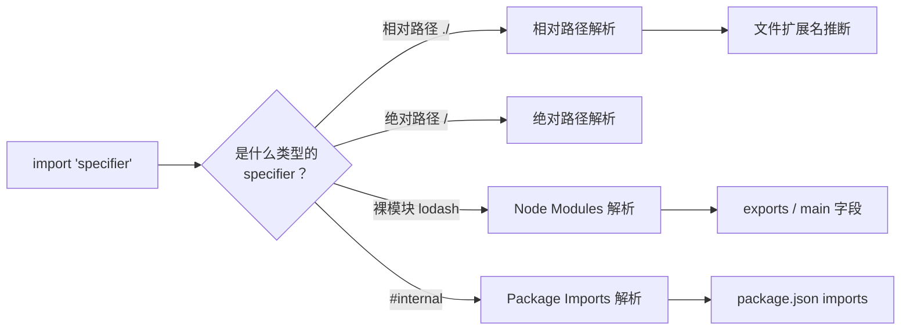
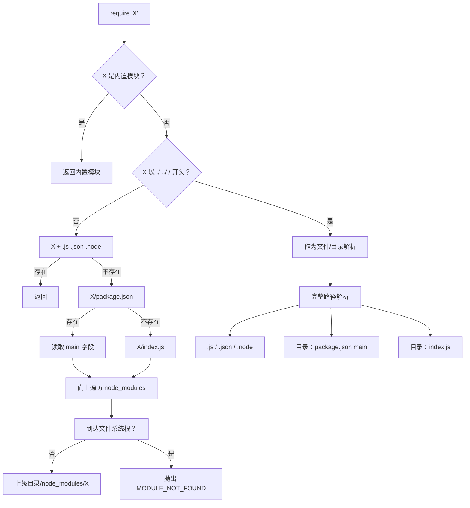
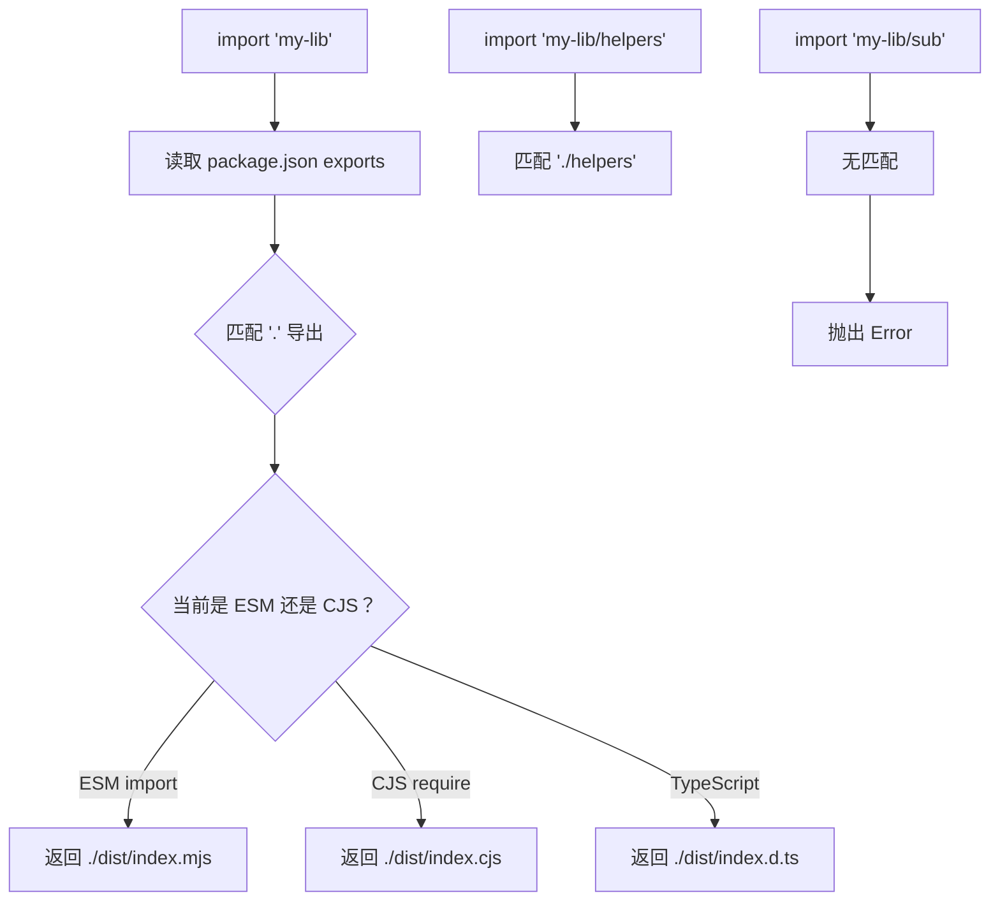
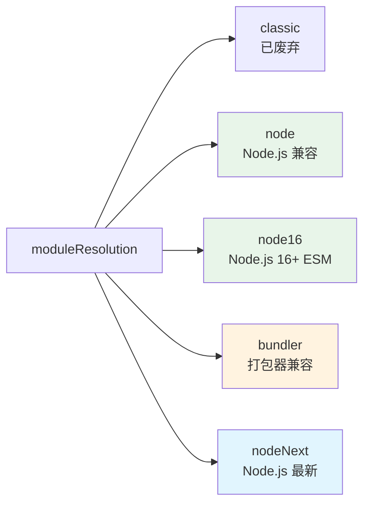
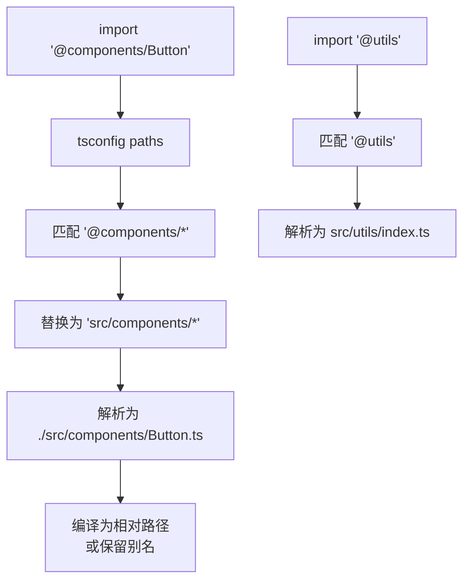
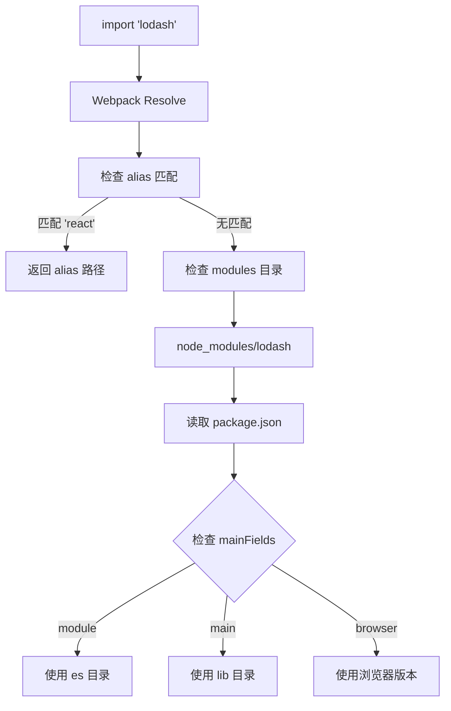
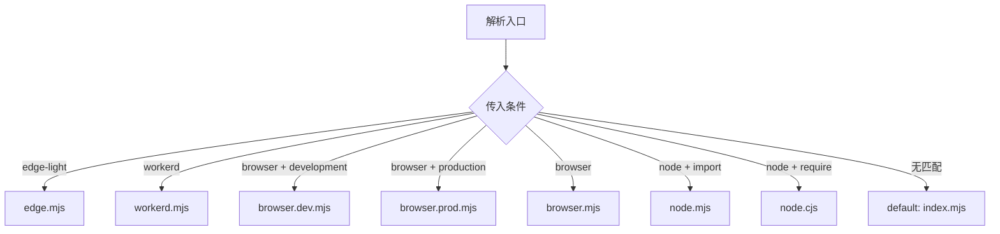
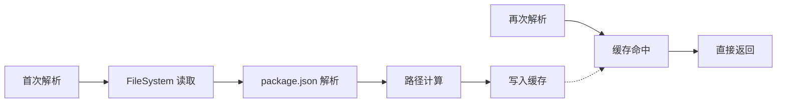

# 06 - 模块解析算法

> 模块解析（Module Resolution）是 JavaScript 工具链中最核心但最容易被忽视的机制。从 Node.js 的 `require.resolve` 到 TypeScript 的 `moduleResolution` 策略，再到各打包器的自定义解析插件，理解这些差异是调试构建问题和优化工程架构的关键。

---

## 1. 模块解析基础

### 1.1 解析的本质

当代码中出现 `import './utils'` 或 `require('lodash')` 时，解析器需要回答三个问题：



### 1.2 核心术语

| 术语 | 说明 | 示例 |
|------|------|------|
| Specifier | 导入语句中的路径/模块标识符 | `'./utils'`, `'lodash'`, `'#internal'` |
| Base URL | 解析的基准目录 | 包含导入语句的文件所在目录 |
| Resolution Target | 最终解析到的文件绝对路径 | `/project/src/utils.js` |
| Package Scope | `package.json` 的边界范围 | 从目标目录向上找到的第一个 `package.json` |

---

## 2. Node.js 模块解析算法

### 2.1 CommonJS 解析算法

Node.js 的 `require()` 遵循经典的 **三代查找算法**：



```js
// Node.js CJS 解析伪代码
function requireResolve(request, parentPath) {
  // 1. 内置模块
  if (isCoreModule(request)) return request;

  // 2. 相对/绝对路径
  if (request.startsWith('./') || request.startsWith('../') || request.startsWith('/')) {
    const resolved = path.resolve(path.dirname(parentPath), request);
    return resolveAsFile(resolved) || resolveAsDirectory(resolved);
  }

  // 3. 裸模块：向上遍历 node_modules
  let currentDir = path.dirname(parentPath);
  while (currentDir !== path.dirname(currentDir)) {
    const modulePath = path.join(currentDir, 'node_modules', request);
    const result = resolveAsFile(modulePath) || resolveAsDirectory(modulePath);
    if (result) return result;
    currentDir = path.dirname(currentDir);
  }

  throw new Error(`Cannot find module '${request}'`);
}
```

### 2.2 ESM 解析算法（Node.js）

ESM 的解析更严格，**不自动补全扩展名**：

| 特性 | CJS `require()` | ESM `import` |
|------|----------------|--------------|
| 扩展名推断 | ✅ `.js` `.json` `.node` | ❌ 必须显式指定 |
| 目录索引 | ✅ `index.js` | ❌ 必须显式指定 `index.js` |
| `package.json` main | ✅ 读取 `main` 字段 | ✅ 优先读取 `exports` |
| JSON 导入 | 原生支持 | 需要 `with { type: 'json' }` |
| 模块缓存 | 单例缓存 | 独立的 ESM Loader 缓存 |

```js
// ✅ CJS：可以省略扩展名
const utils = require('./utils');  // 自动尝试 utils.js / utils.json / utils.node

// ❌ ESM：必须显式指定
import utils from './utils';     // Error: Cannot find module
import utils from './utils.js';  // ✅ 正确
import utils from './utils/index.js';  // ✅ 目录必须显式到 index.js
```

### 2.3 exports 字段解析

```json
{
  "name": "my-lib",
  "exports": {
    ".": {
      "types": "./dist/index.d.ts",
      "import": "./dist/index.mjs",
      "require": "./dist/index.cjs",
      "default": "./dist/index.mjs"
    },
    "./helpers": {
      "types": "./dist/helpers.d.ts",
      "import": "./dist/helpers.mjs",
      "require": "./dist/helpers.cjs"
    },
    "./package.json": "./package.json"
  }
}
```



### 2.4 imports 字段（Package Imports）

Node.js 12+ 支持 `package.json` 中的 `imports` 字段，用于包内部的子路径映射：

```json
{
  "imports": {
    "#config": "./src/config.js",
    "#config/*": "./src/config/*.js",
    "#utils": {
      "development": "./src/utils.dev.js",
      "production": "./src/utils.prod.js",
      "default": "./src/utils.js"
    }
  }
}
```

```js
// 包内部代码使用
import config from '#config';
import dbConfig from '#config/database';
import utils from '#utils';  // 根据 NODE_ENV 解析
```

**`imports` vs `exports` 对比**：

| 特性 | `imports` | `exports` |
|------|-----------|-----------|
| 用途 | 包**内部**自引用 | 包**对外**暴露的接口 |
| 消费者 | 包自身代码 | 包的依赖方 |
| 通配符 | ✅ 支持 `*` | ✅ 支持 `*` |
| 条件导出 | ✅ 支持 | ✅ 支持 |

---

## 3. TypeScript 模块解析策略

### 3.1 三种 moduleResolution 模式



```json
// tsconfig.json
{
  "compilerOptions": {
    "module": "NodeNext",
    "moduleResolution": "NodeNext"
  }
}
```

| 模式 | 说明 | 适用场景 |
|------|------|----------|
| `classic` | TypeScript 1.6 之前的旧算法 | **不要使用** |
| `node` | 模拟 Node.js CJS 解析 | CJS 项目 |
| `node16` | Node.js 16+ 的 ESM/CJS 混合 | 现代 Node.js |
| `nodenext` | Node.js 最新版本 | 最严格的 ESM 支持 |
| `bundler` | 兼容打包器的行为 | Vite/Webpack 项目 |

### 3.2 bundler 模式的特殊行为

```json
{
  "compilerOptions": {
    "moduleResolution": "bundler",
    "allowImportingTsExtensions": true,
    "resolvePackageJsonExports": true,
    "resolvePackageJsonImports": true
  }
}
```

**`bundler` 模式的关键特性**：

| 特性 | `node16`/`nodenext` | `bundler` |
|------|---------------------|-----------|
| 必须写 `.js` 扩展名 | ✅ 必须 | ❌ 可省略（打包器会处理）|
| `allowImportingTsExtensions` | ❌ 不允许 | ✅ 允许 |
| 目录索引推断 | ❌ 必须显式 | ✅ 可省略 `index.ts` |
| ESM 严格模式 | ✅ | ⚠️ 更宽松 |

```ts
// bundler 模式下这些写法都合法：
import utils from './utils';        // 省略扩展名
import utils from './utils.ts';     // 显式 .ts
import helper from './helpers';     // 自动解析 helpers/index.ts

// node16/nodenext 下：
import utils from './utils.js';     // 必须写 .js（即使源文件是 .ts）
import helper from './helpers/index.js';  // 必须显式 index.js
```

### 3.3 paths 配置详解

```json
{
  "compilerOptions": {
    "baseUrl": ".",
    "paths": {
      "@/*": ["src/*"],
      "@components/*": ["src/components/*"],
      "@utils": ["src/utils/index.ts"],
      "~shared/*": ["../shared/src/*"]
    }
  }
}
```



**TypeScript `paths` 的注意事项**：

```ts
// ⚠️ paths 只在编译时生效，运行时需要额外配置
// 以下方案让运行时也能识别 paths：

// Node.js: 使用 tsx/ts-node 的 paths 支持
// tsx --tsconfig ./tsconfig.json src/index.ts

// Node.js 20+ 使用 --import 加载 hooks
node --import ./register.js src/index.ts

// 或使用 tsconfig-paths
node -r tsconfig-paths/register dist/index.js
```

### 3.4 TypeScript 解析的实际路径映射

```json
{
  "compilerOptions": {
    "baseUrl": "./src",
    "paths": {
      "app/*": ["./*"],
      "shared/*": ["../shared/*"]
    },
    "rootDirs": ["./src", "./generated"]
  }
}
```

```ts
// rootDirs 允许将多个目录虚拟合并
// ./src/types.ts + ./generated/types.ts
// 编译器会认为它们在同一个命名空间
import { GeneratedType } from './types';  // 可能来自 generated/types.ts
```

---

## 4. 打包器解析策略

### 4.1 Webpack 解析配置

```js
// webpack.config.js
module.exports = {
  resolve: {
    // 扩展名优先级
    extensions: ['.tsx', '.ts', '.js', '.json'],

    // 路径别名
    alias: {
      '@': path.resolve(__dirname, 'src'),
      '@components': path.resolve(__dirname, 'src/components'),
      '@utils': path.resolve(__dirname, 'src/utils'),
      // 模块替换
      'react': path.resolve(__dirname, './preact-compat.js'),
    },

    // 模块查找目录
    modules: ['node_modules', path.resolve(__dirname, 'src')],

    // 条件导出匹配
    conditionNames: ['import', 'module', 'browser', 'default'],

    // 包 main 字段优先级
    mainFields: ['module', 'main'],  // ESM 优先
  }
};
```



### 4.2 Vite 解析配置

```ts
// vite.config.ts
import { defineConfig } from 'vite';
import path from 'node:path';

export default defineConfig({
  resolve: {
    // 路径别名
    alias: {
      '@': path.resolve(__dirname, './src'),
      '@assets': path.resolve(__dirname, './src/assets'),
      // 使用对象形式更精确
      { find: /^~/, replacement: path.resolve(__dirname, 'node_modules') },
    },

    // 扩展名（Vite 默认已有常见扩展）
    extensions: ['.mjs', '.js', '.ts', '.jsx', '.tsx', '.json'],

    // 条件导出
    conditions: ['import', 'module', 'browser', 'default'],

    // 主入口字段
    mainFields: ['module', 'jsnext:main', 'jsnext', 'main'],

    // 是否允许省略目录索引
    preserveSymlinks: false,
  },

  // SSR 特殊的解析配置
  ssr: {
    noExternal: ['some-package'],
    external: ['node-fetch'],
  }
});
```

**Vite 预打包解析**：

```mermaid
sequenceDiagram
    participant Dev as Vite Dev Server
    participant Opt as Dependency Optimizer
    participant NM as node_modules
    participant Cache as node_modules/.vite

    Dev->>Opt: 首次启动扫描依赖
    Opt->>NM: 读取 package.json 的 dependencies
    NM-->>Opt: 返回依赖列表
    Opt->>NM: 使用 esbuild 预打包
    NM-->>Opt: 解析 ESM/CJS 入口
    Opt->>Cache: 写入优化后的 chunk
    Cache-->>Dev: 后续直接提供预打包产物
```

### 4.3 Rollup 解析插件

```js
// rollup.config.js
import resolve from '@rollup/plugin-node-resolve';
import alias from '@rollup/plugin-alias';

export default {
  plugins: [
    alias({
      entries: [
        { find: '@', replacement: './src' },
        { find: /@components\/(.*)/, replacement: './src/components/$1' },
      ]
    }),

    resolve({
      // 浏览器环境优先
      browser: true,
      // 优先解析 ESM
      preferBuiltins: false,
      // 条件导出
      exportConditions: ['browser', 'import', 'default'],
      // 扩展名
      extensions: ['.mjs', '.js', '.json', '.node', '.ts'],
    })
  ]
};
```

### 4.4 打包器解析差异对比

| 特性 | Webpack | Vite | Rollup |
|------|---------|------|--------|
| 扩展名推断 | ✅ `resolve.extensions` | ✅ 内置 + 配置 | ✅ 插件配置 |
| 路径别名 | ✅ `resolve.alias` | ✅ `resolve.alias` | ✅ `@rollup/plugin-alias` |
| 条件导出 | ✅ `resolve.conditionNames` | ✅ `resolve.conditions` | ✅ `exportConditions` |
| Symlinks | ✅ 默认解析 | ✅ 默认解析 | ✅ 默认解析 |
| Monorepo | ✅ `resolve.modules` | ✅ 原生支持 | ⚠️ 需配置 |

---

## 5. Monorepo 中的模块解析

### 5.1 Workspace 解析挑战

```mermaid
graph TD
    subgraph Monorepo
        A[apps/web] --> B[node_modules]
        B --> C[@scope/ui]
        B --> D[lodash]

        E[packages/ui] --> F[node_modules]
        F --> G[@scope/utils]

        H[packages/utils] --> I[node_modules]

        A -.->|workspace:| E
        E -.->|workspace:| H
    end
```

### 5.2 解决方案一：TypeScript Project References

```json
// packages/utils/tsconfig.json
{
  "compilerOptions": {
    "composite": true,
    "outDir": "./dist",
    "rootDir": "./src"
  },
  "include": ["src/**/*"]
}

// packages/ui/tsconfig.json
{
  "compilerOptions": {
    "composite": true,
    "outDir": "./dist",
    "rootDir": "./src"
  },
  "references": [
    { "path": "../utils" }
  ]
}

// apps/web/tsconfig.json
{
  "references": [
    { "path": "../../packages/ui" },
    { "path": "../../packages/utils" }
  ]
}
```

### 5.3 解决方案二：路径映射

```json
// tsconfig.base.json
{
  "compilerOptions": {
    "baseUrl": ".",
    "paths": {
      "@scope/utils": ["packages/utils/src/index.ts"],
      "@scope/utils/*": ["packages/utils/src/*"],
      "@scope/ui": ["packages/ui/src/index.ts"],
      "@scope/ui/*": ["packages/ui/src/*"]
    }
  }
}
```

```js
// vite.config.ts
import path from 'node:path';

export default {
  resolve: {
    alias: {
      '@scope/utils': path.resolve(__dirname, '../utils/src'),
      '@scope/ui': path.resolve(__dirname, '../ui/src'),
    }
  }
};
```

### 5.4 解决方案三：exports + TypeScript Declaration Maps

```json
// packages/utils/package.json
{
  "name": "@scope/utils",
  "exports": {
    ".": {
      "types": "./dist/index.d.ts",
      "import": "./dist/index.mjs",
      "require": "./dist/index.cjs"
    },
    "./helpers": {
      "types": "./dist/helpers.d.ts",
      "import": "./dist/helpers.mjs"
    }
  }
}
```

```json
// packages/utils/tsconfig.json
{
  "compilerOptions": {
    "declaration": true,
    "declarationMap": true,  // 生成 .d.ts.map，支持跳转到源码
    "outDir": "./dist"
  }
}
```

---

## 6. 高级解析技巧

### 6.1 条件导出的完整策略

```json
{
  "exports": {
    ".": {
      "edge-light": "./dist/edge.mjs",
      "workerd": "./dist/workerd.mjs",
      "browser": {
        "development": "./dist/browser.dev.mjs",
        "production": "./dist/browser.prod.mjs",
        "default": "./dist/browser.mjs"
      },
      "node": {
        "import": "./dist/node.mjs",
        "require": "./dist/node.cjs"
      },
      "types": "./dist/index.d.ts",
      "default": "./dist/index.mjs"
    }
  }
}
```

**条件匹配顺序**：

1. 工具链传入的条件（如 `browser`, `node`, `import`, `require`）
2. 从上到下第一个匹配的条件
3. `default` 作为兜底



### 6.2 自定义 Node.js Loader（Hooks）

```js
// loader.mjs
export async function resolve(specifier, context, nextResolve) {
  // 自定义协议处理
  if (specifier.startsWith('custom:')) {
    const realPath = specifier.replace('custom:', './src/');
    return nextResolve(realPath, context);
  }

  // 路径重写
  if (specifier.startsWith('@app/')) {
    const rewritten = specifier.replace('@app/', './src/');
    return nextResolve(rewritten, context);
  }

  return nextResolve(specifier, context);
}

export async function load(url, context, nextLoad) {
  if (url.endsWith('.css')) {
    const { source } = await nextLoad(url, { ...context, format: 'module' });
    // 返回 CSS 模块的 JS 包装
    return {
      format: 'module',
      source: `export default ${JSON.stringify(source.toString())}`,
      shortCircuit: true,
    };
  }
  return nextLoad(url, context);
}
```

```bash
# 使用自定义 loader
node --import ./register.mjs app.mjs
```

### 6.3 Subpath Imports 实战

```json
{
  "imports": {
    "#dep": {
      "node": "dep-node-native",
      "default": "./dep-polyfill.js"
    },
    "#internal/*": "./src/internal/*.js",
    "#config": {
      "development": "./config/dev.js",
      "production": "./config/prod.js",
      "test": "./config/test.js"
    }
  }
}
```

```js
// 包内部代码
import dep from '#dep';  // Node 环境用 dep-node-native，其他用 polyfill
import helper from '#internal/helpers';  // → ./src/internal/helpers.js
import config from '#config';  // 根据 NODE_ENV 自动切换
```

---

## 7. 调试模块解析问题

### 7.1 Node.js 调试

```bash
# 打印模块解析过程
NODE_DEBUG=module node app.js

# 查看特定模块的解析结果
node -e "console.log(require.resolve('lodash'))"
node -e "console.log(require.resolve.paths('lodash'))"

# ESM 解析调试
node --input-type=module -e "import { pathToFileURL } from 'url'; console.log(import.meta.resolve('lodash'));"
```

### 7.2 TypeScript 调试

```bash
# 打印解析日志
tsc --traceResolution

# 只检查特定文件
tsc --noEmit --traceResolution src/index.ts 2>&1 | grep -E "(Resolving|Resolved|Failed)"
```

### 7.3 Webpack 调试

```js
// webpack.config.js
module.exports = {
  // ...
  stats: {
    errorDetails: true,
    logging: 'verbose',
    loggingDebug: /resolver/,
  },
  // 使用 resolve.plugins 调试
  resolve: {
    plugins: [
      {
        apply(resolver) {
          resolver.hooks.resolve.tap('DebugResolver', (request) => {
            console.log('Resolving:', request.request, 'from', request.path);
          });
        }
      }
    ]
  }
};
```

---

## 8. 性能优化

### 8.1 解析缓存



```js
// Webpack 持久化缓存
module.exports = {
  cache: {
    type: 'filesystem',
    buildDependencies: {
      config: [__filename]
    }
  }
};
```

### 8.2 减少模块查找深度

```js
// 优化前：大量 node_modules 层级
resolve: {
  modules: ['node_modules']  // 默认：逐层向上查找
}

// 优化后：限制查找范围
resolve: {
  modules: [
    path.resolve(__dirname, 'node_modules'),
    'node_modules'
  ]
}
```

---

## 本章小结

模块解析是连接代码编写与运行时的桥梁，不同工具链的解析策略差异直接影响项目的可维护性和构建行为。

**核心要点**：

1. **Node.js 解析**：CJS 支持扩展名推断和目录索引，ESM 要求显式路径；`exports` 和 `imports` 字段是现代包配置的核心
2. **TypeScript 解析**：`moduleResolution` 策略选择至关重要，`bundler` 模式适合 Vite/Webpack 项目，`node16`/`nodenext` 适合 Node.js 原生 ESM；`paths` 仅在编译时生效
3. **打包器解析**：Webpack/Vite/Rollup 都支持别名、条件导出和扩展名配置，但具体行为有差异；Vite 的预打包优化对大型 node_modules 有显著性能提升
4. **Monorepo 解析**：Project References + `paths` + `exports` 是 TypeScript Monorepo 的标准组合，`declarationMap` 支持源码级跳转
5. **调试能力**：`NODE_DEBUG=module`、`tsc --traceResolution`、Webpack resolver hooks 是定位解析问题的利器

**配置建议**：

- 现代 Node.js 项目：使用 `"moduleResolution": "NodeNext"` + `"module": "NodeNext"`
- Vite 前端项目：使用 `"moduleResolution": "bundler"`，配合 `vite.config.ts` 的 `resolve.alias`
- 发布 npm 包：配置完整的 `exports` 字段，提供 `types` / `import` / `require` / `default`
- Monorepo 内部包：使用 `#internal` 的 `imports` 字段进行自引用，避免过深的相对路径

---

## 参考资源

- [Node.js Module Resolution Algorithm](https://nodejs.org/api/modules.html#all-together)
- [Node.js ESM Resolution Algorithm](https://nodejs.org/api/esm.html#resolution-algorithm-specification)
- [TypeScript Module Resolution](https://www.typescriptlang.org/docs/handbook/module-resolution.html)
- [TypeScript: moduleResolution bundler](https://www.typescriptlang.org/docs/handbook/modules/reference.html#bundler)
- [Webpack Resolve Configuration](https://webpack.js.org/configuration/resolve/)
- [Vite Resolve Options](https://vitejs.dev/config/shared-options.html#resolve-alias)
- [Rollup @rollup/plugin-node-resolve](https://github.com/rollup/plugins/tree/master/packages/node-resolve)
- [Node.js Package Imports](https://nodejs.org/api/packages.html#subpath-imports)
- [Node.js Package Exports](https://nodejs.org/api/packages.html#exports)
- [Pure ESM Package Guide](https://gist.github.com/sindresorhus/a39789f98801d908bbc7ff3ecc99d99c)
