# 07 - 打包器模块图

> 打包器（Bundler）是现代前端工程化的核心工具。理解模块图（Module Graph）的构建方式、不同打包器的设计哲学差异，以及 Chunk 分割策略，是优化构建产物体积和加载性能的关键。

---

## 1. 模块图基础

### 1.1 什么是模块图

模块图是打包器分析项目依赖关系后构建的有向图结构，节点是模块，边是导入/导出关系：

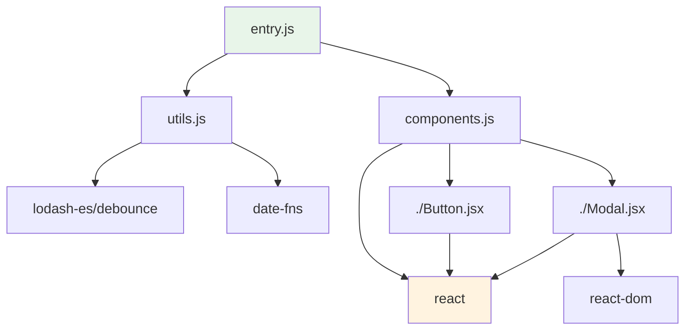

**模块图的属性**：

- **节点（Node）**：源码文件、npm 包、虚拟模块、资源文件
- **边（Edge）**：`import` / `require` / `import()` 关系
- **权重**：可附带大小、加载优先级、使用频率等元数据
- **入口（Entry）**：构建的起点，一个项目可以有多个 entry

### 1.2 模块图的构建流程


---

## 2. Rollup 的模块图与处理

### 2.1 Rollup 设计哲学

Rollup 基于 ESM 的静态结构，采用**基于 Scope 的分析**：

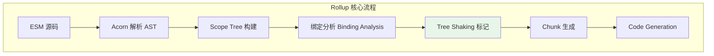

**Rollup 的特点**：

- 原生面向 ESM，CJS 需 `@rollup/plugin-commonjs` 转换
- 深度 Tree Shaking：基于变量级别的消除
- 输出极致简洁：代码几乎无运行时开销
- 天然支持 Code Splitting（通过动态导入）

### 2.2 深度 Tree Shaking 机制

```js
// 源码
import { add, subtract, multiply } from './math.js';
console.log(add(1, 2));

// math.js
export function add(a, b) { return a + b; }
export function subtract(a, b) { return a - b; }
export function multiply(a, b) { return a * b; }

// Rollup 输出（仅保留 add）
function add(a, b) { return a + b; }
console.log(add(1, 2));
```

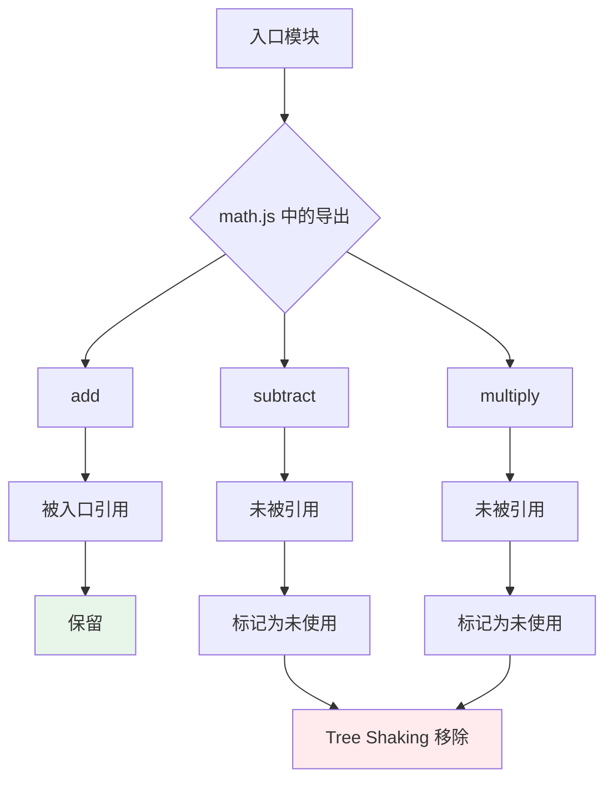

**副作用与 `sideEffects`**：

```json
{
  "name": "my-library",
  "sideEffects": [
    "*.css",
    "./polyfill.js"
  ]
}
```

```js
// 如果 package.json 中 sideEffects: false
// Rollup 可以安全地移除整个未使用的模块
import { unused } from 'side-effect-free-lib';  // 整行被移除
```

### 2.3 Rollup 的 Chunk 生成

```js
// rollup.config.js
export default {
  input: {
    main: 'src/main.js',
    admin: 'src/admin.js',
  },
  output: {
    dir: 'dist',
    format: 'esm',
    // 代码分割配置
    manualChunks: {
      // 将 react 相关库打包在一起
      vendor: ['react', 'react-dom'],
      // 将工具函数打包在一起
      utils: ['./src/utils/date.js', './src/utils/format.js'],
    },
    // 动态导入自动分割
    inlineDynamicImports: false,
  }
};
```

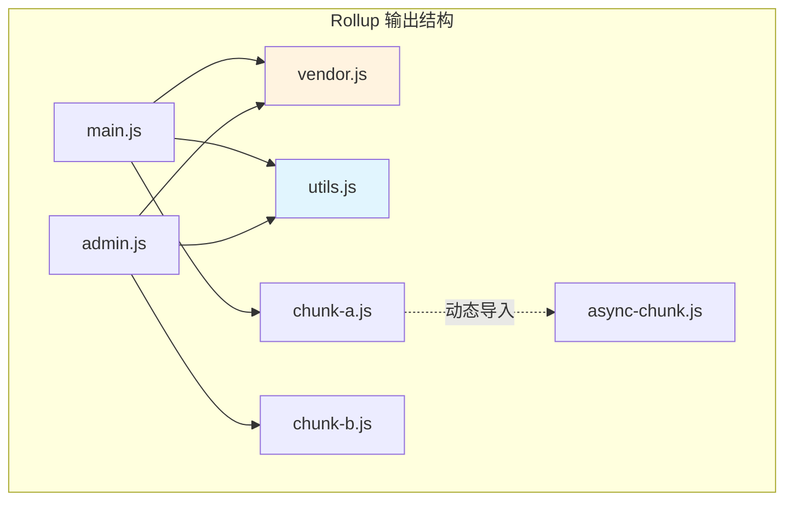

### 2.4 Rollup Plugin 系统对模块图的影响

```js
// 自定义插件修改模块图
export default {
  plugins: [
    {
      name: 'virtual-modules',
      resolveId(source) {
        if (source === 'virtual:config') {
          return source;  // 声明虚拟模块
        }
      },
      load(id) {
        if (id === 'virtual:config') {
          // 注入虚拟模块内容到模块图
          return `export default ${JSON.stringify(globalConfig)}`;
        }
      }
    },

    {
      name: 'module-preload',
      generateBundle(_, bundle) {
        // 分析 chunk 依赖关系，注入预加载标签
        for (const [fileName, chunk] of Object.entries(bundle)) {
          if (chunk.type === 'chunk') {
            const imports = chunk.imports.map(i =>
              `<link rel="modulepreload" href="/${i}" />`
            ).join('');
            // 注入到 HTML...
          }
        }
      }
    }
  ]
};
```

---

## 3. Webpack 的模块图与处理

### 3.1 Webpack 设计哲学

Webpack 采用**一切皆模块**的设计，支持任意资源的依赖图：

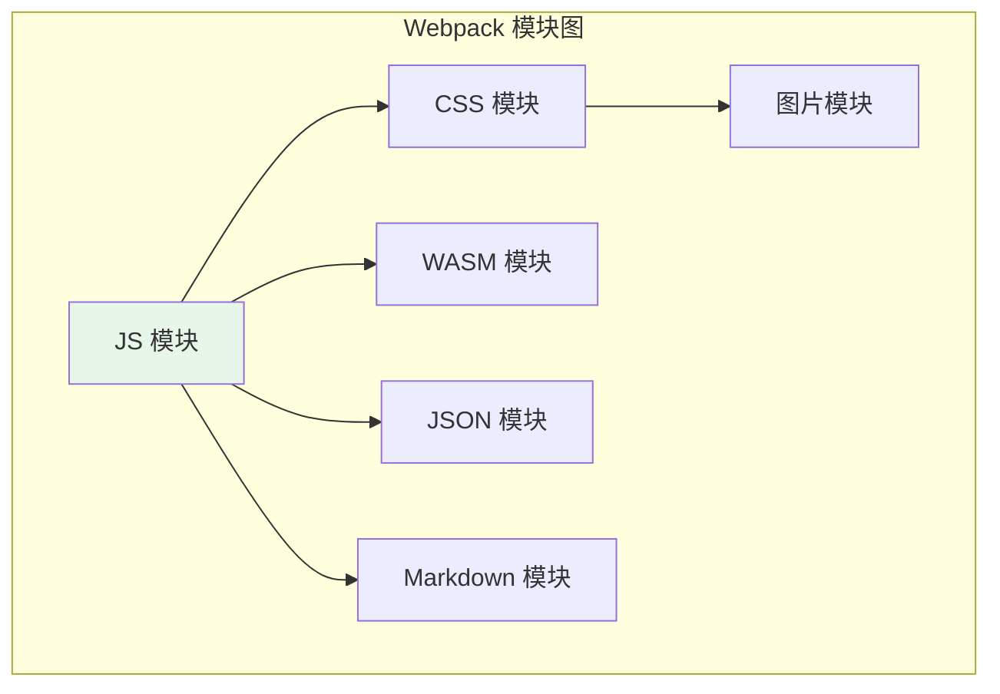

**Webpack 的核心特点**：

- 模块类型高度可扩展（JS/CSS/图片/字体等）
- 强大的 Loader 生态：任意资源 → JS 模块
- 内置的 Code Splitting 和异步加载
- Module Federation 支持跨应用共享模块

### 3.2 Webpack 的模块图数据结构

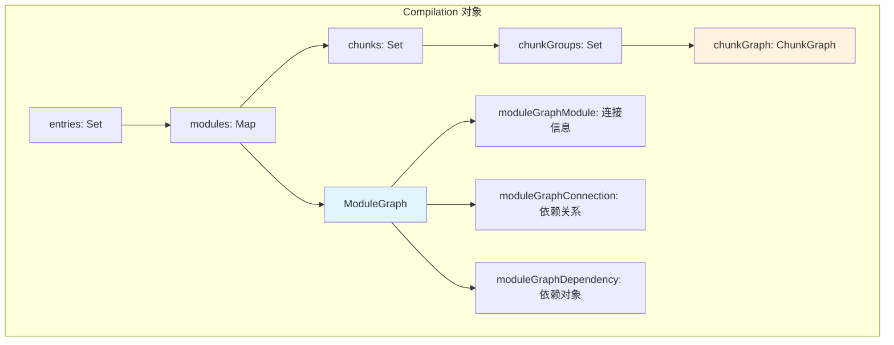

**Webpack 模块图的独特概念**：

| 概念 | 说明 |
|------|------|
| `ModuleGraph` | 维护模块间的依赖连接关系 |
| `ChunkGraph` | 维护模块到 Chunk 的分配关系 |
| `ChunkGroup` | Chunk 的逻辑分组（如 entrypoint）|
| `AsyncEntrypoint` | 动态导入对应的异步入口 |
| `ModuleGraphConnection` | 描述模块间的激活/副作用状态 |

### 3.3 Webpack 的 Tree Shaking

Webpack 的 Tree Shaking 基于 **usedExports 优化**：

```js
// webpack.config.js
module.exports = {
  mode: 'production',
  optimization: {
    usedExports: true,     // 标记未使用导出
    sideEffects: true,     // 检查 package.json sideEffects
    providedExports: true,  // 收集模块提供的导出
    innerGraph: true,      // 分析导出间的依赖关系
  }
};
```

```js
// 源码
import { Button, Modal } from './components';
export { Button };

// components/index.js
export { Button } from './Button';
export { Modal } from './Modal';
export { Tooltip } from './Tooltip';  // 未被引用

// Webpack 输出标记
/* unused harmony export Tooltip */
/* harmony export (binding) */ __webpack_require__.d(__webpack_exports__, {
  "Button": () => Button
});
```

**Webpack vs Rollup Tree Shaking**：

| 特性 | Webpack | Rollup |
|------|---------|--------|
| 消除粒度 | 模块级别 + 导出级别 | 语句级别 |
| 副作用分析 | 依赖 `sideEffects` 字段 | 深度 Scope 分析 |
| 输出代码 | 保留 webpack runtime | 极致简洁 |
| 跨模块优化 | 有限 | 更强（ESM 原生优势）|

### 3.4 Webpack 的 SplitChunks 策略

```js
// webpack.config.js
module.exports = {
  optimization: {
    splitChunks: {
      // 选择哪些 chunk 进行优化
      chunks: 'all',  // 'all' | 'async' | 'initial'

      // 最小尺寸才分割
      minSize: 20000,  // 20KB

      // 最大尺寸，超过会尝试二次分割
      maxSize: 244000,  // 244KB

      // 最小共享次数
      minChunks: 1,

      // 最大异步请求数
      maxAsyncRequests: 30,

      // 最大初始请求数
      maxInitialRequests: 30,

      // 缓存组配置
      cacheGroups: {
        // 提取 node_modules
        vendors: {
          test: /[\\/]node_modules[\\/]/,
          priority: -10,
          reuseExistingChunk: true,
          name(module, chunks, cacheGroupKey) {
            const packageName = module.context.match(
              /[\\/]node_modules[\\/](.*?)([\\/]|$)/
            )?.[1];
            return `npm.${packageName?.replace('@', '')}`;
          }
        },

        // 提取公共模块
        common: {
          minChunks: 2,
          priority: -20,
          reuseExistingChunk: true,
          name: 'common'
        }
      }
    }
  }
};
```

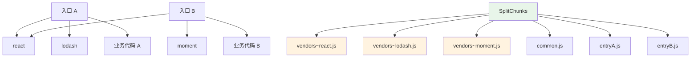

### 3.5 Module Federation

```js
// 远程应用配置（remote）
const ModuleFederationPlugin = require('webpack/lib/container/ModuleFederationPlugin');

module.exports = {
  plugins: [
    new ModuleFederationPlugin({
      name: 'remoteApp',
      filename: 'remoteEntry.js',
      exposes: {
        './Button': './src/components/Button',
        './utils': './src/utils',
      },
      shared: {
        react: { singleton: true, requiredVersion: '^18.0.0' },
        'react-dom': { singleton: true },
      }
    })
  ]
};
```

```js
// 宿主应用配置（host）
module.exports = {
  plugins: [
    new ModuleFederationPlugin({
      name: 'hostApp',
      remotes: {
        remote: 'remoteApp@https://remote.example.com/remoteEntry.js',
      },
      shared: {
        react: { singleton: true },
        'react-dom': { singleton: true },
      }
    })
  ]
};
```

```js
// 宿主应用使用远程模块
const RemoteButton = React.lazy(() => import('remote/Button'));

function App() {
  return (
    <React.Suspense fallback="Loading...">
      <RemoteButton />
    </React.Suspense>
  );
}
```

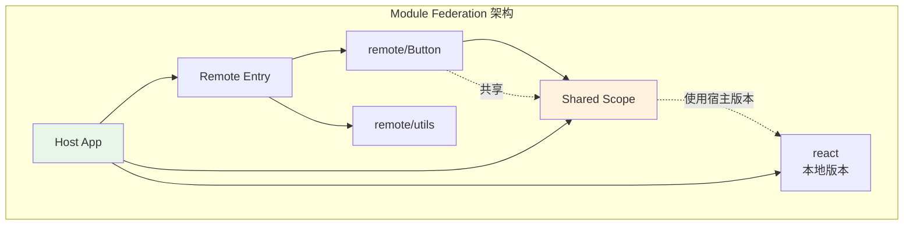

---

## 4. Vite 的模块图与处理

### 4.1 Vite 的双模式架构

Vite 在开发（Dev）和生产（Build）阶段采用完全不同的模块处理策略：

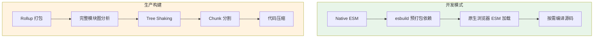

### 4.2 开发时的模块图

开发时 Vite 不构建完整的模块图，而是依赖浏览器的 ESM Loader：

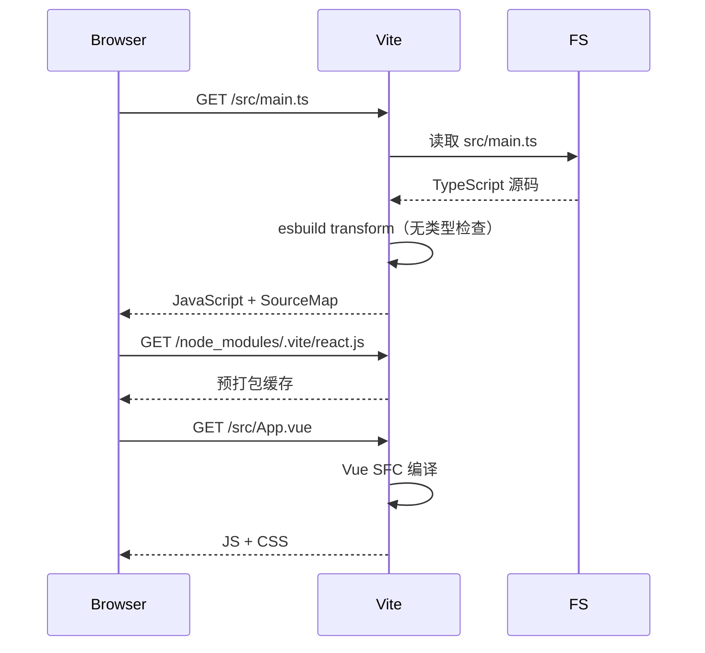

**开发时优势**：

- 启动时间只取决于打开页面的模块数量，而非项目总规模
- 修改后的 HMR 更新在毫秒级
- 不需要完整的模块图即可工作

### 4.3 生产构建时的模块图

```ts
// vite.config.ts
import { defineConfig } from 'vite';
import { visualizer } from 'rollup-plugin-visualizer';

export default defineConfig({
  build: {
    // Rollup 打包选项
    rollupOptions: {
      output: {
        // 手动 chunk 分割
        manualChunks(id) {
          if (id.includes('node_modules')) {
            if (id.includes('react') || id.includes('react-dom')) {
              return 'react';
            }
            if (id.includes('lodash') || id.includes('date-fns')) {
              return 'utils';
            }
            return 'vendor';
          }
          if (id.includes('/src/pages/')) {
            // 按页面自动分割
            const match = id.match(/\/pages\/([^/]+)/);
            if (match) return `page-${match[1]}`;
          }
        },

        // 入口 chunk 命名
        entryFileNames: 'assets/[name]-[hash].js',
        // 代码 chunk 命名
        chunkFileNames: 'assets/[name]-[hash].js',
        // 资源文件命名
        assetFileNames: 'assets/[name]-[hash][extname]',
      }
    },

    // 代码分割大小限制
    chunkSizeWarningLimit: 500,  // KB

    // CSS 代码分割
    cssCodeSplit: true,

    // Sourcemap
    sourcemap: true,
  },

  plugins: [
    visualizer({
      open: true,
      gzipSize: true,
      brotliSize: true,
    })
  ]
});
```

### 4.4 Vite 的依赖预打包

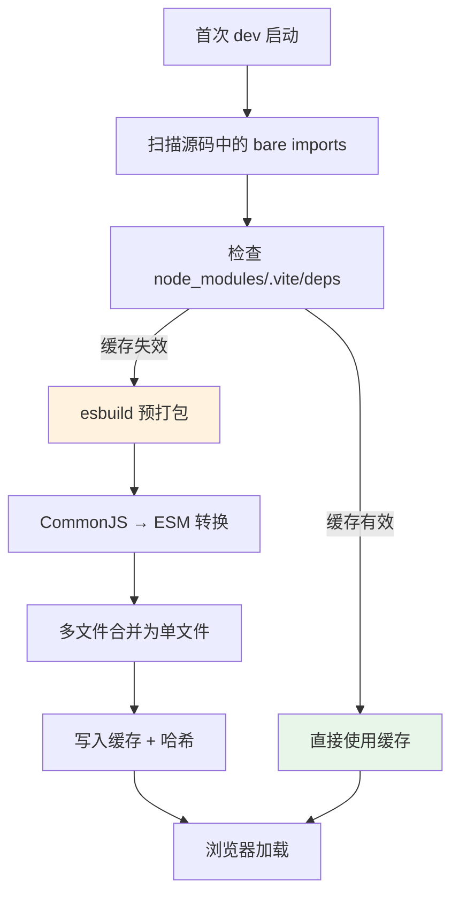

```ts
// vite.config.ts
export default defineConfig({
  optimizeDeps: {
    // 强制预打包的依赖
    include: ['lodash-es', 'moment'],

    // 排除不需要预打包的依赖
    exclude: ['your-esm-only-lib'],

    // 自定义 esbuild 选项
    esbuildOptions: {
      target: 'es2020',
    },

    // 强制重新预打包
    force: true,
  }
});
```

---

## 5. Chunk 分割策略深度对比

### 5.1 分割策略对比矩阵

| 策略 | Rollup | Webpack | Vite |
|------|--------|---------|------|
| 动态导入分割 | ✅ 原生 | ✅ `import()` | ✅ Rollup 继承 |
| 手动 chunk | ✅ `manualChunks` | ✅ `cacheGroups` | ✅ `manualChunks` |
| 共享 chunk | ✅ 自动 | ✅ `splitChunks` | ✅ 自动 |
| 入口 chunk | ✅ `input` | ✅ `entry` | ✅ `build.rollupOptions.input` |
| 大小限制分割 | ⚠️ `maxSize` 实验 | ✅ `maxSize` | ⚠️ `maxSize` |

### 5.2 理想的 Chunk 分割方案

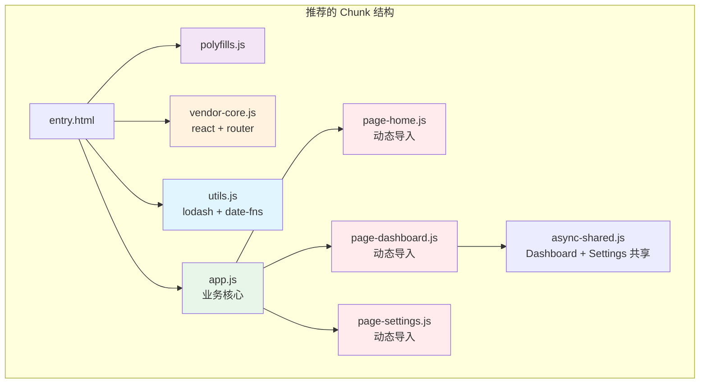

**Chunk 分类策略**：

| Chunk 类型 | 内容 | 缓存策略 |
|-----------|------|----------|
| Polyfills | `core-js`, `regenerator-runtime` | 长期缓存 |
| Vendor Core | React, Vue, Router | 长期缓存 |
| Vendor Utils | lodash, date-fns, axios | 长期缓存 |
| App Core | 业务核心逻辑、布局组件 | 中期缓存 |
| Page Chunks | 路由级页面组件 | 短期缓存 |
| Async Shared | 多个页面共享的异步模块 | 中期缓存 |

### 5.3 缓存与哈希策略

```js
// vite.config.ts
export default defineConfig({
  build: {
    rollupOptions: {
      output: {
        // content hash：文件内容不变，hash 不变 → 浏览器缓存命中
        entryFileNames: 'js/[name]-[hash].js',
        chunkFileNames: 'js/[name]-[hash].js',
        assetFileNames: (assetInfo) => {
          const info = assetInfo.name.split('.');
          const ext = info[info.length - 1];
          return `assets/[name]-[hash][extname]`;
        },

        // 确保模块标识稳定
        hashCharacters: 'hex',  // 'hex' | 'base64'
      }
    }
  }
});
```

---

## 6. 模块图优化实战

### 6.1 分析构建产物

```bash
# Webpack Bundle Analyzer
npm install --save-dev webpack-bundle-analyzer

# vite-plugin-visualizer
npm install --save-dev rollup-plugin-visualizer
```

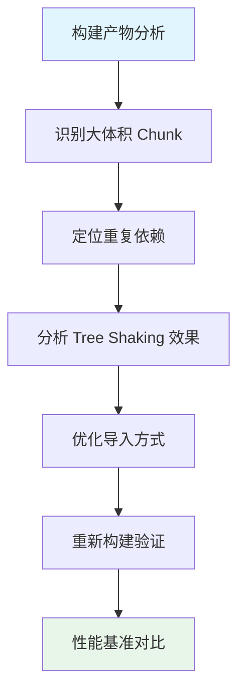

### 6.2 重复依赖消除

```js
// webpack.config.js
module.exports = {
  resolve: {
    // 强制使用单一版本
    alias: {
      'react': path.resolve('./node_modules/react'),
      'react-dom': path.resolve('./node_modules/react-dom'),
    }
  },
  optimization: {
    splitChunks: {
      cacheGroups: {
        // 将所有 node_modules 提取为单个 vendor
        vendor: {
          test: /[\\/]node_modules[\\/]/,
          name: 'vendors',
          chunks: 'all',
        }
      }
    }
  }
};
```

```bash
# 检查重复依赖
npm ls react
# 或使用 npm-check
npx npm-check --duplicate
```

### 6.3 按需加载优化

```js
// ❌ 全量导入
import lodash from 'lodash';
lodash.debounce(fn, 300);

// ✅ 按需导入（配合构建工具自动优化）
import debounce from 'lodash/debounce';

// ✅ 或使用 es 版本 + Tree Shaking
import { debounce } from 'lodash-es';

// ✅ 最佳：使用子包
import debounce from 'lodash.debounce';
```

```tsx
// React 路由级代码分割
import { lazy, Suspense } from 'react';
import { createBrowserRouter } from 'react-router-dom';

const HomePage = lazy(() => import('./pages/Home'));
const DashboardPage = lazy(() => import('./pages/Dashboard'));
const SettingsPage = lazy(() => import('./pages/Settings'));

export const router = createBrowserRouter([
  {
    path: '/',
    element: <Suspense fallback={<Spinner />}><HomePage /></Suspense>,
  },
  {
    path: '/dashboard',
    element: <Suspense fallback={<Spinner />}><DashboardPage /></Suspense>,
  },
  {
    path: '/settings',
    element: <Suspense fallback={<Spinner />}><SettingsPage /></Suspense>,
  },
]);
```

---

## 7. 新兴趋势与未来方向

### 7.1 原生 ESM 与打包器的关系

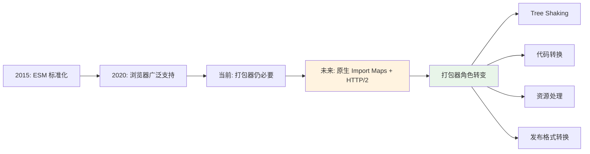

### 7.2 Rspack / Turbopack / Rolldown

| 工具 | 核心特点 | 与现有工具的关系 |
|------|----------|----------------|
| Rspack | Rust 编写的 Webpack 替代 | Webpack API 兼容，10x 速度提升 |
| Turbopack | Next.js 官方，增量计算 | 面向 Webpack 用户的快速迁移 |
| Rolldown | Rust 编写的 Rollup 替代 | Rollup API 兼容，Vite 未来默认底层 |

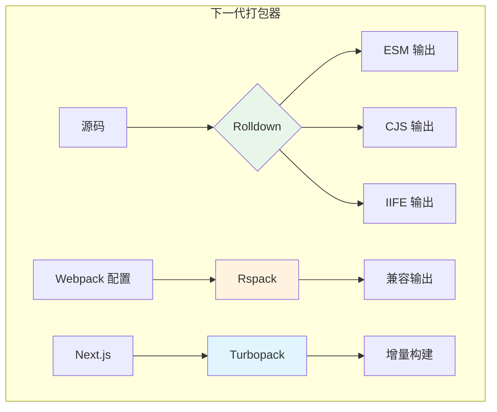

---

## 本章小结

模块图是打包器的核心数据结构，不同工具的设计哲学决定了它们的模块处理方式和适用场景。

**核心要点**：

1. **Rollup**：面向 ESM，深度 Tree Shaking（语句级），输出极致简洁，适合库（Library）打包；Code Splitting 通过动态导入原生支持
2. **Webpack**：一切皆模块，强大的 Loader 和 Plugin 生态，SplitChunks 策略灵活，Module Federation 支持微前端；适合复杂应用和遗留项目
3. **Vite**：开发时用原生 ESM（无打包），生产用 Rollup 打包；结合了两者的优势，是现代前端项目的首选开发工具
4. **Chunk 分割原则**：按变更频率分层（polyfill/vendor/app/page），利用 content hash 最大化长期缓存，避免重复依赖
5. **Tree Shaking 优化**：使用 ESM 导出、标记 `sideEffects`、避免不必要的对象属性访问、选择支持 Tree Shaking 的库版本

**工具选择建议**：

- 构建 JavaScript 库：Rollup（输出干净、Tree Shaking 最强）
- 构建大型 Web 应用：Webpack（生态最完善）或 Rspack（追求构建速度）
- 现代前端开发：Vite（开发体验最佳）
- 微前端架构：Webpack Module Federation 或 Vite + Native Federation

---

## 参考资源

- [Rollup 官方文档](https://rollupjs.org/guide/en/)
- [Rollup Module Graph Internals](https://rollupjs.org/plugin-development/#plugin-context)
- [Webpack 模块解析原理](https://webpack.js.org/concepts/module-resolution/)
- [Webpack SplitChunks 插件](https://webpack.js.org/plugins/split-chunks-plugin/)
- [Webpack Module Federation](https://webpack.js.org/concepts/module-federation/)
- [Vite 依赖预打包](https://vitejs.dev/guide/dep-pre-bundling.html)
- [Vite 构建优化](https://vitejs.dev/guide/build.html)
- [esbuild 文档](https://esbuild.github.io/)
- [Rspack 官方文档](https://www.rspack.dev/)
- [Turbopack 文档](https://turbo.build/pack)
- [Bundlephobia: 分析包体积](https://bundlephobia.com/)
- [Webpack Bundle Analyzer](https://github.com/webpack-contrib/webpack-bundle-analyzer)
