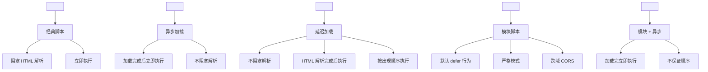
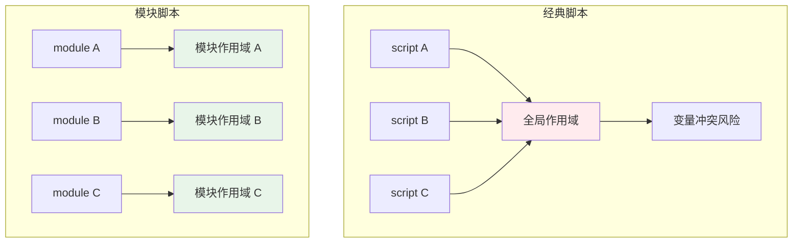
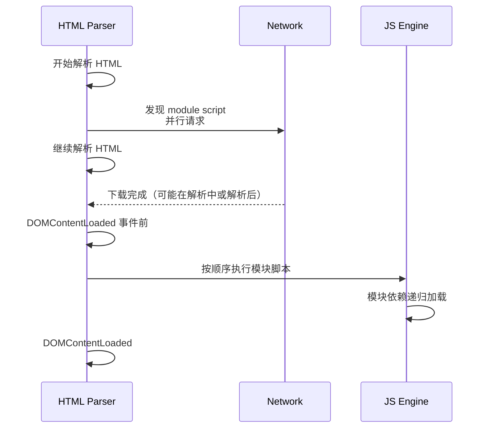
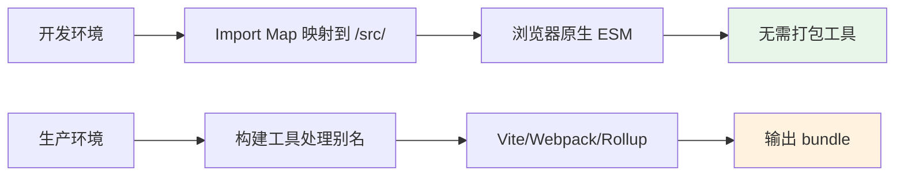
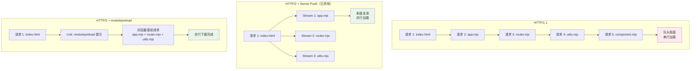

# 08 - Defer & Import Maps

> 浏览器原生 ESM 支持已经成熟，但 `script type="module"` 的加载行为与传统脚本有本质差异。Import Maps 则进一步解决了裸模块（bare module specifiers）在浏览器中的解析问题。本章深入解析这两者的机制、差异与最佳实践。

---

## 1. Script 加载策略全景

### 1.1 五种 Script 标签行为



| 属性 | 下载时机 | 执行时机 | 顺序保证 | 适用场景 |
|------|----------|----------|----------|----------|
| 无 | 阻塞解析 | 立即执行 | 按出现顺序 | 关键同步逻辑 |
| `async` | 并行下载 | 下载完立即执行 | 不保证 | 独立脚本（分析、广告）|
| `defer` | 并行下载 | DOMContentLoaded 前 | 按出现顺序 | 依赖 DOM 的脚本 |
| `type="module"` | 并行下载 | 默认 defer | 按出现顺序 | ESM 应用 |
| `type="module" async` | 并行下载 | 下载完立即执行 | 不保证 | 独立 ESM 脚本 |

### 1.2 经典脚本 vs 模块脚本的差异

```html
<!-- 经典脚本：污染全局作用域 -->
<script src="app.js"></script>
<script>
  // app.js 中的变量在这里可见
  console.log(globalVar);  // 可能意外依赖
</script>

<!-- 模块脚本：独立作用域 -->
<script type="module" src="app.js"></script>
<script type="module">
  // app.js 的导出不会污染全局
  import { init } from './app.js';
  init();
</script>
```



---

## 2. module 脚本的 defer 语义

### 2.1 默认 defer 行为

`type="module"` 的脚本**默认具有 defer 语义**，这是最容易被忽视但最重要的特性：

```html
<!DOCTYPE html>
<html>
<head>
  <!-- 模块脚本：并行下载，HTML 解析完成后按顺序执行 -->
  <script type="module" src="./analytics.js"></script>
  <script type="module" src="./app.js"></script>
</head>
<body>
  <div id="app"></div>

  <!-- app.js 执行时，DOM 已完全可用 -->
  <script type="module">
    const app = document.getElementById('app');
    app.textContent = 'Ready!';  // 一定能找到元素
  </script>
</body>
</html>
```



### 2.2 async 模块脚本

当需要模块加载完成后**立即执行**（不等待其他模块或 DOM）时使用：

```html
<!-- 统计脚本：尽快执行，不阻塞也不等待 -->
<script type="module" async src="./analytics.mjs"></script>

<!-- A/B 测试框架：独立功能，越早执行越好 -->
<script type="module" async src="./experiment.mjs"></script>
```

**async module 的注意事项**：

- 多个 async 模块的执行顺序**不确定**
- 如果 async 模块依赖其他模块，依赖会在执行前加载
- 适合自包含、无依赖顺序要求的场景

### 2.3 内联模块脚本

```html
<script type="module">
  // 内联模块也默认 defer
  import { render } from './app.mjs';

  // DOMContentLoaded 前执行
  render(document.getElementById('root'));
</script>

<!-- 内联模块 + async：下载完依赖后立即执行 -->
<script type="module" async>
  import { track } from './analytics.mjs';
  track('pageview');
</script>
```

### 2.4 与传统 defer 的细微差异

| 特性 | `<script defer>` | `<script type="module">`（默认）|
|------|-----------------|--------------------------------|
| 执行时机 | DOMContentLoaded 之前 | DOMContentLoaded 之前 |
| 下载行为 | 并行下载 | 并行下载 |
| 严格模式 | 可选 | **强制严格模式** |
| 跨域 | 默认不发送 CORS | **强制 CORS** |
| 重复执行 | 可能执行多次 | 模块只执行一次（单例）|
| 内联脚本 | 支持 | 支持，但作用域独立 |

```html
<!-- CORS 要求示例 -->
<!-- 跨域模块没有 CORS 头会失败 -->
<script type="module" src="https://cdn.example.com/lib.js"></script>

<!-- 添加 crossorigin 属性（CDN 需返回 Access-Control-Allow-Origin） -->
<script type="module" crossorigin src="https://cdn.example.com/lib.js"></script>
```

---

## 3. 模块预加载策略

### 3.1 关键渲染路径优化

```mermaid
graph TB
    subgraph "无预加载"
        A1[解析 HTML] --> B1[发现 module]<br/>下载
        B1 --> C1[发现 import './a']<br/>下载 a
        C1 --> D1[发现 import './b']<br/>下载 b
        D1 --> E1[执行]
    end

    subgraph "有预加载"
        A2[解析 HTML] --> B2[并行预加载<br/>a.js + b.js + c.js]
        B2 --> C2[module 下载完成]
        C2 --> D2[依赖已就绪<br/>立即可执行]
        D2 --> E2[执行]
    end

    style E2 fill:#e8f5e9
```

### 3.2 link rel="modulepreload"

```html
<head>
  <!-- 预加载关键模块（不执行，只下载并编译） -->
  <link rel="modulepreload" href="./app.mjs">
  <link rel="modulepreload" href="./shared-utils.mjs">
  <link rel="modulepreload" href="./router.mjs">

  <!-- 主入口模块 -->
  <script type="module" src="./app.mjs"></script>
</head>
```

**`modulepreload` vs `preload`**：

| 特性 | `<link rel="preload" as="script">` | `<link rel="modulepreload">` |
|------|-----------------------------------|------------------------------|
| 下载 | 支持 | 支持 |
| 解析 | 不支持 | 支持（解析为模块记录）|
| 目标 | 任何脚本 | 仅模块脚本 |
| 推荐场景 | 经典脚本 | ESM 模块 |

### 3.3 预加载的动态注入

```js
// 根据路由预加载下一页可能需要的模块
function preloadRoute(route) {
  const modules = routeModules.get(route);
  if (!modules) return;

  modules.forEach(url => {
    const link = document.createElement('link');
    link.rel = 'modulepreload';
    link.href = url;
    document.head.appendChild(link);
  });
}

// 鼠标悬停时预加载
navLinks.forEach(link => {
  link.addEventListener('mouseenter', () => {
    preloadRoute(link.dataset.route);
  });
});
```

### 3.4 预获取与预连接

```html
<head>
  <!-- DNS 预解析 -->
  <link rel="dns-prefetch" href="//cdn.example.com">

  <!-- 预连接（DNS + TCP + TLS） -->
  <link rel="preconnect" href="https://cdn.example.com" crossorigin>

  <!-- 预获取下一页资源（低优先级） -->
  <link rel="prefetch" href="./about-page.mjs">

  <!-- 模块预加载（高优先级） -->
  <link rel="modulepreload" href="./app.mjs">
</head>
```

---

## 4. Import Maps 详解

### 4.1 为什么需要 Import Maps

浏览器原生 ESM 不支持裸模块说明符（bare module specifiers）：

```js
// 浏览器直接报错
import React from 'react';
import { map } from 'lodash-es';

// 浏览器原生支持（但需要完整路径）
import React from '/node_modules/react/index.js';
import { map } from '/node_modules/lodash-es/map.js';
```

Import Maps 在浏览器层面提供模块标识符到 URL 的映射：

```html
<script type="importmap">
{
  "imports": {
    "react": "https://esm.sh/react@18.3.1",
    "react-dom/client": "https://esm.sh/react-dom@18.3.1/client",
    "lodash-es/": "https://cdn.jsdelivr.net/npm/lodash-es@4.17.21/"
  }
}
</script>

<script type="module">
  import React from 'react';
  import { createRoot } from 'react-dom/client';
  import { debounce } from 'lodash-es/debounce.js';

  // 直接使用裸模块标识符
</script>
```

### 4.2 Import Maps 语法详解

```html
<script type="importmap">
{
  "imports": {
    "react": "https://esm.sh/react@18.3.1",
    "react-dom": "https://esm.sh/react-dom@18.3.1",
    "components/": "/js/components/",
    "utils/": "/js/utils/",
    "lodash": "https://cdn.jsdelivr.net/npm/lodash-es@4.17.21/"
  },
  "scopes": {
    "/legacy-app/": {
      "react": "https://esm.sh/react@17.0.2",
      "react-dom": "https://esm.sh/react-dom@17.0.2"
    },
    "/modern-app/": {
      "react": "https://esm.sh/react@18.3.1"
    }
  }
}
</script>
```

```mermaid
graph TD
    A[import 'react'] --> B{Import Map 匹配}
    B -->|imports 精确匹配| C[https://esm.sh/react@18.3.1]
    B -->|scopes 范围匹配| D{/modern-app/ 目录下?}
    D -->|是| E[使用 scopes 中的映射]
    D -->|否| F[使用 imports 中的映射]

    G[import 'components/Button.mjs'] --> H{前缀匹配}
    H -->|匹配 "components/"| I[/js/components/Button.mjs]

    style B fill:#e1f5fe
```

### 4.3 前缀匹配的精确规则

```json
{
  "imports": {
    "lodash/": "https://cdn.example.com/lodash/",
    "lodash/debounce": "https://cdn.example.com/lodash/debounce.mjs"
  }
}
```

| 导入语句 | 解析结果 | 规则 |
|----------|----------|------|
| `import 'lodash'` | 未匹配（无精确项） | 需要精确匹配 `"lodash"` |
| `import 'lodash/debounce'` | `https://cdn.example.com/lodash/debounce.mjs` | 精确匹配优先于前缀匹配 |
| `import 'lodash/map'` | `https://cdn.example.com/lodash/map` | 前缀匹配 `"lodash/"` |
| `import 'lodash-extra'` | 未匹配 | 必须是 `"lodash/"` 开头的路径 |

### 4.4 Scopes 的高级用法

```mermaid
graph TB
    subgraph "Scopes 范围隔离"
        R1[/legacy-app/] --> S1["react → v17"]
        R1 --> S2["react-dom → v17"]

        R2[/modern-app/] --> S3["react → v18"]
        R2 --> S4["react-dom → v18"]

        R3[/] --> S5["react → v18<br/>imports 默认"]
    end

    style R1 fill:#ffebee
    style R2 fill:#e8f5e9
```

```html
<script type="importmap">
{
  "imports": {
    "react": "https://esm.sh/react@18.3.1",
    "react-dom": "https://esm.sh/react-dom@18.3.1"
  },
  "scopes": {
    "/apps/legacy/": {
      "react": "https://esm.sh/react@17.0.2",
      "react-dom": "https://esm.sh/react-dom@17.0.2"
    },
    "/apps/admin/": {
      "react": "https://esm.sh/react@18.3.1",
      "react-dom": "https://esm.sh/react-dom@18.3.1"
    }
  }
}
</script>
```

---

## 5. Import Maps 的实际应用

### 5.1 CDN 方案：esm.sh / jsdelivr / unpkg

```html
<script type="importmap">
{
  "imports": {
    "vue": "https://esm.sh/vue@3.4.27",
    "vue/": "https://esm.sh/vue@3.4.27/",
    "@vueuse/core": "https://esm.sh/@vueuse/core@10.9.0",
    "pinia": "https://esm.sh/pinia@2.1.7",

    "react": "https://esm.sh/react@18.3.1",
    "react/": "https://esm.sh/react@18.3.1/",
    "react-dom": "https://esm.sh/react-dom@18.3.1",
    "react-dom/": "https://esm.sh/react-dom@18.3.1/",

    "preact": "https://esm.sh/preact@10.22.0",
    "preact/": "https://esm.sh/preact@10.22.0/",
    "htm/preact": "https://esm.sh/htm@3.1.1/preact?external=preact"
  }
}
</script>
```

**CDN 选择指南**：

| CDN | 特点 | 适用场景 |
|-----|------|----------|
| esm.sh | 自动 ESM 转换，TypeScript 支持好 | 快速原型、Demo |
| jsdelivr | 全球 CDN，npm 包直接访问 | 生产环境 |
| unpkg | 简单直接，URL 简洁 | 快速测试 |
| skypack | 预优化、预打包 | 浏览器直接运行 |

### 5.2 本地开发 + Import Maps

```html
<!-- 开发环境 -->
<script type="importmap">
{
  "imports": {
    "@app/": "/src/",
    "@components/": "/src/components/",
    "@utils/": "/src/utils/"
  }
}
</script>

<script type="module">
  import { App } from '@app/main.js';
  import { Button } from '@components/Button.js';
  import { formatDate } from '@utils/date.js';

  App.mount(document.getElementById('app'));
</script>
```



### 5.3 与构建工具结合

```html
<!-- Vite 构建后的 HTML -->
<script type="importmap">
{
  "imports": {
    "vue": "/assets/vendor-vue-[hash].js",
    "pinia": "/assets/vendor-pinia-[hash].js"
  }
}
</script>

<script type="module" src="/assets/index-[hash].js"></script>
```

```ts
// vite.config.ts
import { defineConfig } from 'vite';

export default defineConfig({
  build: {
    // 将第三方库构建为独立 chunk
    rollupOptions: {
      output: {
        manualChunks: {
          vue: ['vue'],
          pinia: ['pinia'],
        }
      }
    }
  }
});
```

### 5.4 多环境 Import Map 管理

```html
<!-- 根据环境注入不同的 importmap -->
<script>
  const env = document.documentElement.dataset.env; // "dev" | "staging" | "prod"

  const importMaps = {
    dev: {
      imports: {
        "react": "/node_modules/react/umd/react.development.js",
        "react-dom": "/node_modules/react-dom/umd/react-dom.development.js"
      }
    },
    prod: {
      imports: {
        "react": "https://cdn.example.com/react@18.3.1",
        "react-dom": "https://cdn.example.com/react-dom@18.3.1"
      }
    }
  };

  const script = document.createElement('script');
  script.type = 'importmap';
  script.textContent = JSON.stringify(importMaps[env] || importMaps.prod);
  document.head.appendChild(script);
</script>
```

---

## 6. 浏览器支持现状

### 6.1 支持矩阵

| 特性 | Chrome | Edge | Firefox | Safari |
|------|--------|------|---------|--------|
| `type="module"` | 61+ | 16+ | 60+ | 10.1+ |
| `nomodule` fallback | 61+ | 16+ | 60+ | 10.1+ |
| `import()` 动态导入 | 63+ | 79+ | 67+ | 11.1+ |
| `modulepreload` | 66+ | 79+ | 115+ | 17.2+ |
| Import Maps | 89+ | 89+ | 108+ | 16.4+ |
| Import Attributes | 123+ | 123+ | 130+ | 17.4+ |

### 6.2 降级策略

```html
<!-- 方式一：nomodule 为不支持 ESM 的浏览器提供 fallback -->
<script type="module" src="app.mjs"></script>
<script nomodule src="app-legacy.js"></script>

<!-- 方式二：动态检测 Import Maps 支持 -->
<script>
  if (!HTMLScriptElement.supports || !HTMLScriptElement.supports('importmap')) {
    // 加载 polyfill 或跳转到旧版本
    document.write('<script src="https://unpkg.com/es-module-shims@1.8.3/dist/es-module-shims.js"><\/script>');
  }
</script>
```

### 6.3 es-module-shims Polyfill

```html
<!-- 为旧浏览器提供 Import Maps 支持 -->
<script async src="https://unpkg.com/es-module-shims@1.8.3/dist/es-module-shims.js"></script>

<script type="importmap">
{
  "imports": {
    "react": "https://esm.sh/react@18.3.1"
  }
}
</script>

<script type="module">
  import React from 'react';
  // 在 Safari 15 / Firefox 107 等旧浏览器中也能工作
</script>
```

**es-module-shims 的特点**：

- 如果浏览器原生支持 Import Maps，polyfill 不执行任何操作
- 提供 `importmap` 和 `importmap-shim` 两种模式
- 支持 CSS 模块导入、JSON 模块导入等实验性功能

---

## 7. 性能优化最佳实践

### 7.1 加载顺序优化

```html
<!DOCTYPE html>
<html>
<head>
  <meta charset="utf-8">
  <!-- 1. 关键资源的预连接 -->
  <link rel="preconnect" href="https://cdn.example.com" crossorigin>

  <!-- 2. 关键模块预加载 -->
  <link rel="modulepreload" href="./app.mjs">
  <link rel="modulepreload" href="./router.mjs">

  <!-- 3. 非关键资源预获取 -->
  <link rel="prefetch" href="./admin-page.mjs">

  <!-- 4. Import Map（必须在所有 module script 之前） -->
  <script type="importmap">
  {
    "imports": {
      "app": "./app.mjs",
      "router": "./router.mjs"
    }
  }
  </script>

  <!-- 5. 应用入口 -->
  <script type="module" src="./app.mjs"></script>

  <!-- 6. 内联关键 CSS（或预加载） -->
  <link rel="stylesheet" href="./critical.css">
</head>
<body>
  <div id="app">
    <!-- 初始加载状态 -->
    <div class="skeleton">Loading...</div>
  </div>

  <!-- 7. 非关键脚本延迟加载 -->
  <script type="module" async src="./analytics.mjs"></script>
</body>
</html>
```

### 7.2 HTTP/2 与模块加载



### 7.3 测量模块加载性能

```js
// 使用 Performance API 测量模块加载
const observer = new PerformanceObserver((list) => {
  for (const entry of list.getEntries()) {
    if (entry.initiatorType === 'script' && entry.name.includes('.mjs')) {
      console.log(`Module loaded: ${entry.name}`);
      console.log(`  Duration: ${entry.duration.toFixed(2)}ms`);
      console.log(`  Transfer size: ${entry.transferSize} bytes`);
    }
  }
});
observer.observe({ entryTypes: ['resource'] });

// 测量首次内容绘制与模块执行的关系
new PerformanceObserver((list) => {
  for (const entry of list.getEntries()) {
    console.log(`${entry.name}: ${entry.startTime.toFixed(2)}ms`);
  }
}).observe({ entryTypes: ['paint', 'navigation'] });
```

---

## 8. 实际案例：无构建工具的现代 Web 应用

### 8.1 完整示例

```html
<!DOCTYPE html>
<html lang="zh-CN">
<head>
  <meta charset="UTF-8">
  <meta name="viewport" content="width=device-width, initial-scale=1.0">
  <title>ESM Native App</title>

  <link rel="preconnect" href="https://esm.sh" crossorigin>
  <link rel="modulepreload" href="https://esm.sh/preact@10.22.0">
  <link rel="modulepreload" href="https://esm.sh/preact@10.22.0/hooks">
  <link rel="modulepreload" href="https://esm.sh/htm@3.1.1/preact?external=preact">

  <script type="importmap">
  {
    "imports": {
      "preact": "https://esm.sh/preact@10.22.0",
      "preact/hooks": "https://esm.sh/preact@10.22.0/hooks",
      "htm/preact": "https://esm.sh/htm@3.1.1/preact?external=preact"
    }
  }
  </script>

  <style>
    body { font-family: system-ui, sans-serif; margin: 2rem; }
    .counter { font-size: 2rem; color: #007bff; }
    button { padding: 0.5rem 1rem; font-size: 1rem; cursor: pointer; }
  </style>
</head>
<body>
  <div id="app"></div>

  <script type="module">
    import { render } from 'preact';
    import { useState } from 'preact/hooks';
    import { html } from 'htm/preact';

    function Counter() {
      const [count, setCount] = useState(0);
      return html`
        <div>
          <h1>Native ESM Counter</h1>
          <p class="counter">Count: ${count}</p>
          <button onClick=${() => setCount(count + 1)}>Increment</button>
        </div>
      `;
    }

    render(html`<${Counter} />`, document.getElementById('app'));
  </script>
</body>
</html>
```

### 8.2 与 Service Worker 结合

```js
// sw.js - 缓存 ESM 模块
const CACHE_NAME = 'esm-app-v1';
const PRECACHE_ASSETS = [
  '/',
  '/app.mjs',
  '/router.mjs',
  '/components/Header.mjs',
  '/components/Footer.mjs',
];

self.addEventListener('install', (e) => {
  e.waitUntil(
    caches.open(CACHE_NAME).then((cache) =>
      cache.addAll(PRECACHE_ASSETS)
    )
  );
});

self.addEventListener('fetch', (e) => {
  // 优先从缓存获取 ESM 模块
  if (e.request.destination === 'script') {
    e.respondWith(
      caches.match(e.request).then((response) =>
        response || fetch(e.request)
      )
    );
  }
});
```

---

## 本章小结

浏览器原生 ESM 配合 Import Maps 正在改变前端资源加载和模块解析的方式，使得在某些场景下可以**完全脱离构建工具**进行开发。

**核心要点**：

1. **Module Script 默认 defer**：`type="module"` 默认具有 defer 语义，在 `DOMContentLoaded` 前按顺序执行，不阻塞 HTML 解析
2. **async 模块**：`type="module" async` 加载完成后立即执行，适合独立功能模块，但不保证执行顺序
3. **预加载策略**：`modulepreload` 用于预加载关键 ESM 模块并解析为模块记录，比 `preload` 更高效
4. **Import Maps 解决裸模块问题**：浏览器原生不支持 `import React from 'react'`，Import Maps 在浏览器层提供标识符到 URL 的映射
5. **前缀匹配规则**：精确匹配优先于前缀匹配，前缀必须以 `/` 结尾声明
6. **Scopes 范围隔离**：允许同一页面不同路径使用不同版本的依赖，适合微前端和迁移场景
7. **生产环境可用性**：Chrome/Edge/Safari 均已支持，Firefox 108+ 支持，旧浏览器可用 `es-module-shims` polyfill

**使用建议**：

- 新项目评估是否可部分采用原生 ESM + Import Maps 方案，减少构建复杂度
- 始终将 `importmap` 脚本放在所有 `type="module"` 脚本之前
- 关键路径使用 `modulepreload`，非关键资源使用 `prefetch`
- 对于依赖版本隔离需求，善用 `scopes` 配置
- 监控 `PerformanceObserver` 中的模块加载指标，持续优化加载性能

---

## 参考资源

- [MDN: JavaScript modules](https://developer.mozilla.org/en-US/docs/Web/JavaScript/Guide/Modules)
- [MDN: import](https://developer.mozilla.org/en-US/docs/Web/JavaScript/Reference/Statements/import)
- [HTML Spec: Scripting](https://html.spec.whatwg.org/multipage/scripting.html)
- [Import Maps Spec](https://html.spec.whatwg.org/multipage/webappapis.html#import-maps)
- [es-module-shims](https://github.com/guybedford/es-module-shims)
- [Vite: Backend Integration](https://vitejs.dev/guide/backend-integration.html)
- [web.dev: Module Preloading](https://web.dev/articles/modulepreload)
- [web.dev: Import Maps](https://web.dev/articles/import-maps)
- [Can I Use: JavaScript modules](https://caniuse.com/es6-module)
- [Can I Use: Import Maps](https://caniuse.com/import-maps)
- [esm.sh Documentation](https://esm.sh/)
- [jsDelivr ESM](https://www.jsdelivr.com/esm)
