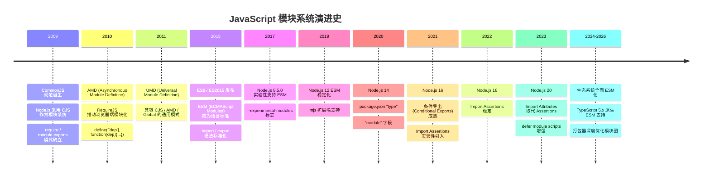
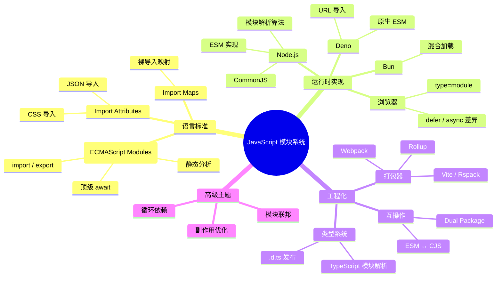

# JavaScript 模块系统深度专题

> 全面剖析 JavaScript/TypeScript 模块系统的核心机制，覆盖 ESM、CommonJS、循环依赖、互操作、模块解析与打包器内部原理。
>
> 目标读者：希望深入理解模块系统底层机制的中高级前端/Node.js 开发者。

---

## 📜 历史演进

JavaScript 的模块系统经历了从无到有的漫长演进，每一次变革都深刻影响了工程化实践。



---

## 🗺️ 全景图



---

## ⚡ ESM vs CJS 快速对比

| 特性 | ESM | CommonJS |
|------|-----|----------|
| **语法** | `import` / `export` | `require` / `module.exports` |
| **加载时机** | 编译时静态分析 | 运行时动态加载 |
| **异步支持** | 原生支持 | 不支持（同步阻塞） |
| **顶层 await** | ✅ 支持 | ❌ 不支持 |
| **Tree Shaking** | ✅ 天然支持 | ⚠️ 需要分析工具 |
| **循环依赖** | 有限支持（绑定不可变） | 部分支持（值拷贝） |
| **this 指向** | `undefined` | `module.exports` |
| **浏览器原生** | ✅ 支持 | ❌ 不支持 |
| **Node.js 支持** | v12+ 稳定 | 原生支持 |
| **文件名扩展** | `.mjs` 或 `"type": "module"` | `.cjs` 或默认 `.js` |

---

## 📑 章节导航

| 章节 | 主题 | 核心内容 |
|------|------|----------|
| [01 - ESM 基础](./01-esm-fundamentals.md) | ESM 核心机制 | `import`/`export` 语法、命名/默认导出、静态分析、Tree Shaking |
| [02 - CJS 内部机制](./02-cjs-internals.md) | CommonJS 原理 | `require` 实现、`module.exports`、模块包装器、缓存机制、循环依赖 |
| [03 - ESM/CJS 互操作](./03-esm-cjs-interop.md) | 互操作与配置 | `.cjs`/`.mjs`、package.json `type`、条件导出、Dual Package Hazard |
| *04 - Import Attributes*（待更新） | 导入属性 | JSON/CSS 导入、`with { type: "json" }`、类型安全 |
| *05 - 循环依赖*（待更新） | 循环依赖 | 检测方法、解决策略、最佳实践、工具辅助 |
| *06 - 模块解析算法*（待更新） | 模块解析 | Node.js 解析规则、Bundler 差异、TypeScript `moduleResolution` |
| *07 - 打包器模块图*（待更新） | 打包器原理 | Rollup/Webpack/Vite 的模块图构建、Code Splitting、Scope Hoisting |
| *08 - Defer 与 Import Maps*（待更新） | 浏览器加载 | `type=module` defer/async 差异、Import Maps 配置、性能优化 |

---

## 🔧 最小可运行示例

### ESM 方式

```js
// math.mjs
export const add = (a, b) => a + b;
export const PI = 3.14159;
export default function multiply(a, b) {
  return a * b;
}

// main.mjs
import multiply, { add, PI } from './math.mjs';
import * as math from './math.mjs';

console.log(add(2, 3));        // 5
console.log(multiply(2, 3));   // 6
console.log(math.PI);          // 3.14159
```

### CommonJS 方式

```js
// math.js
const add = (a, b) => a + b;
const PI = 3.14159;
function multiply(a, b) {
  return a * b;
}

module.exports = { add, PI, multiply };
module.exports.default = multiply;

// main.js
const { add, PI, multiply } = require('./math.js');
const math = require('./math.js');

console.log(add(2, 3));        // 5
console.log(multiply(2, 3));   // 6
console.log(math.PI);          // 3.14159
```

### package.json 配置对比

```json
// ESM 项目
{
  "name": "esm-project",
  "version": "1.0.0",
  "type": "module",
  "exports": {
    ".": {
      "import": "./dist/index.mjs",
      "require": "./dist/index.cjs"
    }
  }
}
```

```json
// CommonJS 项目
{
  "name": "cjs-project",
  "version": "1.0.0",
  "main": "./dist/index.js",
  "exports": {
    ".": {
      "require": "./dist/index.js",
      "import": "./dist/index.mjs"
    }
  }
}
```

---

## 📚 参考资源

- [ECMAScript Modules Specification](https://tc39.es/ecma262/#sec-modules)
- [Node.js Modules Documentation](https://nodejs.org/api/modules.html)
- [Node.js ESM Documentation](https://nodejs.org/api/esm.html)
- [Rollup Module Graph Documentation](https://rollupjs.org/guide/en/#plugins-overview)
- [Vite Dependency Pre-Bundling](https://vitejs.dev/guide/dep-pre-bundling.html)
