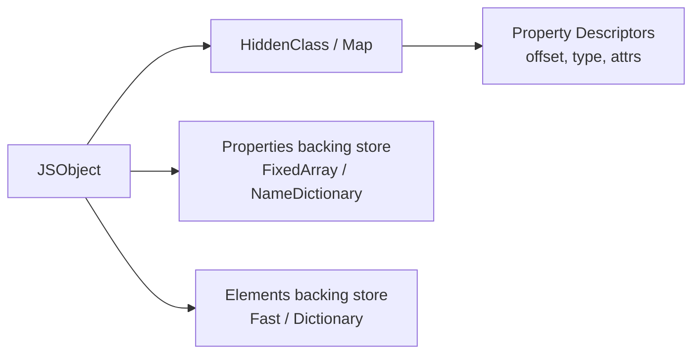
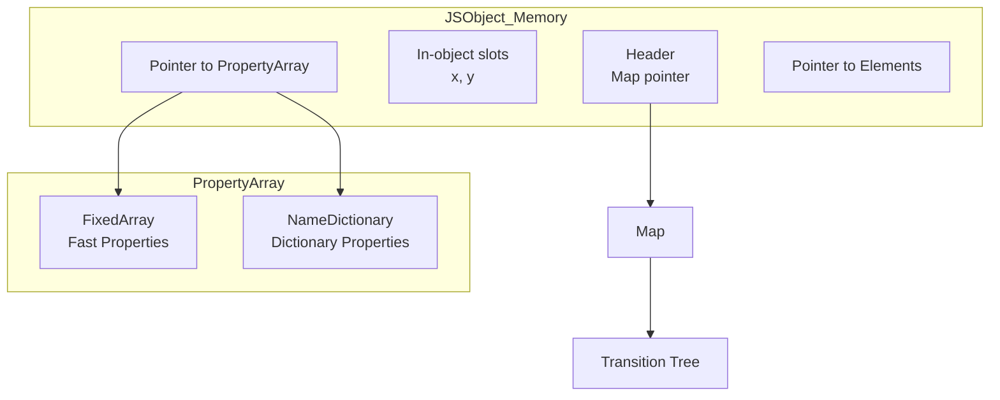
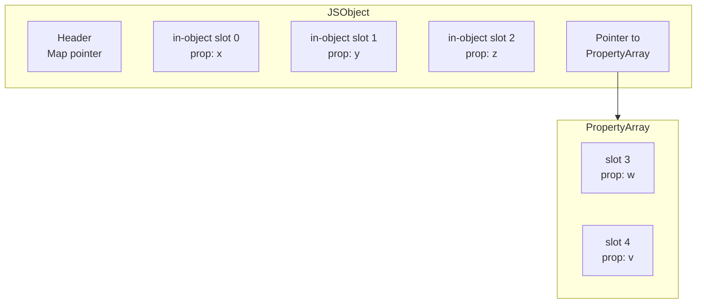
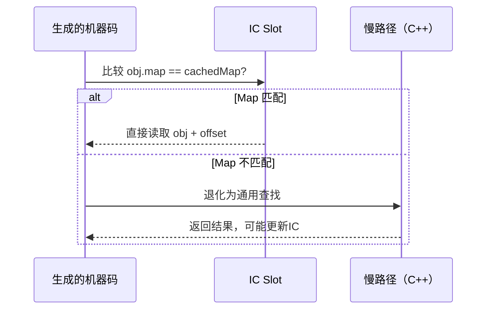

# 01 - 对象基础

## 对象的四种创建方式

### 1. 对象字面量

```js
const o = { x: 1, y: 2 };
```

V8 会将其编译为 `CreateObjectLiteral`，并尝试分配一个已知的 HiddenClass（若形状匹配）。

### 2. `new` 构造函数

```js
function Point(x, y) { this.x = x; this.y = y; }
const p = new Point(1, 2);
```

构造函数首次执行时，V8 会创建一个新的 HiddenClass，并在每次添加属性时进行 **Shape Transition**。

### 3. `Object.create(proto)`

```js
const base = { z: 0 };
const o = Object.create(base);
o.x = 1;
```

创建的对象以 `base` 为 `[[Prototype]]`，自身无属性时可能处于 **空字典模式** 或 **Fast Mode**。

### 4. `class` 实例化

```js
class Point {
  x;
  y;
  constructor(x, y) {
    this.x = x;
    this.y = y;
  }
}
const p = new Point(1, 2);
```

Class 字段声明会预置 Shape，使多个实例共享同一个 HiddenClass。

---

## 属性描述符

JavaScript 属性分为 **数据属性** 与 **访问器属性**：

| 特性 | 数据属性 | 访问器属性 |
|---|---|---|
| `[[Value]]` | ✓ | — |
| `[[Writable]]` | ✓ | — |
| `[[Get]]` | — | ✓ |
| `[[Set]]` | — | ✓ |
| `[[Enumerable]]` | ✓ | ✓ |
| `[[Configurable]]` | ✓ | ✓ |

```js
const obj = {};
Object.defineProperty(obj, 'x', {
  value: 1,
  writable: false,
  enumerable: true,
  configurable: true
});
```

> **引擎提示**：使用 `defineProperty` 动态重定义属性会导致 V8 将对象从 **Fast Mode** 降级为 **Dictionary Mode**（慢属性），因为 HiddenClass 无法表达任意的描述符组合。

---

## Getter / Setter

```js
const user = {
  firstName: 'San',
  lastName: 'Zhang',
  get fullName() {
    return `${this.lastName} ${this.firstName}`;
  },
  set fullName(value) {
    [this.lastName, this.firstName] = value.split(' ');
  }
};
```

访问器属性在 V8 中存储为 **AccessorInfo / AccessorPair**，与普通 Fast Property 分开存放。频繁调用 Getter 会触发 Inline Cache，但跨原型链的 Getter 访问可能退化为 **Megamorphic**。

---

## V8 引擎内部表示：JSObject

### HiddenClass（Map / Shape）

V8 中每个 JSObject 都有一个指向 `Map`（旧称 HiddenClass）的指针。Map 描述了：

- 对象有哪些属性
- 每个属性的偏移量（offset）
- 属性的类型（数据 / 访问器）



### Shape Transition

当向对象添加新属性时，V8 创建一条 **Transition Tree**：

```mermaid
graph TD
    A[Map: {}] -->|add x| B[Map: {x}]
    B -->|add y| C[Map: {x,y}]
    B -->|add z| D[Map: {x,z}]
    C -->|add z| E[Map: {x,y,z}]
```

若对象的 Map 已存在于 Transition Tree 中，新实例可直接复用该 Map，实现 **Monomorphic Inline Cache**。

### Fast Properties vs Dictionary Properties

| 模式 | 存储结构 | 适用场景 | 性能 |
|---|---|---|---|
| Fast | `FixedArray` + 偏移量 | 固定形状、少量属性 | O(1) |
| Dictionary | `NameDictionary` | 大量属性、动态增删 | O(n) |

触发降级到 Dictionary Mode 的典型操作：

- `delete obj.prop`（除最后一个属性外）
- `Object.defineProperty` 使用非默认描述符
- 添加超过 1024 个属性（V8 阈值）

---

## 内存布局图



---

## V8 HiddenClass 深度解析

### HiddenClass（Map）的内部结构

V8 中每个 JSObject 都有一个指向 `Map`（旧称 HiddenClass）的指针。Map 是一个不可变对象，描述了对象的"形状"（Shape）：

```
Map {
  instance_size: 24,           // 对象实例大小（字节）
  inobject_properties: 2,      // 内联属性槽位数
  transitions: {               // 属性添加的Transition树
    "x": Map1,
    "y": Map2
  },
  descriptors: [               // 属性描述符数组
    { key: "x", details: kField, location: kInObject, offset: 0 },
    { key: "y", details: kField, location: kInObject, offset: 1 }
  ],
  back_pointer: parentMap,     // 指向父Map（用于逆Transition）
  instance_type: JS_OBJECT_TYPE
}
```

### Transition Tree 的构建过程

```js
// 创建空对象 → Map0: {}
const obj = {};

// 添加 x → Map1: {x}
obj.x = 1;
// V8 创建新 Map1，包含 x 的偏移量信息
// Map0.transitions["x"] = Map1

// 添加 y → Map2: {x,y}
obj.y = 2;
// V8 创建新 Map2
// Map1.transitions["y"] = Map2

// 另一个对象走相同路径 → 复用已有 Map
const obj2 = {};
obj2.x = 1;  // 直接使用 Map1
obj2.y = 2;  // 直接使用 Map2
```

```mermaid
graph TD
    M0[Map0<br/>{}] -->|add x| M1[Map1<br/>{x}]
    M1 -->|add y| M2[Map2<br/>{x,y}]
    M1 -->|add z| M3[Map3<br/>{x,z}]
    M2 -->|add z| M4[Map4<br/>{x,y,z}]
    M0 -->|add a| M5[Map5<br/>{a}]
```

### 内联属性（In-object Properties）vs 外部属性



| 属性位置 | 访问方式 | 性能 |
|----------|---------|------|
| In-object | 基地址 + 固定偏移 | 最优（一次指针运算） |
| PropertyArray | 解引用 + 偏移 | 良好（多一次内存访问） |
| Dictionary | 哈希查找 | 较慢 |

V8 默认预留 4 个 in-object slots。超过后属性存入外部 `FixedArray`（Fast Properties）。

---

## 属性访问优化：Inline Cache

### Inline Cache（IC）的工作原理

当 V8 首次访问 `obj.x` 时：

1. **检查 obj 的 Map**（`obj->map`）
2. **Map 中查找 "x"** → 获取偏移量 offset
3. **缓存检查结果**：将 `(Map, "x", offset)` 存入 IC slot
4. **后续访问**：只需比较 Map 是否相同，相同则直接按 offset 读取



### IC 状态机

| 状态 | 条件 | 性能 |
|------|------|------|
| **uninitialized** | 首次访问 | 慢（走C++） |
| **premonomorphic** | 第二次访问不同Map | 慢 |
| **monomorphic** | 总是同一Map | 最快（直接比较一个Map） |
| **polymorphic** | ≤4 种不同Map | 较快（线性搜索4个缓存） |
| **megamorphic** | >4 种不同Map | 慢（通用查找） |
| **generic** | 复杂情况（如代理） | 最慢 |

### 触发 IC 退化的操作

```js
// ❌ 1. 运行时修改原型
const obj = { x: 1 };
Object.setPrototypeOf(obj, { y: 2 }); // → Megamorphic

// ❌ 2. 动态添加/删除属性
function createPoint(x, y, z) {
  const p = { x, y };
  if (z !== undefined) p.z = z;  // 条件属性 → 多个Shape
  return p;
}
// 改进：统一属性集
function createPoint(x, y, z) {
  return { x, y, z: z ?? null };  // 统一Shape
}

// ❌ 3. 使用 eval / with
function bad(obj) {
  with (obj) {  // 禁用IC优化
    console.log(x);
  }
}

// ❌ 4. 从字典模式对象读取
const dict = {};
delete dict.x;  // 转为Dictionary Mode
// 后续属性访问均为 Megamorphic
```

---

## 性能对比：直接属性访问 vs 动态描述符

| 操作 | Fast Mode (ops/sec) | Dictionary Mode (ops/sec) | 倍数 |
|---|---|---|---|
| `obj.x` | ~1,500M | ~50M | 30× |
| `obj.x = 1` | ~1,200M | ~40M | 30× |
| `Object.defineProperty` | 降级 | 基准 | — |

```js
// Fast Mode
function fast() {
  const o = { x: 1, y: 2 };
  for (let i = 0; i < 1e6; i++) o.x++;
}

// Dictionary Mode（触发降级）
function slow() {
  const o = { x: 1, y: 2 };
  delete o.y; // 删除非最后属性 → Dictionary
  for (let i = 0; i < 1e6; i++) o.x++;
}
```

### 性能优化最佳实践

```js
// ✅ 1. 预声明所有属性（统一Shape）
class Point {
  x = 0;
  y = 0;
  z = 0;
  constructor(x, y, z) {
    this.x = x;
    this.y = y;
    this.z = z;
  }
}

// ✅ 2. 避免条件属性
// 不好：
function createUser(data) {
  const user = { name: data.name };
  if (data.email) user.email = data.email;
  if (data.phone) user.phone = data.phone;
  return user;
}

// 好：
function createUser(data) {
  return {
    name: data.name,
    email: data.email ?? null,
    phone: data.phone ?? null
  };
}

// ✅ 3. 批量初始化，避免多次Transition
// 不好：
const obj = {};
obj.a = 1;
obj.b = 2;
obj.c = 3;
obj.d = 4;
obj.e = 5;

// 好：
const obj = { a: 1, b: 2, c: 3, d: 4, e: 5 };

// ✅ 4. 使用数组替代字典模式的数字键对象
// 不好：
const sparse = {};
sparse[1000] = 'a';  // Dictionary Mode

// 好：
const dense = [];
dense[1000] = 'a';   // Fast Elements
```

> **最佳实践**：避免在热路径上动态删除属性或使用 `defineProperty` 修改已存在属性的描述符。若需冻结对象，在对象构建完成后一次性使用 `Object.freeze`。保持对象Shape稳定是V8性能优化的核心。

---

## 属性访问模式对比

### 点访问 vs 括号访问

```js
const obj = { name: 'Alice', 'complex-key': 1 };

// 点访问：可被 V8 优化
obj.name;        // 最优
obj.name = 'Bob'; // 最优

// 括号访问字符串字面量：等价于点访问
obj['name'];     // 同样可被优化

// 括号访问变量：难以优化
const key = getKey();
obj[key];        // Megamorphic（键未知）

// 括号访问数字：数组索引优化
obj[0];          // 数组元素优化路径
```

### 对象遍历方式对比

| 方式 | 遍历范围 | 包含继承属性 | 包含Symbol | 性能 |
|------|---------|-------------|-----------|------|
| `for...in` | 可枚举 | ✅ | ❌ | 慢（原型链检查） |
| `Object.keys` | 自身可枚举 | ❌ | ❌ | 快 |
| `Object.values` | 自身可枚举 | ❌ | ❌ | 快 |
| `Object.entries` | 自身可枚举 | ❌ | ❌ | 快 |
| `Object.getOwnPropertyNames` | 自身所有 | ❌ | ❌ | 快 |
| `Object.getOwnPropertySymbols` | 自身Symbol | ❌ | ✅ | 快 |
| `Reflect.ownKeys` | 自身所有 | ❌ | ✅ | 快 |

```js
const obj = { a: 1, b: 2 };
Object.defineProperty(obj, 'c', { value: 3, enumerable: false });
obj[Symbol('d')] = 4;

Object.keys(obj);              // ['a', 'b']
Object.getOwnPropertyNames(obj); // ['a', 'b', 'c']
Reflect.ownKeys(obj);          // ['a', 'b', 'c', Symbol(d)]

// 高效遍历（避免for...in）
for (const [key, value] of Object.entries(obj)) {
  console.log(key, value);
}
```

---

## 高级对象操作

### Object.fromEntries 与 Map 互转

```js
// 从键值对数组创建对象
const entries = [['name', 'Alice'], ['age', 30]];
const obj = Object.fromEntries(entries);
// { name: 'Alice', age: 30 }

// 与 Map 互转
const map = new Map([['x', 1], ['y', 2]]);
const fromMap = Object.fromEntries(map);

// 过滤后重建对象
const filtered = Object.fromEntries(
  Object.entries(obj).filter(([k, v]) => v > 0)
);
```

### 对象代理（Proxy）与 HiddenClass

```js
// Proxy 会禁用 V8 的 HiddenClass 优化
const target = { x: 1, y: 2 };
const proxy = new Proxy(target, {
  get(target, prop) {
    return target[prop];
  }
});

// proxy.x 访问永远无法达到 Monomorphic IC
// 因为每次访问都经过 Proxy 的 get trap
```

| 对象类型 | HiddenClass 支持 | IC 优化 | 适用场景 |
|----------|-----------------|---------|----------|
| 普通对象 | ✅ | ✅ | 绝大多数场景 |
| 数组 | ✅（特殊Elements） | ✅ | 有序集合 |
| Proxy | ❌ | ❌ | 拦截、验证、Observed |
| 冻结对象 | ✅ | ✅ | 常量、配置 |
| Arguments | ✅（特殊） | ⚠️ | 函数参数 |

---

## 小结

- 对象字面量与 Class 实例最容易被 V8 优化为 Fast Mode。
- `delete` 和 `defineProperty` 是 HiddenClass 杀手。
- Inline Cache 是属性访问性能的关键，Monomorphic 状态可达最佳性能。
- 运行时修改原型（`setPrototypeOf`、`__proto__`）会导致 IC 退化为 Megamorphic。
- 预声明所有属性、统一对象Shape是编写高性能JavaScript的核心原则。
- 点访问和字面量括号访问可被优化，变量括号访问导致 Megamorphic。
- `Object.keys`/`Object.entries` 比 `for...in` 更高效且安全。
- Proxy 对象无法利用 HiddenClass 和 IC 优化，在热路径上应谨慎使用。
- Getter/Setter 在自身对象上访问性能接近数据属性，但跨原型链时会显著下降（下一章详解）。

## 对象创建的V8优化路径

### CreateObjectLiteral 优化

当V8遇到对象字面量时，会根据属性键的类型选择不同的优化策略：

```js
// 1. 快速路径：所有键都是字符串字面量，值是常量
const fast = { x: 1, y: 2 };
// V8 使用 CreateObjectLiteral，分配对象时直接设置已知 Map

// 2. 计算属性：降级为通用路径
const key = 'dynamic';
const slow = { [key]: 1 };
// V8 无法预知键名，使用通用对象创建

// 3. 方法字面量：共享 FunctionTemplateInfo
const methods = {
  foo() {},
  bar() {}
};
// 方法函数共享底层代码对象，减少内存占用
```

### 对象克隆的优化方法

```js
// ❌ 慢：展开运算符创建新对象（触发新Transition）
const cloned = { ...original };

// ✅ 快：使用 Object.create 保持原型链
const withProto = Object.create(Object.getPrototypeOf(original));
Object.assign(withProto, original);

// ✅ 快：structuredClone（深拷贝，保留数据结构）
const deepCloned = structuredClone(original);

// ⚠️ 注意：structuredClone 不复制函数和原型链
```

---

## 参考

- [V8 Blog: Fast Properties](https://v8.dev/blog/fast-properties) ⚡
- [V8 Blog: Inline Caching](https://v8.dev/blog/ic-odyssey) ⚡
- [JavaScript Engine Fundamentals](https://mathiasbynens.be/notes/shapes-ics) 📚
- [ECMAScript Specification - Objects](https://tc39.es/ecma262/#sec-objects) 📄
- [V8 Design Elements: Objects](https://v8.dev/docs/objects) ⚡


## 对象操作最佳实践

`js
// 1. 使用对象解构时指定默认值
const { name = 'Unknown', age = 0 } = user;

// 2. 使用可选链安全访问
const city = user?.address?.city ?? 'Unknown';

// 3. 合并对象优先使用展开运算符
const merged = { ...defaults, ...overrides };

// 4. 判断对象为空
const isEmpty = Object.keys(obj).length === 0;

// 5. 安全的对象遍历
for (const [key, value] of Object.entries(obj)) {
  console.log(key, value);
}
``n
---

## 参考

- [V8 Blog: Fast Properties](https://v8.dev/blog/fast-properties) ⚡
- [V8 Blog: Inline Caching](https://v8.dev/blog/ic-odyssey) ⚡
- [JavaScript Engine Fundamentals](https://mathiasbynens.be/notes/shapes-ics) 📚
- [ECMAScript Specification - Objects](https://tc39.es/ecma262/#sec-objects) 📄
- [V8 Design Elements: Objects](https://v8.dev/docs/objects) ⚡
