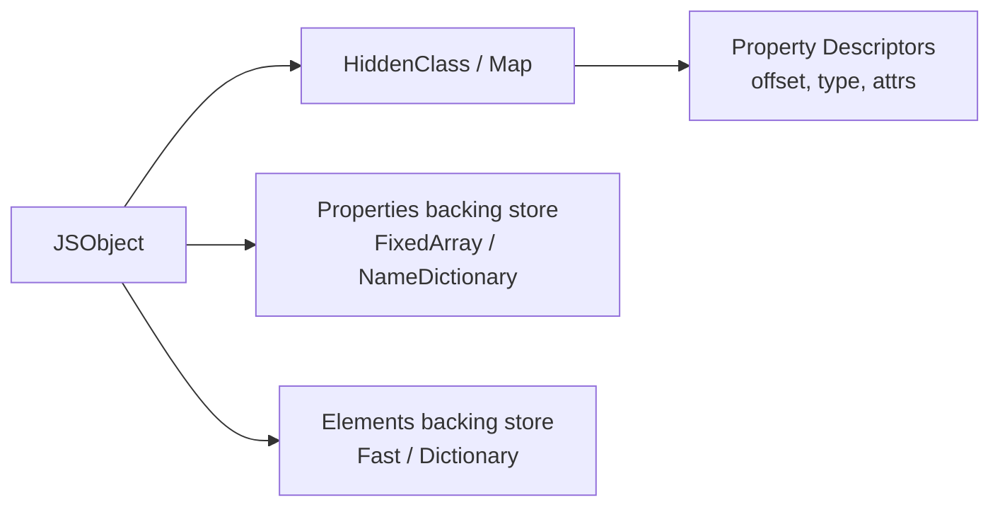
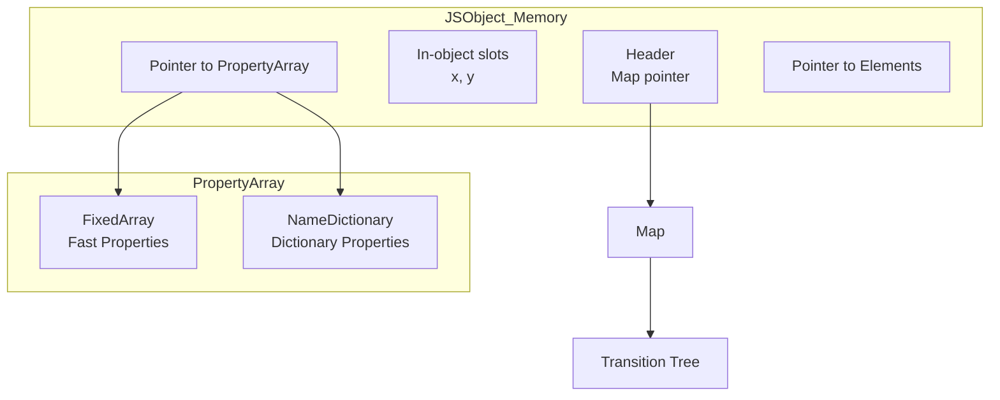

# 01 - 对象基础

## 对象的四种创建方式

### 1. 对象字面量

```js
const o = { x: 1, y: 2 };
```

V8 会将其编译为 `CreateObjectLiteral`，并尝试分配一个已知的 HiddenClass（若形状匹配）。

### 2. `new` 构造函数

```js
function Point(x, y) { this.x = x; this.y = y; }
const p = new Point(1, 2);
```

构造函数首次执行时，V8 会创建一个新的 HiddenClass，并在每次添加属性时进行 **Shape Transition**。

### 3. `Object.create(proto)`

```js
const base = { z: 0 };
const o = Object.create(base);
o.x = 1;
```

创建的对象以 `base` 为 `[[Prototype]]`，自身无属性时可能处于 **空字典模式** 或 **Fast Mode**。

### 4. `class` 实例化

```js
class Point {
  x;
  y;
  constructor(x, y) {
    this.x = x;
    this.y = y;
  }
}
const p = new Point(1, 2);
```

Class 字段声明会预置 Shape，使多个实例共享同一个 HiddenClass。

---

## 属性描述符

JavaScript 属性分为 **数据属性** 与 **访问器属性**：

| 特性 | 数据属性 | 访问器属性 |
|---|---|---|
| `[[Value]]` | ✓ | — |
| `[[Writable]]` | ✓ | — |
| `[[Get]]` | — | ✓ |
| `[[Set]]` | — | ✓ |
| `[[Enumerable]]` | ✓ | ✓ |
| `[[Configurable]]` | ✓ | ✓ |

```js
const obj = {};
Object.defineProperty(obj, 'x', {
  value: 1,
  writable: false,
  enumerable: true,
  configurable: true
});
```

> **引擎提示**：使用 `defineProperty` 动态重定义属性会导致 V8 将对象从 **Fast Mode** 降级为 **Dictionary Mode**（慢属性），因为 HiddenClass 无法表达任意的描述符组合。

---

## Getter / Setter

```js
const user = {
  firstName: 'San',
  lastName: 'Zhang',
  get fullName() {
    return `${this.lastName} ${this.firstName}`;
  },
  set fullName(value) {
    [this.lastName, this.firstName] = value.split(' ');
  }
};
```

访问器属性在 V8 中存储为 **AccessorInfo / AccessorPair**，与普通 Fast Property 分开存放。频繁调用 Getter 会触发 Inline Cache，但跨原型链的 Getter 访问可能退化为 **Megamorphic**。

---

## V8 引擎内部表示：JSObject

### HiddenClass（Map / Shape）

V8 中每个 JSObject 都有一个指向 `Map`（旧称 HiddenClass）的指针。Map 描述了：

- 对象有哪些属性
- 每个属性的偏移量（offset）
- 属性的类型（数据 / 访问器）



### Shape Transition

当向对象添加新属性时，V8 创建一条 **Transition Tree**：

```mermaid
graph TD
    A[Map: {}] -->|add x| B[Map: {x}]
    B -->|add y| C[Map: {x,y}]
    B -->|add z| D[Map: {x,z}]
    C -->|add z| E[Map: {x,y,z}]
```

若对象的 Map 已存在于 Transition Tree 中，新实例可直接复用该 Map，实现 **Monomorphic Inline Cache**。

### Fast Properties vs Dictionary Properties

| 模式 | 存储结构 | 适用场景 | 性能 |
|---|---|---|---|
| Fast | `FixedArray` + 偏移量 | 固定形状、少量属性 | O(1) |
| Dictionary | `NameDictionary` | 大量属性、动态增删 | O(n) |

触发降级到 Dictionary Mode 的典型操作：

- `delete obj.prop`（除最后一个属性外）
- `Object.defineProperty` 使用非默认描述符
- 添加超过 1024 个属性（V8 阈值）

---

## 内存布局图



---

## 性能对比：直接属性访问 vs 动态描述符

| 操作 | Fast Mode (ops/sec) | Dictionary Mode (ops/sec) | 倍数 |
|---|---|---|---|
| `obj.x` | ~1,500M | ~50M | 30× |
| `obj.x = 1` | ~1,200M | ~40M | 30× |
| `Object.defineProperty` | 降级 | 基准 | — |

```js
// Fast Mode
function fast() {
  const o = { x: 1, y: 2 };
  for (let i = 0; i < 1e6; i++) o.x++;
}

// Dictionary Mode（触发降级）
function slow() {
  const o = { x: 1, y: 2 };
  delete o.y; // 删除非最后属性 → Dictionary
  for (let i = 0; i < 1e6; i++) o.x++;
}
```

> **最佳实践**：避免在热路径上动态删除属性或使用 `defineProperty` 修改已存在属性的描述符。若需冻结对象，在对象构建完成后一次性使用 `Object.freeze`。

---

## 小结

- 对象字面量与 Class 实例最容易被 V8 优化为 Fast Mode。
- `delete` 和 `defineProperty` 是 HiddenClass 杀手。
- Getter/Setter 在自身对象上访问性能接近数据属性，但跨原型链时会显著下降（下一章详解）。
