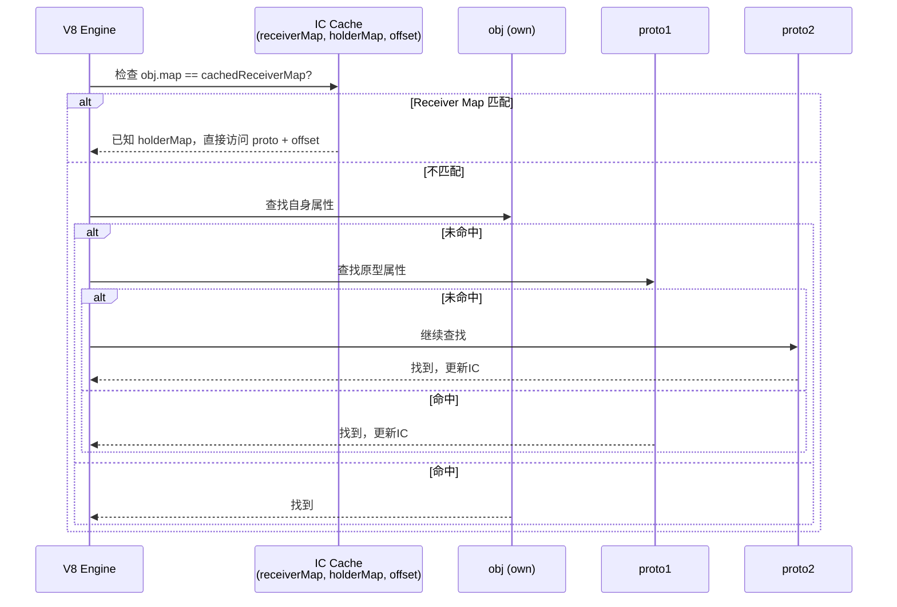

# 02 - 原型链深度

## `[[Prototype]]` 内部槽

每个 JavaScript 对象都有一个不可直接访问的内部槽 `[[Prototype]]`，可通过以下方式操作：

```js
const a = {};
const b = { x: 1 };

// 标准方式
Object.setPrototypeOf(a, b); // 修改原型，性能代价大
Object.getPrototypeOf(a) === b; // true

// 遗留方式（已弃用，但引擎广泛支持）
a.__proto__ === b; // true
```

> **引擎提示**：`Object.setPrototypeOf` 或 `__proto__` 会强制 V8 将对象标记为 **Prototype Mutation**，该对象的 Inline Cache 会被重置，后续属性访问退化为 **Megamorphic**。

---

## 原型链构建：Object.create

```js
const animal = { eats: true };
const rabbit = Object.create(animal);
rabbit.jumps = true;

// 原型链：rabbit → animal → Object.prototype → null
```

```mermaid
graph LR
    rabbit[rabbit<br/>{ jumps: true }] --> animal[animal<br/>{ eats: true }]
    animal --> obj[Object.prototype]
    obj --> null[null]
```

---

## 属性查找算法

当访问 `obj.prop` 时，引擎执行以下步骤：

1. 检查 `obj` 自身的 **Fast Properties / Dictionary**。
2. 若未命中，沿 `[[Prototype]]` 向上遍历。
3. 每访问一层原型，检查该原型的 Map 与属性。
4. 到达原型链末端仍未命中 → 返回 `undefined`（或触发 Setter/Proxy 拦截）。

```mermaid
sequenceDiagram
    participant Engine as V8 Engine
    participant O1 as obj (own)
    participant O2 as proto1
    participant O3 as proto2
    participant End as undefined

    Engine->>O1: Load IC: check Map + offset
    alt Hit
        O1-->>Engine: return value
    else Miss
        Engine->>O2: Load IC: check proto's Map
        alt Hit
            O2-->>Engine: return value
        else Miss
            Engine->>O3: Load IC: check proto2's Map
            alt Hit
                O3-->>Engine: return value
            else Miss
                Engine->>End: return undefined
            end
        end
    end
```

### V8 原型链 Inline Cache

V8 使用 **Polymorphic Load IC** 缓存原型链查找：

- **Monomorphic**：原型链上的每个对象 Map 都固定，可缓存完整查找路径。
- **Polymorphic**：原型链形状有少量变体（通常 ≤ 4），仍可走 IC。
- **Megamorphic**：频繁修改原型或属性布局，IC 失效，退化为通用 C++ 查找。

---

## 原型污染（Prototype Pollution）

攻击者通过污染 `Object.prototype` 上的属性，影响所有对象：

```js
// 危险代码（如解析不可信 JSON 或合并对象）
const malicious = JSON.parse('{"__proto__": {"isAdmin": true}}');
const victim = {};
merge(victim, malicious); // 若 merge 未防护
console.log(victim.isAdmin); // true
```

### 防护策略

| 策略 | 实现 | 代价 |
|---|---|---|
| 拒绝 `__proto__` 键 | `if (key === '__proto__') continue` | 低 |
| 使用 `Object.create(null)` | 无原型对象 | 失去基础方法 |
| 使用 `Object.defineProperty` 冻结原型 | `Object.freeze(Object.prototype)` | 彻底，但可能破坏库 |
| 使用 `Object.hasOwn` / `hasOwnProperty` | 只信任自身属性 | 代码侵入性 |
| `structuredClone` / JSON 解析后白名单过滤 | 事前过滤 | 安全最高 |

```js
// 安全 merge 示例
function safeMerge(target, source) {
  for (const key of Object.keys(source)) {
    if (key === '__proto__' || key === 'constructor') continue;
    if (Object.hasOwn(source, key)) {
      target[key] = source[key];
    }
  }
  return target;
}
```

---

## 内存图：原型链的 V8 表示

```mermaid
graph TB
    subgraph Instance
        R[rabbit JSObject]
        R_Map[Map: {jumps}]
    end

    subgraph Prototype1
        A[animal JSObject]
        A_Map[Map: {eats}]
    end

    subgraph Prototype2
        O[Object.prototype]
        O_Map[Map: {...built-ins}]
    end

    R -->|[[Prototype]]| A
    R --> R_Map
    A -->|[[Prototype]]| O
    A --> A_Map
    O -->|[[Prototype]]| NULL[null]
    O --> O_Map
```

> V8 中，原型对象本身也是 JSObject，有自己的 Map。修改原型对象的属性（如给 `animal` 添加新属性）会使所有以 `animal` 为原型的实例的 **Load IC 失效**，因为原型链的 Shape 发生了变化。

---

## Inline Cache 与原型链

### 原型链访问的 IC 优化

V8 对原型链属性访问使用 **Polymorphic Load IC**，缓存完整的查找路径：



### Prototype IC 的状态转换

| 场景 | IC 状态 | 说明 |
|------|---------|------|
| 原型链固定，属性位置固定 | Monomorphic | 最优，直接比较 receiver Map |
| 多个对象共享同一原型链 | Monomorphic | 只要 receiver Map 相同即可 |
| 原型链有少量变体（≤4） | Polymorphic | 线性搜索缓存 |
| 运行时修改原型对象属性 | Megamorphic | IC 失效，通用查找 |
| 运行时修改实例原型 | Megamorphic | IC 失效 |

### 原型修改对 IC 的影响

```js
// 创建原型链
const proto = { x: 1 };
const obj1 = Object.create(proto);
const obj2 = Object.create(proto);

// 首次访问：建立 Monomorphic IC
obj1.x;  // IC: (obj1.map, proto.map, offset)

// 从原型删除属性 → IC 失效！
delete proto.x;
obj1.x;  // Megamorphic，所有相关对象的 IC 都被清除

// 给原型添加新属性 → 同样失效
proto.y = 2;
obj2.y;  // 需要重新建立 IC
```

> **关键洞察**：原型对象的 Map 变化会触发 **prototype invalidation**，所有以该对象为原型的实例的 Load IC 都会被重置。

---

## 性能对比：自身属性 vs 原型链属性

| 访问类型 | Inline Cache 状态 | 相对性能 |
|---|---|---|
| 自身 Fast 属性 | Monomorphic | 1.0×（基准） |
| 自身 Dictionary 属性 | Megamorphic | 0.03× |
| 原型链 1 层 | Monomorphic | 0.7× |
| 原型链 2+ 层 | Polymorphic | 0.4× |
| 原型链频繁修改 | Megamorphic | 0.05× |

```js
// 基准：自身属性
function ownProp(obj) {
  let s = 0;
  for (let i = 0; i < 1e7; i++) s += obj.x;
  return s;
}

// 原型链 1 层
function proto1(obj) {
  let s = 0;
  for (let i = 0; i < 1e7; i++) s += obj.x;
  return s;
}
const base = { x: 1 };
const child = Object.create(base);

// 原型链 2 层
const grand = { x: 1 };
const parent = Object.create(grand);
const self = Object.create(parent);
```

### 原型链性能优化建议

```js
// ❌ 避免：运行时修改原型
class Animal {}
Animal.prototype.speak = function() {};  // 类定义后修改

// ✅ 推荐：一次性定义完整原型
class Animal {
  speak() {}
  walk() {}
  eat() {}
}

// ❌ 避免：过深的原型链（>3层）
const level4 = Object.create(Object.create(Object.create(Object.create({}))));

// ✅ 推荐：扁平化继承，使用组合替代深层继承
const behaviors = {
  flyable: { fly() {} },
  swimmable: { swim() {} }
};
Object.assign(Bird.prototype, behaviors.flyable);

// ✅ 推荐：方法查找缓存模式
function processItems(items, methodName) {
  // 缓存方法引用，避免原型链重复查找
  const method = items[0]?.constructor.prototype[methodName];
  for (const item of items) {
    method.call(item);
  }
}
```

> **关键结论**：原型链访问比自身属性慢约 30%–60%，但仍远快于字典模式。真正的性能杀手是 **运行时修改原型**（`setPrototypeOf`、给原型动态添加属性），这会导致所有相关 IC 失效。

---

## 原型链的实际应用

### 对象池与原型复用

```js
// 使用原型链实现高效对象池
const baseEntity = {
  createdAt: null,
  updatedAt: null,

  init() {
    this.createdAt = new Date();
    this.updatedAt = this.createdAt;
    return this;
  },

  touch() {
    this.updatedAt = new Date();
    return this;
  }
};

const userPrototype = Object.create(baseEntity);
userPrototype.role = 'guest';
userPrototype.greet = function() {
  return `Hello, ${this.name || 'Guest'}`;
};

// 对象池：复用原型，减少内存
const pool = [];
function createUser(name) {
  const user = pool.pop() || Object.create(userPrototype);
  user.name = name;
  user.init();
  return user;
}

function recycleUser(user) {
  user.name = null;
  pool.push(user);
}

const u1 = createUser('Alice');
console.log(u1.greet()); // Hello, Alice
console.log(u1.createdAt); // 来自原型链的 baseEntity
```

### 原型链实现多重继承的替代方案

```js
// 使用原型链组合多个来源
function combinePrototypes(...sources) {
  const combined = {};

  for (const source of sources) {
    const proto = typeof source === 'function' ? source.prototype : source;
    Object.assign(combined, proto);
  }

  return combined;
}

const CanWalk = { walk() { return 'walking'; } };
const CanSwim = { swim() { return 'swimming'; } };
const CanFly = { fly() { return 'flying'; } };

// 鸭子：能走能游
function Duck() {}
Duck.prototype = Object.create(
  combinePrototypes(CanWalk, CanSwim)
);
Duck.prototype.quack = function() { return 'quack!'; };

const duck = new Duck();
duck.walk(); // walking
duck.swim(); // swimming
```

---

## 高级原型污染防护

### 深层对象合并的安全实现

```js
// 危险：未防护的深合并
function unsafeDeepMerge(target, source) {
  for (const key in source) {
    if (typeof source[key] === 'object' && source[key] !== null) {
      target[key] = unsafeDeepMerge(target[key] || {}, source[key]);
    } else {
      target[key] = source[key];
    }
  }
  return target;
}

// 攻击：
unsafeDeepMerge({}, JSON.parse('{"__proto__": {"isAdmin": true}}'));
console.log({}.isAdmin); // true 😱

// 安全：使用 Object.create(null) 和 hasOwn
function safeDeepMerge(target, source) {
  for (const key of Object.keys(source)) {
    if (key === '__proto__' || key === 'constructor') continue;

    const value = source[key];
    if (value && typeof value === 'object' && !Array.isArray(value)) {
      target[key] = safeDeepMerge(
        Object.prototype.toString.call(target[key]) === '[object Object]'
          ? target[key] : {},
        value
      );
    } else {
      target[key] = value;
    }
  }
  return target;
}
```

### 框架级防护：禁止原型扩展

```js
// 在应用启动时冻结所有内置原型
export function freezePrototypes() {
  const prototypes = [
    Object.prototype,
    Array.prototype,
    Function.prototype,
    String.prototype,
    Number.prototype,
    Boolean.prototype
  ];

  for (const proto of prototypes) {
    Object.freeze(proto);
  }
}

// 注意：这可能会破坏某些库（如旧版polyfill）
// 推荐在测试环境使用，生产环境谨慎使用
```

### JSON 解析的安全封装

```js
function safeJSONParse(json, reviver) {
  const forbiddenKeys = ['__proto__', 'constructor', 'prototype'];

  return JSON.parse(json, (key, value) => {
    if (forbiddenKeys.includes(key)) {
      console.warn(`Forbidden key "${key}" removed from parsed JSON`);
      return undefined;
    }
    return reviver ? reviver(key, value) : value;
  });
}

// 使用
const data = safeJSONParse(untrustedJson);
```

---

## 小结

- `[[Prototype]]` 是内部槽，`__proto__` 是其遗留访问器。
- 原型链查找可被 V8 Inline Cache 加速，前提是原型链结构稳定。
- **永远不要**在热路径上调用 `Object.setPrototypeOf`。
- 原型对象的 Map 变化会触发 prototype invalidation，影响所有实例的 IC。
- 原型污染是真实的安全威胁，处理不可信数据时必须使用 `Object.hasOwn` 或 `Object.create(null)`。
- 扁平化原型链、一次性定义完整原型、缓存方法引用是原型链性能优化的关键。

---

## 原型链调试技巧

### 使用 DevTools 查看原型链

```js
const animal = { eats: true };
const rabbit = Object.create(animal);
rabbit.jumps = true;

// Chrome DevTools Console:
// > rabbit
// ▼ {jumps: true}
//   jumps: true
//   ▶ [[Prototype]]: Object        ← 展开查看原型链
//     eats: true
//     ▶ [[Prototype]]: Object
//       ▶ constructor: f Object()
//       ▶ ...
//       ▶ [[Prototype]]: null
```

### 程序化遍历原型链

```js
function getPrototypeChain(obj) {
  const chain = [];
  let current = obj;

  while (current !== null) {
    const descriptors = Object.getOwnPropertyDescriptors(current);
    chain.push({
      constructor: current.constructor?.name || 'Object.prototype',
      ownKeys: Reflect.ownKeys(current),
      descriptors
    });
    current = Object.getPrototypeOf(current);
  }

  return chain;
}

// 使用
const chain = getPrototypeChain(new Date());
// [Date实例, Date.prototype, Object.prototype]
```

### 检测属性来源

```js
function whereIsProperty(obj, prop) {
  let current = obj;
  let depth = 0;

  while (current !== null) {
    if (Object.hasOwn(current, prop)) {
      return {
        found: true,
        depth,
        onPrototype: depth > 0,
        descriptor: Object.getOwnPropertyDescriptor(current, prop)
      };
    }
    current = Object.getPrototypeOf(current);
    depth++;
  }

  return { found: false };
}

whereIsProperty(rabbit, 'jumps');  // { found: true, depth: 0, onPrototype: false }
whereIsProperty(rabbit, 'eats');   // { found: true, depth: 1, onPrototype: true }
whereIsProperty(rabbit, 'toString'); // { found: true, depth: 2, onPrototype: true }
```

---

## 参考

- [V8 Blog: Prototypes](https://v8.dev/blog/fast-properties#prototype) ⚡
- [MDN: Object.prototype](https://developer.mozilla.org/en-US/docs/Web/JavaScript/Reference/Global_Objects/Object/prototype) 📘
- [JavaScript.info: Prototype Inheritance](https://javascript.info/prototype-inheritance) 📚
- [Prototype Pollution Prevention](https://learn.snyk.io/lesson/prototype-pollution/) 🔒
