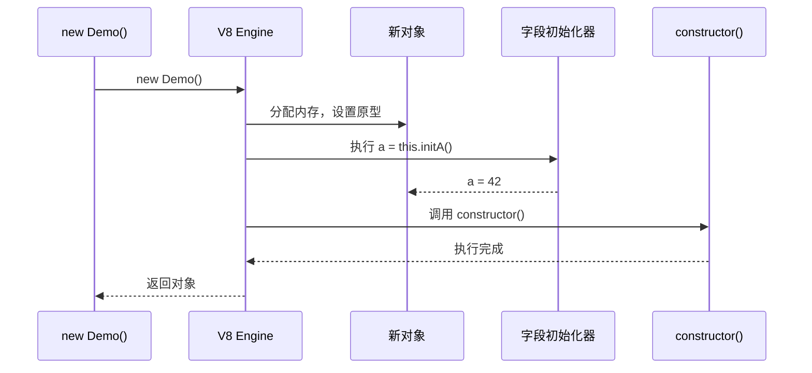

# 03 - Class 语法糖 vs 原型

## ES6 Class 的本质

`class` 在 JavaScript 中并非引入新的对象模型，而是 **原型继承的语法糖**：

```js
class Point {
  constructor(x, y) {
    this.x = x;
    this.y = y;
  }
  move(dx, dy) {
    this.x += dx;
    this.y += dy;
  }
}

// 大致等价于
function Point(x, y) {
  this.x = x;
  this.y = y;
}
Point.prototype.move = function(dx, dy) {
  this.x += dx;
  this.y += dy;
};
```

但存在**关键语义差异**：

1. Class 只能通过 `new` 调用（内部 `[[Call]]` 会抛错）。
2. Class 方法不可枚举（`enumerable: false`）。
3. Class 构造函数内部没有 `prototype` 属性被重新绑定的问题。

---

## Class 继承链

```js
class Animal {
  constructor(name) { this.name = name; }
  speak() { console.log(`${this.name} says`); }
}

class Dog extends Animal {
  constructor(name, breed) {
    super(name); // 必须！
    this.breed = breed;
  }
  speak() {
    super.speak(); // 调用父类原型方法
    console.log('Woof!');
  }
}
```

### `extends` 的底层

`extends` 会做三件事：

1. 设置 `Dog.prototype.__proto__ = Animal.prototype`
2. 设置 `Dog.__proto__ = Animal`（静态继承）
3. 在 `Dog` 内部注入 `super` 绑定

```mermaid
graph TB
    subgraph 实例层
        D[d: Dog<br/>{ name, breed }]
    end
    subgraph 原型层
        DP[Dog.prototype<br/>{ speak, constructor }]
        AP[Animal.prototype<br/>{ speak, constructor }]
        OP[Object.prototype]
    end
    subgraph 构造函数层
        D_C[Dog 构造函数]
        A_C[Animal 构造函数]
        O_C[Object]
    end

    D -->|[[Prototype]]| DP
    DP -->|[[Prototype]]| AP
    AP -->|[[Prototype]]| OP

    D_C -->|[[Prototype]]| A_C
    A_C -->|[[Prototype]]| O_C

    DP -.->|constructor| D_C
    AP -.->|constructor| A_C
```

> **注意**：`super()` 在派生构造函数中必须在使用 `this` 之前调用，因为派生类的实例对象实际上是由基类构造函数分配的（`Reflect.construct` 语义）。

---

## `super` 关键字

`super` 有两种用法：

| 场景 | 语义 | V8 实现 |
|---|---|---|
| `super(args)` | 调用父类构造函数 | 通过 `[[HomeObject]]` 找到基类，执行 `Reflect.construct` |
| `super.method()` | 调用父类原型方法 | 通过 `[[HomeObject]].__proto__` 定位方法，绑定 `this` |

```js
class A {
  foo() { return 1; }
}
class B extends A {
  foo() {
    // V8 内部：B.prototype.__proto__.foo.call(this)
    return super.foo() + 1;
  }
}
```

`super` 的绑定是静态的（在类定义时通过 `[[HomeObject]]` 确定），因此 **无法脱离方法上下文** 使用：

```js
const b = new B();
const fn = b.foo;
fn(); // TypeError: 无法确定 super 绑定
```

---

## `new.target`

`new.target` 指向**被 `new` 调用的原始构造函数**，常用于抽象基类或构建工厂：

```js
class AbstractShape {
  constructor() {
    if (new.target === AbstractShape) {
      throw new TypeError('Cannot instantiate abstract class directly');
    }
  }
}

class Circle extends AbstractShape {
  constructor(r) {
    super();
    this.r = r;
  }
}

new AbstractShape(); // TypeError
new Circle(1); // OK
```

在 V8 中，`new.target` 作为调用帧的一个内部插槽存储，几乎零运行时开销。

---

## Class vs 原型函数对比表

| 特性 | Class | 传统构造函数 |
|---|---|---|
| 调用方式 | 必须 `new` | `new` 或普通调用 |
| 方法枚举性 | 不可枚举 | 默认可枚举 |
| 原型链设置 | `extends` 自动处理 | 手动 `Object.create` |
| 静态继承 | `extends` 继承静态方法 | 无原生支持 |
| 内部方法 `[[Call]]` | 抛 TypeError | 执行函数体 |
| V8 优化识别 | 更易被识别为构造函数，IC 更稳定 | 需通过调用模式推断 |

---

## V8 对 Class 的优化

由于 Class 的语义更严格，V8 可以进行更强的假设：

1. **构造函数识别**：Class 构造函数不会被当作普通函数调用，减少了 `[[Call]]` 与 `[[Construct]]` 的分歧。
2. **Shape 预置**：字段声明（Public Class Fields）使 V8 在实例创建前即可确定 Map，多个实例共享同一 HiddenClass。
3. **IC 稳定性**：`super` 绑定在定义时固定，原型链查找路径在类加载后通常不变。

```mermaid
graph LR
    subgraph Class Optimization
        C1[Class Circle<br/>fields: r]
        C2[instance c1]
        C3[instance c2]
        Map[Shared Map<br/>{ r }]
    end

    C2 --> Map
    C3 --> Map
    Map --> C1
```

---

## ES6 Class 内部实现细节

### Class 的初始化过程

当执行 `new MyClass(args)` 时，V8 内部执行以下步骤：

```
1. 检查 MyClass 是否可被 new（ClassConstructor 标记）
2. 创建新对象 obj
3. 设置 obj.[[Prototype]] = MyClass.prototype
4. 创建 this 绑定
5. 执行 Class 字段初始化器（按声明顺序）
6. 执行 constructor 函数体
7. 返回 obj（除非 constructor 显式返回对象）
```

### Class 字段的初始化时机

```js
class Demo {
  // 步骤1：字段初始化器在 constructor 之前执行
  a = this.initA();  // 可在字段初始化器中使用 this

  constructor() {
    // 步骤2：constructor 执行
    console.log(this.a); // 已初始化
  }

  initA() {
    return 42;
  }
}
```



### 静态块（Static Block）

ES2022 引入的静态块用于复杂的静态初始化：

```js
class Config {
  static settings = new Map();
  static env = process.env.NODE_ENV;

  static {
    // 静态块：类加载时执行一次
    this.settings.set('apiUrl', this.env === 'production'
      ? 'https://api.prod.com'
      : 'http://localhost:3000'
    );
    this.settings.set('timeout', 5000);

    // 可以访问 this、super
    console.log('Config initialized');
  }

  static {
    // 多个静态块按声明顺序执行
    this.settings.set('version', '1.0.0');
  }
}

console.log(Config.settings.get('apiUrl'));
```

| 特性 | 静态字段 | 静态块 |
|------|---------|--------|
| 执行时机 | 类加载时 | 类加载时 |
| 可执行复杂逻辑 | ❌ 仅限表达式 | ✅ 完整语句块 |
| 可访问 this | ✅ | ✅ |
| 可访问 super | ❌ | ✅ |

---

## `super` 绑定深度解析

### `[[HomeObject]]` 内部槽

每个方法在定义时都会被赋予一个 `[[HomeObject]]` 内部槽，指向定义该方法的对象：

```js
const obj = {
  home: 'obj',
  method() {
    // [[HomeObject]] = obj
    console.log(super.home); // 通过 [[HomeObject]].__proto__ 查找
  }
};

// 等价于引擎内部：
// obj.method.__protoHomeObject__ = obj
```

### `super` 的两种调用路径

```js
class Parent {
  constructor(name) { this.name = name; }
  greet() { return `Hello, ${this.name}`; }
  static create(name) { return new this(name); }
}

class Child extends Parent {
  constructor(name, age) {
    // super(args) 路径：
    // 1. 通过 [[HomeObject]]（Child.prototype）获取 .__proto__（Parent.prototype）
    // 2. 获取 Parent.prototype.constructor
    // 3. 使用 Reflect.construct 创建实例，绑定 this
    super(name);  // → Parent.prototype.constructor.call(this, name)
    this.age = age;
  }

  greet() {
    // super.method() 路径：
    // 1. 通过 [[HomeObject]]（Child.prototype）获取 .__proto__（Parent.prototype）
    // 2. 在 Parent.prototype 上查找 greet
    // 3. 使用 [[GetPrototypeOf]](this) 作为 receiver 调用
    return super.greet() + ` (${this.age})`;
    // 内部等效：Child.prototype.__proto__.greet.call(this)
  }

  static create(name, age) {
    // super 在静态方法中：
    // [[HomeObject]] = Child（构造函数本身）
    // Child.__proto__ = Parent
    const instance = super.create(name);
    instance.age = age;
    return instance;
  }
}
```

### super 绑定不可提取的原因

```js
class A { foo() { return 'A'; } }
class B extends A { foo() { return super.foo() + 'B'; } }

const b = new B();
const extracted = b.foo;

// 错误情况分析：
// extracted() 时，this 可能是 global 或 undefined（严格模式）
// 但 super 绑定是在定义时固定的：
// b.foo.[[HomeObject]] = B.prototype
// 即使 extracted 被调用，引擎仍知道 super 指向 B.prototype.__proto__
// 问题在于：super.foo() 需要 this 来执行，但 extracted 调用时 this 丢失

extracted(); // TypeError: 无法确定 super 绑定（实际上是 this 绑定问题）
```

### 箭头函数与 super

```js
class Base {
  value = 10;
  getValue() { return this.value; }
}

class Derived extends Base {
  arrow = () => super.getValue();

  method() {
    // 箭头函数没有自己的 this/super，继承 enclosing scope
    const arrow = () => super.getValue();
    return arrow();
  }
}

const d = new Derived();
console.log(d.arrow()); // 10 ✅
// 箭头函数不绑定 this，但 super 仍通过 [[HomeObject]] 解析
```

---

## 性能对比：实例化开销

| 方式 | 单次实例化耗时 (ns) | Shape 稳定性 |
|---|---|---|
| 对象字面量 | ~8 | 高 |
| Class `new` | ~12 | 高（字段预声明） |
| 构造函数 `new` | ~10 | 中（动态添加） |
| `Object.create` + 赋值 | ~25 | 低（通常字典模式） |

```js
// 推荐：Class 字段预声明，确保 Monomorphic IC
class FastPoint {
  x = 0;
  y = 0;
  constructor(x, y) {
    this.x = x;
    this.y = y;
  }
}

// 不推荐：构造函数内动态添加属性可能导致 Transition 链过长
function SlowPoint(x, y) {
  this.x = x;
  this.y = y;
  if (x > 0) this.z = 0; // 条件属性 → 多个 Shape
}
```

### Class 字段初始化 vs 构造函数赋值

```js
// 方式1：字段初始化器
class WithFields {
  x = 0;  // 编译为在 constructor 开头执行
  y = 0;
  constructor(x, y) {
    this.x = x;
    this.y = y;
  }
}

// 方式2：纯构造函数
class WithoutFields {
  constructor(x, y) {
    this.x = x;  // 动态添加属性，触发 Transition
    this.y = y;
  }
}

// 性能差异：
// WithFields: V8 在解析类时就知道了所有字段，创建优化 Map
// WithoutFields: 每次添加属性都要检查/创建 Transition
```

### 静态方法与实例方法的 IC 差异

```js
class Utils {
  static format(value) { return value.toFixed(2); }
  instanceFormat(value) { return value.toFixed(2); }
}

// 静态方法：直接通过 Utils 对象访问，Monomorphic
Utils.format(1.5);  // 最优

// 实例方法：通过原型链访问，但 Shape 固定
const u = new Utils();
u.instanceFormat(1.5);  // 接近最优（多一次原型查找）
```

---

## Class 的编译产物分析

### Babel 编译后的 Class

```js
// 源代码
class Point {
  x = 0;
  y = 0;
  constructor(x, y) {
    this.x = x;
    this.y = y;
  }
  distance(other) {
    return Math.hypot(this.x - other.x, this.y - other.y);
  }
}
```

```js
// Babel 编译后（简化）
function _classCallCheck(instance, Constructor) {
  if (!(instance instanceof Constructor)) {
    throw new TypeError('Cannot call a class as a function');
  }
}

var Point = /*#__PURE__*/ function () {
  function Point(x, y) {
    _classCallCheck(this, Point);
    this.x = 0;      // 字段初始化
    this.y = 0;
    this.x = x;      // constructor 赋值
    this.y = y;
  }

  Point.prototype.distance = function distance(other) {
    return Math.hypot(this.x - other.x, this.y - other.y);
  };

  return Point;
}();
```

### TypeScript 编译后的 Class（ES5目标）

```typescript
// 源代码
class Animal {
  private name: string;
  constructor(name: string) {
    this.name = name;
  }
  move(distance: number): void {
    console.log(`${this.name} moved ${distance}m`);
  }
}
```

```js
// TypeScript 编译后
var Animal = /** @class */ (function () {
  function Animal(name) {
    this.name = name;
  }
  Animal.prototype.move = function (distance) {
    console.log(this.name + " moved " + distance + "m");
  };
  return Animal;
}());
```

> **注意**：现代项目应直接以 ES2022+ 为目标编译，避免 Babel/TS 的 class 转换开销。

---

## Class 与原型函数的全面对比

| 特性 | ES6 Class | 传统构造函数 | 工厂函数 |
|------|-----------|-------------|----------|
| 语法 | `class` + `extends` | `function` + `prototype` | 普通函数返回对象 |
| `new` 必需 | ✅ 强制 | ❌ 可选 | ❌ 不适用 |
| 方法枚举性 | 不可枚举 | 默认可枚举 | 取决于定义方式 |
| 原型链设置 | `extends` 自动 | 手动 `Object.create` | 手动 `Object.create` |
| 静态继承 | `extends` 继承静态 | 无原生支持 | 手动复制 |
| `[[Call]]` 行为 | TypeError | 执行函数体 | 执行函数体 |
| V8 优化 | 更强（严格语义） | 中等 | 较弱 |
| 字段预声明 | ✅ Public/Private | ❌ 动态添加 | ❌ 动态添加 |
| 代码体积 | 较小（原生支持） | 较小 | 较小 |
| 堆栈跟踪 | 显示类名 | 显示函数名 | 显示函数名 |
| 私有字段 | ✅ `#prefix` | ❌ 需模拟 | ❌ 需模拟 |

### 选择建议

```
需要继承体系？
  ├── 是 → 使用 Class（语义清晰，V8优化更好）
  │         ├── 需要真正私有 → #prefix
  │         └── 仅需编译时私有 → TypeScript private
  └── 否 → 需要多个实例共享方法？
            ├── 是 → 工厂函数 + Object.create(prototype)
            └── 否 → 对象字面量（最简单）
```

---

## 小结

- Class 是原型继承的严格化语法糖，带来了更清晰的继承链与静态分析友好性。
- `super` 依赖 `[[HomeObject]]` 内部槽，在方法定义时静态绑定。
- `super()` 和 `super.method()` 有不同的内部解析路径，但都通过 `[[HomeObject]]` 定位基类。
- `new.target` 是零开销的元信息，适合抽象类检查。
- Class 字段初始化器在 constructor 之前执行，V8 可提前确定对象 Shape。
- V8 对 Class 的优化优于传统构造函数，尤其在字段预声明与继承链稳定性方面。
- 静态块提供了复杂的类级初始化能力，在框架代码中非常有用。
- 现代项目推荐直接使用原生 Class（ES2022+目标），避免 transpiler 转换开销。


## Class 设计模式

### 单例模式

`js
class Singleton {
  static #instance = null;

  static getInstance() {
    if (!Singleton.#instance) {
      Singleton.#instance = new Singleton();
    }
    return Singleton.#instance;
  }

  #data = new Map();

  set(key, value) {
    this.#data.set(key, value);
  }

  get(key) {
    return this.#data.get(key);
  }
}

const s1 = Singleton.getInstance();
const s2 = Singleton.getInstance();
console.log(s1 === s2); // true
``n

### 工厂模式

`js
class User {
  constructor(name) {
    this.name = name;
  }
}

class Admin extends User {
  constructor(name) {
    super(name);
    this.role = 'admin';
  }
}

class UserFactory {
  static create(type, name) {
    switch (type) {
      case 'admin': return new Admin(name);
      case 'user': return new User(name);
      default: throw new Error('Unknown type');
    }
  }
}

const user = UserFactory.create('admin', 'Alice');
``n
---

## 参考

- [ECMAScript Specification: Classes](https://tc39.es/ecma262/#sec-ecmascript-language-functions-and-classes) 📄
- [V8 Blog: Class Fields](https://v8.dev/features/class-fields) ⚡
- [MDN: Classes](https://developer.mozilla.org/en-US/docs/Web/JavaScript/Reference/Classes) 📘
