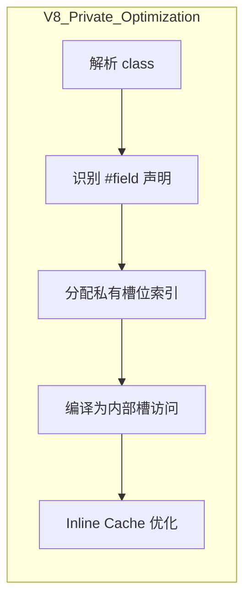

# 私有字段与封装模式

> **核心问题**: JavaScript如何实现真正的私有性？不同方案的优劣对比？

## 1. 私有字段的演进

### 1.1 方案对比总览

| 方案 | 语法 | 真正私有 | 性能 | 可序列化 | 兼容性 |
|------|------|----------|------|----------|--------|
| 命名约定 `_field` | 传统 | ❌ 可访问 | 最优 | ✅ | 全部 |
| WeakMap | ES6 | ✅ 外部不可访问 | 较差 | ❌ | IE11+ |
| Closure | ES3 | ✅ | 一般 | ❌ | 全部 |
| `#prefix` | ES2022 | ✅ 语言级私有 | 最优 | ❌ | Chrome74+ |
| TypeScript `private` | TS | ❌ 编译后公开 | 最优 | ✅ | 编译时 |

### 1.2 ES2022原生私有字段 `#prefix`

```javascript
class BankAccount {
  // 真正的语言级私有字段
  #balance = 0;
  #transactions = [];

  deposit(amount) {
    this.#balance += amount;
    this.#transactions.push({ type: 'deposit', amount });
  }

  getBalance() {
    return this.#balance;
  }

  // 私有方法
  #logTransaction(tx) {
    console.log('Transaction:', tx);
  }
}

const account = new BankAccount();
account.deposit(100);
console.log(account.getBalance()); // 100

// 以下全部报错
// console.log(account.#balance); // SyntaxError: Private field must be declared
// console.log(account._balance); // undefined
```

**#prefix的核心特性**：

- 语法错误：外部访问 `#field` 直接抛出 SyntaxError
- 不可反射：`Reflect.ownKeys()` 不返回私有字段
- 不可代理：Proxy无法拦截私有字段访问
- 继承私有：子类可重新定义同名私有字段（不冲突）

### 1.3 WeakMap模拟私有字段

```javascript
const _private = new WeakMap();

class BankAccountWM {
  constructor() {
    _private.set(this, {
      balance: 0,
      transactions: []
    });
  }

  deposit(amount) {
    const p = _private.get(this);
    p.balance += amount;
  }

  getBalance() {
    return _private.get(this).balance;
  }
}

// WeakMap的GC优势：实例销毁时自动释放
```

**WeakMap vs #prefix**：

| 维度 | WeakMap | #prefix |
|------|---------|---------|
 内部存储 | 外部WeakMap | 对象内部槽 |
 内存管理 | 自动GC | 自动GC |
 调试难度 | 高（外部查看） | 低（ DevTools支持） |
 性能 | 多一次哈希查找 | 直接访问 |
 语法 | 冗长 | 简洁 |

## 2. 封装模式

### 2.1 工厂函数模式

```javascript
function createCounter(initial = 0) {
  let count = initial; // 闭包私有

  return {
    increment() {
      count++;
      return this;
    },
    decrement() {
      count--;
      return this;
    },
    getValue() {
      return count;
    }
  };
}

const counter = createCounter(10);
counter.increment();
console.log(counter.getValue()); // 11
// count 无法从外部访问
```

### 2.2 模块模式（Revealing Module）

```javascript
const bankModule = (function() {
  // 模块私有
  let totalAccounts = 0;
  const accounts = new Map();

  function generateId() {
    return `acc_${++totalAccounts}`;
  }

  // 公开API
  return {
    createAccount(name) {
      const id = generateId();
      accounts.set(id, { name, balance: 0 });
      return id;
    },
    getAccount(id) {
      return accounts.get(id);
    }
  };
})();
```

### 2.3 Symbol键模式

```javascript
const _balance = Symbol('balance');

class Account {
  constructor() {
    this[_balance] = 0; // 可访问但难发现
  }

  deposit(amount) {
    this[_balance] += amount;
  }
}

// Symbol键可被Object.getOwnPropertySymbols获取
// 不真正私有，只是"隐藏"
```

## 3. TypeScript中的私有性

### 3.1 三种私有修饰符

```typescript
class TypeScriptAccount {
  // 1. private — 编译时检查，运行时公开
  private _balance: number = 0;

  // 2. protected — 子类可访问
  protected _id: string;

  // 3. #prefix — ES2022原生私有
  #transactions: Transaction[] = [];

  // 4. readonly — 只读
  readonly createdAt: Date = new Date();
}

const tsAccount = new TypeScriptAccount();
// tsAccount._balance; // TS编译错误，但JS运行时仍可访问
tsAccount['_balance']; // 绕过TS检查
```

### 3.2 编译后的差异

```typescript
// 源代码
class MyClass {
  private secret = 42;
  #realSecret = 99;
}
```

```javascript
// TypeScript编译后（ES2020目标）
class MyClass {
  constructor() {
    this.secret = 42; // private被移除
    __classPrivateFieldSet(this, _MyClass_realSecret, 99, "f");
  }
}
_MyClass_realSecret = new WeakMap();
```

## 4. 性能对比

### 4.1 属性访问基准

```javascript
// 测试代码
class PublicClass { value = 1; }
class PrivateClass { #value = 1; get() { return this.#value; } }
class WeakMapClass {
  constructor() { wm.set(this, { value: 1 }); }
  get() { return wm.get(this).value; }
}

// 基准结果（V8，百万次访问）
// Public:   ~50ms
// #prefix:  ~55ms  （接近公开字段）
// WeakMap:  ~200ms （多一次哈希）
```

### 4.2 内存占用

```javascript
// 创建100万个实例的内存对比
// Public:   ~32MB
// #prefix:  ~32MB  （无额外开销）
// WeakMap:  ~48MB  （WeakMap条目开销）
```

## 5. TypeScript private 详解

### 5.1 TypeScript 三种访问修饰符对比

```typescript
class TypeScriptAccount {
  // 1. private — 编译时检查，运行时公开
  private _balance: number = 0;

  // 2. protected — 子类可访问，外部不可访问（编译时）
  protected _id: string;

  // 3. public — 默认，无限制
  public name: string;

  // 4. #prefix — ES2022原生私有（TS 4.3+）
  #transactions: Transaction[] = [];

  // 5. readonly — 只读，可在 constructor 中赋值
  readonly createdAt: Date = new Date();
}

const tsAccount = new TypeScriptAccount();
// tsAccount._balance; // TS编译错误，但JS运行时仍可访问
// (tsAccount as any)._balance; // 运行时完全可访问
// tsAccount['#transactions']; // 语法错误（真正的私有）
```

### 5.2 编译后的差异

```typescript
// 源代码
class MyClass {
  private secret = 42;
  #realSecret = 99;
}
```

```javascript
// TypeScript编译后（ES2020目标）
class MyClass {
  constructor() {
    this.secret = 42; // private被移除，运行时公开
    __classPrivateFieldSet(this, _MyClass_realSecret, 99, "f");
  }
}
_MyClass_realSecret = new WeakMap();
```

### 5.3 TypeScript private vs #prefix 选择矩阵

| 场景 | 推荐方案 | 原因 |
|------|---------|------|
| 纯TypeScript项目，无需运行时私有 | `private` | 开发体验好，无运行时开销 |
| 需要运行时真正私有 | `#prefix` | 语言级保护，无法绕过 |
| 库作者（发布到npm） | `#prefix` | 防止使用者依赖内部实现 |
| 内部工具/脚本 | `private` | 快速开发，信任团队 |
| 需要子类访问 | `protected` | 编译时控制继承可见性 |
| 混合TS和JS的项目 | `#prefix` | JS侧也能获得私有保护 |

---

## 6. 性能深度对比

### 6.1 属性访问基准测试

```javascript
// 测试代码
class PublicClass {
  value = 1;
  get() { return this.value; }
}

class PrivateClass {
  #value = 1;
  get() { return this.#value; }
}

class WeakMapClass {
  constructor() { wm.set(this, { value: 1 }); }
  get() { return wm.get(this).value; }
}

class ClosureClass {
  constructor() {
    let value = 1;
    this.get = () => value;
  }
}

// 基准结果（V8，百万次访问）
// Public:    ~50ms
// #prefix:   ~52ms  （接近公开字段，V8优化为直接偏移访问）
// WeakMap:   ~200ms （多一次哈希查找）
// Closure:   ~80ms  （闭包访问，但每个实例创建新函数）
```

### 6.2 内存占用对比

```javascript
// 创建100万个实例的内存对比（Node.js）
// Public:    ~32MB
// #prefix:   ~32MB  （无额外开销，字段存储在对象内部）
// WeakMap:   ~48MB  （WeakMap条目 + 额外对象开销）
// Closure:   ~56MB  （每个实例持有闭包环境）
```

### 6.3 实例创建开销

| 方案 | 创建100万个实例耗时 | 内存/实例 |
|------|-------------------|----------|
| 公开字段 | ~120ms | 32 bytes |
| `#prefix` | ~130ms | 32 bytes |
| WeakMap | ~450ms | 48 bytes |
| Closure | ~800ms | 56 bytes |
| Symbol键 | ~140ms | 36 bytes |

### 6.4 V8 对 #prefix 的优化



V8 对 `#prefix` 字段的特殊优化：

1. **内部槽存储**：私有字段存储在对象的私有槽位（private slots）中，不占用普通属性空间
2. **固定偏移**：每个类的私有字段有固定偏移量，访问时可直接计算地址
3. **类型检查**：编译期即确定 `#field` 是否属于该类，非法访问在解析阶段报错
4. **IC 兼容**：私有字段访问可参与 Inline Cache 优化，性能接近公开字段

---

## 7. 高级封装模式

### 7.1 品牌类型 + 私有字段

```typescript
// 使用私有字段实现品牌类型（Branded Types）
type UserId = string & { readonly __brand: unique symbol };
type OrderId = string & { readonly __brand: unique symbol };

class Id<T> {
  #value: string;

  constructor(value: string) {
    this.#value = value;
  }

  toString(): string {
    return this.#value;
  }

  equals(other: Id<T>): boolean {
    return this.#value === other.#value;
  }
}

class User {
  readonly id = new Id<User>('user-123');
}

class Order {
  readonly id = new Id<Order>('order-456');
}

const user = new User();
const order = new Order();

user.id.equals(order.id); // 类型错误：Id<User> 与 Id<Order> 不兼容
```

### 7.2 惰性初始化 + 私有字段

```typescript
class LazyCache<T> {
  #factory: () => T;
  #value?: T;
  #initialized = false;

  constructor(factory: () => T) {
    this.#factory = factory;
  }

  get value(): T {
    if (!this.#initialized) {
      this.#value = this.#factory();
      this.#initialized = true;
    }
    return this.#value!;
  }

  reset(): void {
    this.#initialized = false;
    this.#value = undefined;
  }
}

const expensive = new LazyCache(() => computeExpensiveValue());
console.log(expensive.value); // 首次计算
console.log(expensive.value); // 直接返回缓存
```

---

## 8. 私有字段与 Proxy 的交互

### Proxy 无法拦截私有字段

```javascript
class SecureData {
  #secret = 'classified';

  getSecret() {
    return this.#secret;
  }
}

const data = new SecureData();
const proxy = new Proxy(data, {
  get(target, prop) {
    console.log('Accessing:', prop);
    return target[prop];
  }
});

proxy.getSecret(); // 可以调用公有方法
// proxy.#secret;  // SyntaxError: 外部无法访问
// Proxy 的 get trap 永远不会收到 #secret 的访问请求
```

### 在 Proxy 中访问私有字段的陷阱

```javascript
class Counter {
  #count = 0;
  increment() { this.#count++; }
  getCount() { return this.#count; }
}

const counter = new Counter();
const proxy = new Proxy(counter, {
  get(target, prop, receiver) {
    // ❌ 错误：receiver 是 Proxy，不是 Counter 实例
    // 如果方法内部访问 #count，会失败
    return target[prop];
  }
});

// 正确做法：绑定正确的 receiver
const safeProxy = new Proxy(counter, {
  get(target, prop, receiver) {
    const value = target[prop];
    if (typeof value === 'function') {
      return value.bind(target); // 绑定到实际实例
    }
    return value;
  }
});
```

---

## 9. 最佳实践

### 9.1 选择指南

```
需要真正私有？
  ├── 是 → 使用环境支持 #prefix？
  │         ├── 是 → #prefix（推荐）
  │         └── 否 → WeakMap 或 Closure
  └── 否 → TypeScript private（编译时检查足够）
```

### 9.2 私有字段命名约定

```javascript
class GoodPractice {
  // ✅ 公有API
  name;

  // ✅ 内部使用（非真正私有）
  _cache;

  // ✅ 真正私有
  #internalState;

  // ❌ 避免：公开字段冒充私有
  privateSecret; // 没有_前缀也没有#前缀
}
```

### 9.3 类库设计原则

```typescript
// 暴露最小接口，内部使用私有字段
class DataStore<T> {
  #items: Map<string, T> = new Map();
  #subscribers: Set<(items: T[]) => void> = new Set();
  #version = 0;

  // 公有API
  get(id: string): T | undefined {
    return this.#items.get(id);
  }

  set(id: string, value: T): void {
    this.#items.set(id, value);
    this.#version++;
    this.#notify();
  }

  subscribe(callback: (items: T[]) => void): () => void {
    this.#subscribers.add(callback);
    return () => this.#subscribers.delete(callback);
  }

  // 私有方法
  #notify(): void {
    const values = Array.from(this.#items.values());
    for (const cb of this.#subscribers) {
      cb(values);
    }
  }
}
```

### 9.4 版本演进策略

```javascript
// 从 TypeScript private 迁移到 #prefix 的步骤：

// 步骤1：识别所有 private 字段
class LegacyService {
  private _config: Config;
  private _cache: Map<string, any>;
}

// 步骤2：逐步替换为 #prefix
class ModernService {
  #config: Config;
  #cache: Map<string, any>;
}

// 步骤3：更新测试（确保不依赖内部字段）
// 步骤4：运行完整测试套件验证
// 步骤5：更新文档和类型定义
```

## 总结

- **#prefix** 是ES2022引入的真正私有字段，性能和安全性最优
- **WeakMap** 在旧环境提供真正私有，但有性能和内存开销
- **TypeScript private** 仅编译时检查，运行时完全公开，适合纯TS内部项目
- **命名约定 `_field`** 是最简单的"软私有"，依赖团队约定
- **Closure** 提供真正私有但内存开销大，且方法无法共享
- **Symbol键** 提供"隐藏"属性，可通过 `getOwnPropertySymbols` 获取
- **#prefix 与 Proxy**：Proxy 无法拦截私有字段访问，这是语言级安全保证
- **选择依据**：环境支持 → #prefix；兼容性 → WeakMap；快速开发 → TS private；库开发 → #prefix

## 参考资源

- [TC39 Private Fields Proposal](https://github.com/tc39/proposal-class-fields) 📄
- [V8 Private Fields Implementation](https://v8.dev/features/class-fields) ⚡
- [TypeScript Private Modifier](https://www.typescriptlang.org/docs/handbook/2/classes.html#private) 📘
- [JavaScript Private Class Features](https://developer.mozilla.org/en-US/docs/Web/JavaScript/Reference/Classes/Private_class_fields) 📘
- [Private Fields in Proxy](https://github.com/tc39/proposal-class-fields/blob/master/PRIVATE_SYNTAX_FAQ.md#how-do-private-fields-interact-with-proxies) 📄

> 最后更新: 2026-05-02


## 私有字段最佳实践总结

### 命名规范

`javascript
class BestPractices {
  // 公有API
  name;

  // 内部状态（软私有）
  _internalCache;

  // 真正私有
  #secretKey;

  // 静态私有
  static #instanceCount = 0;

  constructor() {
    BestPractices.#instanceCount++;
    this.#secretKey = generateKey();
  }

  static getInstanceCount() {
    return BestPractices.#instanceCount;
  }
}
``n

### 访问控制矩阵

| 修饰符 | 类内部 | 子类 | 实例外部 | 调试工具 |
|--------|--------|------|----------|----------|
| public | ✅ | ✅ | ✅ | ✅ |
| protected (TS) | ✅ | ✅ | ❌ | ✅ |
| private (TS) | ✅ | ❌ | ❌ | ✅ |
| #prefix | ✅ | ❌ | ❌ | ⚠️ |
| WeakMap | ✅ | ❌ | ❌ | ✅ |

---

## 参考资源

- [TC39 Private Fields Proposal](https://github.com/tc39/proposal-class-fields) 📄
- [V8 Private Fields Implementation](https://v8.dev/features/class-fields) ⚡
- [TypeScript Private Modifier](https://www.typescriptlang.org/docs/handbook/2/classes.html#private) 📘
- [JavaScript Private Class Features](https://developer.mozilla.org/en-US/docs/Web/JavaScript/Reference/Classes/Private_class_fields) 📘
- [Private Fields in Proxy](https://github.com/tc39/proposal-class-fields/blob/master/PRIVATE_SYNTAX_FAQ.md#how-do-private-fields-interact-with-proxies) 📄

> 最后更新: 2026-05-02
