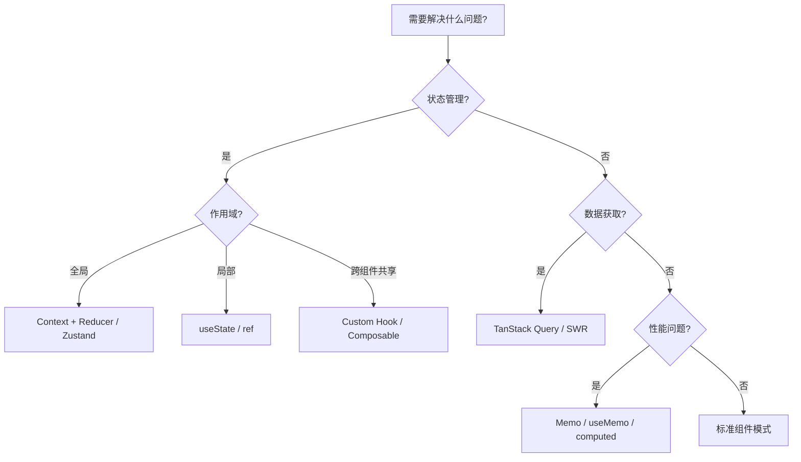

# 设计模式

> 设计模式是解决特定问题的可复用方案。在 JavaScript/TypeScript 生态中，设计模式不仅包括传统的 GoF 模式，还涵盖了框架特有的组件模式、状态管理模式和异步处理模式。

## 模式分类

| 专题 | 覆盖领域 | 规模 | 说明 |
|------|----------|:----:|------|
| [React 设计模式](./react-patterns) | 组件设计、状态管理、性能优化 | 76KB | Hooks 模式、渲染优化、组合模式 |
| [Vue 3 设计模式](./vue-patterns) | 组合式 API、响应式、组件通信 | 6KB | 组合函数、Provide/Inject、渲染函数 |
| [Node.js 设计模式](./nodejs-patterns) | 异步流程、模块组织、微服务 | 74KB | Stream、EventEmitter、中间件 |
| [测试模式](./testing-patterns) | 单元测试、集成测试、E2E | 63KB | 测试替身、 fixtures、快照测试 |

## 通用设计模式速查

### 创建型模式

| 模式 | JS/TS 实现 | 适用场景 |
|------|------------|----------|
| 单例模式 | `export const singleton = new Service()` | 全局配置、缓存 |
| 工厂模式 | `createUser(type: 'admin' \| 'guest')` | 根据类型创建不同对象 |
| 建造者模式 | `new QueryBuilder().select().where().build()` | 复杂对象逐步构建 |
| 原型模式 | `Object.create(proto)` | 对象克隆 |

```typescript
// 工厂模式 + 类型推断
interface User {
  role: string
  permissions: string[]
}

function createUser(role: 'admin'): { role: 'admin'; permissions: ['*'] }
function createUser(role: 'guest'): { role: 'guest'; permissions: ['read'] }
function createUser(role: string): User {
  const permissions = role === 'admin' ? ['*'] : ['read']
  return { role, permissions }
}
```

### 结构型模式

| 模式 | JS/TS 实现 | 适用场景 |
|------|------------|----------|
| 装饰器模式 | ES 装饰器 / 高阶组件 | 扩展功能不修改原类 |
| 适配器模式 | 包装旧 API 为新接口 | 兼容旧代码 / 第三方库 |
| 代理模式 | `Proxy` 对象 | 拦截属性访问、验证 |
| 组合模式 | 组件树结构 | UI 组件嵌套、文件系统 |

```typescript
// 代理模式：验证赋值
const validator = {
  set(target: any, prop: string, value: any) {
    if (prop === 'age' && typeof value !== 'number') {
      throw new TypeError('Age must be a number')
    }
    target[prop] = value
    return true
  }
}

const person = new Proxy({}, validator)
person.age = 25   // OK
// person.age = '25'  // TypeError
```

### 行为型模式

| 模式 | JS/TS 实现 | 适用场景 |
|------|------------|----------|
| 观察者模式 | `EventEmitter` / Signals | 事件订阅与通知 |
| 策略模式 | 策略对象映射 | 替换算法逻辑 |
| 命令模式 | 将请求封装为对象 | 撤销/重做、队列 |
| 迭代器模式 | `[Symbol.iterator]` | 自定义遍历逻辑 |

```typescript
// 策略模式
const strategies = {
  json: (data: unknown) => JSON.stringify(data),
  csv: (data: string[][]) => data.map(r => r.join(',')).join('\n'),
  xml: (data: unknown) => `<data>${JSON.stringify(data)}</data>`,
} as const

type Format = keyof typeof strategies

function serialize(data: unknown, format: Format): string {
  return strategies[format](data as any)
}
```

## 框架特有模式

### React 核心模式

```typescript
// Compound Components
const Tabs = {
  Root: ({ children }: { children: React.ReactNode }) => <div>{children}</div>,
  List: ({ children }: { children: React.ReactNode }) => <div role="tablist">{children}</div>,
  Trigger: ({ value }: { value: string }) => <button role="tab">{value}</button>,
  Content: ({ value }: { value: string }) => <div role="tabpanel">{value}</div>,
}

// Render Props
interface MouseTrackerProps {
  render: (state: { x: number; y: number }) => React.ReactNode
}

// Custom Hook 组合
function useLocalStorage<T>(key: string, initial: T) {
  const [value, setValue] = useState<T>(() => {
    const stored = localStorage.getItem(key)
    return stored ? JSON.parse(stored) : initial
  })
  useEffect(() => localStorage.setItem(key, JSON.stringify(value)), [key, value])
  return [value, setValue] as const
}
```

### Vue 3 核心模式

```typescript
// Composable 模式
function useAsyncState<T>(promise: Promise<T>) {
  const state = ref<T | null>(null)
  const error = ref<Error | null>(null)
  const loading = ref(true)

  promise
    .then(data => { state.value = data })
    .catch(err => { error.value = err })
    .finally(() => { loading.value = false })

  return { state, error, loading }
}

// Provide / Inject 跨层通信
const InjectionKey = Symbol('config') as InjectionKey<AppConfig>
provide(InjectionKey, config)
const config = inject(InjectionKey)!
```

### Node.js 核心模式

```typescript
// Stream 处理模式
import { Transform } from 'node:stream'

const upperCase = new Transform({
  transform(chunk, encoding, callback) {
    this.push(chunk.toString().toUpperCase())
    callback()
  }
})

process.stdin.pipe(upperCase).pipe(process.stdout)

// 中间件模式（Express / Koa / Fastify 通用）
type Middleware = (req: Request, res: Response, next: NextFunction) => void

const logger: Middleware = (req, res, next) => {
  console.log(`${req.method} ${req.url}`)
  next()
}
```

## 反模式警示

| 反模式 | 表现 | 后果 | 修正 |
|--------|------|------|------|
| 上帝组件 | 单组件超过 500 行 | 难以测试和维护 | 拆分为子组件 + 自定义 Hook |
| Props 钻探 | 多层传递 props | 中间层组件冗余 | Context / Provide-Inject |
| 滥用 useEffect | 所有逻辑放入 useEffect | 难以追踪副作用 | 优先使用事件处理函数 |
| 回调地狱 | 嵌套 3+ 层回调 | 代码难以阅读 | async/await 或 Promise 链 |
| 全局状态滥用 | 所有状态放全局 | 不必要的重渲染 | 局部状态优先 |
| 同步阻塞 | 在事件循环中做大量计算 | UI 卡顿 | 使用 Worker / 分批处理 |

## 模式选择决策树



## 与代码实验室联动

| 模式领域 | 推荐实验 |
|----------|----------|
| React 性能模式 | [Server Functions 实验](../code-lab/lab-02-server-functions) |
| Vue 响应式原理 | [Server Functions 实验](../code-lab/lab-02-server-functions) |
| Node.js Stream | [Auth 实验](../code-lab/lab-03-auth) |
| 测试替身 | [Mini TypeScript 实验](../code-lab/lab-03-mini-typescript) |

## 参考资源

- [Patterns.dev](https://www.patterns.dev/) — 现代 Web 设计模式
- [Refactoring Guru](https://refactoring.guru/design-patterns) — 设计模式可视化
- [React Patterns](https://reactpatterns.com/) — React 专用模式
- [Vue Patterns](https://vuejs.org/guide/reusability/composables.html) — Vue 官方组合式模式
- [Node.js Design Patterns](https://www.nodejsdesignpatterns.com/) — Node.js 设计模式书籍
