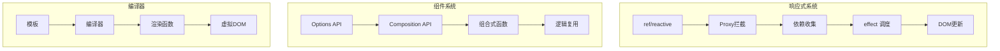
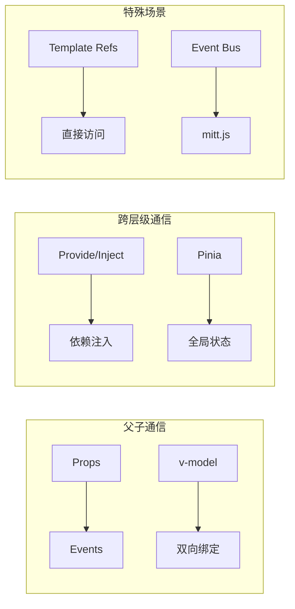
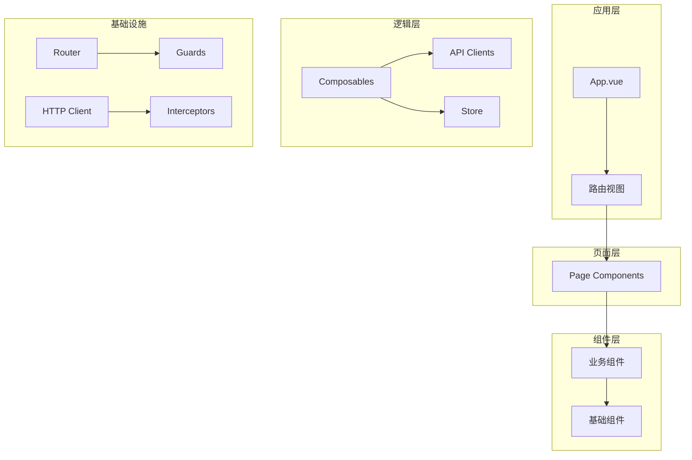

# Vue 设计模式与最佳实践

> Vue 3 的组合式 API（Composition API）彻底改变了 Vue 应用的开发方式。本文档系统梳理 Vue 生态中的核心设计模式，从组合式函数到大型应用架构的最佳实践。

## Vue 3 核心架构



## 组合式函数模式 (Composables)

组合式函数是 Vue 3 中逻辑复用的核心机制：

```typescript
// useFetch.ts — 数据获取组合式函数
import &#123; ref, watchEffect &#125; from 'vue';

export function useFetch&lt;T&gt;(url: string) &#123;
  const data = ref&lt;T | null&gt;(null);
  const error = ref&lt;Error | null&gt;(null);
  const loading = ref(false);

  watchEffect(async () => &#123;
    loading.value = true;
    error.value = null;

    try &#123;
      const response = await fetch(url);
      data.value = await response.json();
    &#125; catch (e) &#123;
      error.value = e as Error;
    &#125; finally &#123;
      loading.value = false;
    &#125;
  &#125;);

  return &#123; data, error, loading &#125;;
&#125;

// 组件中使用
const &#123; data: users, loading &#125; = useFetch&lt;User[]&gt;('/api/users');
```

### 组合式函数最佳实践

| 规则 | 说明 | 示例 |
|------|------|------|
| 命名约定 | 以 `use` 开头 | `useAuth`、`useLocalStorage` |
| 参数处理 | 接受 ref 或原始值 | `useFeature(maybeRef)` |
| 副作用管理 | 在 onUnmounted 中清理 | `addEventListener` → `removeEventListener` |
| 返回值 | 返回对象，便于解构 | `return &#123; data, error &#125;` |

## 状态管理模式

### Pinia（推荐）

```typescript
// stores/counter.ts
import &#123; defineStore &#125; from 'pinia';
import &#123; ref, computed &#125; from 'vue';

export const useCounterStore = defineStore('counter', () => &#123;
  // State
  const count = ref(0);

  // Getters
  const doubleCount = computed(() => count.value * 2);

  // Actions
  function increment() &#123;
    count.value++;
  &#125;

  function decrement() &#123;
    count.value--;
  &#125;

  return &#123; count, doubleCount, increment, decrement &#125;;
&#125;);

// 组件中使用
import &#123; useCounterStore &#125; from '@/stores/counter';
const counter = useCounterStore();
```

### 组件间通信模式



## 渲染优化模式

### v-memo 控制渲染

```vue
&lt;template&gt;
  &lt;div v-memo="[item.id, item.status]"&gt;
    &lt;!-- 仅当 id 或 status 变化时重新渲染 --&gt;
    &lt;HeavyComponent :data="item" /&gt;
  &lt;/div&gt;
&lt;/template&gt;
```

### 虚拟列表

```vue
&lt;script setup&gt;
import &#123; computed, ref &#125; from 'vue';

const items = ref(Array.from(&#123; length: 10000 &#125;, (_, i) => (&#123; id: i, text: `Item $&#123;i&#125;` &#125;)));
const itemHeight = 50;
const containerHeight = 400;
const visibleCount = Math.ceil(containerHeight / itemHeight);

const scrollTop = ref(0);
const startIndex = computed(() => Math.floor(scrollTop.value / itemHeight));
const visibleItems = computed(() =>
  items.value.slice(startIndex.value, startIndex.value + visibleCount + 1)
);
&lt;/script&gt;

&lt;template&gt;
  &lt;div class="viewport" @scroll="scrollTop = $event.target.scrollTop"&gt;
    &lt;div :style="&#123; height: items.length * itemHeight + 'px' &#125;"&gt;
      &lt;div
        v-for="item in visibleItems"
        :key="item.id"
        :style="&#123;
          transform: `translateY($&#123;startIndex * itemHeight&#125;px)`,
          height: itemHeight + 'px'
        &#125;"
      &gt;
        &#123;&#123; item.text &#125;&#125;
      &lt;/div&gt;
    &lt;/div&gt;
  &lt;/div&gt;
&lt;/template&gt;
```

## 大型应用架构



| 层级 | 职责 | 示例 |
|------|------|------|
| 应用层 | 全局布局、路由入口 | `App.vue`、`layouts/` |
| 页面层 | 路由对应的页面组件 | `views/`、`pages/` |
| 组件层 | 可复用的 UI 组件 | `components/` |
| 逻辑层 | 业务逻辑、状态管理 | `composables/`、`stores/` |
| 基础设施 | 工具、配置、常量 | `utils/`、`constants/` |

## 参考资源

| 资源 | 链接 |
|------|------|
| Vue 官方文档 | <https://vuejs.org> |
| Pinia 文档 | <https://pinia.vuejs.org> |
| VueUse | <https://vueuse.org> |

---

 [← 返回首页](/)
