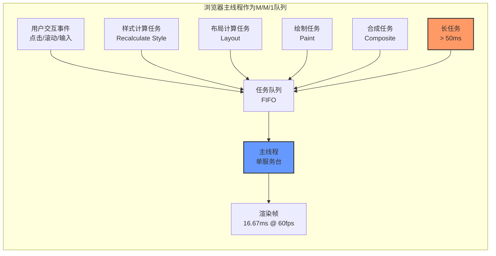
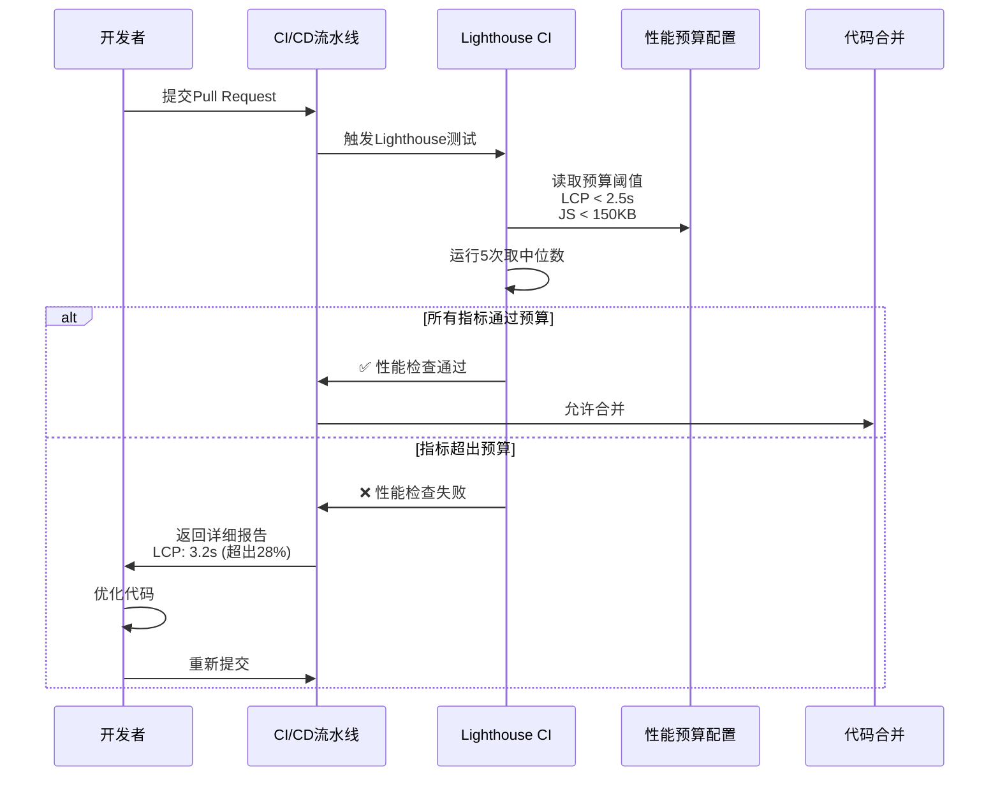

# 性能基础理论：从度量到优化

性能工程（Performance Engineering）并非简单地在代码上线前做一次「压力测试」或「性能调优」，而是一套贯穿软件全生命周期的系统性学科。它要求工程师同时具备**形式化的数学直觉**与**精确的工程测量能力**——前者用于理解系统行为的理论边界，后者用于在真实世界中验证假设并指导优化决策。本文采用「双轨并行」的叙述结构：先建立严格的理论框架，再将其映射到Web前端领域的具体工程实践。

## 引言

在现代Web应用中，性能已不再是「锦上添花」的非功能需求，而是直接影响用户留存、转化率与搜索排名的核心产品指标。Google的研究表明，当页面加载时间从1秒增加到3秒时，跳出率（Bounce Rate）上升32%；当加载时间达到5秒时，跳出率激增90%。这种用户行为的急剧恶化背后，隐藏着严格的数学规律——排队论中的延迟爆炸、Amdahl定律揭示的并行加速比上限、以及Little定律对系统吞吐量的深刻约束。

理解这些理论，不是为了在会议上展示公式，而是为了在面对性能瓶颈时，能够迅速判断「优化哪一部分能带来最大收益」「当前瓶颈是计算密集型还是IO密集型」「继续增加服务器能否解决问题」。本文将从五个维度展开：**形式化定义**、**Little定律**、**Amdahl定律**、**排队论基础**、**性能度量的统计学**，每一部分都配备对应的Web工程实践映射。

## 理论严格表述

### 2.1 性能工程的形式化定义

在计算机系统性能分析领域，有四个核心度量维度构成了完整的性能画像。这些定义源自Raj Jain的经典著作《The Art of Computer Systems Performance Analysis》，是性能工程的理论基石。

#### 2.1.1 延迟（Latency）

**定义**：延迟是请求从提交到获得完整响应所经历的时间间隔。形式化表示为：

```
L = T_response - T_request
```

其中 `T_request` 为请求提交时刻，`T_response` 为响应完成时刻。延迟是一个随机变量，通常服从某种概率分布（如指数分布、正态分布或对数正态分布），而非单一标量。

在排队论中，延迟可进一步分解为：

```
L = W_queue + W_service
```

其中 `W_queue` 为排队等待时间，`W_service` 为实际服务时间。

#### 2.1.2 吞吐量（Throughput）

**定义**：吞吐量是单位时间内系统成功处理的请求数量。形式化表示为：

```
λ = N / T
```

其中 `N` 为在时间窗口 `T` 内完成的请求总数。吞吐量的单位通常是 RPS（Requests Per Second）或 TPS（Transactions Per Second）。

吞吐量与延迟之间存在深刻但非简单的反比关系。在资源未饱和时，吞吐量随负载增加而线性增长；当资源接近饱和时，排队延迟急剧上升，吞吐量增长趋缓，最终达到理论上限。

#### 2.1.3 资源利用率（Utilization）

**定义**：资源利用率是资源处于忙碌状态的时间比例。对于单服务台系统：

```
ρ = λ / μ
```

其中 `λ` 为到达率（Arrival Rate），`μ` 为服务率（Service Rate），即 `μ = 1 / W_service`。资源利用率 `ρ` 是一个无量纲量，取值范围为 `[0, 1)`。当 `ρ → 1` 时，系统进入不稳定状态，排队延迟趋向无穷大。

#### 2.1.4 可扩展性（Scalability）

**定义**：可扩展性描述系统性能随资源规模增加而提升的能力。形式化地，设 `S(n)` 为使用 `n` 个处理单元时的加速比（Speedup），理想情况下：

```
S(n) = T(1) / T(n) = n
```

但现实中由于串行部分、通信开销和同步成本的增加，加速比通常远低于理想值。可扩展性分析的核心工具是Amdahl定律和Gustafson定律。

### 2.2 Little定律

**定理（Little's Law）**：对于一个处于稳态（Steady State）的排队系统，系统中的平均请求数 `L` 等于平均到达率 `λ` 乘以平均逗留时间（延迟）`W`：

```
L = λW
```

该定律由John D.C. Little于1961年严格证明，其惊人的普适性在于：**它不依赖于到达过程的分布、服务时间的分布、服务规则（FIFO/LIFO/PS）或网络拓扑结构**。只要系统处于稳态，Little定律必然成立。

**证明思路**（直观版本）：考虑一个足够长的时间窗口 `T`。在此期间，系统共接收 `N = λT` 个请求。每个请求在系统中平均逗留 `W` 时间。所有请求在系统中的总逗留时间约为 `N × W = λTW`。另一方面，系统中的平均请求数为 `L`，因此总逗留时间也等于 `L × T`。联立得 `L = λW`。

**Little定律的推论**：

- 若 `λ` 固定，降低 `W`（延迟）必然降低 `L`（并发请求数）
- 若 `L` 超过系统容量上限，系统将失稳，延迟趋向无穷
- 在容量规划中，已知目标延迟 `W_target` 和预测到达率 `λ_forecast`，可直接计算所需系统容量 `L_capacity = λ_forecast × W_target`

### 2.3 Amdahl定律

**定理（Amdahl's Law）**：设程序中可并行化的部分比例为 `p`，不可并行化的串行部分比例为 `1 - p`。当使用 `n` 个处理器时，最大加速比为：

```
S(n) = 1 / [(1 - p) + p/n]
```

**极限分析**：当 `n → ∞` 时：

```
S(∞) = 1 / (1 - p)
```

这意味着，即使拥有无限多的处理器，加速比也有严格的上限 `1 / (1 - p)`。例如，若程序的串行部分占5%（`p = 0.95`），则最大加速比仅为 `1 / 0.05 = 20` 倍。

**Amdahl定律对性能工程的启示**：

1. **优化瓶颈部分**：性能提升的上限由串行部分决定，因此应优先优化不可并行化的关键路径
2. **并行化的回报递减**：当 `n` 超过 `p / (1 - p)` 后，增加处理器数量带来的收益急剧下降
3. **前端工程的特殊性**：浏览器主线程（Main Thread）本质上是单线程的，JavaScript执行、样式计算、布局、绘制均发生在主线程上，因此前端性能优化的核心矛盾与Amdahl定律的串行瓶颈高度吻合

### 2.4 排队论基础：M/M/1队列

M/M/1队列是排队论中最基础且最具洞察力的模型，它为理解系统过载行为提供了精确的数学描述。

**模型假设**：

- **第一个M**：到达过程为泊松过程（Poisson Process），即到达间隔服从指数分布，到达率为 `λ`
- **第二个M**：服务时间服从指数分布，服务率为 `μ`
- **1**：单服务台（Single Server）

**稳态条件**：`ρ = λ / μ < 1`，即到达率必须小于服务率，否则队列长度将无限增长。

**关键性能指标**：

| 指标 | 公式 | 含义 |
|------|------|------|
| 系统中平均请求数 | `L = ρ / (1 - ρ)` | 包括排队中和正在被服务的请求 |
| 平均排队等待时间 | `W_q = ρ / [μ(1 - ρ)]` | 从到达至开始被服务的时间 |
| 平均逗留时间 | `W = 1 / (μ - λ)` | 在系统中的总时间 |
| 系统中有 `n` 个请求的概率 | `P_n = (1 - ρ)ρ^n` | 几何分布 |

**延迟爆炸现象**：当 `ρ` 接近1时，延迟 `W` 趋向无穷大。具体地，当 `ρ = 0.8` 时，`W = 5 / μ`；当 `ρ = 0.95` 时，`W = 20 / μ`；当 `ρ = 0.99` 时，`W = 100 / μ`。这种非线性增长意味着：**将利用率从90%提升到99%所带来的延迟增加，远大于从50%提升到90%**。

**对前端工程的映射**：浏览器的主线程可以抽象为一个M/M/1队列。JavaScript任务、样式计算、布局计算是「到达的请求」，主线程的执行能力是「服务台」。当任务到达率持续高于主线程处理能力时，帧率下降、交互延迟增加、甚至出现页面卡顿。

### 2.5 性能度量的统计学基础

性能度量不是简单的「测一次取平均值」，而是一门严格的统计学实践。错误的度量方法会导致错误的优化方向。

#### 2.5.1 平均值（Mean）

算术平均值是最直观的集中趋势度量：

```
x̄ = (1/n) × Σ(x_i)
```

但平均值对异常值（Outlier）极度敏感。在Web性能场景中，一个慢速网络用户的极端延迟可能将平均值拉高数倍，掩盖大多数用户的真实体验。

#### 2.5.2 中位数（Median）

中位数是将数据集排序后位于中间位置的值。对于奇数个样本，中位数为 `x_((n+1)/2)`；对于偶数个样本，中位数为 `(x_(n/2) + x_(n/2+1)) / 2`。

中位数对异常值不敏感，能更好地代表「典型用户」的体验。

#### 2.5.3 百分位数（Percentiles）：P50、P95、P99

第 `p` 百分位数（记作P`p`）表示有 `p%` 的样本值小于或等于该值。

- **P50（中位数）**：50%的用户体验优于该值
- **P95**：95%的用户体验优于该值，反映了绝大多数用户的体验下限
- **P99**：99%的用户体验优于该值，揭示了长尾延迟的严重程度

在性能工程中，**平均值几乎从不单独使用**。标准实践是同时报告P50、P95和P99，以完整刻画分布形态。

#### 2.5.4 标准差（Standard Deviation）

标准差度量数据的离散程度：

```
σ = √[(1/n) × Σ(x_i - x̄)²]
```

标准差大意味着用户体验波动剧烈，可能存在严重的性能抖动（Jitter）。在A/B测试中，即使两个版本的平均延迟相同，标准差较小的版本通常提供更稳定的用户体验。

#### 2.5.5 样本量与置信区间

性能度量必须考虑统计显著性。对于服从正态分布的样本，95%置信区间为：

```
CI_95% = x̄ ± 1.96 × (σ / √n)
```

当样本量 `n` 不足时，置信区间过宽，度量的可靠性降低。Google的Web Vitals建议基于28天的真实用户数据来评估性能指标，正是为了确保样本量足够大。

## 工程实践映射

### 3.1 Web性能的核心指标

Google通过多年的用户行为研究，建立了一套以用户为中心的性能指标框架——Core Web Vitals。这些指标将上述理论中的「延迟」「吞吐量」「用户体验」转化为可精确测量的Web特定概念。

#### 3.1.1 FCP（First Contentful Paint，首次内容绘制）

FCP测量从导航开始到浏览器渲染第一个DOM内容（文本、图像、SVG或 `<canvas>` 元素）的时间。它标志着用户从「空白屏幕」到「看到内容」的关键心理转折点。

**阈值标准**：

- **Good**：≤ 1.8秒
- **Needs Improvement**：1.8秒 ~ 3.0秒
- **Poor**：> 3.0秒

FCP主要受服务器响应时间（TTFB）和关键渲染路径上阻塞资源的影响。

#### 3.1.2 LCP（Largest Contentful Paint，最大内容绘制）

LCP测量视口中最大可见内容元素（通常是主图、视频海报或大块文本）的渲染时间。它是2021年后取代FMP（First Meaningful Paint）的核心指标，因为它与真实用户感知的「页面加载完成」高度相关。

**阈值标准**：

- **Good**：≤ 2.5秒
- **Needs Improvement**：2.5秒 ~ 4.0秒
- **Poor**：> 4.0秒

**常见LCP元素**：

- `` 元素
- `<image>` 元素（SVG内）
- `<video>` 元素的海报图像
- 通过 `url()` 加载的背景图像的元素
- 包含文本节点或行内文本子元素的块级元素

#### 3.1.3 FID/INP（Interaction to Next Paint）

FID（First Input Delay，首次输入延迟）测量用户首次交互（点击、触摸、按键）到浏览器实际开始处理事件处理程序的时间。它反映了主线程的繁忙程度——如果主线程正在执行大量JavaScript，用户的交互将被延迟。

**阈值标准（FID）**：

- **Good**：≤ 100毫秒
- **Needs Improvement**：100毫秒 ~ 300毫秒
- **Poor**：> 300毫秒

**INP（Interaction to Next Paint）** 于2024年3月正式取代FID成为Core Web Vitals指标。INP测量的是页面上所有（或大部分）交互的延迟，而非仅首次交互。它反映了整个页面生命周期内的交互响应性。

**阈值标准（INP）**：

- **Good**：≤ 200毫秒
- **Needs Improvement**：200毫秒 ~ 500毫秒
- **Poor**：> 500毫秒

FID/INP本质上是「主线程作为M/M/1队列」的直接度量。当主线程被长任务（Long Task，> 50ms）占据时，交互事件必须在队列中等待，形成排队延迟。

#### 3.1.4 CLS（Cumulative Layout Shift，累积布局偏移）

CLS测量页面整个生命周期中发生的所有意外布局偏移的累积分数。与延迟类指标不同，CLS关注的是视觉稳定性——元素是否在用户即将点击时突然移动。

**计算方式**：

```
CLS = Σ(impact_fraction × distance_fraction)
```

其中 `impact_fraction` 是受影响元素占视口的比例，`distance_fraction` 是元素移动距离占视口的比例。

**阈值标准**：

- **Good**：≤ 0.1
- **Needs Improvement**：0.1 ~ 0.25
- **Poor**：> 0.25

#### 3.1.5 TTFB（Time to First Byte，首字节时间）

TTFB测量从浏览器发起请求到接收到响应第一个字节的时间。它包含了DNS解析、TCP连接、TLS握手、服务器处理和首字节网络传输的全部延迟。

**优化目标**：TTFB < 600ms（Good），< 800ms（Needs Improvement）。

#### 3.1.6 TBT（Total Blocking Time，总阻塞时间）

TBT测量FCP和TTI（Time to Interactive）之间，所有长任务（> 50ms）超出50ms的部分之和。它与INP高度相关，是实验室环境（Lighthouse）中衡量交互性的关键代理指标。

```
TBT = Σ(max(task_duration_i - 50ms, 0))  for all tasks between FCP and TTI
```

### 3.2 Chrome DevTools Performance面板详解

Chrome DevTools的Performance面板是前端性能工程师最重要的诊断工具，它将抽象的「主线程队列」可视化为了可交互的时间线。

**面板核心区域**：

1. **概览条（Overview）**：CPU利用率、FPS、NET活动的宏观时间线
2. **火焰图（Flame Chart）**：主线程活动的详细时序，每个横条代表一个事件，宽度代表持续时间
3. **帧时间线（Frames）**：标记每一帧的渲染时间，超过16.67ms的帧以红色警示
4. **交互轨道（Interactions）**：用户交互事件及其处理延迟
5. **网络轨道（Network）**：资源加载的瀑布图，包含排队、DNS、TCP、TLS、发送、等待、接收各阶段

**诊断长任务**：在火焰图中，任何长度超过50ms的黄色（Scripting）横条都是潜在的性能问题。通过Bottom-Up或Call Tree视图，可以快速定位耗时最长的函数调用。

**识别强制同步布局（Forced Synchronous Layout）**：当火焰图中出现紫色（Rendering）横条紧跟在黄色（Scripting）横条之后，且标记为「Recalculate Style」或「Layout」时，通常意味着JavaScript在读取布局属性（如 `offsetHeight`、`getBoundingClientRect`）后立即修改了样式，强制浏览器同步执行布局计算。

### 3.3 Lighthouse评分机制

Lighthouse是一个开源的自动化工具，用于改进Web应用质量。其性能评分基于多个加权指标：

| 指标 | 权重（Lighthouse 10+） |
|------|----------------------|
| LCP | 25% |
| INP | 25% |
| CLS | 25% |
| TBT | 15% |
| FCP | 10% |

**评分曲线**：Lighthouse使用对数正态分布曲线将原始度量值映射到0-100分。这意味着：

- 从50分提升到90分比从90分提升到100分容易得多
- 90分代表该指标已优于绝大多数（约95%）的网页
- 追求100分通常收益极低，且需要极端优化

**运行条件**：Lighthouse使用模拟的Moto G4中端设备和慢速4G网络进行测试，以确保评分反映真实世界的低端设备体验。这种「降维测试」策略迫使开发者优化最坏情况，而非仅在高端MacBook Pro上「感觉很快」。

### 3.4 性能预算（Performance Budget）

性能预算是将性能指标纳入工程流程的制度化工具。它在项目初期设定明确的资源使用上限，防止性能随功能迭代而逐步退化（Performance Regression）。

**预算类型**：

1. **基于时间的预算**：例如「LCP < 2.5s」「TBT < 200ms」「交互响应时间P95 < 100ms」
2. **基于资源大小的预算**：例如「首屏JavaScript < 150KB（gzip后）」「总图片大小 < 800KB」
3. **基于请求数的预算**：例如「首屏关键请求 < 15个」「第三方脚本请求 < 5个」

**预算实施工具链**：

- **Lighthouse CI**：在CI/CD流水线中自动运行Lighthouse，当得分低于阈值时阻塞合并
- **bundlesize**：在npm包安装时检查打包产物大小
- **WebPageTest**：提供详细的性能预算监控和趋势分析
- **Custom Metrics**：通过Performance Observer API自定义业务相关的性能指标

**预算设定原则**：基于竞争分析和用户研究设定预算。例如，若主要竞争对手的LCP中位数为2.0秒，则设定LCP < 1.8秒的预算，以建立性能优势。

### 3.5 RUM与合成监控的对比

性能监控体系分为两大范式：真实用户监控（Real User Monitoring, RUM）和合成监控（Synthetic Monitoring）。两者互补，而非互斥。

#### 3.5.1 RUM（真实用户监控）

RUM通过嵌入在页面中的JavaScript代码（通常通过Performance Observer API或第三方服务如Google Analytics、New Relic、Datadog）收集真实用户的性能数据。

**优势**：

- 反映真实的网络条件、设备能力和用户行为模式
- 样本量巨大，统计结果具有高置信度
- 可细分为地理区域、设备类型、网络类型等维度

**劣势**：

- 数据噪声大，受用户环境差异影响显著
- 无法在没有真实流量的情况下使用（如预发布环境）
- 难以复现特定的性能问题

#### 3.5.2 合成监控（Synthetic Monitoring）

合成监控在受控的实验室环境中，使用预设的脚本、设备和网络条件定期访问页面并收集性能数据。Lighthouse、WebPageTest、GTmetrix均属于合成监控工具。

**优势**：

- 环境可控，结果可复现
- 可以在代码合并前检测性能退化
- 便于A/B测试和回归测试

**劣势**：

- 无法覆盖所有真实用户场景
- 样本量小，可能遗漏长尾问题
- 实验室网络条件与真实网络存在差异

#### 3.5.3 最佳实践：双轨监控

成熟的性能监控体系应同时使用RUM和合成监控：

- **开发阶段**：合成监控阻止性能退化进入主分支
- **生产阶段**：RUM监控真实用户体验，发现实验室未覆盖的问题
- **报警体系**：RUM负责「用户是否正在遭受性能问题」的实时报警，合成监控负责「代码变更是否引入性能退化」的拦截

## Mermaid 图表

### 性能指标关系图

```mermaid
flowchart TB
    subgraph 理论框架
        L[延迟 Latency<br/>L = λW]
        T[吞吐量 Throughput<br/>λ = N/T]
        U[利用率 Utilization<br/>ρ = λ/μ]
        S[可扩展性 Scalability<br/>S(n) = 1/((1-p)+p/n)]
    end

    subgraph Web工程映射
        FCP[FCP<br/>首次内容绘制]
        LCP[LCP<br/>最大内容绘制]
        INP[INP<br/>交互延迟]
        CLS[CLS<br/>布局稳定性]
        TTFB[TTFB<br/>首字节时间]
        TBT[TBT<br/>总阻塞时间]
    end

    L --> LCP
    L --> TTFB
    L --> INP
    T --> FCP
    U --> TBT
    U --> INP
    S --> TBT

    subgraph 监控体系
        RUM[RUM<br/>真实用户监控]
        SYN[Synthetic<br/>合成监控]
        LH[Lighthouse<br/>实验室评分]
        CDP[DevTools<br/>开发诊断]
    end

    FCP --> RUM
    LCP --> RUM
    INP --> RUM
    CLS --> RUM
    FCP --> SYN
    LCP --> SYN
    INP --> SYN
    CLS --> SYN
    SYN --> LH
    SYN --> CDP
```

### 主线程排队模型



### 性能预算实施流程



## 理论要点总结

1. **性能工程的四大支柱**——延迟、吞吐量、资源利用率、可扩展性——构成了分析任何系统性能的完整框架。在Web前端领域，它们分别映射到FCP/LCP/TTFB、RPS/页面加载速率、主线程CPU利用率、以及水平扩展与Service Worker缓存策略。

2. **Little定律（L = λW）**揭示了延迟与并发之间的深刻关系。在前端工程中，这意味着：降低主线程任务的平均执行时间（W），或降低任务到达率（λ，通过节流和防抖），都能有效减少用户感知的交互延迟。

3. **Amdahl定律**警告我们，存在不可并行化的串行瓶颈时，单纯增加资源（如更多的CDN节点、更强的服务器）的收益是有限的。前端的主线程天然是串行的，因此将长任务拆分为多个短任务（Yielding to Main Thread）是突破Amdahl瓶颈的关键策略。

4. **M/M/1队列的延迟爆炸**告诉我们，当系统利用率超过80%时，延迟将进入非线性增长区间。对于浏览器主线程，这意味着应始终保留至少20%的空闲时间（Idle Time）来处理突发的用户交互。

5. **统计学基础**强调了「测一次」的危险性。性能指标应使用P50、P95、P99的组合进行报告，并确保样本量足够大（28天RUM数据）以获得统计显著性。

6. **性能预算是防止性能退化的制度化工具**。它将抽象的「性能好」转化为可执行的「指标必须小于X」，并集成到CI/CD流水线中，使性能成为代码质量的门禁条件。

## 参考资源

1. **Jain, R.** *The Art of Computer Systems Performance Analysis: Techniques for Experimental Design, Measurement, Simulation, and Modeling*. Wiley, 1991. ISBN: 978-0471503361. 本书是计算机系统性能分析领域的权威教材，系统涵盖了排队论、实验设计、数据分析和仿真技术。

2. **Google Web Vitals**. "Learn about Core Web Vitals." Google Developers, 2024. <https://web.dev/vitals/>. Google官方文档，详细定义了LCP、INP、CLS的测量方式、阈值标准和优化指南，是Web性能工程的必读文档。

3. **Google Lighthouse**. "Lighthouse Performance Scoring." Google Developers, 2024. <https://developer.chrome.com/docs/lighthouse/performance/performance-scoring>. 解释了Lighthouse评分的计算方法、权重分配和曲线模型，帮助开发者正确理解分数含义。

4. **Little, J. D. C.** "A Proof for the Queuing Formula: L = λW." *Operations Research*, vol. 9, no. 3, 1961, pp. 383-387. Little定律的原始证明论文，虽然数学上较为深奥，但其结论的简洁性和普适性使其成为性能分析的基石。

5. **Amdahl, G. M.** "Validity of the Single Processor Approach to Achieving Large Scale Computing Capabilities." *Proceedings of the AFIPS Spring Joint Computer Conference*, 1967, pp. 483-485. Amdahl定律的原始论文，提出了并行计算加速比的理论上限，至今仍是分布式系统和多核优化的理论基础。
