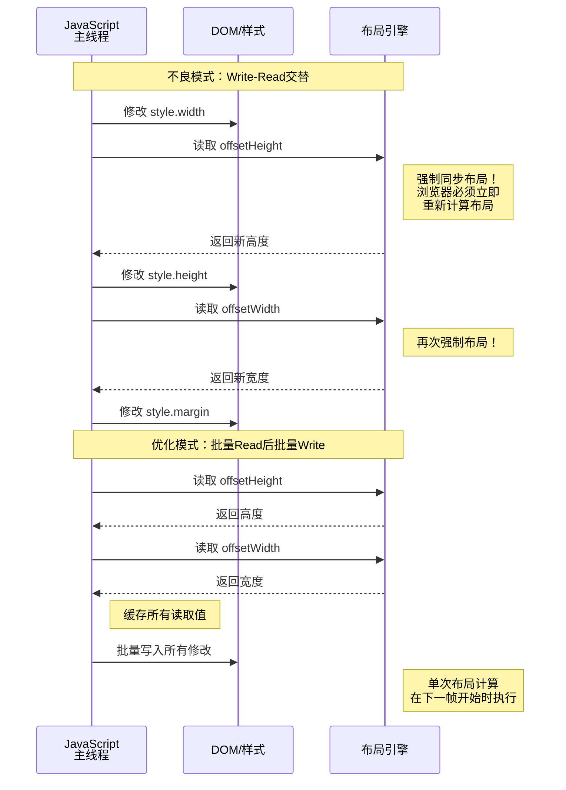
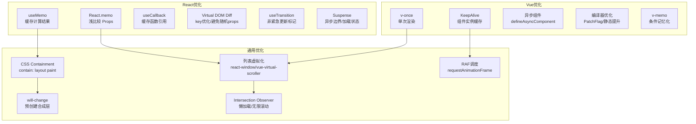

# 渲染性能：从像素到帧

浏览器的渲染流水线是前端性能工程中最复杂、最微妙的领域之一。它横跨JavaScript执行引擎、样式计算系统、布局引擎、光栅化器和GPU合成器，每一个环节都可能成为帧率瓶颈。本章从渲染流水线的形式化理论出发，系统映射到React与Vue框架中的具体优化策略，并深入探讨列表虚拟化、CSS Containment、强制同步布局避免等高级工程实践。

## 引言

用户与Web应用交互的每一帧，都是浏览器内部一场精密编排的「微型演出」。从JavaScript事件处理到最终像素呈现，浏览器必须在16.67毫秒内完成全部工作（以60fps为目标），否则用户将感知到卡顿（Jank）。这一时间窗口之短暂，意味着任何一环的延迟都将直接削减其他环节可用的时间预算。

渲染性能优化的核心矛盾在于：**浏览器的主线程是单线程的**。JavaScript执行、样式计算、布局、绘制均争夺同一个CPU核心。这与Amdahl定律描述的串行瓶颈高度一致——我们无法通过简单的「多线程JavaScript」来绕过这一根本限制（尽管Web Workers提供了有限的多线程能力，但DOM访问仍被限制在主线程）。因此，渲染优化的本质是**在时间预算内完成必要的工作，并将非关键工作推迟到帧的间隙或后续帧**。

## 理论严格表述

### 2.1 浏览器渲染流水线理论

浏览器的渲染流水线（Rendering Pipeline）是将HTML、CSS和JavaScript转换为屏幕上像素的一系列计算阶段。标准流水线包含以下五个阶段：

```
JavaScript → Style → Layout → Paint → Composite
```

#### 2.1.1 JavaScript阶段

在此阶段，浏览器执行JavaScript代码。这可能包括：

- 响应用户交互的事件处理程序
- 动画帧回调（`requestAnimationFrame`）
- 数据获取后的DOM更新逻辑
- 定时器回调（`setTimeout`、`setInterval`）

JavaScript是渲染流水线的「触发器」。大多数渲染工作都始于JavaScript对DOM或样式的修改。

#### 2.1.2 Style阶段（Recalculate Style）

当DOM发生变化或CSS选择器匹配关系改变时，浏览器需要重新计算哪些元素应用了哪些CSS规则。这一过程称为「样式重计算」。

样式计算的复杂度为 `O(n × m)`，其中 `n` 是DOM元素数量，`m` 是CSS规则数量。虽然浏览器引擎（如Blink、Gecko、WebKit）通过规则哈希、共享样式上下文等优化手段将实际复杂度降低到接近线性，但在极端情况下（如深层嵌套的选择器、大量的 `:nth-child` 规则），样式计算仍可能成为瓶颈。

#### 2.1.3 Layout阶段（Reflow）

布局阶段计算每个元素在视口中的确切位置和尺寸。这是一个自顶向下的过程：浏览器从根元素（`<html>`）开始，递归计算每个元素的几何属性（`width`、`height`、`position`、`margin`、`padding` 等）。

布局的复杂度为 `O(n)`，其中 `n` 是受影响DOM元素的数量。**全局布局**（修改了 `html` 或 `body` 的尺寸属性）将触发整个DOM树的重新计算；**局部布局**（修改了具有 `position: absolute` 或 `position: fixed` 的元素的尺寸）仅影响该元素及其后代。

#### 2.1.4 Paint阶段（Repaint）

绘制阶段将元素的视觉外观（颜色、背景、边框、阴影、文本等）转换为GPU可处理的绘制指令。浏览器将页面分割为多个「绘制层」（Paint Layers），每个层独立绘制。

绘制阶段的复杂度与元素数量、元素视觉复杂度（阴影、渐变、圆角等）以及绘制区域的大小成正比。现代浏览器使用多种优化技术（如脏矩形追踪、绘制列表缓存）来减少实际绘制的工作量。

#### 2.1.5 Composite阶段（Compositing）

合成阶段是渲染流水线的最后一步。浏览器将各个绘制层合成为最终的屏幕图像。现代浏览器利用GPU进行合成，将每个层转换为GPU纹理（Texture），由GPU执行最终的混合与输出。

合成阶段的优势在于：**合成是GPU并行执行的，且修改合成属性（`transform`、`opacity`）不需要触发前面的Layout和Paint阶段**。这使得基于 `transform` 和 `opacity` 的动画成为最高效的动画方式。

### 2.2 渲染帧的时序模型

以60fps为目标，浏览器必须在每帧16.67毫秒（`1000ms / 60 ≈ 16.67ms`）内完成渲染流水线的全部工作。这一时间预算并非完全可用——浏览器还需要执行内部任务（如事件处理、垃圾回收、定时器回调）。

**帧时间预算的分配**：

```
总帧预算: 16.67ms
├── 浏览器内部开销: ~2-3ms
├── JavaScript执行: 取决于应用逻辑
├── Style计算: 取决于CSS复杂度
├── Layout计算: 取决于DOM大小
├── Paint计算: 取决于绘制复杂度
└── Composite: 通常 < 1ms（GPU加速）
```

如果任何一帧的总处理时间超过16.67ms，浏览器将跳过该帧的显示，等待下一个VSync信号（垂直同步信号），导致帧率下降到30fps（33.33ms/帧）或更低。

**120fps设备的挑战**：随着120Hz刷新率显示器的普及，帧预算进一步压缩到8.33ms。这意味着过去在60fps下勉强通过的渲染工作，在120fps设备上将直接导致持续的帧丢失。

### 2.3 关键渲染路径（Critical Rendering Path, CRP）

关键渲染路径是浏览器将HTML、CSS和JavaScript转换为屏幕上像素所必须经过的最小资源集合和步骤序列。优化CRP的核心目标是**尽快完成首屏内容的渲染**。

**CRP的关键资源**：

- **CSS**：浏览器必须下载并解析所有CSS（包括外部样式表和内联样式）后才能开始渲染。CSS是**渲染阻塞资源**（Render-Blocking Resource）。
- **JavaScript**：默认情况下，`<script>` 标签（除非标记 `async` 或 `defer`）会阻塞HTML解析，因为JavaScript可能修改DOM或CSSOM。JavaScript是**解析阻塞资源**（Parser-Blocking Resource）。

**CRP优化理论**：

1. **最小化关键资源数量**：仅将首屏必需的CSS内联，延迟加载非关键CSS
2. **最小化关键资源大小**：压缩CSS和JavaScript，移除未使用的代码
3. **最小化关键路径长度**：减少资源依赖层级，避免串行加载链

### 2.4 合成层（Compositing Layer）的原理

合成层是GPU加速渲染的核心机制。当浏览器判断某个元素的绘制成本较高或其属性频繁变化时，会将该元素提升为独立的合成层（Compositor Layer）。

**层提升的触发条件**：

- 具有3D变换（`transform: translateZ(0)`、`transform: rotateY()` 等）
- 具有 `opacity` 动画
- 具有 `will-change: transform` 或 `will-change: opacity`
- 具有 `<video>`、`<canvas>`、`<iframe>` 等元素
- 具有固定定位（`position: fixed`）或粘性定位（`position: sticky`）
- 具有 `filter` 或 `mask` 属性
- 具有 `backface-visibility: hidden`

**层提升的代价**：每个合成层都消耗额外的GPU内存。在内存受限的移动设备上，过多的合成层（Layer Explosion）可能导致GPU内存耗尽，引发性能下降甚至崩溃。

**层压缩（Layer Squashing）**：现代浏览器会自动将相邻的、无重叠的合成层压缩为单个层，以减少内存开销。但某些条件（如层之间有重叠、层具有不同的透明度）会阻止压缩。

### 2.5 Layout Thrashing的形式化定义

Layout Thrashing（布局抖动）是指JavaScript代码在单次执行流程中交替进行DOM写操作和DOM读操作，导致浏览器被迫多次执行布局计算。

**形式化定义**：设JavaScript执行序列为 `[op_1, op_2, ..., op_n]`，其中每个 `op_i` 为读操作（Read，如访问 `offsetHeight`、`clientWidth`、`getBoundingClientRect()`）或写操作（Write，如修改 `style.width`、`className`）。如果存在子序列 `op_i = Write` 且 `op_{i+1} = Read`，则浏览器在 `op_{i+1}` 之前必须执行一次同步布局计算。这种Write-Read交替的次数称为**布局抖动次数**。

**最优策略**：将所有读操作批量执行，将所有写操作批量执行，即遵循 **Read-Batch-Then-Write-Batch** 模式：

```javascript
// 不良模式：Write-Read交替（Layout Thrashing）
for (let i = 0; i < elements.length; i++) {
    elements[i].style.width = (container.offsetWidth / 3) + 'px'; // Write, then Read
}

// 优化模式：先批量Read，再批量Write
const containerWidth = container.offsetWidth; // Read
const targetWidth = containerWidth / 3;
for (let i = 0; i < elements.length; i++) {
    elements[i].style.width = targetWidth + 'px'; // Write only
}
```

### 2.6 RAF（requestAnimationFrame）的调度理论

`requestAnimationFrame`（RAF）是浏览器提供的用于执行动画的API。它不是一个简单的定时器，而是与显示器的VSync信号深度集成的调度机制。

**RAF的调度语义**：

- RAF回调在下一帧的**Style和Layout阶段之前**执行
- 浏览器会在当前帧的所有RAF回调执行完毕后，统一进行一次Style计算和Layout计算
- 如果RAF回调执行时间超过帧预算，该帧将被跳过

**RAF vs setTimeout/setInterval**：

- `setTimeout(fn, 16)` 不感知VSync，可能在帧中间触发，导致丢帧
- `requestAnimationFrame` 与VSync对齐，确保回调在最佳时机执行
- `setTimeout` 的回调可能在浏览器执行Style/Layout的任意时刻触发，而RAF回调总是在这些阶段之前

**RAF的时间预算管理**：在RAF回调中，应仅执行与视觉更新直接相关的最少工作。如果单帧内无法完成全部工作，应将工作拆分到多帧中：

```javascript
function processChunk(deadline) {
    while (tasks.length > 0 && deadline.timeRemaining() > 0) {
        tasks.shift()();
    }
    if (tasks.length > 0) {
        requestIdleCallback(processChunk);
    }
}
```

## 工程实践映射

### 3.1 React的渲染优化

React的渲染模型基于Virtual DOM（虚拟DOM）和协调算法（Reconciliation）。虽然Virtual DOM已经比直接操作DOM高效，但在大规模应用和频繁更新场景下，仍需要开发者主动介入优化。

#### 3.1.1 React.memo

`React.memo` 是一个高阶组件，用于对函数组件进行浅比较（Shallow Comparison）优化。当组件的props和state未发生变化时，React将跳过该组件的重新渲染。

```jsx
const MemoizedComponent = React.memo(function MyComponent({ data, onClick }) {
    return (
        <div onClick={onClick}>
            {data.map(item => <span key={item.id}>{item.name}</span>)}
        </div>
    );
});
```

**陷阱**：如果props包含对象或函数（引用类型），即使内容相同，每次父组件渲染都会创建新的引用，导致 `React.memo` 的浅比较失效。解决方案是使用 `useMemo` 和 `useCallback`。

#### 3.1.2 useMemo

`useMemo` 用于缓存计算结果，避免在每次渲染时重复执行昂贵的计算：

```jsx
const processedData = useMemo(() => {
    return rawData.filter(item => item.active).sort((a, b) => a.priority - b.priority);
}, [rawData]);
```

`useMemo` 的依赖数组必须精确包含所有参与计算的变量。遗漏依赖会导致使用过期缓存；添加不必要的依赖会导致缓存频繁失效。

#### 3.1.3 useCallback

`useCallback` 用于缓存函数引用，防止 `React.memo` 子组件因函数props引用变化而重新渲染：

```jsx
const handleClick = useCallback((id) => {
    dispatch({ type: 'SELECT_ITEM', payload: id });
}, [dispatch]);
```

**注意**：`useCallback` 和 `useMemo` 本身也有开销（依赖比较、缓存管理）。对于简单组件和低开销计算，使用这些Hook可能得不偿失。

#### 3.1.4 Virtual DOM Diff优化

React的Diff算法基于两个假设：

1. 不同类型的元素产生不同的树（如 `<div>` 变为 `<span>`，整棵子树将被重建）
2. 开发者可以通过 `key` 属性提示哪些子元素是稳定的

**优化策略**：

- 避免在渲染中创建新的对象/数组字面量作为props
- 将 `key` 设置为稳定且唯一的标识符（如数据库ID），避免使用数组索引
- 将频繁更新和不频繁更新的部分拆分为独立组件

### 3.2 Vue的渲染优化

Vue 3的响应式系统基于Proxy，相比Vue 2的Object.defineProperty具有更好的性能和更完整的语言特性覆盖。Vue 3的编译器还引入了静态提升（Static Hoisting）、PatchFlag等优化机制。

#### 3.2.1 v-once

`v-once` 指令标记元素和组件仅渲染一次，跳过后续的更新：

```vue
<template>
    <div v-once>
        <h1>{{ staticTitle }}</h1>
        <p>{{ staticDescription }}</p>
    </div>
</template>
```

适用于内容永不变化或变化频率极低的区域。`v-once` 在编译阶段优化，零运行时开销。

#### 3.2.2 keep-alive

`<KeepAlive>` 是Vue的内置组件，用于缓存动态组件的实例，避免组件切换时的销毁和重建：

```vue
<template>
    <KeepAlive :include="['TabA', 'TabB']" :max="5">
        <component :is="activeTab" />
    </KeepAlive>
</template>
```

`<KeepAlive>` 通过LRU（Least Recently Used）缓存策略管理缓存实例。`:max` 属性限制最大缓存数量，当超出时最久未激活的实例将被销毁。

#### 3.2.3 异步组件

异步组件（Async Components）将组件的加载推迟到实际需要渲染时，减少首屏加载的JavaScript体积：

```javascript
const AsyncModal = defineAsyncComponent(() => import('./Modal.vue'));
```

Vue 3的 `defineAsyncComponent` 还支持加载状态、错误状态和超时配置：

```javascript
const AsyncModal = defineAsyncComponent({
    loader: () => import('./Modal.vue'),
    loadingComponent: LoadingSpinner,
    errorComponent: ErrorDisplay,
    delay: 200,
    timeout: 3000
});
```

#### 3.2.4 Vue 3编译器优化

Vue 3的模板编译器引入了多项渲染优化：

- **静态提升（Static Hoisting）**：将静态节点提升为常量，避免每次渲染时重新创建
- **PatchFlag**：在动态节点上标记具体的动态类型（文本、class、style、props等），Diff时仅比较标记的部分
- **Block Tree**：将模板划分为多个Block，每个Block跟踪自己的动态节点列表，减少遍历范围

这些优化大多是编译时自动完成的，开发者无需手动干预，但理解其原理有助于编写更「编译器友好」的模板。

### 3.3 列表虚拟化

当需要渲染大量列表项（如 thousands 行的表格、无限滚动 feed）时，即使使用React.memo或Vue的优化机制，DOM节点的数量本身就会成为性能瓶颈。列表虚拟化（List Virtualization）通过仅渲染视口内及少量缓冲区内的元素，将DOM节点数量从 `O(n)` 降低到 `O(1)`（相对于总数据量）。

#### 3.3.1 react-window

`react-window` 是React生态中最流行的虚拟化库，由React核心团队成员开发。它提供固定高度（`FixedSizeList`）和可变高度（`VariableSizeList`）两种列表模式：

```jsx
import { FixedSizeList as List } from 'react-window';

function VirtualList({ items }) {
    const Row = ({ index, style }) => (
        <div style={style} className="list-item">
            {items[index].name}
        </div>
    );

    return (
        <List
            height={500}
            itemCount={items.length}
            itemSize={50}
            width="100%"
        >
            {Row}
        </List>
    );
}
```

`react-window` 的核心原理：

- 计算视口高度和每项高度，确定需要渲染的起始索引和结束索引
- 使用绝对定位（`position: absolute`）将可见项放置在正确的滚动位置
- 监听滚动事件，动态更新渲染范围

#### 3.3.2 vue-virtual-scroller

`vue-virtual-scroller` 是Vue生态中的虚拟化解决方案，提供 `RecycleScroller` 和 `DynamicScroller` 等组件：

```vue
<template>
    <RecycleScroller
        class="scroller"
        :items="items"
        :item-size="50"
        key-field="id"
        v-slot="{ item }"
    >
        <div class="item">{{ item.name }}</div>
    </RecycleScroller>
</template>
```

`RecycleScroller` 不仅虚拟化渲染，还**回收组件实例**（Component Pooling），进一步减少创建和销毁开销。

#### 3.3.3 @tanstack/react-virtual

`@tanstack/react-virtual`（前身为 `react-virtual`）是新一代的Headless虚拟化库。它不提供UI组件，仅提供虚拟化的核心逻辑（滚动位置计算、可见范围计算），由开发者自行绑定到任意UI结构：

```jsx
import { useVirtualizer } from '@tanstack/react-virtual';

function VirtualList({ items }) {
    const parentRef = useRef();
    const virtualizer = useVirtualizer({
        count: items.length,
        getScrollElement: () => parentRef.current,
        estimateSize: () => 50,
    });

    return (
        <div ref={parentRef} style={{ height: '500px', overflow: 'auto' }}>
            <div style={{ height: `${virtualizer.getTotalSize()}px`, position: 'relative' }}>
                {virtualizer.getVirtualItems().map(virtualItem => (
                    <div
                        key={virtualItem.key}
                        style={{
                            position: 'absolute',
                            top: 0,
                            left: 0,
                            width: '100%',
                            height: `${virtualItem.size}px`,
                            transform: `translateY(${virtualItem.start}px)`,
                        }}
                    >
                        {items[virtualItem.index].name}
                    </div>
                ))}
            </div>
        </div>
    );
}
```

### 3.4 CSS Containment

CSS Containment（包含性）是CSS规范中的一项性能优化属性，它允许开发者显式声明元素的边界，限制样式、布局、绘制和尺寸计算的影响范围。

**contain属性的取值**：

| 值 | 含义 |
|----|------|
| `layout` | 元素的布局不影响外部，外部布局也不影响元素内部 |
| `paint` | 元素的绘制不影响外部，可clip溢出内容 |
| `size` | 元素尺寸不依赖子元素，可跳过子元素计算尺寸 |
| `style` | 计数器（counter）和引号（quote）不影响外部 |
| `content` | 等价于 `layout paint style` |
| `strict` | 等价于 `layout paint size style` |

**应用场景**：

```css
.widget {
    contain: layout paint;
}

/* 对于第三方组件或独立UI模块 */
.third-party-component {
    contain: strict;
}
```

当设置 `contain: layout` 时，浏览器知道该元素内部的布局变化不会影响外部元素，因此可以跳过外部元素的重新布局。在大型页面中，这能显著降低单次样式修改的级联影响范围。

### 3.5 will-change的合理使用

`will-change` 是CSS属性，用于提前告知浏览器哪些属性即将发生变化，使浏览器能够预先创建合成层或执行其他优化准备。

**语法**：

```css
.element {
    will-change: transform, opacity;
}
```

**最佳实践**：

- **仅在即将动画的元素上使用**：`will-change` 有内存开销，不应全局应用
- **动画结束后移除**：动画完成后及时移除 `will-change`，释放GPU资源
- **不要用于静态元素**：对于不发生变化的元素，`will-change` 只会浪费内存
- **考虑使用 `transform: translateZ(0)` 替代**：这在某些场景下能触发层提升而不需要显式声明 `will-change`

**反模式警告**：

```css
/* 错误：全局应用 */
* {
    will-change: transform;
}

/* 错误：过早声明 */
.element {
    will-change: transform; /* 用户可能永远不会滚动到此元素 */
}
```

### 3.6 避免强制同步布局

强制同步布局（Forced Synchronous Layout，也称为Forced Reflow）是前端性能的头号杀手之一。它发生在JavaScript读取布局属性后紧接着修改样式，迫使浏览器在执行下一行JavaScript之前完成布局计算。

**常见的读取属性（触发Layout）**：

- `offsetWidth`、`offsetHeight`、`offsetTop`、`offsetLeft`
- `clientWidth`、`clientHeight`
- `scrollWidth`、`scrollHeight`、`scrollTop`、`scrollLeft`
- `getBoundingClientRect()`
- `getComputedStyle()`
- `offsetParent`

**避免策略**：

```javascript
// 反模式：强制同步布局
function badUpdate() {
    const height = element.offsetHeight; // Read（触发Layout）
    element.style.height = (height * 2) + 'px'; // Write
    const newWidth = element.offsetWidth; // Read（再次触发Layout！）
    element.style.width = (newWidth * 0.5) + 'px'; // Write
}

// 优化模式：批量读取，批量写入
function goodUpdate() {
    // Phase 1: 批量读取
    const height = element.offsetHeight;
    const width = element.offsetWidth;

    // Phase 2: 批量写入
    requestAnimationFrame(() => {
        element.style.height = (height * 2) + 'px';
        element.style.width = (width * 0.5) + 'px';
    });
}
```

**FastDOM模式**：FastDOM是一个轻量级库，通过将读写操作队列化到不同的动画帧中，彻底消除强制同步布局：

```javascript
fastdom.measure(() => {
    const width = element.offsetWidth;
    fastdom.mutate(() => {
        element.style.width = (width * 2) + 'px';
    });
});
```

### 3.7 Intersection Observer的懒加载实现

Intersection Observer API提供了一种异步监听元素与其祖先元素或视口交叉状态的能力。相比传统的滚动事件监听（需要频繁执行 `getBoundingClientRect()` 导致强制同步布局），Intersection Observer是**完全异步的**，不会阻塞主线程。

**图片懒加载实现**：

```javascript
const imageObserver = new IntersectionObserver((entries, observer) => {
    entries.forEach(entry => {
        if (entry.isIntersecting) {
            const img = entry.target;
            img.src = img.dataset.src;
            img.classList.remove('lazy');
            observer.unobserve(img);
        }
    });
}, {
    rootMargin: '50px 0px', // 提前50px开始加载
    threshold: 0.01
});

document.querySelectorAll('img[data-src]').forEach(img => {
    imageObserver.observe(img);
});
```

**无限滚动实现**：

```javascript
const sentinel = document.querySelector('.scroll-sentinel');
const scrollObserver = new IntersectionObserver((entries) => {
    entries.forEach(entry => {
        if (entry.isIntersecting) {
            loadMoreItems(); // 异步加载下一页数据
        }
    });
}, { rootMargin: '200px' });

scrollObserver.observe(sentinel);
```

## Mermaid 图表

### 浏览器渲染流水线详解

```mermaid
flowchart LR
    subgraph 渲染流水线
        JS[JavaScript执行<br/>事件处理/DOM修改]
        Style[样式计算<br/>Recalculate Style<br/>O(n × m)]
        Layout[布局计算<br/>Layout/Reflow<br/>O(n)]
        Paint[绘制计算<br/>Paint/Repaint]
        Composite[合成层<br/>Composite<br/>GPU加速]
        Screen[屏幕像素]
    end

    JS --> Style
    Style --> Layout
    Layout --> Paint
    Paint --> Composite
    Composite --> Screen

    style JS fill:#f96,stroke:#333
    style Style fill:#ff9,stroke:#333
    style Layout fill:#f96,stroke:#333,stroke-width:2px
    style Paint fill:#ff9,stroke:#333
    style Composite fill:#9f9,stroke:#333,stroke-width:2px
```

### 强制同步布局的恶性循环



### React与Vue渲染优化策略对比



## 理论要点总结

1. **浏览器渲染流水线**的五个阶段（JavaScript → Style → Layout → Paint → Composite）构成了一个串行处理链。优化的核心原则是：**减少阶段数量、降低每个阶段的复杂度、将工作移交给GPU（Composite阶段）**。

2. **16.67毫秒的帧预算**是60fps的硬约束。任何超出预算的工作都会导致丢帧。在120fps设备上，这一预算进一步压缩到8.33ms。渲染优化必须以最慢的target设备为基准，而非开发者的顶配工作站。

3. **关键渲染路径理论**指导我们识别和优化首屏渲染的阻塞资源。CSS是渲染阻塞的，JavaScript是解析阻塞的——将非关键CSS延迟加载、为 `<script>` 标签添加 `async`/`defer` 属性是CRP优化的基本操作。

4. **合成层机制**提供了绕过Layout和Paint阶段的「快车道」。基于 `transform` 和 `opacity` 的动画是最高效的，因为它们仅需Composite阶段处理。但过度使用 `will-change` 和层提升会导致GPU内存爆炸，在移动设备上尤为危险。

5. **Layout Thrashing的形式化定义**揭示了Write-Read交替的性能代价。遵循「先批量读取、再批量写入」的原则，或使用FastDOM等库将读写分离到不同帧，是避免强制同步布局的核心策略。

6. **`requestAnimationFrame` 不是定时器**，而是与VSync对齐的渲染调度机制。它确保视觉更新在显示器的最佳刷新时机执行，避免了 `setTimeout` 可能导致的帧中间更新问题。

7. **列表虚拟化**将DOM复杂度从 `O(n)` 降低到 `O(viewport_size / item_size)`，是处理大数据量列表的必备技术。`react-window`、 `vue-virtual-scroller` 和 `@tanstack/react-virtual` 分别代表了封装组件和Headless逻辑两种设计范式。

8. **Intersection Observer** 是懒加载和无限滚动的现代标准方案。它完全异步，不触发强制同步布局，相比滚动事件监听具有本质性的性能优势。

## 参考资源

1. **Google Developers**. "Rendering Performance." <https://developer.chrome.com/docs/devtools/performance/>. Chrome官方文档，详细解释了渲染流水线的每个阶段、如何使用Performance面板诊断渲染问题，以及常见的渲染性能瓶颈。

2. **React Documentation**. "Optimizing Performance." <https://react.dev/reference/react>. React官方性能优化指南，涵盖React.memo、useMemo、useCallback、useTransition和Suspense的使用场景和最佳实践。

3. **Vue.js Documentation**. "Performance." <https://vuejs.org/guide/best-practices/performance.html>. Vue官方性能文档，详细介绍了Vue 3的编译器优化、KeepAlive、异步组件、v-once等内置优化机制。

4. **Irish, Paul**. "Rendering Performance Case Studies." Google Developers Blog. Paul Irish是Chrome DevTools的前核心开发者，他的文章和演讲深入揭示了浏览器渲染的内部机制，特别是合成层和强制同步布局的优化策略。

5. **W3C CSS Containment Module Level 2**. <https://www.w3.org/TR/css-contain-2/>. CSS Containment的W3C规范文档，定义了 `contain` 属性的形式化语义和各取值的确切行为边界。
