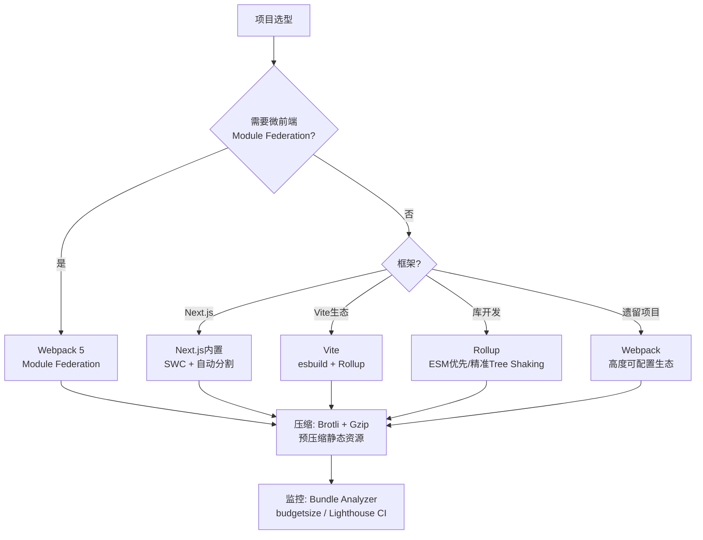

# 打包优化：从源代码到字节

在现代Web工程中，源代码与最终交付给浏览器的字节之间横亘着一条复杂而漫长的编译-打包-压缩链条。这条链条的每一步都蕴含着深刻的理论问题：哪些代码该被包含在初始包中？如何证明某段代码在运行时是死代码？模块依赖图的最小化是NP-Hard问题吗？压缩算法的信息论极限在哪里？本章从形式化理论出发，系统映射到Vite、Webpack、Next.js、Rollup等主流构建工具的工程实践。

## 引言

Web应用的性能优化通常遵循「从外到内」的层次结构：网络层优化减少传输时间，缓存策略减少重复请求，而打包优化则直接减少需要传输的字节数。在所有性能优化手段中，**减少传输体积（Payload Size）** 是最具确定性的优化——根据香农信息论，传输更少的数据必然消耗更少的时间（在带宽恒定的前提下）。

然而，打包优化面临着根本性的张力：

- **加载速度与执行速度的张力**：将代码打包为单个大文件减少了HTTP请求数，但增加了首次解析和执行的时间
- **通用性与专用性的张力**：预打包通用库提高了缓存命中率，但可能向用户发送了永远不会执行的代码
- **构建速度与输出质量的张力**：深度优化（如高级Tree Shaking、跨模块常量传播）需要更长的构建时间

打包优化的核心工具——代码分割（Code Splitting）、Tree Shaking、模块依赖图分析和压缩——每一项都有坚实的理论基础。理解这些理论，才能在工程实践中做出正确的权衡。

## 理论严格表述

### 2.1 代码分割的理论基础

代码分割（Code Splitting）是将应用代码拆分为多个独立chunk（代码块）的技术，使得浏览器可以按需加载，而非一次性下载全部代码。

#### 2.1.1 三种分割策略

从形式化角度，代码分割策略可分为三类：

**入口点分割（Entry Point Splitting）**：
设应用有 `n` 个独立入口（如多页面应用的不同页面），每个入口 `E_i` 依赖模块集合 `M(E_i)`。入口点分割为每个入口生成独立的chunk `C_i`，其中 `C_i` 包含 `M(E_i)` 的传递闭包（Transitive Closure）。

```
C_i = Closure(M(E_i)) = M(E_i) ∪ {m | ∃m' ∈ M(E_i), m' depends on m}
```

**动态导入分割（Dynamic Import Splitting）**：
设模块 `A` 通过动态导入 `import('./B.js')` 加载模块 `B`。构建工具将 `B` 及其传递依赖（排除已被同步chunk包含的模块）分离为独立的异步chunk `C_async`。

**共享模块分割（Shared Module Splitting / SplitChunks）**：
设有两个chunk `C_1` 和 `C_2`，它们共同依赖模块集合 `S = M(C_1) ∩ M(C_2)`。SplitChunks策略将 `S` 中提取为独立的共享chunk `C_shared`，使得：

```
|C_1| + |C_2| + |C_shared| < |C_1 ∪ S| + |C_2 ∪ S|
```

当共享模块的总大小超过某个阈值，且被至少 `minChunks` 个chunk共享时，提取操作才具有净收益。

#### 2.1.2 SplitChunks优化目标

SplitChunks策略试图解决一个组合优化问题：给定模块依赖图 `G = (V, E)` 和chunk集合 `C = {C_1, C_2, ..., C_n}`，寻找模块到chunk的映射 `f: V → 2^C`，使得总传输成本最小。

总传输成本可形式化为：

```
Cost = Σ|C_i| × P(C_i)
```

其中 `P(C_i)` 是chunk `C_i` 被加载的概率（或频率）。该问题的精确求解是NP-Hard的（可规约为图划分问题），因此构建工具使用启发式算法（如贪心策略、模块大小阈值、共享计数阈值）来近似求解。

### 2.2 Tree Shaking的算法

Tree Shaking（摇树优化）是一个比喻性术语，其核心是**死代码消除（Dead Code Elimination, DCE）**。它通过静态分析确定哪些代码在运行时永远不会被执行，从而在打包时将其移除。

#### 2.2.1 死代码的形式化定义

设程序的控制流图为 `CFG = (N, E, n_entry, n_exit)`，其中 `N` 是基本块集合，`E` 是控制流边，`n_entry` 和 `n_exit` 分别是入口和出口节点。

一段代码（基本块或语句）是「死代码」，当且仅当：

1. **不可达性（Unreachability）**：从 `n_entry` 出发不存在到达该代码的路径；或
2. **无效果性（No Effect）**：该代码的执行对程序的输出状态没有任何可观察的影响（如赋值给后续未被使用的变量、无副作用的纯函数调用）。

#### 2.2.2 ES Module的静态分析优势

ES Module（ESM）相比CommonJS（CJS）具有关键的结构优势，使得Tree Shaking成为可能：

- **静态导入声明**：`import` 和 `export` 必须是顶层语句，不能出现在条件分支或函数内部。这使得模块依赖关系在解析阶段即可完全确定，无需执行代码。
- **不可变绑定**：导入的绑定是只读的引用，不能被重新赋值。这保证了分析工具可以追踪绑定的使用链。
- **显式导出**：模块明确声明了哪些绑定被导出，分析工具可以快速确定未导出的绑定是否为内部使用。

相比之下，CommonJS的 `require()` 是运行时函数调用，可以出现在任意位置，且 `module.exports` 可以被动态修改。这使得对CJS模块的精确静态分析在一般情况下是不可判定的（Undecidable）。

#### 2.2.3 Tree Shaking的两阶段模型

现代打包工具的Tree Shaking通常分为两个阶段：

**阶段一：使用标记（Used-Exports / Reachability Analysis）**
从入口模块开始，沿着导入链标记所有被引用的导出。未被标记的导出被视为潜在的「可摇掉」代码。

**阶段二：副作用分析（Side-Effect Analysis）**
即使某个导出未被直接引用，如果模块的顶层代码具有副作用（如修改全局变量、注册Polyfill、执行IIFE），则整个模块不能被移除。打包工具通过 `sideEffects` 字段（package.json）或 `moduleSideEffects` 配置来获取副作用提示。

**形式化地**：模块 `M` 可被安全移除，当且仅当：

```
∀e ∈ Exports(M), e ∉ UsedExports  ∧  SideEffects(M) = false
```

### 2.3 Bundle Analyzer的可视化原理

Bundle Analyzer工具（如 `webpack-bundle-analyzer`、Rollup的 `rollup-plugin-visualizer`）将打包产物的大小信息可视化为交互式树图（Treemap）或旭日图（Sunburst）。

**Treemap的可视化映射**：

- 每个矩形代表一个模块或模块组
- 矩形的面积与模块的gzip后（或原始）大小成正比
- 矩形的嵌套关系反映模块的依赖层级
- 颜色编码通常表示模块类型（源码/依赖/node_modules）

**可视化原理的信息论基础**：Treemap是一种空间填充曲线（Space-Filling Curve）可视化技术。它利用人眼对面积的敏感性和对颜色的分辨能力，将高维的模块依赖信息映射到二维平面。研究表明，人类视觉系统对面积差异的感知遵循史蒂文斯幂定律（Stevens' Power Law），因此Treemap的面积编码比长度编码更适合表示数量差异。

### 2.4 模块依赖图的最小化

模块依赖图（Module Dependency Graph, MDG）是打包过程的核心数据结构。它是一个有向图 `G = (V, E)`，其中顶点 `V` 是模块，边 `E` 是导入关系。

**MDG的最小化问题**：给定入口模块集合 `E ⊆ V`，寻找最小的子图 `G' = (V', E')`，使得 `G'` 包含从 `E` 中所有节点可达的全部节点，且 `G'` 在运行时行为上与原图等价。

该问题的复杂性来源于：

- **动态导入**：`import()` 的加载条件是运行时决定的，静态分析只能确定可能的加载集合
- **条件导入**：`if (process.env.NODE_ENV === 'production') { require('./prod.js') } else { require('./dev.js') }`
- **循环依赖**：`A → B → C → A` 的循环依赖增加了分析的复杂性

现代打包工具通过**常量传播（Constant Propagation）**和**条件死代码消除**来处理条件导入。例如，当 `process.env.NODE_ENV` 被替换为字面量 `'production'` 后，条件分支的另一侧成为不可达代码，可以被消除。

### 2.5 压缩算法的理论

#### 2.5.1 Gzip的Deflate算法

Gzip基于DEFLATE算法，该算法结合了两种压缩技术：

**LZ77字典编码**：将重复出现的字符串替换为指向先前出现的指针（距离-长度对）。设当前位置为 `i`，如果子串 `S[i..i+l-1]` 在滑动窗口 `S[i-w..i-1]` 中存在匹配，则将其替换为 `(distance, length)` 对。

**哈夫曼编码（Huffman Coding）**：基于字符频率构建最优前缀码。设字符集 `Σ` 中字符 `c` 的出现频率为 `f(c)`，哈夫曼编码的目标是最小化期望编码长度：

```
L = Σ f(c) × length(code(c))
```

哈夫曼编码满足**前缀码性质**（Prefix-Free Property），即任何字符的编码都不是另一个字符编码的前缀，保证了唯一可解码性。

#### 2.5.2 Brotli算法

Brotli是Google开发的现代压缩算法，在多数场景下比Gzip提供20%-26%更高的压缩率。Brotli的核心创新包括：

**静态字典（Static Dictionary）**：Brotli内置了超过12,000个常用单词和短语的静态字典（包含多种语言和Web常见内容）。这允许它压缩即使在输入中首次出现的字符串（如 `"function"`、`"return"`、`"undefined"`）。

**更大的上下文窗口**：Brotli支持最大16MB的滑动窗口（Gzip为32KB），能更好地利用大型文件中的远距离重复。

**更精细的上下文建模**：Brotli使用二阶上下文建模（Second-Order Context Modeling），根据前两个字符的条件概率进行熵编码，比哈夫曼编码的一阶频率建模更精确。

**压缩率与速度的权衡**：Brotli在最高压缩级别（level 11）时压缩速度显著慢于Gzip，但解压速度与Gzip相当甚至更快。因此，Brotli适用于预压缩静态资源（在构建时压缩），而Gzip仍适用于动态内容的实时压缩。

## 工程实践映射

### 3.1 Vite的Rollup构建优化

Vite在开发阶段使用原生ESM提供极速的冷启动，在生产构建阶段则使用Rollup进行深度优化。Vite的生产构建配置提供了丰富的代码分割和预加载控制。

#### 3.1.1 manualChunks

Vite通过 `build.rollupOptions.output.manualChunks` 允许开发者手动控制代码分割：

```javascript
// vite.config.js
export default {
    build: {
        rollupOptions: {
            output: {
                manualChunks(id) {
                    // 将node_modules中的代码分割到vendor chunk
                    if (id.includes('node_modules')) {
                        if (id.includes('react') || id.includes('react-dom')) {
                            return 'vendor-react';
                        }
                        if (id.includes('lodash')) {
                            return 'vendor-lodash';
                        }
                        return 'vendor';
                    }
                    // 将路由级别的代码按目录分割
                    if (id.includes('/src/pages/dashboard/')) {
                        return 'dashboard';
                    }
                }
            }
        }
    }
};
```

`manualChunks` 的核心价值在于：

- **缓存稳定性**：将不常变化的第三方库与频繁变化的业务代码分离，提高长期缓存命中率
- **并行加载**：浏览器可以并行下载多个chunk，充分利用HTTP/2的多路复用
- **细粒度控制**：允许基于业务逻辑而非技术边界进行分割

#### 3.1.2 dynamicImport与预加载

Vite自动处理动态导入的代码分割，并生成预加载指令：

```javascript
// 源码
const AdminPanel = lazy(() => import('./AdminPanel.jsx'));

// Vite生成的输出包含预加载提示
// `<link rel="prefetch" href="/assets/AdminPanel-xxx.js">`
```

Vite的预加载策略：

- **preload**：用于当前页面立即需要的资源（通过 `<link rel="modulepreload">`）
- **prefetch**：用于未来可能需要的资源（通过 `<link rel="prefetch">`），以低优先级在浏览器空闲时加载

```javascript
// vite.config.js - 预加载配置
export default {
    build: {
        modulePreload: {
            polyfill: true // 为不支持modulepreload的浏览器注入polyfill
        }
    }
};
```

### 3.2 Webpack的SplitChunks配置

Webpack的 `SplitChunksPlugin` 是业界最强大也最复杂的代码分割工具。其配置选项提供了对分割行为的细粒度控制。

```javascript
// webpack.config.js
module.exports = {
    optimization: {
        splitChunks: {
            chunks: 'all', // 对同步和异步chunk都进行分割
            minSize: 20000, // 最小分割大小：20KB
            minRemainingSize: 0,
            minChunks: 1, // 最少被几个chunk共享才提取
            maxAsyncRequests: 30, // 异步chunk的最大并行请求数
            maxInitialRequests: 30, // 入口chunk的最大并行请求数
            enforceSizeThreshold: 50000,
            cacheGroups: {
                defaultVendors: {
                    test: /[\\/]node_modules[\\/]/,
                    priority: -10,
                    reuseExistingChunk: true,
                    name(module, chunks, cacheGroupKey) {
                        const moduleFileName = module
                            .identifier()
                            .split('/')
                            .reduceRight((item) => item);
                        return `${cacheGroupKey}-${moduleFileName}`;
                    }
                },
                default: {
                    minChunks: 2,
                    priority: -20,
                    reuseExistingChunk: true
                },
                // 自定义缓存组：提取大型共享库
                reactVendor: {
                    test: /[\\/]node_modules[\\/](react|react-dom|react-router-dom)[\\/]/,
                    name: 'react-vendor',
                    chunks: 'all',
                    priority: 10 // 更高优先级，确保先匹配此规则
                }
            }
        }
    }
};
```

**关键配置解读**：

- `chunks: 'all'`：同时处理同步（`import`）和异步（`import()`）chunk的共享模块提取
- `cacheGroups`：定义模块分组规则，每个组可以有自己的 `test`、`priority`、`name` 和 `enforce` 配置
- `reuseExistingChunk`：如果某个模块已经被提取到共享chunk中，优先复用而非创建新的chunk
- `priority`：当模块匹配多个cacheGroup时，优先级高的组胜出

### 3.3 Next.js的自动代码分割

Next.js在框架层面实现了多种自动代码分割策略，开发者无需手动配置即可获得良好的分割效果。

#### 3.3.1 路由级自动分割

Next.js自动以页面（Page）为边界进行代码分割。每个 `pages/*.js` 或 `app/**/page.js` 文件自动成为独立的chunk：

```
pages/
├── index.js      → 自动分割为独立的入口chunk
├── about.js      → 自动分割为独立的入口chunk
├── dashboard.js  → 自动分割为独立的入口chunk
└── api/          → API路由在服务端执行，不参与客户端分割
```

#### 3.3.2 组件级分割

Next.js提供 `next/dynamic` 辅助函数，简化React动态导入的使用：

```jsx
import dynamic from 'next/dynamic';

const HeavyChart = dynamic(() => import('../components/HeavyChart'), {
    loading: () => <p>Loading chart...</p>,
    ssr: false // 禁用服务端渲染，仅在客户端加载
});

export default function Dashboard() {
    return (
        <div>
            <h1>Dashboard</h1>
            <HeavyChart />
        </div>
    );
}
```

#### 3.3.3 第三方脚本优化

Next.js 12+ 提供了 `<Script>` 组件，自动优化第三方脚本的加载策略：

```jsx
import Script from 'next/script';

export default function Page() {
    return (
        <>
            <Script
                src="https://analytics.example.com/script.js"
                strategy="lazyOnload" // 在页面加载完成后加载
            />
            <Script
                src="https://critical-script.example.com/script.js"
                strategy="beforeInteractive" // 在页面交互前加载
            />
        </>
    );
}
```

### 3.4 Rollup的Tree Shaking配置

Rollup是ESM优先的打包工具，其Tree Shaking实现被认为是业界最精准的。理解Rollup的Tree Shaking机制有助于编写「可摇树」的代码。

#### 3.4.1 sideEffects配置

在 `package.json` 中声明 `sideEffects` 字段，告知打包工具哪些文件具有副作用：

```json
{
    "name": "my-library",
    "sideEffects": [
        "*.css",
        "*.scss",
        "./src/polyfill.js"
    ]
}
```

```json
{
    "name": "pure-library",
    "sideEffects": false
}
```

**重要陷阱**：如果声明 `"sideEffects": false` 但实际上某些文件有副作用（如CSS导入、全局Polyfill注册），这些文件可能被错误地Tree Shake掉，导致运行时错误。

#### 3.4.2 moduleSideEffects配置

在Rollup配置中，可以通过插件精细控制每个模块的副作用状态：

```javascript
// rollup.config.js
export default {
    treeshake: {
        moduleSideEffects(id) {
            // 保留CSS文件的副作用
            if (id.endsWith('.css')) return true;
            // 对特定库保留副作用
            if (id.includes('some-polyfill-lib')) return true;
            return false;
        }
    }
};
```

#### 3.4.3 编写可Tree Shaking的代码

```javascript
// ✅ 良好模式：纯函数、显式导出
export function add(a, b) { return a + b; }
export function subtract(a, b) { return a - b; }

// ❌ 不良模式：对象命名空间导出（难以静态分析）
export default {
    add(a, b) { return a + b; },
    subtract(a, b) { return a - b; }
};

// ❌ 不良模式：动态属性访问
const methods = { add, subtract };
export function execute(name, ...args) {
    return methods[name](...args); // 静态分析无法确定使用了哪些导出
}
```

### 3.5 Brotli vs Gzip压缩对比

在生产环境中，同时启用Gzip和Brotli压缩是最佳实践。大多数现代CDN和Web服务器支持根据请求头的 `Accept-Encoding` 自动选择压缩算法。

**压缩率对比（典型JavaScript/CSS文件）**：

| 文件类型 | 原始大小 | Gzip | Brotli | Brotli节省 |
|---------|---------|------|--------|-----------|
| React DOM (prod) | 120KB | 38KB | 31KB | ~18% |
| Tailwind CSS | 280KB | 42KB | 28KB | ~33% |
| Lodash ES | 70KB | 24KB | 20KB | ~17% |
| 典型业务JS | 500KB | 140KB | 105KB | ~25% |

**服务器配置示例（Nginx）**：

```nginx
http {
    # Brotli压缩（需安装ngx_brotli模块）
    brotli on;
    brotli_comp_level 6;
    brotli_types text/plain text/css application/javascript application/json;

    # Gzip压缩（降级支持）
    gzip on;
    gzip_comp_level 6;
    gzip_types text/plain text/css application/javascript application/json;
}
```

**Vite构建时预压缩**：

```javascript
// vite.config.js
import { defineConfig } from 'vite';
import compression from 'vite-plugin-compression';

export default defineConfig({
    plugins: [
        compression({
            algorithm: 'gzip',
            ext: '.gz'
        }),
        compression({
            algorithm: 'brotliCompress',
            ext: '.br'
        })
    ]
});
```

### 3.6 资源内联阈值

资源内联（Inlining）是将小型资源（如SVG图标、CSS关键路径、小型JS工具函数）直接嵌入HTML或JavaScript中，而非作为独立文件请求。内联消除了额外的HTTP请求开销，但增加了父资源的体积，且无法独立缓存。

**内联阈值决策模型**：

```
内联收益 = RTT（往返时间）+ 请求开销
内联成本 = 增加父资源大小 × 父资源加载概率
应内联当且仅当：内联收益 > 内联成本
```

在HTTP/2环境下，由于多路复用降低了请求开销，内联阈值应相应提高（通常从HTTP/1.1的~1KB提高到HTTP/2的~4-8KB）。

**Vite内联配置**：

```javascript
// vite.config.js
export default {
    build: {
        assetsInlineLimit: 4096, // 小于4KB的资源内联为base64
        cssCodeSplit: true,      // CSS代码分割
        cssMinify: true
    }
};
```

### 3.7 Module Federation的微前端代码共享

Module Federation是Webpack 5引入的架构级特性，它允许多个独立构建的应用在运行时共享模块。这彻底改变了微前端架构中的代码重复问题。

**核心概念**：

- **Host（宿主应用）**：消费远程模块的应用
- **Remote（远程应用）**：暴露模块供其他应用消费的应用
- **Shared（共享依赖）**：在多个应用间共享的模块（如React、ReactDOM）

**配置示例**：

```javascript
// Host应用配置
const ModuleFederationPlugin = require('webpack/lib/container/ModuleFederationPlugin');

module.exports = {
    plugins: [
        new ModuleFederationPlugin({
            name: 'host',
            remotes: {
                dashboard: 'dashboard@https://dashboard.example.com/remoteEntry.js',
                profile: 'profile@https://profile.example.com/remoteEntry.js'
            },
            shared: {
                react: { singleton: true, requiredVersion: '^18.0.0' },
                'react-dom': { singleton: true, requiredVersion: '^18.0.0' }
            }
        })
    ]
};

// Remote应用配置
module.exports = {
    plugins: [
        new ModuleFederationPlugin({
            name: 'dashboard',
            filename: 'remoteEntry.js',
            exposes: {
                './Widget': './src/components/Widget.jsx',
                './Chart': './src/components/Chart.jsx'
            },
            shared: {
                react: { singleton: true },
                'react-dom': { singleton: true }
            }
        })
    ]
};

// 在Host中使用Remote模块
const Widget = React.lazy(() => import('dashboard/Widget'));
```

**Module Federation的优势**：

1. **运行时共享**：共享依赖（如React）仅在首次加载时下载，后续应用使用已缓存的实例
2. **独立部署**：各微前端应用可以独立构建、独立部署，无需协调发布
3. **版本兼容性**：通过 `requiredVersion` 和 `singleton` 配置管理共享依赖的版本冲突

### 3.8 SWC/esbuild的编译速度优势

传统上，JavaScript/TypeScript的转译依赖Babel，但Babel的单线程架构和基于AST的纯JavaScript实现使其在大型项目中构建缓慢。SWC和esbuild代表了新一代编译工具，它们通过Rust和Go实现，带来数量级的速度提升。

**性能对比（转译10万行TypeScript代码）**：

| 工具 | 语言 | 耗时 |
|------|------|------|
| Babel | JavaScript | ~2500ms |
| esbuild | Go | ~50ms |
| SWC | Rust | ~30ms |

**SWC在Next.js中的使用**：

Next.js 12+ 默认使用SWC替代Babel进行编译。SWC不仅处理转译，还支持压缩（Terser替代方案）、Tree Shaking和JSX转换。

```javascript
// next.config.js
module.exports = {
    swcMinify: true, // 使用SWC替代Terser进行代码压缩
    experimental: {
        // SWC插件生态
        swcPlugins: [
            ['@swc/plugin-styled-components', {}]
        ]
    }
};
```

**esbuild在Vite中的使用**：

Vite使用esbuild完成两项关键任务：

1. **依赖预构建（Dependency Pre-bundling）**：将CJS格式的依赖转换为ESM，减少模块请求数
2. **TypeScript/JavaScript转译**：在开发阶段提供极速的HMR（热模块替换）

```javascript
// vite.config.js - esbuild配置
export default {
    esbuild: {
        target: 'es2020',
        jsxInject: `import React from 'react'`,
        drop: ['console', 'debugger'] // 生产环境移除console和debugger
    }
};
```

**注意事项**：SWC和esbuild的压缩质量（代码体积）通常略逊于Terser，但差距在持续缩小。对于极致体积敏感的场景，可以先用SWC/esbuild进行快速开发构建，生产构建再使用Terser进行深度优化。

## Mermaid 图表

### 代码分割策略对比

```mermaid
flowchart TB
    subgraph 入口点分割
        E1[入口A<br/>pages/home.js]
        E2[入口B<br/>pages/about.js]
        E3[入口C<br/>pages/dashboard.js]
        C1[chunk-home.js]
        C2[chunk-about.js]
        C3[chunk-dashboard.js]
        E1 --> C1
        E2 --> C2
        E3 --> C3
    end

    subgraph 动态导入分割
        App[App.js]
        D1[import('./Modal')]
        D2[import('./Chart')]
        A1[async-chunk-Modal.js]
        A2[async-chunk-Chart.js]
        App --> D1
        App --> D2
        D1 -.->|按需加载| A1
        D2 -.->|按需加载| A2
    end

    subgraph SplitChunks共享分割
        S1[chunk-page1.js]
        S2[chunk-page2.js]
        S3[chunk-page3.js]
        Shared[vendor-react.js<br/>vendor-lodash.js]
        S1 --> Shared
        S2 --> Shared
        S3 --> Shared
    end
```

### 打包工具链决策树



### Tree Shaking两阶段流程

```mermaid
flowchart LR
    subgraph 输入
        Entry[入口模块]
        Lib[大型库<br/>lodash-es / date-fns]
        Utils[工具函数库]
    end

    subgraph 阶段1：使用标记
        Mark1[从Entry出发<br/>DFS遍历导入链]
        Mark2[标记所有被引用的导出]
        Mark3[未标记导出 = 候选死代码]
    end

    subgraph 阶段2：副作用分析
        Side1[检查模块sideEffects]
        Side2[sideEffects=false<br/>且未标记 → 安全移除]
        Side3[sideEffects=true<br/>或有顶层副作用 → 保留模块]
    end

    subgraph 输出
        Kept[保留代码]
        Removed[移除代码]
    end

    Entry --> Mark1
    Lib --> Mark1
    Utils --> Mark1
    Mark1 --> Mark2
    Mark2 --> Mark3
    Mark3 --> Side1
    Side1 --> Side2
    Side2 --> Side3
    Side2 --> Kept
    Side3 --> Kept
    Side2 --> Removed
```

## 理论要点总结

1. **代码分割**基于三种策略：入口点分割（多页面边界）、动态导入分割（按需加载边界）和SplitChunks共享分割（模块复用边界）。SplitChunks试图最小化总传输成本，该问题在形式上是NP-Hard的，构建工具使用启发式策略近似求解。

2. **Tree Shaking的本质是死代码消除（DCE）**。ES Module的静态导入/导出声明使得精确的静态分析成为可能，而CommonJS的动态 `require` 在一般情况下不可判定。Tree Shaking的两阶段模型（使用标记 + 副作用分析）决定了代码能否被安全移除。

3. **Bundle Analyzer的Treemap可视化**利用了人眼对面积差异的敏感性（史蒂文斯幂定律），将高维的模块依赖信息有效映射到二维空间。定期分析Bundle图谱是发现意外依赖膨胀（如整个Lodash库被导入而非单个函数）的最有效手段。

4. **模块依赖图的最小化**面临动态导入、条件导入和循环依赖的挑战。常量传播和条件死代码消除是现代打包工具处理条件导入的核心技术。

5. **Gzip基于LZ77字典编码和哈夫曼编码**，而Brotli通过静态字典、更大的上下文窗口和二阶上下文建模实现了显著更高的压缩率。Brotli适合预压缩静态资源，Gzip适合动态内容的实时压缩。

6. **Module Federation** 在运行时层面解决了微前端架构的代码共享问题。它通过共享依赖的 `singleton` 机制和版本协调，允许多个独立部署的应用共享同一份React/Vue实例，避免了重复加载。

7. **SWC和esbuild** 通过系统级编程语言（Rust/Go）实现了比Babel快50-100倍的编译速度。这一速度优势不仅缩短了构建时间，还使得开发阶段的全量类型检查、实时压缩等「重操作」成为可能。

## 参考资源

1. **Rollup Documentation**. "Tree Shaking." <https://rollupjs.org/tutorial/#tree-shaking>. Rollup官方文档详细解释了Tree Shaking的工作原理、 `sideEffects` 字段的语义，以及如何编写可Tree Shaking的代码。

2. **Webpack Documentation**. "Code Splitting." <https://webpack.js.org/guides/code-splitting/>. Webpack官方指南系统介绍了动态导入、SplitChunks配置和预加载/预取策略，是理解代码分割工程实践的核心文档。

3. **Vite Documentation**. "Build Options." <https://vitejs.dev/config/build-options.html>. Vite官方文档中关于 `build.rollupOptions`、`manualChunks` 和 `modulePreload` 的配置参考。

4. **Next.js Documentation**. "Optimizing." <https://nextjs.org/docs/app/building-your-application/optimizing>. Next.js官方优化文档，涵盖图片优化、脚本优化、代码分割、包体积分析和性能监控。

5. **Google Developers**. "Reduce JavaScript Execution Time." <https://developer.chrome.com/docs/lighthouse/performance/bootup-time/>. Google关于减少JavaScript执行时间和优化打包体积的指南，提供了具体的预算建议和工具推荐。
