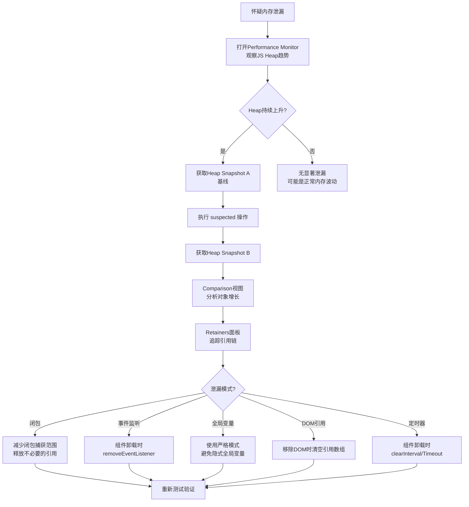
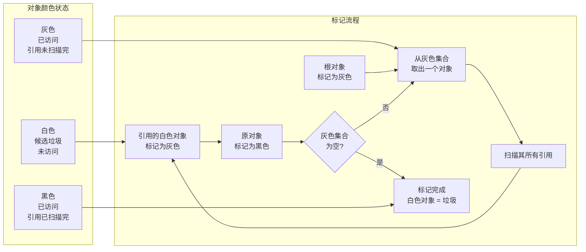

# 内存管理：从分配到回收

内存管理是性能工程中最容易被忽视、却又最致命的领域。与渲染性能或网络优化不同，内存问题通常不会立即显现——应用不会在分配第一个泄漏对象时就崩溃，而是随着运行时间的推移逐步恶化，最终导致页面卡顿、浏览器标签页崩溃，甚至整个浏览器的无响应。本章从内存分配理论出发，系统探讨垃圾回收算法、V8引擎的内存模型、内存泄漏的形式化定义，以及JavaScript生态中的具体诊断与优化技术。

## 引言

JavaScript是一门具有自动内存管理的语言。开发者无需手动分配和释放内存——这一职责由JavaScript引擎的垃圾回收器（Garbage Collector, GC）承担。然而，「自动」不等于「完美」。垃圾回收器只能回收**不可达（Unreachable）**的对象，如果开发者无意中保留了对象的引用，这些对象将永远驻留在内存中，形成**内存泄漏（Memory Leak）**。

在单页应用（SPA）时代，内存泄漏的问题被显著放大。传统的多页面网站在页面跳转时会完整释放整个页面的内存环境；而SPA在生命周期内持续运行，即使路由切换，旧的组件状态、事件监听器和DOM引用仍可能残留在内存中。Google的研究表明，内存泄漏是Web应用长时间运行后性能下降的首要原因，尤其是在内存受限的移动设备上。

理解内存管理的理论——从栈分配与堆分配的区别，到Mark-and-Sweep、Generational GC、Tri-color Marking算法——是诊断和修复内存问题的基础。而Chrome DevTools的Memory面板、Performance Monitor、Heap Snapshot等工具，则是将这些理论转化为工程实践的桥梁。

## 理论严格表述

### 2.1 内存分配的理论

程序运行时的内存分配发生在两个主要区域：**栈（Stack）**和**堆（Heap）**。

#### 2.1.1 栈分配（Stack Allocation）

栈是一种后进先出（LIFO）的数据结构，用于存储函数调用的上下文信息。每当函数被调用时，一个**栈帧（Stack Frame）**被压入栈顶，包含：

- 函数的参数
- 局部变量
- 返回地址（调用者代码的位置）

**栈分配的特性**：

- **自动管理**：栈帧在函数返回时自动弹出，无需垃圾回收器介入
- **固定大小**：栈上的变量必须在编译时确定大小（或运行时确定但不可变）
- **高速访问**：栈内存分配仅需移动栈指针，时间复杂度为 `O(1)`
- **容量受限**：栈空间通常较小（如V8中默认为~1MB），超出会导致栈溢出（Stack Overflow）

在JavaScript中，**基本类型**（Number、String、Boolean、Null、Undefined、Symbol、BigInt）的原始值通常存储在栈上（实际实现中，V8会对小字符串等进行优化，可能存储在堆中，但从语义上可理解为栈分配）。

#### 2.1.2 堆分配（Heap Allocation）

堆是一块巨大的内存区域，用于存储生命周期不确定、大小动态变化的数据。在JavaScript中，**所有对象**（包括对象字面量、数组、函数、闭包、Date、RegExp等）都存储在堆中。

**堆分配的特性**：

- **动态管理**：堆内存的分配和回收需要专门的内存管理机制（如垃圾回收器）
- **大小灵活**：可以分配任意大小的内存块
- **分配成本较高**：需要在堆中搜索合适的空闲块，时间复杂度通常为 `O(log n)` 或更差
- **容量大**：堆的大小受限于系统可用内存和进程内存限制

**形式化地**，堆可以建模为一个内存块的集合 `H = {b_1, b_2, ..., b_n}`，每个块 `b_i` 具有状态 `allocated` 或 `free`。内存分配请求 `alloc(size)` 的目标是找到一个大小 ≥ `size` 的空闲块，将其标记为已分配并返回指针。内存释放操作 `free(ptr)` 将对应块标记为空闲。

### 2.2 垃圾回收算法

垃圾回收（Garbage Collection, GC）是自动识别并回收堆中不再使用的内存块的技术。GC算法是编程语言实现的核心组成部分，直接影响语言的性能特征和适用场景。

#### 2.2.1 Mark-and-Sweep算法

Mark-and-Sweep（标记-清除）是最经典的垃圾回收算法，由John McCarthy于1960年为Lisp语言发明。

**算法步骤**：

1. **标记阶段（Mark）**：从一组称为「根（Roots）」的对象出发（全局对象、执行栈上的变量、寄存器等），遍历所有可达对象，将它们标记为「存活（Alive）」。
2. **清除阶段（Sweep）**：遍历整个堆，回收所有未被标记的对象。

**形式化描述**：
设堆中所有对象集合为 `O`，根集合为 `R ⊆ O`。定义可达性关系 `Reachable(o)` 为：存在从某个根 `r ∈ R` 到对象 `o` 的引用路径。则垃圾集合为：

```
Garbage = {o ∈ O | ¬Reachable(o)}
```

**Mark-and-Sweep的缺陷**：

- **停顿问题（Stop-the-World）**：标记和清除阶段需要暂停所有应用线程，导致明显的性能卡顿
- **内存碎片**：清除后产生大量不连续的小空闲块，可能导致后续大对象分配失败（尽管总空闲内存充足）
- **两次遍历开销**：需要完整遍历存活对象图和整个堆

#### 2.2.2 分代垃圾回收（Generational GC）

分代GC基于**弱分代假说（Weak Generational Hypothesis）**：大多数对象在创建后很快变得不可达（「朝生暮死」），而存活时间较长的对象很可能继续长期存活。

**代际划分**：

- **新生代（Young Generation / Nursery）**：存放新创建的对象。采用高频率、低成本的GC策略。
- **老生代（Old Generation / Tenured Space）**：存放经过多轮GC仍存活的对象。采用低频率、高成本的GC策略。

**新生代GC（Scavenge / Minor GC）**：
新生代通常分为两个半区（Semi-space）：From空间和To空间。新对象分配在From空间。当From空间满时，将存活对象复制到To空间，然后交换两个空间的角色。这种「复制-清除」算法的时间复杂度与**存活对象数量**成正比，而非堆的总大小，由于大多数新生代对象很快死亡，实际开销很小。

**晋升（Promotion）**：对象在新生代中存活足够长的时间（通常经过一定次数的Minor GC），会被晋升到老生代。

**老生代GC（Major GC / Full GC）**：
老生代通常采用Mark-Sweep-Compact（标记-清除-整理）算法。在标记和清除之后，增加一个「整理（Compact）」阶段，将存活对象移动到堆的一端，消除内存碎片。

#### 2.2.3 三色标记法（Tri-color Marking）

三色标记法是增量垃圾回收（Incremental GC）的基础，它将对象分为三种颜色：

- **白色（White）**：尚未访问的对象，候选垃圾
- **灰色（Gray）**：已访问但其引用尚未完全扫描的对象
- **黑色（Black）**：已访问且其所有引用都已扫描的对象

**算法流程**：

1. 初始时，所有对象标记为白色；根对象标记为灰色
2. 从灰色集合中取出一个对象，将其标记为黑色，将其引用的所有白色对象标记为灰色
3. 重复步骤2，直到灰色集合为空
4. 剩余的白色对象即为垃圾

**增量GC与并发GC**：
三色标记法允许GC工作被分割为多个小步骤，与应用逻辑交替执行（增量GC），甚至与应用线程同时执行（并发GC）。关键在于处理「并发修改」问题——如果应用线程在GC扫描过程中修改了对象引用图，可能导致「漏标」（存活对象被误判为垃圾）或「错标」（垃圾对象被误判为存活）。

V8的Orinoco垃圾回收器使用**读写屏障（Read/Write Barriers）**来解决这一问题：当应用线程写入对象引用时，屏障代码检查并维护三色不变量（Tri-color Invariant），确保不会将黑色对象指向白色对象而不将白色对象变灰。

### 2.3 内存泄漏的形式化定义

**定义**：内存泄漏是指程序中存在一组对象 `L ⊆ O`，满足：

1. 从根集合 `R` 出发存在到达 `L` 中对象的引用路径（即 `L` 中的对象在GC看来仍是「存活的」）
2. 但程序在后续的所有执行中都不会再访问或使用 `L` 中的对象

形式化地：

```
MemoryLeak = {o ∈ O | Reachable(o) ∧ ¬FutureAccess(o)}
```

其中 `FutureAccess(o)` 表示对象 `o` 在程序未来的执行中会被访问。

**关键洞察**：垃圾回收器只能判断 `Reachable(o)`，无法判断 `FutureAccess(o)`。因此，内存泄漏本质上是**可达性分析的不完备性**与**程序实际行为**之间的差异。

### 2.4 V8的内存模型

V8是Google开发的高性能JavaScript引擎，用于Chrome和Node.js。V8的内存模型具有以下关键特征：

#### 2.4.1 堆结构

V8的堆被划分为多个区域：

| 区域 | 用途 | GC策略 |
|------|------|--------|
| New Space | 新生代对象（~1-8MB） | Scavenge（复制算法） |
| Old Space | 老生代对象 | Mark-Sweep-Compact |
| Large Object Space | 大于一定阈值的大对象（~1MB） | 独立的GC策略 |
| Code Space | JIT编译后的机器码 | 特殊的GC策略 |
| Map Space | 隐藏类（Hidden Classes / Maps） | 特殊的GC策略 |

#### 2.4.2 Orinoco垃圾回收器

Orinoco是V8的现代垃圾回收器，采用多种先进技术减少GC停顿：

- **并行标记（Parallel Marking）**：使用多个线程并行执行标记阶段
- **增量标记（Incremental Marking）**：将标记工作分割为多个小步骤，与应用交替执行
- **并发标记（Concurrent Marking）**：在应用线程运行的同时，后台线程执行标记
- **并发整理（Concurrent Compaction）**：将整理工作部分转移到后台线程

**V8的内存限制（Node.js）**：
Node.js中V8的堆大小默认限制为：

- 64位系统：~1.4GB（旧版本）或 ~4GB（新版本）
- 32位系统：~0.7GB

可通过 `--max-old-space-size` 标志调整：

```bash
node --max-old-space-size=8192 app.js  # 将老生代限制提高到8GB
```

### 2.5 WeakRef与FinalizationRegistry的语义

ES2021引入了 `WeakRef` 和 `FinalizationRegistry`，为JavaScript提供了「弱引用」机制。

#### 2.5.1 WeakRef

`WeakRef` 允许持有对一个对象的弱引用，不会阻止该对象被垃圾回收：

```javascript
let obj = { data: 'important' };
const weakRef = new WeakRef(obj);

obj = null; // 解除强引用

// 稍后...
const deref = weakRef.deref();
if (deref) {
    console.log(deref.data); // 对象仍然存活
} else {
    console.log('对象已被回收');
}
```

**形式化语义**：设 `WeakRef(o)` 是对对象 `o` 的弱引用。在可达性分析中，`WeakRef(o)` 不贡献 `o` 的可达性。即：

```
Reachable(o) ⇔ ∃ 从根出发的强引用路径到达 o
```

#### 2.5.2 FinalizationRegistry

`FinalizationRegistry` 允许注册回调函数，当注册的对象被垃圾回收时，回调函数会被调用：

```javascript
const registry = new FinalizationRegistry((heldValue) => {
    console.log(`对象已被回收，持有值: ${heldValue}`);
});

let obj = { id: 42 };
registry.register(obj, 'user-session-123');

obj = null;
// 当obj被GC回收后，回调函数将被调用
```

**重要限制**：FinalizationRegistry的回调不保证立即执行，甚至不保证一定执行（如进程退出时）。它仅用于资源清理的「尽力而为」通知，不能替代显式的资源释放。

### 2.6 内存碎片的理论

内存碎片（Memory Fragmentation）是指堆中存在大量不连续的小空闲块，导致总空闲内存充足但无法分配大对象的情况。

**外部碎片（External Fragmentation）**：分配和释放不同大小的对象后，堆中形成交错的已分配块和空闲块。虽然总空闲内存足够，但没有单个空闲块能满足大对象的分配请求。

**内部碎片（Internal Fragmentation）**：分配器为满足对齐要求或最小分配单元，分配了比请求稍大的内存块，多余的部分被浪费。

**碎片率的形式化度量**：

```
Fragmentation = 1 - (最大连续空闲块大小 / 总空闲内存大小)
```

当 `Fragmentation → 1` 时，堆的可用性急剧下降。整理（Compaction）是解决外部碎片的有效手段，但代价是移动对象并更新所有引用。

## 工程实践映射

### 3.1 JavaScript内存泄漏的常见模式

#### 3.1.1 全局变量

未使用 `let`/`const`/`var` 声明的变量自动成为全局对象（浏览器中的 `window`）的属性，永远可达：

```javascript
// ❌ 内存泄漏：隐式全局变量
function processData() {
    leakedData = new Array(1000000).fill('x'); // 隐式创建window.leakedData
}

// ✅ 正确：使用严格模式或显式声明
'use strict';
function processData() {
    const data = new Array(1000000).fill('x'); // 函数返回后自动释放
}
```

#### 3.1.2 闭包陷阱

闭包可以捕获外部变量，如果闭包的生命周期长于预期，被捕获的变量也无法释放：

```javascript
// ❌ 内存泄漏：闭包捕获大型数组
function createProcessor() {
    const largeData = new Array(1000000).fill('data');

    return function process() {
        // 即使只使用largeData[0]，整个largeData数组被闭包捕获
        return largeData[0];
    };
}

const processor = createProcessor(); // largeData将常驻内存

// ✅ 优化：仅捕获需要的数据
function createProcessor() {
    const largeData = new Array(1000000).fill('data');
    const firstItem = largeData[0]; // 仅捕获需要的值

    return function process() {
        return firstItem;
    };
}
```

#### 3.1.3 事件监听未移除

为DOM元素添加事件监听器后，如果元素被移除但监听器未解除，元素和监听器中的闭包变量都无法释放：

```javascript
// ❌ 内存泄漏：事件监听未移除
class LeakyComponent {
    constructor() {
        this.element = document.getElementById('target');
        this.data = new Array(1000000).fill('leak');

        this.element.addEventListener('click', () => {
            console.log(this.data.length); // 闭包捕获了整个组件实例
        });
    }
}

// ✅ 正确：在组件销毁时移除监听器
class CleanComponent {
    constructor() {
        this.element = document.getElementById('target');
        this.data = new Array(1000000).fill('clean');
        this.handleClick = () => {
            console.log(this.data.length);
        };

        this.element.addEventListener('click', this.handleClick);
    }

    destroy() {
        this.element.removeEventListener('click', this.handleClick);
        this.element = null;
        this.data = null;
    }
}
```

#### 3.1.4 DOM引用

JavaScript中保留了对已移除DOM元素的引用，阻止浏览器释放这些元素：

```javascript
// ❌ 内存泄漏：保留DOM引用
const elements = [];
function createItems() {
    for (let i = 0; i < 1000; i++) {
        const div = document.createElement('div');
        document.body.appendChild(div);
        elements.push(div); // 保留引用
    }
}
function clearItems() {
    elements.forEach(el => el.remove());
    // ❌ elements数组仍保留对所有div的引用！
}

// ✅ 正确：清除引用
function clearItems() {
    elements.forEach(el => el.remove());
    elements.length = 0; // 清空数组，释放引用
}
```

#### 3.1.5 定时器未清理

`setInterval` 和 `setTimeout` 的回调如果捕获了大型对象，在定时器被清除前这些对象无法释放：

```javascript
// ❌ 内存泄漏：定时器未清理
class LeakyTimer {
    constructor() {
        this.data = new Array(1000000).fill('timer');
        this.intervalId = setInterval(() => {
            console.log(this.data.length);
        }, 1000);
    }
}

// ✅ 正确：清理定时器
class CleanTimer {
    constructor() {
        this.data = new Array(1000000).fill('timer');
        this.intervalId = setInterval(() => {
            console.log(this.data.length);
        }, 1000);
    }

    destroy() {
        clearInterval(this.intervalId);
        this.data = null;
    }
}
```

### 3.2 Chrome DevTools Memory面板

Chrome DevTools的Memory面板是诊断JavaScript内存问题的核心工具。

#### 3.2.1 Heap Snapshot分析

Heap Snapshot捕获当前堆中所有对象的完整状态。通过比较不同时间点的Snapshot，可以精确识别内存泄漏。

**分析步骤**：

1. 在操作前获取Snapshot A（基线）
2. 执行 suspected 泄漏的操作
3. 获取Snapshot B
4. 在Comparison视图中查看对象数量和大小的变化
5. 在Retainers面板中追踪对象的引用链，找到阻止回收的根引用

**关键视图**：

- **Summary**：按构造函数分组显示对象数量和占用内存
- **Comparison**：对比两个Snapshot的差异
- **Containment**：按对象在GC图中的 containment 层次展示
- **Statistics**：堆的整体统计信息

#### 3.2.2 Allocation Timeline

Allocation Timeline（旧版称为Timeline Allocation）记录内存分配的时间线，帮助识别哪些操作导致了大量内存分配：

1. 点击「Start recording heap allocations」
2. 执行应用操作
3. 停止记录
4. 查看时间线上的蓝色条（表示该时刻的分配），持续存在的蓝色条表示对象未被释放

#### 3.2.3 Allocation Sampling

Allocation Sampling以极低的开销定期采样内存分配，适合在生产环境或长时间运行的性能分析中使用。它不会捕获所有分配，但提供了统计上有代表性的分配模式。

### 3.3 Performance Monitor的内存监控

Performance Monitor提供实时的内存使用监控，无需手动触发Snapshot：

**监控指标**：

- **JS Heap Size**：JavaScript堆的当前大小
- **DOM Nodes**：DOM节点数量
- **JS Event Listeners**：JavaScript事件监听器数量
- **Documents**：文档（iframe）数量

**诊断模式**：在怀疑内存泄漏时，打开Performance Monitor，执行重复操作（如打开/关闭模态框、切换路由），观察JS Heap Size和DOM Nodes是否持续上升而不回落。

### 3.4 React的内存优化

#### 3.4.1 避免不必要的重渲染

每次组件重渲染都会创建新的函数、对象和虚拟DOM树。虽然旧的值会被垃圾回收，但频繁的分配和回收增加了GC压力：

```jsx
// ❌ 不良模式：内联对象和函数导致子组件重渲染
function Parent() {
    const [count, setCount] = useState(0);
    return (
        <div>
            <button onClick={() => setCount(c => c + 1)}>Increment</button>
            <Child config={{ theme: 'dark', size: 'large' }} /> {/* 每次渲染创建新对象 */}
        </div>
    );
}

// ✅ 优化：使用useMemo缓存配置对象
function Parent() {
    const [count, setCount] = useState(0);
    const config = useMemo(() => ({ theme: 'dark', size: 'large' }), []);
    return (
        <div>
            <button onClick={() => setCount(c => c + 1)}>Increment</button>
            <Child config={config} />
        </div>
    );
}
```

#### 3.4.2 清理副作用

React的 `useEffect` Hook必须返回清理函数，以防止组件卸载后副作用继续占用资源：

```jsx
useEffect(() => {
    const controller = new AbortController();
    fetch('/api/data', { signal: controller.signal })
        .then(res => res.json())
        .then(setData);

    const intervalId = setInterval(pollUpdates, 5000);
    const handler = () => console.log('resize');
    window.addEventListener('resize', handler);

    // ✅ 清理函数
    return () => {
        controller.abort();
        clearInterval(intervalId);
        window.removeEventListener('resize', handler);
    };
}, []);
```

#### 3.4.3 大型状态管理

全局状态管理库（Redux、Zustand、Jotai）中的状态如果包含大型对象，这些对象将被长期保留。应考虑：

- 将大型数据存储在组件局部状态而非全局状态
- 使用选择器（Selectors）仅订阅需要的子状态
- 及时清除不再需要的数据（如关闭详情页后释放详情数据）

### 3.5 Node.js的内存限制

Node.js中V8的默认内存限制可能导致大型应用崩溃。关键配置选项：

```bash
# 增加老生代空间限制
node --max-old-space-size=4096 app.js

# 增加新生代空间限制
node --max-semi-space-size=128 app.js

# 同时调整多个参数
node --max-old-space-size=8192 --max-semi-space-size=256 app.js
```

**监控Node.js内存**：

```javascript
// 定期记录内存使用
setInterval(() => {
    const usage = process.memoryUsage();
    console.log({
        rss: `${(usage.rss / 1024 / 1024).toFixed(2)} MB`,      // 常驻集大小
        heapTotal: `${(usage.heapTotal / 1024 / 1024).toFixed(2)} MB`, // 堆总大小
        heapUsed: `${(usage.heapUsed / 1024 / 1024).toFixed(2)} MB`,   // 堆已用大小
        external: `${(usage.external / 1024 / 1024).toFixed(2)} MB`     // C++对象绑定内存
    });
}, 30000);
```

### 3.6 WeakMap与WeakSet的正确使用

`WeakMap` 和 `WeakSet` 是ES6引入的集合类型，它们对键（WeakMap）或值（WeakSet）持有弱引用。

**WeakMap的核心用例：为对象附加元数据**

```javascript
// ✅ 正确：使用WeakMap为DOM元素附加数据，不阻止元素被回收
const elementData = new WeakMap();

function attachData(element, data) {
    elementData.set(element, data);
}

function getData(element) {
    return elementData.get(element);
}

// 当element从DOM移除且没有其他引用时，
// WeakMap中的条目会自动被GC回收
```

**对比Map的内存泄漏风险**：

```javascript
// ❌ 内存泄漏：使用Map持有DOM引用
const elementData = new Map();
elementData.set(domElement, largeData);
// 即使domElement从DOM移除，Map仍持有强引用，无法释放

// ✅ 安全：使用WeakMap
const elementData = new WeakMap();
elementData.set(domElement, largeData);
// domElement被GC回收时，WeakMap条目自动消失
```

**WeakMap的限制**：

- 键必须是对象（不能是原始值）
- 不可遍历（没有 `.keys()`、`.values()`、`.entries()`）
- 没有 `.size` 属性

### 3.7 Service Worker缓存的内存管理

Service Worker在独立线程中运行，其缓存（Cache API）存储在浏览器管理的持久化存储中，而非JavaScript堆。但Service Worker的内存管理仍有重要考量：

**缓存配额管理**：

```javascript
// 定期清理过期缓存
async function cleanupCaches() {
    const cacheWhitelist = ['cache-v2'];
    const cacheNames = await caches.keys();

    await Promise.all(
        cacheNames.map(cacheName => {
            if (!cacheWhitelist.includes(cacheName)) {
                return caches.delete(cacheName);
            }
        })
    );
}

// 基于LRU策略的缓存清理
async function enforceCacheLimit(maxEntries = 100) {
    const cache = await caches.open('dynamic-cache');
    const requests = await cache.keys();

    if (requests.length > maxEntries) {
        const toDelete = requests.slice(0, requests.length - maxEntries);
        await Promise.all(toDelete.map(req => cache.delete(req)));
    }
}
```

**内存与存储的区别**：

- Cache API使用磁盘存储（IndexedDB或类似机制），不占用JavaScript堆内存
- 但大量的缓存条目会增加Service Worker的索引开销
- 浏览器可能对每个源（Origin）的缓存总量设置配额限制

## Mermaid 图表

### V8内存模型与GC流程

```mermaid
flowchart TB
    subgraph V8堆结构
        NS[New Space<br/>新生代 ~1-8MB]
        OS[Old Space<br/>老生代]
        LOS[Large Object Space<br/>> 1MB]
        CS[Code Space<br/>JIT机器码]
    end

    subgraph 新生代GC<br/>Scavenge
        From[From Space]
        To[To Space]
        From -->|复制存活对象| To
        To -->|角色交换| From
    end

    subgraph 老生代GC<br/>Mark-Sweep-Compact
        Mark[标记阶段<br/>从根遍历可达对象]
        Sweep[清除阶段<br/>回收不可达对象]
        Compact[整理阶段<br/>消除内存碎片]
    end

    NS -->|对象存活足够轮次| OS
    NS -->|大对象直接分配| LOS
    OS --> Mark
    Mark --> Sweep
    Sweep --> Compact
```

### 内存泄漏诊断流程



### 三色标记法增量GC



## 理论要点总结

1. **栈分配与堆分配**的根本区别在于生命周期管理和性能特征。栈分配是 `O(1)` 的自动管理，适合固定大小的局部数据；堆分配是动态管理的，适合生命周期不确定的对象，但需要垃圾回收器介入。

2. **Mark-and-Sweep算法**是垃圾回收的理论基础，但其Stop-the-World特性导致明显的性能停顿。分代GC通过弱分代假说（大多数对象朝生暮死）将堆划分为新生代和老生代，采用不同的GC策略，显著降低了平均停顿时间。

3. **三色标记法**是增量和并发GC的理论基础。通过将对象标记为白/灰/黑三种颜色，GC工作可以被分割为多个小步骤，与应用线程交替或并发执行。读写屏障确保并发修改不会破坏标记的正确性。

4. **内存泄漏的形式化定义**揭示了问题的本质：对象在GC看来仍是「可达的」，但在程序的未来执行中永远不会被访问。GC无法区分「可达但不会再用」和「可达且将要用」的对象，这是内存泄漏无法被自动消除的根本原因。

5. **V8的Orinoco垃圾回收器**采用并行、增量和并发标记技术，将Major GC的停顿时间从数百毫秒降低到几十毫秒。理解V8的内存限制（特别是Node.js中的 `--max-old-space-size`）对于防止大型应用崩溃至关重要。

6. **WeakMap/WeakSet和WeakRef/FinalizationRegistry**提供了弱引用机制，允许开发者创建不阻止垃圾回收的引用关系。这是管理对象元数据、实现缓存和跟踪对象生命周期的关键工具。

7. **内存泄漏的五大常见模式**——全局变量、闭包陷阱、事件监听未移除、DOM引用、定时器未清理——涵盖了绝大多数JavaScript内存泄漏场景。系统化的诊断流程（Performance Monitor → Heap Snapshot → Comparison → Retainers）是定位泄漏根因的标准方法。

## 参考资源

1. **V8 Blog**. "Trash Talk: The Orinoco Garbage Collector." <https://v8.dev/blog/trash-talk>. V8团队官方博客文章，深入介绍了Orinoco GC的并行、增量和并发标记技术，以及V8的内存模型架构。

2. **MDN Web Docs**. "Memory Management." <https://developer.mozilla.org/en-US/docs/Web/JavaScript/Memory_management>. MDN关于JavaScript内存管理的权威文档，涵盖内存生命周期、垃圾回收理论和常见的内存泄漏模式。

3. **Chrome DevTools Documentation**. "Fix Memory Problems." <https://developer.chrome.com/docs/devtools/memory-problems/>. Chrome官方文档，详细介绍了如何使用Memory面板、Heap Snapshot、Allocation Timeline和Performance Monitor诊断内存问题。

4. **Mathias Bynens and Benedikt Meurer**. "JavaScript Engine Fundamentals: Optimizing Prototypes." V8 Blog, 2018. <https://v8.dev/blog/fast-properties>. 深入讲解了V8的隐藏类（Hidden Classes）和属性访问优化机制，是理解V8内存模型的关键文献。

5. **ECMAScript Specification**. "WeakRef and FinalizationRegistry Objects." ECMA-262, 2021. ECMAScript规范中关于WeakRef和FinalizationRegistry的形式化语义定义，是理解弱引用机制的理论基础。
