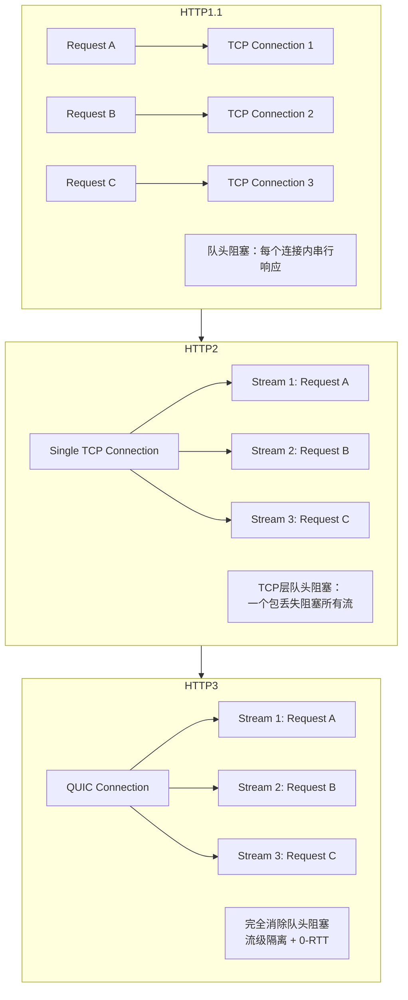
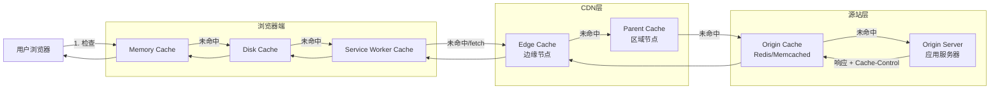
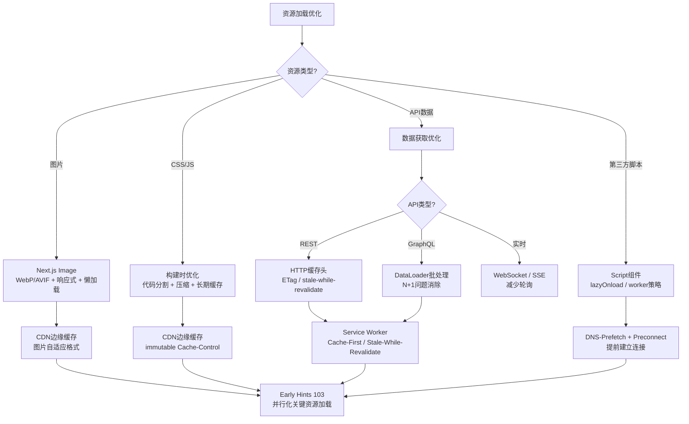
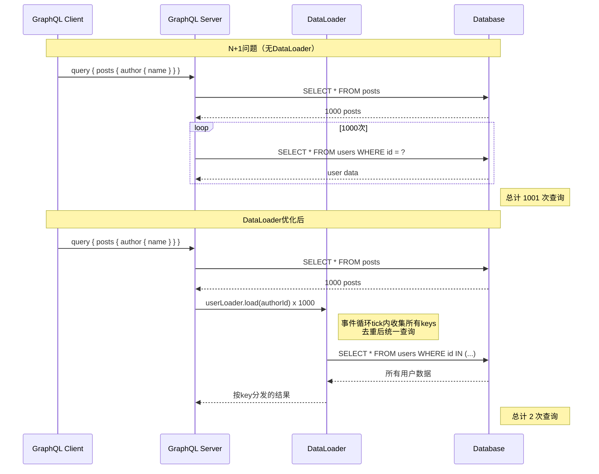

# 网络优化：从请求到响应

网络是Web应用与外部世界交互的唯一通道。无论前端渲染多么高效、JavaScript执行多么迅捷，如果资源无法及时通过网络传输到用户设备，一切优化都将失去意义。网络优化的核心矛盾在于：光速是有限的、网络路径是 congested 的、用户的耐心是稀缺的。本章从HTTP协议演进的形式化理论出发，系统探讨TCP/TLS握手模型、缓存层次理论、预加载策略，并深入映射到Next.js Image组件、Service Worker缓存策略、CDN边缘缓存、GraphQL批处理和gRPC-Web等现代工程实践。

## 引言

Web性能的黄金法则之一来自Steve Souders的论断：80-90%的终端用户响应时间花费在前端。这里的前端很大程度上指的是网络传输——下载HTML、CSS、JavaScript、图片、字体和API响应。即使在光纤和5G时代，网络延迟（Latency）仍然是性能瓶颈的主要来源，因为延迟受物理定律约束：光在光纤中从北京到上海需要约5毫秒，而这只是单程时间；加上路由器处理、排队、TLS握手和TCP慢启动，实际延迟往往达到数十甚至数百毫秒。

网络优化的目标可以形式化为：在用户的认知时间预算内（通常为1-3秒的首屏时间），最大化关键内容的传输效率。这需要同时在多个层面作战：协议层面（HTTP/2、HTTP/3、QUIC）、传输层面（TCP优化、TLS 1.3）、缓存层面（浏览器缓存、CDN缓存、边缘缓存）、应用层面（资源预加载、图片优化、API批处理）。每一层面都有其理论基础和工程工具，理解它们之间的相互作用是制定有效网络优化策略的前提。

## 理论严格表述

### 2.1 HTTP/1.1 vs HTTP/2 vs HTTP/3的理论对比

HTTP协议的演进史是一部持续对抗网络延迟和连接开销的历史。

#### 2.1.1 HTTP/1.1的局限性

HTTP/1.1（RFC 2616, 1999）引入了持久连接（Persistent Connection，即 `Connection: keep-alive`）和管道化（Pipelining），但其核心架构仍基于请求-响应的串行语义。

**队头阻塞（Head-of-Line Blocking, HOL）**：在单个TCP连接上，HTTP/1.1的响应必须按请求顺序返回。如果一个请求的处理耗时较长（如大型动态页面），后续请求即使已准备就绪，也必须等待。虽然浏览器通过开启多个并行TCP连接（通常每个域名6-8个）来缓解这一问题，但这带来了连接建立开销和TCP公平性问题。

**头部冗余**：每个HTTP请求都携带完整的头部信息（User-Agent、Accept、Cookie等），在频繁请求时造成大量重复数据传输。

#### 2.1.2 HTTP/2的多路复用与二进制分帧

HTTP/2（RFC 7540, 2015）引入了根本性的架构变革：

**二进制分帧层（Binary Framing Layer）**：HTTP/2将通信分解为更小的消息和帧，每个帧带有标识符（Stream ID），允许在同一个TCP连接上交错发送多个请求/响应（多路复用，Multiplexing）。

形式化地，HTTP/2将TCP连接抽象为多个独立的流（Streams）：

```
Connection = {Stream_1, Stream_2, ..., Stream_n}
每个 Stream_i = {Request_i, Response_i}
帧 = (Stream_ID, Payload_Type, Payload_Data)
```

多路复用消除了HTTP层面的队头阻塞，但TCP层面的队头阻塞仍然存在：如果单个TCP数据包丢失，整个TCP连接上的所有流都必须等待重传（TCP的可靠传输语义要求按序交付）。

**头部压缩（HPACK）**：HTTP/2使用HPACK算法压缩头部。HPACK结合了静态表（预定义的常见头部字段）、动态表（连接级别的头部历史缓存）和哈夫曼编码，将典型头部压缩到几个字节。

**服务器推送（Server Push）**：HTTP/2允许服务器在客户端请求之前主动推送资源。然而，服务器推送存在严重的缓存语义问题——服务器无法知道客户端是否已缓存某资源，可能导致不必要的传输。HTTP/2 Server Push已在大多数浏览器中被弃用，被Early Hints（103状态码）取代。

#### 2.1.3 HTTP/3与QUIC协议

HTTP/3（RFC 9114, 2022）是HTTP协议的最新版本，其底层不再使用TCP，而是基于Google开发的QUIC协议（RFC 9000）。

**QUIC的核心特性**：

- **基于UDP**：QUIC构建在UDP之上，在用户空间实现可靠性、拥塞控制和流量控制，绕过操作系统内核TCP栈的限制
- **内置TLS 1.3**：QUIC将TLS握手与连接建立合并，消除了独立的TLS握手往返
- **流级多路复用**：QUIC在传输层实现了真正的流隔离。单个流的丢包不会影响其他流，彻底消除了TCP层面的队头阻塞
- **连接迁移**：QUIC使用连接ID而非四元组（源IP、源端口、目的IP、目的端口）标识连接，允许客户端在切换网络（如从WiFi到4G）时保持连接不断

**HTTP/2 vs HTTP/3的对比**：

| 特性 | HTTP/2 | HTTP/3 |
|------|--------|--------|
| 传输协议 | TCP | QUIC (UDP) |
| 连接建立RTT | 2-3 RTT (TCP + TLS) | 0-1 RTT (QUIC内置TLS) |
| 队头阻塞 | HTTP层消除，TCP层存在 | 完全消除 |
| 连接迁移 | 不支持 | 原生支持 |
| 拥塞控制 | 内核TCP实现 | 用户空间实现，可快速迭代 |
| 头部压缩 | HPACK | QPACK（改进的头部压缩） |

### 2.2 TCP/TLS握手时延（RTT模型）

往返时间（Round-Trip Time, RTT）是网络优化的核心度量。每个RTT代表信号从客户端到服务器再返回的最短时间，受物理距离、网络路径和中间设备处理时间约束。

#### 2.2.1 TCP三次握手

TCP连接的建立需要三次握手：

```
Client → Server: SYN                    (Seq = x)
Server → Client: SYN-ACK                (Seq = y, Ack = x + 1)
Client → Server: ACK + 可能的数据        (Ack = y + 1)
```

TCP三次握手消耗 **1.5 RTT**（客户端发送SYN，服务器响应SYN-ACK，客户端发送ACK——ACK可以与第一个数据包合并发送）。

#### 2.2.2 TLS握手

TLS（Transport Layer Security）为HTTP提供加密和身份验证。TLS 1.2的握手需要额外的往返：

```
Client → Server: ClientHello
Server → Client: ServerHello + Certificate + ServerKeyExchange + ServerHelloDone
Client → Server: ClientKeyExchange + ChangeCipherSpec + Finished
Server → Client: ChangeCipherSpec + Finished
```

TLS 1.2握手消耗 **2 RTT**（在TCP握手之后），总计 **3.5 RTT** 才能发送第一个应用数据。

TLS 1.3通过合并握手消息和引入0-RTT模式（基于先前连接的会话票据）将握手优化到 **1 RTT**（首次连接）或 **0 RTT**（恢复连接）。

**QUIC的0-RTT握手**：QUIC将TLS 1.3集成到协议设计中。如果客户端之前与服务器建立过连接并缓存了服务器配置，可以直接在第一个QUIC包中发送加密数据，实现真正的0-RTT握手。

#### 2.2.3 TCP慢启动

TCP使用**慢启动（Slow Start）**算法探测可用带宽。初始拥塞窗口（Initial Congestion Window, initcwnd）通常为10个MSS（Maximum Segment Size，约14KB）。每收到一个ACK，拥塞窗口增加1个MSS，导致窗口大小每RTT翻倍。

这意味着：一个100KB的页面在典型的50ms RTT连接上，即使带宽充足，也需要约3-4个RTT才能完全传输（14KB → 28KB → 56KB → 112KB）。这就是**带宽充足但延迟受限**的场景。

### 2.3 缓存层次理论

缓存是计算机系统中最古老也最有效的性能优化手段之一。Web缓存形成一个层次结构，每一层都有其特定的作用域、命中率和失效策略。

#### 2.3.1 缓存层次模型

```
用户设备
├── 浏览器内存缓存（Memory Cache）
│   └── 生命周期：当前会话
│   └── 优先级：最高
├── 浏览器磁盘缓存（Disk Cache）
│   └── 生命周期：受Cache-Control控制
│   └── 优先级：高
├── Service Worker缓存
│   └── 生命周期：由Service Worker控制
│   └── 优先级：可拦截网络请求
├── CDN边缘缓存（Edge Cache）
│   └── 生命周期：受CDN配置和源站头部控制
│   └── 位置：地理上靠近用户的边缘节点
├── CDN父层缓存（Parent Cache）
│   └── 生命周期：受CDN配置控制
│   └── 位置：区域级汇聚节点
└── 源站缓存（Origin Cache）
    └── 生命周期：受应用层控制
    └── 位置：源服务器
```

#### 2.3.2 缓存命中率与失效策略

缓存系统的核心指标是**命中率（Hit Rate）**：

```
HitRate = CacheHits / (CacheHits + CacheMisses)
```

理想情况下，HitRate应接近100%。实际系统中，HitRate受以下因素影响：

- **时间局部性（Temporal Locality）**：最近访问的资源很可能再次被访问
- **空间局部性（Spatial Locality）**：访问某资源后，其附近的资源很可能被访问
- **失效策略（Invalidation Policy）**：何时使缓存条目失效

**常见失效策略**：

- **TTL（Time To Live）**：缓存条目在固定时间后过期
- **LRU（Least Recently Used）**：当缓存满时，淘汰最久未使用的条目
- **LFU（Least Frequently Used）**：淘汰访问频率最低的条目
- **主动失效**：源站通过Webhook或API通知CDN清除特定缓存

### 2.4 预加载策略的形式化语义

预加载（Preloading）是一种主动的网络优化策略，通过在当前页面加载时提前获取未来需要的资源，减少后续导航或交互的延迟。

#### 2.4.1 预加载策略的形式化定义

设当前页面加载时间为 `t_0`，用户预期访问资源 `R` 的时间为 `t_R`。预加载策略的目标是在 `t_0` 时刻或之前发起对 `R` 的请求，使得当用户在 `t_R` 时刻需要 `R` 时，`R` 已经存在于缓存中。

**形式化地**，预加载的收益为：

```
Benefit = Latency_without_preload(t_R) - Latency_with_preload(t_R)
```

预加载的成本为：

```
Cost = Bandwidth_consumed(R) × P(R not used)
```

其中 `P(R not used)` 是资源 `R` 最终未被使用的概率。最优预加载策略最大化 `Benefit - Cost`。

#### 2.4.2 四种预加载指令

| 指令 | 语义 | 使用场景 |
|------|------|----------|
| `preload` | 当前导航必需，立即高优先级获取 | 首屏关键CSS/JS/字体 |
| `prefetch` | 未来导航可能需要，低优先级空闲时获取 | 下一页可能用到的资源 |
| `preconnect` | 提前建立TCP/TLS连接，不传输数据 | 已知将要请求的外部域名 |
| `dns-prefetch` | 提前解析DNS，不建立连接 | 可能访问的外部域名 |

#### 2.4.3 Critical Resource Path

关键资源路径（Critical Resource Path）是指渲染首屏内容所必须加载的最小资源集合。优化关键资源路径是网络优化的核心目标。

形式化地，设首屏渲染依赖的资源集合为 `C = {r_1, r_2, ..., r_n}`，每个资源 `r_i` 具有：

- 大小 `size(r_i)`
- 加载优先级 `priority(r_i)`
- 依赖关系 `depends(r_i) ⊆ C`

关键资源路径的加载时间为：

```
T_critical = max_path(LoadGraph(C))
```

其中 `LoadGraph` 是考虑浏览器并发限制、资源优先级和依赖关系的加载时序图。优化的目标是**最小化T_critical**，通过：

1. 减少 `|C|`（关键资源的数量）
2. 减少 `Σsize(r_i)`（关键资源的总大小）
3. 消除或缩短关键路径上的依赖链
4. 提高关键资源的加载优先级

### 2.5 HTTP/2 Server Push的替代方案：Early Hints 103

HTTP/2 Server Push因缓存语义问题被弃用后，IETF标准化了**Early Hints（103状态码）**作为替代方案。

**Early Hints的工作流程**：

1. 客户端请求HTML页面
2. 服务器在准备好完整响应之前，先发送 `103 Early Hints` 状态码，附带 `Link` 头部，指示客户端可以开始预加载的关键资源
3. 客户端收到103响应后，立即并行发起对这些资源的请求
4. 服务器完成HTML生成后，发送最终的 `200 OK` 响应

```
Client → Server: GET /page
Server → Client: 103 Early Hints
                    Link: </style.css>; rel=preload; as=style
                    Link: </app.js>; rel=preload; as=script
[客户端并行请求style.css和app.js]
Server → Client: 200 OK
                    [完整HTML响应]
```

Early Hints的优势在于：它只是「提示」而非「推送」，客户端仍然根据自己的缓存状态决定是否请求资源，避免了Server Push的缓存语义问题。

## 工程实践映射

### 3.1 Next.js的Image组件优化

图像是Web页面中体积最大的资源类型，通常占页面总传输量的60%以上。Next.js的 `<Image>` 组件是现代Web图像优化的标杆实现。

#### 3.1.1 自动格式优化

Next.js Image自动根据浏览器的 `Accept` 请求头提供最优的图像格式：

```jsx
import Image from 'next/image';

export default function Hero() {
    return (
        <Image
            src="/hero.jpg"
            alt="Hero image"
            width={1200}
            height={600}
            priority  // 首屏关键图像，立即加载
        />
    );
}
```

支持的现代格式：

- **WebP**：比JPEG/PNG小25-35%，广泛支持
- **AVIF**：比JPEG小50%，目前支持率约85%（Chrome、Firefox、Safari 16+）

Next.js在构建时生成多种格式的优化版本，在请求时根据浏览器能力自动选择。

#### 3.1.2 响应式图片

Next.js自动生成多个尺寸的图片版本，并通过 `srcset` 和 `sizes` 属性让浏览器根据设备像素密度和视口大小选择最合适的版本：

```jsx
<Image
    src="/photo.jpg"
    alt="Photo"
    fill  // 填充父容器
    sizes="(max-width: 768px) 100vw, (max-width: 1200px) 50vw, 33vw"
/>
```

这避免了在移动设备上加载桌面尺寸的超大图片，显著减少移动用户的流量消耗。

#### 3.1.3 懒加载与占位符

Next.js Image默认对非首屏图片启用懒加载（`loading="lazy"`），并通过多种占位符策略减少布局偏移（CLS）：

```jsx
<Image
    src="/gallery/photo.jpg"
    alt="Gallery photo"
    width={400}
    height={300}
    placeholder="blur"  // 使用模糊占位符
    blurDataURL="data:image/jpeg;base64,/9j/4AAQ..."  // 低质量预览
/>
```

**占位符策略对比**：

| 策略 | 优点 | 缺点 |
|------|------|------|
| `empty` | 无额外请求 | 可能导致布局偏移 |
| `blur` | 视觉过渡平滑 | 需要生成blurDataURL |
| `data:image` | 无额外请求 | 增加HTML体积 |

### 3.2 Service Worker缓存策略

Service Worker是浏览器在后台运行的脚本，可以拦截网络请求并决定如何响应。它是实现离线访问、智能缓存和后台同步的关键技术。

#### 3.2.1 常用缓存策略

**Cache-First（缓存优先）**：

```javascript
// 适用于不常变化的静态资源（CSS、JS、字体）
self.addEventListener('fetch', (event) => {
    event.respondWith(
        caches.match(event.request).then((response) => {
            return response || fetch(event.request).then((fetchResponse) => {
                return caches.open('static-v1').then((cache) => {
                    cache.put(event.request, fetchResponse.clone());
                    return fetchResponse;
                });
            });
        })
    );
});
```

**Network-First（网络优先）**：

```javascript
// 适用于需要实时数据但允许降级到缓存的API请求
self.addEventListener('fetch', (event) => {
    event.respondWith(
        fetch(event.request).catch(() => {
            return caches.match(event.request);
        })
    );
});
```

**Stale-While-Revalidate（过期后重新验证）**：

```javascript
// 适用于可以接受短暂过时的数据，但需要后台更新的场景
self.addEventListener('fetch', (event) => {
    event.respondWith(
        caches.match(event.request).then((cachedResponse) => {
            const fetchPromise = fetch(event.request).then((networkResponse) => {
                caches.open('dynamic-v1').then((cache) => {
                    cache.put(event.request, networkResponse.clone());
                });
                return networkResponse;
            });

            return cachedResponse || fetchPromise;
        })
    );
});
```

**策略选择矩阵**：

| 策略 | 首屏速度 | 实时性 | 离线可用 | 适用场景 |
|------|---------|--------|----------|----------|
| Cache-First | 快 | 差 | 是 | 静态资源 |
| Network-First | 慢 | 好 | 是（降级） | 动态API |
| Stale-While-Revalidate | 快 | 中等 | 是 | 新闻/列表数据 |
| Network-Only | 慢 | 最好 | 否 | 敏感实时数据 |
| Cache-Only | 最快 | 差 | 是 | 纯离线应用 |

#### 3.2.2 Workbox集成

Workbox是Google开发的Service Worker库，大幅简化了缓存策略的实现：

```javascript
import { precacheAndRoute } from 'workbox-precaching';
import { registerRoute } from 'workbox-routing';
import { StaleWhileRevalidate, CacheFirst } from 'workbox-strategies';
import { ExpirationPlugin } from 'workbox-expiration';

// 预缓存构建产物
precacheAndRoute(self.__WB_MANIFEST);

// 运行时缓存API响应
registerRoute(
    ({ url }) => url.pathname.startsWith('/api/'),
    new StaleWhileRevalidate({
        cacheName: 'api-cache',
        plugins: [
            new ExpirationPlugin({
                maxEntries: 50,
                maxAgeSeconds: 5 * 60  // 5分钟
            })
        ]
    })
);

// 缓存图片
registerRoute(
    ({ request }) => request.destination === 'image',
    new CacheFirst({
        cacheName: 'image-cache',
        plugins: [
            new ExpirationPlugin({
                maxEntries: 100,
                maxAgeSeconds: 30 * 24 * 60 * 60  // 30天
            })
        ]
    })
);
```

### 3.3 HTTP缓存头配置

HTTP缓存头是控制浏览器和CDN缓存行为的核心机制。

#### 3.3.1 Cache-Control

`Cache-Control` 是HTTP/1.1引入的最重要缓存指令，支持多个指令组合：

```http
Cache-Control: public, max-age=31536000, immutable
```

**关键指令**：

| 指令 | 含义 |
|------|------|
| `public` | 响应可被任何缓存存储（浏览器、CDN） |
| `private` | 响应仅可被浏览器缓存，不可被CDN缓存 |
| `no-cache` | 必须先向源站验证（revalidate）才能使用缓存 |
| `no-store` | 完全禁止缓存 |
| `max-age=N` | 资源在N秒内被视为新鲜，无需验证 |
| `s-maxage=N` | 仅对共享缓存（CDN）生效的max-age |
| `immutable` | 资源在max-age内绝对不会变化，无需条件请求 |
| `stale-while-revalidate=N` | 资源过期后N秒内仍可使用，同时后台重新验证 |

#### 3.3.2 ETag与Last-Modified

当缓存过期后，浏览器可以通过条件请求验证资源是否变化：

**ETag（实体标签）**：基于资源内容生成的哈希值（通常是内容哈希或修改时间哈希）。

```http
Client → Server: GET /style.css
                  If-None-Match: "33a64df5"
Server → Client: 304 Not Modified
                  [无响应体，节省带宽]
```

**Last-Modified**：资源最后修改时间。

```http
Client → Server: GET /style.css
                  If-Modified-Since: Wed, 21 Oct 2026 07:28:00 GMT
Server → Client: 304 Not Modified
```

ETag比Last-Modified更精确（可以检测到毫秒级内的内容变化），但生成ETag需要计算资源。对于静态构建产物（文件名包含内容哈希），可以直接使用 `Cache-Control: immutable, max-age=31536000`，完全避免条件请求。

#### 3.3.3 缓存策略分层配置

```nginx
# Nginx缓存配置示例
location ~* \.(js|css|png|jpg|jpeg|gif|ico|svg|woff|woff2)$ {
    # 静态资源：长期缓存（因为文件名包含内容哈希）
    add_header Cache-Control "public, max-age=31536000, immutable";
}

location ~* \.(html)$ {
    # HTML：永不缓存（总是获取最新版本）
    add_header Cache-Control "no-cache, no-store, must-revalidate";
}

location /api/ {
    # API响应：短时间缓存，支持stale-while-revalidate
    add_header Cache-Control "public, max-age=60, stale-while-revalidate=300";
}
```

### 3.4 CDN配置与边缘缓存

内容分发网络（CDN）通过将内容缓存到地理上靠近用户的边缘节点，显著降低传输延迟。

#### 3.4.1 CDN工作原理

```
用户（北京） → CDN边缘节点（北京） → CDN父层（华北） → 源站
                 ↓ 缓存命中           ↓ 缓存命中          ↓ 回源
              直接响应              回源到父层           生成响应
```

**缓存命中（Cache Hit）**：边缘节点已缓存请求的资源，直接响应用户。
**缓存未命中（Cache Miss）**：边缘节点未缓存，需要向上层缓存或源站请求。

#### 3.4.2 主流CDN服务对比

| 特性 | Cloudflare | Vercel Edge | AWS CloudFront |
|------|-----------|-------------|----------------|
| 边缘节点数 | 300+ | 100+ | 400+ |
| HTTP/3支持 | 是 | 是 | 是 |
| 边缘计算 | Workers | Edge Functions | Lambda@Edge |
| 缓存控制 | 页面规则 | 自动优化 | 行为策略 |
| 免费额度 | 慷慨 | 有限 | AWS Free Tier |

#### 3.4.3 Cloudflare缓存配置

```
# Cloudflare Page Rules示例
# 规则1：静态资源长期缓存
URL: *.example.com/static/*
Cache Level: Cache Everything
Edge Cache TTL: 1 month
Browser Cache TTL: 1 month

# 规则2：API响应短期缓存
URL: *.example.com/api/*
Cache Level: Cache Everything
Edge Cache TTL: 5 minutes
Browser Cache TTL: 5 minutes
Bypass Cache on Cookie: session_id
```

#### 3.4.4 Vercel Edge缓存

Vercel提供基于边缘的缓存控制，通过响应头部控制：

```javascript
// Next.js API路由中的缓存控制
export async function GET() {
    const data = await fetchData();

    return new Response(JSON.stringify(data), {
        headers: {
            'Content-Type': 'application/json',
            'Cache-Control': 'public, s-maxage=60, stale-while-revalidate=300',
            'Vercel-CDN-Cache-Control': 'max-age=3600'
        }
    });
}
```

`s-maxage` 控制CDN缓存时间，`stale-while-revalidate` 允许在重新验证期间提供过期内容。

### 3.5 GraphQL的N+1问题与DataLoader批处理

GraphQL的灵活性带来了独特的性能挑战，其中最著名的是**N+1问题**。

#### 3.5.1 N+1问题的形式化定义

设GraphQL查询请求一组对象 `O = {o_1, o_2, ..., o_n}`，每个对象关联一个子对象集合。如果解析器（Resolver）为每个对象独立发起数据库查询，则总查询次数为：

```
总查询 = 1（获取对象列表）+ n（为每个对象获取关联数据）
```

当 `n = 1000` 时，这将产生1001次数据库查询，而非理论上最优的2次查询（1次获取对象，1次批量获取所有关联数据）。

#### 3.5.2 DataLoader解决方案

DataLoader是Facebook开发的批处理和去重库，它通过以下机制解决N+1问题：

1. **批处理（Batching）**：在事件循环的单个tick内，收集所有待加载的key，一次性发起批量查询
2. **去重（Deduplication）**：同一个tick内的重复key只查询一次
3. **缓存（Caching）**：同一请求中的相同key返回相同结果

```javascript
import DataLoader from 'dataloader';

// 创建DataLoader实例
const userLoader = new DataLoader(async (userIds) => {
    // 一次性查询所有用户
    const users = await db.users.findMany({
        where: { id: { in: userIds } }
    });

    // 按请求顺序返回结果
    const userMap = new Map(users.map(u => [u.id, u]));
    return userIds.map(id => userMap.get(id) || new Error(`User ${id} not found`));
});

// 在GraphQL解析器中使用
const resolvers = {
    Post: {
        author: (post) => userLoader.load(post.authorId)
    },
    Comment: {
        author: (comment) => userLoader.load(comment.authorId)
    }
};
```

在上述场景中，即使1000个Post和2000个Comment都请求作者信息，只要它们在同一个事件循环tick内，DataLoader会将所有 `userLoader.load()` 调用合并为单次数据库查询。

#### 3.5.3 GraphQL查询复杂度分析

生产环境GraphQL服务应实施查询复杂度限制，防止昂贵的查询拖垮服务器：

```javascript
import { createComplexityLimitRule } from 'graphql-validation-complexity';

const MAX_COMPLEXITY = 1000;

const schema = makeExecutableSchema({
    typeDefs,
    resolvers,
    validationRules: [createComplexityLimitRule(MAX_COMPLEXITY)]
});
```

复杂度计算通常基于：

- 查询深度（Depth）
- 返回对象的预期数量（List类型的长度限制）
- 字段的自定义复杂度权重

### 3.6 gRPC-Web的二进制传输优势

gRPC-Web允许浏览器应用通过HTTP/2与gRPC服务通信，相比传统的REST/JSON API具有显著的性能优势。

#### 3.6.1 Protocol Buffers vs JSON

gRPC使用Protocol Buffers（protobuf）作为序列化格式，相比JSON：

| 特性 | Protocol Buffers | JSON |
|------|-----------------|------|
| 序列化后大小 | 小（二进制，无字段名） | 大（文本，含字段名） |
| 解析速度 | 快（无需文本解析） | 慢（需要文本解析） |
| 类型安全 | 强（schema定义） | 弱（运行时推断） |
| 可读性 | 差（二进制） | 好（纯文本） |
| 浏览器原生支持 | 需要库 | 原生支持 |

**典型的尺寸对比**：相同的API响应，protobuf序列化后通常比JSON小50-70%，解析速度快5-10倍。

#### 3.6.2 gRPC-Web实现

```javascript
import { grpc } from '@improbable-eng/grpc-web';
import { GetUserRequest, UserService } from './proto/user_pb_service';
import { User } from './proto/user_pb';

const request = new GetUserRequest();
request.setId(123);

grpc.invoke(UserService.GetUser, {
    request,
    host: 'https://api.example.com',
    onMessage: (message) => {
        const user = message as User;
        console.log(user.getName(), user.getEmail());
    },
    onEnd: (code, msg) => {
        if (code !== grpc.Code.OK) {
            console.error('gRPC error:', msg);
        }
    }
});
```

**gRPC-Web的限制**：

- 需要代理层（如Envoy）将gRPC-Web协议转换为标准gRPC（因为浏览器不支持访问原始HTTP/2帧）
- 不支持客户端流和双向流（仅支持一元调用和服务器流）
- 调试工具生态不如REST成熟

### 3.7 HTTP/2 Server Push的替代方案：Early Hints 103

Early Hints（103状态码）是现代Web中预加载关键资源的标准方式。

#### 3.7.1 Next.js中的Early Hints

Next.js 12.2+ 支持自动发送Early Hints：

```javascript
// next.config.js
module.exports = {
    experimental: {
        earlyHints: true
    }
};
```

当启用后，Next.js会在处理页面请求时自动发送103响应，指示浏览器预加载关键CSS和JS资源。

#### 3.7.2 Nginx Early Hints配置

```nginx
server {
    location / {
        # 发送Early Hints
        add_header Link "</style.css>; rel=preload; as=style" always;
        add_header Link "</app.js>; rel=preload; as=script" always;

        proxy_pass http://backend;
    }
}
```

#### 3.7.3 手动实现Early Hints

```javascript
// Node.js HTTP服务器示例
const http = require('http');

const server = http.createServer((req, res) => {
    if (req.url === '/') {
        // 发送103 Early Hints
        res.writeEarlyHints?.({
            'link': '</style.css>; rel=preload; as=style, </app.js>; rel=preload; as=script'
        });

        // 模拟页面生成延迟
        setTimeout(() => {
            res.writeHead(200, { 'Content-Type': 'text/html' });
            res.end(`
                <!DOCTYPE html>
                <html>
                <head><link rel="stylesheet" href="/style.css"></head>
                <body><script src="/app.js"></script></body>
                </html>
            `);
        }, 100);
    }
});
```

Early Hints可以将关键资源的加载与HTML生成并行化，在HTML尚未准备就绪时就开始加载CSS和JS，有效减少关键渲染路径的总时间。

## Mermaid 图表

### HTTP协议演进与队头阻塞



### 缓存层次与请求流转



### 网络优化策略决策树



### GraphQL N+1问题与DataLoader批处理



## 理论要点总结

1. **HTTP协议的演进**始终围绕一个核心目标：减少网络延迟对用户体验的影响。HTTP/1.1的队头阻塞迫使浏览器开启多个TCP连接；HTTP/2的多路复用消除了HTTP层的队头阻塞，但TCP层的队头阻塞仍然存在；HTTP/3基于QUIC协议，通过UDP上的流级隔离彻底消除了所有层面的队头阻塞，并实现了0-RTT握手。

2. **RTT是网络优化的基本度量单位**。TCP三次握手消耗1.5 RTT，TLS 1.2握手消耗2 RTT，合计3.5 RTT才能发送首个应用数据。TLS 1.3和QUIC将这一时间压缩到0-1 RTT，是Web性能的革命性提升。

3. **TCP慢启动**意味着即使带宽充足，小资源的加载速度也受RTT限制。初始拥塞窗口约14KB，每RTT翻倍。因此，将首屏关键资源压缩到14KB以内，可以在1个RTT内完成传输，实现理论上的最快速度。

4. **缓存层次理论**揭示了从浏览器内存到CDN边缘到源站的多级缓存架构。命中率是缓存系统的核心指标，受时间局部性、空间局部性和失效策略的共同影响。合理配置 `Cache-Control`、`ETag` 和 `Last-Modified` 是最大化缓存收益的基础。

5. **预加载策略**的收益是减少后续请求的延迟，成本是消耗带宽获取可能不需要的资源。`preload` 用于当前导航的关键资源，`prefetch` 用于未来导航的可能资源，`preconnect` 和 `dns-prefetch` 用于提前建立连接基础设施。Early Hints 103是现代Web中并行化关键资源加载的标准机制。

6. **GraphQL的N+1问题**是灵活性带来的性能代价。DataLoader通过事件循环tick内的批处理和去重，将N+1次查询优化为2次查询，是GraphQL服务性能优化的必备工具。

7. **gRPC-Web**通过Protocol Buffers的二进制序列化，相比JSON实现了50-70%的体积缩减和5-10倍的解析速度提升。虽然存在浏览器兼容性和调试工具的限制，但在微服务间的浏览器通信场景中具有显著优势。

## 参考资源

1. **Grigorik, Ilya**. *High Performance Browser Networking*. O'Reilly Media, 2013. ISBN: 978-1449344764. 本书是Web网络优化的权威著作，系统讲解了TCP、TLS、HTTP/2、WebSocket和WebRTC的底层原理，是网络性能工程师的必读书籍。

2. **RFC 9114**. "HTTP/3." IETF, 2022. <https://www.rfc-editor.org/rfc/rfc9114.html>. HTTP/3的官方RFC文档，定义了HTTP over QUIC的协议语义、帧格式和错误处理机制。

3. **Cloudflare Documentation**. "CDN Cache Control." <https://developers.cloudflare.com/cache/>. Cloudflare官方缓存文档，涵盖了边缘缓存配置、缓存规则、Page Rules和Workers中的缓存控制策略。

4. **Next.js Documentation**. "Image Optimization." <https://nextjs.org/docs/app/building-your-application/optimizing/images>. Next.js官方Image组件文档，详细介绍了自动格式转换、响应式图片、占位符和优先加载的实现机制。

5. **GraphQL DataLoader**. <https://github.com/graphql/dataloader>. DataLoader的官方仓库和文档，解释了批处理和去重的内部机制，以及在不同GraphQL服务器实现中的集成方式。
