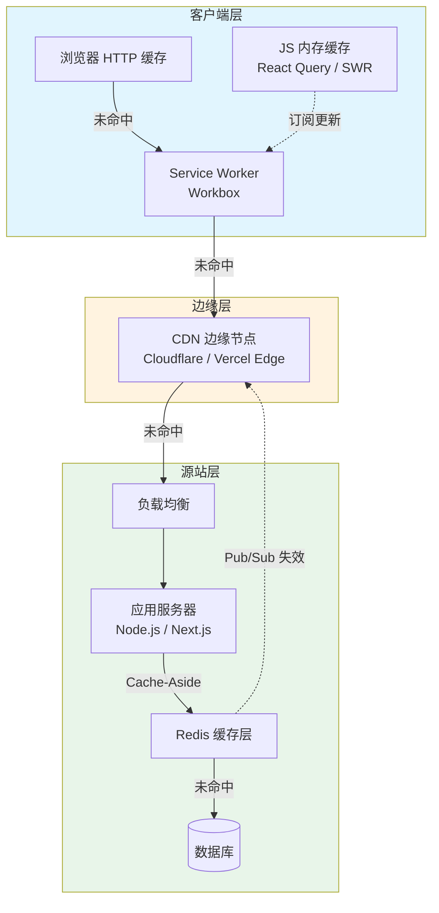
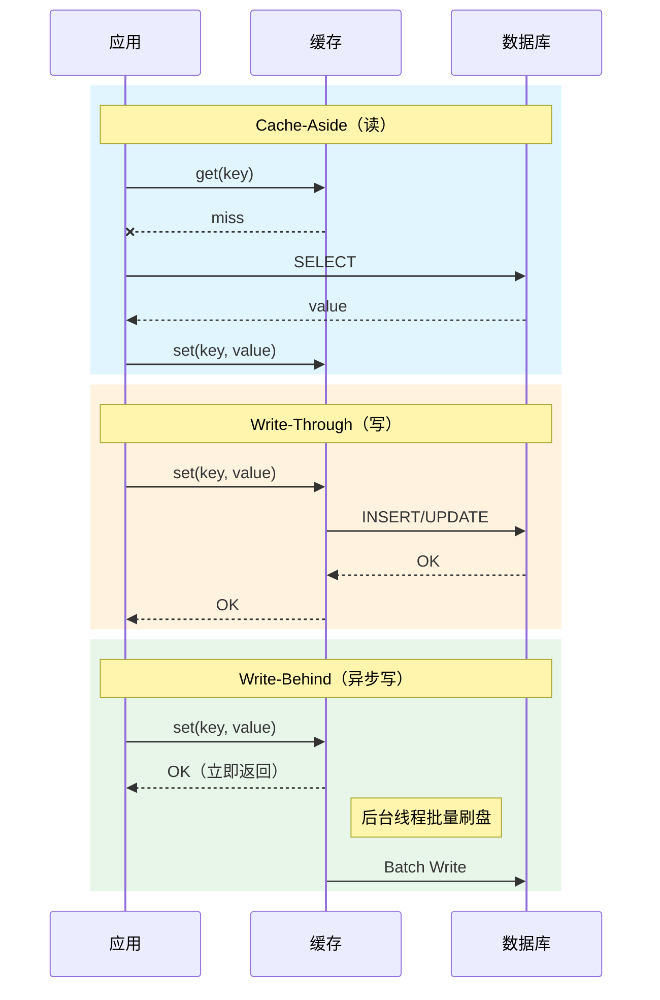
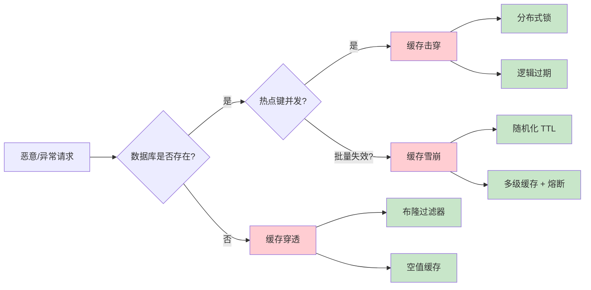

# 缓存策略：从浏览器到CDN

## 引言

缓存（Caching）是计算机科学中少数几个以显著降低资源消耗换取性能提升的通用技术之一。从 CPU 的 L1/L2/L3 缓存到分布式系统的 Redis 集群，从浏览器的 `Cache-Control` 到 CDN 的边缘节点，缓存无处不在。然而，缓存的引入并非没有代价——一致性失效、缓存穿透、缓存雪崩等问题往往成为生产环境中最棘手的故障来源。

本章采用「理论严格表述」与「工程实践映射」的双轨并行方法，系统性地阐述缓存策略的全栈图景。在理论层面，我们将建立缓存的形式化模型，分析局部性原理、一致性模型、失效策略及经典故障模式；在工程层面，我们将逐一拆解 HTTP 缓存头、Service Worker 缓存、CDN 配置、Redis 缓存层以及现代前端框架（React Query、SWR、Next.js ISR）的缓存机制，为读者提供可直接落地的代码示例与配置方案。

---

## 理论严格表述

### 一、缓存的形式化模型

#### 1.1 局部性原理的数学刻画

缓存的有效性根植于程序访问行为的**局部性原理**（Principle of Locality）。局部性可分为两类：

**时间局部性**（Temporal Locality）：若某一数据项在时刻 $t$ 被访问，则它在未来时刻 $t + \Delta t$ 再次被访问的概率 $P_{temporal}$ 显著高于随机分布：

$$
P_{temporal}(d, \Delta t) = \frac{\text{Accesses}(d, [t, t+\Delta t])}{\sum_{d'} \text{Accesses}(d', [t, t+\Delta t])}
$$

其中 $d$ 为数据项标识，$\text{Accesses}$ 为访问计数。时间局部性越强，$P_{temporal}$ 随 $\Delta t$ 衰减越慢。

**空间局部性**（Spatial Locality）：若地址 $A$ 被访问，则地址 $A + \delta$ 被访问的条件概率 $P_{spatial}$ 高于基线：

$$
P_{spatial}(\delta | A) = P(\text{Access}(A + \delta) | \text{Access}(A))
$$

Web 应用中，时间局部性体现在用户对同一页面的重复访问、API 对热点数据的反复请求；空间局部性体现在浏览器对同一域名下多个静态资源（CSS、JS、图片）的并发加载，以及 CDN 对邻近文件的预取。

#### 1.2 缓存系统的形式化定义

一个缓存系统可形式化为四元组 $C = (S, K, V, \pi)$：

- $S$：存储空间，容量有限，$|S| = N$；
- $K$：键空间，$k \in K$ 为缓存键；
- $V$：值空间，$v \in V$ 为缓存值；
- $\pi: K \times S \to \{0, 1\}$：放置策略，决定键 $k$ 是否被缓存。

对于请求序列 $R = (r_1, r_2, \ldots, r_T)$，其中 $r_t = (k_t, op_t)$，$op_t \in \{\text{read}, \text{write}\}$，缓存系统的目标是最小化平均访问延迟：

$$
\min_{\pi} \frac{1}{T} \sum_{t=1}^{T} L(r_t, C_t)
$$

其中 $L(r_t, C_t)$ 为时刻 $t$ 的访问延迟，命中时为 $L_{hit}$，未命中时为 $L_{miss} = L_{hit} + L_{fetch}$。

**命中率**（Hit Rate）与**失效率**（Miss Rate）定义为：

$$
H = \frac{\sum_{t=1}^{T} \mathbb{1}[k_t \in C_t]}{T}, \quad M = 1 - H
$$

根据局部性原理，$H$ 通常随 $N$ 增大而单调不减，但边际收益递减。

### 二、缓存一致性模型

缓存一致性（Cache Consistency）描述了缓存副本与数据源之间的同步语义。根据一致性强度，可分为：

#### 2.1 强一致性（Strong Consistency）

任何读取操作 $R(k)$ 返回的值 $v$ 必须等于最近一次成功写入操作 $W(k, v')$ 的值，即：

$$
\forall t, \forall k: \text{Read}_t(k) = v \implies v = \text{Write}_{\max\{t' < t | \text{Write}_{t'}(k)\}}(k)
$$

强一致性要求所有读写操作全局有序，通常通过分布式锁、两阶段提交（2PC）或共识协议（Raft/Paxos）实现。代价是高延迟与低吞吐量。

#### 2.2 最终一致性（Eventual Consistency）

若系统在给定时间窗口内无新的写入操作，则所有副本最终将收敛到同一值：

$$
\forall k: \lim_{t \to \infty} P(\text{Replica}_i(k, t) = \text{Replica}_j(k, t)) = 1
$$

最终一致性允许短暂的副本分歧，适用于对实时一致性要求不高的场景（如社交媒体时间线、统计报表）。

#### 2.3 缓存架构模式

在实际工程中，缓存与数据源的交互模式主要有以下四种：

**Cache-Aside（旁路缓存）**

应用层负责管理缓存。读流程：

1. 应用查询缓存 $C(k)$；
2. 若命中，返回 $v$；
3. 若未命中，从数据源读取 $v = D(k)$，写入缓存 $C \leftarrow (k, v)$，返回 $v$。

写流程：

1. 应用写入数据源 $D \leftarrow (k, v')$；
2. 使缓存失效 $\text{Invalidate}(C, k)$ 或更新缓存 $C \leftarrow (k, v')$。

Cache-Aside 是最灵活的模式，但需要应用层处理并发竞争条件。

**Read-Through（读穿透）**

缓存层代理数据读取。若缓存未命中，缓存组件自动从数据源加载数据并回填。应用无感知，但缓存层需实现数据源适配器。

**Write-Through（写穿透）**

写入操作同步更新缓存与数据源。保证强一致性，但写延迟为 $L_{write} = L_{cache} + L_{source}$。

**Write-Behind（写回/异步写）**

写入操作仅更新缓存，由后台线程异步批量写入数据源。吞吐量最高，但存在数据丢失风险（若缓存崩溃）。

| 模式 | 读延迟 | 写延迟 | 一致性 | 复杂度 |
|------|--------|--------|--------|--------|
| Cache-Aside | 低 | 中 |  configurable | 高 |
| Read-Through | 低 | — | — | 中 |
| Write-Through | 低 | 高 | 强 | 中 |
| Write-Behind | 低 | 极低 | 最终 | 低 |

### 三、缓存失效策略

当缓存空间耗尽时，需要选择淘汰（Eviction）哪些条目。常见策略包括：

#### 3.1 TTL（Time-To-Live）

每个缓存条目附带过期时间戳 $T_{expire}$。当 $t > T_{expire}$ 时，条目自动失效。TTL 适用于具有明确生命周期的数据（如验证码、会话令牌）。

#### 3.2 LRU（Least Recently Used）

淘汰最久未被访问的条目。LRU 假设时间局部性成立：近期未被访问的数据未来被访问的概率最低。实现通常采用哈希表 + 双向链表，时间复杂度 $O(1)$。

#### 3.3 LFU（Least Frequently Used）

淘汰访问频率最低的条目。LFU 适用于访问模式具有长期稳定热点的场景（如热门商品列表）。需要维护频率计数器，可能引入"历史缓存污染"问题——过去热门的条目长期占用空间。

#### 3.4 FIFO（First-In-First-Out）

按插入顺序淘汰最早的条目。实现简单，但完全不考虑访问模式，命中率通常低于 LRU 与 LFU。

**理论比较**：在请求序列服从独立同分布（i.i.d.）时，LFU 为最优策略；在请求序列具有时间相关性（如马尔可夫链）时，LRU 更接近最优。实际 Web 流量的 Zipf 分布使得 LRU 在实践中表现优异。

### 四、缓存故障模式与防御

#### 4.1 缓存穿透（Cache Penetration）

**定义**：查询一个数据库中也不存在的数据，导致每次请求都穿透缓存直达数据源。

**攻击场景**：恶意用户构造大量不存在的键（如 `user_id=-1`、`sku_id=999999999`），使数据库承受不必要的负载。

**防御策略**：

- **布隆过滤器**（Bloom Filter）：在缓存前部署概率型数据结构，以 $O(1)$ 时间判断键"可能存在"或"肯定不存在"。假阳性率可控，假阴性率为零。
- **空值缓存**：将不存在的键以特殊标记（如 `__NULL__`）缓存，设置较短 TTL。

#### 4.2 缓存击穿（Cache Breakdown）

**定义**：某一热点键突然失效，大量并发请求同时访问数据源。

**防御策略**：

- **互斥锁**（Mutex）：首个未命中线程获取锁并加载数据，其余线程等待。Redis 中可用 `SET key value NX EX 10` 实现分布式锁。
- **逻辑过期**：缓存值不过期，而是异步刷新。应用层检查逻辑时间戳，若过期则触发后台更新，旧值继续服务。

#### 4.3 缓存雪崩（Cache Avalanche）

**定义**：大量缓存键在同一时间段集中失效，或缓存服务整体宕机，导致所有请求涌入数据源。

**防御策略**：

- **随机化 TTL**：在基础 TTL 上增加随机偏移，如 `TTL = base + rand(0, 3600)`，分散失效时间点。
- **多级缓存**：本地缓存（如 LRU Map）作为 Redis 的前置盾，即使 Redis 宕机也能提供降级服务。
- **熔断与限流**：使用 Circuit Breaker 模式，当错误率超过阈值时快速失败，防止级联故障。

---

## 工程实践映射

### 一、HTTP 缓存头详解

HTTP 缓存是 Web 性能的第一道防线。理解缓存头的语义对于正确配置静态资源服务至关重要。

#### 1.1 Cache-Control

`Cache-Control` 是 HTTP/1.1 引入的通用头部，用于定义缓存策略。常见指令：

- `max-age=<seconds>`：资源在客户端缓存的最大时长（相对时间）。
- `s-maxage=<seconds>`：与 `max-age` 类似，但仅对共享缓存（如 CDN、代理服务器）生效。
- `no-cache`：强制缓存副本在提供给客户端前，必须向源服务器验证（revalidate）。
- `no-store`：完全禁止任何缓存存储该响应。
- `public`：允许任何缓存（包括共享缓存）存储响应。
- `private`：仅允许浏览器等私有缓存存储响应，禁止 CDN/代理缓存。
- `immutable`：指示资源在 `max-age` 内不会发生变化，浏览器无需在刷新时发送条件请求。

**工程配置示例**：

```nginx
# Nginx 配置：静态资源长期缓存
location ~* \.(js|css|png|jpg|jpeg|gif|ico|svg|woff|woff2)$ {
    expires 1y;
    add_header Cache-Control "public, immutable";
    add_header Vary "Accept-Encoding";
}

# HTML 文件不缓存，确保用户获取最新版本
location ~* \.html$ {
    add_header Cache-Control "no-cache, no-store, must-revalidate";
}
```

#### 1.2 ETag 与 Last-Modified

当缓存资源过期（`max-age` 耗尽）或收到 `no-cache` 指令时，浏览器发送**条件请求**（Conditional Request）进行验证：

- **ETag**（Entity Tag）：服务器生成的资源唯一标识符（通常为内容哈希）。浏览器在后续请求中发送 `If-None-Match: "abc123"`，若资源未变，服务器返回 `304 Not Modified`。
- **Last-Modified**：资源的最后修改时间戳。浏览器发送 `If-Modified-Since: Wed, 21 Oct 2026 07:28:00 GMT` 进行验证。

ETag 的优先级高于 `Last-Modified`，因为时间戳的精度可能不足，且某些资源可能"修改"了时间戳但内容未变（如 touch 操作）。

**Node.js Express 示例**：

```javascript
const express = require('express');
const crypto = require('crypto');
const fs = require('fs');
const app = express();

app.get('/api/config', (req, res) => {
  const config = { theme: 'dark', version: '2.1.0' };
  const etag = crypto.createHash('md5').update(JSON.stringify(config)).digest('hex');

  if (req.headers['if-none-match'] === etag) {
    return res.status(304).end();
  }

  res.setHeader('ETag', etag);
  res.setHeader('Cache-Control', 'private, max-age=60');
  res.json(config);
});
```

#### 1.3 Vary

`Vary` 头部指示缓存服务器：在判断是否使用缓存副本时，除了 URL 外，还需考虑哪些请求头。例如：

```http
Vary: Accept-Encoding, Accept-Language
```

这意味着对于同一 URL，缓存需要为 `gzip` 与 `br` 压缩、中文与英文分别存储独立副本。`Vary` 配置不当可能导致缓存分裂（Cache Fragmentation）或缓存未命中。

### 二、Service Worker 缓存策略

Service Worker 是运行在浏览器后台的独立线程，可拦截网络请求并实施自定义缓存逻辑。

#### 2.1 Workbox 配置

[Workbox](https://developer.chrome.com/docs/workbox) 是 Google 维护的 Service Worker 工具库，封装了常见的缓存策略。

**预缓存（Precache）**：在 Service Worker 安装阶段缓存核心资源，确保离线可用。

```javascript
// service-worker.js
import { precacheAndRoute } from 'workbox-precaching';
import { registerRoute } from 'workbox-routing';
import { StaleWhileRevalidate, CacheFirst, NetworkFirst } from 'workbox-strategies';
import { ExpirationPlugin } from 'workbox-expiration';

// 预缓存构建产物（由 workbox-build 或 workbox-webpack-plugin 注入清单）
precacheAndRoute(self.__WB_MANIFEST);

// 图片：Cache First，长期缓存
registerRoute(
  ({ request }) => request.destination === 'image',
  new CacheFirst({
    cacheName: 'images',
    plugins: [
      new ExpirationPlugin({
        maxEntries: 100,
        maxAgeSeconds: 30 * 24 * 60 * 60, // 30 天
      }),
    ],
  })
);

// API 请求：Network First，失败时回退缓存
registerRoute(
  ({ url }) => url.pathname.startsWith('/api/'),
  new NetworkFirst({
    cacheName: 'api-cache',
    plugins: [
      new ExpirationPlugin({
        maxEntries: 50,
        maxAgeSeconds: 5 * 60, // 5 分钟
      }),
    ],
  })
);

// 静态 JS/CSS：Stale While Revalidate，快速响应同时后台更新
registerRoute(
  ({ request }) =>
    request.destination === 'script' || request.destination === 'style',
  new StaleWhileRevalidate({
    cacheName: 'static-resources',
  })
);
```

**Workbox 策略对比**：

| 策略 | 行为 | 适用场景 |
|------|------|----------|
| `CacheFirst` | 先读缓存，未命中再网络 | 静态资源、图片 |
| `NetworkFirst` | 先网络，失败回缓存 | API 请求、实时数据 |
| `StaleWhileRevalidate` | 先返回缓存，后台更新 | 频繁更新但可容忍旧数据 |
| `NetworkOnly` | 仅网络 | 敏感操作、实时性要求极高 |
| `CacheOnly` | 仅缓存 | 离线场景 |

### 三、CDN 缓存配置

CDN（Content Delivery Network）通过将内容分发到全球边缘节点，显著降低用户与源服务器之间的物理距离与网络延迟。

#### 3.1 Cloudflare Page Rules

Cloudflare 允许通过 Page Rules 对特定 URL 模式配置缓存行为：

```
Pattern: *example.com/static/*
Settings:
  - Cache Level: Cache Everything
  - Edge Cache TTL: 1 month
  - Browser Cache TTL: 1 month
  - Always Online: On
```

**关键配置项**：

- `Cache Everything`：默认情况下 Cloudflare 仅缓存静态文件扩展名，启用此选项可缓存 HTML（适用于 ISR 或纯静态站点）。
- `Bypass Cache on Cookie`：当特定 Cookie 存在时跳过缓存（适用于已登录用户）。
- `Edge Cache TTL`：控制边缘节点缓存时长，独立于浏览器的 `max-age`。

#### 3.2 Vercel Edge Cache

Vercel 的 Edge Network 自动根据响应头缓存内容。开发者可通过 `vercel.json` 或代码中的头部控制：

```javascript
// Next.js API Route
export default function handler(req, res) {
  res.setHeader('Cache-Control', 'public, s-maxage=60, stale-while-revalidate=300');
  res.json({ data: 'example' });
}
```

Vercel 的 `s-maxage` 控制边缘缓存，`stale-while-revalidate` 允许在缓存过期后的 300 秒内继续提供旧响应，同时后台刷新。这一模式与 Next.js ISR 深度集成。

### 四、Redis 缓存层

Redis 是 Node.js 生态中最常用的内存数据结构存储，作为数据库与应用层之间的缓存中间件。

#### 4.1 ioredis 与 node-redis

**ioredis** 提供了集群、哨兵、管道等高级特性：

```javascript
const Redis = require('ioredis');
const redis = new Redis({
  host: 'localhost',
  port: 6379,
  retryStrategy: (times) => Math.min(times * 50, 2000),
});

// Cache-Aside 模式封装
class CacheService {
  constructor(redis, ttlSeconds = 300) {
    this.redis = redis;
    this.ttl = ttlSeconds;
  }

  async get(key, fetcher) {
    const cached = await this.redis.get(key);
    if (cached !== null) {
      return JSON.parse(cached);
    }

    // 缓存未命中：获取锁防止缓存击穿
    const lockKey = `lock:${key}`;
    const lock = await this.redis.set(lockKey, '1', 'EX', 10, 'NX');

    if (!lock) {
      // 其他线程正在加载，短暂等待后重试
      await new Promise(r => setTimeout(r, 100));
      return this.get(key, fetcher);
    }

    try {
      const data = await fetcher();
      await this.redis.setex(key, this.ttl, JSON.stringify(data));
      return data;
    } finally {
      await this.redis.del(lockKey);
    }
  }

  async invalidate(key) {
    await this.redis.del(key);
  }
}

// 使用示例
const cache = new CacheService(redis, 600);
const user = await cache.get('user:1001', () => db.users.findById(1001));
```

#### 4.2 Redis 缓存穿透防御：布隆过滤器

```javascript
const Redis = require('ioredis');
const redis = new Redis();

// 使用 Redis Bitmap 实现简易布隆过滤器
class BloomFilter {
  constructor(key, size = 100000, hashCount = 3) {
    this.key = key;
    this.size = size;
    this.hashCount = hashCount;
  }

  _hashes(item) {
    const hashes = [];
    let hash = 0;
    for (let i = 0; i < this.hashCount; i++) {
      hash = this._murmur3(item, i);
      hashes.push(Math.abs(hash % this.size));
    }
    return hashes;
  }

  _murmur3(str, seed) {
    let h = seed;
    for (let i = 0; i < str.length; i++) {
      h = Math.imul(h ^ str.charCodeAt(i), 0x5bd1e995);
      h ^= h >>> 13;
      h = Math.imul(h, 0x5bd1e995);
    }
    return h;
  }

  async add(item) {
    const positions = this._hashes(item);
    const pipeline = redis.pipeline();
    positions.forEach(pos => pipeline.setbit(this.key, pos, 1));
    await pipeline.exec();
  }

  async exists(item) {
    const positions = this._hashes(item);
    const bits = await redis.mget(positions.map(pos => ['getbit', this.key, pos])).then(
      results => results.map(([err, bit]) => bit)
    );
    return bits.every(bit => bit === 1);
  }
}

// 在 Cache-Aside 前检查布隆过滤器
const bf = new BloomFilter('users:bf');
// 预热阶段：将数据库中所有 user_id 加入过滤器
// await bf.add('user:1001'); ...

async function getUserSafe(userId) {
  const key = `user:${userId}`;
  const mightExist = await bf.exists(key);
  if (!mightExist) {
    return null; // 快速返回，避免数据库查询
  }
  return cache.get(key, () => db.users.findById(userId));
}
```

### 五、React Query / SWR 的缓存策略

现代数据获取库将客户端状态管理与服务器缓存深度融合。

#### 5.1 React Query（TanStack Query）

```javascript
import { QueryClient, QueryClientProvider, useQuery } from '@tanstack/react-query';

const queryClient = new QueryClient({
  defaultOptions: {
    queries: {
      staleTime: 1000 * 60 * 5,    // 5 分钟内数据视为新鲜
      gcTime: 1000 * 60 * 30,      // 30 分钟未使用则从内存移除
      refetchInterval: false,       // 不自动轮询
      refetchOnWindowFocus: true,   // 窗口重新聚焦时刷新
      retry: 3,                     // 失败重试 3 次
      retryDelay: attemptIndex => Math.min(1000 * 2 ** attemptIndex, 30000),
    },
  },
});

function UserProfile({ userId }) {
  const { data, isLoading, error } = useQuery({
    queryKey: ['user', userId],
    queryFn: () => fetch(`/api/users/${userId}`).then(r => r.json()),
    staleTime: 1000 * 60, // 该查询单独覆盖：1 分钟内视为新鲜
  });

  if (isLoading) return `div`>加载中...`div`; // 实际使用 <div> 时需注意 Vue 解析
  if (error) return `div`>出错了`div`;
  return `div`>{data.name}`div`;
}
```

注意：上述 JSX 中的 `{data.name}` 在 VitePress Markdown 中若直接书写会被 Vue 解析为 Mustache 插值，因此本示例已将其置于代码块内。实际文档中若需在行内提及类似模板语法，请始终使用反引号包裹如 `` `{{ variable }}` ``。

**关键概念**：

- **staleTime**：数据从"新鲜"变为"陈旧"的时间阈值。在 `staleTime` 内，组件挂载不会触发新的请求。
- **gcTime**（原 `cacheTime`）：未被任何组件引用的查询数据在内存中保留的时间。
- **Background Refetch**：当陈旧数据被使用时，React Query 会在后台静默重新获取，用户界面无感知地更新。

#### 5.2 SWR

SWR（stale-while-revalidate）的命名即来源于 HTTP 缓存策略：

```javascript
import useSWR from 'swr';

const fetcher = (url) => fetch(url).then(r => r.json());

function Dashboard() {
  const { data, error, isLoading, mutate } = useSWR('/api/dashboard', fetcher, {
    refreshInterval: 5000,
    revalidateOnFocus: true,
    dedupingInterval: 2000,
    fallbackData: { stats: [] },
  });

  // 乐观更新
  const updateStats = async (newStats) => {
    await mutate(
      async (current) => {
        await fetch('/api/dashboard', { method: 'POST', body: JSON.stringify(newStats) });
        return { ...current, stats: newStats };
      },
      { optimisticData: (current) => ({ ...current, stats: newStats }) }
    );
  };

  // ...
}
```

SWR 的 `dedupingInterval` 在指定时间窗口内对相同键的请求自动去重，避免重复网络调用。

### 六、Next.js ISR 缓存

增量静态再生（Incremental Static Regeneration, ISR）允许 Next.js 在运行时更新静态页面，无需重新构建整个站点。

```javascript
// pages/blog/[slug].js
export async function getStaticProps({ params }) {
  const post = await getPostFromCMS(params.slug);

  return {
    props: { post },
    revalidate: 60, // 60 秒后，首个请求触发后台重新生成
  };
}

export async function getStaticPaths() {
  const posts = await getAllPosts();
  return {
    paths: posts.map(p => ({ params: { slug: p.slug } })),
    fallback: 'blocking', // 未知路径服务端等待生成
  };
}
```

**ISR 的工作机制**：

1. 首次构建时生成静态 HTML；
2. 请求到达后，CDN/Edge 返回已缓存的 HTML；
3. `revalidate` 时间到期后，首个请求触发 Next.js 在后台重新执行 `getStaticProps`；
4. 新生成的页面替换旧缓存，后续请求获取最新版本。

Next.js 14+ 的 App Router 引入了更细粒度的缓存控制：

```javascript
// app/page.js
export const revalidate = 3600; // 1 小时

export default async function Page() {
  const data = await fetch('https://api.example.com/data', {
    next: { revalidate: 60 }, // 数据层独立控制
  });
  // ...
}
```

### 七、GraphQL 缓存

GraphQL 的灵活性对传统基于 URL 的 HTTP 缓存构成挑战，但现代客户端库提供了强大的标准化缓存。

#### 7.1 Apollo Client

```javascript
import { ApolloClient, InMemoryCache, gql } from '@apollo/client';

const client = new ApolloClient({
  uri: 'https://api.example.com/graphql',
  cache: new InMemoryCache({
    typePolicies: {
      Query: {
        fields: {
          feed: {
            keyArgs: ['type', 'filter'],
            merge(existing = [], incoming) {
              return [...existing, ...incoming];
            },
          },
        },
      },
      Post: {
        keyFields: ['id'],
        fields: {
          comments: {
            merge(existing, incoming) {
              return incoming; // 替换而非合并
            },
          },
        },
      },
    },
  }),
});

// 查询自动缓存至归一化存储
cclient.query({
  query: gql`
    query GetPost($id: ID!) {
      post(id: $id) {
        id
        title
        author { id name }
      }
    }
  `,
  variables: { id: '1' },
  fetchPolicy: 'cache-first', // 先读缓存，未命中再网络
});
```

Apollo Client 的缓存是**归一化**的（Normalized Cache）：将每个对象按 `id + __typename` 唯一标识存储为节点，查询结果中的嵌套对象通过引用关联。这使得更新一个对象后，所有引用该对象的查询自动获得最新数据。

#### 7.2 URQL

URQL 是更轻量的 GraphQL 客户端，其缓存交换层（cacheExchange）提供归一化与文档缓存两种模式：

```javascript
import { createClient, cacheExchange, fetchExchange } from 'urql';

const client = createClient({
  url: 'https://api.example.com/graphql',
  exchanges: [cacheExchange, fetchExchange],
});
```

---

## Mermaid 图表

### 图表 1：全栈缓存层次架构



### 图表 2：缓存一致性模式对比



### 图表 3：缓存故障模式防御矩阵



---

## 理论要点总结

1. **局部性原理是缓存有效性的数学基础**。时间局部性决定热点数据的复用概率，空间局部性决定预取与块大小的设计。Web 应用中的用户行为、页面结构天然具备强局部性，为多层缓存提供了理论支撑。

2. **一致性模型是缓存架构的核心权衡**。强一致性保证数据正确性但牺牲可用性；最终一致性提升吞吐量但引入短暂的不一致窗口。Cache-Aside 提供最大灵活性，Write-Through 简化一致性保证，Write-Behind 追求极致写入性能。

3. **失效策略决定了缓存空间的使用效率**。LRU 在大多数 Web 场景下表现均衡；TTL 适用于具有明确生命周期的数据；LFU 对长期热点敏感但易受历史污染。实际系统常采用组合策略（如 Redis 的 `volatile-lru`）。

4. **缓存故障具有级联效应，必须系统性防御**。缓存穿透通过布隆过滤器或空值缓存在前置拦截；缓存击穿通过分布式锁或逻辑过期避免并发数据库洪峰；缓存雪崩通过随机化 TTL、多级缓存与熔断机制分散风险。

5. **全栈缓存是系统工程，非单一组件所能覆盖**。从浏览器内存到 CDN 边缘，从 Service Worker 到 Redis 集群，每一层都有其独特的粒度、延迟与一致性特征。工程优化的关键在于识别各层的瓶颈与适用场景，构建协同工作的缓存层次结构。

---

## 参考资源

1. **Ilya Grigorik**,《High Performance Browser Networking》, O'Reilly Media, 2013. —— 第 4 章 "Cache" 系统阐述了 HTTP 缓存的语义、验证机制与现代浏览器的缓存实现细节，是 Web 缓存领域的权威参考。[https://hpbn.co/](https://hpbn.co/)

2. **Redis Documentation**, "Key eviction". —— 官方文档详细说明了 Redis 的 `maxmemory-policy` 选项（`allkeys-lru`、`volatile-lfu`、`noeviction` 等）及其内部实现（近似 LRU、新 LFU 算法）。[https://redis.io/docs/latest/operate/rs/databases/memory-performance/eviction-policy/](https://redis.io/docs/latest/operate/rs/databases/memory-performance/eviction-policy/)

3. **Cloudflare Documentation**, "Cache rules" 与 "Page Rules". —— Cloudflare 的边缘缓存配置指南，涵盖缓存级别、TTL 控制、Cookie 绕过及自定义缓存键。[https://developers.cloudflare.com/cache/](https://developers.cloudflare.com/cache/)

4. **Google Workbox Documentation**. —— Service Worker 缓存策略的官方文档，包含 `workbox-strategies`、`workbox-precaching` 与 `workbox-expiration` 的 API 参考与最佳实践。[https://developer.chrome.com/docs/workbox](https://developer.chrome.com/docs/workbox)

5. **Martin Kleppmann**,《Designing Data-Intensive Applications》, O'Reilly Media, 2017. —— 第 5 章 "Replication" 与第 11 章 "Stream Processing" 深入讨论了分布式系统中的缓存、副本一致性及消息传递语义，为理解缓存一致性模型提供了更广阔的分布式系统视角。
