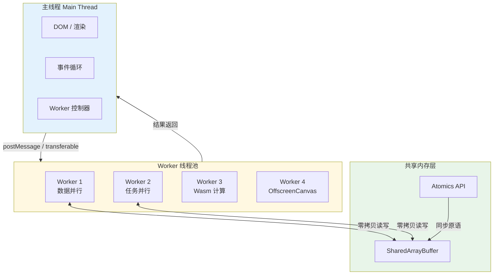
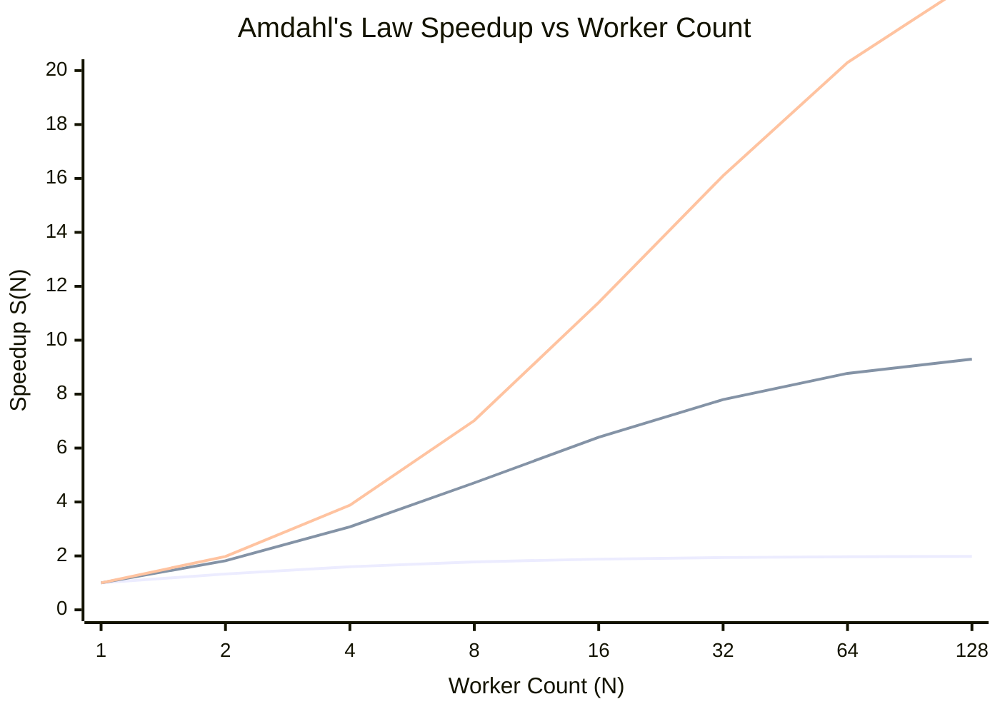
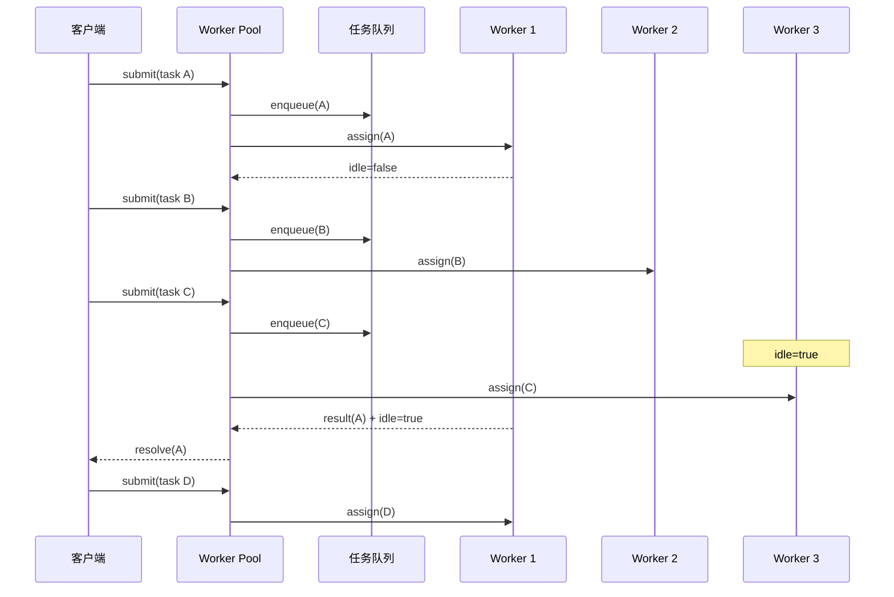

# Web Worker 与并行计算

## 引言

JavaScript 自诞生之日起便与单线程执行模型深度绑定。浏览器中的主线程（Main Thread）既负责解析 HTML、构建 DOM 树，又承担 JavaScript 执行、事件处理与页面渲染的全部职责。这一设计在简化并发编程模型的同时，也使得计算密集型任务（如大规模数据处理、图像编解码、科学模拟）不可避免地阻塞用户交互，导致页面卡顿甚至失去响应。

Web Worker 的引入打破了这一桎梏。通过将脚本执行 offload 到后台线程，Web Worker 使 Web 应用首次具备了真正的多线程并行计算能力。与此同时，`SharedArrayBuffer` 与 `Atomics` API 提供了共享内存模型，让多线程间的数据交换摆脱了序列化开销；WebAssembly 的接近原生性能与 Web Worker 的结合，更使得浏览器运行高性能计算任务成为可能。

本章从并行计算的理论根基出发，系统梳理数据并行、任务并行与流水线并行的形式化定义，引入 Amdahl 定律对并行加速比进行量化分析；随后深入工程实践，覆盖 Web Worker 的创建与通信、Structured Clone Algorithm 的语义边界、SharedArrayBuffer 的原子操作、Worker Pool 的资源管理模式、Comlink 的 Proxy 抽象、OffscreenCanvas 的渲染并行，以及 WebAssembly 与 Service Worker 后台处理的前沿应用。

---

## 理论严格表述

### 一、并行计算的形式化分类

并行计算（Parallel Computing）指同时使用多个计算资源解决计算问题的模式。根据并行粒度和任务组织方式，可形式化为三类：

#### 1.1 数据并行（Data Parallelism）

同一操作 $f$ 被并发应用于数据集 $D = \{d_1, d_2, \ldots, d_n\}$ 的不同子集：

$$
\text{Result} = \{f(d_1), f(d_2), \ldots, f(d_n)\}
$$

在数据并行模型中，控制流单一，仅数据分布不同。典型场景包括：图像像素滤波、大规模数组映射（`Array.map`）、矩阵运算、批量日志解析。数据并行通常具有良好的负载均衡性，因为各子任务的计算量近似相等。

#### 1.2 任务并行（Task Parallelism）

不同的独立任务 $T_1, T_2, \ldots, T_m$ 被分配至不同执行单元并发执行：

$$
\text{Result} = T_1 \parallel T_2 \parallel \cdots \parallel T_m
$$

任务并行适用于异构计算负载，如同时执行图像压缩、数据统计与网络请求。任务间的依赖性可用有向无环图（DAG）表示：$G = (V, E)$，其中顶点 $v \in V$ 为任务，边 $(u, v) \in E$ 表示任务 $u$ 必须在 $v$ 开始前完成。

#### 1.3 流水线并行（Pipeline Parallelism）

计算被分解为 $k$ 个顺序阶段 $S_1, S_2, \ldots, S_k$，每个阶段由独立执行单元处理，数据像流水线一样在各阶段间流动：

$$
\text{Throughput} = \frac{1}{\max_i \{t_{S_i}\}}
$$

流水线并行的吞吐量由最慢阶段（瓶颈阶段）决定。Web 应用中的典型例子是视频处理流水线：解码 → 滤镜 → 编码 → 上传，每个阶段可在独立 Worker 中运行。

### 二、Amdahl 定律在 Web Worker 中的应用

Amdahl 定律揭示了并行计算的加速上限。设程序总工作量中可并行化的比例为 $P$（$0 \leq P \leq 1$），不可并行化的串行部分比例为 $1 - P$，使用 $N$ 个并行 Worker 时的加速比 $S(N)$ 为：

$$
S(N) = \frac{1}{(1 - P) + \frac{P}{N}}
$$

当 $N \to \infty$ 时，加速比趋近于理论上限：

$$
S_{\max} = \lim_{N \to \infty} S(N) = \frac{1}{1 - P}
$$

**关键推论**：

- 若仅有 50% 的代码可并行化（$P = 0.5$），无论投入多少 Worker，最大加速比仅为 $2\times$。
- 若串行部分占 10%（$P = 0.9$），理论上限为 $10\times$。

在 Web Worker 场景中，串行部分包括：主线程与 Worker 间的通信开销、数据序列化/反序列化、任务调度与结果聚合。因此，Web Worker 并非万能药——对于计算量小、通信频繁的任务， offload 到 Worker 可能反而增加延迟。

**Gustafson 定律** 提供了另一视角：当问题规模随处理器数量扩展时，加速比可突破 Amdahl 上限：

$$
S(N) = N - P(N - 1)
$$

这适用于数据规模庞大的 Web 应用（如客户端处理百万级 CSV 记录），此时增加 Worker 的同时增加数据分片，可有效隐藏串行开销。

### 三、共享内存 vs 消息传递的并行模型

多线程间的通信与同步模型主要有两种：

#### 3.1 消息传递（Message Passing）

线程间不共享状态，通过显式发送/接收消息交换数据。Web Worker 的 `postMessage` API 即属于此模型。

形式化地，消息传递系统可描述为进程集合 $\{P_1, P_2, \ldots, P_N\}$，每个进程具有本地状态 $\sigma_i$ 和消息队列 $Q_i$。发送操作 $\text{send}(j, m)$ 将消息 $m$ 追加至 $P_j$ 的队列；接收操作 $\text{receive}()$ 从本地队列取出消息。

**优点**：天然避免数据竞争（Data Race），每个线程拥有独立堆内存；错误隔离性强，一个 Worker 崩溃不影响其他线程。

**缺点**：大数据传输涉及序列化（Structured Clone Algorithm）与内存复制，延迟较高。

#### 3.2 共享内存（Shared Memory）

多个线程直接访问同一块物理内存区域。Web 中的 `SharedArrayBuffer` 即提供了这一能力。

形式化地，共享内存系统具有全局地址空间 $M$，每个线程可执行读操作 $\text{read}(a)$ 和写操作 $\text{write}(a, v)$，其中 $a \in M$ 为地址，$v$ 为值。

**优点**：数据传输零拷贝（Zero-Copy），大数组可在纳秒级完成线程间共享。

**缺点**：需要显式同步机制（如锁、信号量、原子操作）防止数据竞争。数据竞争的形式化定义为：两个线程在未同步的情况下访问同一内存位置，且至少有一个为写操作。

### 四、Worker 线程的调度理论

Web Worker 运行在独立的操作系统线程之上（在大多数浏览器实现中如此），拥有独立的事件循环（Event Loop）。这意味着：

- 每个 Worker 内部维持自己的**任务队列**（Task Queue）和**微任务队列**（Microtask Queue）；
- `postMessage` 触发的消息事件按 FIFO 顺序进入目标线程的任务队列；
- Worker 内的同步代码执行期间，不会处理新的事件（与主线程一致）。

Worker 的调度由浏览器内核（如 Chromium 的 Blink）管理。在 Chromium 中，每个 Worker 对应一个 `WorkerThread` 对象，绑定至线程池中的某一线程。线程池的大小通常与 CPU 核心数相关，但具体策略因浏览器而异。

**关键约束**：Worker 的数量并非越多越好。每个 Worker 占用独立的运行时堆栈与 V8  isolate 开销。过量创建 Worker 会导致内存膨胀与上下文切换开销，反而降低整体吞吐量。

### 五、Transferable Objects 的零拷贝语义

`postMessage` 默认使用 **Structured Clone Algorithm** 序列化数据，该过程深度复制对象图，时间复杂度为 $O(n)$，其中 $n$ 为对象大小。对于大型 `ArrayBuffer`（如图像原始数据、音频采样），复制开销可能高达数十毫秒。

**Transferable Objects** 允许将对象的所有权从发送线程转移至接收线程，实现真正的零拷贝：

```
发送线程:  ArrayBuffer A  ──transfer──>  接收线程: ArrayBuffer A
         （所有权丧失，不可再访问）            （获得唯一所有权）
```

形式化地， transferable 操作 $\tau$ 满足：

$$
\text{send}(P_j, A, \text{transfer}=[A]) \implies \text{owns}(P_i, A) = \text{false} \land \text{owns}(P_j, A) = \text{true}
$$

其中 $\text{owns}(P, A)$ 表示线程 $P$ 是否拥有对象 $A$ 的访问权。

支持 transferable 的类型包括：`ArrayBuffer`、`MessagePort`、`ImageBitmap`、`OffscreenCanvas` 等。

---

## 工程实践映射

### 一、Web Worker 的创建与通信

#### 1.1 Dedicated Worker

Dedicated Worker 为创建它的页面专用，生命周期与页面绑定。

```javascript
// main.js（主线程）
const worker = new Worker('./heavy-task.js', { type: 'module' });

worker.postMessage({
  type: 'COMPUTE_PRIME',
  payload: { start: 1, end: 1000000 }
});

worker.onmessage = (event) => {
  const { type, result, duration } = event.data;
  console.log(`Computed ${result.length} primes in ${duration}ms`);
};

worker.onerror = (error) => {
  console.error('Worker error:', error.message);
};

// 终止 Worker（释放资源）
// worker.terminate();
```

```javascript
// heavy-task.js（Worker 线程）
self.addEventListener('message', (event) => {
  const { type, payload } = event.data;

  if (type === 'COMPUTE_PRIME') {
    const startTime = performance.now();
    const primes = sieveOfEratosthenes(payload.start, payload.end);
    const duration = performance.now() - startTime;

    self.postMessage({
      type: 'COMPUTE_PRIME_RESULT',
      result: primes,
      duration: Math.round(duration)
    });
  }
});

function sieveOfEratosthenes(start, end) {
  const isPrime = new Uint8Array(end + 1).fill(1);
  isPrime[0] = isPrime[1] = 0;

  for (let i = 2; i * i <= end; i++) {
    if (isPrime[i]) {
      for (let j = i * i; j <= end; j += i) {
        isPrime[j] = 0;
      }
    }
  }

  const primes = [];
  for (let i = Math.max(2, start); i <= end; i++) {
    if (isPrime[i]) primes.push(i);
  }
  return primes;
}
```

#### 1.2 Shared Worker

Shared Worker 可被同域的多个浏览上下文（标签页、iframe）共享：

```javascript
// shared-worker.js
const connections = new Set();

self.onconnect = (event) => {
  const port = event.ports[0];
  connections.add(port);

  port.onmessage = (e) => {
    // 广播给所有连接
    connections.forEach(conn => {
      if (conn !== port) {
        conn.postMessage(e.data);
      }
    });
  };

  port.start();
};
```

Shared Worker 适用于跨标签页状态同步（如实时协作编辑中的光标位置广播）。

#### 1.3 Structured Clone Algorithm 的边界

`postMessage` 能传输的数据类型有严格限制。以下类型**可克隆**：

- 基础类型：`Boolean`, `Null`, `Undefined`, `Number`, `String`, `BigInt`, `Symbol`
- 定型数组：`Int8Array`, `Uint8Array`, `Float64Array`, ...
- 结构化数据：`Date`, `RegExp`, `Map`, `Set`, `ArrayBuffer`
- 其他：`ImageData`, `Blob`, `File`, `FileList`

以下类型**不可克隆**（将抛出 `DataCloneError`）：

- 函数（`Function`）
- DOM 节点（`Element`, `Document`）
- 某些引擎内部对象（如 `V8::Private`）

**工程建议**：若需在 Worker 中调用主线程的回调函数，应采用 Comlink 等 Proxy 封装库，而非直接传递函数。

### 二、SharedArrayBuffer + Atomics 的多线程共享内存

`SharedArrayBuffer` 允许多个 Worker 与主线程共享同一块内存。配合 `Atomics` API，可实现无锁（Lock-Free）或有锁（Lock-Based）的并发算法。

#### 2.1 基础用法

```javascript
// main.js
const sharedBuffer = new SharedArrayBuffer(1024); // 1KB 共享内存
const sharedArray = new Int32Array(sharedBuffer);

// 初始化计数器
Atomics.store(sharedArray, 0, 0);

const worker1 = new Worker('./counter-worker.js');
const worker2 = new Worker('./counter-worker.js');

worker1.postMessage({ buffer: sharedBuffer, id: 1 });
worker2.postMessage({ buffer: sharedBuffer, id: 2 });

// 等待 Workers 完成
let completed = 0;
const onDone = () => {
  completed++;
  if (completed === 2) {
    const finalCount = Atomics.load(sharedArray, 0);
    console.log(`Final counter: ${finalCount}`); // 应为 200000
  }
};

worker1.onmessage = onDone;
worker2.onmessage = onDone;
```

```javascript
// counter-worker.js
self.onmessage = (event) => {
  const { buffer, id } = event.data;
  const arr = new Int32Array(buffer);

  for (let i = 0; i < 100000; i++) {
    // 原子加 1，避免数据竞争
    Atomics.add(arr, 0, 1);
  }

  self.postMessage({ done: true, workerId: id });
};
```

#### 2.2 Atomics.wait 与 Atomics.notify

`Atomics.wait` 使 Worker 在共享内存的某位置进入睡眠状态，直到被 `Atomics.notify` 唤醒。这是实现高性能互斥锁的基础：

```javascript
// 基于 SharedArrayBuffer 的互斥锁实现
class Mutex {
  constructor(sharedArray, index) {
    this.arr = sharedArray;
    this.index = index;
  }

  lock() {
    // 自旋尝试获取锁（快速路径）
    while (Atomics.compareExchange(this.arr, this.index, 0, 1) !== 0) {
      // 自旋失败，进入等待（慢速路径，避免 CPU 空转）
      Atomics.wait(this.arr, this.index, 1);
    }
  }

  unlock() {
    Atomics.store(this.arr, this.index, 0);
    Atomics.notify(this.arr, this.index, 1); // 唤醒一个等待者
  }
}

// 使用
// const mutex = new Mutex(sharedArray, 1);
// mutex.lock();
// try { /* 临界区 */ } finally { mutex.unlock(); }
```

**安全警告**：由于 Spectre 漏洞，`SharedArrayBuffer` 在主流浏览器中曾被禁用。目前可通过以下响应头重新启用：

```http
Cross-Origin-Embedder-Policy: require-corp
Cross-Origin-Opener-Policy: same-origin
```

### 三、Worker Pool 模式

创建和销毁 Worker 具有显著开销（V8 isolate 初始化、脚本编译）。Worker Pool 通过复用固定数量的 Worker 实例，将任务分发至空闲 Worker，实现资源的高效利用。

#### 3.1 Piscina

[Piscina](https://github.com/piscinajs/piscina) 是 Node.js 生态中最高性能的 Worker Pool 实现，专为 CPU 密集型任务优化：

```javascript
const Piscina = require('piscina');
const path = require('path');

const piscina = new Piscina({
  filename: path.resolve(__dirname, 'worker.js'),
  minThreads: 2,
  maxThreads: 8, // 通常设为 CPU 核心数
  concurrentTasksPerWorker: 1,
});

async function processImages(imagePaths) {
  const results = await Promise.all(
    imagePaths.map(path => piscina.run({ imagePath: path }))
  );
  return results;
}

// worker.js
module.exports = ({ imagePath }) => {
  // 执行 Sharp 图像处理或类似 CPU 密集型操作
  const result = require('sharp')(imagePath)
    .resize(800, 600)
    .jpeg({ quality: 85 })
    .toBuffer();
  return result;
};
```

Piscina 的调度策略基于任务队列与 Worker 空闲状态的匹配，支持 `Atomics.wait` 实现的高效任务窃取（Task Stealing）。

#### 3.2 workerpool

[workerpool](https://github.com/josdejong/workerpool) 提供了浏览器与 Node.js 双端兼容的 Worker Pool：

```javascript
const workerpool = require('workerpool');

// 定义 Worker 函数池
const pool = workerpool.pool('./math-worker.js', {
  minWorkers: 2,
  maxWorkers: 4,
  workerType: 'web', // 浏览器环境用 'web'，Node.js 用 'process'
});

async function parallelMatrixMultiply(matrices) {
  const promises = matrices.map(([a, b]) =>
    pool.exec('multiply', [a, b])
  );
  return Promise.all(promises);
}

// math-worker.js
const workerpool = require('workerpool');

function multiply(a, b) {
  const rows = a.length;
  const cols = b[0].length;
  const result = Array.from({ length: rows }, () => new Array(cols).fill(0));

  for (let i = 0; i < rows; i++) {
    for (let j = 0; j < cols; j++) {
      for (let k = 0; k < b.length; k++) {
        result[i][j] += a[i][k] * b[k][j];
      }
    }
  }
  return result;
}

workerpool.worker({ multiply });
```

### 四、Comlink 的 Proxy 封装

[Comlink](https://github.com/GoogleChromeLabs/comlink) 是 GoogleChromeLabs 开发的库，它利用 ES Proxy 将 Worker 中的对象暴露为主线程上的异步代理对象，从而隐藏 `postMessage` 的底层细节：

```javascript
// main.js
import * as Comlink from 'comlink';

const WorkerClass = Comlink.wrap(new Worker('./api-worker.js', { type: 'module' }));
const api = await new WorkerClass();

// 直接调用 Worker 中的方法，如同本地异步函数
const result = await api.expensiveComputation(42);
console.log(result);

await api[Comlink.releaseProxy](); // 释放引用
```

```javascript
// api-worker.js
import * as Comlink from 'comlink';

class API {
  expensiveComputation(n) {
    let sum = 0;
    for (let i = 0; i < n * 1000000; i++) {
      sum += Math.sqrt(i);
    }
    return sum;
  }

  async fetchAndProcess(url) {
    const response = await fetch(url);
    const data = await response.json();
    return this.process(data);
  }

  process(data) {
    return data.map(item => item.value * 2);
  }
}

Comlink.expose(API);
```

Comlink 的核心机制是：Proxy 拦截方法调用，将其序列化为消息发送至 Worker；Worker 执行实际方法，将结果异步返回。这极大降低了多线程编程的心智负担，使开发者能以接近同步代码的风格编写跨线程逻辑。

### 五、OffscreenCanvas 的渲染并行

`OffscreenCanvas` 允许将 Canvas 的渲染上下文转移至 Worker，使图像处理、游戏渲染、数据可视化等重绘制操作不再阻塞主线程：

```javascript
// main.js
const canvas = document.getElementById('game-canvas');
const offscreen = canvas.transferControlToOffscreen();

const worker = new Worker('./render-worker.js');
worker.postMessage({ canvas: offscreen }, [offscreen]);

// 后续主线程无法再通过 canvas.getContext() 访问
```

```javascript
// render-worker.js
self.onmessage = (event) => {
  const { canvas } = event.data;
  const ctx = canvas.getContext('2d');

  function renderLoop() {
    // 高性能渲染逻辑：粒子系统、游戏场景、科学可视化
    ctx.clearRect(0, 0, canvas.width, canvas.height);

    // 示例：绘制动态正弦波
    const time = performance.now() / 1000;
    ctx.beginPath();
    for (let x = 0; x < canvas.width; x++) {
      const y = canvas.height / 2 + Math.sin(x * 0.01 + time) * 100;
      if (x === 0) ctx.moveTo(x, y);
      else ctx.lineTo(x, y);
    }
    ctx.strokeStyle = '#00bcd4';
    ctx.lineWidth = 2;
    ctx.stroke();

    requestAnimationFrame(renderLoop);
  }

  renderLoop();
};
```

**适用场景**：

- 大规模粒子系统（$>10^4$ 粒子）
- 实时音频可视化
- 复杂 2D/3D 数据图表（D3.js、Three.js offload）
- 图像滤镜管道（WebGL 计算着色器）

### 六、WebAssembly + Web Worker 的高性能计算

WebAssembly（Wasm）提供了接近原生的执行性能，与 Web Worker 结合可构建浏览器端的高性能计算管道。

```javascript
// main.js
const worker = new Worker('./wasm-worker.js');

worker.postMessage({
  type: 'RUN_SIMULATION',
  payload: {
    iterations: 1000000,
    params: { alpha: 0.01, beta: 0.05 }
  }
});

worker.onmessage = (e) => {
  if (e.data.type === 'SIMULATION_RESULT') {
    const { output, elapsedMs } = e.data;
    console.log(`Simulation complete in ${elapsedMs}ms`);
    // output 为 Float64Array，transferable 零拷贝接收
  }
};
```

```javascript
// wasm-worker.js
let wasmModule = null;

async function initWasm() {
  const response = await fetch('/monte-carlo.wasm');
  const bytes = await response.arrayBuffer();
  const { instance } = await WebAssembly.instantiate(bytes, {
    env: {
      memory: new WebAssembly.Memory({ initial: 256, maximum: 512, shared: true }),
      _print: (x) => console.log(x)
    }
  });
  wasmModule = instance.exports;
}

self.onmessage = async (event) => {
  if (!wasmModule) await initWasm();

  const { type, payload } = event.data;

  if (type === 'RUN_SIMULATION') {
    const { iterations, params } = payload;
    const start = performance.now();

    // 分配共享内存用于输入/输出
    const inputPtr = wasmModule.malloc(16);
    const outputPtr = wasmModule.malloc(iterations * 8);

    const inputArray = new Float64Array(wasmModule.memory.buffer, inputPtr, 2);
    inputArray[0] = params.alpha;
    inputArray[1] = params.beta;

    // 调用 Wasm 导出的高性能函数
    wasmModule.monte_carlo_sim(inputPtr, outputPtr, iterations);

    // 提取结果（零拷贝 transferable）
    const resultBuffer = new Float64Array(iterations);
    const outputArray = new Float64Array(wasmModule.memory.buffer, outputPtr, iterations);
    resultBuffer.set(outputArray);

    wasmModule.free(inputPtr);
    wasmModule.free(outputPtr);

    self.postMessage({
      type: 'SIMULATION_RESULT',
      output: resultBuffer,
      elapsedMs: performance.now() - start
    }, [resultBuffer.buffer]);
  }
};
```

**Rust → Wasm 的编译流程**：

```bash
# Cargo.toml
# [lib]
# crate-type = ["cdylib"]

# src/lib.rs
# #[no_mangle]
# pub extern "C" fn monte_carlo_sim(input: *const f64, output: *mut f64, n: i32) { ... }

cargo install wasm-pack
wasm-pack build --target web --release
```

### 七、Service Worker 的后台处理

Service Worker 不仅可用于缓存，还提供了后台处理 API，使 Web 应用在网络不可用或页面关闭后仍能执行任务。

#### 7.1 Background Sync

允许页面注册一次性同步任务，当网络恢复时由 Service Worker 执行：

```javascript
// main.js
if ('serviceWorker' in navigator && 'SyncManager' in window) {
  navigator.serviceWorker.ready.then(registration => {
    document.getElementById('submit-btn').addEventListener('click', async () => {
      await saveFormLocally(formData);

      try {
        await registration.sync.register('submit-form');
        showNotification('表单将在联网后自动提交');
      } catch (err) {
        console.error('Background Sync registration failed:', err);
      }
    });
  });
}

async function saveFormLocally(data) {
  const db = await openDB('form-queue', 1);
  await db.add('pending', data);
}
```

```javascript
// service-worker.js
self.addEventListener('sync', (event) => {
  if (event.tag === 'submit-form') {
    event.waitUntil(processPendingForms());
  }
});

async function processPendingForms() {
  const db = await openDB('form-queue', 1);
  const forms = await db.getAll('pending');

  for (const form of forms) {
    try {
      await fetch('/api/submit', {
        method: 'POST',
        body: JSON.stringify(form),
        headers: { 'Content-Type': 'application/json' }
      });
      await db.delete('pending', form.id);
    } catch (err) {
      console.error('Form submission failed, will retry:', err);
      throw err; // 抛出错误以触发指数退避重试
    }
  }
}
```

#### 7.2 Periodic Background Sync

允许 Service Worker 以固定间隔（如每日一次）后台同步数据：

```javascript
// main.js
navigator.serviceWorker.ready.then(async (registration) => {
  const status = await navigator.permissions.query({
    name: 'periodic-background-sync',
  });

  if (status.state === 'granted') {
    await registration.periodicSync.register('daily-news', {
      minInterval: 24 * 60 * 60 * 1000, // 24 小时
    });
  }
});
```

```javascript
// service-worker.js
self.addEventListener('periodicsync', (event) => {
  if (event.tag === 'daily-news') {
    event.waitUntil(cacheLatestNews());
  }
});

async function cacheLatestNews() {
  const cache = await caches.open('news-v1');
  const response = await fetch('/api/latest-news');
  await cache.put('/api/latest-news', response);
}
```

---

## Mermaid 图表

### 图表 1：Web Worker 并行计算架构全景



### 图表 2：Amdahl 定律加速比曲线



### 图表 3：Worker Pool 任务调度流程



---

## 理论要点总结

1. **并行计算的核心矛盾在于可并行化比例**。Amdahl 定律明确指出，串行部分决定了加速比的理论上限。在引入 Web Worker 前，必须量化任务的通信/同步开销，确保 offload 的收益大于线程间协调的成本。

2. **消息传递与共享内存代表了两种不同的并发哲学**。消息传递（`postMessage`）天然隔离、容错性强，但受限于序列化开销；共享内存（`SharedArrayBuffer`）实现零拷贝数据交换，但需要开发者显式处理同步与数据竞争。工程选择应基于数据规模、一致性要求与团队并发编程经验。

3. **Transferable Objects 是实现高性能跨线程通信的关键机制**。对于大型二进制数据（图像、音频、Wasm 内存），transfer 语义避免了深度复制，将延迟从毫秒级降至微秒级。理解 Structured Clone Algorithm 与 transferable 的边界，是编写高效 Worker 代码的前提。

4. **Worker Pool 是生产环境的必要模式**。Worker 的创建与销毁成本不可忽视，Piscina 与 workerpool 通过固定线程池、任务队列与负载均衡，将 Worker 管理抽象为可复用的基础设施。合理设置 `minThreads` 与 `maxThreads`（通常与 CPU 核心数匹配），可避免资源浪费与线程爆炸。

5. **WebAssembly 与 Web Worker 的协同代表了 Web 高性能计算的前沿方向**。将 CPU 密集型算法（图像处理、数值模拟、加密解密）用 Rust/C++ 编译为 Wasm，再在 Worker 中运行，可在浏览器中实现接近原生的执行效率。这一技术栈正在重塑视频编辑、CAD、科学可视化等重度计算场景在 Web 上的可行性边界。

---

## 参考资源

1. **MDN Web Docs**, "Web Workers API". —— Mozilla 开发者网络对 Web Worker 的权威文档，涵盖 Dedicated Worker、Shared Worker、Service Worker 的完整 API 参考与使用示例。[https://developer.mozilla.org/en-US/docs/Web/API/Web_Workers_API](https://developer.mozilla.org/en-US/docs/Web/API/Web_Workers_API)

2. **MDN Web Docs**, "SharedArrayBuffer" 与 "Atomics". —— 详细介绍了共享内存模型、跨源隔离要求（COOP/COEP）以及 `Atomics.load`、`Atomics.store`、`Atomics.wait`、`Atomics.notify` 等原子操作的语义与使用模式。[https://developer.mozilla.org/en-US/docs/Web/JavaScript/Reference/Global_Objects/SharedArrayBuffer](https://developer.mozilla.org/en-US/docs/Web/JavaScript/Reference/Global_Objects/SharedArrayBuffer)

3. **GoogleChromeLabs / Comlink**, GitHub Repository & Documentation. —— Comlink 官方文档，阐述 Proxy-based RPC 的设计原理、API 参考、TypeScript 支持及与 React/Vue 框架的集成模式。[https://github.com/GoogleChromeLabs/comlink](https://github.com/GoogleChromeLabs/comlink)

4. **Piscina**, GitHub Repository & Documentation. —— Node.js Worker Pool 的官方文档，详细介绍线程池配置、任务队列、资源限制、性能基准测试及与 Fastify/Express 的集成方案。[https://github.com/piscinajs/piscina](https://github.com/piscinajs/piscina)

5. **Lin, C. & Snyder, L.**,《Principles of Parallel Programming》, Addison-Wesley, 2008. —— 并行计算领域的经典教材，系统讲解了数据并行、任务并行、流水线并行、Amdahl 定律、Gustafson 定律及共享内存同步原语的理论基础，为理解 Web Worker 的并行模型提供了坚实的计算机科学理论支撑。
