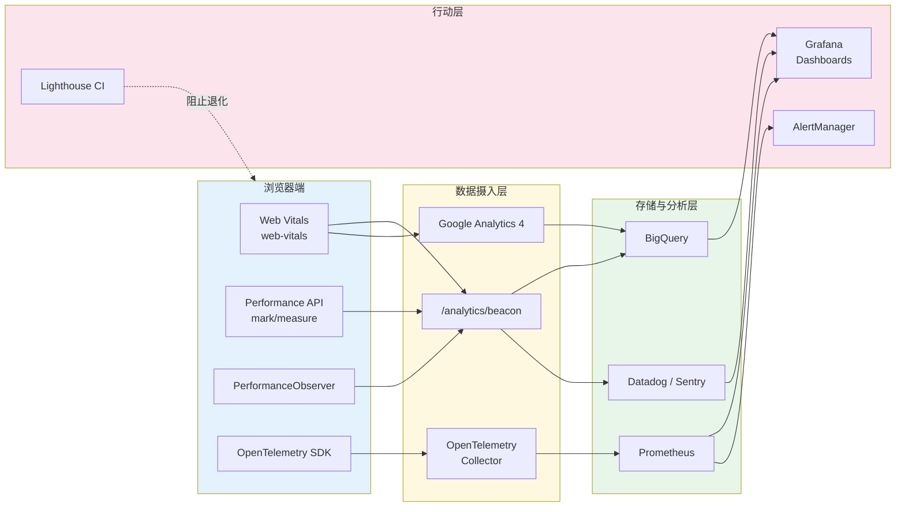
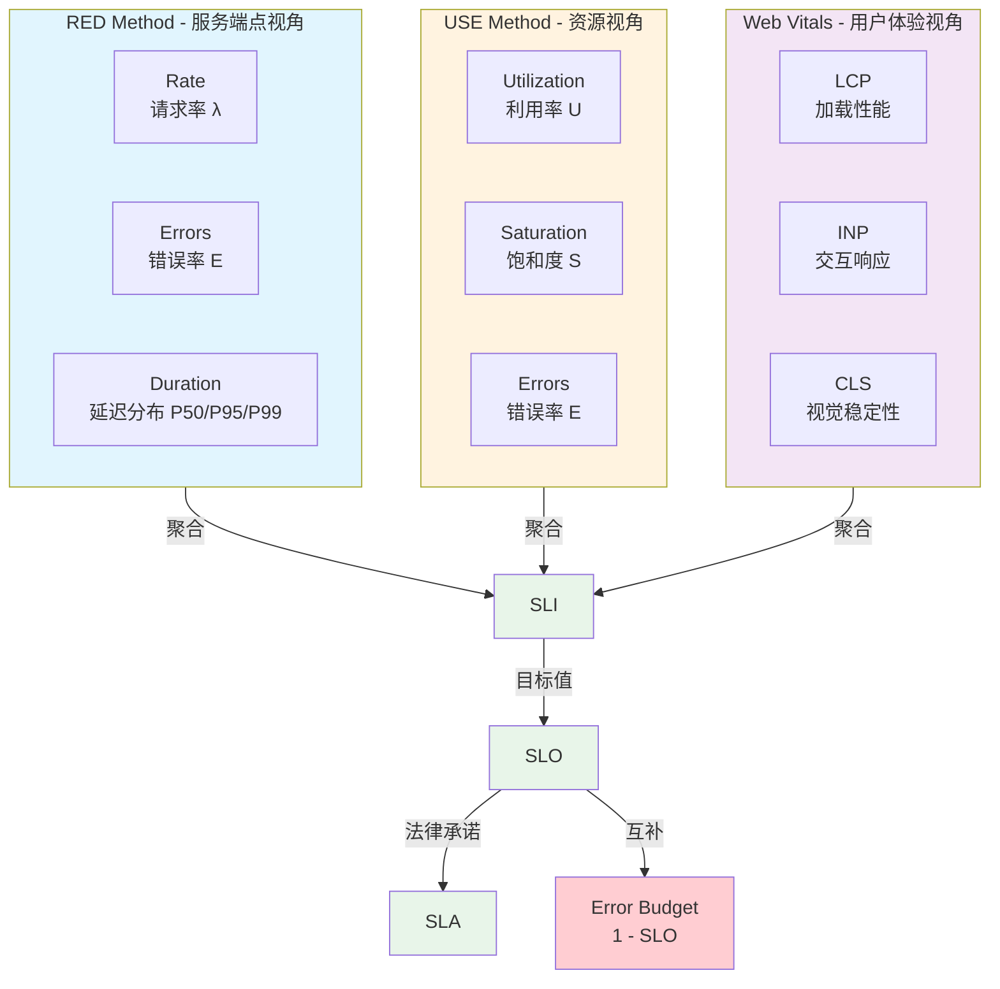
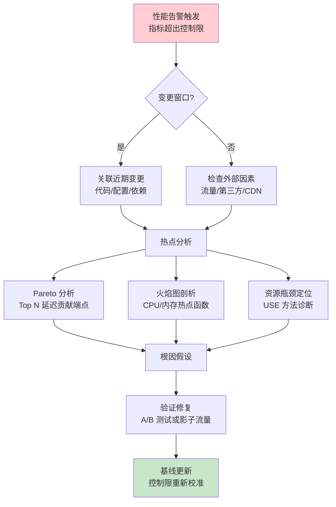

# 性能监控：从指标到行动

## 引言

性能优化有一条著名的铁律："你无法优化你无法度量的东西。"（You can't optimize what you can't measure.）然而，度量本身并非终点——从海量的性能指标中提取可行动的洞察，建立从异常发现到根因定位再到修复验证的闭环，才是性能工程的核心竞争力。

现代 Web 应用的性能监控体系横跨浏览器、CDN、边缘节点、应用服务器、数据库及基础设施层，产生的指标维度之多、数据量之大，已远超人工分析的能力边界。本章从两个经典监控方法论——USE 与 RED——出发，建立性能监控的理论框架；进而深入工程实践，覆盖 Web Vitals 的自动化采集、RUM（Real User Monitoring）平台的部署、自定义 Performance API 标记、Lighthouse CI 的自动化审计、性能预算的强制执行，以及基于 Prometheus + Grafana 的长期趋势监控与告警体系。

通过本章的学习，读者将能够构建一套覆盖"采集 → 存储 → 分析 → 告警 → 行动"全链路的性能监控基础设施。

---

## 理论严格表述

### 一、性能监控的指标体系

在分布式系统监控领域，USE 方法与 RED 方法是两个互补的经典框架。前者关注资源层面，后者关注服务层面。

#### 1.1 USE 方法

由 Brendan Gregg 提出的 USE 方法（Utilization, Saturation, Errors）专注于系统资源的健康状态：

- **Utilization（利用率）**：资源忙于处理工作的时间比例。对于 CPU，利用率 $U_{cpu} = \frac{t_{busy}}{t_{total}}$；对于内存，利用率可表示为已分配内存与总内存之比 $U_{mem} = \frac{M_{used}}{M_{total}}$。
- **Saturation（饱和度）**：资源因超载而排队等待的程度。例如 CPU 运行队列长度 $Q_{cpu}$、网络接口的缓冲区队列长度 $Q_{net}$。饱和度在利用率未达到 100% 时仍可能显著不为零（如 I/O 阻塞导致任务排队）。
- **Errors（错误率）**：资源操作失败的频率。如磁盘 I/O 错误率 $E_{disk} = \frac{N_{errors}}{N_{total}}$、内存 ECC 纠错事件数。

USE 方法的形式化目标是为每种资源 $R$ 建立三元组监控向量：

$$
M(R) = (U_R, S_R, E_R)
$$

当任意一项超过预设阈值时，即表明资源层存在性能瓶颈。

#### 1.2 RED 方法

RED 方法（Rate, Errors, Duration）由 Tom Wilkie 提出，专注于面向用户的服务请求：

- **Rate（请求率）**：单位时间内接收的请求数，$\lambda = \frac{\Delta N_{requests}}{\Delta t}$。Rate 的突变（突增或骤降）往往是系统异常的先行指标。
- **Errors（错误率）**：请求处理失败的比率，$E = \frac{N_{5xx} + N_{4xx\_critical}}{N_{total}}$。需区分可预期错误（如 404）与系统错误（如 500、503）。
- **Duration（延迟）**：请求处理的耗时分布，通常以百分位数 $P50, P95, P99$ 描述。Duration 的分布形态（是否右偏、是否存在长尾）比平均值更具诊断价值。

RED 方法为每个服务端点 $e$ 建立监控向量：

$$
M(e) = (\lambda_e, E_e, D_e)
$$

#### 1.3 浏览器端扩展：Web Vitals

Google 提出的 Web Vitals 将 RED/USE 方法扩展至用户体验维度，定义了三个核心指标：

- **LCP（Largest Contentful Paint）**：视口中最大可见内容元素的渲染时间。衡量**加载性能**。
- **FID（First Input Delay）** → **INP（Interaction to Next Paint）**：用户首次交互到浏览器响应的时间（FID），或更广泛的所有交互的延迟分布（INP）。衡量**交互性**。
- **CLS（Cumulative Layout Shift）**：可视元素意外位移的累积得分。衡量**视觉稳定性**。

Web Vitals 的形式化意义在于：将抽象的"用户体验"转化为可量化、可比较、可监控的工程指标。

### 二、性能基线的统计学建立

性能监控的核心挑战之一是区分"正常波动"与"异常退化"。这需要建立统计学意义上的性能基线。

#### 2.1 控制图（Control Chart）

控制图是统计过程控制（SPC）的核心工具。对于性能指标 $X$（如 LCP），在稳定期内采集样本 $\{x_1, x_2, \ldots, x_n\}$，计算：

- 中心线（Center Line, CL）：$\bar{x} = \frac{1}{n}\sum_{i=1}^{n} x_i$
- 上控制限（Upper Control Limit, UCL）：$\bar{x} + 3\sigma$
- 下控制限（Lower Control Limit, LCL）：$\bar{x} - 3\sigma$

其中 $\sigma$ 为样本标准差。当观测值超出 $[LCL, UCL]$ 区间，或出现连续 7 点同侧偏移时，判定过程失控（Out of Control），触发告警。

#### 2.2 异常检测算法

对于具有季节性、趋势性的性能指标（如日间流量高峰、周末低谷），静态阈值不再适用。常用算法包括：

- **移动平均（Moving Average, MA）与指数平滑（Exponential Smoothing, EWMA）**：
  $$
  S_t = \alpha x_t + (1-\alpha) S_{t-1}
  $$
  其中 $\alpha \in (0, 1)$ 为平滑因子。EWMA 对近期数据赋予更高权重，适合检测渐进式退化。

- **Z-Score / Modified Z-Score**：
  $$
  Z_i = \frac{x_i - \mu}{\sigma}
  $$
  当 $|Z_i| > 3$ 时判定为异常。对于非正态分布，使用基于中位数的 Modified Z-Score：
  $$
  M_i = \frac{0.6745(x_i - \tilde{x})}{\text{MAD}}
  $$
  其中 MAD 为绝对中位差（Median Absolute Deviation）。

- **Prophet / STL 分解**：将时间序列分解为趋势 $T_t$、季节性 $S_t$ 与残差 $R_t$：
  $$
  X_t = T_t + S_t + R_t
  $$
  在残差分量上应用阈值检测，可有效过滤业务周期带来的正常波动。

### 三、性能回归的根因分析理论

性能回归（Performance Regression）指系统性能在无明确预期的情况下发生退化。根因分析（Root Cause Analysis, RCA）需要建立变更与性能指标之间的关联模型。

#### 3.1 变更关联（Change Correlation）

假设在时间窗口 $[t_0, t_1]$ 内部署了变更集合 $C = \{c_1, c_2, \ldots, c_m\}$（如代码提交、配置修改、依赖升级），性能指标在该窗口后发生显著变化 $\Delta X$。变更关联的目标是计算每个变更的条件概率：

$$
P(c_i | \Delta X) = \frac{P(\Delta X | c_i) P(c_i)}{\sum_j P(\Delta X | c_j) P(c_j)}
$$

在实践中，可通过构建变更-性能联合时间线，结合部署标记（Deployment Marker）与指标突变点（Changepoint Detection）进行人工或自动关联。

#### 3.2 热点分析（Hotspot Analysis）

性能回归可能源于特定代码路径、用户群体或资源瓶颈。热点分析的形式化方法是识别对总体延迟贡献最大的子集：

- **Pareto 分析**：80% 的延迟可能由 20% 的端点或查询引起。计算每个端点的延迟贡献度：
  $$
  \text{Contribution}(e) = \lambda_e \times P99_e
  $$
- **火焰图（Flame Graph）可视化**：基于采样剖析（Sampling Profiling）构建调用栈频率直方图，宽度代表采样次数，快速定位 CPU 热点函数。
- **资源瓶颈定位**：结合 USE 方法，识别利用率或饱和度最先达到 100% 的资源，该资源即为系统的约束（Constraint）。

### 四、SLI / SLO / SLA 的数学基础

Google SRE 体系将服务质量目标形式化为三层结构：

- **SLI（Service Level Indicator）**：服务质量指标，是可量化测量的原始指标。例如：
  $$
  \text{SLI}_{availability} = \frac{N_{successful}}{N_{total}} \times 100\%
  $$
  $$
  \text{SLI}_{latency} = P95(\text{request_duration})
  $$

- **SLO（Service Level Objective）**：服务质量目标，是 SLI 的目标值。例如：
  $$
  \text{SLO}_{availability}: \text{SLI}_{availability} \geq 99.9\%
  $$
  $$
  \text{SLO}_{latency}: \text{SLI}_{latency} \leq 200\text{ms}
  $$

- **SLA（Service Level Agreement）**：服务等级协议，是面向客户的法律承诺，通常比 SLO 更宽松（引入误差预算缓冲）。

**误差预算（Error Budget）** 是 SLO 的互补概念：

$$
\text{Error Budget} = 1 - \text{SLO}
$$

若某服务的可用性 SLO 为 99.9%，则年误差预算为：

$$
365 \times 24 \times 60 \times (1 - 0.999) = 525.6 \text{ 分钟}
$$

当误差预算在滚动窗口内耗尽时，团队应冻结所有非关键发布，优先投入可靠性工程。

---

## 工程实践映射

### 一、Web Vitals 的自动化采集

#### 1.1 web-vitals 库

Google 官方提供的 `web-vitals` 库是采集 Core Web Vitals 的标准工具，支持所有现代浏览器：

```javascript
import { onLCP, onINP, onCLS, onFCP, onTTFB } from 'web-vitals';

function sendToAnalytics(metric) {
  const body = JSON.stringify(metric);
  // 使用 navigator.sendBeacon 确保页面卸载时数据不丢失
  if (navigator.sendBeacon) {
    navigator.sendBeacon('/analytics/web-vitals', body);
  } else {
    fetch('/analytics/web-vitals', { body, method: 'POST', keepalive: true });
  }
}

// 注册各指标监听器
onLCP(sendToAnalytics, { reportAllChanges: false });
onINP(sendToAnalytics, { reportAllChanges: false });
onCLS(sendToAnalytics, { reportAllChanges: false });
onFCP(sendToAnalytics);
onTTFB(sendToAnalytics);
```

`web-vitals` 库返回的 metric 对象包含：

- `name`: 指标名称（`LCP`, `INP`, `CLS`, `FCP`, `TTFB`）
- `value`: 指标值（毫秒或 CLS 分数）
- `rating`: 评级（`good`, `needs-improvement`, `poor`）
- `entries`: 触发该指标性能的 PerformanceEntry 数组
- `navigationType`: 导航类型（`navigate`, `reload`, `back-forward`, `prerender`）

#### 1.2 Google Analytics 4 集成

将 Web Vitals 发送至 GA4，可在 Google Search Console 与 PageSpeed Insights 中查看字段数据：

```javascript
import { onLCP, onINP, onCLS } from 'web-vitals';

function sendToGA4({ name, delta, value, id, rating }) {
  // 仅在 gtag 可用时发送
  if (typeof gtag !== 'function') return;

  gtag('event', name, {
    event_category: 'Web Vitals',
    value: Math.round(name === 'CLS' ? value * 1000 : value),
    event_label: id,
    non_interaction: true,
    custom_parameter_rating: rating,
  });
}

onLCP(sendToGA4);
onINP(sendToGA4);
onCLS(sendToGA4);
```

#### 1.3 BigQuery 原始数据导出

对于需要深度分析的场景，可将 GA4 数据链接至 BigQuery，使用 SQL 进行自定义聚合：

```sql
-- BigQuery: 按页面路径统计 LCP P75
SELECT
  event_date,
  (SELECT value.string_value FROM UNNEST(event_params) WHERE key = 'page_location') AS page,
  APPROX_QUANTILES(
    (SELECT value.int_value FROM UNNEST(event_params) WHERE key = 'value'),
    100
  )[OFFSET(75)] AS lcp_p75
FROM
  `project.dataset.events_*`
WHERE
  event_name = 'LCP'
  AND _TABLE_SUFFIX BETWEEN '20260501' AND '20260531'
GROUP BY
  event_date, page
ORDER BY
  lcp_p75 DESC
LIMIT 100;
```

### 二、性能监控平台（RUM）

#### 2.1 Datadog RUM

Datadog Real User Monitoring 提供了开箱即用的 Web Vitals 采集、会话重放（Session Replay）与性能瀑布流分析：

```javascript
import { datadogRum } from '@datadog/browser-rum';

datadogRum.init({
  applicationId: 'YOUR_APP_ID',
  clientToken: 'YOUR_CLIENT_TOKEN',
  site: 'datadoghq.com',
  service: 'my-web-app',
  env: 'production',
  version: '1.2.3',
  sessionSampleRate: 100,
  sessionReplaySampleRate: 20, // 20% 会话启用重放
  trackUserInteractions: true,
  trackResources: true,
  trackLongTasks: true,
  defaultPrivacyLevel: 'mask-user-input',
});

datadogRum.startSessionReplayRecording();
```

Datadog RUM 自动计算 LCP、INP、CLS、FCP、TTFB，并关联到具体的资源加载瀑布流、长任务（Long Tasks）及用户交互时间线。其独特的**会话重放**功能允许开发者以视频形式回放用户遭遇性能问题的完整过程。

#### 2.2 New Relic Browser

```javascript
// 通过 NPM 安装 @newrelic/browser-agent
import { BrowserAgent } from '@newrelic/browser-agent/loaders/browser-agent';

const options = {
  info: {
    beacon: 'bam.nr-data.net',
    errorBeacon: 'bam.nr-data.net',
    licenseKey: 'YOUR_LICENSE_KEY',
    applicationID: 'YOUR_APP_ID',
    sa: 1,
  },
  loader_config: { accountID: 'YOUR_ACCOUNT_ID', trustKey: 'YOUR_TRUST_KEY' },
  init: {
    ajax: { deny_list: ['internal-api.example.com'] },
    distributed_tracing: { enabled: true },
    privacy: { cookies_enabled: true },
    session_trace: { enabled: true },
  },
};

new BrowserAgent(options);
```

New Relic 的 **Session Traces** 提供了单用户会话级别的详细时序图，包括 JavaScript 执行、DOM 渲染、Ajax 请求与资源加载的纳秒级时间线。

#### 2.3 Sentry Performance

Sentry 以错误追踪见长，其 Performance Monitoring 模块提供了轻量级的性能监控方案：

```javascript
import * as Sentry from '@sentry/browser';

Sentry.init({
  dsn: 'https://xxx@yyy.ingest.sentry.io/zzz',
  integrations: [
    Sentry.browserTracingIntegration({
      tracePropagationTargets: ['localhost', /^https:\/\/api\.example\.com/],
    }),
  ],
  tracesSampleRate: 0.1, // 10% 采样率
  replaysSessionSampleRate: 0.01,
  replaysOnErrorSampleRate: 1.0,
});

// 自定义事务（Transaction）
function loadDashboard() {
  const transaction = Sentry.startTransaction({ name: 'loadDashboard' });
  Sentry.getCurrentScope().setSpan(transaction);

  const fetchSpan = transaction.startChild({ op: 'http', description: 'GET /api/dashboard' });
  fetch('/api/dashboard')
    .then(res => res.json())
    .then(data => {
      fetchSpan.setStatus('ok');
      fetchSpan.finish();

      const renderSpan = transaction.startChild({ op: 'ui.render', description: 'render charts' });
      renderCharts(data);
      renderSpan.finish();

      transaction.finish();
    });
}
```

Sentry 的分布式追踪（Distributed Tracing）可横跨前端、后端与数据库，构建端到端的性能调用链。

### 三、自定义性能标记（Performance API）

W3C Performance API 提供了浏览器原生的高精度时间戳（`DOMHighResTimeStamp`，分辨率通常为 5 微秒），是自定义性能度量的基础。

#### 3.1 Performance Mark & Measure

```javascript
// 标记阶段起点
performance.mark('app-bootstrap-start');

// 应用初始化逻辑
await initializeFramework();
await loadUserSession();

// 标记阶段终点
performance.mark('app-bootstrap-end');

// 计算并存储度量
performance.measure('app-bootstrap', {
  start: 'app-bootstrap-start',
  end: 'app-bootstrap-end',
});

// 读取度量数据
const entries = performance.getEntriesByName('app-bootstrap', 'measure');
entries.forEach(entry => {
  console.log(`Bootstrap took ${entry.duration.toFixed(2)}ms`);
  // 发送至监控系统
  sendToAnalytics({
    name: 'custom_bootstrap',
    duration: entry.duration,
    startTime: entry.startTime,
  });
});
```

#### 3.2 Navigation Timing API

`PerformanceNavigationTiming` 提供了页面加载全生命周期的细分指标：

```javascript
const [nav] = performance.getEntriesByType('navigation');

if (nav) {
  const metrics = {
    dns_lookup: nav.domainLookupEnd - nav.domainLookupStart,
    tcp_connect: nav.connectEnd - nav.connectStart,
    tls_handshake: nav.secureConnectionStart > 0
      ? nav.connectEnd - nav.secureConnectionStart
      : 0,
    ttfb: nav.responseStart - nav.startTime,
    download_time: nav.responseEnd - nav.responseStart,
    dom_parse: nav.domInteractive - nav.responseEnd,
    dom_ready: nav.domContentLoadedEventEnd - nav.startTime,
    load_complete: nav.loadEventEnd - nav.startTime,
  };

  console.table(metrics);
}
```

#### 3.3 Resource Timing API

监控单个资源的加载性能：

```javascript
const resources = performance.getEntriesByType('resource');

resources.forEach(r => {
  if (r.duration > 1000) {
    console.warn(`Slow resource: ${r.name} took ${r.duration.toFixed(0)}ms`);
  }
});

// 使用 PerformanceObserver 实时监听（见下文）
```

#### 3.4 Element Timing API

跟踪特定 DOM 元素的渲染时间：

```html
<!-- 添加 elementtiming 属性 -->

<h1 elementtiming="main-heading">Welcome</h1>
```

```javascript
const observer = new PerformanceObserver((list) => {
  for (const entry of list.getEntries()) {
    if (entry.identifier === 'hero-image') {
      console.log(`Hero image rendered at ${entry.renderTime}ms`);
    }
  }
});
observer.observe({ entryTypes: ['element'] });
```

### 四、Performance Observer 的实时采集

`PerformanceObserver` 是 W3C 标准 API，支持订阅特定类型的性能条目，避免轮询 `performance.getEntries()` 带来的性能开销：

```javascript
const observer = new PerformanceObserver((list, obs) => {
  const entries = list.getEntries();

  entries.forEach(entry => {
    switch (entry.entryType) {
      case 'largest-contentful-paint':
        reportLCP(entry);
        break;
      case 'layout-shift':
        reportCLS(entry);
        break;
      case 'longtask':
        // 长任务 (>50ms) 可能阻塞主线程
        reportLongTask(entry);
        break;
      case 'resource':
        reportResource(entry);
        break;
      case 'navigation':
        reportNavigation(entry);
        break;
    }
  });
});

// 订阅多种条目类型
observer.observe({
  entryTypes: ['resource', 'navigation', 'longtask'],
  buffered: true, // 包含 observer 创建前已产生的条目
});

// LCP 与 CLS 需单独使用 web-vitals 库或特定类型名
// 注意：不同浏览器支持的 entryTypes 有差异，需做特性检测
```

**Buffering 策略**：设置 `buffered: true` 可在 observer 延迟注册时（如动态加载的监控脚本）捕获页面加载早期的事件，避免丢失关键的 LCP/FCP 数据。

### 五、Lighthouse CI 的自动化审计

Lighthouse 是 Google 开发的开源自动化工具，用于评估网页的性能、可访问性、最佳实践与 SEO。

#### 5.1 本地集成

```bash
npm install -g @lhci/cli
```

```json
// lighthouserc.js
module.exports = {
  ci: {
    collect: {
      url: ['http://localhost:3000/', 'http://localhost:3000/about'],
      numberOfRuns: 3, // 多次运行取中位数，降低噪声
      settings: {
        preset: 'desktop', // 或 'mobile'
        chromeFlags: '--no-sandbox --disable-gpu',
      },
    },
    assert: {
      assertions: {
        'categories:performance': ['warn', { minScore: 0.9 }],
        'categories:accessibility': ['error', { minScore: 0.95 }],
        'first-contentful-paint': ['warn', { maxNumericValue: 1800 }],
        'largest-contentful-paint': ['error', { maxNumericValue: 2500 }],
        'cumulative-layout-shift': ['error', { maxNumericValue: 0.1 }],
      },
    },
    upload: {
      target: 'temporary-public-storage', // 或配置私有 LHCI server
    },
  },
};
```

#### 5.2 GitHub Actions 集成

```yaml
# .github/workflows/lighthouse-ci.yml
name: Lighthouse CI

on: [push, pull_request]

jobs:
  lighthouse:
    runs-on: ubuntu-latest
    steps:
      - uses: actions/checkout@v4
      - uses: actions/setup-node@v4
        with:
          node-version: 20
          cache: 'npm'
      - run: npm ci
      - run: npm run build
      - name: Run Lighthouse CI
        run: |
          npm install -g @lhci/cli
          lhci autorun
        env:
          LHCI_GITHUB_APP_TOKEN: ${{ secrets.LHCI_GITHUB_APP_TOKEN }}
```

Lighthouse CI 会在 Pull Request 中自动评论性能分数的变化，阻止性能退化进入主分支。

### 六、性能预算的自动化 Enforcement

性能预算（Performance Budget）为资源大小、请求数量、指标阈值设定明确上限，超出即构建失败。

#### 6.1 Bundlesize

```json
// package.json
{
  "bundlesize": [
    { "path": "./dist/main-*.js", "maxSize": "150 kB" },
    { "path": "./dist/vendor-*.js", "maxSize": "250 kB" },
    { "path": "./dist/styles-*.css", "maxSize": "30 kB" },
    { "path": "./dist/*.jpg", "maxSize": "50 kB" }
  ]
}
```

```bash
npx bundlesize
```

#### 6.2 Webpack Performance Hints

```javascript
// webpack.config.js
module.exports = {
  performance: {
    maxAssetSize: 250000,      // 250 KB（以字节为单位）
    maxEntrypointSize: 400000, // 400 KB
    hints: 'error',            // 'warning' 或 'error'
    assetFilter: (assetFilename) => {
      return assetFilename.endsWith('.js') || assetFilename.endsWith('.css');
    },
  },
};
```

#### 6.3 Lighthouse CI 预算断言

```javascript
// lighthouserc.js
module.exports = {
  ci: {
    assert: {
      assertions: {
        'resource-summary:document:size': ['warn', { maxNumericValue: 20000 }],
        'resource-summary:script:size': ['error', { maxNumericValue: 500000 }],
        'resource-summary:image:size': ['warn', { maxNumericValue: 1000000 }],
        'resource-summary:third-party:count': ['warn', { maxNumericValue: 10 }],
      },
    },
  },
};
```

### 七、长期趋势分析与告警（Prometheus + Grafana）

对于自建监控基础设施的团队，Prometheus + Grafana 是开源生态的事实标准。

#### 7.1 浏览器端指标暴露

通过自定义 exporter 或 OpenTelemetry 将浏览器性能指标推送至后端：

```javascript
// 使用 OpenTelemetry Web SDK
import { WebTracerProvider } from '@opentelemetry/sdk-trace-web';
import { OTLPTraceExporter } from '@opentelemetry/exporter-trace-otlp-http';
import { BatchSpanProcessor } from '@opentelemetry/sdk-trace-base';

const provider = new WebTracerProvider();
const exporter = new OTLPTraceExporter({
  url: 'https://otel-collector.example.com/v1/traces',
});
provider.addSpanProcessor(new BatchSpanProcessor(exporter));
provider.register();

// 创建自定义 span 标记关键性能阶段
const tracer = provider.getTracer('web-app');
const span = tracer.startSpan('page-load');
span.setAttribute('lcp', lcpValue);
span.setAttribute('cls', clsValue);
span.setAttribute('inp', inpValue);
span.end();
```

#### 7.2 Prometheus 指标定义

若后端为 Node.js，可使用 `prom-client` 暴露聚合后的性能指标：

```javascript
const client = require('prom-client');

// 定义直方图：LCP 分布
const lcpHistogram = new client.Histogram({
  name: 'web_vitals_lcp_seconds',
  help: 'Largest Contentful Paint in seconds',
  buckets: [0.1, 0.25, 0.5, 1.0, 1.5, 2.5, 4.0],
  labelNames: ['page', 'device_type'],
});

// 定义计数器：长任务次数
const longTaskCounter = new client.Counter({
  name: 'web_long_tasks_total',
  help: 'Total number of long tasks (>50ms)',
  labelNames: ['page'],
});

// Express 中间件：暴露 /metrics 端点
app.get('/metrics', async (req, res) => {
  res.set('Content-Type', client.register.contentType);
  res.end(await client.register.metrics());
});
```

#### 7.3 Grafana 告警规则

```yaml
# prometheus-alerts.yml
groups:
  - name: web_performance
    rules:
      - alert: HighLCP
        expr: |
          histogram_quantile(0.75,
            sum(rate(web_vitals_lcp_seconds_bucket[5m])) by (le, page)
          ) > 2.5
        for: 5m
        labels:
          severity: warning
        annotations:
          summary: "High LCP on {{ $labels.page }}"
          description: "P75 LCP is {{ $value }}s, exceeding 2.5s threshold."

      - alert: HighErrorRate
        expr: |
          sum(rate(http_requests_total{status=~"5.."}[5m]))
          /
          sum(rate(http_requests_total[5m])) > 0.01
        for: 2m
        labels:
          severity: critical
        annotations:
          summary: "High error rate detected"
          description: "Error rate is {{ $value | humanizePercentage }} over last 5m."

      - alert: CLSRegression
        expr: |
          avg_over_time(web_vitals_cls_score[1h]) > 0.1
        for: 10m
        labels:
          severity: warning
        annotations:
          summary: "CLS regression detected"
          description: "Average CLS over 1h is {{ $value }}, exceeding 0.1."
```

#### 7.4 Grafana Dashboard 配置要点

```json
{
  "dashboard": {
    "title": "Web Performance Overview",
    "panels": [
      {
        "title": "Core Web Vitals Trend",
        "type": "timeseries",
        "targets": [
          {
            "expr": "histogram_quantile(0.75, sum(rate(web_vitals_lcp_seconds_bucket[$__rate_interval])) by (le))",
            "legendFormat": "LCP P75"
          },
          {
            "expr": "histogram_quantile(0.75, sum(rate(web_vitals_inp_seconds_bucket[$__rate_interval])) by (le))",
            "legendFormat": "INP P75"
          }
        ],
        "fieldConfig": {
          "defaults": {
            "unit": "s",
            "custom": { "drawStyle": "line", "lineWidth": 2 }
          }
        }
      },
      {
        "title": "Performance Budget Compliance",
        "type": "gauge",
        "targets": [
          {
            "expr": "resource_summary_script_size_bytes / 500000",
            "legendFormat": "Script Size / Budget"
          }
        ]
      }
    ]
  }
}
```

---

## Mermaid 图表

### 图表 1：全链路性能监控数据流



### 图表 2：RED 方法指标体系



### 图表 3：性能回归根因分析流程



---

## 理论要点总结

1. **USE 与 RED 方法提供了互补的监控视角**。USE 从资源层面回答"系统是否健康"，RED 从服务层面回答"用户体验是否受损"。两者结合可构建从基础设施到业务指标的完整监控覆盖。Web Vitals 进一步将这一框架下沉到浏览器端，使前端性能监控具备了与后端同等的方法论严谨性。

2. **性能基线必须建立在统计学基础之上**。静态阈值无法适应业务波动，控制图、EWMA、Z-Score 及时间序列分解等方法可从噪声中提取信号。尤其需要注意的是，性能指标通常呈现右偏分布（存在长尾），中位数与百分位数比算术平均值更具代表性。

3. **误差预算是连接可靠性目标与工程决策的桥梁**。SLO 不是越高越好——99.999% 的可用性 SLO 意味着年仅 5 分钟的误差预算，可能严重抑制团队的发布频率与创新速度。合理的 SLO 应反映用户可感知的差异与业务承受的损失，而非技术完美主义。

4. **自动化审计与性能预算是防止退化的制度性保障**。Lighthouse CI 与 Bundlesize 将性能约束左移至构建阶段，在代码合并前即拦截问题，其成本远低于生产环境发现后的紧急修复。性能预算应当与功能需求同等对待，作为 Definition of Done 的必要条件。

5. **从指标到行动的闭环是性能工程成熟的标志**。采集与存储性能数据的技术门槛已显著降低，真正的挑战在于建立告警分级、值班响应、根因分析、修复验证与知识沉淀的完整流程。Prometheus 的告警规则、Grafana 的可视化、Sentry 的分布式追踪与 Datadog 的会话重放，共同构成了现代性能运维的工具链。

---

## 参考资源

1. **Google Web Vitals**, Official Documentation. —— Google 官方对 Core Web Vitals 的完整文档，包含 LCP、INP、CLS 的定义、测量方法、优化建议及字段数据与实验室数据的区别。[https://web.dev/vitals/](https://web.dev/vitals/)

2. **GoogleChromeLabs / web-vitals**, GitHub Repository. —— `web-vitals` 库的官方文档与源码，详细说明了各指标的触发时机、浏览器兼容性、归因（attribution）信息及与第三方分析工具的集成模式。[https://github.com/GoogleChrome/web-vitals](https://github.com/GoogleChrome/web-vitals)

3. **Datadog Documentation**, "Real User Monitoring". —— Datadog RUM 的官方配置指南，涵盖浏览器 SDK 初始化、自定义操作追踪、性能瀑布流解读、会话重放与移动端监控。[https://docs.datadoghq.com/real_user_monitoring/](https://docs.datadoghq.com/real_user_monitoring/)

4. **Sentry Documentation**, "Performance Monitoring". —— Sentry 性能监控模块的完整文档，包括分布式追踪、自定义事务与 span、性能问题的自动检测、性能回归告警及与前端框架（React、Vue、Angular）的深度集成。[https://docs.sentry.io/product/performance/](https://docs.sentry.io/product/performance/)

5. **Betsy Beyer, Chris Jones, Jennifer Petoff & Niall Richard Murphy (eds.)**,《Site Reliability Engineering: How Google Runs Production Systems》, O'Reilly Media, 2016. —— Google SRE 团队的官方著作，第 2 章 "Implementing SLOs" 与第 4 章 "Service Level Objectives" 系统阐述了 SLI、SLO、SLA、误差预算的数学定义与组织实践，是理解可靠性工程目标体系的权威参考。[https://sre.google/sre-book/table-of-contents/](https://sre.google/sre-book/table-of-contents/)
