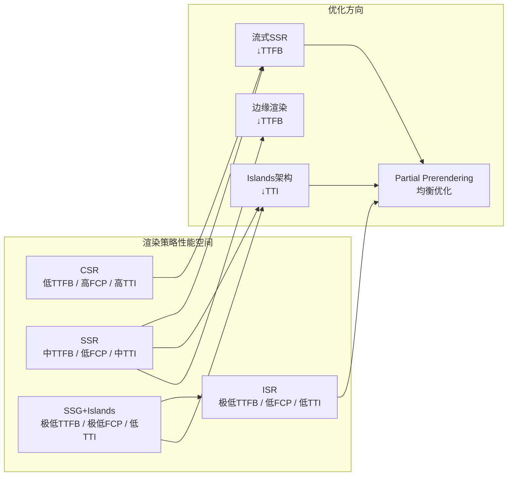
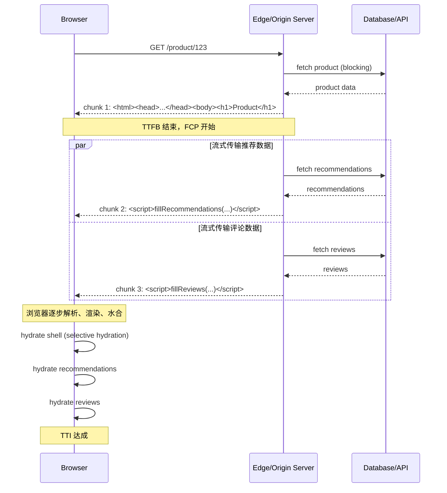
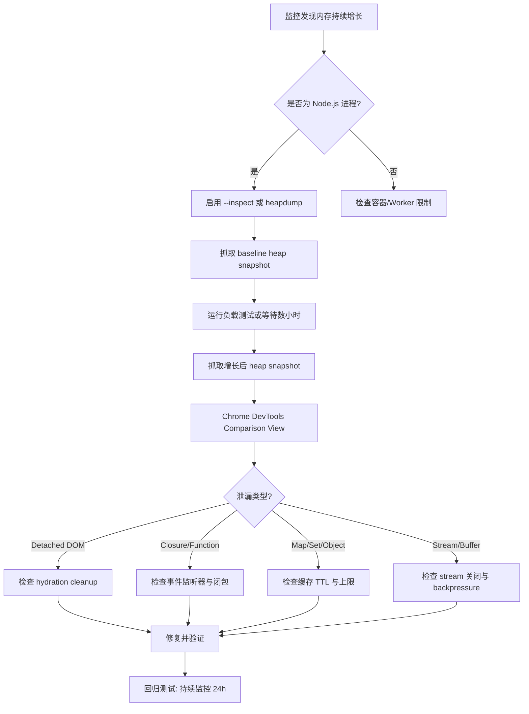

# SSR性能：从首字节到可交互

## 引言

服务端渲染（Server-Side Rendering, SSR）自 React 16 普及以来，已成为现代 Web 应用交付策略的核心选项之一。然而，SSR 并非银弹：它在改善首屏内容到达时间（FCP）的同时，可能延长首次字节时间（TTFB），并因水合（Hydration）过程阻塞主线程而延迟可交互时间（TTI）。随着 React 18 引入并发特性与流式 SSR、Astro 提出 Islands 架构、以及边缘计算平台将渲染逻辑推至 CDN 边缘节点，SSR 的性能边界条件已被彻底重构。

本文从性能模型的理论严格表述出发，系统分析 TTFB/FCP/TTI 的 trade-off 空间、流式渲染的时序理论、部分水合的复杂度边界，以及边缘渲染的延迟模型；在工程实践映射层面，深入剖析 Next.js、Nuxt、Astro、Remix 与 React Server Components 的优化策略，并提供 Node.js SSR 内存泄漏的系统性排查方法。

---

## 理论严格表述

### SSR 的性能模型：TTFB vs FCP vs TTI 的 Trade-off

在 SSR 架构中，用户感知的性能由三个关键里程碑刻画：

1. **TTFB（Time to First Byte）**：从浏览器发起导航请求到接收到服务端响应第一个字节的时间。SSR 场景中，TTFB 包含：DNS 解析 → TCP/TLS 握手 → 服务端路由匹配 → 数据获取 → 组件渲染 → 字节流发送。与纯 CSR（Client-Side Rendering）返回空白 HTML 骨架相比，SSR 的 TTFB 通常更长，因为服务端必须完成数据获取与渲染才能发出首个字节。
2. **FCP（First Contentful Paint）**：浏览器首次渲染任何文本、图像或非白色 canvas 的时间。SSR 的核心价值在于将 FCP 提前：服务端直接返回带有完整 DOM 结构的 HTML，浏览器无需等待 JavaScript 下载、解析与执行即可开始布局与绘制。
3. **TTI（Time to Interactive）**：页面变为完全可交互状态所需的时间。SSR 页面在初始 HTML 到达后，仍需下载并执行 hydration bundle，将静态 DOM 与客户端 JavaScript 状态绑定。若 hydration 脚本体积过大或执行阻塞主线程，TTI 可能显著滞后于 FCP，形成“可看空不可交互”的体验断层。

形式化地，设 `T_total` 为用户从导航到可交互的总感知时间，则：

```
T_total(CSR) = T_network(HTML_shell) + T_parse(JS_bundle) + T_exec(JS_bundle) + T_hydrate
T_total(SSR) = TTFB_ssr + T_render(HTML) + T_download(JS_bundle) + T_hydrate
```

其中 `TTFB_ssr > T_network(HTML_shell)`（SSR 服务端处理开销），但 `T_render(HTML)` 在 SSR 中由服务端预完成，浏览器仅需解析 HTML，因此 FCP 通常提前。TTI 则取决于 hydration 的复杂度与脚本体积。SSR 的优化本质是在 `{TTFB, FCP, TTI}` 三维空间中寻求帕累托最优。

### 流式渲染（Streaming SSR）的时序理论

传统 SSR 采用“全有或全无”（All-or-Nothing）模式：服务端等待整棵组件树渲染完毕后，一次性将完整 HTML 发送给客户端。设组件树深度为 `d`，节点数为 `n`，数据获取延迟为 `L_data`，则总响应延迟为：

```
T_response = L_data + Σ(T_render(node_i)) + T_flush
```

React 18 引入的流式 SSR 允许服务端在渲染过程中增量发送 HTML 片段。其理论模型基于**异步可中断渲染**（Interruptible Rendering）与**边界优先级**（Priority Boundary）：

- **Suspense 边界作为流控单元**：当组件树中存在 `<Suspense>` 边界时，服务端可先渲染并发送边界外的同步内容，将边界内的异步内容以 `fallback` 占位。待异步数据就绪后，通过 inline `<script>` 注入 HTML 片段，客户端 `ReactDOMClient.hydrateRoot` 渐进完成 hydration。
- **流式传输的时序压缩**：设存在 `k` 个独立 Suspense 边界，各边界数据延迟为 `L_1, L_2, ..., L_k`，则流式 SSR 的首字节发送时间退化为：

```
T_first_chunk = T_routing + T_render(synchronous_shell)
```

后续各 chunk 在对应数据就绪后独立流式发送，客户端可在首 chunk 到达后即开始解析与渲染，FCP 被压缩至接近传统 SSG 水平。

- **选择性水合（Selective Hydration）**：React 18 的并发水合机制允许浏览器根据用户交互优先级（如点击事件）优先水合相关组件，而非按 DOM 顺序线性水合。这引入了**交互驱动的水合调度模型**，将 TTI 从“全树水合完成”重新定义为“关键路径水合完成”。

### 部分水合（Partial Hydration / Islands）的复杂度分析

Astro 提出的 Islands 架构（又称 Partial Hydration / 部分水合）将页面划分为静态区域（Static Islands）与交互区域（Interactive Islands）。形式化地，设页面组件集合为 `C = {c_1, c_2, ..., c_n}`，每个组件 `c_i` 具有交互权重 `w_i ∈ {0, 1}`（0 为纯静态，1 需客户端交互）。传统 SSR 的水合复杂度为 `O(|C|)`——所有组件均需 hydration。Islands 架构将复杂度降至：

```
T_hydrate(islands) = Σ(w_i × T_hydrate(c_i)) + T_island_loader
```

其中 `T_island_loader` 为岛屿加载器的运行时开销（如 IntersectionObserver 触发延迟加载）。当页面静态比例 `ρ = |{c_i | w_i = 0}| / |C|` 趋近于 1 时，水合开销趋近于零，TTI 趋近于 FCP。

然而，Islands 架构引入了新的复杂度维度：

- **岛屿间通信成本**：若岛屿间存在状态共享（如全局 store），需通过 `customEvent` 或轻量级 pub/sub 机制通信，避免引入完整框架运行时。
- **水合触发策略的选择**：`client:load`（立即水合）、`client:idle`（requestIdleCallback）、`client:visible`（IntersectionObserver）、`client:media`（matchMedia）。策略选择直接影响 TTI 与交互延迟的 trade-off。
- **打包碎片化**：每个岛屿可能引入独立的 JavaScript chunk，导致请求数量增加。需通过自动 chunk 合并或预加载策略缓解。

### SSR vs CSR vs SSG 的性能边界条件

三种渲染策略的性能特征可用二维平面上的决策边界刻画：

| 维度 | CSR | SSR | SSG |
|------|-----|-----|-----|
| TTFB | 低（空 HTML） | 中-高（服务端处理） | 极低（CDN 边缘缓存） |
| FCP | 高（JS 执行后） | 低（HTML 直出） | 极低（预构建） |
| TTI | 高（全量水合） | 中（部分/流式水合） | 低-中（ Islands / 静态） |
| 数据新鲜度 | 实时（客户端获取） | 实时（每次请求） | 静态（构建时确定） |
| 服务端成本 | 极低（静态托管） | 高（每次请求计算） | 极低（CDN 分发） |

**边界条件**：

- 当页面数据更新频率 `λ > λ_threshold`（如电商库存、社交动态），SSG 的重新构建成本超过 SSR 的服务端计算成本，应优先 SSR。
- 当用户交互密度 `δ > δ_threshold`（如富文本编辑器、复杂仪表盘），CSR 的水合后性能优于 SSR 的重复服务端渲染。
- 当首屏性能权重 `α_TTFB + α_FCP >> α_TTI`（如内容型站点、营销页），SSG + Islands 为帕累托最优。
- 当个性化需求 `σ` 高（如 A/B 测试、用户地理位置定制），SSG 的静态假设被打破，SSR 或 ISR（Incremental Static Regeneration）为必要选择。

### 边缘渲染（Edge SSR）的延迟模型

边缘渲染将 SSR 逻辑从中心源站（Origin Server）迁移至 CDN 边缘节点（Edge Node）。设用户地理坐标为 `u`，源站坐标为 `o`，边缘节点坐标为 `e`，则：

```
T_network(origin) = RTT(u, o) + T_processing(origin)
T_network(edge)   = RTT(u, e) + T_processing(edge)
```

由于 `RTT(u, e) << RTT(u, o)`（边缘节点通常位于用户所在城市或 ISP 层级），边缘渲染可将 TTFB 降低 50-300ms。然而，边缘节点的计算资源受限（Vercel Edge Functions: 128MB-1024MB；Cloudflare Workers: 128MB 堆内存限制），渲染复杂度受限于：

- **冷启动延迟（Cold Start）**：边缘函数的容器启动时间 `T_cold` 通常在 0-50ms（Vercel Edge）或 0-5ms（Cloudflare Workers，基于 V8 Isolates）。与中心 Node.js 服务器的长连接相比，边缘函数无连接复用，但冷启动极低。
- **CPU 时间限制**：Cloudflare Workers 免费版限制 10ms/50ms CPU 时间，付费版 30s/50ms；Vercel Edge Functions 限制 30s 执行时间。复杂渲染（如大型 Markdown 转 HTML、复杂 GraphQL 查询）可能触发超时。
- **网络受限**：边缘节点到源数据库/ CMS 的网络路径可能跨越区域，若数据获取延迟 `L_data(edge→db)` 过大，边缘渲染的 RTT 优势被抵消。此时需配合**边缘缓存**（Edge Cache）或**stale-while-revalidate**策略。

---

## 工程实践映射

### Next.js 的 SSR 性能优化

Next.js 作为 React SSR 生态的标杆框架，其性能优化覆盖数据层、渲染层与传输层。

#### `getServerSideProps` 缓存策略

`getServerSideProps` 默认无缓存，每次请求均在服务端执行。在 Pages Router 中，可通过设置 `Cache-Control` 响应头实现微缓存（Micro-caching）：

```javascript
// pages/product/[id].js
export async function getServerSideProps({ params, res }) {
  const product = await fetchProduct(params.id);

  // 启用 CDN/浏览器缓存，平衡新鲜度与性能
  res.setHeader(
    'Cache-Control',
    'public, s-maxage=10, stale-while-revalidate=59'
  );

  return { props: { product } };
}
```

上述配置表示：CDN 缓存 10 秒（`s-maxage=10`），在 59 秒内允许返回陈旧内容并在后台重新验证（`stale-while-revalidate=59`）。此策略将高频请求的 SSR TTFB 降至接近 SSG 水平。

#### React 18 Streaming 与 Suspense 边界

在 App Router 中，Next.js 原生支持 React 18 的流式 SSR。Suspense 边界的合理划分是性能优化的核心：

```jsx
// app/page.js
import { Suspense } from 'react';
import { ProductDetails } from './ProductDetails';
import { RelatedProducts } from './RelatedProducts';

export default function ProductPage() {
  return (
    <article>
      {/* 同步渲染：首字节后立即发送 */}
      <h1>Product Catalog</h1>

      {/* 异步边界：非阻塞流式传输 */}
      <Suspense fallback={<ProductSkeleton />}>
        <ProductDetails />
      </Suspense>

      {/* 低优先级边界：可延迟水合 */}
      <Suspense fallback={<RelatedSkeleton />}>
        <RelatedProducts />
      </Suspense>
    </article>
  );
}
```

关键实践：

- **将非关键 UI 包裹于 `Suspense`**：评论、推荐、第三方嵌入（如地图、广告）应置于 Suspense 边界内，避免阻塞主内容流。
- **使用 `loading.js` 约定**：Next.js App Router 自动将 `loading.js` 作为 Suspense fallback，无需显式包裹。
- **Streaming HTML 的渐进式样式注入**：配合 `style-loader` 或 `styled-jsx` 的流式支持，避免 FOUC（Flash of Unstyled Content）。

#### 服务端组件（Server Components）的传输优化

React Server Components（RSC）在 Next.js App Router 中默认启用。RSC 的渲染结果以 React Server Payload（RSP）形式传输——一种轻量级的类 JSON 流格式，描述组件树结构而非完整 HTML。其传输优化要点：

- **零客户端 Bundle 成本**：RSC 仅执行于服务端，其依赖（如 Markdown 解析器、ORM、日期格式化库）不打包至客户端，显著降低 `js bundle` 体积。
- **自动代码分割**：RSC 可动态导入客户端组件（`"use client"`），Next.js 自动在 Suspense 边界处分割 chunk。
- **流式传输的嵌套性**：RSC 可嵌套在 Suspense 边界内，服务端持续流式发送更新，客户端逐步渲染，无需等待整棵树就绪。

### Nuxt 的 SSR 优化

Nuxt（Vue 生态的 SSR 框架）提供了不同于 React 的优化范式，强调自动化与约定优于配置。

#### Payload Extraction（载荷提取）

Nuxt 2/3 默认在 SSR 后将服务端状态（`asyncData`、`fetch` 结果）序列化为 `window.__NUXT__` 对象，嵌入 HTML 底部。客户端 hydration 时直接复用该状态，避免重复的 API 请求：

```html
<!-- SSR 输出 -->
<script>window.__NUXT__={data:[{products:[...]}],state:{...}}</script>
```

优化实践：

- **状态去重**：确保 `asyncData` 与客户端 store 初始化逻辑不重复触发网络请求。
- **Payload 压缩**：对于大型状态树，启用 `nuxt-compress` 或 CDN 的 Brotli 压缩，减少 HTML 体积。
- **按需提取**：Nuxt 3 的 `useFetch` 与 `useAsyncData` 组合式 API 自动处理服务端→客户端的状态传递，无需手动序列化。

#### Hybrid Rendering（混合渲染）

Nuxt 3 引入的 Hybrid Rendering 允许在同一项目中混合使用 SSR、SSG、CSR 与 ISR：

```javascript
// nuxt.config.ts
export default defineNuxtConfig({
  routeRules: {
    // 静态生成，CDN 缓存
    '/': { prerender: true },
    // SSR，微缓存
    '/products/**': { isr: 60, cache: { maxAge: 60 } },
    // 客户端渲染（纯 SPA）
    '/admin/**': { ssr: false },
    // 重定向至外部 API
    '/api/**': { proxy: 'https://api.example.com/**' }
  }
});
```

`routeRules` 在 Nitro 服务端引擎层面生效，支持基于路由的渲染策略选择。`/products/**` 的 `isr: 60` 表示首次请求 SSR 渲染，随后 CDN 缓存 60 秒，兼顾动态内容与性能。

#### Nitro 的预渲染与边缘部署

Nuxt 3 的 Nitro 服务端引擎支持多种预设（presets），包括 `node-server`、`vercel-edge`、`cloudflare-pages`、`netlify-edge`：

```bash
# 构建为 Cloudflare Pages 边缘函数
NITRO_PRESET=cloudflare-pages npx nuxt build
```

Nitro 自动将服务端代码编译为符合目标平台要求的格式（如 Cloudflare Workers 的 Service Worker 格式），并提供统一的缓存 API（`cachedEventHandler`）：

```javascript
// server/api/products.get.ts
export default cachedEventHandler(async (event) => {
  return await $fetch('https://api.example.com/products');
}, {
  maxAge: 60 * 60, // 1 小时服务端缓存
  getKey: (event) => event.node.req.url
});
```

### Astro 的 Islands 架构性能收益

Astro 的核心理念是“默认零 JavaScript”——页面初始不加载任何客户端 JavaScript，仅当组件显式标记为交互式时才进行水合。

#### Islands 指令与水合策略

```astro
---
// 纯静态组件：零 JS 输出
import StaticHeader from '../components/StaticHeader.astro';
// 交互组件：按需水合
import InteractiveCarousel from '../components/InteractiveCarousel.jsx';
---

<StaticHeader title="Blog Post" />

<!-- 立即水合：首屏关键交互 -->
<InteractiveCarousel client:load />

<!-- 延迟水合：用户滚动至视口时 -->
<InteractiveComments client:visible />

<!-- 空闲时水合：非关键增强 -->
<LiveChat client:idle />

<!-- 媒体查询匹配时水合：移动端/桌面端差异化 -->
<MobileMenu client:media="(max-width: 768px)" />
```

性能收益量化：

- **JS 体积削减**：Astro 官方博客案例显示，从 Gatsby（React 全水合）迁移至 Astro（Islands）后，客户端 JS 从 200KB+ 降至 < 10KB。
- **TTI 压缩**：由于仅水合必要组件，主线程阻塞时间显著降低，Lighthouse TTI 指标提升 30-50%。
- **内存占用降低**： hydration 的 DOM 绑定与事件监听器数量与 Islands 数量成正比，而非整页 DOM 节点数。

#### 视图过渡（View Transitions）与性能

Astro 2.x/3.x 引入的 `<ViewTransitions />` 组件利用浏览器原生的 View Transitions API，在 SPA 导航时实现平滑过渡：

```astro
---
import { ViewTransitions } from 'astro:transitions';
---
<head>
  <ViewTransitions />
</head>
```

与传统客户端路由相比，View Transitions 通过浏览器层面的快照与动画机制减少了自定义动画代码，同时保持 Astro 的 Islands 水合优势——每次导航后仅需对新页面中的 Islands 执行水合。

### Remix 的 defer 与 Streaming

Remix 作为全栈 Web 框架，其 SSR 模型强调 Web 标准（Web Standards）与渐进增强。

#### `defer` 的流式数据加载

Remix 的 loader 函数可返回 `defer()` 响应，将关键数据与非关键数据分离：

```javascript
// app/routes/product.$id.tsx
import { defer } from '@remix-run/node';
import { Await, useLoaderData } from '@remix-run/react';
import { Suspense } from 'react';

export async function loader({ params }) {
  const product = await getProduct(params.id); // 阻塞：关键数据
  const reviews = getReviews(params.id);        // 非阻塞：Promise

  return defer({ product, reviews });
}

export default function ProductPage() {
  const { product, reviews } = useLoaderData<typeof loader>();

  return (
    <div>
      <h1>{product.name}</h1>
      <Suspense fallback={<ReviewsSkeleton />}>
        <Await resolve={reviews}>
          {(reviews) => <ReviewsList reviews={reviews} />}
        </Await>
      </Suspense>
    </div>
  );
}
```

Remix 的 `defer` 机制底层利用 Web Streams API：服务端将 HTML 与内联 `<script>` 标签交错发送，`__remixContext` 逐步填充 deferred Promise 结果。客户端 React 在接收到新数据后触发局部 re-render，无需完整页面刷新。

#### 嵌套路由的并行数据获取

Remix 的嵌套路由（Nested Routes）允许并行加载多个 layout 与 page 的 loader 数据：

```
routes/
├── __layout.tsx      # layout loader
├── products.tsx      # products layout loader
└── products.$id.tsx  # product detail loader
```

当访问 `/products/123` 时，三个 loader 并行执行（前提是相互独立），服务端将合并结果并流式发送。相比传统串行数据获取（父组件 await → 子组件 await），嵌套并行加载将总数据延迟从 `Σ(L_i)` 压缩至 `max(L_i)`。

### React Server Components 的传输优化

RSC 作为 React 18+ 的架构级特性，其传输机制不同于传统 SSR：

- **RSP（React Server Payload）格式**：服务端渲染结果以自定义流格式传输，包含客户端组件引用（`{"_jsx":"ClientComponent","props":{...}}`）、服务端组件内联 HTML、以及指令（如 `{"_import":"./chunk.js"}`）。
- **自动代码分割与按需传输**：RSC 树中引用的客户端组件仅在需要时发送其 chunk URL，浏览器按需下载，避免一次性加载全量 bundle。
- **服务端状态直接序列化**：复杂对象（如 Date、Map、Set、类实例）可在服务端组件中直接传递至客户端组件，无需手动 JSON 序列化（避免了 `undefined` 丢失、`Date` 转字符串等问题）。

Next.js App Router 中，RSC 的传输优化可通过以下配置增强：

```javascript
// next.config.js
module.exports = {
  experimental: {
    // 启用部分预渲染（Partial Prerendering）
    ppr: true,
    // 优化 RSC payload 流式传输
    serverActions: true,
  },
};
```

Partial Prerendering（PPR）将静态 shell 在构建时预渲染，动态内容通过 Suspense + RSC 在请求时流式注入，实现 SSG 的 TTFB 与 SSR 的动态性兼得。

### 边缘函数渲染的性能对比

主流边缘平台的 SSR 性能特征对比：

| 平台 | 运行时 | 冷启动 | CPU 限制 | 内存限制 | 地理分布 | 适用场景 |
|------|--------|--------|----------|----------|----------|----------|
| Vercel Edge | V8 Isolates | ~0-5ms | 无硬性限制 | 128MB-1024MB | 100+ 边缘节点 | Next.js App Router, ISR |
| Cloudflare Workers | V8 Isolates | ~0-1ms | 10ms-50ms/请求 | 128MB | 300+ 城市 | 轻量 SSR, API 聚合 |
| Netlify Edge | Deno (Deploy) | ~10-50ms | 无硬性限制 | 1024MB | 100+ 边缘节点 | Nuxt, Astro, Remix |
| AWS Lambda@Edge | Node.js 20 | ~50-200ms | 30s 执行时间 | 128MB-10GB | CloudFront 边缘 | 复杂计算, 视频处理 |

**选型建议**：

- 对于 React/Vue 框架的 SSR，优先选择 V8 Isolate 类平台（Vercel Edge、Cloudflare Workers），冷启动极低且与浏览器 JS 运行时兼容。
- 对于需要 Node.js 原生模块（如 `fs`、`crypto` 的特定算法）的 SSR，选择 Netlify Edge（Deno 兼容层）或传统 Lambda。
- 对于计算密集型 SSR（如实时 Markdown→HTML 转换、复杂图表渲染），AWS Lambda@Edge 的 CPU 与内存弹性更优，但需接受更高的冷启动。

### SSR 的内存泄漏排查：Node.js Heap Dump 分析

长期运行的 SSR 服务端进程（如自定义 Node.js 服务器、Docker 容器）易发生内存泄漏，表现为 RSS/Heap 持续增长直至 OOM。

#### 常见 SSR 内存泄漏根因

1. **全局事件监听器未释放**：

   ```javascript
   // 泄漏模式：每次请求添加监听器，从未移除
   server.get('*', (req, res) => {
     process.on('uncaughtException', handler); // ❌ 每请求+1 监听器
   });
   ```

2. **闭包引用导致大对象无法 GC**：

   ```javascript
   // 泄漏模式：模块级缓存持有请求级大对象
   const cache = new Map();
   server.get('*', (req, res) => {
     cache.set(req.url, req.body); // ❌ 若未设置 TTL，Map 无限增长
   });
   ```

3. **React hydration 错误导致的 DOM/组件树泄漏**：在部分水合失败时，React 可能保留对未挂载组件的引用（尤其在 React 17 及以下版本中）。

4. **Stream 未正确关闭**：Node.js Readable/Transform Stream 在客户端断开连接时若未处理 `close` 事件，可能导致底层 Buffer 累积。

#### Node.js Heap Dump 分析实战

**生成 Heap Dump**：

```javascript
// server.js —— 通过 SIGUSR2 触发 heap dump
const heapdump = require('heapdump');

process.on('SIGUSR2', () => {
  const filename = `./heap-${Date.now()}.heapsnapshot`;
  heapdump.writeSnapshot(filename, (err) => {
    if (err) console.error(err);
    else console.log('Heap snapshot written to', filename);
  });
});
```

或通过 Chrome DevTools 的 `Memory` 面板连接到 Node.js 调试端口（`--inspect`）远程抓取。

**Chrome DevTools 分析步骤**：

1. **Comparison View**：分别在服务启动后、运行一段时间后抓取两个 heap snapshot，选择 "Comparison" 视图，筛选 "# New" 列，定位增长类。
2. **Retainers 链**：对于可疑对象（如大量 `(closure)`、`(array)`、`Detached HTMLDivElement`），展开 Retainers 链，追溯至根引用。
3. **常见泄漏模式识别**：
   - `Detached *Element`：DOM 节点被 JS 引用但已从文档树移除（常见于 hydration 失败后未清理）。
   - `(closure)` → `EventEmitter` → `ServerResponse`：响应对象被闭包捕获，导致关联的 Buffer/Stream 无法释放。
   - `Map` / `Set` / `Object` 持续增长：检查是否有未设上限的缓存。

**Nuxt/Next.js 特定排查**：

- Nuxt 2：检查 `asyncData`/`fetch` 中是否使用全局 `axios` 实例并添加拦截器；检查 Vuex store 的模块动态注册是否未注销。
- Next.js：检查 `getServerSideProps` 中是否使用 `new ApolloClient`（每次请求应创建新实例，或确保无全局缓存泄漏）；检查 `_app.js` 中的全局样式/脚本注入。

---

## Mermaid 图表

### 图表1：SSR/CSR/SSG 性能维度对比



### 图表2：流式 SSR 时序与 Suspense 边界



### 图表3：SSR 内存泄漏排查流程



---

## 理论要点总结

1. **三维性能空间的帕累托权衡**：SSR 优化的本质是在 TTFB（服务端处理）、FCP（首屏内容）、TTI（可交互性）之间寻找最优平衡点。流式 SSR 通过时序压缩降低 TTFB，Islands 架构通过部分水合降低 TTI，边缘渲染通过地理 proximity 降低网络延迟。

2. **流式渲染的异步边界理论**：Suspense 作为流控单元，将传统 All-or-Nothing SSR 转化为增量式、可中断的渲染流。选择性水合进一步将 TTI 从全树水合转化为交互驱动的优先级调度。

3. **部分水合的复杂度降维**：Islands 架构将 hydration 复杂度从 `O(|C|)` 降至 `O(Σw_i)`，但引入岛屿间通信、水合触发策略与打包碎片化等新维度。当静态比例 `ρ → 1` 时，收益趋近于零客户端 JS。

4. **边缘渲染的延迟-资源权衡**：边缘节点的 RTT 优势受限于 CPU 时间、内存与网络受限。边缘渲染的最佳适用场景是计算简单、数据可通过边缘缓存或 stale-while-revalidate 获取的内容。

5. **内存泄漏的工程化防控**：SSR 服务端长期运行的特性使其对内存泄漏高度敏感。通过 heap snapshot 对比、retainers 链分析与常见模式识别（Detached DOM、未释放监听器、无界缓存），可系统性定位并修复泄漏根因。

---

## 参考资源

1. **Next.js Performance Documentation**. Vercel. [https://nextjs.org/docs/app/building-your-application/optimizing](https://nextjs.org/docs/app/building-your-application/optimizing) —— 官方对图像优化、脚本加载、流式 SSR 与元数据优化的完整指南。

2. **React 18 Streaming SSR RFC**. React Working Group. [https://github.com/reactwg/react-18/discussions/37](https://github.com/reactwg/react-18/discussions/37) —— React 18 流式 SSR 的技术规范，涵盖 Suspense、选择性水合与流控协议。

3. **Astro Islands Documentation**. Astro. [https://docs.astro.build/en/concepts/islands/](https://docs.astro.build/en/concepts/islands/) —— Astro Islands 架构的设计哲学、水合指令与性能优化实践。

4. **Remix Documentation: Streaming**. Remix. [https://remix.run/docs/en/main/guides/streaming](https://remix.run/docs/en/main/guides/streaming) —— Remix 的 `defer` API、嵌套路由并行加载与 Web Streams 集成指南。

5. **Node.js Memory Diagnostics Guide**. Node.js Official Docs. [https://nodejs.org/en/docs/guides/diagnostics/memory/](https://nodejs.org/en/docs/guides/diagnostics/memory/) —— Node.js 堆内存分析、heap snapshot、heap profiler 与内存泄漏排查的官方方法论。
