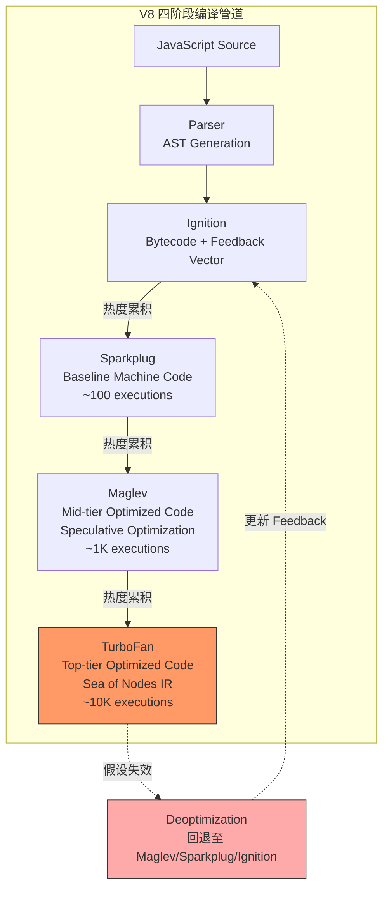
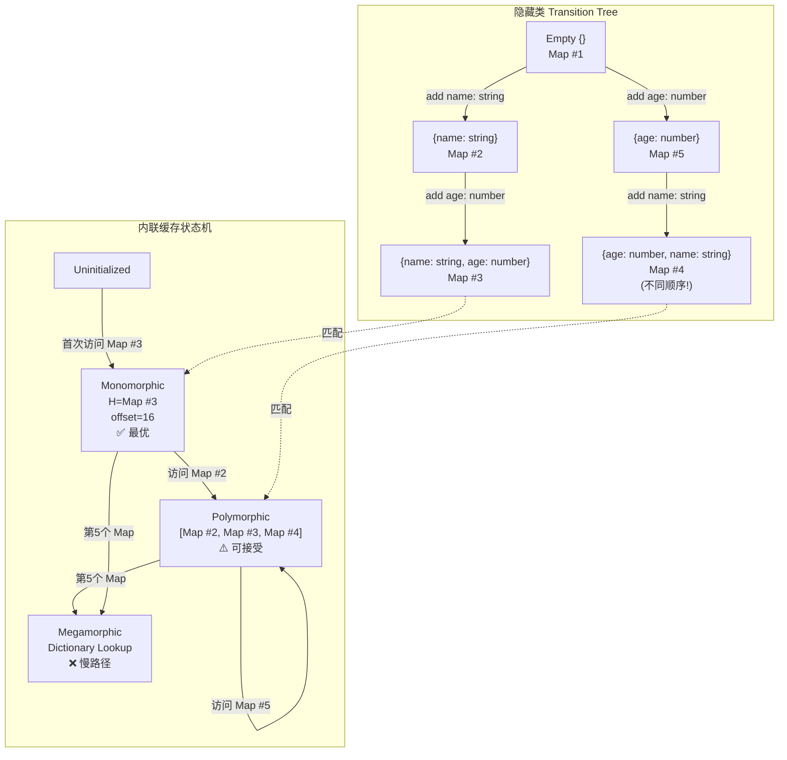
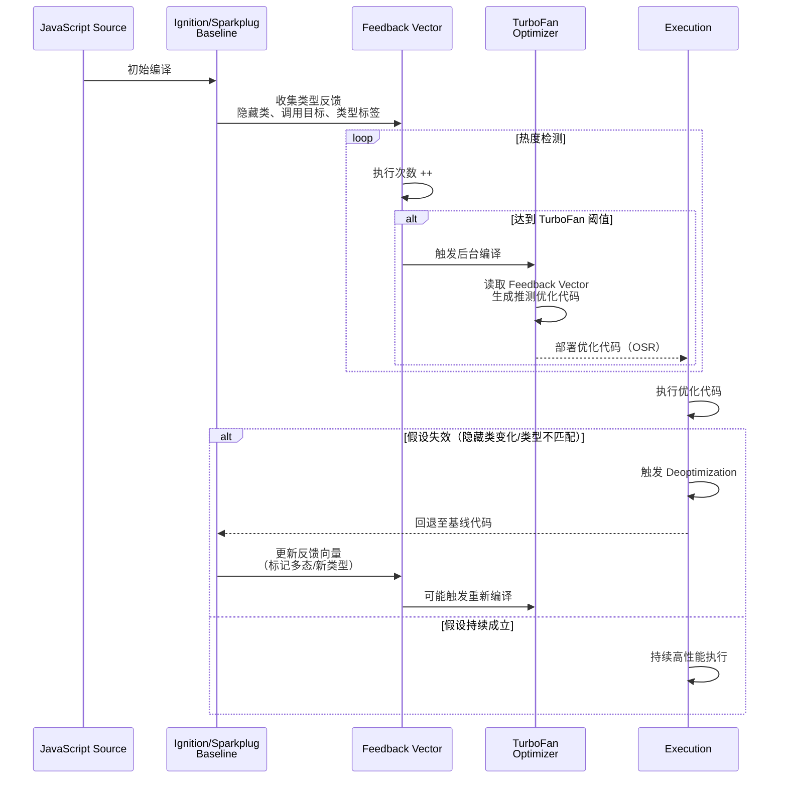

# JS引擎优化：从源码到机器码

## 引言

JavaScript 作为动态类型、解释执行的语言，其性能在过去十五年间经历了质的飞跃。这一跃迁的核心驱动力是即时编译（Just-In-Time Compilation, JIT）技术的成熟：现代 JS 引擎不再是简单的解释器，而是集成了多层级编译器、类型反馈系统与推测优化管道的复杂运行时。从 V8 的 TurboFan 到 JavaScriptCore 的 FTL，从 SpiderMonkey 的 IonMonkey 到新兴的 Maglev 中层编译器，JS 引擎已将源码执行路径优化至接近静态编译语言的效率。

然而，JIT 编译的增益并非免费午餐。引擎基于运行时的类型反馈做出优化假设，一旦假设被违背（如对象形状变化、类型多态化），昂贵的去优化（Deoptimization）将回退至基线代码，造成性能悬崖。本文从 JIT 编译的理论基础出发，形式化隐藏类、内联缓存与类型反馈模型；在工程实践映射层面，提供 V8、JSC、SpiderMonkey 的差异化优化策略，并剖析 micro-benchmark 与 macro-benchmark 的方法论陷阱。

---

## 理论严格表述

### JIT 编译的理论基础：基线编译器 vs 优化编译器

传统编译器（如 GCC、LLVM）采用 Ahead-of-Time（AOT）模式，在程序运行前完成全部编译。JS 引擎则采用 JIT 模式，在运行时根据执行频率与类型信息动态选择编译策略。现代 JS 引擎普遍采用**分层编译架构**（Tiered Compilation）：

1. **基线编译器（Baseline Compiler）**：快速生成未优化或 lightly-optimized 的机器码，追求启动速度与低内存占用。其编译产物为“能运行的代码”，而非“最优的代码”。
2. **优化编译器（Optimizing Compiler）**：对热点代码（Hot Code）执行深度优化，包括内联展开、循环不变量外提、逃逸分析、寄存器分配等。其编译产物高度依赖类型假设，需配备去优化回退机制。

形式化地，设代码段 `C` 的执行次数为 `N(C)`，基线编译器产出代码的执行时间为 `T_baseline(C)`，优化编译器产出代码的执行时间为 `T_opt(C)`（通常 `T_opt(C) << T_baseline(C)`），但优化编译的编译时间为 `T_compile_opt(C)`。分层编译的决策条件为：

```
N(C) × T_baseline(C) > T_compile_opt(C) + N(C) × T_opt(C)
```

即当执行次数足够大时，摊销编译成本后的优化代码收益为正。基线编译器的存在确保冷启动代码的执行延迟被控制在可接受范围内。

#### OSR（On-Stack Replacement）

OSR 是分层编译中的关键技术，允许引擎在循环执行过程中将正在运行的基线代码栈帧替换为优化代码栈帧。设循环 `L` 当前在基线代码中执行至迭代 `i`，引擎检测到 `L` 为热点后，在后台线程编译优化版本。当优化代码就绪时，通过 OSR 将执行状态（局部变量、循环计数器、栈指针）迁移至优化代码的入口点，后续迭代 `i+1, i+2, ...` 在优化代码中执行。

OSR 的关键约束是**状态等价性**：优化代码的抽象解释状态必须与基线代码的当前运行时状态一致。这限制了优化编译器对控制流的激进变换（如循环剥离、循环展开），因为状态映射必须可计算。

### V8 的管道：Parser → Ignition → Sparkplug → Maglev → TurboFan

V8（Chrome、Node.js、Edge 的 JS 引擎）经历了从 Full-Codegen + Crankshaft 到 Ignition + TurboFan，再到当前四阶段管道的演进。当前 V8 的编译管道如下：

#### 阶段1：解析（Parser）与字节码生成（Ignition）

源码首先通过预解析（PreParser）识别作用域与语法错误，然后由完整解析器生成抽象语法树（AST）。AST 经 Ignition（V8 的解释器）编译为字节码（Bytecode）。字节码是平台无关的中间表示，设计目标是紧凑性与快速生成。

Ignition 的执行特点：

- **寄存器机模型**：Ignition 字节码操作虚拟寄存器，而非栈机，减少 push/pop 开销。
- **类型反馈收集**：在执行字节码时，Ignition 通过内联缓存（Inline Caches, ICs）收集操作数类型信息，记录于反馈向量（Feedback Vector）中。

#### 阶段2：基线编译（Sparkplug）

Sparkplug 是 V8 于 2021 年引入的非优化基线编译器，将字节码直接翻译为机器码，编译速度极快（接近字节码生成速度）。Sparkplug 的代码质量优于 Ignition 解释执行，但劣于 Maglev/TurboFan。其定位是“快速获取可执行机器码”，在代码尚不热时提供比解释器更高的吞吐量。

Sparkplug 的编译策略：

- **单遍翻译**：每个字节码指令映射至固定模板机器码序列，无全局优化。
- **复用 Ignition 的反馈向量**：Sparkplug 机器码直接访问 Ignition 收集的类型反馈，但不做推测优化。

#### 阶段3：中层优化编译（Maglev）

Maglev 是 V8 于 2023 年引入的中层优化编译器，填补 Sparkplug 与 TurboFan 之间的空白。其设计目标是“比 Sparkplug 快得多，比 TurboFan 编译快得多”，适用于中等热度代码。

Maglev 的优化能力：

- **基于 SSA 的 IR**：使用静态单赋值形式的中间表示，支持常量传播、死代码消除、类型检查消除。
- **推测优化（Speculative Optimization）**：基于反馈向量的类型信息，假设操作数为特定类型（如 Smi —— 小整数），生成无类型检查的快速路径。
- **去优化支持**：Maglev 代码配备去优化点（Deoptimization Points），当类型假设失效时回退至 Sparkplug/Ignition。

#### 阶段4：顶层优化编译（TurboFan）

TurboFan 是 V8 的顶层优化编译器，对极热代码执行激进优化：

- **Sea of Nodes IR**：TurboFan 使用基于 Cliff Click 的 Sea of Nodes 中间表示，将控制流与数据流统一为图结构，便于全局优化（如全局值编号、循环优化）。
- **逃逸分析（Escape Analysis）与标量替换（Scalar Replacement）**：分析对象是否逃逸出函数/线程作用域，若未逃逸，将对象属性替换为局部变量，消除堆分配。
- **内联展开（Inlining）**：将小型函数体直接嵌入调用点，消除调用开销并为后续优化创造机会。
- **寄存器分配与指令选择**：TurboFan 后端将优化后的 IR 转换为目标架构（x64, ARM64, etc.）的机器码。

TurboFan 的编译成本高（比 Maglev 慢 10-100 倍），因此仅对执行次数极高的代码启用。V8 的层级触发阈值动态调整，通常：

- Ignition：立即执行
- Sparkplug：执行 ~100 次后触发
- Maglev：执行 ~1000 次后触发
- TurboFan：执行 ~10000 次后触发

### 隐藏类（Hidden Classes）与内联缓存（Inline Caching）的形式化

JS 对象在语义上是动态字典（`{key: value}`），但字典查找的 `O(n)` 或哈希 `O(1)` 常数开销对于属性访问过慢。V8 通过**隐藏类（Hidden Classes, 又称 Maps）**将动态对象结构静态化。

#### 隐藏类的形式化定义

设对象 `o` 的属性集合为 `P(o) = {p_1, p_2, ..., p_n}`，属性值类型为 `τ(p_i)`。隐藏类 `H` 是一个不可变描述符，定义对象的形状（Shape）：

```
H = ⟨OffsetMap, TransitionTree⟩
OffsetMap: PropertyName → ByteOffset
TransitionTree: (PropertyName, PropertyType) → H'
```

当对象新增属性 `p_new` 时，V8 不修改原隐藏类，而是通过 TransitionTree 查找或创建新隐藏类 `H'`，对象指针指向 `H'`。若多个对象按相同顺序添加相同属性，它们共享同一隐藏类链，实现形状的复用。

形式化地，两个对象 `o_1`, `o_2` 属于同一隐藏类 `H` 当且仅当：

1. 它们具有相同的属性名集合（不考虑原型链）。
2. 属性按相同顺序添加（因为 TransitionTree 是顺序敏感的）。
3. 属性值类型兼容（对仅含 `Smi`/`Double`/`HeapObject` 标签的隐藏类而言）。

#### 内联缓存（IC）的形式化

属性访问 `o.prop` 的 IC 可建模为状态机：

- **状态0（uninitialized）**：首次执行，记录访问类型与隐藏类，生成单态（monomorphic）存根代码。
- **状态1（monomorphic）**：假设所有后续 `o.prop` 访问的对象均具有相同隐藏类 `H`。存根代码为：

  ```
  if (o.map == H) return o[OffsetMap_H(prop)]
  else deoptimize / megamorphic fallback
  ```

- **状态2（polymorphic）**：当检测到少量（通常 ≤4）不同隐藏类时，IC 扩展为 polymorphic stub，顺序比较隐藏类并跳转。
- **状态3（megamorphic）**：当隐藏类数量超过阈值，IC 退化为通用字典查找（megamorphic），性能显著下降。

IC 的状态转移方程：

```
IC(o, prop) =
  Monomorphic(H, offset)   if ∀o_i ∈ history, map(o_i) = H
  Polymorphic([H_1,...,H_k], [offset_1,...,offset_k])  if |{map(o_i)}| = k ≤ K_poly
  Megamorphic(dictionary_lookup)  otherwise
```

### 类型反馈（Type Feedback）与推测优化

类型反馈是 JIT 优化的信息基础。V8 通过以下机制收集类型信息：

- **IC 反馈向量**：每个函数关联一个 Feedback Vector，记录各字节码位置的 IC 状态（隐藏类、类型标签、调用目标）。
- **类型分析（Type Profile）**：Ignition/Sparkplug 执行时记录操作数的动态类型分布（如 99% 为 Smi，1% 为 HeapNumber）。
- **调用频率分析**：记录函数调用点的高频目标函数，为内联展开提供决策依据。

推测优化编译器（Maglev/TurboFan）读取反馈向量，生成基于**乐观假设**的优化代码：

- **类型特化**：假设变量 `x` 始终为 Smi，则 `x + y` 可编译为无类型检查的整数加法（含溢出检查）。
- **边界检查消除**：若反馈显示数组访问索引始终在 `[0, length)` 内，可消除 bounds check。
- **空值检查消除**：若反馈显示对象引用永不为 null，可消除 null check。

推测优化的**正确性保证**依赖于去优化机制：优化代码中嵌入检查点（check points），当运行时状态违背假设时（如 `x` 实际为字符串），触发去优化，回退至基线代码并更新反馈向量。

### 去优化（Deoptimization）的触发条件

去优化是将优化代码栈帧回退至基线代码（或字节码）的过程。触发条件包括：

1. **隐藏类变化**：优化代码假设 `o.map == H`，但 `o` 被动态添加/删除属性，导致隐藏类变为 `H'`。
2. **类型反馈失效**：变量实际类型超出假设集合（如假设为 Smi，实际为 BigInt）。
3. **原型链修改**：`Object.prototype` 或对象原型被动态修改，影响属性查找语义。
4. **Eval / with 作用域污染**：`eval()` 或 `with` 语句引入不可分析的变量绑定，使静态作用域假设失效。
5. **栈溢出或资源限制**：优化代码的递归深度超出预期，触发保护性去优化。

去优化的成本模型：

```
T_deopt = T_state_reconstruction + T_code_switch + T_feedback_update
```

其中 `T_state_reconstruction` 是最主要开销——需将优化代码的寄存器/栈状态映射回基线代码的抽象状态。频繁的去优化（Deoptimization Storm）会导致性能剧烈抖动，比始终运行基线代码更差。

---

## 工程实践映射

### V8 性能优化实践

#### 对象形状稳定化（Shape Stability）

对象形状的稳定性直接决定 IC 的单态命中率：

```javascript
// ❌ 反模式：动态属性顺序与类型变化
function processUser(user) {
  const obj = {};
  if (user.name) obj.name = user.name;      // 属性1: string
  if (user.age) obj.age = user.age;          // 属性2: number
  if (user.admin) obj.admin = user.admin;    // 属性3: boolean (条件性)
  // 某些代码路径可能不添加 admin，导致隐藏类分叉
  return obj;
}

// ✅ 优化：构造函数初始化所有属性，保持顺序与类型一致
function createUser(name, age, admin = false) {
  return { name, age, admin };  // 单一隐藏类 H_user
}

// 对于可选属性，使用 null/undefined 占位而非省略
function createProduct(data) {
  return {
    name: data.name,
    price: data.price,
    description: data.description ?? null,  // 保持属性存在
    category: data.category ?? null
  };
}
```

关键实践：

- **构造函数模式**：在构造函数或工厂函数中一次性初始化所有属性，避免后续动态添加。
- **属性顺序一致性**：确保所有对象实例按相同顺序初始化属性。
- **类型一致性**：避免同一属性在数值（Smi/Double）与字符串/对象间切换。若需多态，考虑拆分属性（`priceNum` / `priceStr`）。

#### 单态（Monomorphic）vs 多态（Polymorphic）调用

函数调用与属性访问的 IC 状态直接影响执行效率：

```javascript
// ❌ 反模式：多态调用点
function getArea(shape) {
  return shape.area();  // Polymorphic: Circle, Square, Triangle...
}

// ✅ 优化：单态化调用（若类型已知）或缓存分发
class ShapeRenderer {
  renderCircle(c) { /* ... */ }
  renderSquare(s) { /* ... */ }

  render(shape) {
    // 若调用点仅见 Circle/Square 两种类型，IC 保持 Polymorphic（可接受）
    // 若超过 4 种，退化为 Megamorphic
    switch (shape.type) {
      case 'circle': return this.renderCircle(shape);
      case 'square': return this.renderSquare(shape);
      default: throw new Error('Unknown shape');
    }
  }
}

// 更激进的优化：直接类型分支（避免虚调用）
function getAreaFast(shape) {
  if (shape instanceof Circle) {
    return Math.PI * shape.radius ** 2;  // 单态属性访问
  }
  if (shape instanceof Square) {
    return shape.side ** 2;
  }
  return shape.area();  // 兜底：megamorphic fallback
}
```

V8 的 `--trace-ic` 标志可打印 IC 状态转换，用于诊断多态化：

```bash
node --trace-ic app.js
```

#### 避免 `arguments` 对象

`arguments` 对象是类数组但非真正数组，其元素访问为泛型查找，无法单态化：

```javascript
// ❌ 反模式：使用 arguments
function sum() {
  let total = 0;
  for (let i = 0; i < arguments.length; i++) {
    total += arguments[i];  // Megamorphic element access
  }
  return total;
}

// ✅ 优化：Rest 参数（真正数组，可优化遍历）
function sum(...numbers) {
  let total = 0;
  for (const n of numbers) {
    total += n;
  }
  return total;
}

// 更优：显式参数（完全单态）
function sum3(a, b, c) {
  return a + b + c;  // 无循环开销，直接寄存器操作
}
```

#### 避免 `with` 与 `eval`

`with` 与 `eval` 引入动态作用域，使引擎无法静态确定变量绑定：

```javascript
// ❌ 反模式：with 破坏作用域分析
with (obj) {
  console.log(x);  // x 可能来自 obj 或外层作用域？引擎无法知晓
}

// ❌ 反模式：eval 动态引入绑定
function risky(code) {
  eval(code);  // 任意变量可能被引入或修改
  return x;    // x 的存在性与来源不可分析
}

// ✅ 优化：直接属性访问与结构化代码
function safe(obj) {
  console.log(obj.x);
}
```

使用 `eval` 或 `new Function` 的代码将无法进入 TurboFan 优化管道，限制在 Sparkplug 甚至 Ignition 层级执行。

#### 数组优化：连续数组 vs 字典模式

V8 数组有两种内部表示：

- **Fast Elements（PACKED）**：连续索引、无空洞，IC 可优化为线性访问。
- **Dictionary Elements**：稀疏数组或含大量空洞（`delete` 操作后），退化为哈希表。

```javascript
// ❌ 反模式：创建稀疏数组
const arr = [];
arr[0] = 'a';
arr[10000] = 'b';  // 退化为 Dictionary Elements

// ❌ 反模式：delete 元素
const arr2 = ['a', 'b', 'c'];
delete arr2[1];  // 产生 hole，退化为 HOLEY_ELEMENTS

// ✅ 优化：预分配、连续写入
const arr3 = new Array(100);
for (let i = 0; i < 100; i++) {
  arr3[i] = i;  // 保持 PACKED_SMI_ELEMENTS
}

// ✅ 优化：避免数组类型多态化
const arr4 = [1, 2, 3];      // PACKED_SMI_ELEMENTS
arr4.push(4.5);              // 退化为 PACKED_DOUBLE_ELEMENTS（可接受）
arr4.push('text');           // 退化为 PACKED_ELEMENTS（泛型对象数组，较慢）
```

V8 的 `--allow-natives-syntax` 与 `%DebugPrint(arr)` 可查看数组内部类型（需 `--expose-gc` 编译的 Node.js）。

### JavaScriptCore（Safari）的 DFG/FTL 编译器差异

JavaScriptCore（JSC）是 WebKit/Safari 的 JS 引擎，其编译管道为：
**LLInt（解释器）→ Baseline JIT → DFG JIT → FTL JIT**

#### DFG（Data Flow Graph）JIT

DFG 是 JSC 的中层优化编译器，将字节码转换为 SSA 形式的 Data Flow Graph：

- **类型推断（Type Inference）**：基于抽象解释推断变量类型，消除冗余类型检查。
- **常量折叠、死代码消除、冗余消除**：标准编译器优化 pass。
- **OSR Enter/Exit**：支持从 Baseline JIT 进入 DFG 代码（OSR Enter），以及在去优化时回退（OSR Exit）。

DFG 的优化强度介于 V8 的 Maglev 与 Sparkplug 之间，是 JSC 处理中等热度代码的主力。

#### FTL（Faster Than Light）JIT

FTL 是 JSC 的顶层优化编译器，基于 LLVM 后端（后迁移至自研 B3 后端）：

- **B3 / LLVM IR**：将 JSC 的 DFG IR  lowering 至 LLVM/B3 IR，利用成熟的机器码生成能力。
- **激进优化**：包括循环向量化、自动向量化（SIMD）、全局寄存器分配。
- **长时间编译**：FTL 编译成本显著高于 DFG，仅对极热循环启用。

#### JSC 特有的优化机制

- **Polyvariant Inline Caching**：JSC 支持多版本（call-site 特定）IC，在不同调用上下文维护独立的类型反馈，减少上下文无关的多态化。
- **Concurrent JIT**：DFG/FTL 编译在独立线程执行，不阻塞主线程执行（V8 的 TurboFan 同样支持后台编译，但 Sparkplug/Maglev 为主线程编译）。

### SpiderMonkey（Firefox）的 IonMonkey / Warp

SpiderMonkey 是 Firefox 的 JS 引擎，经历了从 TraceMonkey（基于 tracing JIT）到 IonMonkey（基于 method-based JIT）的演进。

#### IonMonkey

IonMonkey 是 SpiderMonkey 的优化编译器，采用 SSA 形式的 MIR（Middle-level IR）：

- **Alias Analysis**：分析内存访问别名关系，优化 load/store。
- **Range Analysis**：推断数值变量的取值范围，消除冗余边界检查。
- **LICM（Loop Invariant Code Motion）**：将循环不变量外提至循环前。
- **GCM（Global Code Motion）**：全局指令调度，优化指令级并行。

IonMonkey 的去优化通过 **Bailouts** 实现——在优化代码中插入检查点，当假设失效时 bailout 至 Baseline Interpreter。

#### Warp（WarpBuilder）

Warp 是 Mozilla 于 2020 年代引入的新一代优化架构，替代了 IonMonkey 的前端：

- **CacheIR 抽象层**：将内联缓存逻辑抽象为 CacheIR（Cache Intermediate Representation），跨平台共享 IC 实现。
- **WarpBuilder**：基于 CacheIR 快照直接构建优化 IR，减少重复类型分析开销。
- **即时编译与缓存**：Warp 编译结果可缓存至磁盘（Firefox 重启后复用），减少重复编译。

SpiderMonkey 的独特设计：

- **Baseline Interpreter + Baseline JIT 双层基线**：SpiderMonkey 在解释器之上还有一层 Baseline JIT，比 V8 的 Sparkplug 更早介入，形成更平滑的性能梯度。
- **Lazy Bytecode Generation**：SpiderMonkey 延迟生成函数字节码直至首次调用，减少启动内存占用。

### WASM 与 JS 的性能边界

WebAssembly（WASM）作为二进制指令格式，其性能特征与 JS 形成互补：

| 维度 | JavaScript (V8 TurboFan) | WebAssembly |
|------|-------------------------|-------------|
| 启动延迟 | 中（需解析+编译） | 低（二进制解码极快） |
| 峰值性能 | 高（推测优化后） | 极高（接近原生 AOT） |
| 性能确定性 | 低（去优化风险） | 高（无去优化） |
| 内存管理 | GC（自动） | 手动（Linear Memory） |
| 类型安全 | 动态（运行时检查） | 静态（模块验证） |
| DOM 访问 | 原生支持 | 需 JS bridge |

**性能边界条件**：

- **计算密集型任务**（图像处理、视频编解码、物理模拟）：WASM 显著优于 JS，尤其是涉及紧密数值循环时。
- **频繁 DOM 操作**：JS 直接操作 DOM 无需 bridge 开销，WASM 需通过 `externref` 或 JS glue code 访问，可能抵消计算优势。
- **字符串处理**：JS 引擎对字符串操作高度优化（ ropes、cons strings、内置正则），WASM 的字符串处理需手动 UTF-8/UTF-16 转换，通常更慢。
- **GC 对象图遍历**：JS 的 GC 对对象图遍历高度优化，WASM 手动内存管理在复杂对象生命周期场景下开发成本高且易出错。

### Profile-guided Optimization（PGO）在 Node.js 中的应用

PGO 是利用运行时的 profile 数据指导编译器优化的技术。虽然 V8 本身基于运行时反馈（可视为 JIT-PGO），但 Node.js 的 AOT 编译（如使用 `pkg`、`nexe` 打包工具时）可结合 PGO：

- **V8 的 `--prof` 标志**：生成 V8 执行日志（`v8.log`），通过 `node --prof-process` 分析热点函数与 IC 状态。
- **TurboFan 的优化日志**：`--trace-turbo` 输出 TurboFan 优化决策与 IR 图，用于诊断未优化原因。
- **Node.js 的 `--print-opt-code` / `--print-bytecode`**：打印优化后的机器码与字节码，用于低层级性能分析。

实践流程：

```bash
# 1. 收集 profile 数据
node --prof app.js
# 生成 isolate-0x...-v8.log

# 2. 分析热点
node --prof-process isolate-*.log > profile.txt

# 3. 诊断特定函数
d8 --trace-ic --trace-opt --trace-deopt --print-bytecode app.js
```

### Benchmarking 的陷阱：Micro-benchmark vs Macro-benchmark

性能测试的效度直接决定优化决策的正确性。JS 引擎的分层编译与类型反馈使 micro-benchmark 的结果高度不可靠。

#### Micro-benchmark 陷阱

Micro-benchmark 测试单个操作的执行时间（如 `arr.push(x)`、`obj.prop` 访问）。其陷阱包括：

1. **热身偏差（Warm-up Bias）**：测试代码自身未达 TurboFan 优化层级，测得的是 Ignition/Sparkplug 性能，非生产环境稳态性能。
2. **死代码消除（DCE）**：若测试结果未被使用，TurboFan 可能消除整个计算，测得的是空操作。
3. **类型反馈不足**：微基准通常只运行单一类型路径，IC 保持单态，而生产环境多态化后性能显著不同。
4. **编译线程干扰**：V8 的后台编译线程可能在测试期间触发，导致测量噪音。

```javascript
// ❌ 错误 micro-benchmark
console.time('push');
for (let i = 0; i < 1e6; i++) {
  arr.push(i);  // 可能被 DCE，且未热身
}
console.timeEnd('push');

// ✅ 改进：使用 Benchmark.js 处理统计与热身
const suite = new Benchmark.Suite();
suite
  .add('Array#push', () => {
    const arr = [];
    for (let i = 0; i < 1000; i++) arr.push(i);
    return arr;  // 防止 DCE
  })
  .on('complete', function() {
    console.log(this[0].toString());  // 含均值、方差、样本数
  })
  .run({ async: true });
```

#### Macro-benchmark 与真实负载

Macro-benchmark 测试完整应用或页面在真实浏览器环境中的性能：

- **Lighthouse CI**：模拟真实用户网络与设备条件，测量 FCP、LCP、TTI、CLS 等以用户为中心的性能指标。
- **WebPageTest**：在真实设备与网络条件下运行，提供瀑布流、CPU 占用、主线程阻塞分析。
- **Chrome DevTools Performance Panel**：录制完整页面加载 trace，分析 V8 编译、GC、渲染管道的时序。

**方法论原则**：

- 优先使用 macro-benchmark 验证优化效果，micro-benchmark 仅用于假设生成。
- 测量时应禁用浏览器扩展、使用无痕模式、多次运行取中位数/百分位数。
- 关注 **RUM（Real User Monitoring）** 数据，实验室数据可能因网络/硬件条件差异而与真实用户体验偏离。

---

## Mermaid 图表

### 图表1：V8 编译管道与层级触发



### 图表2：隐藏类 Transition Tree 与内联缓存状态机



### 图表3：JIT 优化与去优化的决策循环



---

## 理论要点总结

1. **分层编译的摊销原理**：JIT 引擎通过 Ignition（解释）→ Sparkplug（基线机器码）→ Maglev（中层优化）→ TurboFan（顶层优化）的四级管道，在不同执行热度下平衡编译延迟与执行吞吐量。优化的经济性取决于 `N(C) × ΔT > T_compile` 的摊销条件。

2. **隐藏类将动态结构静态化**：V8 通过 TransitionTree 复用对象形状描述符，使动态 JS 对象的属性访问可映射为 IC 加持的偏移量访问。形状稳定性（属性顺序、类型、存在性一致）是单态 IC 的前提，也是属性访问性能的决定性因素。

3. **类型反馈驱动的推测优化**：JIT 编译器基于运行时的类型分布生成特化代码，消除类型检查、边界检查与空值检查。推测优化的正确性由去优化机制保证——假设失效时的回退成本虽高，但保证了语义等价性。

4. **引擎差异决定跨浏览器优化策略**：V8 的 Sea of Nodes、JSC 的 DFG/FTL、SpiderMonkey 的 IonMonkey/Warp 在 IR 设计、IC 策略与编译并发性上存在差异。性能关键代码应针对目标引擎（通常为 V8，因 Node.js 与 Chrome 的主导地位）优化，同时保持其他引擎的可接受性能。

5. **基准测试的方法论效度**：Micro-benchmark 易受热身偏差、死代码消除与类型反馈不足的影响，仅适用于假设生成；Macro-benchmark（Lighthouse、WebPageTest、RUM）反映真实用户体验，是优化效果的最终仲裁者。WASM 在数值计算密集型场景下优于 JS，但在 DOM 操作与字符串处理中未必。

---

## 参考资源

1. **V8 Blog: "Sparkplug — A non-optimizing JavaScript compiler"**. [https://v8.dev/blog/sparkplug](https://v8.dev/blog/sparkplug) —— V8 基线编译器 Sparkplug 的设计动机、编译速度与代码质量权衡。

2. **V8 Blog: "Maglev — V8's Fastest Optimizing Compiler"**. [https://v8.dev/blog/maglev](https://v8.dev/blog/maglev) —— V8 中层编译器 Maglev 的架构、基于 SSA 的 IR 与推测优化能力。

3. **Vyacheslav Egorov, "Understanding V8"**. [https://mrale.ph/blog/](https://mrale.ph/blog/) —— 前 V8 工程师的深度技术博客，涵盖隐藏类、IC、去优化与性能反模式的系列文章。

4. **Benedikt Meurer, "V8 Internals"**. [https://benediktmeurer.de/](https://benediktmeurer.de/) —— V8 团队技术主管关于 TurboFan、Ignition 与 WebAssembly 性能优化的演讲与文章合集。

5. **JavaScriptCore Documentation: "Intro to JIT"**. WebKit Wiki. [https://trac.webkit.org/wiki/JavaScriptCore](https://trac.webkit.org/wiki/JavaScriptCore) —— JSC 的 DFG、FTL 编译器架构与 CacheIR 抽象的官方技术文档。
