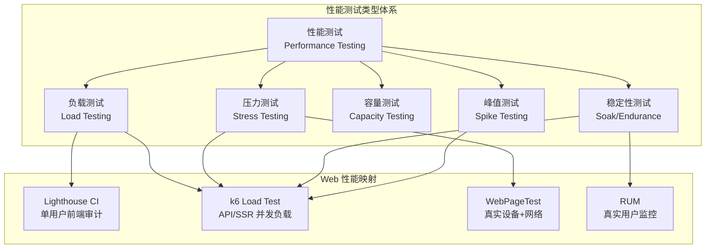
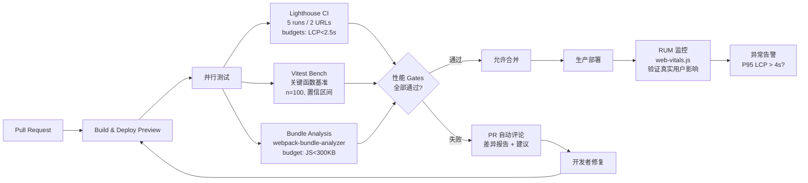

# 性能测试方法论：从基准到回归

## 引言

性能优化若无度量则无从谈起。然而，性能测试并非简单的“跑个脚本看耗时”——它涉及测试类型的选择、统计指标的可靠估计、回归检测的统计显著性判断，以及实验室数据与真实用户数据（RUM）的校准。一个常见的反模式是：开发者在本地运行三次 `console.time`，取最小值作为“优化后”的基线，却忽略了样本量不足、系统噪音与浏览器编译热身带来的偏差。

本文从性能测试的分类理论出发，形式化样本量、置信区间与假设检验在性能回归检测中的应用；在工程实践映射层面，系统覆盖 JavaScript 基准测试工具（Benchmark.js、tinybench、vitest bench）、Lighthouse CI 的自动化审计、WebPageTest API 集成、k6 的负载场景设计、Chrome Trace Event 分析，以及性能预算 gates 与 CI 集成的完整方案。

---

## 理论严格表述

### 性能测试的分类体系

性能测试（Performance Testing）是一个伞形概念，包含多个子类型，各自对应不同的风险模型与测试目标：

| 测试类型 | 目标 | 负载特征 | 持续时间 | 核心指标 |
|----------|------|----------|----------|----------|
| **负载测试（Load Testing）** | 验证系统在预期负载下的行为 | 目标并发用户数 | 30min - 数小时 | 吞吐量、响应时间、错误率 |
| **压力测试（Stress Testing）** | 识别系统的崩溃边界与恢复能力 | 超过预期负载，逐步增加至崩溃 | 至系统崩溃或降级 | 最大吞吐量、崩溃点、恢复时间 |
| **容量测试（Capacity Testing）** | 确定系统可承载的最大有效负载 | 递增负载，直至性能不可接受 | 中等 | 容量上限、资源瓶颈 |
| **稳定性测试（Soak/Endurance Testing）** | 检测长期运行下的资源泄漏与性能衰减 | 稳定目标负载 | 数小时至数天 | 内存增长、句柄泄漏、响应时间漂移 |
| **峰值测试（Spike Testing）** | 验证系统对突发流量峰值的响应 | 瞬间高并发，快速升降 | 短（分钟级） | 峰值响应时间、错误率、恢复速度 |

在 Web 前端性能工程中，上述分类通常映射为：

- **负载/压力测试**：后端 API 与 SSR 服务端（使用 k6、Artillery）。
- **稳定性测试**：Node.js SSR 服务端长期运行（监控 heap、event loop lag）。
- **峰值测试**：电商大促、票务开售等场景的预热验证。
- **前端性能审计**：Lighthouse、WebPageTest 测量首屏与交互指标（属于负载测试的“单用户”变体）。

### 性能指标的统计学处理

性能测量受系统噪音（OS 调度、GC、网络抖动、CPU 降频）影响，单一测量值几乎无意义。科学的性能分析依赖统计学方法。

#### 均值 vs 中位数 vs 百分位数

设样本集合为 `X = {x_1, x_2, ..., x_n}`：

- **算术均值（Mean）**：`μ = (Σx_i) / n`。对异常值敏感，若存在长尾延迟（如 GC pause），均值会高估典型体验。
- **中位数（Median）**：排序后位于 50% 位置的值。对异常值鲁棒，反映“典型用户”体验，但忽略分布形态。
- **百分位数（Percentiles）**：`P50`（中位数）、`P90`、`P95`、`P99`。`P95 = 200ms` 表示 95% 的请求延迟低于 200ms。百分位数是 SLI/SLO 定义的核心指标（如 Google SRE 实践要求 `P95 < 200ms`）。

对于前端性能指标（LCP、INP、CLS），Google 推荐使用 **P75** 作为代表值，因为 P75 平衡了对长尾的敏感性与稳定性。

#### 置信区间（Confidence Interval）

样本均值 `x̄` 是对总体均值 `μ` 的估计。置信区间给出该估计的不确定性范围：

```
CI = x̄ ± z × (s / √n)
```

其中 `s` 为样本标准差，`z` 为置信水平对应的分位数（95% CI 对应 `z ≈ 1.96`）。若两次优化的样本均值差异小于各自的置信区间半宽，则差异可能由随机噪音导致，而非真实的性能变化。

#### 样本量计算

为确保检测到有意义的性能差异，需预先计算最小样本量。设期望检测的最小差异为 `δ`（如 5ms），标准差为 `σ`，显著性水平 `α = 0.05`，统计功效 `1-β = 0.80`，则每组最小样本量：

```
n = 2 × σ² × (z_{α/2} + z_β)² / δ²
```

实践中，若 `σ = 10ms`，`δ = 5ms`，则 `n ≈ 2 × 100 × (1.96 + 0.84)² / 25 ≈ 63`。即每组至少需 63 次独立测量。

### 性能回归检测的统计方法

性能回归（Performance Regression）是指代码变更导致性能指标恶化。检测回归需区分“真实退化”与“随机波动”。

#### 双样本 t-test

假设两组样本（优化前、优化后）均来自正态分布，且方差齐性，可使用独立样本 t-test：

```
t = (x̄_1 - x̄_2) / (s_p × √(2/n))
```

其中 `s_p` 为合并标准差。若 `|t| > t_{critical}(α, df)`，则拒绝“无差异”原假设，判定存在显著回归。

**t-test 的假设与局限**：

- 要求样本近似正态分布。性能数据常呈右偏（长尾延迟），需对数变换或采用非参数检验。
- 对异常值敏感。单个极端值可能扭曲均值与标准差。

#### Mann-Whitney U Test（Wilcoxon Rank-Sum Test）

作为非参数替代，Mann-Whitney U test 不假设分布形态，比较两组的秩（rank）而非原始值：

1. 合并两组样本，按大小排序并赋予秩次。
2. 计算每组秩和 `R_1`、`R_2`。
3. 计算 U 统计量：`U = n_1n_2 + n_1(n_1+1)/2 - R_1`。
4. 若 U 小于临界值（或 p-value < α），则两组分布存在显著差异。

Mann-Whitney 对异常值鲁棒，适用于性能数据的非正态、重尾特征。现代性能测试工具（如 Chrome's Perf Dashboard、Mozilla's AreWeFastYet）普遍采用此类非参数检验。

#### 序列分析与控制图

对于持续集成场景，单点比较不足以检测渐进式退化。统计过程控制（SPC）中的 **EWMA（Exponentially Weighted Moving Average）控制图** 可用于监控指标序列：

```
EWMA_t = λ × x_t + (1-λ) × EWMA_{t-1}
```

其中 `λ ∈ (0,1]` 为衰减因子。当 `EWMA_t` 超出控制限（`±L × σ_EWMA`）时，触发回归警报。EWMA 对渐进漂移敏感，适用于检测“慢泄漏”式性能退化。

### A/B 测试在性能优化中的应用

A/B 测试将用户随机分配至对照组（A）与实验组（B），比较两组的真实性能指标。与实验室测试相比，A/B 测试的优势在于：

- **真实网络与设备条件**：覆盖实验室难以模拟的慢速 3G、低端设备等长尾场景。
- **业务指标关联**：可直接关联性能变化与转化率、跳出率等业务指标（如 Amazon 发现每 100ms 延迟降低 1% 转化率）。

**A/B 测试的统计学设计**：

- **随机化单元**：通常为用户 ID 或会话 ID，确保同一用户始终看到同一版本。
- **样本量与功效**：使用功率分析（Power Analysis）确定实验所需用户数，避免过早下结论（Peeking Problem）。
- **多重比较校正**：若同时测试多个指标（FCP、LCP、INP、转化率），需应用 Bonferroni 校正或 False Discovery Rate（FDR）控制，降低假阳性率。

---

## 工程实践映射

### 基准测试工具

#### Benchmark.js

Benchmark.js 是 JavaScript 基准测试的经典库，处理统计、热身与 GC 干扰：

```javascript
const Benchmark = require('benchmark');

const suite = new Benchmark.Suite();

suite
  .add('RegExp#test', () => {
    /o/.test('Hello World!');
  })
  .add('String#indexOf', () => {
    'Hello World!'.indexOf('o') > -1;
  })
  .add('String#includes', () => {
    'Hello World!'.includes('o');
  })
  .on('cycle', (event) => {
    console.log(String(event.target));
  })
  .on('complete', function() {
    console.log('Fastest is ' + this.filter('fastest').map('name'));
    // 输出含均值、方差、样本数、Moe（Margin of Error）
  })
  .run({ async: true });
```

Benchmark.js 的关键特性：

- **自动热身**：运行足够迭代直至结果稳定（coefficient of variation 低于阈值）。
- **时钟精度补偿**：自动检测并补偿 `Date.now()`/`performance.now()` 的精度限制。
- **统计输出**：提供均值（mean）、标准差（deviation）、每秒操作数（ops/sec）、误差范围（MoE）。

#### tinybench

tinybench 是现代化、轻量级的替代方案，基于 `performance.now()` 与异步迭代：

```javascript
import { Bench } from 'tinybench';

const bench = new Bench({ time: 100 });  // 每测试运行 100ms

bench
  .add('faster task', () => {
    const arr = new Array(100).fill(0);
    return arr.reduce((a, b) => a + b, 0);
  })
  .add('slower task', async () => {
    await new Promise(r => setTimeout(r, 1));
    return 'done';
  });

await bench.run();

console.table(bench.table());
```

tinybench 支持异步测试、任务添加前/后钩子、以及通过 `addEventListener` 进行事件驱动扩展。其输出格式与 Benchmark.js 兼容，但体积更小（< 1KB gzip），适用于浏览器与 Node.js。

#### Vitest Bench

Vitest（Vite 原生测试框架）内置 benchmark 模式，与项目测试基础设施无缝集成：

```javascript
// fib.bench.js
import { bench, describe } from 'vitest';

function fib(n) {
  return n < 2 ? n : fib(n - 1) + fib(n - 2);
}

describe('fib', () => {
  bench('fib(10)', () => {
    fib(10);
  });

  bench('fib(20)', () => {
    fib(20);
  });
});
```

运行：`npx vitest bench`

Vitest bench 的优势：

- **与单元测试共享配置**：同一 `vitest.config.ts` 管理测试与基准。
- **Watch 模式**：开发时持续运行基准，即时反馈性能变化。
- **Reporter 扩展**：可自定义 reporter 输出 JSON/CSV，对接 CI 仪表盘。

### Lighthouse CI 的自动化性能审计配置

Lighthouse CI（LHCI）将 Lighthouse 审计集成至 CI/CD 流程，实现性能回归的自动化拦截。

#### 基础配置

```json
// lighthouserc.json
{
  "ci": {
    "collect": {
      "numberOfRuns": 5,
      "url": ["http://localhost:3000/", "http://localhost:3000/products"],
      "startServerCommand": "npm run start",
      "startServerReadyPattern": "Ready on",
      "startServerReadyTimeout": 30000
    },
    "assert": {
      "preset": "lighthouse:recommended",
      "assertions": {
        "categories:performance": ["warn", { "minScore": 0.9 }],
        "categories:accessibility": ["error", { "minScore": 0.95 }],
        "first-contentful-paint": ["warn", { "maxNumericValue": 1800 }],
        "largest-contentful-paint": ["error", { "maxNumericValue": 2500 }],
        "total-blocking-time": ["error", { "maxNumericValue": 200 }],
        "cumulative-layout-shift": ["error", { "maxNumericValue": 0.1 }],
        "unused-javascript": "off"
      }
    },
    "upload": {
      "target": "temporary-public-storage"
    }
  }
}
```

配置要点：

- **`numberOfRuns: 5`**：消除单次运行的噪音，LHCI 自动取中位数。
- **性能预算（Budget）**：通过 `maxNumericValue` 设置硬阈值（如 LCP < 2500ms），超标则 CI 失败（`error`）或告警（`warn`）。
- **临时存储**：`temporary-public-storage` 将报告上传至 Google Cloud Storage（公开，7 天过期），便于 PR 中查看差异。

#### GitHub Actions 集成

```yaml
# .github/workflows/lighthouse.yml
name: Lighthouse CI
on: [push, pull_request]

jobs:
  lhci:
    runs-on: ubuntu-latest
    steps:
      - uses: actions/checkout@v4
      - uses: actions/setup-node@v4
        with:
          node-version: 20
      - run: npm ci
      - run: npm run build
      - name: Run Lighthouse CI
        run: |
          npm install -g @lhci/cli
          lhci autorun
        env:
          LHCI_GITHUB_APP_TOKEN: ${{ secrets.LHCI_GITHUB_APP_TOKEN }}
```

LHCI GitHub App 可在 PR 中自动评论性能差异报告，包含各指标的 before/after 对比与分数变化。

#### 性能预算的高级断言

```json
{
  "assert": {
    "assertions": {
      "resource-summary:script:size": ["error", { "maxNumericValue": 300000 }],
      "resource-summary:image:size": ["error", { "maxNumericValue": 500000 }],
      "dom-size": ["warn", { "maxNumericValue": 1500 }],
      "mainthread-work-breakdown": ["warn", { "maxNumericValue": 2000 }]
    }
  }
}
```

上述配置对 JS 体积（300KB）、图片体积（500KB）、DOM 节点数（1500）与主线程工作量（2s）设置硬性约束，防止“ death by a thousand cuts ”式性能退化。

### WebPageTest 的 API 集成

WebPageTest（WPT）提供真实设备与网络条件下的性能测试，其 API 适用于自动化监控。

#### 私有实例与 API 调用

```javascript
import WebPageTest from 'webpagetest';

const wpt = new WebPageTest('www.webpagetest.org', 'YOUR_API_KEY');

const options = {
  location: 'Dulles:Chrome',
  connectivity: '4G',
  runs: 3,
  video: true,
  firstViewOnly: false,
  lighthouse: true,
  label: 'homepage-perf-check'
};

wpt.runTest('https://example.com', options, (err, data) => {
  if (err) return console.error(err);

  const result = data.data;
  console.log('Test URL:', result.url);
  console.log('Median FCP:', result.median.firstView['chromeUserTiming.firstContentfulPaint']);
  console.log('Median LCP:', result.median.firstView['chromeUserTiming.LargestContentfulPaint']);
  console.log('Speed Index:', result.median.firstView.SpeedIndex);
  console.log('Report:', result.summary);
});
```

#### 关键指标提取与监控

WPT 提供丰富的底层数据，适合诊断复杂性能问题：

- **瀑布流（Waterfall）**：分析每个资源的 TTFB、下载时间、阻塞关系。
- **Content Breakdown**：按 MIME 类型统计体积（HTML、JS、CSS、Images、Fonts、JSON）。
- **CPU Utilization**：主线程与 worker 线程的 CPU 占用时间线。
- **Long Tasks**：识别阻塞主线程超过 50ms 的任务。
- **Filmstrip & Video**：可视化页面加载过程的截图序列，诊断 CLS 与渲染阻塞。

WPT 的 **Comparison View** 可对比两次测试的瀑布流与视频，是性能回归定位的利器。

### k6 的负载测试场景设计

k6 是现代负载测试工具，以开发者体验为核心，使用 JavaScript 编写测试脚本。

#### 场景阶段：Ramp-up / Steady-state / Ramp-down

```javascript
// load-test.js
import http from 'k6/http';
import { check, sleep } from 'k6';

export const options = {
  stages: [
    // Ramp-up: 2分钟内从0并发增至100
    { duration: '2m', target: 100 },
    // Steady-state: 5分钟维持100并发
    { duration: '5m', target: 100 },
    // Spike: 30秒内骤增至500并发（峰值测试）
    { duration: '30s', target: 500 },
    // Ramp-down: 2分钟内降回0
    { duration: '2m', target: 0 },
  ],
  thresholds: {
    http_req_duration: ['p(95)<500'],  // P95 响应时间 < 500ms
    http_req_failed: ['rate<0.01'],     // 错误率 < 1%
  },
};

export default function () {
  const res = http.get('https://api.example.com/products');

  check(res, {
    'status is 200': (r) => r.status === 200,
    'response time < 500ms': (r) => r.timings.duration < 500,
  });

  sleep(1);  // 模拟用户思考时间
}
```

#### 场景类型映射

| 场景类型 | 阶段配置 | 用途 |
|----------|----------|------|
| **Smoke Test** | 1-2 VU，短时间 | 验证测试脚本与系统基本可用性 |
| **Load Test** | Ramp-up → Steady-state → Ramp-down | 验证系统在预期负载下的表现 |
| **Stress Test** | 持续 Ramp-up 至崩溃 | 识别最大容量与崩溃模式 |
| **Spike Test** | 瞬间高并发 | 验证自动扩缩容与熔断机制 |
| **Soak Test** | 数小时稳定负载 | 检测内存泄漏与连接池耗尽 |

#### k6 的浏览器测试（k6 Browser）

k6 的实验性浏览器模块支持测量以用户为中心的前端指标：

```javascript
import { browser } from 'k6/experimental/browser';

export const options = {
  scenarios: {
    browser: {
      executor: 'shared-iterations',
      vus: 1,
      iterations: 1,
      options: {
        browser: {
          type: 'chromium',
        },
      },
    },
  },
};

export default async function () {
  const page = browser.newPage();
  await page.goto('https://example.com');

  // 获取 Web Vitals
  const fcp = await page.evaluate(() => {
    return new Promise((resolve) => {
      new PerformanceObserver((list) => {
        const entries = list.getEntriesByName('first-contentful-paint');
        if (entries.length) resolve(entries[0].startTime);
      }).observe({ type: 'paint', buffered: true });
    });
  });

  console.log(`FCP: ${fcp}ms`);
  page.close();
}
```

#### k6 Cloud 与 Grafana 集成

k6 结果可输出至 Prometheus（通过 `k6-prometheus-rw` 扩展）、InfluxDB 或 k6 Cloud：

```bash
# 输出至 Prometheus Remote Write
k6 run --out experimental-prometheus-rw load-test.js
```

配合 Grafana  dashboards，可实时监控 RPS、响应时间分位数、错误率与 VU（虚拟用户）数量。

### Chrome Trace Event 分析

Chrome 的 `chrome://tracing` 与 DevTools Performance Panel 基于 Trace Event 格式，记录浏览器各线程的细粒度事件。

#### 手动抓取 Trace

```javascript
// 使用 Puppeteer 抓取加载过程的 trace
import puppeteer from 'puppeteer';

const browser = await puppeteer.launch();
const page = await browser.newPage();

await page.tracing.start({ path: 'trace.json' });
await page.goto('https://example.com', { waitUntil: 'networkidle2' });
await page.tracing.stop();

await browser.close();
```

Trace 文件可在 Chrome DevTools 的 Performance Panel 中加载，或使用 `speedscope` 进行可视化：

```bash
npx speedscope trace.json
```

#### 关键分析维度

1. **V8 编译时序**：`v8.compile` / `v8.compileModule` / `V8.Execute` 事件，识别 JS 编译阻塞主线程的时长。若 `v8.compile` 累计超过 100ms，考虑代码分割或预编译（如 Vercel 的 next-bundle-analyzer）。
2. **主线程 Long Tasks**：`Run Task` 事件超过 50ms 的片段，对应 Total Blocking Time（TBT）。分析任务堆栈，定位长脚本执行、强制同步布局（Forced Reflow）或长事件处理。
3. **渲染管道**：`Parse HTML` → `Evaluate Script` → `Update Layer Tree` → `Layout` → `Paint` → `Composite`。识别 Layout/Paint 的连锁触发（Layout Thrashing）。
4. **网络瀑布**：`ResourceSendRequest` → `ResourceReceiveResponse` → `ResourceFinish`，分析关键资源的优先级（Priority）与阻塞关系。
5. **GC 事件**：`Major GC` / `Minor GC`（Scavenge），识别内存分配压力。频繁的 Major GC 暗示老年代内存泄漏或过度对象分配。

#### 程序化分析 trace 数据

```javascript
import fs from 'fs';

const trace = JSON.parse(fs.readFileSync('trace.json', 'utf8'));

// 提取所有 V8 编译事件
const compileEvents = trace.traceEvents.filter(
  e => e.name === 'v8.compile' && e.ph === 'X'
);

const totalCompileTime = compileEvents.reduce((sum, e) => sum + e.dur, 0) / 1000;
console.log(`Total V8 compile time: ${totalCompileTime}ms`);

// 提取 Long Tasks (>50ms)
const longTasks = trace.traceEvents.filter(
  e => e.name === 'Run Task' && e.dur > 50000  // dur in microseconds
);
console.log(`Long tasks count: ${longTasks.length}`);
```

### 性能测试的 CI 集成

#### 性能预算 Gates

在 CI 流水线中设置性能预算 gates，拦截性能退化：

```yaml
# .github/workflows/perf.yml
name: Performance Budget
on: [pull_request]

jobs:
  perf:
    runs-on: ubuntu-latest
    steps:
      - uses: actions/checkout@v4
      - uses: actions/setup-node@v4

      # 构建基线（main 分支）
      - name: Build Baseline
        run: |
          git fetch origin main
          git checkout origin/main -- .
          npm ci && npm run build
          npm run serve &
          sleep 5
          npx lighthouse http://localhost:3000 --output=json --output-path=baseline.json
          pkill -f "serve"
          git checkout -- .

      # 构建 PR 分支
      - run: npm ci && npm run build
      - run: npm run serve &
      - run: sleep 5

      # 运行 Lighthouse 并对比
      - name: Run Lighthouse PR
        run: npx lighthouse http://localhost:3000 --output=json --output-path=current.json

      # 对比脚本
      - name: Compare Metrics
        run: node scripts/compare-lighthouse.js baseline.json current.json
```

对比脚本示例：

```javascript
// scripts/compare-lighthouse.js
const baseline = require(process.argv[2]);
const current = require(process.argv[3]);

const metrics = [
  'first-contentful-paint',
  'largest-contentful-paint',
  'total-blocking-time',
  'cumulative-layout-shift'
];

let failed = false;

for (const m of metrics) {
  const baseVal = baseline.audits[m].numericValue;
  const currVal = current.audits[m].numericValue;
  const diff = currVal - baseVal;
  const diffPct = ((diff / baseVal) * 100).toFixed(2);

  console.log(`${m}: ${baseVal} -> ${currVal} (${diff > 0 ? '+' : ''}${diffPct}%)`);

  // 性能预算：退化超过 10% 则失败
  if (diff > baseVal * 0.10) {
    console.error(`❌ ${m} degraded by ${diffPct}% (>10% budget)`);
    failed = true;
  }
}

process.exit(failed ? 1 : 0);
```

#### 自动 PR 评论

通过 GitHub API 或第三方服务（如 Lighthouse CI GitHub App、Size Limit GitHub Action）在 PR 中自动发布性能报告：

```yaml
- name: Comment PR
  uses: actions/github-script@v7
  with:
    script: |
      github.rest.issues.createComment({
        issue_number: context.issue.number,
        owner: context.repo.owner,
        repo: context.repo.repo,
        body: `## Performance Report\n| Metric | Base | PR | Diff |\n|---|---|---|---|\n| LCP | 1.2s | 1.5s | +25% ⚠️ |`
      });
```

### 真实设备测试（BrowserStack、Sauce Labs）

实验室测试（本地 Chrome、 headless 浏览器）与真实用户环境存在差异：

- **设备性能**：高端开发机与低端安卓机的 CPU 性能差距可达 10 倍以上。
- **网络条件**：实验室通常模拟固定带宽与 RTT，真实网络存在丢包、抖动、协议差异（QUIC vs TCP）。
- **浏览器版本与扩展**：用户可能使用旧版浏览器或安装广告拦截、翻译等扩展，影响资源加载与 JS 执行。

**BrowserStack / Sauce Labs 集成**：

```javascript
// WebDriver + BrowserStack 自动化测试
import { Builder, By, until } from 'selenium-webdriver';

const capabilities = {
  'bstack:options': {
    os: 'android',
    osVersion: '13.0',
    deviceName: 'Samsung Galaxy S23',
    realMobile: 'true',
    userName: process.env.BROWSERSTACK_USERNAME,
    accessKey: process.env.BROWSERSTACK_ACCESS_KEY,
  },
  browserName: 'chrome',
};

const driver = await new Builder()
  .usingServer('http://hub-cloud.browserstack.com/wd/hub')
  .withCapabilities(capabilities)
  .build();

await driver.get('https://example.com');

// 通过 Navigation Timing API 获取性能指标
const perfData = await driver.executeScript(() => {
  const nav = performance.getEntriesByType('navigation')[0];
  return {
    dns: nav.domainLookupEnd - nav.domainLookupStart,
    tcp: nav.connectEnd - nav.connectStart,
    ttfb: nav.responseStart - nav.requestStart,
    fcp: performance.getEntriesByName('first-contentful-paint')[0]?.startTime,
    lcp: performance.getEntriesByType('largest-contentful-paint').slice(-1)[0]?.startTime,
  };
});

console.log('Real device metrics:', perfData);
await driver.quit();
```

### RUM 数据与实验室数据的校准

**RUM（Real User Monitoring）** 通过注入 JS SDK（如 Google Analytics 4、Sentry Performance、New Relic）采集真实用户的 Web Vitals 数据：

```javascript
// web-vitals RUM 集成
import { onCLS, onINP, onLCP, onTTFB } from 'web-vitals';
import { sendToAnalytics } from './analytics';

onCLS(sendToAnalytics);
onINP(sendToAnalytics);
onLCP(sendToAnalytics);
onTTFB(sendToAnalytics);

function sendToAnalytics(metric) {
  const body = JSON.stringify(metric);
  // 使用 navigator.sendBeacon 保证卸载时发送
  (navigator.sendBeacon && navigator.sendBeacon('/analytics', body)) ||
    fetch('/analytics', { body, method: 'POST', keepalive: true });
}
```

**实验室数据 vs RUM 数据的校准**：

| 维度 | 实验室数据（Lighthouse） | RUM 数据（web-vitals） |
|------|------------------------|------------------------|
| 环境控制 | 完全控制（CPU 降速、网络模拟） | 不可控，覆盖真实长尾 |
| 样本量 | 少（通常 1-5 次运行） | 大（数千至数百万用户会话） |
| 可重复性 | 高（固定条件） | 低（用户环境异构） |
| 指标范围 | 有限（FCP, LCP, TBT, CLS 等） | 完整（INP, FID, TTFB, 自定义） |
| 诊断能力 | 强（瀑布流、主线程分析） | 弱（仅指标值，无底层 trace） |

**校准方法**：

1. **分位数映射**：将实验室数据的中位数与 RUM 的 P50 对比，实验室的 P95 与 RUM 的 P75-P90 对比（因实验室条件通常优于真实长尾）。
2. **设备性能校准**：Lighthouse 的 CPU 降速因子（4x, 6x）应与目标用户群体的典型设备性能匹配。通过 RUM 的 User-Agent 分析主流设备，调整实验室模拟参数。
3. **网络校准**：实验室的 "Slow 4G"（1.6 Mbps down, 150ms RTT）可能不等于真实用户的网络感知。通过 RUM 的 Navigation Timing API 数据反推典型 RTT 与带宽分布，自定义 Lighthouse 的 `throttling` 配置。
4. **回归验证流程**：实验室测试用于 CI gates（快速反馈），RUM 数据用于发布后验证（真实用户影响）。两者不一致时，以 RUM 为准，实验室条件需调整。

---

## Mermaid 图表

### 图表1：性能测试分类与适用场景



### 图表2：性能回归检测统计流程

```mermaid
flowchart LR
    A[收集基线样本<br/>n ≥ 30] --> B[收集变更后样本<br/>n ≥ 30]
    B --> C{分布是否正态?}
    C -->|是| D[t-test<br/>比较均值差异]
    C -->|否| E[Mann-Whitney U<br/>比较秩分布]
    D --> F{p < 0.05?}
    E --> F
    F -->|是| G[统计显著差异<br/>判定回归/优化]
    F -->|否| H[差异不显著<br/>可能为随机噪音]
    G --> I[计算效应量<br/>Cohen's d / Cliff's delta]
    I --> J[判定实际显著性<br/>|d| > 0.2?]
    J -->|是| K[触发告警/拦截 CI]
    J -->|否| L[差异微小<br/>忽略]
```

### 图表3：CI 性能测试流水线架构



---

## 理论要点总结

1. **性能测试的分类对应不同风险模型**：负载测试验证预期行为，压力测试探索崩溃边界，稳定性测试暴露长期泄漏，峰值测试验证弹性。前端性能审计（Lighthouse）可视为“单用户负载测试”，与后端并发测试互补。

2. **统计学是性能度量的基础**：单一测量值无意义，需通过样本量计算确保检验功效，使用置信区间量化估计不确定性，通过 t-test 或 Mann-Whitney U test 区分真实变化与随机噪音。百分位数（P90/P95/P99）比均值更能反映用户体验。

3. **回归检测需要统计显著性与实际显著性的双重校验**：p-value < 0.05 仅表明差异非随机，效应量（Cohen's d）衡量差异的实际重要性。CI gates 应同时设置统计阈值与业务阈值（如 LCP 退化 > 10% 或绝对值 > 200ms）。

4. **实验室数据与 RUM 数据的互补性**：Lighthouse/WPT 提供可控、可诊断的实验室环境，适用于 CI 快速反馈；RUM 提供真实用户的长尾分布，是发布后的最终验证标准。两者需通过设备性能、网络条件与分位数映射进行校准。

5. **工具链的整合形成闭环**：Benchmark.js/tinybench/vitest bench 用于代码级微观验证；Lighthouse CI 用于前端性能预算 gates；k6 用于后端负载与压力验证；WebPageTest 用于真实设备诊断；RUM 用于生产环境持续监控。五层工具形成从开发到生产的完整性能保障体系。

---

## 参考资源

1. **Lighthouse CI Documentation**. Google. [https://github.com/GoogleChrome/lighthouse-ci](https://github.com/GoogleChrome/lighthouse-ci) —— Lighthouse CI 的完整配置指南、断言语法、CI 集成与报告上传选项。

2. **k6 Documentation**. Grafana Labs. [https://k6.io/docs/](https://k6.io/docs/) —— k6 负载测试的场景设计、阈值断言、扩展模块与云集成文档。

3. **WebPageTest Documentation**. Catchpoint. [https://docs.webpagetest.org/](https://docs.webpagetest.org/) —— WebPageTest API 参考、私有实例部署、指标解释与诊断方法论。

4. **Google Web Performance Research**. Google Developers. [https://developers.google.com/web/fundamentals/performance](https://developers.google.com/web/fundamentals/performance) —— Google 官方 Web 性能优化指南，涵盖 RAIL 模型、Web Vitals、加载优化与运行时性能。

5. **"Statistical Approaches to Performance Analysis"**. Chen et al., ACM Queue. —— 性能数据非正态分布特征、Mann-Whitney U test 在系统性能比较中的应用，以及效应量报告的最佳实践。
