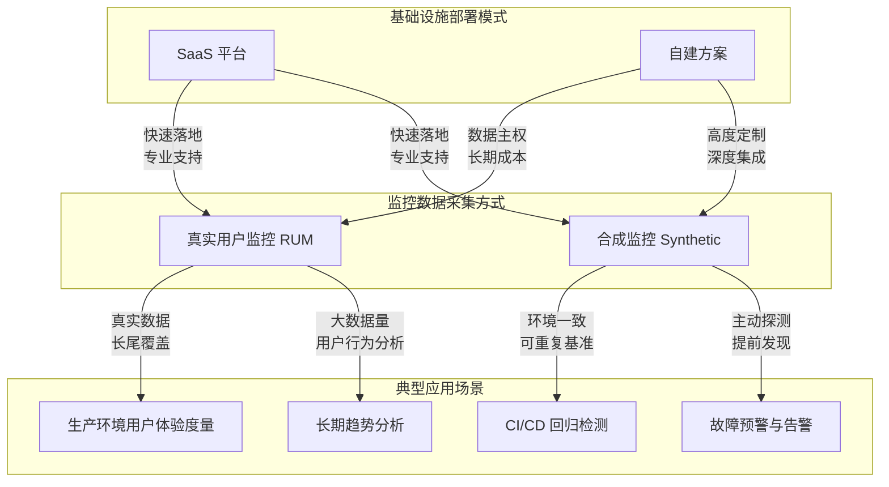
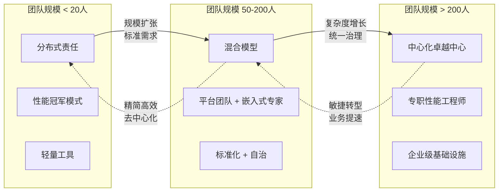

# 性能工程选型与决策框架

## 引言

在当代 Web 应用架构日趋复杂、用户期望持续攀升的工程背景下，性能工程（Performance Engineering）已超越传统的“后期调优”范畴，演变为贯穿软件全生命周期的系统性学科。它不再仅仅是关于压缩图片或减少 HTTP 请求的技术操作，而是一种融合数学建模、系统分析、经济学决策与组织行为学的综合工程能力。

随着 2026 年前端生态的持续演进，性能工程面临的挑战呈现出新的维度：从单页应用（SPA）到渐进式 Web 应用（PWA），从服务端渲染（SSR）到边缘渲染（Edge Rendering），从传统浏览器到 IoT 设备与车载系统，性能优化的场景边界被极大拓展。与此同时，性能工具链经历了指数级增长——Chrome DevTools 的持续迭代、Lighthouse 的自动化评分体系、WebPageTest 的深度诊断能力、RUM（Real User Monitoring）与 Synthetic Monitoring 的融合趋势，以及 SpeedCurve、Calibre 等 SaaS 平台的商业化成熟——使得性能工程团队在工具选型、监控方案设计、技术栈决策以及组织模型建设上面临前所未有的复杂性。

本文试图构建一个严格的性能工程选型与决策框架。在理论层面，我们将建立性能优化的 ROI（Return on Investment）数学模型，阐述系统瓶颈分析的方法论（自上而下与自下而上），引入 Amdahl 定律作为优化优先级排序的理论基石，并构建涵盖加载性能、运行时性能、内存性能与网络性能的多维度评估体系。在工程层面，我们将映射 2026 年前端性能工具全景，对比 RUM 与 Synthetic 监控方案的适用边界，构建面向项目类型、用户群体、性能目标与预算约束的技术栈决策树，探讨专职性能工程师与分布式性能责任两种组织模型的优劣，并给出性能文化建设的实践路径。

通过理论与工程的双轨并行，本文旨在为技术决策者提供一套可复用、可量化、可落地的性能工程决策框架。

## 理论严格表述

### 性能优化的 ROI 模型

在性能工程中，任何优化决策本质上都是投资决策。建立严格的 ROI（Return on Investment）模型是避免“过度优化”或“无效优化”的首要前提。

设某性能优化项目的总成本为 $C_{total}$，该成本由直接工程成本 $C_{engineering}$、机会成本 $C_{opportunity}$ 以及风险成本 $C_{risk}$ 构成：

$$C_{total} = C_{engineering} + C_{opportunity} + C_{risk}$$

直接工程成本 $C_{engineering}$ 包括人力资源投入、工具采购费用以及基础设施开销。机会成本 $C_{opportunity}$ 代表因投入性能优化而延迟的其他功能开发所损失的潜在收益。风险成本 $C_{risk}$ 则涵盖优化引入回归缺陷的修复成本以及系统不稳定性带来的业务损失。

收益方面，性能优化带来的价值增量 $\Delta V$ 可以从多个维度量化：

$$\Delta V = \Delta V_{revenue} + \Delta V_{engagement} + \Delta V_{cost\_saving}$$

其中，$\Delta V_{revenue}$ 表示因性能提升带来的直接收入增长（如转化率提升），$\Delta V_{engagement}$ 表示用户参与度指标改善带来的长期价值（如留存率提升、会话深度增加），$\Delta V_{cost\_saving}$ 表示因资源消耗降低带来的基础设施成本节约（如带宽减少、服务器负载降低）。

因此，性能优化的 ROI 严格定义为：

$$ROI = \frac{\Delta V - C_{total}}{C_{total}} \times 100\%$$

当 $ROI > 0$ 时，优化项目在经济学意义上是合理的；当 $ROI \leq 0$ 时，应重新评估优化方案或放弃该项目。更进一步，在资源约束条件下，性能工程团队应优先执行 $ROI$ 最高的优化项目，即求解：

$$\max_{i} \left\{ \frac{\Delta V_i - C_{total,i}}{C_{total,i}} \right\}, \quad \text{s.t.} \quad \sum C_{total,i} \leq B$$

其中 $B$ 为给定的性能工程预算。

值得注意的是，性能收益往往呈现边际递减特征。初始阶段的优化（如启用压缩、实施缓存策略）通常具有极高的 ROI，而后续的微优化（如减少几毫秒的执行时间）可能面临成本急剧上升而收益甚微的困境。这一非线性特征要求在性能工程实践中建立“足够好”的哲学边界，而非追求绝对的理论最优。

### 性能瓶颈分析的系统方法论

性能瓶颈分析是性能工程的核心环节。从系统工程的角度，存在两种互补的分析方法论：自上而下（Top-Down）分析与自下而上（Bottom-Up）分析。

#### 自上而下分析（Top-Down Analysis）

自上而下分析以用户体验为起点，逐步向下钻取至底层系统资源。其理论基础是将系统视为层次化抽象结构，每一层向上层提供服务，同时依赖下层的实现。

定义用户体验指标集 $U = \{u_1, u_2, \dots, u_n\}$，例如 Core Web Vitals 中的 LCP（Largest Contentful Paint）、INP（Interaction to Next Paint）、CLS（Cumulative Layout Shift）。自上而下分析的形式化流程为：

1. **指标异常检测**：识别偏离目标阈值的指标 $u_i$，即 $u_i > T_i$，其中 $T_i$ 为预设阈值。
2. **业务场景映射**：将异常指标映射到具体业务场景 $S_j$，例如“结账页面加载缓慢”或“搜索结果交互卡顿”。
3. **组件层级分解**：将业务场景分解为前端组件树 $C = \{c_1, c_2, \dots, c_m\}$，识别贡献度最大的组件：
   $$\text{Contrib}(c_k) = \frac{\text{Time}(c_k)}{\sum_{l=1}^{m} \text{Time}(c_l)} \times 100\%$$
4. **底层资源关联**：将高贡献组件关联到资源消耗，如 JavaScript 执行时间、网络请求延迟、渲染线程阻塞时长。

自上而下分析的优势在于始终以用户价值为导向，避免陷入“优化不被感知的指标”的陷阱。其局限在于对深层系统问题（如内存泄漏、垃圾回收抖动）的敏感性不足。

#### 自下而上分析（Bottom-Up Analysis）

自下而上分析从系统资源利用率为起点，向上追溯至用户体验影响。其理论基础是系统性能受限于最稀缺的资源（Amdahl 定律的推广形式）。

定义系统资源集 $R = \{r_1, r_2, \dots, r_p\}$，包括 CPU 周期、内存容量、网络带宽、磁盘 I/O、GPU 渲染能力等。自下而上分析的形式化流程为：

1. **资源饱和度监测**：识别利用率趋近或达到饱和的资源 $r_j$，即 $\rho_j \to 1$，其中 $\rho_j$ 为资源 $r_j$ 的利用率。
2. **进程/线程归因**：将资源消耗归因到具体进程或线程 $P_k$。
3. **调用栈分析**：通过火焰图（Flame Graph）或调用树（Call Tree）识别热点函数 $f_l$：
   $$\text{Hot}(f_l) = \frac{\text{SelfTime}(f_l)}{\text{TotalTime}} \times 100\%$$
4. **用户体验映射**：评估热点函数对上层业务场景的影响权重。

自下而上分析擅长发现系统性资源瓶颈，尤其适合诊断内存泄漏、CPU 密集型计算等问题。其风险在于可能过度关注技术细节而忽视用户实际感知。

在工程实践中，两种方法论应形成闭环：自上而下定位“哪里慢”，自下而上解释“为什么慢”。二者的交替迭代构成性能瓶颈诊断的完整认知框架。

### Amdahl 定律指导下的优化优先级排序

Amdahl 定律（Gene Amdahl, 1967）是计算机体系结构中的经典定理，其在性能工程中的应用提供了严格的优化优先级排序依据。

设系统总执行时间为 $T_{original}$，其中某部分任务占用时间为 $f \cdot T_{original}$（$0 \leq f \leq 1$），其余部分时间为 $(1-f) \cdot T_{original}$。若对该部分任务进行优化，使其加速比为 $s$（$s > 1$），则优化后的总执行时间 $T_{new}$ 为：

$$T_{new} = (1 - f) \cdot T_{original} + \frac{f \cdot T_{original}}{s}$$

整体加速比 $S_{overall}$ 为：

$$S_{overall} = \frac{T_{original}}{T_{new}} = \frac{1}{(1 - f) + \frac{f}{s}}$$

该公式揭示了两个关键推论：

**推论一：收益上限约束**。当 $s \to \infty$ 时，即某部分被优化至瞬时完成，整体加速比的上限为：

$$S_{overall}^{\max} = \frac{1}{1 - f}$$

这意味着，若某性能瓶颈仅占总执行时间的 10%（$f = 0.1$），即使将其完全消除，整体加速比也无法超过 $1/0.9 \approx 1.11$。反之，若瓶颈占 80%（$f = 0.8$），理论上限可达 $5\times$。这一约束深刻指出：**优化大占比瓶颈的边际收益远高于优化小占比瓶颈**。

**推论二：优化饱和度**。当 $s$ 已经较大时，继续提升 $s$ 的收益急剧递减。例如，当 $f = 0.5$ 时，$s = 2$ 可得 $S_{overall} = 1.33$；$s = 4$ 可得 $S_{overall} = 1.6$；$s = 10$ 仅得 $S_{overall} = 1.82$。这意味着在工程实践中，应将有限的工程资源分配到多个中等程度的优化上，而非追求单一环节的极致加速。

将 Amdahl 定律应用于前端性能工程，可建立如下优先级排序模型：

1. **识别时间占比**：通过性能剖析（Profiling）确定各阶段耗时占比，如 JavaScript 解析执行、样式计算、布局（Layout）、绘制（Paint）、合成（Composite）、网络传输等。
2. **评估可加速性**：评估各阶段的可优化空间 $s_i$，受限于技术边界（如网络物理延迟不可突破光速约束）与工程约束（如框架特性、第三方依赖）。
3. **计算理论上限**：根据 $\frac{1}{1 - f_i}$ 计算各阶段的理论加速上限。
4. **ROI 修正**：结合优化成本 $C_i$，计算修正后的优先级得分：
   $$\text{Priority}_i = \frac{S_{overall,i}^{\max} - 1}{C_i} = \frac{\frac{f_i}{1 - f_i}}{C_i}$$

这一排序模型确保了性能工程团队始终聚焦于“投入产出比最高”的优化方向，避免在不可优化或优化收益极低的环节浪费资源。

### 性能工程的多维度评估

现代 Web 应用的性能评估必须超越单一的“加载时间”指标，建立涵盖四个核心维度的综合评估体系。

#### 维度一：加载性能（Loading Performance）

加载性能衡量用户从发起请求到可交互的时间跨度。核心指标包括：

- **TTFB（Time to First Byte）**：$TTFB = t_{first\_byte} - t_{request}$，反映服务端响应与网络传输延迟。
- **FCP（First Contentful Paint）**：首次内容绘制时间。
- **LCP（Largest Contentful Paint）**：最大内容绘制时间，Google 推荐的加载性能核心指标，阈值标准为 $\leq 2.5s$（Good），$2.5s - 4.0s$（Needs Improvement），$> 4.0s$（Poor）。
- **TTI（Time to Interactive）**：可交互时间，衡量主线程空闲至可响应用户输入的时长。

加载性能的优化焦点在于资源加载策略（预加载、懒加载、代码分割）、传输效率（压缩、缓存、HTTP/2 Server Push 的替代方案如 103 Early Hints）以及渲染阻塞消除。

#### 维度二：运行时性能（Runtime Performance）

运行时性能关注用户与应用交互过程中的流畅度。核心指标包括：

- **INP（Interaction to Next Paint）**：2024 年起取代 FID 成为 Core Web Vital，衡量用户交互到下一帧绘制的最大延迟，阈值标准为 $\leq 200ms$（Good）。
- **帧率（Frame Rate）**：以每秒帧数（FPS）衡量动画与滚动的流畅度，目标为稳定维持 60 FPS，即每帧渲染时间 $\leq 16.67ms$。
- **长任务（Long Tasks）**：主线程执行超过 50ms 的任务，会阻塞用户交互，需通过 `PerformanceLongTaskTiming` API 监测并分解。

运行时性能的优化焦点在于 JavaScript 执行优化（避免强制同步布局、减少主线程占用）、渲染管道优化（最小化重排与重绘）以及 Web Worker 的合理应用。

#### 维度三：内存性能（Memory Performance）

内存性能直接影响应用的长期稳定性，尤其在单页应用（SPA）中至关重要。核心指标包括：

- **JavaScript 堆内存占用**：通过 `performance.memory`（Chrome 非标准 API）或 DevTools Memory 面板监测。
- **内存泄漏率**：单位时间内内存占用的持续增长斜率，理想状态下应趋近于零。
- **垃圾回收（GC）频率与暂停时间**：V8 等引擎的 GC 活动会导致主线程暂停，影响交互响应。

内存性能的优化焦点在于避免闭包泄漏、清理事件监听器与定时器、使用 WeakRef 与 FinalizationRegistry 管理对象生命周期，以及大型数据结构的分块处理。

#### 维度四：网络性能（Network Performance）

网络性能评估数据传输的效率与可靠性。核心指标包括：

- **带宽利用率**：实际吞吐量与理论带宽的比值。
- **往返时间（RTT）**：$RTT = 2 \times \frac{d}{c} + t_{processing}$，其中 $d$ 为物理距离，$c$ 为信号传播速度（光纤中约 $2 \times 10^8 m/s$），$t_{processing}$ 为节点处理延迟。
- **重传率与丢包率**：反映网络稳定性。
- **协议开销比**：HTTP 头、TLS 握手、TCP 慢启动等协议机制引入的额外延迟占比。

网络性能的优化焦点在于连接复用（HTTP/2 多路复用、HTTP/3 QUIC）、边缘缓存（CDN）、协议优化（TLS 1.3 0-RTT、QUIC 连接迁移）以及请求优先级管理。

这四个维度并非孤立存在，而是相互耦合。例如，过度激进的代码分割可能改善加载性能（减少初始包体积），却因增加并发请求数量而恶化网络性能；预加载关键资源可提升 LCP，但若占用过多带宽可能竞争掉用户即时交互所需的资源。性能工程的多维度评估本质上是一个多目标优化问题，需要在各维度间寻求帕累托最优（Pareto Optimality）。

## 工程实践映射

### 2026 年前端性能工具全景

截至 2026 年，前端性能工具链已形成覆盖开发、测试、监控、优化全阶段的成熟生态。以下为核心工具的系统性梳理。

#### Chrome DevTools：浏览器内置的诊断中枢

Chrome DevTools 是性能工程最基础也是最深度的工具。其 Performance 面板提供主线程事件循环的微观可见性，支持火焰图、调用树、事件日志三种视图。2026 年版本中，DevTools 强化了以下能力：

- **性能洞察（Performance Insights）**：基于 AI 的瓶颈自动识别，能够建议具体的优化策略。
- **实时指标覆盖（Live Metrics Overlay）**：在页面顶部实时显示 LCP、INP、CLS 等 Core Web Vitals 指标。
- **内存时间轴（Memory Timeline）**：关联内存分配与 DOM 节点生命周期，辅助定位内存泄漏。
- **渲染分析器（Rendering Tab）**：可视化绘制层（Layer）与合成边界，诊断过度绘制问题。

在工程实践中，Chrome DevTools 适用于开发阶段的即时诊断与深度剖析。其局限在于无法自动化回归测试，且数据受限于本地开发机器的环境配置。

#### Lighthouse：自动化评分与审计引擎

Lighthouse 是 Google 开源的自动化网站质量审计工具，覆盖性能（Performance）、可访问性（Accessibility）、最佳实践（Best Practices）、SEO 与 PWA 五个维度。

Lighthouse 的评分模型基于实验室环境（Lab Data），通过模拟 Moto G4 中端设备与慢速 4G 网络生成标准化的性能报告。2026 年的关键演进包括：

- **Flow 模式**：支持多步骤用户旅程（User Flow）的审计，而非仅单页面加载。
- **快照模式（Snapshot）**：分析当前状态的页面，适用于 SPA 的路由切换场景。
- **时序模式（Timespan）**：分析任意时间段内的性能表现。
- **自定义审计插件**：允许团队扩展自定义指标与审计规则。

Lighthouse CI 的集成使得性能预算（Performance Budget）可以在 CI/CD 流水线中强制执行。当 Lighthouse 评分低于阈值或特定指标（如 LCP）超过预算时，构建流程可被配置为失败，从而实现性能回归的自动化防护。

#### WebPageTest：深度网络与加载诊断

WebPageTest（WPT）是业界公认的深度网络性能测试平台，提供全球多节点的真实浏览器测试能力。其核心优势在于：

- **多地点、多浏览器、多连接速度**：支持从全球数十个测试节点，使用 Chrome、Firefox、Safari、Edge 等浏览器，在 3G、4G、5G、Cable、FIOS 等网络配置下执行测试。
- **瀑布图（Waterfall）与内容分解**：详细的请求瀑布图，支持按域名、MIME 类型、CDN 进行内容分解。
- **视频比对与视觉进度**：通过视频录制与视觉进度图（Visual Progress）精确衡量用户实际看到的页面构建过程。
- **自定义脚本**：支持高级测试脚本，模拟登录、多步骤流程、SPA 导航等复杂场景。

2026 年，WebPageTest 进一步增强了核心 Web 指标的原生支持、实验功能（Experiments）的易用性（无需代码修改即可测试优化假设），以及与 Lighthouse 评分体系的深度整合。对于需要精确网络层诊断的团队，WebPageTest 是不可替代的工具。

#### SpeedCurve：以用户为中心的监控平台

SpeedCurve 是专注于性能监控的 SaaS 平台，其核心差异化在于将性能数据与业务指标（如转化率、跳出率）直接关联。SpeedCurve 提供两大核心产品：

- **Lux**：真实用户监控（RUM）解决方案，基于轻量级 JavaScript 探针采集 Core Web Vitals 与自定义指标。
- **Synthetic**：合成监控，基于 WebPageTest 引擎提供实验室基准测试。

SpeedCurve 的仪表盘设计强调“性能即功能”的产品哲学，支持竞品性能对标（Benchmarking）、性能预算的可视化跟踪，以及 Slack、PagerDuty 等渠道的告警集成。对于需要向非技术利益相关者展示性能价值的团队，SpeedCurve 的数据可视化与业务关联能力极具价值。

#### Calibre：面向团队的性能协作平台

Calibre 定位为“性能协作平台”，强调团队层面的性能预算管理、测试自动化与报告共享。其核心功能包括：

- **自动化测试编排**：定时从多节点执行 Lighthouse 与自定义测试。
- **性能预算与阈值管理**：为每个 URL 或用户旅程设置具体的指标预算。
- **团队报告与趋势分析**：自动生成周/月性能报告，追踪长期趋势。
- **GitHub/GitLab 集成**：Pull Request 级别的性能预览与回归检测。

Calibre 适合已有明确性能预算体系、需要跨团队协作的中大型组织。

#### GTmetrix：轻量级快速诊断

GTmetrix 提供基于 Lighthouse 与 WebPageTest 的简化版性能测试，核心优势在于操作简便与报告直观。其免费 tier 适合个人开发者与小型团队进行快速诊断，而商业 tier 提供历史趋势追踪、多节点测试与告警功能。

在 2026 年的工具选型中，上述工具形成互补矩阵：Chrome DevTools 用于开发阶段深度诊断，Lighthouse 用于自动化评分与 CI 集成，WebPageTest 用于深度网络分析，SpeedCurve/Calibre 用于持续监控与团队协作，GTmetrix 用于快速抽查。

### 性能监控方案选型：RUM vs Synthetic，自建 vs SaaS

性能监控是性能工程的“感官系统”，其方案选型直接决定团队对生产环境性能态势的感知能力。

#### RUM（Real User Monitoring）与 Synthetic Monitoring 的对比

RUM 通过嵌入在应用中的 JavaScript 探针（如 `web-vitals` 库）采集真实用户的性能数据。其数学本质是对用户群体的采样观测：

$$\hat{\mu} = \frac{1}{n} \sum_{i=1}^{n} x_i, \quad \text{其中 } x_i \text{ 为第 } i \text{ 个用户的某性能指标}$$

RUM 的优势在于反映真实网络条件、设备性能与用户行为的多样性，尤其擅长识别长尾问题（Tail Latency）。其挑战在于数据量巨大、噪声多、难以进行 A/B 测试前的基线对比。

Synthetic Monitoring 通过在全球部署的探针节点，在受控条件下定期访问应用并记录性能数据。其优势在于环境一致性、可重复性、以及故障的早期预警（往往在真实用户大量受影响前发现问题）。其局限在于无法覆盖所有用户场景，且模拟条件可能与真实环境存在偏差。

在工程实践中，成熟的性能监控体系应采用“双轨制”：Synthetic 用于基线对比与回归检测，RUM 用于真实用户体验度量与长尾问题发现。两者的数据交叉验证能够提供更完整的性能图景。

#### 自建方案 vs SaaS 平台

自建性能监控方案通常基于开源栈构建，如：

- **RUM 层**：`web-vitals` + `PerformanceObserver` + 自研数据上报 SDK
- **数据收集层**：OpenTelemetry Collector 或自研网关
- **存储层**：ClickHouse、InfluxDB 或 TimescaleDB
- **可视化层**：Grafana 或自研仪表盘
- **告警层**：Prometheus Alertmanager 或 PagerDuty

自建方案的优势在于数据主权、高度定制化与长期成本可控（尤其在高数据量场景下）。其劣势在于初始建设成本高、运维负担重、需要专门的数据工程能力。

SaaS 平台（如 SpeedCurve、Datadog RUM、New Relic Browser、Sentry Performance）提供即开即用的解决方案，通常基于按量付费或按 seat 付费的商业模式。其优势在于快速落地、专业支持、功能持续迭代。其劣势在于数据出境合规风险（尤其对敏感行业）、长期订阅成本高、定制化受限。

选型决策应基于团队规模、数据合规要求、预算约束与技术能力。一般规律为：初创团队优先 SaaS 以换取速度；大型组织在数据合规与规模效应驱动下逐步转向混合架构（核心指标自建，辅助指标 SaaS）。

### 性能优化技术栈决策树

性能优化技术栈的选型应遵循结构化决策流程，而非依赖个人偏好或技术潮流。以下决策树提供了一个系统化的选型框架。

#### 第一步：项目类型识别

项目类型从根本上决定了性能优化的重心：

- **内容型站点（Content Site / Blog）**：重心在于加载性能，尤其是 LCP 与 FCP。技术选型倾向于静态站点生成（SSG）、边缘缓存、图片优化（AVIF/WebP）、字体子集化。
- **电商应用（E-commerce）**：重心在于转化路径的性能稳定性，需要兼顾加载速度与运行时交互流畅度（INP）。技术选型倾向于 Islands Architecture、渐进式水合（Progressive Hydration）、关键路径优化。
- **SaaS 仪表盘（Dashboard / Admin Panel）**：重心在于运行时性能与内存管理，因用户会话时间长、交互密集。技术选型倾向于虚拟滚动（Virtual Scrolling）、Web Workers 处理大数据集、组件级懒加载。
- **社交网络（Social / Feed）**：重心在于列表渲染性能与无限滚动优化。技术选型倾向于虚拟列表、增量渲染、骨架屏策略。
- **多媒体应用（Media / Streaming）**：重心在于网络自适应与解码性能。技术选型倾向于自适应码率（ABR）、Media Source Extensions（MSE）、WebCodecs API。

#### 第二步：用户群体与设备矩阵

用户群体的设备与网络分布是性能目标设定的关键约束。定义用户设备矩阵 $D$ 与网络矩阵 $N$：

$$D = \begin{bmatrix} d_{high} & d_{mid} \\ p_{high} & p_{mid} \end{bmatrix}, \quad N = \begin{bmatrix} n_{5g} & n_{4g} & n_{3g} \\ q_{5g} & q_{4g} & q_{3g} \end{bmatrix}$$

其中 $p$ 与 $q$ 为各类型占比。若目标用户大量使用中端设备（如 Moto G 系列、Redmi 数字系列）与慢速网络（2G/3G 占比较高），则性能预算需显著收紧，技术选型应偏向更保守的资源策略（如减少 JavaScript 体积、优先 CSS 渲染、减少字体变体）。

#### 第三步：性能目标量化

基于项目类型与用户群体，设定具体的性能目标。以 Core Web Vitals 为例：

| 项目类型 | LCP 目标 | INP 目标 | CLS 目标 | TTFB 目标 |
|---------|---------|---------|---------|----------|
| 内容型 | $\leq 1.8s$ | $\leq 200ms$ | $\leq 0.05$ | $\leq 600ms$ |
| 电商 | $\leq 2.0s$ | $\leq 150ms$ | $\leq 0.03$ | $\leq 400ms$ |
| SaaS | $\leq 2.5s$ | $\leq 100ms$ | $\leq 0.01$ | $\leq 300ms$ |
| 社交 | $\leq 1.5s$ | $\leq 120ms$ | $\leq 0.02$ | $\leq 500ms$ |

目标的严格程度应与业务收益直接挂钩。例如，电商结账页面的 INP 目标应比首页更严格，因为交互延迟直接影响转化。

#### 第四步：预算约束与技术选型

在明确性能目标后，建立性能预算（Performance Budget）。性能预算将抽象的指标转化为可执行的工程约束：

- **资源体积预算**：初始 JavaScript $\leq 200KB$（gzip）、图片 $\leq 500KB$、CSS $\leq 50KB$。
- **请求数量预算**：首屏关键请求 $\leq 15$ 个。
- **第三方脚本预算**：总第三方脚本体积 $\leq 100KB$，且不得阻塞关键路径。

技术选型在预算约束下进行。例如，若性能预算要求首屏 JavaScript 体积极小，则应避免引入重型框架（如未优化的 React 全量包），转而考虑 Preact、Svelte 或 Qwik 等编译时优化框架；若内存预算严格，则应避免大型前端状态管理库的全量加载，采用细粒度响应式方案。

#### 第五步：验证与迭代循环

技术栈选型并非一次性决策，而需通过“构建 - 测量 - 验证 - 调整”的迭代循环持续优化。每个迭代周期应产出：

1. 性能基线报告（Baseline Report）
2. 优化实施变更集（Changeset）
3. 回归验证结果（Regression Test）
4. 业务指标关联分析（Business Impact Analysis）

只有当初始假设被数据验证后，技术栈选型才算完成闭环。

### 性能团队的组织模型

性能工程不仅需要工具与方法论，更需要匹配的组织结构来确保执行落地。业界存在三种主流组织模型。

#### 模型一：专职性能工程师（Center of Excellence）

在该模型中，组织设立独立的性能工程团队（或性能卓越中心），团队成员专职负责性能优化、工具建设、标准制定与跨团队赋能。

**结构特征**：
- 集中式 expertise，性能知识深度高。
- 制定全组织统一的性能标准、预算与流程。
- 通过内部咨询（Internal Consulting）模式支持各产品团队。

**适用场景**：
- 大型组织（工程团队规模 $> 100$ 人）
- 性能是核心竞争优势（如云服务提供商、高性能计算平台）
- 需要建设通用性能基础设施（如内部 RUM 平台、性能测试框架）

**优势**：专业化程度高，标准统一，适合建设长期能力。
**劣势**：可能成为瓶颈（Bottleneck），与产品团队的目标优先级易产生冲突；存在“抛墙式”协作风险（“性能是性能团队的事”）。

#### 模型二：分布式性能责任（Embedded / Spotify Model）

在该模型中，不设立专职性能团队，而是将性能责任嵌入各产品团队。每个产品团队配备“性能冠军”（Performance Champion），通常是高级前端工程师兼任。

**结构特征**：
- 性能责任与产品目标直接绑定。
- 性能冠军在团队内部推动优化，同时通过公会（Guild）形式进行跨团队知识共享。
- 无中心化瓶颈，决策速度快。

**适用场景**：
- 中型组织或采用微服务/微前端架构的团队
- 产品迭代速度快，需要性能决策与功能开发同步进行
- 技术栈异构，难以制定统一标准

**优势**：响应速度快，性能优化与业务上下文紧密结合。
**劣势**：标准可能不一致，性能冠军的 workload 压力大，性能知识碎片化。

#### 模型三：混合模型（Platform + Embedded）

混合模型结合上述两者优点：设立小规模的性能平台团队（Platform Team），负责建设通用的性能基础设施、监控平台与自动化工具；同时，在各产品团队保留性能负责人，负责具体业务场景的性能优化。

**结构特征**：
- 平台团队提供“性能即服务”（Performance as a Service）。
- 嵌入式性能负责人利用平台能力解决业务问题。
- 通过内部 SLA 明确协作界面。

**适用场景**：
- 中大型组织（工程团队规模 $50-500$ 人）
- 技术栈部分统一，存在共享基础设施的需求
- 既需要标准化，又需要业务灵活性

**优势**：兼顾标准化与灵活性，平台团队的专业能力与产品团队的业务洞察形成互补。
**劣势**：协调成本高，需要清晰的职责边界与沟通机制。

在组织模型选型中，不存在普适最优解。小型团队（$< 20$ 人）通常适合分布式模型，因专职性能工程师的 ROI 不足；超大型组织（$> 500$ 人）通常需要混合模型，以平衡标准化与自治；处于快速成长期的团队应警惕过早中心化导致的效率损失。

### 性能文化建设的实践路径

组织模型解决“谁来做”的问题，性能文化解决“为何做”与“如何做”的问题。性能文化（Performance Culture）是指组织成员将性能视为产品质量核心维度的共同信念与行为模式。

建设性能文化的实践路径可分为五个阶段：

**阶段一：认知觉醒（Awareness）**
- 通过数据展示性能对业务指标的影响（如 Amazon 的“每 100ms 延迟损失 1% 销售额”案例）。
- 在团队会议中引入性能数据看板，建立性能可见性。
- 开展性能基础知识培训，消除“性能是黑魔法”的认知障碍。

**阶段二：度量标准化（Measurement）**
- 统一性能度量指标（如采用 Core Web Vitals 作为通用语言）。
- 建立性能基线（Baseline）与性能预算（Budget）。
- 将性能指标纳入 CI/CD 门禁，使性能回归如同测试失败一样不可接受。

**阶段三：流程嵌入（Integration）**
- 在设计评审（Design Review）阶段引入性能影响评估。
- 在代码评审（Code Review）中强制检查性能预算。
- 在发布流程中要求性能验证报告。

**阶段四：工具赋能（Enablement）**
- 建设自助式性能诊断工具，降低性能优化的门槛。
- 建立性能知识库（Playbook），记录常见场景的最佳实践。
- 设立性能优化内部悬赏（Bug Bounty），激励主动发现性能问题。

**阶段五：持续进化（Evolution）**
- 定期复盘性能事故，进行 blameless postmortem。
- 跟踪业界性能技术演进，持续更新工具链与方法论。
- 培养性能工程的职业发展路径（Performance Engineer Ladder）。

性能文化的终极标志是：每个工程师在编写代码时，会自发地考虑“这段代码对 LCP/INP/内存的影响是什么？”，而无需外部强制。这种内化的性能意识是组织长期性能竞争力的根本来源。

## Mermaid 图表

### 性能优化 ROI 决策流程

```mermaid
flowchart TD
    A[性能问题识别] --> B[瓶颈时间占比分析]
    B --> C[计算理论加速上限<br/>S_max = 1/(1-f)]
    C --> D[评估优化成本 C_total]
    D --> E[计算 ROI = (ΔV - C_total) / C_total]
    E --> F{ROI > 0?}
    F -->|是| G{是否在预算内?}
    F -->|否| H[放弃或延期]
    G -->|是| I[纳入优化队列]
    G -->|否| J[寻找低成本替代方案]
    I --> K[按优先级排序执行]
    J --> K
    K --> L[实施优化]
    L --> M[回归验证]
    M --> N[更新性能基线]
    N --> O[持续监控]
    H --> P[记录决策依据]
    P --> O
```

### 性能监控方案选型矩阵



### 性能工程组织模型演进



## 理论要点总结

1. **ROI 导向的决策纪律**：性能优化必须服从经济学理性。建立包含工程成本、机会成本与风险成本的总成本模型，以及涵盖收入增量、参与度提升与成本节约的收益模型。任何优化项目只有在 $ROI > 0$ 且符合预算约束时才应被执行，避免陷入“为优化而优化”的工程 vanity。

2. **系统化的瓶颈诊断**：自上而下分析确保优化始终锚定用户体验，自下而上分析揭示系统资源的深层约束。二者形成的诊断闭环是避免“伪优化”（即优化了不被用户感知的指标）的根本保障。在实践中，应以用户报告的异常为起点（Top-Down），以火焰图与资源监控为落脚点（Bottom-Up）。

3. **Amdahl 定律的优先级约束**：优化的理论收益受限于瓶颈在总执行时间中的占比。优先优化 $f$ 值大（时间占比高）且 $s$ 值可实现（加速比可行）的环节。当某一环节的优化接近饱和时，应及时将资源转移至次优环节，以实现整体加速比的最大化。

4. **多维度评估的帕累托思维**：加载性能、运行时性能、内存性能与网络性能四个维度存在耦合与权衡关系。性能工程的目标不是单个维度的极致，而是在给定约束下寻求多目标优化的帕累托前沿。技术选型应服务于这一多维平衡，而非某一指标的孤立优化。

5. **工具矩阵的互补原则**：没有单一工具能够满足性能工程的全部需求。Chrome DevTools 提供深度诊断，Lighthouse 提供自动化审计，WebPageTest 提供网络层洞察，RUM/Synthetic 提供持续监控。成熟的性能工程体系应构建覆盖开发、测试、生产全阶段的工具链矩阵，并明确各工具的适用边界。

6. **组织模型与文化建设的协同**：工具与方法论的有效性依赖于匹配的组织结构。小型团队适合分布式责任模型以换取敏捷性，大型组织需要混合模型以平衡标准化与灵活性。无论采用何种组织模型，性能文化的五个阶段（认知觉醒→度量标准化→流程嵌入→工具赋能→持续进化）都是确保性能工程可持续性的必要条件。

## 参考资源

1. **Google Web Performance Research**. Google 官方 Web 性能研究团队发布的多项研究表明，页面加载时间与用户跳出率、转化率之间存在强负相关性。其开源的 Core Web Vitals 指标体系已成为行业事实标准。详见 [web.dev/performance-research](https://web.dev/performance-research)。

2. **WebPageTest Documentation**. WebPageTest 官方文档详细阐述了瀑布图分析、视觉进度测量、自定义脚本编写以及实验功能的使用方法。其多节点测试架构与深度网络诊断能力使其成为性能工程师的核心工具。详见 [docs.webpagetest.org](https://docs.webpagetest.org)。

3. **SpeedCurve Documentation**. SpeedCurve 官方文档系统介绍了 Lux RUM 探针的部署配置、Synthetic 测试的脚本编排，以及性能数据与业务指标的关联分析方法。其“性能即功能”的产品哲学对监控方案选型具有重要参考价值。详见 [support.speedcurve.com](https://support.speedcurve.com)。

4. **Ilya Grigorik, *High Performance Browser Networking***. 本书由 Google 性能工程师 Ilya Grigorik 撰写，系统阐述了浏览器网络栈的工作原理，包括 TCP、TLS、HTTP/2、HTTP/3 的协议细节，以及移动网络的性能特征。该书是理解网络性能维度不可多得的权威参考。O'Reilly Media, 2013. 在线版本见 [hpbn.co](https://hpbn.co)。

5. **Steve Souders, *Even Faster Web Sites***. 本书深入探讨了前端性能优化的具体技术，包括无阻塞加载脚本、高效使用缓存、优化图片与字体等。作为 *High Performance Web Sites* 的续作，它提供了大量可落地的优化模式。O'Reilly Media, 2009.
