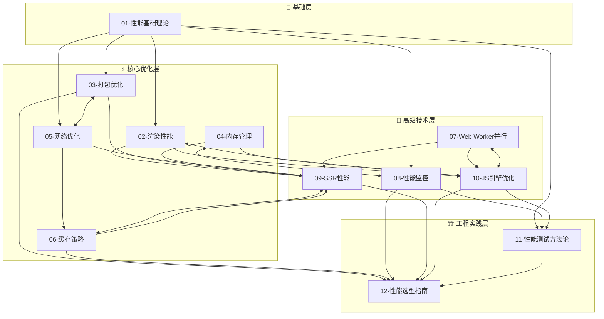

# 性能工程专题

## 专题概述

在现代 Web 应用开发中，**性能工程（Performance Engineering）** 已经从一个可选的优化项演变为决定产品成败的核心竞争力。用户对页面加载速度的容忍度持续降低——研究表明，当页面加载时间从 1 秒增加到 3 秒时，跳出率会上升 32%；而当加载时间达到 5 秒时，近九成的用户会选择离开。在移动互联网时代，性能问题不仅影响用户体验，更直接关系到搜索引擎排名、广告转化率和商业收益。

性能工程不是简单的"让代码跑得更快"，而是一门系统性的工程学科。它要求开发者从用户感知出发，建立量化的性能指标体系，识别瓶颈所在，选择恰当的优化策略，并在持续交付流程中建立性能回归防护网。本专题围绕 Web 性能工程的十二大核心维度展开，构建从底层浏览器原理到上层架构决策的完整知识图谱。

本专题的覆盖范围包括：

- **渲染性能**：理解浏览器渲染流水线，掌握重排重绘的优化策略，深入 Composite Layer、CSS Containment、will-change 等高级技术
- **打包优化**：从 Tree Shaking、Code Splitting 到 Module Federation，构建高效的资源交付体系
- **内存管理**：剖析 JavaScript 垃圾回收机制，诊断内存泄漏，掌握 WeakRef、FinalizationRegistry 等现代 API
- **网络优化**：HTTP/2、HTTP/3、QUIC、Resource Hints、Priority Hints 等现代网络加速技术
- **缓存策略**：Service Worker、Cache API、CDN、Edge Caching 的多级缓存架构设计
- **Web Worker 并行**：将计算密集型任务从主线程剥离，探索 SharedArrayBuffer、Atomics 和 WebAssembly 的协同
- **性能监控**：建立 RUM（Real User Monitoring）与 Synthetic Monitoring 双轨体系，集成 Web Vitals
- **SSR 性能**：服务端渲染的流式传输、选择性水合、 Islands Architecture 等前沿模式
- **JavaScript 引擎优化**：深入 V8 的 Ignition + TurboFan 管道，理解隐藏类、内联缓存、逃逸分析
- **性能测试方法论**：从 Lighthouse CI 到 WebPageTest，建立可重复、可对比的性能基准
- **性能选型指南**：在不同业务场景下权衡 SSR、SSG、CSR、Edge Rendering 的优劣

性能工程与前端框架、应用架构、测试工程紧密交织。在深入本专题之前，建议读者先具备扎实的 JavaScript 运行时知识；在学习过程中，可结合框架模型、应用设计和测试工程专题进行交叉学习，以建立更完整的工程视野。

---

## 专题文件导航

本专题共包含 **12 篇核心文章** 与本索引文件，系统覆盖性能工程的理论基础、技术深度与实践选型。以下按推荐学习顺序排列，每篇文章均附有核心内容摘要与直达链接。

### 01. 性能基础理论

📄 [`01-performance-fundamentals.md`](./01-performance-fundamentals.md)

性能工程的基石篇章。系统梳理 Web 性能的核心度量指标体系，包括 Google Web Vitals 三大核心指标（LCP、FID/INP、CLS）的定义、测量方法与优化阈值；深入解析 RAIL 模型（Response、Animation、Idle、Load）在用户体验设计中的指导意义；介绍关键渲染路径（Critical Rendering Path）的完整流程，以及 TTFB、FCP、FMP、TTI、TBT、Speed Index 等关键里程碑指标的含义与相互关系。本章还涵盖性能预算（Performance Budget）的制定方法，以及如何在团队中建立性能文化，将性能指标纳入 CI/CD 门禁体系。

> **核心关键词**：Web Vitals、RAIL、Critical Rendering Path、Performance Budget、LCP、INP、CLS

---

### 02. 渲染性能

📄 [`02-rendering-performance.md`](./02-rendering-performance.md)

浏览器渲染流水线是性能优化的主战场。本章从像素到屏幕的完整旅程出发，详解 DOM 构建、CSSOM 合成、样式计算、布局（Layout/Reflow）、绘制（Paint）、分层（Layerization）与合成（Composite）各阶段的内部机制。重点探讨如何使用 `transform` 与 `opacity` 触发 GPU 加速，利用 CSS Containment 限制样式计算范围，通过 `content-visibility` 实现离屏渲染优化。深入讲解 will-change 的正确使用姿势、CSS 属性触发布局/绘制/合成的影响矩阵，以及 60fps 动画的帧预算管理策略。同时覆盖滚动性能优化、虚拟列表（Virtual Scrolling）实现原理，以及现代浏览器渲染引擎（Blink、Gecko、WebKit）的差异性分析。

> **核心关键词**：Reflow、Repaint、GPU Acceleration、CSS Containment、content-visibility、Virtual Scrolling、60fps

---

### 03. 打包优化

📄 [`03-bundle-optimization.md`](./03-bundle-optimization.md)

现代前端应用的交付体积直接影响首次加载性能。本章深入 Webpack、Vite、Rollup、esbuild、Turbopack 等主流构建工具的性能优化配置，系统讲解 Tree Shaking 的生效条件与 sideEffects 配置策略、Code Splitting 的三种模式（Entry Points、Dynamic Imports、SplitChunks）及其最佳实践。涵盖 Module Federation 实现微前端架构下的模块共享、依赖预打包（Dependency Pre-bundling）原理、资源压缩（Terser、esbuild-minify、SWC）的速度与质量权衡。此外还探讨基于 Route 的懒加载、组件级按需加载、图片/字体/Worker 等资源的内联与分割策略，以及 Bundle 体积的持续监控与回归防护方案。

> **核心关键词**：Tree Shaking、Code Splitting、Module Federation、Lazy Loading、Pre-bundling、Bundle Analysis

---

### 04. 内存管理

📄 [`04-memory-management.md`](./04-memory-management.md)

JavaScript 的自动内存管理并不意味开发者可以忽视内存问题。本章从 V8 的堆内存结构（新生代、老生代、大对象空间）出发，详解 Scavenge、Mark-Sweep、Mark-Compact 等垃圾回收算法的执行过程与性能影响。系统讲解内存泄漏的四大典型模式（意外全局变量、闭包陷阱、被遗忘的定时器/回调、DOM 引用游离），并介绍 Chrome DevTools Memory Panel、Heap Snapshot、Allocation Timeline、Detached DOM Tree 等诊断工具的使用方法。深入现代内存管理 API（WeakMap、WeakSet、WeakRef、FinalizationRegistry）的适用场景，以及 ArrayBuffer、SharedArrayBuffer 在二进制数据处理中的内存优化策略。

> **核心关键词**：Garbage Collection、Memory Leak、Heap Snapshot、WeakRef、FinalizationRegistry、V8 Heap

---

### 05. 网络优化

📄 [`05-network-optimization.md`](./05-network-optimization.md)

网络是 Web 应用性能的关键瓶颈之一。本章系统覆盖现代 Web 网络协议栈：从 HTTP/1.1 的队头阻塞问题，到 HTTP/2 的多路复用、Server Push（及后续废弃原因）、HPACK 头部压缩；再到 HTTP/3 基于 QUIC 协议的无队头阻塞传输、0-RTT 连接建立与连接迁移能力。深入讲解 Resource Hints（`dns-prefetch`、`preconnect`、`prefetch`、`preload`、`prerender`）的差异化使用场景，Priority Hints (`fetchpriority`) 对关键资源加载顺序的精细控制。涵盖图片优化（AVIF、WebP、响应式图片 `srcset`/`sizes`）、字体加载优化（`font-display`、子集化、预加载）、第三方脚本治理（异步加载、延迟加载、iframe 沙箱隔离），以及 CDN 边缘缓存策略与多区域部署的网络拓扑优化。

> **核心关键词**：HTTP/2、HTTP/3、QUIC、Resource Hints、Priority Hints、CDN、Preload、Prefetch

---

### 06. 缓存策略

📄 [`06-caching-strategies.md`](./06-caching-strategies.md)

合理的缓存策略是提升重复访问性能的最有效手段。本章从 HTTP 缓存机制（Expires、Cache-Control、ETag、Last-Modified、Vary）的完整交互流程出发，探讨强缓存与协商缓存的决策树设计。深入 Service Worker 缓存策略的五种经典模式（Cache First、Network First、Cache Only、Network Only、Stale While Revalidate），以及 Workbox 工具链的集成实践。覆盖 CDN 边缘缓存的缓存键设计、分层缓存架构（Browser -> CDN -> Origin）、缓存失效策略（Purge、Versioned URL、Content Hash）。同时讲解本地存储方案的性能对比（LocalStorage、SessionStorage、IndexedDB、Cache API），以及 Cache API 与 Fetch API 结合构建离线优先（Offline-First）应用的架构模式。

> **核心关键词**：HTTP Cache、Service Worker、Workbox、CDN Edge Cache、Stale While Revalidate、Offline-First

---

### 07. Web Worker 并行

📄 [`07-web-worker-parallelism.md`](./07-web-worker-parallelism.md)

JavaScript 的单线程模型在处理计算密集型任务时容易阻塞主线程，导致用户交互卡顿。本章系统讲解 Web Worker、Dedicated Worker、Shared Worker 的生命周期管理与通信模式（Structured Clone Algorithm、Transferable Objects）。深入探讨 SharedArrayBuffer 与 Atomics API 实现的高性能并行计算，以及 WASM 与 Worker 结合的混合架构。涵盖 OffscreenCanvas 将渲染工作移至 Worker 的前沿实践，Web Worker 在图像处理、大数据排序、加密计算、科学模拟等场景的落地案例。同时分析 Worker 池（Worker Pool）模式的实现、主线程与 Worker 间的负载均衡策略，以及 Service Worker 与 Web Worker 的协同使用边界。

> **核心关键词**：Web Worker、SharedArrayBuffer、Atomics、OffscreenCanvas、Worker Pool、Transferable Objects

---

### 08. 性能监控

📄 [`08-performance-monitoring.md`](./08-performance-monitoring.md)

"无法度量就无法优化"——性能监控是性能工程的闭环基础。本章区分 RUM（Real User Monitoring，真实用户监控）与 Synthetic Monitoring（合成监控）的适用场景与互补关系，详解 PerformanceObserver API 采集 Web Vitals 指标的方法，以及 Core Web Vitals 的字段数据（Field Data）与实验室数据（Lab Data）差异。系统讲解主流性能监控平台（Google Analytics 4 + BigQuery、Sentry Performance、Datadog RUM、New Relic、阿里云 ARMS）的集成方案。涵盖自定义性能指标的设计（User Timing API、Long Tasks API、Element Timing API、Layout Shift API）、性能数据的采样与聚合策略、异常性能波动的告警机制，以及如何将性能指标纳入 SLI/SLO 体系进行持续治理。

> **核心关键词**：RUM、Synthetic Monitoring、PerformanceObserver、Core Web Vitals、SLI/SLO、User Timing API

---

### 09. SSR 性能

📄 [`09-ssr-performance.md`](./09-ssr-performance.md)

服务端渲染（SSR）在改善首屏性能与 SEO 的同时，也引入了服务端负载、水合开销等新挑战。本章从传统 SSR（请求级渲染）的性能瓶颈出发，探讨流式 SSR（Streaming SSR）通过 `renderToPipeableStream` 实现渐进式字节流输出的机制。深入讲解 React 18 的 Suspense 与选择性水合（Selective Hydration）、Next.js 的 React Server Components 架构对 bundle 体积的削减作用。覆盖 Islands Architecture（Astro 框架）的局部水合模式、Edge Side Rendering（ESR）在 CDN 边缘节点执行渲染的前沿架构。同时分析 SSR 的内存泄漏风险、服务端缓存策略（页面级缓存、组件级缓存、Data Cache）、以及 SSR 与 CDN 结合的最佳实践。

> **核心关键词**：Streaming SSR、Selective Hydration、React Server Components、Islands Architecture、Edge Rendering

---

### 10. JavaScript 引擎优化

📄 [`10-javascript-engine-optimization.md`](./10-javascript-engine-optimization.md)

理解 JavaScript 引擎的内部工作机制，是编写高性能 JS 代码的终极武器。本章以 V8 引擎为核心，详解 Ignition 解释器与 TurboFan 优化编译器的协作流程，包括字节码生成、类型反馈收集、推测性优化（Speculative Optimization）与去优化（Deoptimization）的触发条件。深入讲解隐藏类（Hidden Classes）与内联缓存（Inline Caching）如何加速属性访问，Shape 退化（Shape Deprecation）的避免策略。涵盖逃逸分析（Escape Analysis）与标量替换（Scalar Replacement）、函数内联（Inlining）、常量折叠（Constant Folding）等编译器优化技术。同时提供编写"V8 友好"代码的实践指南（对象属性初始化顺序、数组类型一致性、避免 `arguments` 滥用、尾调用优化限制），以及 SpiderMonkey、JavaScriptCore 引擎的架构差异概览。

> **核心关键词**：V8、TurboFan、Hidden Classes、Inline Caching、Deoptimization、Escape Analysis、Speculative Optimization

---

### 11. 性能测试方法论

📄 [`11-performance-testing-methodology.md`](./11-performance-testing-methodology.md)

系统化的性能测试方法论是确保优化成果可持续、可复现的保障。本章建立性能测试的完整框架：从实验室基准测试（Lighthouse CI、WebPageTest、Chrome DevTools Performance Panel）到生产环境真实用户监控的闭环。详解如何建立性能回归测试（Performance Regression Testing），在 CI/CD 流水线中集成 Lighthouse CI 与预算阈值（Budget Assertions）。深入讲解 A/B 测试在性能优化中的统计学方法、页面加载的瀑布流分析方法、CPU/内存/网络多维 profiling 技术。涵盖自定义测试场景设计（慢网模拟、低端设备模拟、缓存冷热状态对比）、测试数据的统计显著性检验、以及性能测试报告的撰写规范与团队沟通策略。

> **核心关键词**：Lighthouse CI、WebPageTest、Performance Regression、Budget Assertions、Profiling、A/B Testing

---

### 12. 性能选型指南

📄 [`12-performance-engineering-selection-guide.md`](./12-performance-engineering-selection-guide.md)

性能优化没有银弹——不同的业务场景需要不同的技术栈与架构策略。本篇作为本专题的收官之作，提供系统化的性能工程决策框架。通过多维决策矩阵对比 CSR（客户端渲染）、SSR（服务端渲染）、SSG（静态站点生成）、ISR（增量静态再生）、ESR（边缘渲染）的适用场景与权衡因素。覆盖电商、SaaS、内容站点、社交媒体、实时协作等不同业务类型的性能策略推荐。详解技术选型中的关键考量维度：首屏时间 vs 交互就绪时间、构建复杂度 vs 运维复杂度、动态性需求 vs 缓存友好性、团队技术储备与社区生态。同时提供主流框架（Next.js、Nuxt、Astro、Remix、SvelteKit、Qwik）在性能维度的对比分析，以及性能团队建设的组织架构与流程设计建议。

> **核心关键词**：CSR、SSR、SSG、ISR、Edge Rendering、Architecture Decision、Framework Comparison、Performance Team

---

## 学习路径建议

性能工程的知识体系庞大且深度递进，以下是按能力层级划分的推荐学习路径：

### 🌱 初级（Junior Developer）

**目标**：建立性能意识，掌握基础优化手段

1. 从 **01-性能基础理论** 开始，理解 Web Vitals 指标与 RAIL 模型，建立"性能是用户体验核心维度"的认知框架
2. 学习 **02-渲染性能** 的基础章节，掌握避免强制同步布局（Forced Synchronous Layout）、减少重排重绘的基本原则
3. 阅读 **05-网络优化** 中关于图片优化、Resource Hints 的内容，能够在项目中实施基础资源加载优化
4. 了解 **08-性能监控** 的 Lighthouse 使用方法，学会运行性能审计并理解评分报告

**预期成果**：能够识别明显的性能问题，实施基础优化（图片压缩、懒加载、资源预加载），使用 Lighthouse 进行页面评分。

### 🚀 中级（Mid-Level Developer）

**目标**：系统化诊断与优化，建立性能监控体系

1. 深入 **03-打包优化**，掌握 Tree Shaking、Code Splitting、懒加载的配置与调试，能够使用 Bundle Analyzer 分析体积构成
2. 完整学习 **04-内存管理**，能够使用 Chrome DevTools Memory Panel 诊断内存泄漏，理解闭包与事件监听器的内存管理
3. 系统学习 **06-缓存策略**，能够配置 Service Worker 实现离线访问，设计合理的 HTTP 缓存策略
4. 实践 **08-性能监控**，在项目中集成 Web Vitals 采集，建立基础性能看板
5. 学习 **11-性能测试方法论**，在 CI/CD 中引入 Lighthouse CI 门禁

**预期成果**：能够主导项目性能优化工作，建立性能监控与回归防护机制，诊断并修复复杂的渲染与内存问题。

### 🏆 高级（Senior Developer / Performance Engineer）

**目标**：架构级性能设计，引领团队性能文化

1. 深入 **07-Web Worker 并行**，将计算密集型任务从主线程剥离，设计 Worker 池架构
2. 完整掌握 **09-SSR 性能**，能够评估并实施 Streaming SSR、选择性水合、Islands Architecture 等高级方案
3. 学习 **10-JavaScript 引擎优化**，编写引擎友好的高性能代码，理解 JIT 编译的优化边界
4. 深入 **02-渲染性能** 的高级章节，掌握 CSS Containment、content-visibility、Layer 提升等进阶技术
5. 研读 **12-性能选型指南**，能够在项目启动阶段做出正确的渲染架构决策

**预期成果**：能够设计应用级性能架构，指导团队建立性能工程规范，在架构评审中把关性能维度。

### 🎯 专家（Staff+ / Principal Engineer）

**目标**：推动组织级性能卓越，影响技术生态

1. 建立跨团队的性能治理委员会，定义组织级性能 SLO 与错误预算（Error Budget）机制
2. 推动性能工程平台化，建设统一的性能监控、测试与回归防护基础设施
3. 深入参与开源性能工具的贡献，或基于业务特性自研性能分析工具
4. 在 **12-性能选型指南** 的基础上，建立企业级的技术雷达与架构决策记录（ADR）体系
5. 将性能工程与成本优化结合，建立性能与基础设施投入的量化 ROI 模型

**预期成果**：性能文化融入组织 DNA，产品性能指标处于行业领先水平，性能工程实践对外输出影响力。

---

## 知识关联图谱

以下 Mermaid 图展示了本专题 12 篇文章之间的知识依赖关系与逻辑脉络。箭头方向表示推荐阅读顺序，双向连线表示内容交叉引用。

### 图谱解读

- **基础层**：**01-性能基础理论** 是所有后续文章的共同起点，提供了性能工程的语言体系与度量标准
- **核心优化层**：这五篇文章覆盖了 Web 应用的五大资源维度（渲染计算、代码体积、内存占用、网络传输、缓存效率），彼此相对独立，可根据实际需求选择性深入
- **高级技术层**：在掌握核心优化技能后，可进入并行计算、监控体系、服务端渲染与引擎原理的深水区。这些主题通常需要结合具体框架（React、Vue、Angular）进行实践
- **工程实践层**：**11-性能测试方法论** 与 **12-性能选型指南** 是知识向实践转化的桥梁，前者确保优化的可持续性，后者确保架构决策的科学性

---

## 交叉引用

性能工程不是孤立存在的领域，它与以下专题存在深度的知识交叉与互补关系：

### [框架模型专题](/framework-models/)

前端框架的选择直接决定了性能优化的天花板与优化手段。React 的 Concurrent Features、Vue 的响应式系统与编译器优化、Svelte 的编译时体积削减、Solid 的细粒度响应式，各自带来了不同的性能特征与优化范式。理解框架的内部机制（如 Virtual DOM Diff 策略、调度器实现、编译优化）是进行针对性性能调优的前提。建议在学习 **02-渲染性能**、**09-SSR 性能**、**10-JS 引擎优化** 时，结合框架模型专题进行交叉阅读。

### [应用设计专题](/application-design/)

应用架构层面的决策对性能的影响往往超过代码层面的微优化。微前端架构的加载策略、模块化设计与代码分割的配合、状态管理库的选择（Redux vs Zustand vs Jotai 的体积与更新性能差异）、路由懒加载的实现模式，都属于应用设计范畴但对性能有决定性影响。**03-打包优化**、**05-网络优化**、**12-性能选型指南** 中的许多决策都需要应用设计层面的上下文支持。

### [测试工程专题](/testing-engineering/)

性能测试是测试工程的重要分支，但又有其独特的方法论与工具链。**11-性能测试方法论** 与测试工程专题中的 E2E 测试、集成测试、可视化回归测试形成互补。性能回归测试需要与功能回归测试协同运行，共享 CI/CD 基础设施但保持独立的阈值与告警策略。建议将性能测试纳入整体测试金字塔进行统一规划，避免"功能测试全绿但性能崩坏"的发布风险。

---

## 权威引用与延伸阅读

本专题的知识体系建立在业界权威资源与学术研究成果之上。以下列出核心参考文献与推荐资源，供读者深入钻研。

### 核心指标与标准

- **[Google Web Vitals](https://web.dev/vitals/)**：Google 官方定义的 Core Web Vitals 指标体系，包含 LCP、INP、CLS 的详细定义、测量工具与优化指南。这是现代 Web 性能工程的权威标准。
- **[Chrome User Experience Report (CrUX)](https://developer.chrome.com/docs/crux)**：基于真实 Chrome 用户数据的公开性能数据集，可用于对比自身产品与行业基准。
- **[W3C Web Performance Working Group](https://www.w3.org/webperf/)**：Web 性能相关标准（Navigation Timing、Resource Timing、User Timing、Performance Observer 等）的制定组织。

### 经典著作

- **Ilya Grigorik, "High Performance Browser Networking"**（免费在线版：[hpbn.co](https://hpbn.co/)）：Web 网络性能的圣经级著作，从 TCP、TLS、HTTP/2 到 WebSocket、WebRTC 的完整网络协议栈解析。
- **Ilya Grigorik, "Even Faster Web Sites"**（O'Reilly）：Steve Souders 系列性能经典，涵盖 14 条优化规则及其现代演进。
- **Lara Hogan, "Designing for Performance"**（O'Reilly）：从设计角度审视性能，建立设计与工程的共同语言。

### 引擎与运行时

- **[V8 Blog](https://v8.dev/blog)**：Google V8 团队官方博客，发布最新的引擎优化技术、新特性解析与性能最佳实践。重点关注 TurboFan、Maglev、Sparkplug 等编译器演进。
- **[JavaScript Engine Fundamentals](https://mathiasbynens.be/notes/shapes-ics)**（Mathias Bynens）：V8 隐藏类与内联缓存的经典科普文章。
- **[A cartoon intro to WebAssembly](https://hacks.mozilla.org/2017/02/a-cartoon-intro-to-webassembly/)**（Lin Clark, Mozilla Hacks）：以可视化方式讲解 WebAssembly 的设计哲学与执行模型。

### 框架与架构

- **[React 官方文档 - Performance](https://react.dev/learn/render-and-commit)**：React 渲染与提交阶段的官方解释，以及 Concurrent Features 的性能意义。
- **[Next.js Performance Best Practices](https://nextjs.org/docs/app/building-your-application/optimizing)**：Next.js 团队总结的全栈性能优化实践。
- **[Astro Islands Architecture](https://docs.astro.build/en/concepts/islands/)**：Islands 架构的原创性文档，重新定义了内容站点的渲染范式。

### 工具与平台

- **[Lighthouse Documentation](https://developer.chrome.com/docs/lighthouse)**：Chrome 内置性能审计工具的官方文档，涵盖评分算法、配置选项与 CI 集成。
- **[WebPageTest Documentation](https://docs.webpagetest.org/)**：开源合成监控平台的完整文档，支持全球节点、多设备与高级脚本。
- **[web.dev Learn Performance](https://web.dev/learn/performance)**：Google 官方出品的免费性能课程，从入门到进阶的系统化学习路径。

### 研究论文

- **"RAIL: A User-Centric Model for Performance"**（Paul Lewis, Paul Irish, Google）：RAIL 性能模型的原始论文。
- **"Speed Perception: How to Optimize Website Load Times for User Happiness"**：关于用户主观速度感知与客观指标差异的 UX 研究。

---

## 延伸阅读

- **[性能工程深度研究](../30-knowledge-base/30.8-research/tsjs-stack-panorama-2026/PERFORMANCE_ENGINEERING_THEORY.md)** — 渲染管线、JavaScript引擎优化、网络协议与缓存策略的形式化分析，为专题中的 [01 性能基础理论](./01-performance-fundamentals.md)、[02 渲染性能](./02-rendering-performance.md) 和 [10 JS引擎优化](./10-javascript-engine-optimization.md) 提供数学基础。
- **[前端构建理论研究](../30-knowledge-base/30.8-research/tsjs-stack-panorama-2026/FRONTEND_BUILD_THEORY.md)** — 打包算法、Tree Shaking、代码分割与资源优化的形式化收益评估，直接支撑 [03 打包优化](./03-bundle-optimization.md) 的决策框架。

## 快速开始

如果你是第一次访问本专题，建议按以下顺序开始：

1. 📖 阅读 **01-性能基础理论**，建立性能指标的语言体系（约 30 分钟）
2. 🔍 用 Lighthouse 扫描你当前负责的项目，记录 Core Web Vitals 基线（约 15 分钟）
3. 📚 根据 Lighthouse 报告的瓶颈项，选择 **02-渲染性能** 或 **03-打包优化** 深入阅读（约 2 小时）
4. 🛠️ 实施一项可量化的优化改进，并在 **08-性能监控** 的指导下建立持续追踪（约 1 小时）

性能工程是一场马拉松，而非短跑。每一次百分之一的改进，乘以百万级用户，都将产生巨大的体验价值。愿本专题成为你性能精进之旅的可靠伴侣。
