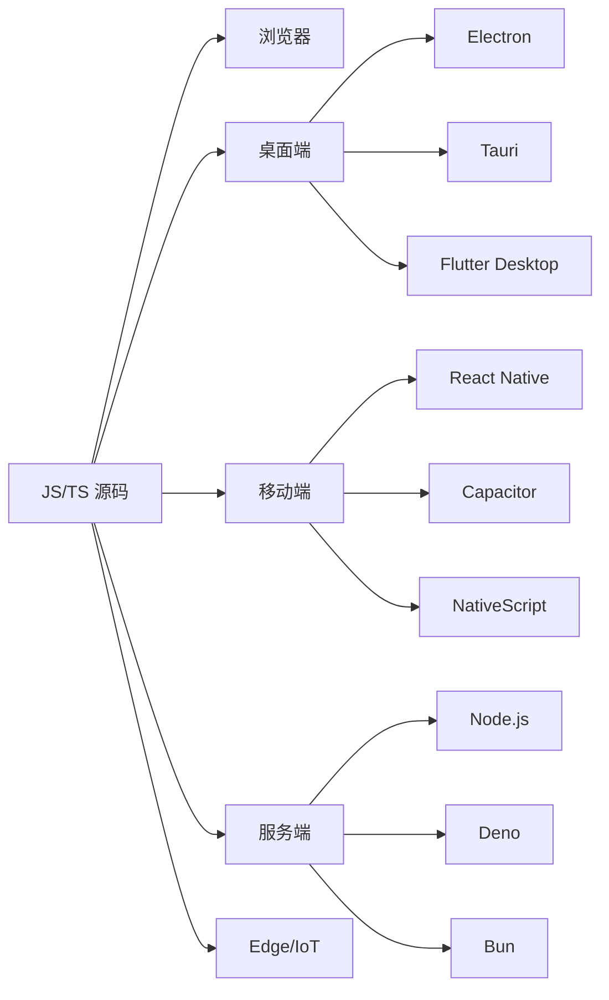

# 跨平台开发

> JavaScript/TypeScript 已经突破浏览器边界，成为真正的「全平台」开发语言。本专题覆盖数据可视化、桌面应用和移动端三大跨平台领域，帮助开发者选择最适合项目需求的技术方案。

## 跨平台技术全景



## 专题导航

| 专题 | 覆盖技术 | 说明 |
|------|----------|------|
| [数据可视化](./data-visualization) | D3.js, ECharts, Chart.js, Three.js, Observable Plot | 浏览器端数据呈现与交互 |
| [桌面应用开发](./desktop-development) | Electron, Tauri, Wails, Flutter Desktop | 跨操作系统桌面程序 |
| [移动端开发](./mobile-development) | React Native, Capacitor, NativeScript, Expo | iOS / Android 原生应用 |

## 技术选型矩阵

### 桌面端方案对比

| 维度 | Electron | Tauri | Wails | Flutter Desktop |
|------|----------|-------|-------|-----------------|
| 打包体积 | ~150MB | ~3MB | ~10MB | ~20MB |
| 前端技术 | HTML/CSS/JS | HTML/CSS/JS | HTML/CSS/JS | Dart |
| 后端语言 | Node.js | Rust | Go | Dart |
| 内存占用 | 高 | 低 | 中 | 中 |
| 生态成熟度 | ⭐⭐⭐⭐⭐ | ⭐⭐⭐⭐ | ⭐⭐⭐ | ⭐⭐⭐ |
| 代表应用 | VS Code, Slack | 1Password, Alacritty | Wails 官方示例 | 尚无大型应用 |

**选型建议**

- **Electron**：需要大量原生 Node API、快速迭代、团队熟悉 Web 技术
- **Tauri**：对包体积敏感、需要 Rust 生态、安全性要求高
- **Wails**：Go 后端团队、需要轻量级方案
- **Flutter Desktop**：已有 Flutter 移动应用、需要 UI 一致性

### 移动端方案对比

| 维度 | React Native | Capacitor | NativeScript | Expo |
|------|--------------|-----------|--------------|------|
| 渲染方式 | 原生组件 | WebView | 原生组件 | 原生组件 |
| 热更新 | ✅ CodePush | ✅ 内置 | ❌ | ✅ EAS Update |
| 原生 API | 桥接 | 插件系统 | 直接访问 | Expo SDK |
| 学习曲线 | 中 | 低 | 高 | 低 |
| 社区规模 | ⭐⭐⭐⭐⭐ | ⭐⭐⭐⭐ | ⭐⭐⭐ | ⭐⭐⭐⭐ |
| 代表应用 | Instagram, Airbnb | Ionic 应用 | 企业应用 | 大量初创应用 |

**选型建议**

- **React Native**：需要接近原生的性能、大型应用、长期维护
- **Capacitor**：已有 Web 应用、快速移植到移动端
- **Expo**：原型验证、MVP 开发、不需要自定义原生模块
- **NativeScript**：需要直接调用原生 API、Angular/Vue 技术栈

## 数据可视化技术栈

### 2D 图表

| 库 | 适用场景 | 特点 |
|----|----------|------|
| **ECharts** | 企业级仪表盘 | 功能全面、中文文档完善 |
| **Chart.js** | 简单图表 | 轻量、易上手 |
| **Observable Plot** | 数据探索 | 声明式语法、D3 团队出品 |
| **Victory** | React 生态 | React 原生组件 |
| **Recharts** | React 生态 | 组件化、可定制 |

### 3D 与地理可视化

| 库 | 适用场景 | 特点 |
|----|----------|------|
| **Three.js** | 3D 场景、游戏 | 功能最全面 |
| **Babylon.js** | 3D 游戏、VR | 微软出品、工具链完善 |
| **Deck.gl** | 地理数据可视化 | Uber 出品、大数据量 |
| **Mapbox GL JS** | 交互地图 | 矢量渲染、自定义样式 |
| **CesiumJS** | 3D 地球、GIS | 航天级精度 |

```typescript
// ECharts + TypeScript 示例
import * as echarts from 'echarts'

const chart = echarts.init(document.getElementById('main')!)

const option: echarts.EChartsOption = {
  title: { text: '月度销售额' },
  tooltip: {},
  xAxis: { data: ['1月', '2月', '3月'] },
  yAxis: {},
  series: [{
    name: '销售额',
    type: 'bar',
    data: [120, 200, 150]
  }]
}

chart.setOption(option)
```

## 跨平台架构模式

### 共享业务逻辑层

```
├── packages/
│   ├── core/           ← 纯 TypeScript 业务逻辑（平台无关）
│   ├── types/          ← 共享类型定义
│   ├── api-client/     ← 数据层
│   └── utils/          ← 工具函数
├── apps/
│   ├── web/            ← React / Vue 前端
│   ├── desktop/        ← Electron / Tauri 壳 + web UI
│   ├── mobile/         ← React Native / Capacitor
│   └── server/         ← Node.js / Deno 后端
```

### 条件编译与平台判断

```typescript
// 平台判断常量
const isBrowser = typeof window !== 'undefined'
const isNode = typeof process !== 'undefined' && process.versions?.node
const isElectron = isBrowser && process?.versions?.electron
const isReactNative = typeof navigator !== 'undefined' && navigator.product === 'ReactNative'

// 平台适配器模式
interface StorageAdapter {
  get(key: string): Promise<string | null>
  set(key: string, value: string): Promise<void>
}

const storage: StorageAdapter = isReactNative
  ? new AsyncStorageAdapter()
  : isBrowser
    ? new LocalStorageAdapter()
    : new FileStorageAdapter()
```

## 性能优化要点

### 桌面端

| 问题 | 方案 | 工具 |
|------|------|------|
| 启动慢 | 延迟加载、代码分割 | Vite 动态导入 |
| 内存泄漏 | 销毁时清理事件监听 | DevTools Memory |
| 包体积大 | Tree shaking、压缩 | esbuild, terser |
| 原生 API 调用 | IPC 桥接优化 | Electron contextBridge |

### 移动端

| 问题 | 方案 | 工具 |
|------|------|------|
| 启动白屏 | 启动屏 + 骨架屏 | Expo SplashScreen |
| JS 线程卡顿 | Hermes 引擎、Worklet | React Native Performance |
| 列表滚动卡顿 | 虚拟列表、图片懒加载 | FlashList, FlatList |
| 包体积过大 | ProGuard / Hermes 字节码 | Android App Bundle |

## 相关资源

- [Electron 官方文档](https://www.electronjs.org/docs)
- [Tauri 官方文档](https://tauri.app/)
- [React Native 官方文档](https://reactnative.dev/)
- [Capacitor 官方文档](https://capacitorjs.com/)
- [Three.js 官方文档](https://threejs.org/docs/)
- [ECharts 官方文档](https://echarts.apache.org/)

## 交叉引用

- [桌面开发分类](../categories/desktop-development) — 详细工具列表
- [移动端开发分类](../categories/mobile-development) — 详细工具列表
- [数据可视化分类](../categories/data-visualization) — 详细工具列表
- [Rust 工具链](../categories/rust-toolchain) — Tauri 依赖的 Rust 生态
