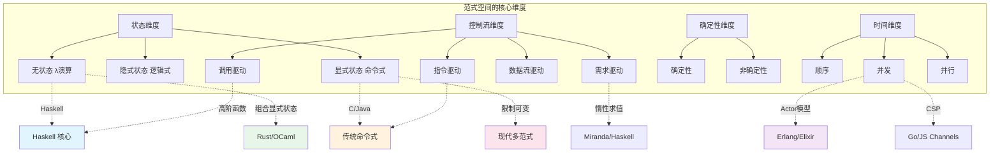
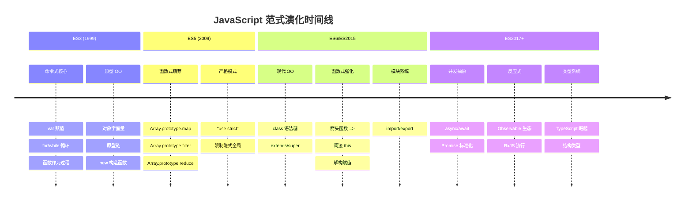
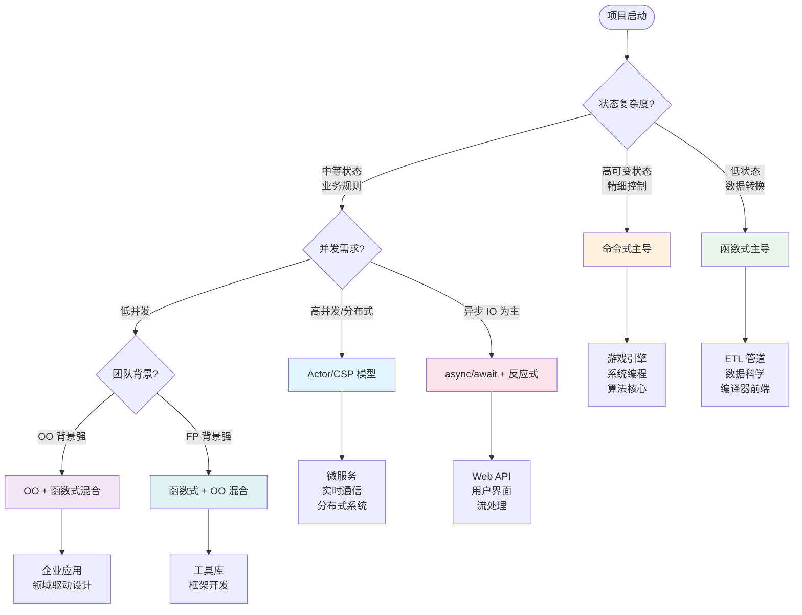
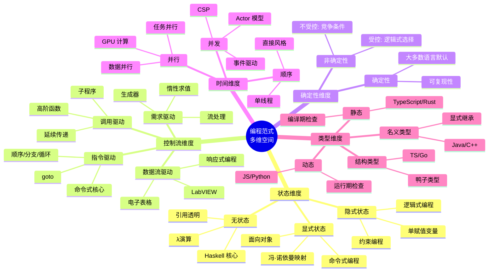

# 范式总论：维度的定义与分类

## 引言

编程范式（Programming Paradigm）并非仅仅是语法风格的差异，而是对「计算本质」的不同形式化抽象。
当我们讨论面向对象、函数式或逻辑式编程时，实际上是在讨论如何组织状态、控制流与数据之间的基本关系。
Peter Van Roy 在其巨著《Concepts, Techniques, and Models of Computer Programming》中提出了一个深刻的洞见：编程范式应当依据「计算模型」的维度进行系统性分类，而非依据表面语法或流行术语。

现代软件工程面临的核心矛盾在于：理论上的纯粹性与工程上的实用性之间存在不可调和的张力。
没有一种单一范式能够最优地解决所有问题域的需求。
TypeScript、Scala、Rust、OCaml 等现代语言纷纷走向多范式（Multi-paradigm）设计，这并非语言设计者的妥协，而是对计算本质复杂性的诚实回应。

本文将从形式化定义出发，构建一个多维度的范式分类框架，然后映射到工程实践中的决策模型，最终落脚于 JavaScript/TypeScript 生态的范式演化路径。

## 理论严格表述

### 编程范式的形式化定义

从形式语义学的角度，编程范式可以被定义为**一个三元组** `(S, C, E)`，其中：

- `S`（State Model）：状态的组织与访问方式
- `C`（Control Model）：计算的控制流结构
- `E`（Evaluation Model）：表达式的求值策略

不同的范式在这个三元组的各个维度上做出不同的选择，从而形成截然不同的抽象层级与推理模式。

### Van Roy 的维度分类法

Peter Van Roy 提出了一个多维分类框架，将编程范式按照六个核心维度进行解构：

#### 1. 状态维度：显式状态 vs 隐式状态 vs 无状态

状态是计算的命脉，但状态的管理方式决定了代码的可推理性。

- **无状态（Stateless）**：纯函数式编程的理想境界，任何表达式的值仅依赖于其输入参数。λ演算、Haskell 的核心语义属于此类。
- **隐式状态（Implicit State）**：状态存在，但对程序员不可见或不可变。例如，单赋值变量（Single-assignment variables）、逻辑式编程中的约束存储。
- **显式状态（Explicit State）**：程序员直接通过赋值操作操纵命名存储单元。这是命令式编程的核心特征，也是冯·诺依曼架构的直接映射。

显式状态引入了**时间维度**上的复杂性：同一变量在不同时间点的值可能不同，这使得替换公理（Substitutability）失效，程序正确性证明必须引入时序逻辑（Temporal Logic）或霍尔逻辑（Hoare Logic）。

#### 2. 确定性维度：确定性 vs 非确定性

确定性维度刻画了给定相同输入时，程序是否总是产生相同的计算轨迹和结果。

- **确定性（Deterministic）**：大多数主流语言默认处于此模式。每一步计算的后续状态唯一确定。
- **非确定性（Nondeterministic）**：存在选择点，不同执行路径可能导致不同结果。并发编程中的竞争条件（Race Condition）是一种**非受控非确定性**；逻辑式编程中的选择构造则提供**受控非确定性**（Don’t-know nondeterminism）。

非确定性的引入使得测试的完备性成为不可判定问题——我们无法通过有限次测试覆盖所有可能的执行交错（Interleaving）。

#### 3. 时间模型维度：顺序 vs 并发 vs 并行

时间模型决定了计算步骤之间的时序关系。

- **顺序（Sequential）**：计算步骤按全序关系执行。这是最容易推理的模型，也是大多数程序员直觉的基础。
- **并发（Concurrent）**：多个计算活动（Activity）同时进行，但未必在物理上同时执行。并发的本质是**结构问题**——如何将问题分解为可同时推进的独立单元。Actor 模型、CSP（Communicating Sequential Processes）均属于并发模型。
- **并行（Parallel）**：多个计算步骤在物理上同时执行，其目标是提高性能。并行是**性能问题**，通常需要数据并行（Data Parallelism）或任务并行（Task Parallelism）的支持。

JavaScript 的 Event Loop 是一个有趣的案例：它在单线程上实现了并发（通过异步回调与事件调度），但不具备真正的并行能力（直到 Web Worker 和 `Atomics` 的出现）。

#### 4. 命名维度：变量 vs 值 vs 引用

命名机制决定了标识符与其实体之间的绑定关系。

- **变量（Variable）**：标识符绑定到一个存储单元，其内容可变。命令式编程的标准模型。
- **值（Value）**：标识符绑定到一个不可变的值。函数式编程的标准模型，支持引用透明（Referential Transparency）。
- **引用（Reference）**：标识符绑定到一个间接层，通过该间接层访问实体。面向对象编程中的对象引用、指针均属于此类。

TypeScript 的 `const` 声明引入了一个微妙的中间状态：`const x = { a: 1 }` 中，`x` 绑定到引用（命名不可变），但 `{ a: 1 }` 的内容可变。这种**浅不变性**是许多 Bug 的根源。

#### 5. 控制流维度：指令 vs 调用 vs 数据流 vs 需求驱动

控制流维度刻画了「下一步执行什么」的决策机制。

- **指令驱动（Instruction-driven）**：程序计数器（Program Counter）按顺序推进，控制流由显式跳转（goto、条件分支、循环）决定。命令式编程的核心。
- **调用驱动（Call-driven）**：计算通过函数/过程的嵌套调用来组织。子程序调用与返回构成控制流的基本骨架。
- **数据流驱动（Data-driven）**：计算的触发依赖于数据的可用性。当所有输入数据就绪时，操作自动执行。数据流语言（如 LabVIEW）和响应式编程（Reactive Programming）属于此类。
- **需求驱动（Demand-driven）**：计算仅在结果被需要时才触发。惰性求值（Lazy Evaluation）是典型代表，Haskell 的无限列表、Python 的生成器均利用此机制。

#### 6. 类型维度：静态 vs 动态，名义 vs 结构

虽然 Van Roy 的原初框架未将类型系统作为核心维度，但在现代语言设计中，类型维度已成为不可回避的范式选择。

- **静态类型（Static Typing）**：类型检查在编译期完成，错误被提前捕获。TypeScript、Rust、OCaml 属于此类。
- **动态类型（Dynamic Typing）**：类型检查在运行期完成，提供更大的灵活性但牺牲了早期错误检测。JavaScript、Python、Ruby 属于此类。
- **名义类型（Nominal Typing）**：类型等价基于显式声明的继承/实现关系。Java、C# 的核心模型。
- **结构类型（Structural Typing）**：类型等价基于结构兼容性（Shape Compatibility）。TypeScript 的标志性特征：`{ x: number }` 与接口 `Point` 只要结构匹配即可互换。

### 范式空间的多维图解

将上述维度组合，我们得到一个高维的「范式空间」。每一种具体的编程语言或风格都是这个空间中的一个点或区域。



### Turing Tarpit 与表达能力

在范式讨论中，一个常被误解的概念是「表达能力」。所有图灵完备（Turing-complete）的语言在可计算函数的集合上是等价的——它们都能计算相同的函数类。然而，**表达能力 ≠ 编程便利性**。

Alan Perlis 的名言精准地捕捉了这一区别：「一种不能改变你思维方式的编程语言是不值得学习的。」范式的真正价值在于**认知压缩**（Cognitive Compression）——某些问题在特定范式下的表达更为简洁、更接近问题域的自然结构。

Bjarne Stroustrup 指出：「不同范式的存在不是为了告诉我们什么不能做，而是为了告诉我们什么不应该做——以及什么更容易做。」

**Turing Tarpit**（图灵陷阱）指的是那些图灵完备但极其难以使用的语言或系统。Brainfuck、Unlambda 等 esolang 是极端例子，但工程实践中也存在「意外陷入图灵陷阱」的情况：用纯回调（Callback Hell）处理复杂异步流，本质上就是在命令式语言中人为构造了难以推理的控制流结构。

### 范式迁移的代价模型

从一种主导范式迁移到另一种，其成本可以用以下公式近似刻画：

```
Migration_Cost = Learning_Curve × Codebase_Size × Team_Size × Paradigm_Distance
```

其中：

- **Learning_Curve**：新范式的概念密度。从命令式迁移到面向对象相对平缓；迁移到函数式或逻辑式则陡峭得多。
- **Paradigm_Distance**：两种范式在状态、控制流、命名维度上的差异程度。命令式到函数式的距离远大于命令式到面向对象的距离。
- **Codebase_Size & Team_Size**：规模放大效应。

Philip Wadler 在「The Essence of Functional Programming」中论证：一旦团队掌握了单子（Monad）等抽象，从命令式到函数式的迁移收益将呈指数级增长——但前期成本是真实的，不可低估。

## 工程实践映射

### 为什么现代语言都是多范式的

单一范式的纯粹性在学术研究和特定领域（如编译器构造、定理证明）中具有价值，但在通用软件开发中，多范式设计已成为事实标准。原因如下：

1. **问题域的异质性（Heterogeneity）**：一个典型的 Web 应用同时涉及：IO 密集型操作（适合异步/并发范式）、业务规则引擎（适合声明式/函数式）、性能敏感的核心算法（适合命令式/底层优化）。

2. **团队构成的多样性**：不同背景的开发者在不同范式下有更高的生产力。多范式语言允许「在正确的地方使用正确的抽象」。

3. **渐进 adoptability**：团队可以逐步引入新范式，而非全盘重写。TypeScript 允许在 `.ts` 文件中混合使用类（面向对象）、高阶函数（函数式）、`async/await`（并发抽象）和原始循环（命令式）。

| 语言 | 命令式 | 面向对象 | 函数式 | 并发/并行 | 类型系统 |
|------|--------|----------|--------|-----------|----------|
| TypeScript | ✅ 原生 | ✅ 原型/类 | ✅ 高阶函数 | ✅ Promise/async | 结构/静态 |
| Scala | ✅ | ✅ 混合 | ✅ 纯函数 | ✅ Actor/Future | 名义/静态 |
| Rust | ✅ | ✅ Trait | ✅ 闭包/迭代器 | ✅ 所有权并发 | 名义/静态 |
| OCaml | ✅ | ✅ 对象系统 | ✅ 代数数据类型 | ✅ 轻量级线程 | 结构/静态 |
| Python | ✅ | ✅ 类 | ⚠️ 有限 | ⚠️ GIL限制 | 动态 |

上表揭示了一个关键洞察：**现代高级语言都在「命令式骨架 + 函数式血肉 + 面向对象皮肤」的混合模型中收敛**。差异主要在于类型系统和并发模型的设计选择。

### JavaScript 的范式演化史

JavaScript 的演化是观察范式如何在已有语言上叠加的绝佳案例。由于历史原因，JS 的设计深受 Scheme（函数式）和 Self（原型面向对象）的双重影响，使其天生具备多范式基因。



**ES3 时代（1999-2009）**：JavaScript 主要被视为一种轻量级的命令式脚本语言，带有奇特的原型对象系统。`var`、函数声明、`for` 循环构成了代码的主体。

**ES5 时代（2009-2015）**：随着 V8 引擎的出现和 Node.js 的诞生，JS 开始承担服务端编程任务。数组的高阶函数（`map`、`filter`、`reduce`）被广泛使用，函数式编程风格开始渗透。同时，严格模式（`"use strict"`）限制了部分动态特性，使代码更易于静态分析。

**ES6/ES2015 时代**：这是 JS 范式演化的分水岭。`class` 语法糖使面向对象风格对 Java/C# 背景的开发者更加友好；箭头函数和解构赋值大幅降低了函数式风格的语法噪音；模块系统使大规模代码组织成为可能。

**ES2017+ 时代**：`async/await` 的引入是一个范式级别的突破——它将基于 Promise 的回调驱动控制流，重新映射为看似顺序的控制流结构，极大地降低了并发编程的认知负荷。与此同时，TypeScript 的崛起为 JS 添加了静态类型维度，RxJS 等库推广了反应式（数据流驱动）编程。

### 范式选择对团队的影响

选择何种范式作为项目的主导风格，是一个涉及技术、人员与组织的综合决策。

#### 认知负荷（Cognitive Load）

John Sweller 的认知负荷理论将认知负荷分为三类：

- **内在负荷（Intrinsic）**：问题本身的复杂性，与范式无关。
- **外在负荷（Extraneous）**：由不良表达或范式错配导致的额外心智负担。
- **相关负荷（Germane）**：用于构建深层理解的投入。

范式选择直接影响外在负荷。例如，在一个以数据转换为核心的 ETL 管道项目中，使用命令式循环和手动状态管理的外在负荷远高于声明式的函数组合（如 `pipeline.map().filter().groupBy()`）。相反，在需要精细控制内存布局和执行时序的图形渲染引擎中，纯函数式风格的惰性求值和不可变数据可能成为性能瓶颈，增加外在负荷。

#### 招聘与团队建设

范式的选择深刻影响人才市场的可及性：

- **命令式/面向对象主导**：人才池最大，但质量方差也最大。
- **函数式主导**：人才池较小，但通常具备更强的抽象思维训练（前提是真的理解，而非仅使用 `map` 替代 `for`）。
- **类型驱动开发（Type-Driven Development）**：需要团队具备类型级别的推理能力，招聘难度高，但长期维护成本显著降低。

TypeScript 的优势在于其**渐进式类型系统**：团队可以从宽松的 `any` 开始，逐步收紧类型约束，在招聘灵活性和长期代码质量之间取得平衡。

#### 生态与工具链

范式选择还受限于生态系统。JS/TS 生态在命令式和面向对象方面有最成熟的工具链（调试器、IDE 支持、性能分析器），而函数式工具链（如 fp-ts、Ramda 的 TypeScript 支持）虽然强大，但在错误信息可读性和 IDE 自动完成方面仍有差距。

### 如何判断项目适合哪种范式主导

以下决策树可作为项目范式选择的启发式框架：



**关键决策原则**：

1. **状态密度测试**：如果代码中超过 30% 的函数显式修改外部状态，命令式或面向对象范式更为自然。
2. **数据流方向**：如果数据主要沿一个方向流动（输入 → 转换 → 输出），函数式或数据流范式更优。
3. **错误处理模式**：如果错误处理路径复杂且需要跨越多个调用层级，函数式的 `Result<T, E>` 类型（如 Rust 的 `Result` 或 fp-ts 的 `Either`）往往比异常抛出更清晰。
4. **性能约束**：在热路径（Hot Path）中，命令式的局部变量和显式循环通常优于函数式的不可变数据和高阶函数组合（V8 引擎对某些函数式模式有优化，但仍有开销）。

### 多范式代码的 TS 示例

以下 TypeScript 代码展示了如何在同一模块中融合多种范式：

```typescript
// 命令式：显式状态管理（性能敏感的数据预处理）
function imperativePreprocess(data: number[]): number[] {
  const result: number[] = [];
  for (let i = 0; i < data.length; i++) {
    const val = data[i];
    if (val > 0) {
      result.push(val * 2);
    }
    if (result.length >= 100) break; // 显式控制流
  }
  return result;
}

// 函数式：声明式数据转换（业务逻辑层）
const functionalPipeline = (data: number[]) =>
  data
    .filter((x) => x > 0)
    .map((x) => x * 2)
    .slice(0, 100);

// 面向对象：封装与接口抽象（领域模型）
interface DataProcessor {
  process(data: number[]): number[];
}

class OptimizedProcessor implements DataProcessor {
  private cache = new Map<string, number[]>();

  process(data: number[]): number[] {
    const key = JSON.stringify(data);
    if (this.cache.has(key)) {
      return this.cache.get(key)!;
    }
    const result = imperativePreprocess(data); // 复用命令式实现
    this.cache.set(key, result);
    return result;
  }
}

// 并发抽象：async/await 恢复结构化控制流
async function concurrentProcess(
  sources: string[],
  processor: DataProcessor
): Promise<number[][]> {
  const responses = await Promise.all(
    sources.map((url) => fetch(url).then((r) => r.json()))
  );
  return responses.map((data) => processor.process(data));
}
```

这段代码没有固守单一范式，而是在不同抽象层级选择了最适合的工具：命令式用于底层优化，函数式用于中层转换，面向对象用于高层封装，`async/await` 用于并发抽象。这正是多范式设计的精髓。

## Mermaid 图表：范式空间全景图



## 理论要点总结

1. **范式的形式化定义**：编程范式是状态模型、控制模型和求值模型的三元组，不同范式在这三个维度上做出不同选择。

2. **Van Roy 的六维分类**：状态（显式/隐式/无）、确定性（确定/非确定）、时间模型（顺序/并发/并行）、命名（变量/值/引用）、控制流（指令/调用/数据流/需求驱动）、类型系统（静态/动态，名义/结构）构成了完整的范式分析框架。

3. **图灵完备不等于等价**：所有图灵完备语言在可计算性上等价，但在表达特定问题的便利性上差异巨大。范式的价值在于认知压缩和思维方式的塑造。

4. **多范式是现代语言的必然选择**：问题域的异质性、团队构成的多样性和生态系统的成熟度决定了单一范式无法满足通用开发需求。TypeScript、Rust、Scala、OCaml 代表了多范式设计的不同平衡点。

5. **范式迁移具有真实成本**：学习曲线、范式距离、代码库规模和团队规模共同决定了迁移的可行性。渐进式引入（如 TS 的类型系统或 JS 的函数式工具）是降低风险的有效策略。

6. **JavaScript 的范式演化反映了语言演化的普遍规律**：从简单的命令式脚本，逐步叠加函数式、面向对象、并发和类型系统维度，最终在保持向后兼容的前提下实现了表达能力的大幅跃升。

## 参考资源

### 核心文献

- Peter Van Roy, Seif Haridi. *Concepts, Techniques, and Models of Computer Programming*. MIT Press, 2004. —— 编程范式分类的权威著作，提出了基于计算模型的多维分类框架。
- Bjarne Stroustrup. *The C++ Programming Language, 4th Edition*. Addison-Wesley, 2013. —— Stroustrup 在书中系统阐述了多范式设计的哲学，C++ 是命令式、面向对象和泛型编程融合的典范。
- Philip Wadler. "The Essence of Functional Programming". *Proceedings of POPL*, 1992. —— Wadler 通过单子（Monad）概念揭示了命令式效果如何在纯函数式语言中被系统性地建模。

### 延伸阅读

- Alan J. Perlis. "Epigrams on Programming". *ACM SIGPLAN Notices*, Vol. 17, No. 9, 1982. —— 包含「一种不能改变你思维方式的编程语言是不值得学习的」等关于范式价值的经典论述。
- Edsger W. Dijkstra. "The Humble Programmer". *Turing Award Lecture*, 1972. —— Dijkstra 对编程思维层次的深刻反思，为后续结构化编程和范式研究奠定了思想基础。
- Simon Peyton Jones. "The Implementation of Functional Programming Languages". Prentice Hall, 1987. —— 虽然偏重实现，但详细讨论了惰性求值等需求驱动模型的语义基础。

### Web 资源

- [MDN Web Docs: Programming Paradigms](https://developer.mozilla.org/en-US/docs/Glossary/Programming_paradigm) —— Mozilla 开发者网络对主流编程范式的概览。
- [TypeScript Handbook: Type Compatibility](https://www.typescriptlang.org/docs/handbook/type-compatibility.html) —— TypeScript 结构类型系统的官方文档，理解 TS 范式特性的核心参考。
